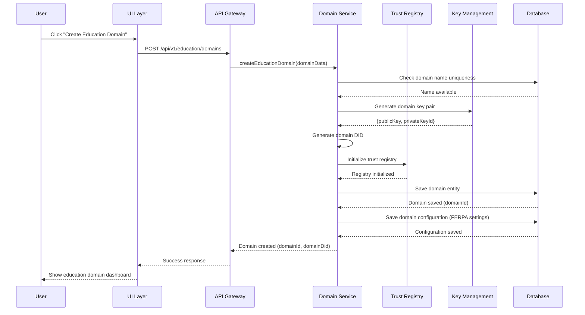
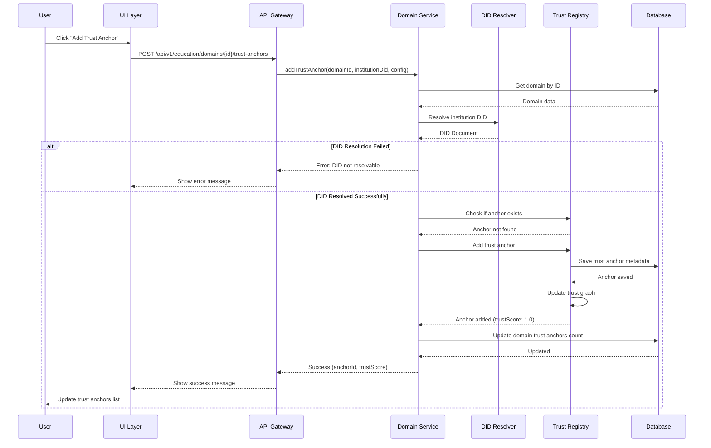
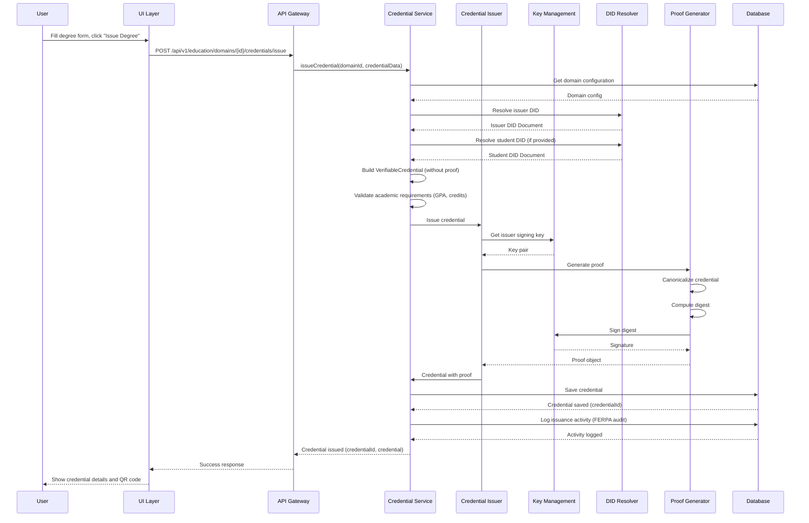
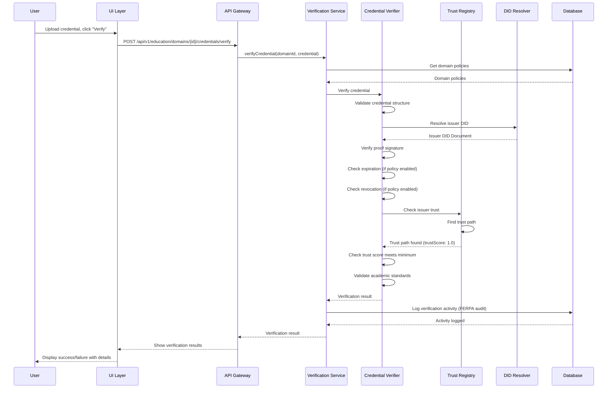
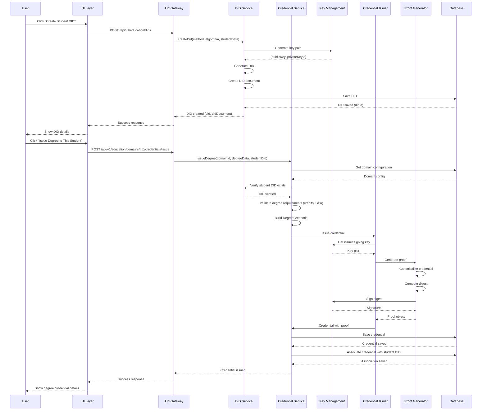
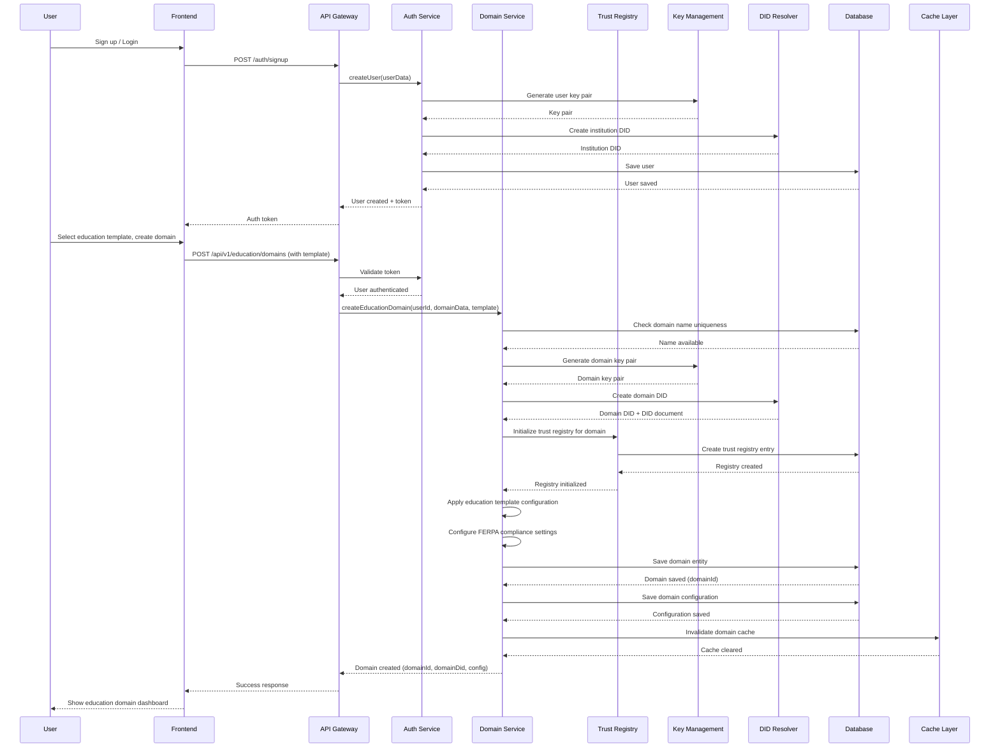

# Education Domain UX Guide - User Experience Documentation for Educational Use Cases

## Table of Contents

1. [Overview](#overview)
2. [User Journey: Creating an Education Trusted Domain](#user-journey-creating-an-education-trusted-domain)
3. [Backend Sequence Diagrams](#backend-sequence-diagrams)
4. [Scenario: Creating a Student DID and Issuing Academic Credentials](#scenario-creating-a-student-did-and-issuing-academic-credentials)
5. [Scenario: Updating an Academic Credential](#scenario-updating-an-academic-credential)
6. [Scenario: Revoking an Academic Credential](#scenario-revoking-an-academic-credential)
7. [Scenario: Student Wallet Management](#scenario-student-wallet-management)
8. [Scenario: Verifiable Presentations & Selective Disclosure](#scenario-verifiable-presentations--selective-disclosure)
9. [Scenario: Blockchain Anchoring for Academic Records](#scenario-blockchain-anchoring-for-academic-records)
10. [Scenario: Academic Smart Contracts](#scenario-academic-smart-contracts)
11. [Error Handling & Edge Cases](#error-handling--edge-cases)
12. [Mobile UX Considerations](#mobile-ux-considerations)

---

## Overview

This document provides a comprehensive guide to the user experience for creating, configuring, and using Trusted Domains in TrustWeave specifically for educational institutions. It includes detailed screen flows, backend sequence diagrams, and scenarios for common educational operations such as issuing degrees, transcripts, certificates, and managing student credentials.

### Key Concepts

- **Education Trusted Domain**: A container for educational trust anchors (universities, schools, certification bodies), credential types (degrees, transcripts, certificates), and policies that define who can issue what academic credentials
- **Trust Anchor**: An educational institution DID that is trusted within a domain to issue specific credential types (e.g., a university authorized to issue degree credentials)
- **Trust Path**: A chain of trust relationships connecting a verifier (employer, graduate school) to an issuer (university, certification body)
- **Trust Score**: A numerical value (0.0-1.0) indicating the strength of trust relationship between institutions

### Education-Specific Use Cases

- **Academic Credentials**: Degrees, diplomas, certificates, and transcripts
- **Continuing Education**: Professional development certificates and continuing education credits
- **Skills Credentials**: Micro-credentials, badges, and skill certifications
- **Transfer Credits**: Verified course credits for transfer between institutions
- **Student Verification**: Identity verification for students applying to programs or employers
- **Institutional Accreditation**: Accreditation credentials for educational institutions

---

## User Journey: Creating an Education Trusted Domain

### Phase 1: Onboarding & Domain Creation

#### Step 1: Welcome & Signup

**Screen: Welcome Page**

```
┌─────────────────────────────────────────────────────────┐
│  TrustWeave Education - Verifiable Academic Credentials │
│                                                           │
│  Issue, verify, and manage academic credentials         │
│  with blockchain-anchored trust                          │
│                                                           │
│  [Get Started]  [Learn More]  [View Documentation]      │
└─────────────────────────────────────────────────────────┘
```

**User Action:** Clicks "Get Started"

**System Response:** Redirects to signup page

---

#### Step 2: Account Creation

**Screen: Signup Form**

```
┌─────────────────────────────────────────────────────────┐
│  Create Your TrustWeave Education Account                │
│                                                           │
│  Email:                                                  │
│  ┌─────────────────────────────────────────────────────┐ │
│  │ registrar@stateuniversity.edu                        │ │
│  └─────────────────────────────────────────────────────┘ │
│                                                           │
│  Password:                                               │
│  ┌─────────────────────────────────────────────────────┐ │
│  │ ••••••••••                                          │ │
│  └─────────────────────────────────────────────────────┘ │
│                                                           │
│  Institution Name:                                       │
│  ┌─────────────────────────────────────────────────────┐ │
│  │ State University                                     │ │
│  └─────────────────────────────────────────────────────┘ │
│                                                           │
│  Institution Type:                                       │
│  ┌─────────────────────────────────────────────────────┐ │
│  │ University/College                                   │ │
│  └─────────────────────────────────────────────────────┘ │
│                                                           │
│  ☐ I agree to Terms of Service and Privacy Policy       │
│                                                           │
│  [Create Account]                                         │
│                                                           │
│  Already have an account? [Sign In]                      │
└─────────────────────────────────────────────────────────┘
```

**Backend Events:**
1. Validate email format
2. Check password strength
3. Check if email already exists
4. Create user account
5. Generate institution DID
6. Create default key pair
7. Initialize user session

---

#### Step 3: Initial Setup Wizard

**Screen: "Let's Set Up Your Education Trust Domain"**

```
┌─────────────────────────────────────────────────────────┐
│  Step 1 of 3: What will you use TrustWeave Education for?│
│                                                           │
│  Select a template to get started quickly:              │
│                                                           │
│  ┌─────────────────────────────────────────────────────┐ │
│  │ 🎓 Degree & Transcript Management                    │ │
│  │    Issue degrees, transcripts, and academic records │ │
│  │    [Select]                                           │ │
│  └─────────────────────────────────────────────────────┘ │
│                                                           │
│  ┌─────────────────────────────────────────────────────┐ │
│  │ 📜 Continuing Education & Certificates               │ │
│  │    Professional development and certification programs│ │
│  │    [Select]                                           │ │
│  └─────────────────────────────────────────────────────┘ │
│                                                           │
│  ┌─────────────────────────────────────────────────────┐ │
│  │ 🏅 Skills & Micro-Credentials                        │ │
│  │    Issue badges and skills-based credentials         │ │
│  │    [Select]                                           │ │
│  └─────────────────────────────────────────────────────┘ │
│                                                           │
│  ┌─────────────────────────────────────────────────────┐ │
│  │ 🔗 Transfer Credit Verification                      │ │
│  │    Verify and transfer credits between institutions │ │
│  │    [Select]                                           │ │
│  └─────────────────────────────────────────────────────┘ │
│                                                           │
│  ┌─────────────────────────────────────────────────────┐ │
│  │ 🏛️ Institutional Accreditation                       │ │
│  │    Manage accreditation credentials for institutions │ │
│  │    [Select]                                           │ │
│  └─────────────────────────────────────────────────────┘ │
│                                                           │
│  ┌─────────────────────────────────────────────────────┐ │
│  │ ⚙️ Custom Education Use Case                         │ │
│  │    Start from scratch with a blank domain            │ │
│  │    [Select]                                           │ │
│  └─────────────────────────────────────────────────────┘ │
│                                                           │
│  [Skip for Now]                                           │
└─────────────────────────────────────────────────────────┘
```

**User Action:** Selects "Degree & Transcript Management"

**System Response:**
- Loads Degree & Transcript Management template configuration
- Pre-populates credential types (DegreeCredential, TranscriptCredential, DiplomaCredential)
- Shows template preview

---

#### Step 4: Domain Creation

**Screen: "Create Your Education Trust Domain"**

```
┌─────────────────────────────────────────────────────────┐
│  Step 2 of 3: Create Your Education Trust Domain        │
│                                                           │
│  Based on your selection, we'll set up a Degree &       │
│  Transcript Management domain with smart defaults.       │
│                                                           │
│  Domain Name: *                                          │
│  ┌─────────────────────────────────────────────────────┐ │
│  │ State University Academic Records                    │ │
│  └─────────────────────────────────────────────────────┘ │
│  💡 This name will be visible to all domain members      │
│                                                           │
│  Description (optional):                                  │
│  ┌─────────────────────────────────────────────────────┐ │
│  │ Issue and manage academic credentials including     │ │
│  │ degrees, transcripts, and academic certifications   │ │
│  └─────────────────────────────────────────────────────┘ │
│                                                           │
│  Domain Visibility:                                      │
│  ○ Private (only you can see)                            │
│  ● Organization (all org members can see)                 │
│  ○ Public (anyone can discover)                          │
│                                                           │
│  Pre-configured Settings:                                │
│  ✓ Credential Types: DegreeCredential,                    │
│    TranscriptCredential, DiplomaCredential                │
│  ✓ Default Policies: Expiration checks,                  │
│    Revocation checks enabled                             │
│  ✓ Academic Standards: FERPA compliance,                 │
│    Student privacy protection                            │
│                                                           │
│  [← Back]  [Create Domain]                                │
└─────────────────────────────────────────────────────────┘
```

**User Action:** Enters "State University Academic Records", clicks "Create Domain"

**Backend Events:**
1. Validate domain name (uniqueness within organization)
2. Create domain entity in database
3. Generate domain DID
4. Create domain key pair
5. Initialize trust registry for domain
6. Apply template configuration
7. Create default policies (including FERPA compliance settings)
8. Return domain ID and DID

---

### Phase 2: Configuring Trust Anchors

#### Step 5: Add Trust Anchors

**Screen: "Add Educational Trust Anchors"**

```
┌─────────────────────────────────────────────────────────┐
│  Add Educational Trust Anchors to Your Domain           │
│                                                           │
│  Trust anchors are educational institutions you trust    │
│  to issue credentials. You can add them now or later.   │
│                                                           │
│  Search for institutions:                                │
│  ┌─────────────────────────────────────────────────────┐ │
│  │ 🔍 Search by name, DID, or domain...                 │ │
│  └─────────────────────────────────────────────────────┘ │
│                                                           │
│  Suggested for Academic Records:                         │
│                                                           │
│  ┌─────────────────────────────────────────────────────┐ │
│  │ 🎓 Regional Accreditation Board                      │ │
│  │    did:key:z6MkhaXgBZDvotDkL5257faiztiGiC2QtKLGp... │ │
│  │    Issues: AccreditationCredential                  │ │
│  │    Trust Score: N/A (not yet added)                 │ │
│  │    [Add to Domain]                                   │ │
│  └─────────────────────────────────────────────────────┘ │
│                                                           │
│  ┌─────────────────────────────────────────────────────┐ │
│  │ 🏛️ National Student Clearinghouse                    │ │
│  │    did:key:z6MkhaXgBZDvotDkL5257faiztiGiC2QtKLGp... │ │
│  │    Issues: TranscriptVerificationCredential         │ │
│  │    Trust Score: N/A (not yet added)                 │ │
│  │    [Add to Domain]                                   │ │
│  └─────────────────────────────────────────────────────┘ │
│                                                           │
│  ┌─────────────────────────────────────────────────────┐ │
│  │ 🎓 Partner Universities                              │ │
│  │    For transfer credit verification                  │ │
│  │    [Browse Partner Network]                          │ │
│  └─────────────────────────────────────────────────────┘ │
│                                                           │
│  Or add manually:                                        │
│  [Add Custom Institution]  [Import from File]            │
│                                                           │
│  Current Trust Anchors (0):                              │
│  No trust anchors added yet                              │
│                                                           │
│  [← Back]  [Continue with 0 anchors]  [Skip for Now]     │
└─────────────────────────────────────────────────────────┘
```

**User Action:** Clicks "Add to Domain" for Regional Accreditation Board

**Backend Events:**
1. Resolve institution DID
2. Fetch institution DID document
3. Validate DID resolution
4. Check if institution already exists in domain
5. Add trust anchor to domain's trust registry
6. Configure credential type restrictions
7. Update domain trust graph
8. Return success confirmation

---

#### Step 6: Configure Trust Anchor Details

**Screen: "Configure Trust Anchor"**

```
┌─────────────────────────────────────────────────────────┐
│  Configure Trust Anchor: Regional Accreditation Board   │
│                                                           │
│  Institution Information:                                │
│  ┌─────────────────────────────────────────────────────┐ │
│  │ DID: did:key:z6MkhaXgBZDvotDkL5257faiztiGiC2QtKLGp│ │
│  │ Display Name: Regional Accreditation Board           │ │
│  │ Status: ✓ DID Resolved                               │ │
│  └─────────────────────────────────────────────────────┘ │
│                                                           │
│  Credential Types (select all that apply):               │
│  ☑ AccreditationCredential                              │
│  ☑ InstitutionVerificationCredential                     │
│  ☐ DegreeCredential                                     │
│  ☐ TranscriptCredential                                 │
│                                                           │
│  Trust Level:                                            │
│  ┌─────────────────────────────────────────────────────┐ │
│  │ ●─────○─────○─────○─────○                          │ │
│  │ 1.0   0.8  0.6  0.4  0.2  0.0                      │ │
│  │ Direct Trust (1.0)                                  │ │
│  └─────────────────────────────────────────────────────┘ │
│                                                           │
│  Description:                                            │
│  ┌─────────────────────────────────────────────────────┐ │
│  │ Regional accrediting body for educational institutions│ │
│  └─────────────────────────────────────────────────────┘ │
│                                                           │
│  Constraints:                                            │
│  ☑ Require blockchain anchoring                         │
│  ☑ Require expiration date                              │
│  ☑ Require revocation list                              │
│                                                           │
│  [Cancel]  [Save Trust Anchor]                           │
└─────────────────────────────────────────────────────────┘
```

**User Action:** Configures credential types, clicks "Save Trust Anchor"

**Backend Events:**
1. Validate credential type selections
2. Update trust anchor metadata
3. Save to trust registry
4. Update trust graph visualization
5. Return updated trust anchor info

---

### Phase 3: Domain Configuration

#### Step 7: Configure Policies

**Screen: "Education Domain Policies"**

```
┌─────────────────────────────────────────────────────────┐
│  Configure Education Domain Policies                    │
│                                                           │
│  Verification Settings:                                  │
│  ☑ Check credential expiration                          │
│  ☑ Check credential revocation                           │
│  ☑ Verify issuer DID resolution                         │
│  ☑ Require blockchain anchoring                         │
│  ☑ Require schema validation                            │
│                                                           │
│  Trust Requirements:                                     │
│  Minimum trust score:                                    │
│  ┌─────────────────────────────────────────────────────┐ │
│  │ ●─────○─────○─────○─────○                          │ │
│  │ 0.0   0.2  0.4  0.6  0.8  1.0                      │ │
│  │ (0.8 selected)                                       │ │
│  └─────────────────────────────────────────────────────┘ │
│  💡 Academic credentials require high trust scores        │
│                                                           │
│  Allow indirect trust (trust paths):                     │
│  ○ Yes, allow trust paths (recommended)                 │
│  ● No, only direct trust                                 │
│                                                           │
│  Credential Expiration:                                  │
│  ☑ Reject expired credentials                            │
│  ☐ Allow expired credentials with warning                │
│  ☐ Allow expired credentials                            │
│                                                           │
│  Revocation Policy:                                      │
│  ● Reject revoked credentials (strict)                  │
│  ○ Reject revoked credentials with warning (default)    │
│  ○ Allow revoked credentials                            │
│                                                           │
│  FERPA Compliance:                                       │
│  ☑ Enable FERPA privacy protections                     │
│  ☑ Require student consent for disclosure               │
│  ☑ Audit all credential access                          │
│                                                           │
│  Academic Standards:                                     │
│  ☑ Enforce degree program requirements                  │
│  ☑ Verify GPA calculations                              │
│  ☑ Validate course credit hours                         │
│                                                           │
│  [← Back]  [Save Policies]  [Use Defaults]              │
└─────────────────────────────────────────────────────────┘
```

**User Action:** Configures policies, clicks "Save Policies"

**Backend Events:**
1. Validate policy settings
2. Save policies to domain configuration
3. Update trust registry settings
4. Apply policies to verification engine
5. Configure FERPA compliance checks
6. Return confirmation

---

### Phase 4: Domain Dashboard

#### Step 8: Education Domain Dashboard

**Screen: "State University Academic Records Dashboard"**

```
┌─────────────────────────────────────────────────────────┐
│  State University Academic Records    [Settings] [⚙️]   │
│                                                           │
│  ┌───────────┐ ┌───────────┐ ┌────────┐ ┌──────────┐  │
│  │ Trust     │ │ Active    │ │ Trust  │ │ Verified │  │
│  │ Anchors   │ │ Creds     │ │ Score  │ │ Today    │  │
│  │     2     │ │     0     │ │  1.0   │ │     0    │  │
│  └───────────┘ └───────────┘ └────────┘ └──────────┘  │
│                                                           │
│  Quick Actions:                                          │
│  [Issue Degree]  [Issue Transcript]  [Verify Credential] │
│  [Add Trust Anchor]  [View Trust Graph]                  │
│  [View Activity Log]  [Export Reports]                   │
│                                                           │
│  Recent Activity:                                        │
│  • Domain created 5 minutes ago                          │
│  • Regional Accreditation Board added as trust anchor    │
│  • National Student Clearinghouse added as trust anchor  │
│                                                           │
│  Trust Anchors:                                          │
│  ┌─────────────────────────────────────────────────────┐ │
│  │ 🎓 Regional Accreditation Board                      │ │
│  │    Trust Score: 1.0 (Direct Trust)                  │ │
│  │    Credential Types: Accreditation, Verification     │ │
│  │    Added: 3 minutes ago                              │ │
│  │    [View Details] [Edit] [Remove]                    │ │
│  └─────────────────────────────────────────────────────┘ │
│  ┌─────────────────────────────────────────────────────┐ │
│  │ 🏛️ National Student Clearinghouse                    │ │
│  │    Trust Score: 1.0 (Direct Trust)                  │ │
│  │    Credential Types: Transcript Verification        │ │
│  │    Added: 2 minutes ago                              │ │
│  │    [View Details] [Edit] [Remove]                  │ │
│  └─────────────────────────────────────────────────────┘ │
│                                                           │
│  [Issue Your First Degree →]                             │
└─────────────────────────────────────────────────────────┘
```

---

## Backend Sequence Diagrams

### Sequence Diagram: Education Domain Creation



### Sequence Diagram: Adding Educational Trust Anchor



### Sequence Diagram: Issuing Academic Credential



### Sequence Diagram: Verifying Academic Credential



---

## Scenario: Creating a Student DID and Issuing Academic Credentials

### User Flow

#### Step 1: Navigate to Student DID Creation

**Screen: "Create Student DID"**

```
┌─────────────────────────────────────────────────────────┐
│  Create New Student Decentralized Identifier (DID)      │
│                                                           │
│  DIDs provide unique, verifiable identities for         │
│  students that work across different institutions       │
│  without central registries.                             │
│                                                           │
│  DID Method:                                             │
│  ┌─────────────────────────────────────────────────────┐ │
│  │ did:key (Recommended)                              │ │
│  └─────────────────────────────────────────────────────┘ │
│  [View other methods]                                     │
│                                                           │
│  Key Algorithm:                                          │
│  ┌─────────────────────────────────────────────────────┐ │
│  │ Ed25519 (Recommended)                              │ │
│  └─────────────────────────────────────────────────────┘ │
│                                                           │
│  Student Information:                                    │
│  ┌─────────────────────────────────────────────────────┐ │
│  │ Student ID:                                          │ │
│  │ STU-2024-12345                                       │ │
│  └─────────────────────────────────────────────────────┘ │
│  ┌─────────────────────────────────────────────────────┐ │
│  │ Display Name (optional):                            │ │
│  │ Jane Smith - Computer Science Major                  │ │
│  └─────────────────────────────────────────────────────┘ │
│                                                           │
│  Description (optional):                                  │
│  ┌─────────────────────────────────────────────────────┐ │
│  │ Student enrolled in Computer Science program        │ │
│  └─────────────────────────────────────────────────────┘ │
│                                                           │
│  [Cancel]  [Create DID]                                   │
└─────────────────────────────────────────────────────────┘
```

**User Action:** Fills in student details, clicks "Create DID"

**Backend Events:**
1. Generate key pair using selected algorithm
2. Create DID using selected method
3. Create DID document
4. Store DID in database
5. Associate DID with student record
6. Return DID and DID document

---

#### Step 2: DID Created Successfully

**Screen: "Student DID Created Successfully"**

```
┌─────────────────────────────────────────────────────────┐
│  ✓ Student DID Created Successfully                     │
│                                                           │
│  DID:                                                    │
│  ┌─────────────────────────────────────────────────────┐ │
│  │ did:key:z6MkhaXgBZDvotDkL5257faiztiGiC2QtKLGpbnnEG │ │
│  │ [Copy] [Download DID Document]                      │ │
│  └─────────────────────────────────────────────────────┘ │
│                                                           │
│  Student: Jane Smith - Computer Science Major            │
│  Student ID: STU-2024-12345                              │
│                                                           │
│  DID Document:                                           │
│  ┌─────────────────────────────────────────────────────┐ │
│  │ {                                                    │ │
│  │   "@context": "https://www.w3.org/ns/did/v1",      │ │
│  │   "id": "did:key:z6Mk...",                         │ │
│  │   "verificationMethod": [...]                      │ │
│  │ }                                                    │ │
│  └─────────────────────────────────────────────────────┘ │
│                                                           │
│  Next Steps:                                             │
│  • Issue a degree to this student                       │
│  • Issue a transcript                                    │
│  • Add to student wallet                                 │
│                                                           │
│  [Issue Degree to This Student]  [Issue Transcript]      │
│  [Add to Wallet]  [Done]                                  │
└─────────────────────────────────────────────────────────┘
```

**User Action:** Clicks "Issue Degree to This Student"

---

#### Step 3: Issue Degree to Student DID

**Screen: "Issue Degree" (Student Pre-filled)**

```
┌─────────────────────────────────────────────────────────┐
│  Issue an Academic Degree                                │
│                                                           │
│  Step 1 of 3: Select Degree Type                         │
│                                                           │
│  Which type of degree?                                   │
│  ○ Associate's Degree                                   │
│  ● Bachelor's Degree                                    │
│  ○ Master's Degree                                      │
│  ○ Doctorate (Ph.D.)                                    │
│  ○ Professional Degree (JD, MD, etc.)                   │
│                                                           │
│  [Cancel]  [Next →]                                      │
└─────────────────────────────────────────────────────────┘
```

**User Action:** Selects "Bachelor's Degree", clicks "Next"

---

**Screen: "Degree Details" (Student Pre-filled)**

```
┌─────────────────────────────────────────────────────────┐
│  Issue an Academic Degree                                │
│                                                           │
│  Step 2 of 3: Degree Details                             │
│                                                           │
│  Issuer (Institution):                                   │
│  ┌─────────────────────────────────────────────────────┐ │
│  │ State University                                     │ │
│  │ did:key:z6Mk...yourorg                               │ │
│  └─────────────────────────────────────────────────────┘ │
│                                                           │
│  Student (Recipient): ✓                                  │
│  ┌─────────────────────────────────────────────────────┐ │
│  │ Jane Smith - Computer Science Major                  │ │
│  │ did:key:z6MkhaXgBZDvotDkL5257faiztiGiC2QtKLGpbnnEG │ │
│  │ [Change Student]                                     │ │
│  └─────────────────────────────────────────────────────┘ │
│                                                           │
│  Degree Information:                                     │
│  ┌─────────────────────────────────────────────────────┐ │
│  │ Degree Type: Bachelor of Science                    │ │
│  └─────────────────────────────────────────────────────┘ │
│  ┌─────────────────────────────────────────────────────┐ │
│  │ Major/Field of Study:                               │ │
│  │ Computer Science                                     │ │
│  └─────────────────────────────────────────────────────┘ │
│  ┌─────────────────────────────────────────────────────┐ │
│  │ Minor (optional):                                   │ │
│  │ Mathematics                                          │ │
│  └─────────────────────────────────────────────────────┘ │
│  ┌─────────────────────────────────────────────────────┐ │
│  │ GPA:                                                 │ │
│  │ 3.85                                                 │ │
│  └─────────────────────────────────────────────────────┘ │
│  ┌─────────────────────────────────────────────────────┐ │
│  │ Total Credit Hours:                                  │ │
│  │ 120                                                  │ │
│  └─────────────────────────────────────────────────────┘ │
│  ┌─────────────────────────────────────────────────────┐ │
│  │ Degree Date:                                         │ │
│  │ 2024-05-15                                           │ │
│  └─────────────────────────────────────────────────────┘ │
│  ┌─────────────────────────────────────────────────────┐ │
│  │ Honors (optional):                                   │ │
│  │ Magna Cum Laude                                      │ │
│  └─────────────────────────────────────────────────────┘ │
│                                                           │
│  [← Back]  [Next →]                                      │
└─────────────────────────────────────────────────────────┘
```

**User Action:** Fills degree details, clicks "Next"

---

**Screen: "Review & Issue Degree"**

```
┌─────────────────────────────────────────────────────────┐
│  Issue an Academic Degree                                │
│                                                           │
│  Step 3 of 3: Review & Issue                             │
│                                                           │
│  Degree Preview:                                         │
│  ┌─────────────────────────────────────────────────────┐ │
│  │ Type: Bachelor's Degree                            │ │
│  │ Issuer: State University                           │ │
│  │ Student: Jane Smith - Computer Science Major        │ │
│  │         did:key:z6MkhaXgBZDvotDkL5257faiztiGiC2QtKL│ │
│  │                                                     │ │
│  │ Degree: Bachelor of Science                        │ │
│  │ Major: Computer Science                             │ │
│  │ Minor: Mathematics                                  │ │
│  │ GPA: 3.85                                           │ │
│  │ Credit Hours: 120                                   │ │
│  │ Degree Date: 2024-05-15                             │ │
│  │ Honors: Magna Cum Laude                             │ │
│  └─────────────────────────────────────────────────────┘ │
│                                                           │
│  Proof Type:                                             │
│  ┌─────────────────────────────────────────────────────┐ │
│  │ Ed25519Signature2020                                │ │
│  └─────────────────────────────────────────────────────┘ │
│                                                           │
│  Options:                                                │
│  ☑ Anchor to blockchain                                  │
│  ☑ Add to domain trust registry                          │
│  ☑ Issue transcript separately                           │
│  ☐ Notify student via email                              │
│                                                           │
│  [← Back]  [Issue Degree]                                │
└─────────────────────────────────────────────────────────┘
```

**User Action:** Reviews, clicks "Issue Degree"

---

### Backend Sequence: Create Student DID and Issue Degree



---

## Scenario: Updating an Academic Credential

### User Flow

#### Step 1: Navigate to Credential Management

**Screen: "Education Domain Dashboard - Credentials"**

```
┌─────────────────────────────────────────────────────────┐
│  State University Academic Records - Credentials        │
│                                                           │
│  Filter: [All] [Valid] [Expired] [Revoked]              │
│  Search: [Search credentials...]                         │
│                                                           │
│  ┌─────────────────────────────────────────────────────┐ │
│  │ 🎓 Bachelor's Degree                                │ │
│  │    ID: urn:uuid:abc123-def456-ghi789                 │ │
│  │    Issued: 2024-05-15                                 │ │
│  │    Student: Jane Smith (did:key:z6Mk...)            │ │
│  │    Status: ✓ Valid                                    │ │
│  │    [View] [Update] [Revoke] [Share]                  │ │
│  └─────────────────────────────────────────────────────┘ │
│                                                           │
│  ┌─────────────────────────────────────────────────────┐ │
│  │ 📜 TranscriptCredential                             │ │
│  │    ID: urn:uuid:xyz789-abc123-def456                 │ │
│  │    Issued: 2024-05-15                                 │ │
│  │    Student: John Doe (did:key:z6Mk...)              │ │
│  │    Status: ✓ Valid                                    │ │
│  │    [View] [Update] [Revoke] [Share]                  │ │
│  └─────────────────────────────────────────────────────┘ │
└─────────────────────────────────────────────────────────┘
```

**User Action:** Clicks "Update" on Bachelor's Degree

---

#### Step 2: Update Credential

**Screen: "Update Academic Credential"**

```
┌─────────────────────────────────────────────────────────┐
│  Update Academic Credential                              │
│                                                           │
│  ⚠️ Important: Updating a credential creates a new      │
│  version. The original credential remains valid.        │
│                                                           │
│  Current Credential:                                     │
│  ┌─────────────────────────────────────────────────────┐ │
│  │ Type: Bachelor's Degree                            │ │
│  │ ID: urn:uuid:abc123-def456-ghi789                   │ │
│  │ Issued: 2024-05-15                                   │ │
│  │ Status: Valid                                        │ │
│  └─────────────────────────────────────────────────────┘ │
│                                                           │
│  Update Type:                                            │
│  ○ Update metadata only (no new proof)                  │
│  ● Create new version (new proof, links to original)    │
│                                                           │
│  Fields to Update:                                       │
│  ┌─────────────────────────────────────────────────────┐ │
│  │ Honors:                                             │ │
│  │ Magna Cum Laude → Summa Cum Laude                    │ │
│  └─────────────────────────────────────────────────────┘ │
│  ┌─────────────────────────────────────────────────────┐ │
│  │ GPA:                                                │ │
│  │ 3.85 → 3.87 (updated after grade appeal)             │ │
│  └─────────────────────────────────────────────────────┘ │
│                                                           │
│  Reason for Update:                                      │
│  ┌─────────────────────────────────────────────────────┐ │
│  │ Grade appeal processed, honors recalculated          │ │
│  └─────────────────────────────────────────────────────┘ │
│                                                           │
│  Options:                                                │
│  ☑ Revoke original credential                            │
│  ☐ Keep original credential active                       │
│  ☑ Notify student about update                           │
│                                                           │
│  [Cancel]  [Preview Update]  [Create Update]            │
└─────────────────────────────────────────────────────────┘
```

**User Action:** Updates fields, selects options, clicks "Create Update"

---

#### Step 3: Update Confirmation

**Screen: "Credential Updated Successfully"**

```
┌─────────────────────────────────────────────────────────┐
│  ✓ Academic Credential Updated Successfully             │
│                                                           │
│  New Credential ID:                                      │
│  urn:uuid:new789-abc123-def456                          │
│                                                           │
│  Original Credential:                                    │
│  • ID: urn:uuid:abc123-def456-ghi789                    │
│  • Status: Revoked                                       │
│                                                           │
│  Updated Credential:                                     │
│  • ID: urn:uuid:new789-abc123-def456                    │
│  • Status: Active                                        │
│  • Links to: urn:uuid:abc123-def456-ghi789              │
│                                                           │
│  Changes:                                                │
│  • Honors updated to Summa Cum Laude                     │
│  • GPA updated to 3.87                                   │
│  • Original credential revoked                           │
│                                                           │
│  Actions:                                                │
│  [View Updated Credential]  [View Original]             │
│  [Download Both]  [Notify Student]                       │
└─────────────────────────────────────────────────────────┘
```

---

## Scenario: Revoking an Academic Credential

### User Flow

#### Step 1: Navigate to Revocation

**Screen: "Credential Details"**

```
┌─────────────────────────────────────────────────────────┐
│  Academic Credential Details                             │
│                                                           │
│  ┌─────────────────────────────────────────────────────┐ │
│  │ Type: Bachelor's Degree                            │ │
│  │ ID: urn:uuid:abc123-def456-ghi789                   │ │
│  │                                                     │ │
│  │ Issuer: State University                           │ │
│  │ Student: Jane Smith (did:key:z6Mk...)               │ │
│  │                                                     │ │
│  │ Issued: 2024-05-15                                   │ │
│  │ Expires: N/A                                         │ │
│  │ Status: ✓ Valid                                      │ │
│  │                                                     │ │
│  │ Degree: Bachelor of Science                        │ │
│  │ Major: Computer Science                             │ │
│  │ GPA: 3.85                                           │ │
│  └─────────────────────────────────────────────────────┘ │
│                                                           │
│  Actions:                                                │
│  [Update] [Revoke] [Share] [Download] [View Proof]      │
│                                                           │
│  [← Back to Credentials]                                │
└─────────────────────────────────────────────────────────┘
```

**User Action:** Clicks "Revoke"

---

#### Step 2: Revocation Confirmation

**Screen: "Revoke Academic Credential"**

```
┌─────────────────────────────────────────────────────────┐
│  Revoke Academic Credential                              │
│                                                           │
│  ⚠️ Warning: Revoking a credential is permanent and      │
│  cannot be undone. The credential will be marked as     │
│  revoked and will fail verification.                     │
│                                                           │
│  Credential to Revoke:                                   │
│  ┌─────────────────────────────────────────────────────┐ │
│  │ Type: Bachelor's Degree                            │ │
│  │ ID: urn:uuid:abc123-def456-ghi789                   │ │
│  │ Student: Jane Smith                                  │ │
│  │ Issued: 2024-05-15                                   │ │
│  │ Current Status: Valid                                │ │
│  └─────────────────────────────────────────────────────┘ │
│                                                           │
│  Revocation Reason: *                                    │
│  ┌─────────────────────────────────────────────────────┐ │
│  │ Academic misconduct discovered                       │ │
│  └─────────────────────────────────────────────────────┘ │
│                                                           │
│  Revocation Type:                                        │
│  ○ Temporary (can be reinstated)                        │
│  ● Permanent (cannot be reinstated)                     │
│                                                           │
│  Options:                                                │
│  ☑ Add to revocation list                               │
│  ☑ Notify student about revocation                      │
│  ☑ Update transcript                                     │
│  ☐ Create revocation credential                         │
│                                                           │
│  [Cancel]  [Confirm Revocation]                          │
└─────────────────────────────────────────────────────────┘
```

**User Action:** Enters revocation reason, clicks "Confirm Revocation"

---

#### Step 3: Revocation Confirmation

**Screen: "Credential Revoked Successfully"**

```
┌─────────────────────────────────────────────────────────┐
│  ✓ Academic Credential Revoked Successfully             │
│                                                           │
│  Credential ID:                                          │
│  urn:uuid:abc123-def456-ghi789                          │
│                                                           │
│  Revocation Details:                                     │
│  ┌─────────────────────────────────────────────────────┐ │
│  │ Status: Revoked                                      │ │
│  │ Revoked: 2024-06-01 14:32:15                         │ │
│  │ Reason: Academic misconduct discovered               │ │
│  │ Type: Permanent                                      │ │
│  │ Revocation List: https://example.com/revocation-list│ │
│  └─────────────────────────────────────────────────────┘ │
│                                                           │
│  Impact:                                                 │
│  • This credential will fail verification                │
│  • Student has been notified (if enabled)                │
│  • Transcript has been updated                           │
│  • Revocation is permanent and cannot be undone          │
│                                                           │
│  Actions:                                                │
│  [View Revoked Credential]  [View Revocation List]      │
│  [Update Transcript]  [Done]                             │
└─────────────────────────────────────────────────────────┘
```

---

## Scenario: Student Wallet Management

### User Flow

#### Step 1: Create Student Wallet

**Screen: "Create Your Student Wallet"**

```
┌─────────────────────────────────────────────────────────┐
│  Create Your Student Wallet                              │
│                                                           │
│  A wallet securely stores and organizes your             │
│  academic credentials.                                    │
│                                                           │
│  Wallet Name:                                            │
│  ┌─────────────────────────────────────────────────────┐ │
│  │ My Academic Credentials                              │ │
│  └─────────────────────────────────────────────────────┘ │
│                                                           │
│  Student DID:                                            │
│  ┌─────────────────────────────────────────────────────┐ │
│  │ did:key:z6MkhaXgBZDvotDkL5257faiztiGiC2QtKLGpbnnEG │ │
│  └─────────────────────────────────────────────────────┘ │
│  [Create New DID]  [Use Existing DID]                    │
│                                                           │
│  Wallet Capabilities:                                    │
│  ☑ Credential Storage                                    │
│  ☑ Organization (Collections, Tags)                      │
│  ☑ Presentation Creation                                 │
│  ☑ Transfer Credit Management                            │
│  ☐ DID Management                                        │
│  ☐ Credential Issuance                                   │
│                                                           │
│  [Cancel]  [Create Wallet]                               │
└─────────────────────────────────────────────────────────┘
```

**User Action:** Enters wallet name, selects DID, enables capabilities, clicks "Create Wallet"

**Backend Events:**
1. Generate wallet DID
2. Create wallet entity
3. Initialize storage
4. Configure capabilities
5. Return wallet ID

---

#### Step 2: Student Wallet Dashboard

**Screen: "My Academic Credentials - Wallet Dashboard"**

```
┌─────────────────────────────────────────────────────────┐
│  My Academic Credentials                                 │
│  [Settings] [Import] [Export]                            │
│                                                           │
│  ┌───────────┐ ┌───────────┐ ┌───────────┐ ┌─────────┐ │
│  │ Total     │ │ Valid     │ │ Expiring  │ │ Archived│ │
│  │ Creds     │ │ Creds     │ │ Soon      │ │         │ │
│  │    8      │ │     7     │ │     1     │ │    0    │ │
│  └───────────┘ └───────────┘ └───────────┘ └─────────┘ │
│                                                           │
│  Collections:                                            │
│  ┌─────────────────────────────────────────────────────┐ │
│  │ 🎓 Degrees (2 credentials)                          │ │
│  │    [View] [Edit]                                    │ │
│  └─────────────────────────────────────────────────────┘ │
│  ┌─────────────────────────────────────────────────────┐ │
│  │ 📜 Transcripts (1 credential)                       │ │
│  │    [View] [Edit]                                    │ │
│  └─────────────────────────────────────────────────────┘ │
│  ┌─────────────────────────────────────────────────────┐ │
│  │ 🏅 Certificates (4 credentials)                     │ │
│  │    [View] [Edit]                                    │ │
│  └─────────────────────────────────────────────────────┘ │
│  ┌─────────────────────────────────────────────────────┐ │
│  │ 🔗 Transfer Credits (1 credential)                  │ │
│  │    [View] [Edit]                                    │ │
│  └─────────────────────────────────────────────────────┘ │
│                                                           │
│  Recent Credentials:                                     │
│  • Bachelor's Degree - Added 2 days ago                  │
│  • Professional Certificate - Added 1 week ago           │
│  • Transcript - Added 2 weeks ago                        │
│                                                           │
│  [Add Credential]  [Create Collection]                   │
│  [Create Presentation]  [Request Transcript]             │
└─────────────────────────────────────────────────────────┘
```

---

#### Step 3: Organize Credentials

**Screen: "Organize Academic Credentials"**

```
┌─────────────────────────────────────────────────────────┐
│  Organize Academic Credentials                           │
│                                                           │
│  Create Collection:                                      │
│  ┌─────────────────────────────────────────────────────┐ │
│  │ Collection Name:                                      │ │
│  │ Professional Certifications                          │ │
│  └─────────────────────────────────────────────────────┘ │
│  ┌─────────────────────────────────────────────────────┐ │
│  │ Description:                                         │ │
│  │ Industry certifications and professional licenses    │ │
│  └─────────────────────────────────────────────────────┘ │
│  [Create Collection]                                     │
│                                                           │
│  Add Tags to Credential:                                 │
│  ┌─────────────────────────────────────────────────────┐ │
│  │ Credential: Bachelor's Degree in Computer Science   │ │
│  │                                                     │ │
│  │ Tags:                                               │ │
│  │ [degree] [computer-science] [undergraduate] [verified]│ │
│  │                                                     │ │
│  │ Add Tag:                                            │
│  │ ┌─────────────────────────────────────────────────┐ │ │
│  │ │ Type tag name...                                 │ │ │
│  │ └─────────────────────────────────────────────────┘ │ │
│  │ [Add Tag]                                           │ │
│  └─────────────────────────────────────────────────────┘ │
│                                                           │
│  [Save]  [Cancel]                                        │
└─────────────────────────────────────────────────────────┘
```

---

## Scenario: Verifiable Presentations & Selective Disclosure

### User Flow

#### Step 1: Create Presentation for Job Application

**Screen: "Create Verifiable Presentation"**

```
┌─────────────────────────────────────────────────────────┐
│  Create Verifiable Presentation                         │
│                                                           │
│  Step 1 of 3: Select Credentials                         │
│                                                           │
│  Select credentials to include in presentation:         │
│                                                           │
│  ☑ Bachelor's Degree                                    │
│     Bachelor of Science in Computer Science             │
│     Issued: State University                            │
│                                                           │
│  ☑ TranscriptCredential                                 │
│     Complete academic transcript                         │
│     Issued: State University                            │
│                                                           │
│  ☐ Professional Certificate                             │
│     AWS Certified Solutions Architect                   │
│     Issued: Amazon Web Services                         │
│                                                           │
│  Search: [Search credentials...]                         │
│                                                           │
│  [Cancel]  [Next →]                                      │
└─────────────────────────────────────────────────────────┘
```

**User Action:** Selects credentials, clicks "Next"

---

#### Step 2: Configure Selective Disclosure

**Screen: "Configure Selective Disclosure"**

```
┌─────────────────────────────────────────────────────────┐
│  Create Verifiable Presentation                         │
│                                                           │
│  Step 2 of 3: Selective Disclosure                      │
│                                                           │
│  Choose which fields to reveal in the presentation:     │
│                                                           │
│  Bachelor's Degree:                                      │
│  ☑ Degree Type                                          │
│  ☑ Degree Name                                          │
│  ☑ University Name                                      │
│  ☑ Major/Field of Study                                 │
│  ☐ Minor                                                │
│  ☑ GPA                                                  │
│  ☐ Graduation Date                                      │
│  ☐ Student ID                                           │
│                                                           │
│  TranscriptCredential:                                   │
│  ☑ Overall GPA                                          │
│  ☑ Total Credit Hours                                   │
│  ☑ Degree Program                                       │
│  ☐ Individual Course Grades                             │
│  ☐ Course Names and Numbers                             │
│  ☐ Semester Information                                 │
│                                                           │
│  💡 Only selected fields will be visible to verifier    │
│     (employer/graduate school)                           │
│                                                           │
│  [← Back]  [Next →]                                     │
└─────────────────────────────────────────────────────────┘
```

**User Action:** Selects fields to disclose, clicks "Next"

---

#### Step 3: Presentation Options

**Screen: "Presentation Options"**

```
┌─────────────────────────────────────────────────────────┐
│  Create Verifiable Presentation                         │
│                                                           │
│  Step 3 of 3: Presentation Options                      │
│                                                           │
│  Verifier Information:                                   │
│  ┌─────────────────────────────────────────────────────┐ │
│  │ Verifier Name (optional):                           │ │
│  │ Tech Corporation                                    │ │
│  └─────────────────────────────────────────────────────┘ │
│                                                           │
│  Purpose:                                                │
│  ┌─────────────────────────────────────────────────────┐ │
│  │ Job Application - Software Engineer Position        │ │
│  └─────────────────────────────────────────────────────┘ │
│                                                           │
│  Challenge (required):                                   │
│  ┌─────────────────────────────────────────────────────┐ │
│  │ job-application-2024-06-01-abc123                   │ │
│  └─────────────────────────────────────────────────────┘ │
│  [Generate Random Challenge]                             │
│                                                           │
│  Domain (optional):                                      │
│  ┌─────────────────────────────────────────────────────┐ │
│  │ techcorp.com                                        │ │
│  └─────────────────────────────────────────────────────┘ │
│                                                           │
│  Proof Type:                                             │
│  ┌─────────────────────────────────────────────────────┐ │
│  │ Ed25519Signature2020                                │ │
│  └─────────────────────────────────────────────────────┘ │
│                                                           │
│  Expiration:                                             │
│  ☐ Set expiration date                                  │
│  ┌─────────────────────────────────────────────────────┐ │
│  │ 2024-06-08 (7 days from now)                        │ │
│  └─────────────────────────────────────────────────────┘ │
│                                                           │
│  [← Back]  [Create Presentation]                         │
└─────────────────────────────────────────────────────────┘
```

**User Action:** Configures options, clicks "Create Presentation"

---

#### Step 4: Presentation Created

**Screen: "Presentation Created Successfully"**

```
┌─────────────────────────────────────────────────────────┐
│  ✓ Presentation Created Successfully                     │
│                                                           │
│  Presentation ID:                                        │
│  urn:uuid:presentation-abc123-def456                    │
│                                                           │
│  ┌─────────────────────────────────────────────────────┐ │
│  │                                                      │ │
│  │        [QR CODE]                                     │ │
│  │                                                      │ │
│  │  Share this QR code with verifier                   │ │
│  └─────────────────────────────────────────────────────┘ │
│                                                           │
│  Presentation Summary:                                   │
│  • 2 credentials included                                │
│  • Selective disclosure enabled                          │
│  • Purpose: Job Application                             │
│  • Challenge: job-application-2024-06-01-abc123          │
│  • Expires: 2024-06-08                                  │
│                                                           │
│  [Download Presentation]  [Copy Link]  [Share via Email] │
│  [View Details]  [Create Another]                        │
└─────────────────────────────────────────────────────────┘
```

---

## Scenario: Blockchain Anchoring for Academic Records

### User Flow

#### Step 1: Anchor Academic Credential

**Screen: "Anchor Academic Credential to Blockchain"**

```
┌─────────────────────────────────────────────────────────┐
│  Anchor Academic Credential to Blockchain                │
│                                                           │
│  Anchoring creates an immutable record of your           │
│  academic credential on a blockchain.                    │
│                                                           │
│  Credential to Anchor:                                   │
│  ┌─────────────────────────────────────────────────────┐ │
│  │ Bachelor's Degree                                   │ │
│  │ Bachelor of Science in Computer Science             │ │
│  │ ID: urn:uuid:abc123-def456-ghi789                   │ │
│  └─────────────────────────────────────────────────────┘ │
│                                                           │
│  Select Blockchain:                                      │
│  ┌─────────────────────────────────────────────────────┐ │
│  │ Algorand Mainnet                                    │ │
│  │ Cost: ~$0.001 per anchor                            │ │
│  │ Confirmation: ~4 seconds                            │ │
│  └─────────────────────────────────────────────────────┘ │
│  [View Other Blockchains]                                │
│                                                           │
│  Anchoring Options:                                      │
│  ☑ Include proof in anchor                              │
│  ☐ Include full credential data                         │
│  ☑ Create anchor reference                              │
│                                                           │
│  ⚠️ Note: Academic credentials should be anchored        │
│     for permanent record-keeping                         │
│                                                           │
│  [Cancel]  [Anchor Credential]                           │
└─────────────────────────────────────────────────────────┘
```

**User Action:** Selects blockchain, configures options, clicks "Anchor Credential"

---

#### Step 2: Anchoring in Progress

**Screen: "Anchoring in Progress"**

```
┌─────────────────────────────────────────────────────────┐
│  Anchoring Academic Credential to Blockchain            │
│                                                           │
│  ┌─────────────────────────────────────────────────────┐ │
│  │                                                      │ │
│  │         [ANIMATED LOADING]                           │ │
│  │                                                      │ │
│  │  Submitting transaction to Algorand Mainnet...     │ │
│  │                                                      │ │
│  └─────────────────────────────────────────────────────┘ │
│                                                           │
│  Status:                                                 │
│  ✓ Credential digest computed                           │
│  ✓ Transaction prepared                                  │
│  ⏳ Waiting for blockchain confirmation...               │
│                                                           │
│  This may take a few seconds...                          │
│                                                           │
│  [Cancel Anchoring]                                      │
└─────────────────────────────────────────────────────────┘
```

---

#### Step 3: Anchor Confirmed

**Screen: "Academic Credential Anchored Successfully"**

```
┌─────────────────────────────────────────────────────────┐
│  ✓ Academic Credential Anchored Successfully             │
│                                                           │
│  Anchor Details:                                         │
│  ┌─────────────────────────────────────────────────────┐ │
│  │ Blockchain: Algorand Mainnet                        │ │
│  │ Transaction Hash:                                   │ │
│  │ 0xabc123def456ghi789jkl012mno345pqr678stu901vwx234 │ │
│  │ Block Height: 25,432,189                            │ │
│  │ Timestamp: 2024-06-01 14:32:15 UTC                  │ │
│  │ Confirmation Time: 3.2 seconds                      │ │
│  └─────────────────────────────────────────────────────┘ │
│                                                           │
│  Credential Digest:                                      │
│  zQmXoypizjW3WknFiJnKLwHnLk7q1q2q3q4q5q6q7q8q9q0q1q2q3   │
│                                                           │
│  Anchor Reference:                                       │
│  ┌─────────────────────────────────────────────────────┐ │
│  │ {                                                    │ │
│  │   "chainId": "algorand:mainnet",                    │ │
│  │   "txHash": "0xabc123...",                          │ │
│  │   "blockHeight": 25432189,                          │ │
│  │   "timestamp": "2024-06-01T14:32:15Z"               │ │
│  │ }                                                    │ │
│  └─────────────────────────────────────────────────────┘ │
│                                                           │
│  [View on Blockchain Explorer]  [Download Anchor Ref]   │
│  [Anchor Another Credential]  [Done]                     │
└─────────────────────────────────────────────────────────┘
```

---

## Scenario: Academic Smart Contracts

### User Flow

#### Step 1: Create Scholarship Contract Draft

**Screen: "Create Smart Contract"**

```
┌─────────────────────────────────────────────────────────┐
│  Create Academic Smart Contract                          │
│                                                           │
│  Step 1 of 4: Contract Details                           │
│                                                           │
│  Contract Name: *                                        │
│  ┌─────────────────────────────────────────────────────┐ │
│  │ Merit Scholarship - Academic Excellence              │ │
│  └─────────────────────────────────────────────────────┘ │
│                                                           │
│  Contract Type:                                          │
│  ┌─────────────────────────────────────────────────────┐ │
│  │ Scholarship/Award                                    │ │
│  └─────────────────────────────────────────────────────┘ │
│  [View other types]                                      │
│                                                           │
│  Parties:                                                │
│  ┌─────────────────────────────────────────────────────┐ │
│  │ Scholarship Provider: State University Foundation    │ │
│  │                     did:key:z6Mk...foundation       │ │
│  └─────────────────────────────────────────────────────┘ │
│  ┌─────────────────────────────────────────────────────┐ │
│  │ Recipient: Jane Smith                                │ │
│  │          did:key:z6Mk...student                     │ │
│  └─────────────────────────────────────────────────────┘ │
│  [Add Party]                                             │
│                                                           │
│  [Cancel]  [Next →]                                      │
└─────────────────────────────────────────────────────────┘
```

**User Action:** Fills contract details, clicks "Next"

---

#### Step 2: Define Contract Terms

**Screen: "Contract Terms"**

```
┌─────────────────────────────────────────────────────────┐
│  Create Academic Smart Contract                          │
│                                                           │
│  Step 2 of 4: Contract Terms                             │
│                                                           │
│  Contract Terms:                                         │
│  ┌─────────────────────────────────────────────────────┐ │
│  │ Scholarship: Merit Scholarship for Academic Excellence│ │
│  │ Amount: $5,000 per semester                          │ │
│  │ Period: 2024-09-01 to 2025-05-31                     │ │
│  │ Condition: Maintain GPA ≥ 3.5                        │ │
│  └─────────────────────────────────────────────────────┘ │
│                                                           │
│  Execution Model:                                        │
│  ○ Parametric (automatic based on data triggers)        │
│  ● Conditional (evaluate academic performance)           │
│  ○ Scheduled (time-based)                                │
│  ○ Event-driven                                          │
│                                                           │
│  Conditions:                                             │
│  ┌─────────────────────────────────────────────────────┐ │
│  │ IF GPA ≥ 3.5 (from TranscriptCredential)            │ │
│  │ THEN disburse $5,000 per semester                    │ │
│  │ DATA SOURCE: Official Transcript                     │ │
│  └─────────────────────────────────────────────────────┘ │
│  [Add Condition]                                         │
│                                                           │
│  [← Back]  [Next →]                                      │
└─────────────────────────────────────────────────────────┘
```

**User Action:** Defines terms and conditions, clicks "Next"

---

#### Step 3: Bind with Credentials

**Screen: "Bind Contract with Credentials"**

```
┌─────────────────────────────────────────────────────────┐
│  Create Academic Smart Contract                          │
│                                                           │
│  Step 3 of 4: Bind Credentials                           │
│                                                           │
│  Issue verifiable credential for this contract:         │
│  ☑ Issue scholarship contract credential                │
│                                                           │
│  Credential Details:                                     │
│  ┌─────────────────────────────────────────────────────┐ │
│  │ Type: ScholarshipCredential                        │ │
│  │ Issuer: State University Foundation                 │ │
│  │ Subject: Scholarship Contract ID: SCHOL-2024-001    │ │
│  └─────────────────────────────────────────────────────┘ │
│                                                           │
│  Anchor to Blockchain:                                   │
│  ☑ Anchor contract to blockchain                        │
│  ┌─────────────────────────────────────────────────────┐ │
│  │ Blockchain: Algorand Mainnet                        │ │
│  └─────────────────────────────────────────────────────┘ │
│                                                           │
│  ⚠️ Anchoring creates immutable audit trail             │
│                                                           │
│  [← Back]  [Next →]                                      │
└─────────────────────────────────────────────────────────┘
```

**User Action:** Configures credential and anchoring, clicks "Next"

---

#### Step 4: Review & Create Contract

**Screen: "Review Contract"**

```
┌─────────────────────────────────────────────────────────┐
│  Create Academic Smart Contract                          │
│                                                           │
│  Step 4 of 4: Review & Create                            │
│                                                           │
│  Contract Summary:                                       │
│  ┌─────────────────────────────────────────────────────┐ │
│  │ Name: Merit Scholarship - Academic Excellence        │ │
│  │ Type: Scholarship/Award                              │ │
│  │ Status: Draft                                        │ │
│  │                                                      │ │
│  │ Parties:                                             │ │
│  │ • Provider: State University Foundation             │ │
│  │ • Recipient: Jane Smith                              │ │
│  │                                                      │ │
│  │ Terms:                                               │
│  │ • Amount: $5,000 per semester                        │ │
│  │ • Period: 2024-09-01 to 2025-05-31                   │ │
│  │ • Condition: Maintain GPA ≥ 3.5                      │ │
│  │                                                      │ │
│  │ Credential: Will be issued                          │ │
│  │ Blockchain: Will be anchored to Algorand Mainnet    │ │
│  └─────────────────────────────────────────────────────┘ │
│                                                           │
│  [← Back]  [Create Contract]                             │
└─────────────────────────────────────────────────────────┘
```

**User Action:** Reviews contract, clicks "Create Contract"

---

#### Step 5: Contract Created

**Screen: "Scholarship Contract Created Successfully"**

```
┌─────────────────────────────────────────────────────────┐
│  ✓ Scholarship Contract Created Successfully            │
│                                                           │
│  Contract ID:                                            │
│  SCHOL-2024-001                                          │
│                                                           │
│  Status: Draft                                           │
│                                                           │
│  Actions Completed:                                      │
│  ✓ Contract draft created                                │
│  ✓ Scholarship credential issued                         │
│  ✓ Contract anchored to Algorand Mainnet                 │
│  ✓ Transaction: 0xdef456...                             │
│                                                           │
│  Next Steps:                                             │
│  • Activate contract to enable automatic evaluation      │
│  • Monitor scholarship eligibility                       │
│  • Execute disbursements when conditions are met         │
│                                                           │
│  [Activate Contract]  [View Contract]                   │
│  [View Credential]  [View Anchor]  [Done]                │
└─────────────────────────────────────────────────────────┘
```

---

#### Step 6: Contract Monitoring

**Screen: "Scholarship Contract Dashboard"**

```
┌─────────────────────────────────────────────────────────┐
│  Contract: SCHOL-2024-001                                │
│  Status: Active                                          │
│                                                           │
│  ┌───────────┐ ┌───────────┐ ┌───────────┐ ┌─────────┐ │
│  │ Status    │ │ Disbursements│ │ Amount  │ │ Balance │ │
│  │ Active    │ │     2      │ │  $10,000 │ │ $5,000  │ │
│  └───────────┘ └───────────┘ └───────────┘ └─────────┘ │
│                                                           │
│  Recent Activity:                                        │
│  • Contract activated on 2024-09-01                      │
│  • Fall 2024 disbursement: $5,000 (2024-09-15)          │
│  • Spring 2025 disbursement: $5,000 (2025-01-15)        │
│  • Monitoring for GPA compliance...                      │
│                                                           │
│  Conditions:                                             │
│  ┌─────────────────────────────────────────────────────┐ │
│  │ IF GPA ≥ 3.5 (from Official Transcript)             │ │
│  │ THEN disburse $5,000 per semester                    │ │
│  │ Current GPA: 3.87 ✓                                  │ │
│  │ Status: Eligible                                     │ │
│  └─────────────────────────────────────────────────────┘ │
│                                                           │
│  [View Credential]  [View Anchor]  [Execute Disbursement]│
│  [View History]  [Deactivate]                            │
└─────────────────────────────────────────────────────────┘
```

---

## Error Handling & Edge Cases

### Error: Student DID Resolution Failed

**Screen: "Error: Student DID Not Resolvable"**

```
┌─────────────────────────────────────────────────────────┐
│  ⚠️ Error: Student DID Not Resolvable                   │
│                                                           │
│  The student DID you entered could not be resolved:     │
│  did:key:z6MkhaXgBZDvotDkL5257faiztiGiC2QtKLGpbnnEG     │
│                                                           │
│  Possible reasons:                                       │
│  • Student DID does not exist                            │
│  • DID method not supported                              │
│  • Network connectivity issue                            │
│  • DID document not published                            │
│                                                           │
│  What would you like to do?                              │
│  [Try Again]  [Create New Student DID]  [Get Help]      │
└─────────────────────────────────────────────────────────┘
```

### Error: Trust Anchor Already Exists

**Screen: "Educational Institution Already Added"**

```
┌─────────────────────────────────────────────────────────┐
│  ℹ️ Educational Institution Already Added                │
│                                                           │
│  This institution is already a trust anchor in your     │
│  domain:                                                 │
│                                                           │
│  Regional Accreditation Board                            │
│  did:key:z6MkhaXgBZDvotDkL5257faiztiGiC2QtKLGpbnnEG     │
│                                                           │
│  Current Configuration:                                  │
│  • Trust Score: 1.0 (Direct Trust)                      │
│  • Credential Types: AccreditationCredential,           │
│    InstitutionVerificationCredential                     │
│  • Added: 2024-06-01                                     │
│                                                           │
│  [View Trust Anchor]  [Edit Configuration]  [OK]        │
└─────────────────────────────────────────────────────────┘
```

### Error: Academic Credential Verification Failed

**Screen: "Verification Failed"**

```
┌─────────────────────────────────────────────────────────┐
│  ❌ Academic Credential Verification Failed              │
│                                                           │
│  Credential Details:                                     │
│  ┌─────────────────────────────────────────────────────┐ │
│  │ Type: Bachelor's Degree                            │ │
│  │ ID: urn:uuid:abc123-def456-ghi789                   │ │
│  │ Issuer: did:key:z6Mk...issuer                      │ │
│  └─────────────────────────────────────────────────────┘ │
│                                                           │
│  Verification Results:                                   │
│  ✓ Proof valid (Ed25519Signature2020)                    │
│  ✓ Issuer DID resolved                                   │
│  ✗ Not expired (Expired on 2023-12-31)                   │
│  ✓ Not revoked                                           │
│  ✗ Issuer not trusted in domain                         │
│    Trust Score: N/A (issuer not in trust registry)       │
│  ✗ Academic standards not met                            │
│    GPA below minimum requirement                         │
│                                                           │
│  Issues Found:                                           │
│  • Credential has expired                                │
│  • Issuing institution is not a trust anchor            │
│  • Academic requirements not met                         │
│                                                           │
│  Actions:                                                │
│  [Add Institution as Trust Anchor]  [View Full Report]  │
│  [Try Another Credential]                                │
└─────────────────────────────────────────────────────────┘
```

---

## Mobile UX Considerations

### Responsive Design

- Touch-friendly buttons (minimum 44x44px)
- Simplified navigation (hamburger menu)
- Swipe gestures for credential cards
- Pull-to-refresh for activity lists
- Bottom sheet modals for actions

### Mobile-Specific Features

- QR code scanning for credential sharing
- Biometric authentication for sensitive operations
- Offline credential verification (cached trust anchors)
- Push notifications for credential updates/revocations
- Camera integration for document capture
- Mobile wallet integration

### Mobile Flow: Quick Degree Issue

```
┌─────────────────────────────────────────────────────────┐
│  Quick Issue Degree                                      │
│                                                           │
│  [Scan Student QR Code]                                  │
│  or                                                       │
│  [Select from Student Directory]                         │
│                                                           │
│  [Select Degree Type]                                    │
│  [Fill Details]                                          │
│  [Issue]                                                  │
└─────────────────────────────────────────────────────────┘
```

---

## Appendix: Complete Backend Event Flow

### Complete Education Domain Creation Flow



---

## Summary

This Education Domain UX Guide provides:

1. **Complete user journeys** from institutional signup to credential management
2. **Detailed screen mockups** for each step in educational workflows
3. **Backend sequence diagrams** showing system interactions for academic operations
4. **Scenarios** for student DID creation, degree issuance, transcript management, and revocation
5. **Error handling** for common edge cases in educational contexts
6. **Mobile considerations** for responsive design in academic settings
7. **FERPA compliance** considerations throughout all workflows

The guide ensures educational institutions can:
- Create and configure education-specific trusted domains easily
- Issue and manage academic credentials (degrees, transcripts, certificates)
- Handle credential lifecycle (create, update, revoke) with student privacy protections
- Create student DIDs and assign credentials to them
- Manage student wallets and organize academic credentials
- Create verifiable presentations with selective disclosure for job applications and graduate school
- Anchor academic credentials to blockchain for immutable audit trails
- Create and manage academic smart contracts (scholarships, awards)
- Understand system behavior through clear feedback
- Maintain FERPA compliance throughout all operations

All flows are designed with:
- Progressive disclosure for complex academic operations
- Clear feedback and error recovery
- Student privacy protection (FERPA compliance)
- Academic standards enforcement
- Audit trails for compliance requirements

## Complete Education Workflow Coverage

This guide covers all critical workflows for TrustWeave Education:

✅ **Education Domain Management** - Creating, configuring, and managing trusted domains for academic institutions
✅ **Academic Credential Lifecycle** - Issuance, verification, updates, and revocation of degrees, transcripts, and certificates
✅ **Student DID Management** - Creating student DIDs and assigning academic credentials
✅ **Student Wallet Management** - Organizing and managing student credential wallets
✅ **Academic Presentations** - Creating verifiable presentations with selective disclosure for employers and graduate schools
✅ **Blockchain Anchoring** - Immutable audit trails for academic records
✅ **Academic Smart Contracts** - Automated, verifiable agreements for scholarships and awards

For additional workflows and future enhancements, see [Missing Workflows Analysis](./missing-workflows-analysis.md).


