# Trusted Domain UX Guide - Complete User Experience Documentation

## Table of Contents

1. [Overview](#overview)
2. [User Journey: Creating a Trusted Domain](#user-journey-creating-a-trusted-domain)
3. [Backend Sequence Diagrams](#backend-sequence-diagrams)
4. [Scenario: Creating a New DID and Assigning VC](#scenario-creating-a-new-did-and-assigning-vc)
5. [Scenario: Updating a Verifiable Credential](#scenario-updating-a-verifiable-credential)
6. [Scenario: Revoking a Verifiable Credential](#scenario-revoking-a-verifiable-credential)
7. [Scenario: Wallet Management](#scenario-wallet-management)
8. [Scenario: Verifiable Presentations & Selective Disclosure](#scenario-verifiable-presentations--selective-disclosure)
9. [Scenario: Blockchain Anchoring](#scenario-blockchain-anchoring)
10. [Scenario: Smart Contracts](#scenario-smart-contracts)
11. [Error Handling & Edge Cases](#error-handling--edge-cases)
12. [Mobile UX Considerations](#mobile-ux-considerations)

---

## Overview

This document provides a comprehensive guide to the user experience for creating, configuring, and using Trusted Domains in TrustWeave. It includes detailed screen flows, backend sequence diagrams, and scenarios for common operations.

### Key Concepts

- **Trusted Domain**: A container for trust anchors, credential types, and policies that define who can issue what credentials
- **Trust Anchor**: An issuer DID that is trusted within a domain to issue specific credential types
- **Trust Path**: A chain of trust relationships connecting a verifier to an issuer
- **Trust Score**: A numerical value (0.0-1.0) indicating the strength of trust relationship

---

## User Journey: Creating a Trusted Domain

### Phase 1: Onboarding & Domain Creation

#### Step 1: Welcome & Signup

**Screen: Welcome Page**

```
┌─────────────────────────────────────────────────────────┐
│  TrustWeave - Decentralized Trust Layer                  │
│                                                           │
│  Build trust networks with verifiable credentials        │
│  and blockchain anchoring                                │
│                                                           │
│  [Get Started]  [Learn More]  [View Documentation]      │
└─────────────────────────────────────────────────────────┘
```

**User Action:** Clicks "Get Started"

**System Response:** Redirects to signup page

---

#### Step 2: Account Creation

**Screen: Signup Form**

```
┌─────────────────────────────────────────────────────────┐
│  Create Your TrustWeave Account                          │
│                                                           │
│  Email:                                                  │
│  ┌─────────────────────────────────────────────────────┐ │
│  │ user@example.com                                    │ │
│  └─────────────────────────────────────────────────────┘ │
│                                                           │
│  Password:                                               │
│  ┌─────────────────────────────────────────────────────┐ │
│  │ ••••••••••                                          │ │
│  └─────────────────────────────────────────────────────┘ │
│                                                           │
│  Organization Name:                                       │
│  ┌─────────────────────────────────────────────────────┐ │
│  │ Acme Corporation                                    │ │
│  └─────────────────────────────────────────────────────┘ │
│                                                           │
│  ☐ I agree to Terms of Service and Privacy Policy       │
│                                                           │
│  [Create Account]                                         │
│                                                           │
│  Already have an account? [Sign In]                      │
└─────────────────────────────────────────────────────────┘
```

**Backend Events:**
1. Validate email format
2. Check password strength
3. Check if email already exists
4. Create user account
5. Generate organization DID
6. Create default key pair
7. Initialize user session

---

#### Step 3: Initial Setup Wizard

**Screen: "Let's Set Up Your First Trust Domain"**

```
┌─────────────────────────────────────────────────────────┐
│  Step 1 of 3: What will you use TrustWeave for?         │
│                                                           │
│  Select a template to get started quickly:              │
│                                                           │
│  ┌─────────────────────────────────────────────────────┐ │
│  │ 🎓 Employee Onboarding                                │ │
│  │    Verify education, employment, and certifications   │ │
│  │    [Select]                                           │ │
│  └─────────────────────────────────────────────────────┘ │
│                                                           │
│  ┌─────────────────────────────────────────────────────┐ │
│  │ 📦 Supply Chain Traceability                         │ │
│  │    Track products from origin to consumer            │ │
│  │    [Select]                                           │ │
│  └─────────────────────────────────────────────────────┘ │
│                                                           │
│  ┌─────────────────────────────────────────────────────┐ │
│  │ 💰 Financial Services (KYC)                         │ │
│  │    Reusable identity verification across institutions│ │
│  │    [Select]                                           │ │
│  └─────────────────────────────────────────────────────┘ │
│                                                           │
│  ┌─────────────────────────────────────────────────────┐ │
│  │ 🛡️ Insurance & Claims                                │ │
│  │    Parametric insurance with EO data                 │ │
│  │    [Select]                                           │ │
│  └─────────────────────────────────────────────────────┘ │
│                                                           │
│  ┌─────────────────────────────────────────────────────┐ │
│  │ ⚙️ Custom Use Case                                    │ │
│  │    Start from scratch with a blank domain            │ │
│  │    [Select]                                           │ │
│  └─────────────────────────────────────────────────────┘ │
│                                                           │
│  [Skip for Now]                                           │
└─────────────────────────────────────────────────────────┘
```

**User Action:** Selects "Employee Onboarding"

**System Response:**
- Loads Employee Onboarding template configuration
- Pre-populates credential types and suggested trust anchors
- Shows template preview

---

#### Step 4: Domain Creation

**Screen: "Create Your Trust Domain"**

```
┌─────────────────────────────────────────────────────────┐
│  Step 2 of 3: Create Your Trust Domain                  │
│                                                           │
│  Based on your selection, we'll set up an Employee      │
│  Onboarding domain with smart defaults.                  │
│                                                           │
│  Domain Name: *                                          │
│  ┌─────────────────────────────────────────────────────┐ │
│  │ HR Onboarding Domain                                 │ │
│  └─────────────────────────────────────────────────────┘ │
│  💡 This name will be visible to all domain members      │
│                                                           │
│  Description (optional):                                  │
│  ┌─────────────────────────────────────────────────────┐ │
│  │ Verify employee credentials for onboarding          │ │
│  │ including education, work history, and certifications│ │
│  └─────────────────────────────────────────────────────┘ │
│                                                           │
│  Domain Visibility:                                      │
│  ○ Private (only you can see)                            │
│  ● Organization (all org members can see)                 │
│  ○ Public (anyone can discover)                          │
│                                                           │
│  Pre-configured Settings:                                │
│  ✓ Credential Types: EducationCredential,                │
│    EmploymentCredential, CertificationCredential          │
│  ✓ Default Policies: Expiration checks,                  │
│    Revocation checks enabled                             │
│                                                           │
│  [← Back]  [Create Domain]                                │
└─────────────────────────────────────────────────────────┘
```

**User Action:** Enters "HR Onboarding Domain", clicks "Create Domain"

**Backend Events:**
1. Validate domain name (uniqueness within organization)
2. Create domain entity in database
3. Generate domain DID
4. Create domain key pair
5. Initialize trust registry for domain
6. Apply template configuration
7. Create default policies
8. Return domain ID and DID

---

### Phase 2: Configuring Trust Anchors

#### Step 5: Add Trust Anchors

**Screen: "Add Trust Anchors"**

```
┌─────────────────────────────────────────────────────────┐
│  Add Trust Anchors to Your Domain                        │
│                                                           │
│  Trust anchors are issuers you trust to issue            │
│  credentials. You can add them now or later.              │
│                                                           │
│  Search for issuers:                                     │
│  ┌─────────────────────────────────────────────────────┐ │
│  │ 🔍 Search by name, DID, or domain...                │ │
│  └─────────────────────────────────────────────────────┘ │
│                                                           │
│  Suggested for Employee Onboarding:                      │
│                                                           │
│  ┌─────────────────────────────────────────────────────┐ │
│  │ 🎓 State University                                  │ │
│  │    did:key:z6MkhaXgBZDvotDkL5257faiztiGiC2QtKLGp... │ │
│  │    Issues: EducationCredential, DegreeCredential    │ │
│  │    Trust Score: N/A (not yet added)                 │ │
│  │    [Add to Domain]                                   │ │
│  └─────────────────────────────────────────────────────┘ │
│                                                           │
│  ┌─────────────────────────────────────────────────────┐ │
│  │ 🏢 Background Check Inc                              │ │
│  │    did:key:z6MkhaXgBZDvotDkL5257faiztiGiC2QtKLGp... │ │
│  │    Issues: BackgroundCheckCredential                 │ │
│  │    Trust Score: N/A (not yet added)                 │ │
│  │    [Add to Domain]                                   │ │
│  └─────────────────────────────────────────────────────┘ │
│                                                           │
│  Or add manually:                                        │
│  [Add Custom Issuer]  [Import from File]                  │
│                                                           │
│  Current Trust Anchors (0):                               │
│  No trust anchors added yet                              │
│                                                           │
│  [← Back]  [Continue with 0 anchors]  [Skip for Now]      │
└─────────────────────────────────────────────────────────┘
```

**User Action:** Clicks "Add to Domain" for State University

**Backend Events:**
1. Resolve issuer DID
2. Fetch issuer DID document
3. Validate DID resolution
4. Check if issuer already exists in domain
5. Add trust anchor to domain's trust registry
6. Configure credential type restrictions
7. Update domain trust graph
8. Return success confirmation

---

#### Step 6: Configure Trust Anchor Details

**Screen: "Configure Trust Anchor"**

```
┌─────────────────────────────────────────────────────────┐
│  Configure Trust Anchor: State University               │
│                                                           │
│  Issuer Information:                                     │
│  ┌─────────────────────────────────────────────────────┐ │
│  │ DID: did:key:z6MkhaXgBZDvotDkL5257faiztiGiC2QtKLGp│ │
│  │ Display Name: State University                     │ │
│  │ Status: ✓ DID Resolved                            │ │
│  └─────────────────────────────────────────────────────┘ │
│                                                           │
│  Credential Types (select all that apply):               │
│  ☑ EducationCredential                                   │
│  ☑ DegreeCredential                                      │
│  ☐ TranscriptCredential                                  │
│  ☐ CertificationCredential                               │
│                                                           │
│  Trust Level:                                            │
│  ┌─────────────────────────────────────────────────────┐ │
│  │ ●─────○─────○─────○─────○                          │ │
│  │ 1.0   0.8  0.6  0.4  0.2  0.0                      │ │
│  │ Direct Trust (1.0)                                  │ │
│  └─────────────────────────────────────────────────────┘ │
│                                                           │
│  Description:                                            │
│  ┌─────────────────────────────────────────────────────┐ │
│  │ Accredited state university for education credentials│ │
│  └─────────────────────────────────────────────────────┘ │
│                                                           │
│  Constraints:                                            │
│  ☐ Require blockchain anchoring                         │
│  ☐ Require expiration date                              │
│  ☐ Require revocation list                             │
│                                                           │
│  [Cancel]  [Save Trust Anchor]                           │
└─────────────────────────────────────────────────────────┘
```

**User Action:** Configures credential types, clicks "Save Trust Anchor"

**Backend Events:**
1. Validate credential type selections
2. Update trust anchor metadata
3. Save to trust registry
4. Update trust graph visualization
5. Return updated trust anchor info

---

### Phase 3: Domain Configuration

#### Step 7: Configure Policies

**Screen: "Domain Policies"**

```
┌─────────────────────────────────────────────────────────┐
│  Configure Domain Policies                              │
│                                                           │
│  Verification Settings:                                  │
│  ☑ Check credential expiration                           │
│  ☑ Check credential revocation                           │
│  ☑ Verify issuer DID resolution                         │
│  ☐ Require blockchain anchoring                         │
│  ☐ Require schema validation                            │
│                                                           │
│  Trust Requirements:                                     │
│  Minimum trust score:                                    │
│  ┌─────────────────────────────────────────────────────┐ │
│  │ ●─────○─────○─────○─────○                          │ │
│  │ 0.0   0.2  0.4  0.6  0.8  1.0                      │ │
│  │ (0.6 selected)                                       │ │
│  └─────────────────────────────────────────────────────┘ │
│  💡 Credentials with trust score below 0.6 will be     │
│     rejected                                             │
│                                                           │
│  Allow indirect trust (trust paths):                     │
│  ○ Yes, allow trust paths (recommended)                 │
│  ● No, only direct trust                                 │
│                                                           │
│  Maximum trust path length:                             │
│  ┌─────────────────────────────────────────────────────┐ │
│  │ [3] hops                                            │ │
│  └─────────────────────────────────────────────────────┘ │
│                                                           │
│  Credential Expiration:                                  │
│  ☑ Reject expired credentials                            │
│  ☐ Allow expired credentials with warning                │
│  ☐ Allow expired credentials                            │
│                                                           │
│  Revocation Policy:                                      │
│  ○ Reject revoked credentials (strict)                  │
│  ● Reject revoked credentials with warning (default)     │
│  ○ Allow revoked credentials                            │
│                                                           │
│  [← Back]  [Save Policies]  [Use Defaults]              │
└─────────────────────────────────────────────────────────┘
```

**User Action:** Configures policies, clicks "Save Policies"

**Backend Events:**
1. Validate policy settings
2. Save policies to domain configuration
3. Update trust registry settings
4. Apply policies to verification engine
5. Return confirmation

---

### Phase 4: Domain Dashboard

#### Step 8: Domain Dashboard

**Screen: "HR Onboarding Domain Dashboard"**

```
┌─────────────────────────────────────────────────────────┐
│  HR Onboarding Domain                    [Settings] [⚙️] │
│                                                           │
│  ┌───────────┐ ┌───────────┐ ┌────────┐ ┌──────────┐ │
│  │ Trust     │ │ Active    │ │ Trust  │ │ Verified │ │
│  │ Anchors   │ │ Creds     │ │ Score  │ │ Today    │ │
│  │     2     │ │     0     │ │  1.0   │ │     0    │ │
│  └───────────┘ └───────────┘ └────────┘ └──────────┘ │
│                                                           │
│  Quick Actions:                                          │
│  [Issue Credential]  [Verify Credential]                 │
│  [Add Trust Anchor]  [View Trust Graph]                  │
│  [View Activity Log]  [Export Reports]                   │
│                                                           │
│  Recent Activity:                                        │
│  • Domain created 5 minutes ago                          │
│  • State University added as trust anchor               │
│  • Tech Corp Inc added as trust anchor                   │
│                                                           │
│  Trust Anchors:                                          │
│  ┌─────────────────────────────────────────────────────┐ │
│  │ 🎓 State University                                 │ │
│  │    Trust Score: 1.0 (Direct Trust)                 │ │
│  │    Credential Types: Education, Degree             │ │
│  │    Added: 3 minutes ago                            │ │
│  │    [View Details] [Edit] [Remove]                   │ │
│  └─────────────────────────────────────────────────────┘ │
│  ┌─────────────────────────────────────────────────────┐ │
│  │ 🏢 Tech Corp Inc                                    │ │
│  │    Trust Score: 1.0 (Direct Trust)                 │ │
│  │    Credential Types: Employment                     │ │
│  │    Added: 2 minutes ago                            │ │
│  │    [View Details] [Edit] [Remove]                   │ │
│  └─────────────────────────────────────────────────────┘ │
│                                                           │
│  [Issue Your First Credential →]                         │
└─────────────────────────────────────────────────────────┘
```

---

## Backend Sequence Diagrams

### Sequence Diagram: Domain Creation

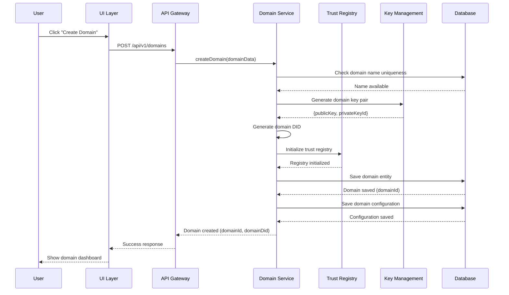

### Sequence Diagram: Adding Trust Anchor

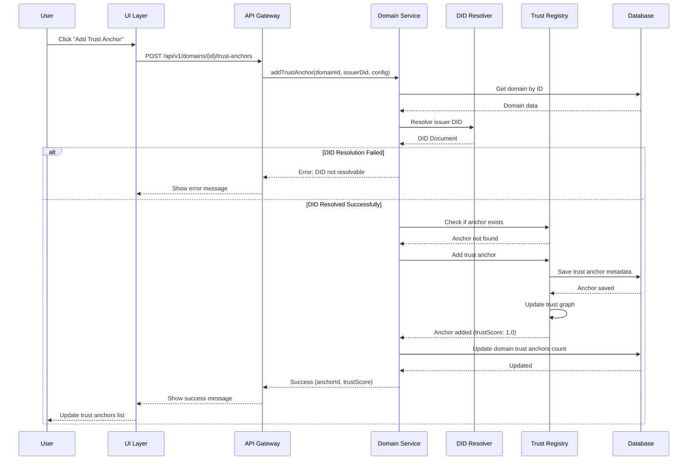

### Sequence Diagram: Issuing Credential

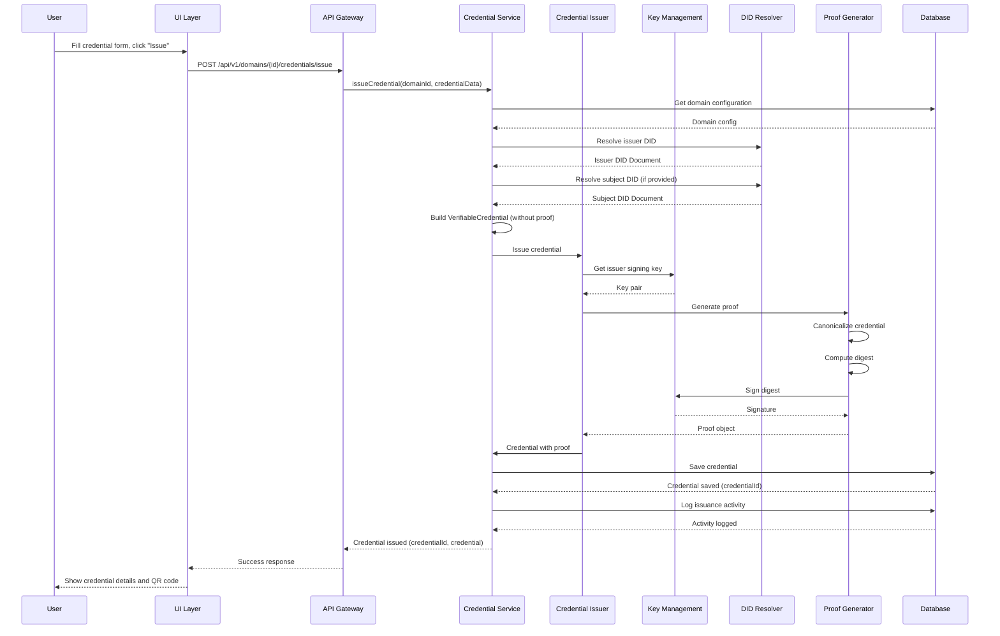

### Sequence Diagram: Verifying Credential

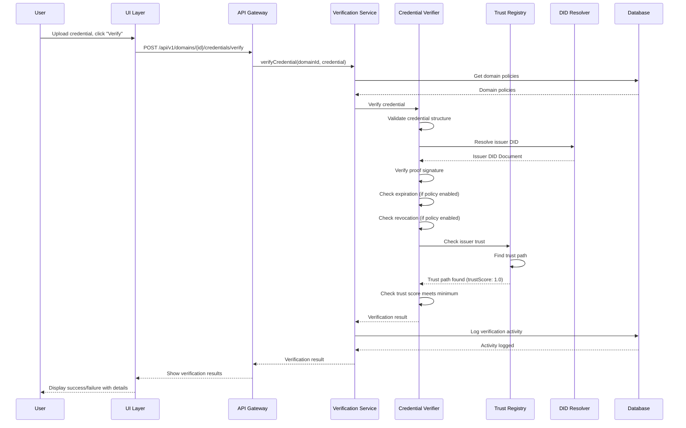

---

## Scenario: Creating a New DID and Assigning VC

### User Flow

#### Step 1: Navigate to DID Creation

**Screen: "Create New DID"**

```
┌─────────────────────────────────────────────────────────┐
│  Create New Decentralized Identifier (DID)              │
│                                                           │
│  DIDs provide unique, verifiable identities that work   │
│  across different systems without central registries.    │
│                                                           │
│  DID Method:                                             │
│  ┌─────────────────────────────────────────────────────┐ │
│  │ did:key (Recommended)                              │ │
│  └─────────────────────────────────────────────────────┘ │
│  [View other methods]                                     │
│                                                           │
│  Key Algorithm:                                          │
│  ┌─────────────────────────────────────────────────────┐ │
│  │ Ed25519 (Recommended)                              │ │
│  └─────────────────────────────────────────────────────┘ │
│                                                           │
│  Display Name (optional):                                 │
│  ┌─────────────────────────────────────────────────────┐ │
│  │ John Doe - Candidate                               │ │
│  └─────────────────────────────────────────────────────┘ │
│                                                           │
│  Description (optional):                                  │
│  ┌─────────────────────────────────────────────────────┐ │
│  │ Candidate for software engineer position            │ │
│  └─────────────────────────────────────────────────────┘ │
│                                                           │
│  [Cancel]  [Create DID]                                   │
└─────────────────────────────────────────────────────────┘
```

**User Action:** Fills in details, clicks "Create DID"

**Backend Events:**
1. Generate key pair using selected algorithm
2. Create DID using selected method
3. Create DID document
4. Store DID in database
5. Associate DID with user/organization
6. Return DID and DID document

---

#### Step 2: DID Created Successfully

**Screen: "DID Created Successfully"**

```
┌─────────────────────────────────────────────────────────┐
│  ✓ DID Created Successfully                             │
│                                                           │
│  DID:                                                    │
│  ┌─────────────────────────────────────────────────────┐ │
│  │ did:key:z6MkhaXgBZDvotDkL5257faiztiGiC2QtKLGpbnnEG │ │
│  │ [Copy] [Download DID Document]                      │ │
│  └─────────────────────────────────────────────────────┘ │
│                                                           │
│  Display Name: John Doe - Candidate                      │
│                                                           │
│  DID Document:                                           │
│  ┌─────────────────────────────────────────────────────┐ │
│  │ {                                                    │ │
│  │   "@context": "https://www.w3.org/ns/did/v1",      │ │
│  │   "id": "did:key:z6Mk...",                         │ │
│  │   "verificationMethod": [...]                      │ │
│  │ }                                                    │ │
│  └─────────────────────────────────────────────────────┘ │
│                                                           │
│  Next Steps:                                             │
│  • Issue a credential to this DID                       │
│  • Add to a wallet                                       │
│  • Share with others                                     │
│                                                           │
│  [Issue Credential to This DID]  [Add to Wallet]        │
│  [Done]                                                  │
└─────────────────────────────────────────────────────────┘
```

**User Action:** Clicks "Issue Credential to This DID"

---

#### Step 3: Issue Credential to New DID

**Screen: "Issue Credential" (Pre-filled Subject)**

```
┌─────────────────────────────────────────────────────────┐
│  Issue a Verifiable Credential                          │
│                                                           │
│  Step 1 of 3: Select Credential Type                    │
│                                                           │
│  Which type of credential?                              │
│  ○ EducationCredential                                   │
│  ○ EmploymentCredential                                   │
│  ● CertificationCredential                               │
│  ○ BackgroundCheckCredential                             │
│                                                           │
│  [Cancel]  [Next →]                                      │
└─────────────────────────────────────────────────────────┘
```

**User Action:** Selects "CertificationCredential", clicks "Next"

---

**Screen: "Credential Details" (Subject Pre-filled)**

```
┌─────────────────────────────────────────────────────────┐
│  Issue a Verifiable Credential                          │
│                                                           │
│  Step 2 of 3: Credential Details                        │
│                                                           │
│  Issuer (You):                                           │
│  ┌─────────────────────────────────────────────────────┐ │
│  │ Acme Corporation                                    │ │
│  │ did:key:z6Mk...yourorg                            │ │
│  └─────────────────────────────────────────────────────┘ │
│                                                           │
│  Subject (Recipient): ✓                                  │
│  ┌─────────────────────────────────────────────────────┐ │
│  │ John Doe - Candidate                                │ │
│  │ did:key:z6MkhaXgBZDvotDkL5257faiztiGiC2QtKLGpbnnEG │ │
│  │ [Change Subject]                                    │ │
│  └─────────────────────────────────────────────────────┘ │
│                                                           │
│  Certification Details:                                   │
│  ┌─────────────────────────────────────────────────────┐ │
│  │ Certification Name:                                 │ │
│  │ AWS Certified Solutions Architect                   │ │
│  └─────────────────────────────────────────────────────┘ │
│  ┌─────────────────────────────────────────────────────┐ │
│  │ Issuing Organization:                               │ │
│  │ Amazon Web Services                                 │ │
│  └─────────────────────────────────────────────────────┘ │
│  ┌─────────────────────────────────────────────────────┐ │
│  │ Issue Date:                                         │ │
│  │ 2024-03-15                                          │ │
│  └─────────────────────────────────────────────────────┘ │
│  ┌─────────────────────────────────────────────────────┐ │
│  │ Expiration Date (optional):                          │ │
│  │ 2027-03-15                                          │ │
│  └─────────────────────────────────────────────────────┘ │
│                                                           │
│  [← Back]  [Next →]                                      │
└─────────────────────────────────────────────────────────┘
```

**User Action:** Fills certification details, clicks "Next"

---

**Screen: "Review & Issue"**

```
┌─────────────────────────────────────────────────────────┐
│  Issue a Verifiable Credential                          │
│                                                           │
│  Step 3 of 3: Review & Issue                            │
│                                                           │
│  Credential Preview:                                    │
│  ┌─────────────────────────────────────────────────────┐ │
│  │ Type: CertificationCredential                      │ │
│  │ Issuer: Acme Corporation                           │ │
│  │ Subject: John Doe - Candidate                      │ │
│  │         did:key:z6MkhaXgBZDvotDkL5257faiztiGiC2QtKL│ │
│  │                                                     │ │
│  │ Certification:                                      │ │
│  │ AWS Certified Solutions Architect                  │ │
│  │ Issued: 2024-03-15                                 │ │
│  │ Expires: 2027-03-15                                 │ │
│  └─────────────────────────────────────────────────────┘ │
│                                                           │
│  Proof Type:                                             │
│  ┌─────────────────────────────────────────────────────┐ │
│  │ Ed25519Signature2020                                │ │
│  └─────────────────────────────────────────────────────┘ │
│                                                           │
│  Options:                                                │
│  ☐ Anchor to blockchain                                  │
│  ☑ Add to domain trust registry                          │
│                                                           │
│  [← Back]  [Issue Credential]                            │
└─────────────────────────────────────────────────────────┘
```

**User Action:** Reviews, clicks "Issue Credential"

---

### Backend Sequence: Create DID and Issue VC

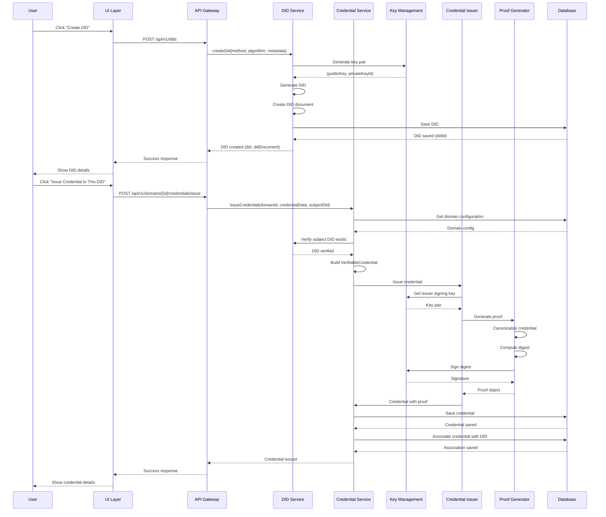

---

## Scenario: Updating a Verifiable Credential

### User Flow

#### Step 1: Navigate to Credential Management

**Screen: "Domain Dashboard - Credentials"**

```
┌─────────────────────────────────────────────────────────┐
│  HR Onboarding Domain - Credentials                    │
│                                                           │
│  Filter: [All] [Valid] [Expired] [Revoked]             │
│  Search: [Search credentials...]                        │
│                                                           │
│  ┌─────────────────────────────────────────────────────┐ │
│  │ 📜 CertificationCredential                         │ │
│  │    ID: urn:uuid:abc123-def456-ghi789              │ │
│  │    Issued: 2024-03-15                              │ │
│  │    Subject: John Doe (did:key:z6Mk...)            │ │
│  │    Status: ✓ Valid                                 │ │
│  │    [View] [Update] [Revoke] [Share]                │ │
│  └─────────────────────────────────────────────────────┘ │
│                                                           │
│  ┌─────────────────────────────────────────────────────┐ │
│  │ 📜 EducationCredential                              │ │
│  │    ID: urn:uuid:xyz789-abc123-def456              │ │
│  │    Issued: 2024-01-10                              │ │
│  │    Subject: Jane Smith (did:key:z6Mk...)          │ │
│  │    Status: ✓ Valid                                 │ │
│  │    [View] [Update] [Revoke] [Share]                │ │
│  └─────────────────────────────────────────────────────┘ │
└─────────────────────────────────────────────────────────┘
```

**User Action:** Clicks "Update" on CertificationCredential

---

#### Step 2: Update Credential

**Screen: "Update Credential"**

```
┌─────────────────────────────────────────────────────────┐
│  Update Verifiable Credential                          │
│                                                           │
│  ⚠️ Important: Updating a credential creates a new      │
│  version. The original credential remains valid.        │
│                                                           │
│  Current Credential:                                    │
│  ┌─────────────────────────────────────────────────────┐ │
│  │ Type: CertificationCredential                      │ │
│  │ ID: urn:uuid:abc123-def456-ghi789                  │ │
│  │ Issued: 2024-03-15                                 │ │
│  │ Status: Valid                                       │ │
│  └─────────────────────────────────────────────────────┘ │
│                                                           │
│  Update Type:                                            │
│  ○ Update metadata only (no new proof)                  │
│  ● Create new version (new proof, links to original)    │
│                                                           │
│  Fields to Update:                                       │
│  ┌─────────────────────────────────────────────────────┐ │
│  │ Certification Name:                                 │ │
│  │ AWS Certified Solutions Architect - Professional   │ │
│  └─────────────────────────────────────────────────────┘ │
│  ┌─────────────────────────────────────────────────────┐ │
│  │ Expiration Date:                                    │ │
│  │ 2027-03-15 → 2028-03-15                            │ │
│  └─────────────────────────────────────────────────────┘ │
│                                                           │
│  Reason for Update:                                      │
│  ┌─────────────────────────────────────────────────────┐ │
│  │ Certification renewed, extended expiration date      │ │
│  └─────────────────────────────────────────────────────┘ │
│                                                           │
│  Options:                                                │
│  ☑ Revoke original credential                            │
│  ☐ Keep original credential active                        │
│  ☑ Notify subject about update                           │
│                                                           │
│  [Cancel]  [Preview Update]  [Create Update]            │
└─────────────────────────────────────────────────────────┘
```

**User Action:** Updates fields, selects options, clicks "Create Update"

---

#### Step 3: Preview Update

**Screen: "Preview Credential Update"**

```
┌─────────────────────────────────────────────────────────┐
│  Preview Credential Update                              │
│                                                           │
│  Original Credential:                                   │
│  ┌─────────────────────────────────────────────────────┐ │
│  │ ID: urn:uuid:abc123-def456-ghi789                │ │
│  │ Issued: 2024-03-15                               │ │
│  │ Expires: 2027-03-15                               │ │
│  │ Status: Will be revoked                           │ │
│  └─────────────────────────────────────────────────────┘ │
│                                                           │
│  Updated Credential:                                    │
│  ┌─────────────────────────────────────────────────────┐ │
│  │ ID: urn:uuid:new789-abc123-def456                  │ │
│  │ Issued: 2024-03-20 (today)                        │ │
│  │ Expires: 2028-03-15                                │ │
│  │ Previous Version: urn:uuid:abc123-def456-ghi789  │ │
│  │ Status: Will be active                             │ │
│  └─────────────────────────────────────────────────────┘ │
│                                                           │
│  Changes:                                                │
│  • Certification name updated                           │
│  • Expiration date extended by 1 year                   │
│  • Original credential will be revoked                  │
│                                                           │
│  [← Back]  [Confirm Update]                              │
└─────────────────────────────────────────────────────────┘
```

**User Action:** Reviews preview, clicks "Confirm Update"

---

#### Step 4: Update Confirmation

**Screen: "Credential Updated Successfully"**

```
┌─────────────────────────────────────────────────────────┐
│  ✓ Credential Updated Successfully                     │
│                                                           │
│  New Credential ID:                                      │
│  urn:uuid:new789-abc123-def456                          │
│                                                           │
│  Original Credential:                                    │
│  • ID: urn:uuid:abc123-def456-ghi789                    │
│  • Status: Revoked                                       │
│                                                           │
│  Updated Credential:                                    │
│  • ID: urn:uuid:new789-abc123-def456                    │
│  • Status: Active                                        │
│  • Links to: urn:uuid:abc123-def456-ghi789              │
│                                                           │
│  Actions:                                                │
│  [View Updated Credential]  [View Original]             │
│  [Download Both]  [Share Updated Credential]            │
└─────────────────────────────────────────────────────────┘
```

---

### Backend Sequence: Update Credential

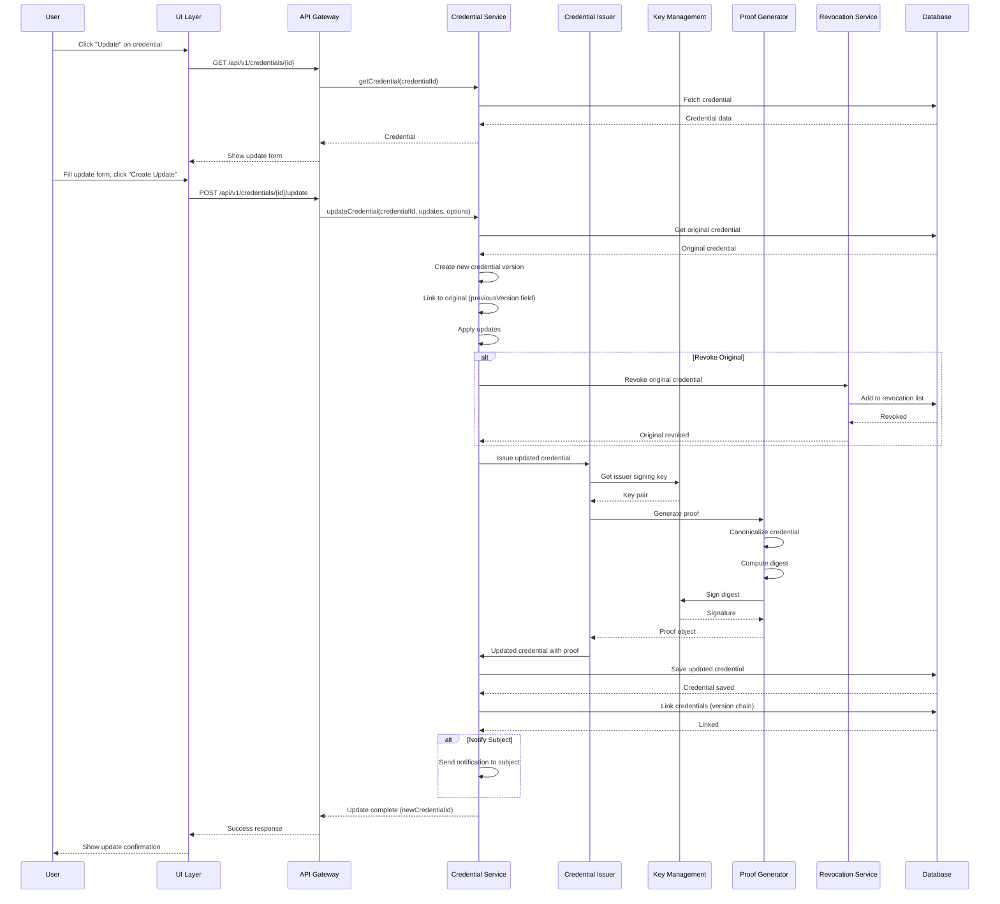

---

## Scenario: Revoking a Verifiable Credential

### User Flow

#### Step 1: Navigate to Revocation

**Screen: "Credential Details"**

```
┌─────────────────────────────────────────────────────────┐
│  Credential Details                                      │
│                                                           │
│  ┌─────────────────────────────────────────────────────┐ │
│  │ Type: CertificationCredential                     │ │
│  │ ID: urn:uuid:abc123-def456-ghi789                  │ │
│  │                                                      │ │
│  │ Issuer: Acme Corporation                            │ │
│  │ Subject: John Doe (did:key:z6Mk...)                │ │
│  │                                                      │ │
│  │ Issued: 2024-03-15                                  │ │
│  │ Expires: 2027-03-15                                 │ │
│  │ Status: ✓ Valid                                     │ │
│  │                                                      │ │
│  │ Certification:                                      │ │
│  │ AWS Certified Solutions Architect                   │ │
│  └─────────────────────────────────────────────────────┘ │
│                                                           │
│  Actions:                                                │
│  [Update] [Revoke] [Share] [Download] [View Proof]      │
│                                                           │
│  [← Back to Credentials]                                 │
└─────────────────────────────────────────────────────────┘
```

**User Action:** Clicks "Revoke"

---

#### Step 2: Revocation Confirmation

**Screen: "Revoke Credential"**

```
┌─────────────────────────────────────────────────────────┐
│  Revoke Verifiable Credential                           │
│                                                           │
│  ⚠️ Warning: Revoking a credential is permanent and      │
│  cannot be undone. The credential will be marked as     │
│  revoked and will fail verification.                     │
│                                                           │
│  Credential to Revoke:                                  │
│  ┌─────────────────────────────────────────────────────┐ │
│  │ Type: CertificationCredential                     │ │
│  │ ID: urn:uuid:abc123-def456-ghi789                  │ │
│  │ Subject: John Doe                                   │ │
│  │ Issued: 2024-03-15                                 │ │
│  │ Current Status: Valid                              │ │
│  └─────────────────────────────────────────────────────┘ │
│                                                           │
│  Revocation Reason: *                                    │
│  ┌─────────────────────────────────────────────────────┐ │
│  │ Certification expired or invalidated                │ │
│  └─────────────────────────────────────────────────────┘ │
│                                                           │
│  Revocation Type:                                        │
│  ○ Temporary (can be reinstated)                        │
│  ● Permanent (cannot be reinstated)                    │
│                                                           │
│  Options:                                                │
│  ☑ Add to revocation list                               │
│  ☑ Notify subject about revocation                      │
│  ☐ Create revocation credential                         │
│                                                           │
│  [Cancel]  [Confirm Revocation]                          │
└─────────────────────────────────────────────────────────┘
```

**User Action:** Enters revocation reason, clicks "Confirm Revocation"

---

#### Step 3: Revocation Confirmation

**Screen: "Credential Revoked Successfully"**

```
┌─────────────────────────────────────────────────────────┐
│  ✓ Credential Revoked Successfully                      │
│                                                           │
│  Credential ID:                                          │
│  urn:uuid:abc123-def456-ghi789                          │
│                                                           │
│  Revocation Details:                                    │
│  ┌─────────────────────────────────────────────────────┐ │
│  │ Status: Revoked                                      │ │
│  │ Revoked: 2024-03-20 14:32:15                        │ │
│  │ Reason: Certification expired or invalidated        │ │
│  │ Type: Permanent                                      │ │
│  │ Revocation List: https://example.com/revocation-list│ │
│  └─────────────────────────────────────────────────────┘ │
│                                                           │
│  Impact:                                                 │
│  • This credential will fail verification                │
│  • Subject has been notified (if enabled)                │
│  • Revocation is permanent and cannot be undone          │
│                                                           │
│  Actions:                                                │
│  [View Revoked Credential]  [View Revocation List]      │
│  [Issue Replacement Credential]  [Done]                 │
└─────────────────────────────────────────────────────────┘
```

---

### Backend Sequence: Revoke Credential

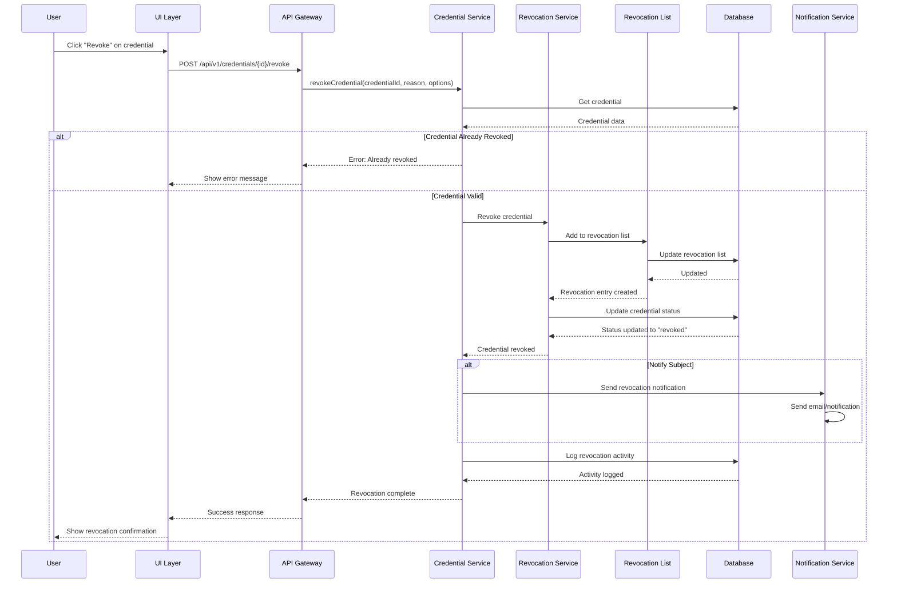

---

## Scenario: Wallet Management

### User Flow

#### Step 1: Create a Wallet

**Screen: "Create Your Wallet"**

```
┌─────────────────────────────────────────────────────────┐
│  Create Your Wallet                                      │
│                                                           │
│  A wallet securely stores and organizes your             │
│  verifiable credentials.                                 │
│                                                           │
│  Wallet Name:                                            │
│  ┌─────────────────────────────────────────────────────┐ │
│  │ My Professional Credentials                          │ │
│  └─────────────────────────────────────────────────────┘ │
│                                                           │
│  Holder DID:                                             │
│  ┌─────────────────────────────────────────────────────┐ │
│  │ did:key:z6MkhaXgBZDvotDkL5257faiztiGiC2QtKLGpbnnEG │ │
│  └─────────────────────────────────────────────────────┘ │
│  [Create New DID]  [Use Existing DID]                    │
│                                                           │
│  Wallet Capabilities:                                    │
│  ☑ Credential Storage                                     │
│  ☑ Organization (Collections, Tags)                       │
│  ☑ Presentation Creation                                 │
│  ☐ DID Management                                        │
│  ☐ Key Management                                        │
│  ☐ Credential Issuance                                   │
│                                                           │
│  [Cancel]  [Create Wallet]                               │
└─────────────────────────────────────────────────────────┘
```

**User Action:** Enters wallet name, selects DID, enables capabilities, clicks "Create Wallet"

**Backend Events:**
1. Generate wallet DID
2. Create wallet entity
3. Initialize storage
4. Configure capabilities
5. Return wallet ID

---

#### Step 2: Wallet Dashboard

**Screen: "My Professional Credentials - Wallet Dashboard"**

```
┌─────────────────────────────────────────────────────────┐
│  My Professional Credentials                             │
│  [Settings] [Import] [Export]                            │
│                                                           │
│  ┌───────────┐ ┌───────────┐ ┌───────────┐ ┌─────────┐ │
│  │ Total     │ │ Valid     │ │ Expiring  │ │ Archived│ │
│  │ Creds     │ │ Creds     │ │ Soon      │ │         │ │
│  │    12     │ │    10     │ │     2     │ │    0    │ │
│  └───────────┘ └───────────┘ └───────────┘ └─────────┘ │
│                                                           │
│  Collections:                                            │
│  ┌─────────────────────────────────────────────────────┐ │
│  │ 📚 Education (3 credentials)                      │ │
│  │    [View] [Edit]                                    │ │
│  └─────────────────────────────────────────────────────┘ │
│  ┌─────────────────────────────────────────────────────┐ │
│  │ 💼 Employment (4 credentials)                       │ │
│  │    [View] [Edit]                                    │ │
│  └─────────────────────────────────────────────────────┘ │
│  ┌─────────────────────────────────────────────────────┐ │
│  │ 🏆 Certifications (5 credentials)                   │ │
│  │    [View] [Edit]                                    │ │
│  └─────────────────────────────────────────────────────┘ │
│                                                           │
│  Recent Credentials:                                     │
│  • AWS Certification - Added 2 days ago                  │
│  • Employment Credential - Added 1 week ago             │
│  • Education Credential - Added 2 weeks ago              │
│                                                           │
│  [Add Credential]  [Create Collection]                   │
│  [Create Presentation]                                    │
└─────────────────────────────────────────────────────────┘
```

---

#### Step 3: Organize Credentials

**Screen: "Organize Credentials"**

```
┌─────────────────────────────────────────────────────────┐
│  Organize Credentials                                    │
│                                                           │
│  Create Collection:                                      │
│  ┌─────────────────────────────────────────────────────┐ │
│  │ Collection Name:                                    │ │
│  │ Professional Certifications                        │ │
│  └─────────────────────────────────────────────────────┘ │
│  ┌─────────────────────────────────────────────────────┐ │
│  │ Description:                                        │ │
│  │ Industry certifications and licenses                │ │
│  └─────────────────────────────────────────────────────┘ │
│  [Create Collection]                                     │
│                                                           │
│  Add Tags to Credential:                                 │
│  ┌─────────────────────────────────────────────────────┐ │
│  │ Credential: AWS Certified Solutions Architect      │ │
│  │                                                     │ │
│  │ Tags:                                              │ │
│  │ [aws] [cloud] [professional] [verified]            │ │
│  │                                                     │ │
│  │ Add Tag:                                            │ │
│  │ ┌─────────────────────────────────────────────────┐ │ │
│  │ │ Type tag name...                                │ │ │
│  │ └─────────────────────────────────────────────────┘ │ │
│  │ [Add Tag]                                           │ │
│  └─────────────────────────────────────────────────────┘ │
│                                                           │
│  [Save]  [Cancel]                                        │
└─────────────────────────────────────────────────────────┘
```

---

### Backend Sequence: Wallet Management

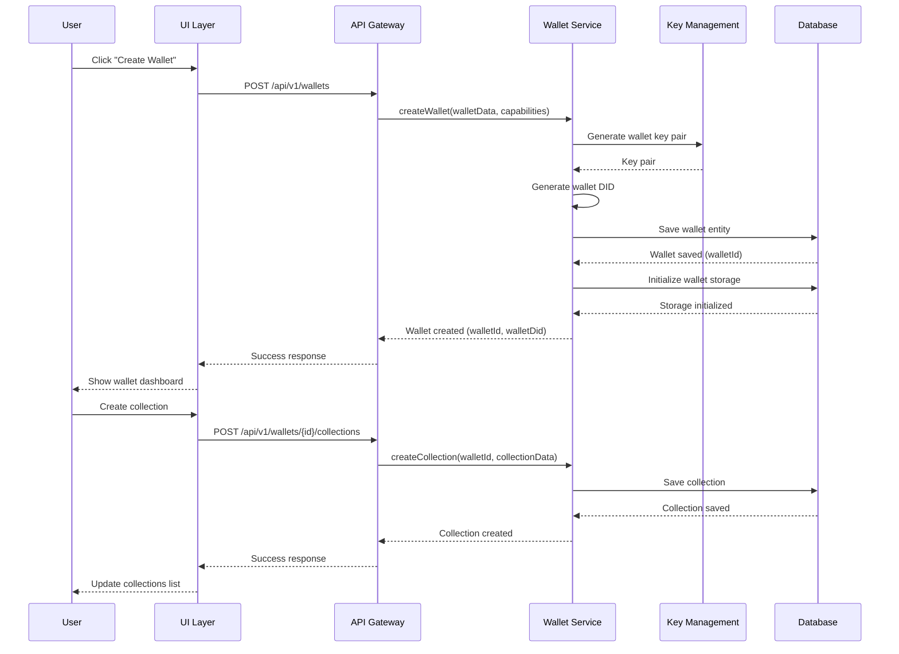

---

## Scenario: Verifiable Presentations & Selective Disclosure

### User Flow

#### Step 1: Create Presentation

**Screen: "Create Verifiable Presentation"**

```
┌─────────────────────────────────────────────────────────┐
│  Create Verifiable Presentation                         │
│                                                           │
│  Step 1 of 3: Select Credentials                         │
│                                                           │
│  Select credentials to include in presentation:         │
│                                                           │
│  ☑ EducationCredential                                   │
│     Bachelor of Science in Computer Science             │
│     Issued: State University                            │
│                                                           │
│  ☑ EmploymentCredential                                  │
│     Senior Software Engineer at Tech Corp               │
│     Issued: Tech Corp Inc                               │
│                                                           │
│  ☐ CertificationCredential                               │
│     AWS Certified Solutions Architect                   │
│     Issued: Amazon Web Services                         │
│                                                           │
│  Search: [Search credentials...]                          │
│                                                           │
│  [Cancel]  [Next →]                                      │
└─────────────────────────────────────────────────────────┘
```

**User Action:** Selects credentials, clicks "Next"

---

#### Step 2: Configure Selective Disclosure

**Screen: "Configure Selective Disclosure"**

```
┌─────────────────────────────────────────────────────────┐
│  Create Verifiable Presentation                         │
│                                                           │
│  Step 2 of 3: Selective Disclosure                      │
│                                                           │
│  Choose which fields to reveal in the presentation:     │
│                                                           │
│  EducationCredential:                                   │
│  ☑ Degree Type                                          │
│  ☑ Degree Name                                          │
│  ☑ University Name                                      │
│  ☐ Graduation Date                                      │
│  ☐ GPA                                                  │
│  ☐ Student ID                                           │
│                                                           │
│  EmploymentCredential:                                  │
│  ☑ Company Name                                         │
│  ☑ Position Title                                       │
│  ☑ Employment Period                                    │
│  ☐ Salary Information                                   │
│  ☐ Performance Reviews                                  │
│                                                           │
│  💡 Only selected fields will be visible to verifier    │
│                                                           │
│  [← Back]  [Next →]                                     │
└─────────────────────────────────────────────────────────┘
```

**User Action:** Selects fields to disclose, clicks "Next"

---

#### Step 3: Presentation Options

**Screen: "Presentation Options"**

```
┌─────────────────────────────────────────────────────────┐
│  Create Verifiable Presentation                         │
│                                                           │
│  Step 3 of 3: Presentation Options                      │
│                                                           │
│  Verifier Information:                                   │
│  ┌─────────────────────────────────────────────────────┐ │
│  │ Verifier Name (optional):                           │ │
│  │ Acme Corporation                                    │ │
│  └─────────────────────────────────────────────────────┘ │
│                                                           │
│  Challenge (required):                                   │
│  ┌─────────────────────────────────────────────────────┐ │
│  │ job-application-2024-03-20-abc123                   │ │
│  └─────────────────────────────────────────────────────┘ │
│  [Generate Random Challenge]                             │
│                                                           │
│  Domain (optional):                                      │
│  ┌─────────────────────────────────────────────────────┐ │
│  │ example.com                                         │ │
│  └─────────────────────────────────────────────────────┘ │
│                                                           │
│  Proof Type:                                             │
│  ┌─────────────────────────────────────────────────────┐ │
│  │ Ed25519Signature2020                               │ │
│  └─────────────────────────────────────────────────────┘ │
│                                                           │
│  Expiration:                                             │
│  ☐ Set expiration date                                  │
│  ┌─────────────────────────────────────────────────────┐ │
│  │ 2024-03-27 (7 days from now)                        │ │
│  └─────────────────────────────────────────────────────┘ │
│                                                           │
│  [← Back]  [Create Presentation]                         │
└─────────────────────────────────────────────────────────┘
```

**User Action:** Configures options, clicks "Create Presentation"

---

#### Step 4: Presentation Created

**Screen: "Presentation Created Successfully"**

```
┌─────────────────────────────────────────────────────────┐
│  ✓ Presentation Created Successfully                     │
│                                                           │
│  Presentation ID:                                        │
│  urn:uuid:presentation-abc123-def456                    │
│                                                           │
│  ┌─────────────────────────────────────────────────────┐ │
│  │                                                      │ │
│  │        [QR CODE]                                    │ │
│  │                                                      │ │
│  │  Share this QR code with verifier                   │ │
│  └─────────────────────────────────────────────────────┘ │
│                                                           │
│  Presentation Summary:                                   │
│  • 2 credentials included                                │
│  • Selective disclosure enabled                          │
│  • Challenge: job-application-2024-03-20-abc123         │
│  • Expires: 2024-03-27                                  │
│                                                           │
│  [Download Presentation]  [Copy Link]  [Share via Email] │
│  [View Details]  [Create Another]                        │
└─────────────────────────────────────────────────────────┘
```

---

### Backend Sequence: Create Presentation

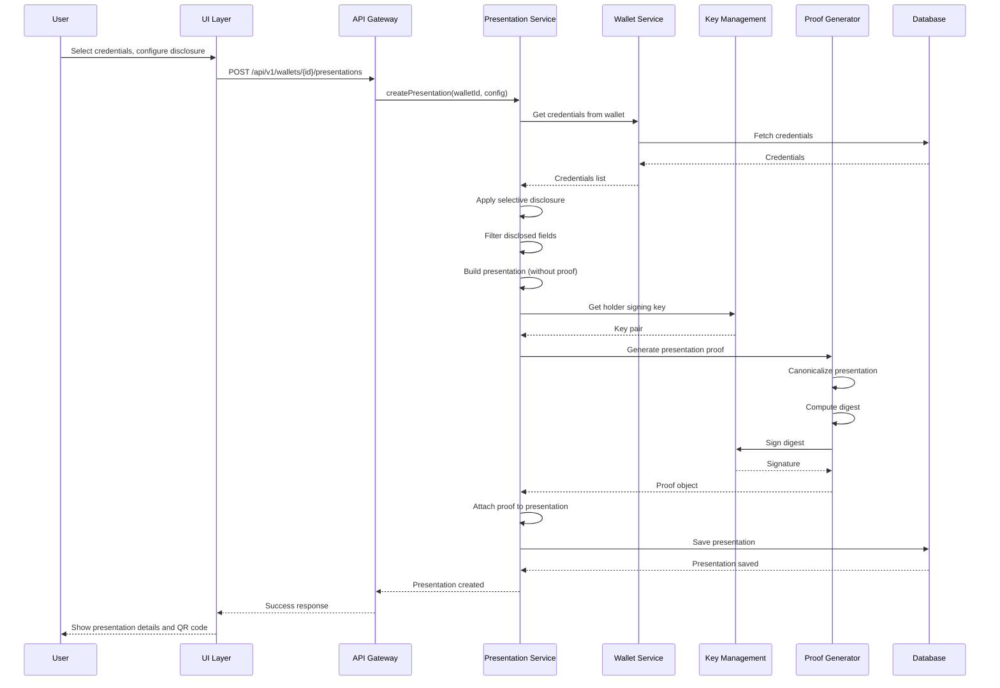

---

## Scenario: Blockchain Anchoring

### User Flow

#### Step 1: Anchor Credential

**Screen: "Anchor Credential to Blockchain"**

```
┌─────────────────────────────────────────────────────────┐
│  Anchor Credential to Blockchain                         │
│                                                           │
│  Anchoring creates an immutable record of your           │
│  credential on a blockchain.                             │
│                                                           │
│  Credential to Anchor:                                  │
│  ┌─────────────────────────────────────────────────────┐ │
│  │ CertificationCredential                             │ │
│  │ AWS Certified Solutions Architect                   │ │
│  │ ID: urn:uuid:abc123-def456-ghi789                  │ │
│  └─────────────────────────────────────────────────────┘ │
│                                                           │
│  Select Blockchain:                                      │
│  ┌─────────────────────────────────────────────────────┐ │
│  │ Algorand Mainnet                                    │ │
│  │ Cost: ~$0.001 per anchor                           │ │
│  │ Confirmation: ~4 seconds                           │ │
│  └─────────────────────────────────────────────────────┘ │
│  [View Other Blockchains]                                │
│                                                           │
│  Anchoring Options:                                      │
│  ☑ Include proof in anchor                               │
│  ☐ Include full credential data                         │
│  ☑ Create anchor reference                              │
│                                                           │
│  ⚠️ Note: Anchoring costs may apply                     │
│                                                           │
│  [Cancel]  [Anchor Credential]                           │
└─────────────────────────────────────────────────────────┘
```

**User Action:** Selects blockchain, configures options, clicks "Anchor Credential"

---

#### Step 2: Anchoring in Progress

**Screen: "Anchoring in Progress"**

```
┌─────────────────────────────────────────────────────────┐
│  Anchoring Credential to Blockchain                      │
│                                                           │
│  ┌─────────────────────────────────────────────────────┐ │
│  │                                                      │ │
│  │         [ANIMATED LOADING]                          │ │
│  │                                                      │ │
│  │  Submitting transaction to Algorand Mainnet...     │ │
│  │                                                      │ │
│  └─────────────────────────────────────────────────────┘ │
│                                                           │
│  Status:                                                 │
│  ✓ Credential digest computed                           │
│  ✓ Transaction prepared                                  │
│  ⏳ Waiting for blockchain confirmation...               │
│                                                           │
│  This may take a few seconds...                          │
│                                                           │
│  [Cancel Anchoring]                                      │
└─────────────────────────────────────────────────────────┘
```

---

#### Step 3: Anchor Confirmed

**Screen: "Credential Anchored Successfully"**

```
┌─────────────────────────────────────────────────────────┐
│  ✓ Credential Anchored Successfully                     │
│                                                           │
│  Anchor Details:                                         │
│  ┌─────────────────────────────────────────────────────┐ │
│  │ Blockchain: Algorand Mainnet                        │ │
│  │ Transaction Hash:                                   │ │
│  │ 0xabc123def456ghi789jkl012mno345pqr678stu901vwx234 │ │
│  │ Block Height: 25,432,189                           │ │
│  │ Timestamp: 2024-03-20 14:32:15 UTC                │ │
│  │ Confirmation Time: 3.2 seconds                     │ │
│  └─────────────────────────────────────────────────────┘ │
│                                                           │
│  Credential Digest:                                      │
│  zQmXoypizjW3WknFiJnKLwHnLk7q1q2q3q4q5q6q7q8q9q0q1q2q3   │
│                                                           │
│  Anchor Reference:                                       │
│  ┌─────────────────────────────────────────────────────┐ │
│  │ {                                                    │ │
│  │   "chainId": "algorand:mainnet",                    │ │
│  │   "txHash": "0xabc123...",                         │ │
│  │   "blockHeight": 25432189,                         │ │
│  │   "timestamp": "2024-03-20T14:32:15Z"              │ │
│  │ }                                                    │ │
│  └─────────────────────────────────────────────────────┘ │
│                                                           │
│  [View on Blockchain Explorer]  [Download Anchor Ref]   │
│  [Anchor Another Credential]  [Done]                     │
└─────────────────────────────────────────────────────────┘
```

---

#### Step 4: View Anchor Status

**Screen: "Credential Anchor Status"**

```
┌─────────────────────────────────────────────────────────┐
│  Credential Anchor Status                                │
│                                                           │
│  Credential:                                             │
│  CertificationCredential - AWS Certified Solutions Arch │
│                                                           │
│  Anchor History:                                         │
│  ┌─────────────────────────────────────────────────────┐ │
│  │ ✓ Anchored on Algorand Mainnet                     │ │
│  │   Transaction: 0xabc123...                         │ │
│  │   Date: 2024-03-20 14:32:15 UTC                    │ │
│  │   Status: Confirmed                                 │ │
│  │   [View on Explorer]                                │ │
│  └─────────────────────────────────────────────────────┘ │
│                                                           │
│  Verification:                                           │
│  ✓ Digest matches credential                            │
│  ✓ Transaction confirmed on blockchain                  │
│  ✓ Anchor reference valid                               │
│                                                           │
│  [Verify Anchor]  [Re-anchor]  [View Details]          │
└─────────────────────────────────────────────────────────┘
```

---

### Backend Sequence: Blockchain Anchoring

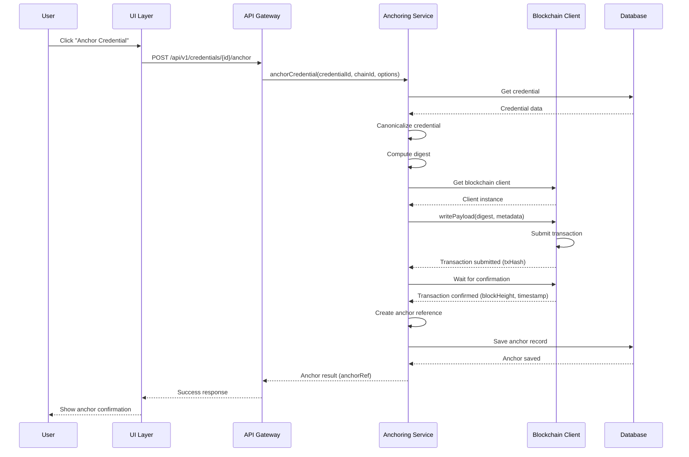

---

## Scenario: Smart Contracts

### User Flow

#### Step 1: Create Contract Draft

**Screen: "Create Smart Contract"**

```
┌─────────────────────────────────────────────────────────┐
│  Create Smart Contract                                   │
│                                                           │
│  Step 1 of 4: Contract Details                           │
│                                                           │
│  Contract Name: *                                        │
│  ┌─────────────────────────────────────────────────────┐ │
│  │ Parametric Insurance - Crop Damage                  │ │
│  └─────────────────────────────────────────────────────┘ │
│                                                           │
│  Contract Type:                                          │
│  ┌─────────────────────────────────────────────────────┐ │
│  │ Parametric Insurance                                │ │
│  └─────────────────────────────────────────────────────┘ │
│  [View other types]                                      │
│                                                           │
│  Parties:                                                │
│  ┌─────────────────────────────────────────────────────┐ │
│  │ Insurer: Acme Insurance Co.                        │ │
│  │         did:key:z6Mk...insurer                    │ │
│  └─────────────────────────────────────────────────────┘ │
│  ┌─────────────────────────────────────────────────────┐ │
│  │ Policyholder: John Doe                             │ │
│  │            did:key:z6Mk...policyholder             │ │
│  └─────────────────────────────────────────────────────┘ │
│  [Add Party]                                             │
│                                                           │
│  [Cancel]  [Next →]                                      │
└─────────────────────────────────────────────────────────┘
```

**User Action:** Fills contract details, clicks "Next"

---

#### Step 2: Define Contract Terms

**Screen: "Contract Terms"**

```
┌─────────────────────────────────────────────────────────┐
│  Create Smart Contract                                   │
│                                                           │
│  Step 2 of 4: Contract Terms                             │
│                                                           │
│  Contract Terms:                                        │
│  ┌─────────────────────────────────────────────────────┐ │
│  │ Coverage: Crop damage insurance                     │ │
│  │ Payout: $50,000 if rainfall < 1.0 inches          │ │
│  │ Period: 2024-06-01 to 2024-08-31                  │ │
│  │ Data Source: EO Data Provider (ESA)               │ │
│  └─────────────────────────────────────────────────────┘ │
│                                                           │
│  Execution Model:                                        │
│  ○ Parametric (automatic based on data triggers)        │
│  ● Conditional (manual evaluation)                       │
│  ○ Scheduled (time-based)                                │
│  ○ Event-driven                                          │
│                                                           │
│  Conditions:                                             │
│  ┌─────────────────────────────────────────────────────┐ │
│  │ IF rainfall < 1.0 inches                            │ │
│  │ THEN payout $50,000                                 │ │
│  │ DATA SOURCE: EO Data Credential                     │ │
│  └─────────────────────────────────────────────────────┘ │
│  [Add Condition]                                         │
│                                                           │
│  [← Back]  [Next →]                                      │
└─────────────────────────────────────────────────────────┘
```

**User Action:** Defines terms and conditions, clicks "Next"

---

#### Step 3: Bind with Credentials

**Screen: "Bind Contract with Credentials"**

```
┌─────────────────────────────────────────────────────────┐
│  Create Smart Contract                                   │
│                                                           │
│  Step 3 of 4: Bind Credentials                           │
│                                                           │
│  Issue verifiable credential for this contract:         │
│  ☑ Issue contract credential                            │
│                                                           │
│  Credential Details:                                     │
│  ┌─────────────────────────────────────────────────────┐ │
│  │ Type: ContractCredential                           │ │
│  │ Issuer: Acme Insurance Co.                         │ │
│  │ Subject: Contract ID: CONTRACT-2024-001            │ │
│  └─────────────────────────────────────────────────────┘ │
│                                                           │
│  Anchor to Blockchain:                                   │
│  ☑ Anchor contract to blockchain                        │
│  ┌─────────────────────────────────────────────────────┐ │
│  │ Blockchain: Algorand Mainnet                       │ │
│  └─────────────────────────────────────────────────────┘ │
│                                                           │
│  ⚠️ Anchoring creates immutable audit trail             │
│                                                           │
│  [← Back]  [Next →]                                      │
└─────────────────────────────────────────────────────────┘
```

**User Action:** Configures credential and anchoring, clicks "Next"

---

#### Step 4: Review & Create Contract

**Screen: "Review Contract"**

```
┌─────────────────────────────────────────────────────────┐
│  Create Smart Contract                                   │
│                                                           │
│  Step 4 of 4: Review & Create                            │
│                                                           │
│  Contract Summary:                                      │
│  ┌─────────────────────────────────────────────────────┐ │
│  │ Name: Parametric Insurance - Crop Damage           │ │
│  │ Type: Parametric Insurance                         │ │
│  │ Status: Draft                                      │ │
│  │                                                     │ │
│  │ Parties:                                           │ │
│  │ • Insurer: Acme Insurance Co.                     │ │
│  │ • Policyholder: John Doe                           │ │
│  │                                                     │ │
│  │ Terms:                                             │ │
│  │ • Payout: $50,000 if rainfall < 1.0 inches        │ │
│  │ • Period: 2024-06-01 to 2024-08-31               │ │
│  │                                                     │ │
│  │ Credential: Will be issued                        │ │
│  │ Blockchain: Will be anchored to Algorand Mainnet  │ │
│  └─────────────────────────────────────────────────────┘ │
│                                                           │
│  [← Back]  [Create Contract]                             │
└─────────────────────────────────────────────────────────┘
```

**User Action:** Reviews contract, clicks "Create Contract"

---

#### Step 5: Contract Created

**Screen: "Contract Created Successfully"**

```
┌─────────────────────────────────────────────────────────┐
│  ✓ Contract Created Successfully                        │
│                                                           │
│  Contract ID:                                            │
│  CONTRACT-2024-001                                       │
│                                                           │
│  Status: Draft                                           │
│                                                           │
│  Actions Completed:                                      │
│  ✓ Contract draft created                               │
│  ✓ Contract credential issued                           │
│  ✓ Contract anchored to Algorand Mainnet                │
│  ✓ Transaction: 0xdef456...                            │
│                                                           │
│  Next Steps:                                            │
│  • Activate contract to enable execution                │
│  • Monitor contract status                              │
│  • Execute when conditions are met                       │
│                                                           │
│  [Activate Contract]  [View Contract]                   │
│  [View Credential]  [View Anchor]  [Done]                │
└─────────────────────────────────────────────────────────┘
```

---

#### Step 6: Activate Contract

**Screen: "Activate Contract"**

```
┌─────────────────────────────────────────────────────────┐
│  Activate Contract: CONTRACT-2024-001                   │
│                                                           │
│  ⚠️ Activating a contract enables automatic execution.    │
│  Make sure all parties have signed and terms are correct.│
│                                                           │
│  Contract Details:                                      │
│  ┌─────────────────────────────────────────────────────┐ │
│  │ Name: Parametric Insurance - Crop Damage           │ │
│  │ Status: Draft → Active                             │ │
│  │ Execution: Automatic (parametric)                  │ │
│  └─────────────────────────────────────────────────────┘ │
│                                                           │
│  Confirmation:                                           │
│  ☐ I confirm all parties have agreed to terms          │
│  ☐ I understand contract will execute automatically     │
│  ☐ I have verified all conditions are correct           │
│                                                           │
│  [Cancel]  [Activate Contract]                         │
└─────────────────────────────────────────────────────────┘
```

---

#### Step 7: Contract Monitoring

**Screen: "Contract Dashboard"**

```
┌─────────────────────────────────────────────────────────┐
│  Contract: CONTRACT-2024-001                             │
│  Status: Active                                          │
│                                                           │
│  ┌───────────┐ ┌───────────┐ ┌───────────┐ ┌─────────┐ │
│  │ Status    │ │ Executions│ │ Payouts   │ │ Value   │ │
│  │ Active    │ │     0     │ │    $0     │ │ $50,000 │ │
│  └───────────┘ └───────────┘ └───────────┘ └─────────┘ │
│                                                           │
│  Recent Activity:                                        │
│  • Contract activated on 2024-03-20                     │
│  • Monitoring for trigger conditions...                  │
│                                                           │
│  Conditions:                                             │
│  ┌─────────────────────────────────────────────────────┐ │
│  │ IF rainfall < 1.0 inches (from EO Data)           │ │
│  │ THEN payout $50,000                                 │ │
│  │ Status: Monitoring                                  │ │
│  └─────────────────────────────────────────────────────┘ │
│                                                           │
│  [View Credential]  [View Anchor]  [Execute Manually]   │
│  [View History]  [Deactivate]                            │
└─────────────────────────────────────────────────────────┘
```

---

### Backend Sequence: Smart Contract Creation

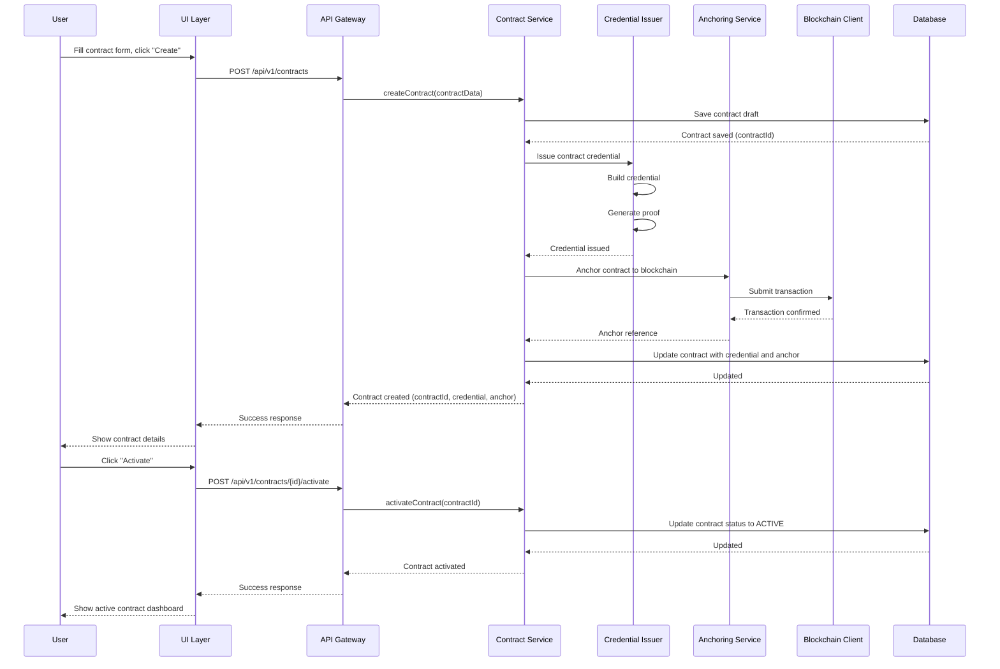

---

## Error Handling & Edge Cases

### Error: DID Resolution Failed

**Screen: "Error: DID Not Resolvable"**

```
┌─────────────────────────────────────────────────────────┐
│  ⚠️ Error: DID Not Resolvable                           │
│                                                           │
│  The DID you entered could not be resolved:            │
│  did:key:z6MkhaXgBZDvotDkL5257faiztiGiC2QtKLGpbnnEG     │
│                                                           │
│  Possible reasons:                                       │
│  • DID does not exist                                    │
│  • DID method not supported                              │
│  • Network connectivity issue                             │
│  • DID document not published                             │
│                                                           │
│  What would you like to do?                              │
│  [Try Again]  [Enter Different DID]  [Get Help]        │
└─────────────────────────────────────────────────────────┘
```

### Error: Trust Anchor Already Exists

**Screen: "Trust Anchor Already Added"**

```
┌─────────────────────────────────────────────────────────┐
│  ℹ️ Trust Anchor Already Exists                         │
│                                                           │
│  This issuer is already a trust anchor in your domain:  │
│                                                           │
│  State University                                        │
│  did:key:z6MkhaXgBZDvotDkL5257faiztiGiC2QtKLGpbnnEG     │
│                                                           │
│  Current Configuration:                                  │
│  • Trust Score: 1.0 (Direct Trust)                       │
│  • Credential Types: EducationCredential, DegreeCredential│
│  • Added: 2024-03-15                                    │
│                                                           │
│  [View Trust Anchor]  [Edit Configuration]  [OK]       │
└─────────────────────────────────────────────────────────┘
```

### Error: Credential Verification Failed

**Screen: "Verification Failed"**

```
┌─────────────────────────────────────────────────────────┐
│  ❌ Credential Verification Failed                       │
│                                                           │
│  Credential Details:                                     │
│  ┌─────────────────────────────────────────────────────┐ │
│  │ Type: CertificationCredential                      │ │
│  │ ID: urn:uuid:abc123-def456-ghi789                  │ │
│  │ Issuer: did:key:z6Mk...issuer                     │ │
│  └─────────────────────────────────────────────────────┘ │
│                                                           │
│  Verification Results:                                  │
│  ✓ Proof valid (Ed25519Signature2020)                   │
│  ✓ Issuer DID resolved                                   │
│  ✗ Not expired (Expired on 2023-12-31)                  │
│  ✓ Not revoked                                           │
│  ✗ Issuer not trusted in domain                          │
│    Trust Score: N/A (issuer not in trust registry)       │
│                                                           │
│  Issues Found:                                           │
│  • Credential has expired                                │
│  • Issuer is not a trust anchor in this domain           │
│                                                           │
│  Actions:                                                │
│  [Add Issuer as Trust Anchor]  [View Full Report]       │
│  [Try Another Credential]                                │
└─────────────────────────────────────────────────────────┘
```

---

## Mobile UX Considerations

### Responsive Design

- Touch-friendly buttons (minimum 44x44px)
- Simplified navigation (hamburger menu)
- Swipe gestures for credential cards
- Pull-to-refresh for activity lists
- Bottom sheet modals for actions

### Mobile-Specific Features

- QR code scanning for credential sharing
- Biometric authentication for sensitive operations
- Offline credential verification (cached trust anchors)
- Push notifications for credential updates/revocations
- Camera integration for document capture

### Mobile Flow: Quick Credential Issue

```
┌─────────────────────────────────────────────────────────┐
│  Quick Issue                                             │
│                                                           │
│  [Scan QR Code]                                          │
│  or                                                       │
│  [Select from Contacts]                                  │
│                                                           │
│  [Select Credential Type]                                │
│  [Fill Details]                                           │
│  [Issue]                                                  │
└─────────────────────────────────────────────────────────┘
```

---

## Appendix: Complete Backend Event Flow

### Complete Domain Creation Flow

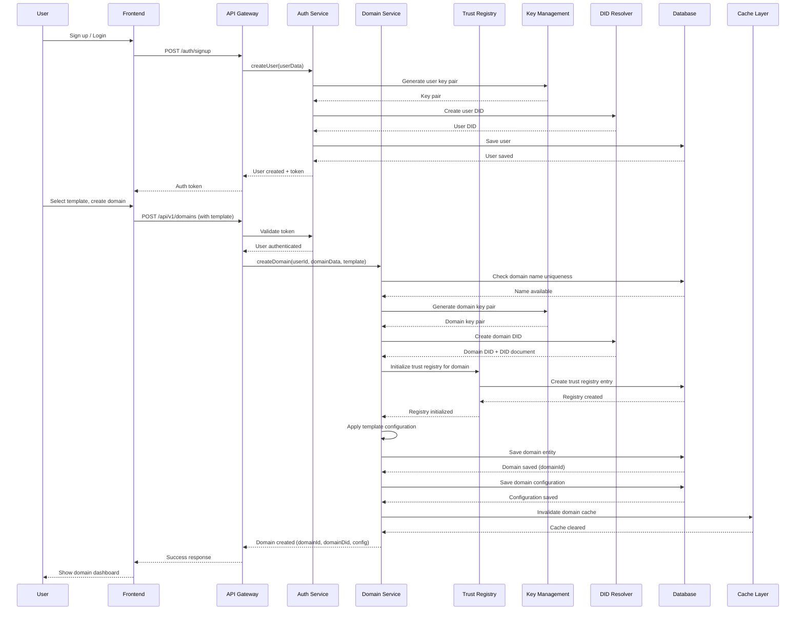

---

## Summary

This UX guide provides:

1. **Complete user journeys** from signup to credential management
2. **Detailed screen mockups** for each step
3. **Backend sequence diagrams** showing system interactions
4. **Scenarios** for DID creation, credential updates, and revocation
5. **Error handling** for common edge cases
6. **Mobile considerations** for responsive design

The guide ensures users can:
- Create and configure trusted domains easily
- Issue and manage verifiable credentials
- Handle credential lifecycle (create, update, revoke)
- Create DIDs and assign credentials to them
- Manage wallets and organize credentials
- Create verifiable presentations with selective disclosure
- Anchor credentials to blockchain for immutable audit trails
- Create and manage smart contracts
- Understand system behavior through clear feedback

All flows are designed with progressive disclosure, clear feedback, and error recovery in mind.

## Complete Workflow Coverage

This guide now covers all critical workflows for a TrustWeave SaaS platform:

✅ **Domain Management** - Creating, configuring, and managing trusted domains
✅ **Credential Lifecycle** - Issuance, verification, updates, and revocation
✅ **DID Management** - Creating DIDs and assigning credentials
✅ **Wallet Management** - Organizing and managing credential wallets
✅ **Presentations** - Creating verifiable presentations with selective disclosure
✅ **Blockchain Anchoring** - Immutable audit trails and provenance
✅ **Smart Contracts** - Automated, verifiable agreements

For additional workflows and future enhancements, see [Missing Workflows Analysis](./missing-workflows-analysis.md).

