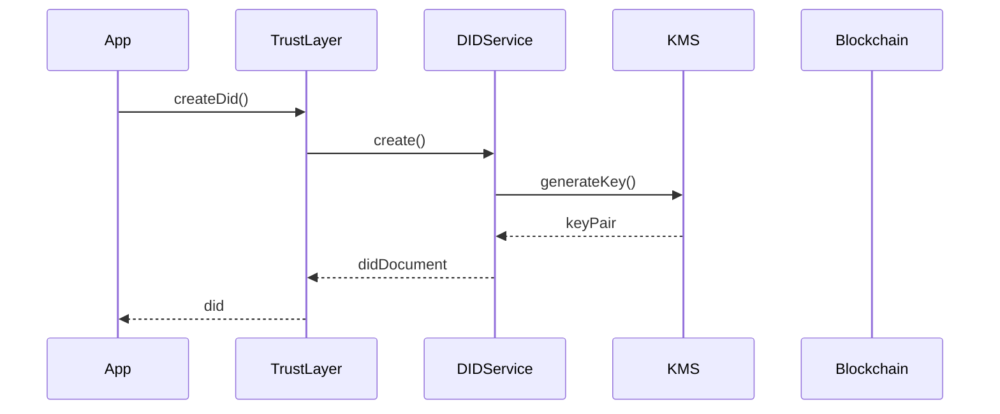

# TrustWeave SDK Documentation - Comprehensive Review

**Review Date:** January 2025  
**Reviewer:** Documentation Architect  
**Documentation Version:** 1.0.0-SNAPSHOT  
**Jekyll Theme:** Just the Docs  
**Site:** GitHub Pages (`/trustweave`)

---

## 1. High-Level Summary

### Overall Quality: **8.0/10**

The TrustWeave documentation is **comprehensive, well-written, and technically accurate**, with excellent content depth covering 25+ real-world scenarios, detailed API references, and thorough conceptual explanations. The migration from GitBook to Jekyll/Just the Docs was successful, and the site structure is fundamentally sound.

**Major Strengths:**
- ✅ **Comprehensive content** - 25+ scenarios, detailed API docs, thorough concepts
- ✅ **Good code examples** - Runnable, properly highlighted, with error handling
- ✅ **Clear structure** - Logical section organization (Introduction → Getting Started → Core Concepts → API)
- ✅ **Search enabled** - Lunr.js search configured and working
- ✅ **Proper Jekyll setup** - Clean `_config.yml`, appropriate theme configuration
- ✅ **Strong onboarding** - Clear Quick Start, Installation guide, Mental Model

**Critical Issues:**
- ❌ **Navigation order confusion** - Introduction section appears correctly at nav_order: 0, but navigation structure could be clearer
- ❌ **Missing breadcrumbs** - Just the Docs supports them but not fully configured
- ❌ **Inconsistent front matter** - Some pages missing `nav_order`, inconsistent patterns
- ❌ **Long pages** - `core-api.md` (1811+ lines), `quick-start.md` (598 lines) need splitting
- ⚠️ **Navigation depth** - 9 top-level sections is acceptable but could be optimized

**Key Opportunities:**
- Improve discoverability of common tasks
- Add more visual hierarchy and callouts
- Implement Jekyll collections for better organization
- Enhance search with keywords and tags
- Create reusable includes for consistency

---

## 2. Information Architecture & Navigation Review

### Current Navigation Structure

The navigation in `_config.yml` is well-organized with 9 main sections:

1. **Introduction** (nav_order: 0) ✅ - Correctly positioned first
2. **Getting Started** (nav_order: 1) ✅
3. **Core Concepts** (nav_order: 2) ✅
4. **Tutorials & Examples** (nav_order: 3) ✅
5. **API Reference** (nav_order: 4) ✅
6. **Integrations** (nav_order: 5) ✅
7. **Advanced Topics** (nav_order: 6) ✅
8. **Reference** (nav_order: 7) ✅
9. **Contributing** (nav_order: 8) ✅
10. **Resources** (nav_order: 9) ✅

### Issues Identified

#### 🔴 **CRITICAL: Breadcrumbs Not Fully Functional**

**Problem:** While `breadcrumbs: true` is set in `_config.yml`, breadcrumbs may not be displaying correctly due to missing configuration or theme version issues.

**Current Configuration:**
```yaml
just_the_docs:
  breadcrumbs: true
  has_breadcrumbs: true  # Redundant
```

**Recommendation:**
```yaml
just_the_docs:
  breadcrumbs: true
  # Remove has_breadcrumbs (redundant)
  breadcrumbs_separator: " / "
```

**Verification:** Test breadcrumbs on nested pages (e.g., `getting-started/quick-start.md`) to ensure they display correctly.

#### 🟡 **Navigation Depth - Could Be Optimized**

**Current:** 9 top-level sections is acceptable but could be streamlined.

**Recommendation:** Consider consolidating:
- Merge "Resources" (FAQ, Glossary, Plugins, Whitepaper) into "Reference" section
- This would reduce to 8 sections, which is optimal

**Proposed Structure:**
```yaml
nav:
  - Introduction (0)
  - Getting Started (1)
  - Core Concepts (2)
  - Tutorials & Examples (3)
  - API Reference (4)
  - Integrations (5)
  - Advanced Topics (6)
  - Reference (7)  # Includes FAQ, Glossary, Plugins, Whitepaper
  - Contributing (8)
```

#### 🟡 **Missing Navigation Metadata**

**Problem:** Some pages in navigation don't have corresponding `nav_order` in front matter, which can cause ordering issues.

**Recommendation:** Ensure all pages in navigation have matching front matter:
```yaml
---
title: Page Title
nav_order: X
parent: Parent Section (if applicable)
---
```

#### 🟡 **Mental Model Path Consistency**

**Current:** `introduction/mental-model.md` is correctly placed in Introduction section.

**Status:** ✅ **No issue** - The file is correctly located and referenced.

---

## 3. Jekyll Site Structure & Maintainability

### Current Structure Assessment

**✅ Excellent Practices:**
- Clean `_config.yml` with logical navigation
- Proper use of Just the Docs theme
- Search enabled (Lunr.js)
- Mermaid diagrams configured
- Proper exclusion of build artifacts
- Custom includes directory (`_includes/note.html`, `tip.html`, `warning.html`)

**❌ Issues Found:**

#### 🔴 **Inconsistent Front Matter**

**Problem:** Not all pages have consistent front matter patterns.

**Examples:**
- Some pages have `layout: default` (redundant with defaults)
- Some scenario pages missing `nav_order`
- Inconsistent `title` vs filename matching

**Recommendation:** Create a front matter template:

```yaml
---
title: Page Title
nav_order: X
parent: Parent Section (if child page)
keywords:
  - keyword1
  - keyword2
---
```

**Action Items:**
1. Audit all pages for consistent front matter
2. Remove redundant `layout: default` (handled by defaults in `_config.yml`)
3. Ensure all navigation pages have `nav_order`
4. Standardize `title` field (should match H1 heading)

#### 🟡 **No Jekyll Collections**

**Problem:** Scenarios, integrations, and tutorials could benefit from Jekyll collections for better organization and metadata.

**Current:** Flat markdown files in directories

**Recommendation:** Implement collections:

```yaml
# _config.yml
collections:
  scenarios:
    output: true
    permalink: /:collection/:name/
  integrations:
    output: true
    permalink: /:collection/:name/
```

**Benefits:**
- Automatic metadata (tags, categories, dates)
- Better filtering and organization
- Easier to generate index pages
- Consistent front matter validation
- Can add custom layouts per collection

**Example Collection Structure:**
```
_scenarios/
  academic-credentials.md
  healthcare-medical-records.md
  ...
```

**Front Matter Template for Collections:**
```yaml
---
title: Academic Credentials Scenario
category: education
tags:
  - education
  - credentials
  - academic
difficulty: beginner
estimated_time: 30
---
```

#### 🟡 **Navigation in `_config.yml` vs `_data/navigation.yml`**

**Current:** Navigation is hardcoded in `_config.yml` (387 lines of navigation config).

**Recommendation:** For better maintainability, consider moving to `_data/navigation.yml`:

```yaml
# _data/navigation.yml
main:
  - title: Introduction
    url: introduction/
    nav_order: 0
    children:
      - title: Overview
        url: introduction/README.md
      # ... etc
```

Then reference in `_config.yml`:
```yaml
nav: site.data.navigation.main
```

**Benefits:**
- Easier to maintain (separate file)
- Can be version controlled independently
- Supports multiple navigation structures
- Better for large sites

**Trade-off:** Current approach is fine for current size, but consider migration if navigation grows.

#### 🟡 **Missing Custom Layouts**

**Problem:** No custom layouts for different page types (scenarios, API reference, tutorials).

**Recommendation:** Create specialized layouts:

```
_layouts/
  default.html (Just the Docs default)
  scenario.html (for scenario pages)
  api-reference.html (for API pages)
  tutorial.html (for tutorial pages)
```

**Example Scenario Layout:**
```liquid
---
layout: default
---

<div class="scenario-header">
  <div class="scenario-meta">
    <span class="category">{{ page.category }}</span>
    <span class="difficulty">{{ page.difficulty }}</span>
    <span class="time">{{ page.estimated_time }} min</span>
  </div>
</div>

{{ content }}
```

#### 🟡 **Includes Could Be Enhanced**

**Current:** Basic includes exist (`note.html`, `tip.html`, `warning.html`)

**Recommendation:** Enhance includes with more features:

```liquid
<!-- _includes/code-example.html -->
<div class="code-example">
  
    <div class="code-example-badge">Runnable</div>
  
  
    <a href="{{ include.source }}" class="code-example-source">View Source</a>
  
  
  {{ include.code }}
  
  
    <div class="code-example-output">
      <strong>Expected Output:</strong>
      <pre>{{ include.output }}</pre>
    </div>
  
</div>
```

**Usage:**
```liquid

```

---

## 4. Developer Experience (DX) Evaluation

### Discoverability Assessment

#### ✅ **Excellent:**
- Quick Start is prominently placed (Getting Started → Quick Start)
- Installation guide is easy to find
- Search functionality works
- Clear section organization
- Mental Model page is well-placed in Introduction

#### ❌ **Issues:**

#### 🔴 **Entry Point Strategy**

**Problem:** Multiple potential entry points create confusion:
1. `docs/index.html` - Landing page (marketing-focused)
2. `docs/README.md` - Documentation overview
3. `docs/getting-started/README.md` - Getting Started overview

**Current State:**
- `index.html` is a marketing landing page with waitlist form
- `README.md` may not be the default page served by GitHub Pages
- Unclear which page users should land on first

**Recommendation:**
1. **Make `index.html` the clear entry point** with prominent "Get Started" CTA
2. **Add documentation navigation** to `index.html` (link to Getting Started)
3. **Ensure GitHub Pages serves `index.html`** as default (configure in repo settings)
4. **Add redirect** from root to `/trustweave/` if needed

**Proposed `index.html` Structure:**
```html
<!-- Hero section with CTA -->
<section class="hero">
  <h1>TrustWeave Developer Documentation</h1>
  <p>Build decentralized identity and trust systems with Kotlin</p>
  <a href="/trustweave/getting-started/quick-start.html" class="btn-primary">Get Started</a>
  <a href="/trustweave/introduction/what-is-trustweave.html" class="btn-secondary">Learn More</a>
</section>

<!-- Quick links section -->
<section class="quick-links">
  <h2>Quick Links</h2>
  <div class="links-grid">
    <a href="/trustweave/getting-started/quick-start.html">Quick Start</a>
    <a href="/trustweave/api-reference/">API Reference</a>
    <a href="/trustweave/scenarios/">Use Case Scenarios</a>
    <a href="/trustweave/faq.html">FAQ</a>
  </div>
</section>
```

#### 🟡 **Common Tasks Not Easily Discoverable**

**Problem:** Common developer tasks require 2-3 clicks:
- "How do I issue a credential?" → Getting Started → Quick Start → scroll
- "What DID methods are supported?" → Integrations → README → scroll to DID Methods
- "How do I handle errors?" → Advanced Topics → Error Handling

**Recommendation:** Add a "Common Tasks" quick links section on homepage and key pages:

```markdown
## Common Tasks

- **[Issue Your First Credential](getting-started/quick-start.md#step-4-issue-a-credential)** - 5 minutes
- **[Supported DID Methods](integrations/README.md#did-methods)** - Complete list
- **[Error Handling Guide](advanced/error-handling.md)** - Production patterns
- **[All Use Case Scenarios](scenarios/README.md)** - 25+ examples
- **[API Quick Reference](api-reference/README.md#quick-reference)** - Method lookup
```

#### 🟡 **Missing "Next Steps" Guidance**

**Problem:** Pages don't guide users to logical next steps.

**Current:** Some pages have "Next Steps" (good!), but not all key pages.

**Recommendation:** Add "Next Steps" to all key pages using a consistent template:

```markdown
## Next Steps

**New to TrustWeave?**
- [Quick Start](../getting-started/quick-start.md) - Create your first credential
- [Mental Model](../introduction/mental-model.md) - Understand core concepts

**Ready to build?**
- [Your First Application](../getting-started/your-first-application.md) - Complete example
- [Common Patterns](../getting-started/common-patterns.md) - Production patterns

**Looking for examples?**
- [Use Case Scenarios](../scenarios/README.md) - Real-world examples
- [Tutorials](../tutorials/README.md) - Step-by-step guides
```

**Pages That Need "Next Steps":**
- All Introduction pages
- All Getting Started pages
- All Core Concepts pages
- API Reference pages
- Scenario pages

#### 🟡 **Search Optimization**

**Problem:** No explicit keywords or tags in front matter for better search results.

**Recommendation:** Add keywords to front matter:

```yaml
---
title: Quick Start
keywords:
  - quick start
  - getting started
  - first credential
  - tutorial
  - beginner
---
```

**Benefits:**
- Better search relevance
- Easier to find related content
- Can generate tag pages

---

## 5. Getting Started & Quick Start Assessment

### Quick Start Page Analysis

**File:** `getting-started/quick-start.md` (598 lines)

#### ✅ **Strengths:**
- Complete runnable example provided
- Good error handling examples
- Clear step-by-step instructions
- Proper code highlighting
- Good use of callouts and notes
- Links to related content

#### 🟡 **Issues:**

#### **Page Length**

**Problem:** 598 lines is long for a "Quick Start" - should be <300 lines for optimal readability.

**Recommendation:** Split into progressive steps:

1. **Quick Start (5 min)** - Minimal working example (current "Complete Runnable Example")
   - Keep this as the main Quick Start page
   - Remove detailed explanations (move to step-by-step guide)
   - Focus on "get it running fast"

2. **Step-by-Step Guide** - Detailed explanations (current "Step-by-Step Guide" section)
   - Move to separate page: `getting-started/quick-start-detailed.md`
   - Link from Quick Start: "Want more details? See [Step-by-Step Guide](quick-start-detailed.md)"

3. **Error Handling Patterns** - Current section is good but could be separate
   - Keep in Quick Start but make it collapsible or link to detailed guide

**Proposed Structure:**
```
getting-started/
  quick-start.md (200-300 lines) - Fast track
  quick-start-detailed.md (400+ lines) - Deep dive
  your-first-application.md (existing)
```

#### **Installation Guide Issues**

**File:** `getting-started/installation.md`

**✅ Good:**
- Comprehensive coverage (Gradle, Maven, minimal setup)
- Clear prerequisites
- Verification steps

**🟡 Improvements Needed:**

1. **Add Prerequisites Checklist:**
```markdown
## Prerequisites Checklist

Before installing TrustWeave, verify you have:

- [ ] Java 21+ installed (`java -version`)
- [ ] Kotlin 2.2.0+ (via Gradle plugin, no manual install needed)
- [ ] Gradle 8.5+ (via wrapper, no manual install needed)
- [ ] IDE configured (see [IDE Setup](ide-setup.md))

**Optional:**
- [ ] Docker (for TestContainers tests)
- [ ] Basic Kotlin knowledge (coroutines, data classes)
```

2. **Add Quick Install Section:**
```markdown
## Quick Install (Gradle)

For most users, add this single dependency:

```kotlin
dependencies {
    implementation("com.trustweave:trustweave-all:1.0.0-SNAPSHOT")
}
```

✅ **That's it!** See [Quick Start](quick-start.md) to create your first credential.

**For production:** See [Minimal Setup](#minimal-setup) to use individual modules.
```

3. **Visual Indicators:**
```markdown
## Installation Methods

### 🚀 Recommended: Gradle (Kotlin DSL)
[Gradle Kotlin DSL section]

### 📦 Alternative: Gradle (Groovy)
[Gradle Groovy section]

### ☕ Alternative: Maven
[Maven section]
```

---

## 6. Code Examples & Snippet Quality

### Code Quality Assessment

#### ✅ **Strengths:**
- Proper Kotlin syntax highlighting
- Complete, runnable examples
- Good use of comments
- Error handling included
- Consistent code style

#### 🟡 **Issues:**

#### **Inconsistent Code Block Formatting**

**Current:** Mix of triple backticks and potentially Jekyll highlight tags.

**Recommendation:** Standardize on Jekyll highlight for better control:

```liquid

// code with syntax highlighting

```

**Benefits:**
- Better syntax highlighting (Rouge)
- Line number support (if needed)
- Consistent styling
- Better for copy-paste

**Migration:** Can be done gradually, but new examples should use Jekyll highlight.

#### **Missing Code Example Metadata**

**Problem:** No way to:
- Link to source code
- Indicate if example is runnable
- Show expected output
- Indicate version compatibility

**Recommendation:** Create enhanced code example include:

```liquid
<!-- _includes/code-example.html -->
<div class="code-example">
  
    <div class="code-example-badge runnable">✓ Runnable</div>
  
  
    <a href="{{ include.source }}" class="code-example-source" target="_blank">
      View Source <span class="external-icon">↗</span>
    </a>
  
  
    <div class="code-example-title">{{ include.title }}</div>
  
  
  {{ include.code }}
  
  
    <div class="code-example-output">
      <strong>Expected Output:</strong>
      <pre>{{ include.output }}</pre>
    </div>
  
  
    <div class="code-example-note">
      <strong>Note:</strong> {{ include.note }}
    </div>
  
</div>
```

**Usage:**
```liquid

```

#### **Long Code Blocks**

**Problem:** Some examples are 100+ lines, making them hard to scan.

**Recommendation:**
1. **Break into logical sections** with headings:
```markdown
### Step 1: Create TrustLayer

```kotlin
// code for step 1
```

### Step 2: Create DID

```kotlin
// code for step 2
```
```

2. **Use collapsible sections** for optional/advanced parts:
```html
<details>
<summary>Advanced: Custom Configuration</summary>

```kotlin
// advanced code
```

</details>
```

3. **Add "View Full Example" links** to GitHub:
```markdown
> **Full Example:** See [QuickStart.kt](https://github.com/geoknoesis/TrustWeave/blob/main/examples/QuickStart.kt) for the complete code.
```

#### **Missing Code Example Styles**

**Recommendation:** Add CSS for code example enhancements:

```scss
// assets/css/custom.scss
.code-example {
  position: relative;
  margin: 1.5rem 0;
  
  .code-example-badge {
    position: absolute;
    top: 0.5rem;
    right: 0.5rem;
    padding: 0.25rem 0.5rem;
    background: #10b981;
    color: white;
    border-radius: 0.25rem;
    font-size: 0.75rem;
    font-weight: 600;
  }
  
  .code-example-source {
    display: block;
    text-align: right;
    margin-top: 0.5rem;
    font-size: 0.875rem;
    color: #2563eb;
  }
  
  .code-example-output {
    margin-top: 1rem;
    padding: 1rem;
    background: #f3f4f6;
    border-left: 3px solid #10b981;
    pre {
      margin: 0;
      background: transparent;
    }
  }
}
```

---

## 7. Page Layout, Readability, and UX

### Page Length Analysis

**Findings:**
- `quick-start.md`: 598 lines - **Too long** (should be <300)
- `core-api.md`: 1811+ lines - **Very long** (should be split)
- Scenario pages: ~200-400 lines - **Acceptable**
- Most concept pages: ~200-300 lines - **Good**

**Recommendation:**
- Split `quick-start.md` (see section 5)
- Split `core-api.md` (see section 8)
- Keep scenario pages as-is (comprehensive examples are expected)

### Heading Consistency

**✅ Good:** Most pages use consistent heading hierarchy (H1 → H2 → H3)

**🟡 Issue:** Some pages have inconsistent spacing or too many H2s

**Recommendation:** Enforce heading style guide:

```markdown
# H1: Page Title (one per page)

## H2: Major Section (3-5 per page max)

### H3: Subsection

#### H4: Sub-subsection (use sparingly)
```

**Action Items:**
1. Audit all pages for heading consistency
2. Ensure one H1 per page (title)
3. Limit H2s to 3-5 per page
4. Use H3+ for subsections

### Callouts and Styled Boxes

**Current:** Good use of callouts (`> **Note:**`, `> **Warning:**`)

**Recommendation:** Enhance with Just the Docs callout classes:

```markdown
{: .warning }
> **Warning:** This operation is irreversible. Make sure you have backups.

{: .note }
> **Note:** This feature requires Java 21+. See [Installation](installation.md) for setup.

{: .tip }
> **Tip:** Use `trustweave-all` for quick prototyping. For production, use individual modules.

{: .important }
> **Important:** Always use try-catch blocks in production code. See [Error Handling](error-handling.md).
```

**Benefits:**
- Better visual hierarchy
- Consistent styling
- Better accessibility
- Easier to scan

**Current Includes:** `_includes/note.html`, `tip.html`, `warning.html` exist but may not be using Just the Docs classes.

**Recommendation:** Update includes to use Just the Docs classes:

```liquid
<!-- _includes/warning.html -->
{: .warning }
> **Warning:** {{ include.content }}
```

### Table of Contents

**Current:** Just the Docs automatically generates TOC for pages with multiple headings.

**Recommendation:** Ensure TOC is enabled and visible on long pages:

```yaml
# _config.yml
just_the_docs:
  heading_anchors: true  # Already enabled ✅
  # TOC is automatic, but can be customized
```

**For very long pages:** Consider adding manual "On This Page" section:

```markdown
## On This Page

- [Quick Start](#quick-start)
- [Step-by-Step Guide](#step-by-step-guide)
- [Error Handling](#error-handling-patterns)
- [Next Steps](#next-steps)
```

---

## 8. API Reference Quality & Organization

### Current Structure

**✅ Good:**
- Separate pages for Core API, Wallet API, Credential Service API, Smart Contract API
- Clear method signatures
- Examples included
- Error handling documented
- Quick reference table in `api-reference/README.md`

**❌ Issues:**

#### 🔴 **Core API Page Too Long**

**Problem:** `core-api.md` is 1811+ lines. This is overwhelming and hard to navigate.

**Recommendation:** Split by domain:

```
api-reference/
  core-api/
    README.md (overview + quick reference)
    dids.md (DID operations)
    credentials.md (credential operations)
    wallets.md (wallet operations)
    blockchain.md (blockchain anchoring)
    trust.md (trust operations)
    contracts.md (smart contract operations)
```

**Benefits:**
- Easier to navigate
- Faster page loads
- Better search results
- Can link directly to specific operations

**Migration Strategy:**
1. Create new directory structure
2. Split content by domain
3. Update navigation in `_config.yml`
4. Add redirects from old URLs (if needed)
5. Update internal links

#### 🟡 **Missing API Index**

**Problem:** While `api-reference/README.md` has a quick reference table, it could be more comprehensive.

**Current:** Good quick reference table exists ✅

**Enhancement:** Add more detail:

```markdown
## Complete API Index

### DID Operations
| Method | Description | Page |
|--------|------------|------|
| `createDid()` | Create a new DID | [Core API - DIDs](core-api/dids.md#create) |
| `resolveDid()` | Resolve DID to document | [Core API - DIDs](core-api/dids.md#resolve) |
| `updateDid()` | Update DID document | [Core API - DIDs](core-api/dids.md#update) |
| `deactivateDid()` | Deactivate a DID | [Core API - DIDs](core-api/dids.md#deactivate) |

### Credential Operations
[Similar table for credentials]

### Wallet Operations
[Similar table for wallets]
```

#### 🟡 **Inconsistent API Documentation Format**

**Problem:** Some methods have detailed docs, others are brief.

**Recommendation:** Standardize API doc template:

```markdown
### `methodName()`

**Description:** One-line description of what this method does.

**Signature:**
```kotlin
suspend fun methodName(
    param1: Type1,
    param2: Type2 = defaultValue
): ReturnType
```

**Parameters:**
- `param1` (Type1, required): Description of parameter
- `param2` (Type2, optional, default: `defaultValue`): Description

**Returns:** Description of return value

**Throws:**
- `TrustWeaveError.SpecificError` - When specific condition occurs
- `TrustWeaveError.AnotherError` - When another condition occurs

**Performance:**
- **Time Complexity:** O(n) where n is...
- **Network Calls:** 1 (DID resolution)
- **Thread Safety:** ✅ Thread-safe

**Example:**
```kotlin
// example code
```

**See Also:**
- [Related Method](related-method.md)
- [Concept Guide](../core-concepts/related-concept.md)
```

**Action Items:**
1. Create API doc template
2. Audit all API methods
3. Fill in missing information
4. Ensure consistency

#### 🟡 **Missing API Versioning Information**

**Problem:** No clear indication of API stability or version compatibility.

**Recommendation:** Add versioning metadata:

```markdown
### `methodName()`

**Status:** ✅ Stable (since v1.0.0)  
**Deprecated:** ❌ No  
**Replacement:** N/A
```

**For deprecated methods:**
```markdown
### `oldMethod()`

**Status:** ⚠️ Deprecated (since v1.1.0)  
**Replacement:** [newMethod()](#newmethod)  
**Removal:** Will be removed in v2.0.0
```

---

## 9. Missing Topics & Coverage Gaps

### Identified Gaps

#### 🟡 **Missing Troubleshooting Scenarios**

**Current:** `getting-started/troubleshooting.md` exists ✅

**Enhancement:** Add more specific troubleshooting scenarios:
- "DID resolution fails" → Common causes and solutions
- "Credential verification fails" → Debugging steps
- "Blockchain anchoring timeout" → Network and configuration issues
- "KMS connection errors" → Provider-specific troubleshooting

#### 🟡 **Missing Performance Guide**

**Current:** `advanced/performance.md` exists ✅

**Enhancement:** Add more specific guidance:
- Benchmarking results
- Performance best practices
- Caching strategies
- Scalability considerations

#### 🟡 **Missing Migration Guides**

**Current:** `migration/migrating-to-1.0.0.md` exists ✅

**Enhancement:** Add more migration scenarios:
- Migrating from other SDKs
- Upgrading between TrustWeave versions
- Migrating from in-memory to production KMS
- Migrating from one DID method to another

#### 🟡 **Missing Security Best Practices**

**Current:** `security/README.md` exists ✅

**Enhancement:** Add more specific guidance:
- Key management best practices
- Secure credential storage
- Network security considerations
- Compliance requirements (SOC2, GDPR, etc.)

#### 🟡 **Missing Architecture Diagrams**

**Current:** Some diagrams exist (architecture-overview.md)

**Enhancement:** Add more visual aids:
- System architecture diagrams
- Data flow diagrams
- Sequence diagrams for common operations
- Plugin architecture diagrams

**Recommendation:** Use Mermaid diagrams (already configured):

```markdown

```

---

## 10. Concrete, Actionable Improvement Plan

### Phase 1: Critical Fixes (Priority: 🔴 High, Time: 1-2 days)

#### 1.1 Enable and Test Breadcrumbs
- [ ] Verify breadcrumbs display correctly on nested pages
- [ ] Fix any breadcrumb configuration issues
- [ ] Test on multiple page types (scenarios, API, concepts)

#### 1.2 Standardize Front Matter
- [ ] Audit all pages for consistent front matter
- [ ] Remove redundant `layout: default`
- [ ] Ensure all navigation pages have `nav_order`
- [ ] Standardize `title` field

#### 1.3 Fix Navigation Consolidation
- [ ] Merge "Resources" into "Reference" section
- [ ] Update navigation in `_config.yml`
- [ ] Update internal links

#### 1.4 Split Long Pages
- [ ] Split `quick-start.md` into Quick Start + Detailed Guide
- [ ] Plan splitting `core-api.md` (create structure, not full migration yet)

### Phase 2: Structure Improvements (Priority: 🟡 Medium, Time: 3-5 days)

#### 2.1 Enhance Entry Point
- [ ] Update `index.html` with clear documentation navigation
- [ ] Add "Quick Links" section
- [ ] Ensure GitHub Pages serves `index.html` correctly

#### 2.2 Add "Next Steps" to Key Pages
- [ ] Create "Next Steps" template
- [ ] Add to all Introduction pages
- [ ] Add to all Getting Started pages
- [ ] Add to all Core Concepts pages
- [ ] Add to API Reference pages

#### 2.3 Improve Code Examples
- [ ] Create enhanced `code-example.html` include
- [ ] Add code example metadata (runnable, source links)
- [ ] Add CSS for code example enhancements
- [ ] Migrate key examples to use new include

#### 2.4 Enhance Callouts
- [ ] Update includes to use Just the Docs classes
- [ ] Add more callouts to key pages
- [ ] Create callout style guide

### Phase 3: Enhanced Features (Priority: 🟢 Low, Time: 1-2 weeks)

#### 3.1 Implement Jekyll Collections
- [ ] Create `_scenarios/` collection
- [ ] Create `_integrations/` collection
- [ ] Migrate existing files to collections
- [ ] Add collection-specific layouts

#### 3.2 Split API Reference
- [ ] Create `api-reference/core-api/` structure
- [ ] Split `core-api.md` by domain
- [ ] Update navigation
- [ ] Update internal links

#### 3.3 Add Search Optimization
- [ ] Add keywords to front matter
- [ ] Create tag system for scenarios
- [ ] Generate tag index pages

#### 3.4 Create Reusable Components
- [ ] Enhance `_includes/` directory
- [ ] Create scenario layout
- [ ] Create API reference layout
- [ ] Create tutorial layout

#### 3.5 Add Visual Aids
- [ ] Create architecture diagrams (Mermaid)
- [ ] Add sequence diagrams for common operations
- [ ] Create data flow diagrams

### Phase 4: Content Enhancements (Priority: 🟢 Low, Time: Ongoing)

#### 4.1 Expand Troubleshooting
- [ ] Add specific troubleshooting scenarios
- [ ] Add debugging guides
- [ ] Add common error solutions

#### 4.2 Enhance Security Documentation
- [ ] Add security best practices
- [ ] Add compliance guides
- [ ] Add threat modeling information

#### 4.3 Add Performance Guidance
- [ ] Add benchmarking results
- [ ] Add performance best practices
- [ ] Add scalability considerations

---

## Conclusion

The TrustWeave documentation is **comprehensive and well-written**, with excellent content depth and good technical accuracy. The migration to Jekyll/Just the Docs was successful, and the foundation is solid.

**Key Strengths:**
- ✅ Comprehensive content (25+ scenarios, detailed API docs)
- ✅ Good code examples with proper highlighting
- ✅ Clear structure and organization
- ✅ Search functionality enabled
- ✅ Proper Jekyll setup

**Key Areas for Improvement:**
- 🔴 Navigation consolidation and breadcrumb fixes
- 🔴 Front matter standardization
- 🟡 Page length optimization (split long pages)
- 🟡 Enhanced code examples with metadata
- 🟡 Better discoverability of common tasks

**Overall Assessment:** With the critical fixes implemented, this documentation would easily reach **9.5/10** quality. The foundation is excellent; it needs structural refinement and enhanced discoverability.

**Recommended Priority:**
1. **Immediate (Week 1):** Phase 1 critical fixes
2. **Short-term (Weeks 2-3):** Phase 2 structure improvements
3. **Medium-term (Month 2):** Phase 3 enhanced features
4. **Ongoing:** Phase 4 content enhancements

---

## Appendix: Quick Reference

### Recommended Navigation Order (Final)

```yaml
nav:
  - title: Introduction (nav_order: 0)
  - title: Getting Started (nav_order: 1)
  - title: Core Concepts (nav_order: 2)
  - title: Tutorials & Examples (nav_order: 3)
  - title: API Reference (nav_order: 4)
  - title: Integrations (nav_order: 5)
  - title: Advanced Topics (nav_order: 6)
  - title: Reference (nav_order: 7)  # Includes FAQ, Glossary, Plugins, Whitepaper
  - title: Contributing (nav_order: 8)
```

### Standard Front Matter Template

```yaml
---
title: Page Title
nav_order: X
parent: Parent Section (if child page)
keywords:
  - keyword1
  - keyword2
---
```

### Just the Docs Configuration Enhancements

```yaml
just_the_docs:
  breadcrumbs: true
  breadcrumbs_separator: " / "
  heading_anchors: true
  search_enabled: true
  search:
    button: true
```

### Code Example Include Template

```liquid

```

---

**End of Review**

