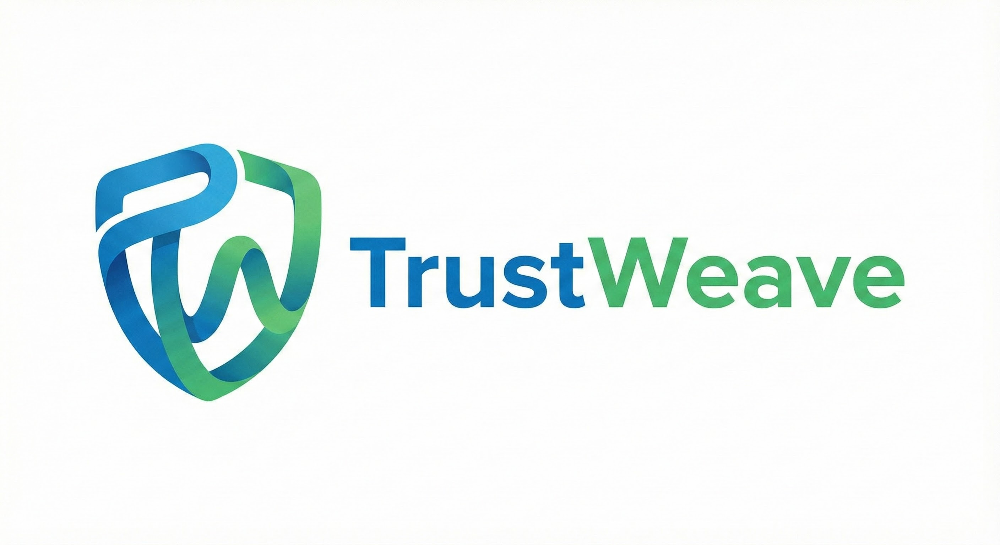

# TrustWeave

<div align="center">



### The Foundation for Decentralized Trust and Identity

**A neutral, reusable trust and identity core** library designed to be domain-agnostic, chain-agnostic, Decentralized Identifier (DID)-method-agnostic, and Key Management Service (KMS)-agnostic.

[](https://github.com/geoknoesis/TrustWeave)
[](LICENSE)
[](https://kotlinlang.org)

[Quick Start](#zap-quick-start) • [Documentation](getting-started/quick-start.md) • [Scenarios](scenarios/README.md) • [GitHub](https://github.com/geoknoesis/TrustWeave)

</div>

---

## 🚀 What is TrustWeave?

TrustWeave is a **production-ready Kotlin library** for building decentralized identity and trust systems. Built by [Geoknoesis LLC](https://www.geoknoesis.com), TrustWeave provides the building blocks you need to implement World Wide Web Consortium (W3C)-compliant verifiable credentials, Decentralized Identifiers (DIDs), and blockchain anchoring—all with a type-safe Application Programming Interface (API).

### ✨ Why TrustWeave?

- Domain-Agnostic** - Works for any use case (education, healthcare, Internet of Things (IoT), supply chain, etc.)
- Chain-Agnostic** - Supports any blockchain via pluggable adapters
- DID-Method-Agnostic** - Works with any Decentralized Identifier (DID) method (did:key, did:web, did:ion, etc.)
- KMS-Agnostic** - Supports any Key Management Service (KMS)
- Type-Safe** - Leverages Kotlin's type system for compile-time safety
- Coroutine-Based** - Built for modern async/await patterns
- Testable** - Comprehensive test utilities and in-memory implementations

---

## ⚡ Quick Start

Get started with TrustWeave in **30 seconds**:

```kotlin
import org.trustweave.trust.TrustWeave
import org.trustweave.trust.types.getOrThrowDid
import org.trustweave.trust.types.getOrThrow
import org.trustweave.credential.results.getOrThrow
import org.trustweave.credential.results.VerificationResult
import kotlinx.coroutines.runBlocking

fun main() = runBlocking {
    val trustWeave = TrustWeave.quickStart()

    val issuerDid = trustWeave.createDid { method("key"); algorithm("Ed25519") }.getOrThrowDid()
    println("Created DID: ${issuerDid.value}")

    val credential = trustWeave.issue {
        credential {
            type("VerifiableCredential", "PersonCredential")
            issuer(issuerDid)
            subject {
                id("did:example:alice")
                "name" to "Alice"
                "email" to "alice@example.com"
            }
        }
        signedBy(issuerDid)
    }.getOrThrow()

    val verification = trustWeave.verify(credential)
    when (verification) {
        is VerificationResult.Valid -> println("Credential valid: ✓")
        is VerificationResult.Invalid -> println("Invalid: ${verification.allErrors.joinToString()}")
    }
}
```

**Installation:**

```kotlin
dependencies {
    implementation("org.trustweave:distribution-all:0.6.0")
}
```

[📖 Full Quick Start Guide →](getting-started/quick-start.md)

---

## 🎯 Core Features

- W3C Compliant

Full support for World Wide Web Consortium (W3C) Verifiable Credentials 1.1 and Decentralized Identifier (DID) Core 1.0 specifications

- Decentralized Identifiers

Create, resolve, and manage Decentralized Identifiers (DIDs) with any DID method via pluggable interfaces

- Verifiable Credentials

Issue, verify, and manage verifiable credentials with cryptographic proofs

- Blockchain Anchoring

Anchor data to any blockchain with chain-agnostic interfaces

- Wallet Management

Store, organize, and present credentials with powerful wallet capabilities

- Key Management

Pluggable key management supporting multiple algorithms and backends

---

## 🌟 Real-World Use Cases

TrustWeave powers trust and identity systems across multiple domains. Explore **25+ complete scenarios** with runnable code examples:

### 🔐 Cybersecurity & Access Control

- **[Zero Trust Continuous Authentication](scenarios/zero-trust-authentication-scenario.md)** - Continuous authentication without sessions
- **[Security Clearance & Access Control](scenarios/security-clearance-access-control-scenario.md)** - Multi-level security clearance verification
- **[Software Supply Chain Security](scenarios/software-supply-chain-security-scenario.md)** - Prevent supply chain attacks with verifiable provenance

### 🆔 Identity & Verification

- **[Government Digital Identity](scenarios/government-digital-identity-scenario.md)** - Government-issued digital identity workflows
- **[Age Verification](scenarios/age-verification-scenario.md)** - Privacy-preserving age verification with photo association
- **[Biometric Verification](scenarios/biometric-verification-scenario.md)** - Multi-modal biometric verification (fingerprint, face, voice)

### 🎓 Education & Credentials

- **[Academic Credentials](scenarios/academic-credentials-scenario.md)** - University credential issuance and verification
- **[National Education Credentials](scenarios/national-education-credentials-algeria-scenario.md)** - National-level credential infrastructure

### 🏥 Healthcare

- **[Healthcare Medical Records](scenarios/healthcare-medical-records-scenario.md)** - Privacy-preserving medical data sharing
- **[Vaccination Health Passports](scenarios/vaccination-health-passport-scenario.md)** - Health credentials for travel and access

### 🔌 Internet of Things (IoT) & Devices

- **[IoT Device Identity](scenarios/iot-device-identity-scenario.md)** - Device onboarding and identity management
- **[IoT Sensor Data Provenance](scenarios/iot-sensor-data-provenance-scenario.md)** - Verify sensor data authenticity and integrity
- **[IoT Firmware Update Verification](scenarios/iot-firmware-update-verification-scenario.md)** - Secure firmware update verification

[📚 View All Scenarios →](scenarios/README.md)

---

## 🏗️ Architecture

TrustWeave is built on a modular, pluggable architecture:


**Key Design Principles:**

- **Neutrality** - No domain-specific or chain-specific logic in core
- **Pluggability** - All external dependencies via interfaces
- **Type Safety** - Compile-time guarantees with Kotlin
- **Testability** - In-memory implementations for all interfaces

[📖 Architecture Overview →](introduction/architecture-overview.md)

---

## 📚 Documentation

### 🚀 [Getting Started](getting-started/quick-start.md)

Installation, quick start guide, and common patterns

- [Quick Start](getting-started/quick-start.md) - Get up and running in 5 minutes
- [API Patterns](getting-started/api-patterns.md) - Correct API usage patterns
- [Mental Model](introduction/mental-model.md) - Understanding TrustWeave architecture
- [Production Deployment](getting-started/production-deployment.md) - Production best practices
- [Common Workflows](getting-started/workflows.md) - Real-world workflow examples

### 📖 [Core Concepts](core-concepts/README.md)

DIDs, Verifiable Credentials, Wallets, and Blockchain Anchoring

### 🔌 [Supported Plugins](api-reference/plugins.md)

Complete listing of all supported plugins with documentation links organized by category

### 🔧 [API Reference](api-reference/core-api.md)

Complete Application Programming Interface (API) documentation with examples

### 🎓 [Use Case Scenarios](scenarios/README.md)

25+ complete, runnable examples for real-world use cases

### ⚙️ [Advanced Topics](api-reference/advanced/key-rotation.md)

Key rotation, verification policies, plugin lifecycle, and more

### ❓ [FAQ](faq.md)

Common questions and answers

---

## 🎓 Learn by Example

Each scenario includes:

- Complete, runnable code** - Copy, paste, and run
- Industry context** - Real-world use cases and value propositions
- Best practices** - Production-ready patterns
- Visual diagrams** - Mermaid flowcharts showing the architecture
- Expected output** - See what success looks like

**Popular Examples:**

```kotlin
// Academic Credentials (universityDid / studentDid: Did)
val degree = trustWeave.issue {
    credential {
        type("VerifiableCredential", "DegreeCredential")
        issuer(universityDid)
        subject {
            id(studentDid)
            "degree" to "Bachelor of Science"
            "major" to "Computer Science"
        }
    }
    signedBy(issuerDid = universityDid, keyId = "${universityDid.value}#key-1")
}

// Age Verification (Privacy-Preserving)
val ageCredential = trustWeave.issue {
    credential {
        type("VerifiableCredential", "AgeVerificationCredential")
        issuer(identityProviderDid)
        subject {
            id(individualDid)
            "ageVerification" {
                "age" to 25
                "minimumAge" to 18
                // No personal details exposed!
            }
        }
    }
    signedBy(issuerDid = identityProviderDid, keyId = "${identityProviderDid.value}#key-1")
}

// Internet of Things (IoT) Sensor Data Provenance
val sensorData = trustWeave.issue {
    credential {
        type("VerifiableCredential", "SensorDataCredential")
        issuer(sensorDid)
        subject {
            "sensorData" {
                "dataDigest" to dataDigest
                "timestamp" to Instant.now().toString()
                "calibrationStatus" to "Valid"
            }
        }
    }
    signedBy(issuerDid = sensorDid, keyId = "${sensorDid.value}#key-1")
}
```

[🚀 Explore All Scenarios →](scenarios/README.md)

---

## 🛠️ Developer Experience

TrustWeave is designed for developer happiness:

### Type-Safe Configuration

```kotlin
val trustWeave = TrustWeave.quickStart()
// Or use TrustWeave.build { keys { ... }; did { ... } } for custom wiring
```

### Predictable Error Handling

```kotlin
import org.trustweave.trust.types.DidCreationResult

when (val didResult = trustWeave.createDid { method("key"); algorithm("Ed25519") }) {
    is DidCreationResult.Success -> println("Created: ${didResult.did}")
    is DidCreationResult.Failure -> println("Error: ${didResult}")
}
```

### Composable DSLs

```kotlin
// Requires a WalletFactory (e.g. testkit) configured on TrustWeave
val wallet = trustWeave.wallet {
    holder(userDid)
    enableOrganization()
    enablePresentation()
}.getOrThrow()
```

---

## 🤝 Community & Support

- **Created by**: [Geoknoesis LLC](https://www.geoknoesis.com)
- **License**: Dual license (Open source for non-commercial, Commercial for production)
- **Version**: 0.6.0
- **GitHub**: [geoknoesis/TrustWeave](https://github.com/geoknoesis/TrustWeave)

---

## 📖 Next Steps

### ▶️ [Quick Start](getting-started/quick-start.md)

Get up and running in 5 minutes

### 💡 [Use Case Scenarios](scenarios/README.md)

Explore 25+ real-world examples

### 📚 [Core Concepts](core-concepts/README.md)

Learn the fundamentals

### 🔌 [API Reference](api-reference/core-api.md)

Complete API documentation

---

<div align="center">

**Ready to build the future of trust and identity?**

[Get Started Now →](getting-started/quick-start.md)

Made with ❤️ by [Geoknoesis LLC](https://www.geoknoesis.com)

</div>
