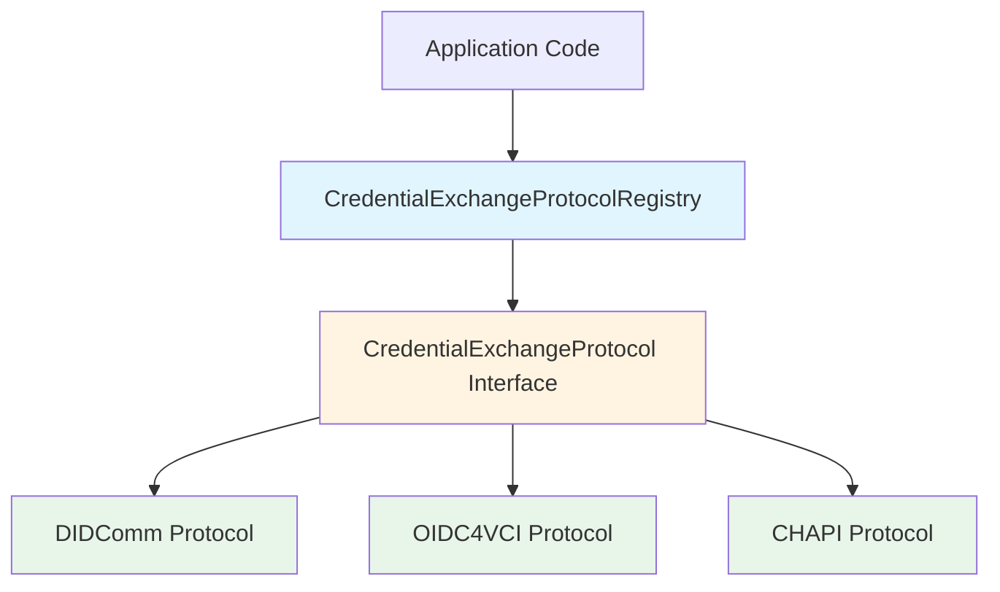
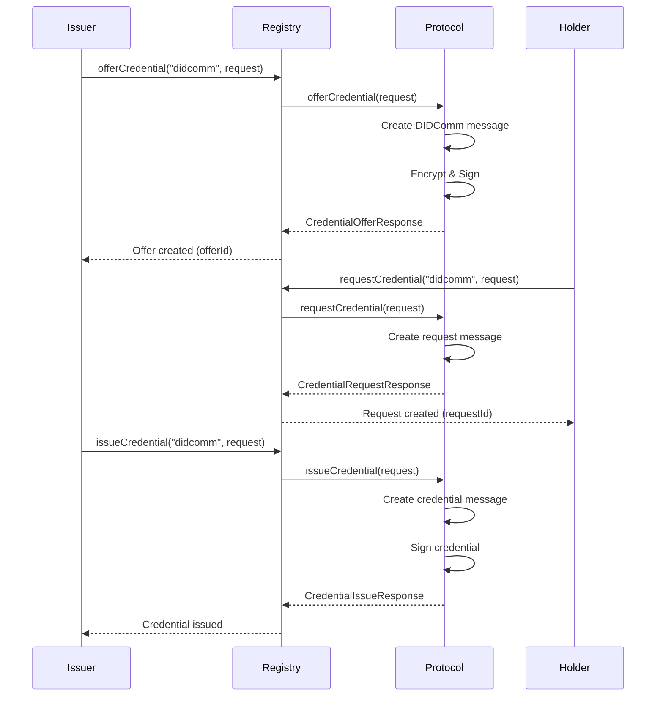
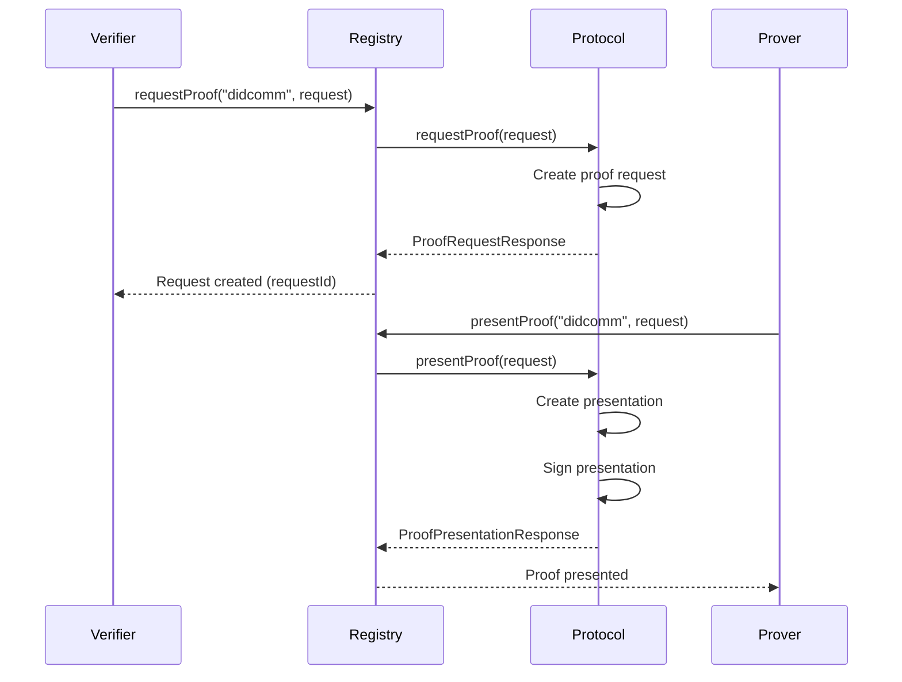

# Protocol Abstraction Layer

## Overview

The protocol abstraction layer provides a unified interface for credential exchange operations across different protocols (DIDComm, OIDC4VCI, CHAPI, OIDC4VP, etc.). This allows applications to use any protocol interchangeably without being tightly coupled to a specific implementation.

## Architecture

### High-Level Architecture



### Component Diagram

```
┌─────────────────────────────────────────────────────────┐
│         CredentialExchangeProtocolRegistry               │
│  (Manages multiple protocol implementations)             │
└─────────────────────────────────────────────────────────┘
                         │
                         │ uses
                         ▼
┌─────────────────────────────────────────────────────────┐
│         CredentialExchangeProtocol                       │
│  (Common interface for all protocols)                    │
└─────────────────────────────────────────────────────────┘
                         │
         ┌───────────────┼───────────────┐
         │               │               │
         ▼               ▼               ▼
┌──────────────┐ ┌──────────────┐ ┌──────────────┐
│   DIDComm    │ │   OIDC4VCI   │ │    CHAPI     │
│  Protocol    │ │   Protocol   │ │   Protocol   │
└──────────────┘ └──────────────┘ └──────────────┘
```

## Core Components

### 1. CredentialExchangeProtocol Interface

The main interface that all protocols implement:

```kotlin
interface CredentialExchangeProtocol {
    val protocolName: String
    val supportedOperations: Set<ExchangeOperation>
    
    suspend fun offerCredential(request: CredentialOfferRequest): CredentialOfferResponse
    suspend fun requestCredential(request: CredentialRequestRequest): CredentialRequestResponse
    suspend fun issueCredential(request: CredentialIssueRequest): CredentialIssueResponse
    suspend fun requestProof(request: ProofRequestRequest): ProofRequestResponse
    suspend fun presentProof(request: ProofPresentationRequest): ProofPresentationResponse
}
```

### 2. Exchange Models

Common data models used across all protocols:

- `CredentialOfferRequest` / `CredentialOfferResponse`
- `CredentialRequestRequest` / `CredentialRequestResponse`
- `CredentialIssueRequest` / `CredentialIssueResponse`
- `ProofRequestRequest` / `ProofRequestResponse`
- `ProofPresentationRequest` / `ProofPresentationResponse`

### 3. CredentialExchangeProtocolRegistry

Manages protocol registration and provides a unified API:

```kotlin
val registry = CredentialExchangeProtocolRegistry()

// Register protocols
registry.register(DidCommExchangeProtocol(didCommService))
registry.register(Oidc4VciExchangeProtocol(oidc4vciService))

// Use any protocol
val offer = registry.offerCredential("didcomm", request)
```

## Supported Protocols

### DIDComm V2

- **Protocol Name**: `"didcomm"`
- **Supported Operations**: All (offer, request, issue, proof request, proof presentation)
- **Implementation**: `DidCommExchangeProtocol`
- **Status**: ✅ Fully Implemented
- **Library**: Custom implementation with `didcomm-java` integration
- **Documentation**: [DIDComm Protocol](../features/credential-exchange-protocols/didcomm.md)

### OIDC4VCI

- **Protocol Name**: `"oidc4vci"`
- **Supported Operations**: Issuance only (offer, request, issue)
- **Implementation**: `Oidc4VciExchangeProtocol`
- **Status**: ✅ Implemented (Basic)
- **Library**: walt.id `waltid-openid4vc` (optional)
- **Documentation**: [OIDC4VCI Protocol](../features/credential-exchange-protocols/oidc4vci.md)

### CHAPI

- **Protocol Name**: `"chapi"`
- **Supported Operations**: Offer, issue, proof request, proof presentation
- **Implementation**: `ChapiExchangeProtocol`
- **Status**: ✅ Implemented (Basic)
- **Library**: Custom implementation (browser API wrapper)
- **Documentation**: [CHAPI Protocol](../features/credential-exchange-protocols/chapi.md)

## Message Flow

### Credential Issuance Flow



### Proof Request Flow



## Usage Examples

### Basic Usage

```kotlin
// Create registry
val registry = CredentialExchangeProtocolRegistry()

// Register DIDComm
val didCommService = DidCommFactory.createInMemoryService(kms, resolveDid)
registry.register(DidCommExchangeProtocol(didCommService))

// Offer credential
val offer = registry.offerCredential(
    protocolName = "didcomm",
    request = CredentialOfferRequest(
        issuerDid = "did:key:issuer",
        holderDid = "did:key:holder",
        credentialPreview = CredentialPreview(
            attributes = listOf(
                CredentialAttribute("name", "Alice"),
                CredentialAttribute("email", "alice@example.com")
            )
        ),
        options = mapOf(
            "fromKeyId" to "did:key:issuer#key-1",
            "toKeyId" to "did:key:holder#key-1"
        )
    )
)
```

### Complete Exchange Flow

```kotlin
// 1. Offer
val offer = registry.offerCredential("didcomm", offerRequest)

// 2. Request
val request = registry.requestCredential("didcomm", CredentialRequestRequest(
    holderDid = holderDid,
    issuerDid = issuerDid,
    offerId = offer.offerId,
    options = keyOptions
))

// 3. Issue
val issue = registry.issueCredential("didcomm", CredentialIssueRequest(
    issuerDid = issuerDid,
    holderDid = holderDid,
    credential = credential,
    requestId = request.requestId,
    options = keyOptions
))
```

### Protocol Switching

```kotlin
// Same API, different protocols
val didCommOffer = registry.offerCredential("didcomm", request)
val oidc4vciOffer = registry.offerCredential("oidc4vci", request)
```

## SPI (Service Provider Interface)

Protocols can be auto-discovered using Java ServiceLoader:

1. Implement `CredentialExchangeProtocolProvider`
2. Create `META-INF/services/com.trustweave.credential.exchange.spi.CredentialExchangeProtocolProvider`
3. List your provider class in the file

Example (DIDComm):
```
com.trustweave.credential.didcomm.exchange.spi.DidCommExchangeProtocolProvider
```

## Protocol-Specific Options

Each protocol may require protocol-specific options in the `options` map:

### DIDComm

- `fromKeyId`: Sender's key ID (required)
- `toKeyId`: Recipient's key ID (required)
- `encrypt`: Whether to encrypt (default: true)
- `thid`: Thread ID (optional)

### OIDC4VCI

- `credentialIssuer`: OIDC credential issuer URL (required)

### CHAPI

- Browser-specific options (to be defined)

## Benefits

1. **Protocol Agnostic**: Applications don't need to know which protocol is being used
2. **Easy Switching**: Change protocols by changing the protocol name
3. **Consistent API**: Same operations across all protocols
4. **Extensible**: Easy to add new protocols
5. **Type Safe**: Strong typing for all operations

## Protocol Implementation

For detailed information on implementing new protocols, see:
- [Protocol Implementation Guide](../features/credential-exchange-protocols/implementation-guide.md)

## Future Enhancements

- [x] Auto-discovery via SPI
- [ ] Protocol capability negotiation
- [ ] Protocol fallback/retry
- [ ] Protocol-specific validation
- [ ] Metrics and observability per protocol
- [ ] OIDC4VP implementation
- [ ] SIOPv2 implementation
- [ ] WACI implementation

