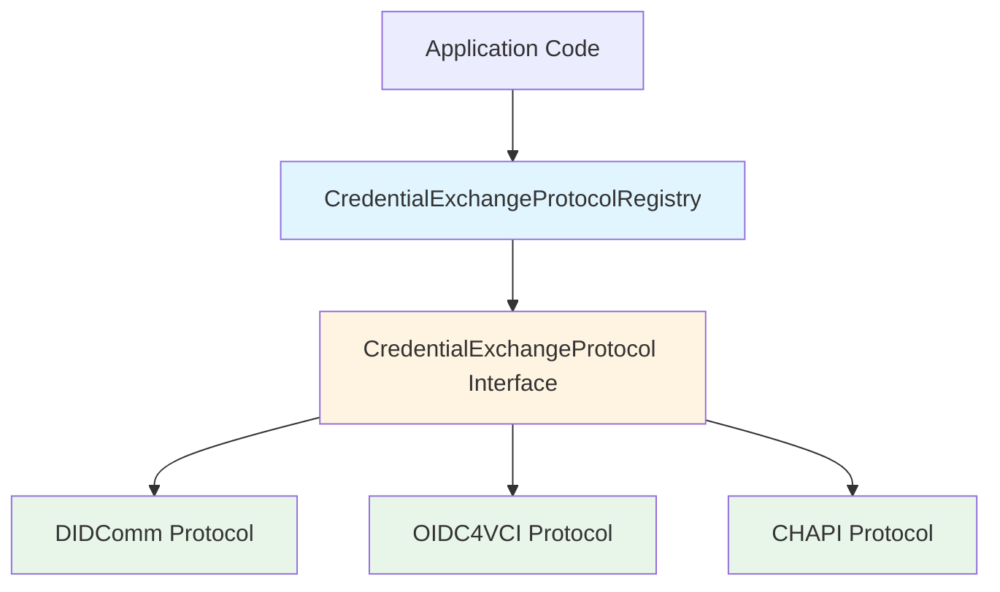
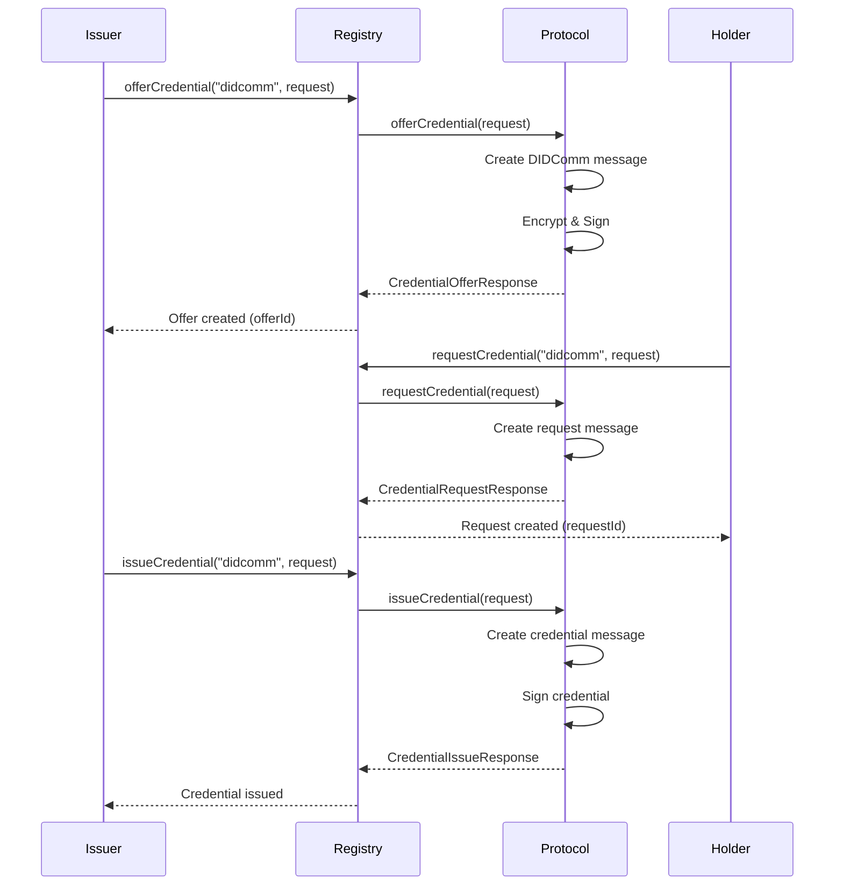
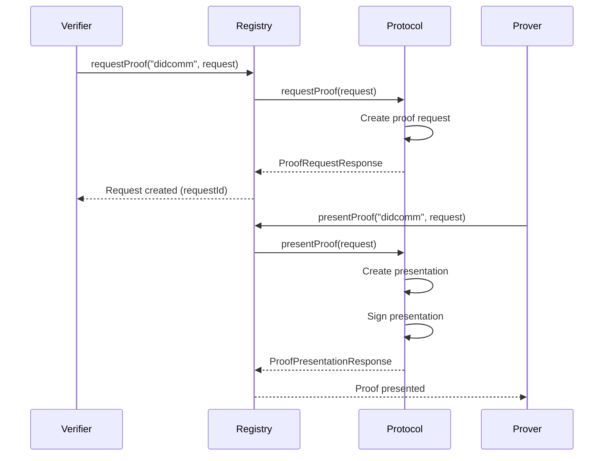

# Protocol Abstraction Layer

> **Note (audit 2026-05):** Code samples on this page describe a legacy registry-centric API (`CredentialExchangeProtocolRegistry.offerCredential(...)`, `requestCredential(...)`, `issueCredential(...)`, `requestProof(...)`, `presentProof(...)`) that does **not** exist in the current codebase. The real API surface uses `org.trustweave.credential.exchange.ExchangeService` with sealed `ExchangeRequest.Offer | Request | Issue` and `ProofExchangeRequest.Request | Presentation` types, returning `ExchangeResult<ExchangeResponse.*>`. The architecture diagrams and protocol descriptions below remain accurate. For the real API see [QUICK_START.md](../api-reference/features/credential-exchange-protocols/QUICK_START.md), [EXAMPLES.md](../api-reference/features/credential-exchange-protocols/EXAMPLES.md), and the source under `credentials/credential-api/src/main/kotlin/org/trustweave/credential/exchange/`.

## Overview

The protocol abstraction layer provides a unified interface for credential exchange operations across different protocols (DIDComm, OIDC4VCI, CHAPI, OIDC4VP, etc.). This allows applications to use any protocol interchangeably without being tightly coupled to a specific implementation.

## Architecture

### High-Level Architecture


```mermaid
graph TB
    App[Application Code]
    Registry[CredentialExchangeProtocolRegistry]
    Protocol[CredentialExchangeProtocol Interface]

    DIDComm[DIDComm Protocol]
    OIDC4VCI[OIDC4VCI Protocol]
    CHAPI[CHAPI Protocol]

    App --> Registry
    Registry --> Protocol
    Protocol --> DIDComm
    Protocol --> OIDC4VCI
    Protocol --> CHAPI

    style Registry fill:#e1f5ff
    style Protocol fill:#fff4e1
    style DIDComm fill:#e8f5e9
    style OIDC4VCI fill:#e8f5e9
    style CHAPI fill:#e8f5e9
```

### Component Diagram

```
┌─────────────────────────────────────────────────────────┐
│         CredentialExchangeProtocolRegistry               │
│  (Manages multiple protocol implementations)             │
└─────────────────────────────────────────────────────────┘
                         │
                         │ uses
                         ▼
┌─────────────────────────────────────────────────────────┐
│         CredentialExchangeProtocol                       │
│  (Common interface for all protocols)                    │
└─────────────────────────────────────────────────────────┘
                         │
         ┌───────────────┼───────────────┐
         │               │               │
         ▼               ▼               ▼
┌──────────────┐ ┌──────────────┐ ┌──────────────┐
│   DIDComm    │ │   OIDC4VCI   │ │    CHAPI     │
│  Protocol    │ │   Protocol   │ │   Protocol   │
└──────────────┘ └──────────────┘ └──────────────┘
```

## Core Components

### 1. CredentialExchangeProtocol Interface

The main interface that all protocols implement:

```kotlin
interface CredentialExchangeProtocol {
    val protocolName: String
    val supportedOperations: Set<ExchangeOperation>

    suspend fun offerCredential(request: CredentialOfferRequest): CredentialOfferResponse
    suspend fun requestCredential(request: CredentialRequestRequest): CredentialRequestResponse
    suspend fun issueCredential(request: CredentialIssueRequest): CredentialIssueResponse
    suspend fun requestProof(request: ProofRequestRequest): ProofRequestResponse
    suspend fun presentProof(request: ProofPresentationRequest): ProofPresentationResponse
}
```

### 2. Exchange Models

Common data models used across all protocols:

- `CredentialOfferRequest` / `CredentialOfferResponse`
- `CredentialRequestRequest` / `CredentialRequestResponse`
- `CredentialIssueRequest` / `CredentialIssueResponse`
- `ProofRequestRequest` / `ProofRequestResponse`
- `ProofPresentationRequest` / `ProofPresentationResponse`

### 3. CredentialExchangeProtocolRegistry

Manages protocol registration and provides a unified API:

```kotlin
val registry = CredentialExchangeProtocolRegistry()

// Register protocols
registry.register(DidCommExchangeProtocol(didCommService))
registry.register(Oidc4VciExchangeProtocol(oidc4vciService))

// Use any protocol
val offer = registry.offerCredential("didcomm", request)
```

## Supported Protocols

### DIDComm V2

- **Protocol Name**: `"didcomm"`
- **Supported Operations**: All (offer, request, issue, proof request, proof presentation)
- **Implementation**: `DidCommExchangeProtocol`
- **Status**: ✅ Fully Implemented
- **Library**: Custom implementation with `didcomm-java` integration
- **Documentation**: [DIDComm Protocol](../api-reference/features/credential-exchange-protocols/didcomm.md)

### OIDC4VCI

- **Protocol Name**: `"oidc4vci"`
- **Supported Operations**: Issuance only (offer, request, issue)
- **Implementation**: `Oidc4VciExchangeProtocol`
- **Status**: ✅ Implemented (Basic)
- **Library**: walt.id `waltid-openid4vc` (optional)
- **Documentation**: [OIDC4VCI Protocol](../api-reference/features/credential-exchange-protocols/oidc4vci.md)

### OIDC4VP

- **Protocol Name**: `"oidc4vp"`
- **Supported Operations**: Proof request and presentation (verifier ↔ holder)
- **Implementation**: `Oidc4VpExchangeProtocol`
- **Module**: [credentials/plugins/oidc4vp](../../credentials/plugins/oidc4vp/)
- **Profiles**: Includes a HAIP (High Assurance Interoperability Profile) validator at [HaipProfileValidator.kt](../../credentials/plugins/oidc4vp/src/main/kotlin/org/trustweave/credential/oidc4vp/haip/HaipProfileValidator.kt) for `vp_token`-based flows over SD-JWT VC and ISO mdoc.

### CHAPI

- **Protocol Name**: `"chapi"`
- **Supported Operations**: Offer, issue, proof request, proof presentation
- **Implementation**: `ChapiExchangeProtocol`
- **Status**: ✅ Implemented (Basic)
- **Library**: Custom implementation (browser API wrapper)
- **Documentation**: [CHAPI Protocol](../api-reference/features/credential-exchange-protocols/chapi.md)

### SIOPv2

- **Protocol Name**: `"siopv2"`
- **Supported Operations**: Wallet-as-OP authentication (`id_token` flow); pairs with OIDC4VP for credential presentation in the same request.
- **Implementation**: `SiopV2ExchangeProtocol`
- **Module**: [credentials/plugins/siop](../../credentials/plugins/siop/) — see the plugin [README](../../credentials/plugins/siop/README.md)
- **Use it for**: DID-based sign-in, wallet-initiated authentication, cross-device QR-code login.

### Presentation Exchange (DIF PE v2)

Not an exchange protocol on its own — a **declarative query language** used inside OIDC4VP, SIOPv2, DIDComm, and CHAPI flows so verifiers can specify exactly which credentials and fields they need.

- **Module**: [credentials/plugins/presentation-exchange](../../credentials/plugins/presentation-exchange/) — see the plugin [README](../../credentials/plugins/presentation-exchange/README.md)
- **Key types**: `PresentationDefinition`, `InputDescriptor`, `PresentationDefinitionMatcher`
- **Spec**: [DIF Presentation Exchange v2](https://identity.foundation/presentation-exchange/)

### OpenID Federation

Not an exchange protocol — a **trust establishment layer** for the protocols above. Lets verifiers and issuers discover each other via signed entity statements and trust chains rooted at one or more trust anchors.

- **Module**: [credentials/plugins/openid-federation](../../credentials/plugins/openid-federation/) — see the plugin [README](../../credentials/plugins/openid-federation/README.md)
- **Key types**: `TrustChainResolver`, `EntityConfigurationEndpoint`, `EntityStatementJwtProcessor`, `FederationExchangeProtocol`
- **Spec**: [OpenID Federation 1.0](https://openid.net/specs/openid-federation-1_0.html)

### EUDI Wallet Profile

A profile overlay (not a standalone protocol) that constrains OIDC4VCI, OIDC4VP, and SIOPv2 to the EU Digital Identity Wallet ARF — covering the EU PID credential, wallet trust evidence, and the EUDIW issuance/presentation rules.

- **Module**: [credentials/plugins/eudiw](../../credentials/plugins/eudiw/) — see the plugin [README](../../credentials/plugins/eudiw/README.md)
- **Includes**: `EuPidCredential`, `EuPidIssuanceProfile`, `EudiwOid4VciProfile`, `EudiwOid4VpProfile`, `WalletTrustEvidence`, `EudiwExchangeProtocol`
- **Spec**: [EUDIW ARF](https://github.com/eu-digital-identity-wallet/eudi-doc-architecture-and-reference-framework)

## Message Flow

### Credential Issuance Flow


```mermaid
sequenceDiagram
    participant Issuer
    participant Registry
    participant Protocol
    participant Holder

    Issuer->>Registry: offerCredential("didcomm", request)
    Registry->>Protocol: offerCredential(request)
    Protocol->>Protocol: Create DIDComm message
    Protocol->>Protocol: Encrypt & Sign
    Protocol-->>Registry: CredentialOfferResponse
    Registry-->>Issuer: Offer created (offerId)

    Holder->>Registry: requestCredential("didcomm", request)
    Registry->>Protocol: requestCredential(request)
    Protocol->>Protocol: Create request message
    Protocol-->>Registry: CredentialRequestResponse
    Registry-->>Holder: Request created (requestId)

    Issuer->>Registry: issueCredential("didcomm", request)
    Registry->>Protocol: issueCredential(request)
    Protocol->>Protocol: Create credential message
    Protocol->>Protocol: Sign credential
    Protocol-->>Registry: CredentialIssueResponse
    Registry-->>Issuer: Credential issued
```

### Proof Request Flow


```mermaid
sequenceDiagram
    participant Verifier
    participant Registry
    participant Protocol
    participant Prover

    Verifier->>Registry: requestProof("didcomm", request)
    Registry->>Protocol: requestProof(request)
    Protocol->>Protocol: Create proof request
    Protocol-->>Registry: ProofRequestResponse
    Registry-->>Verifier: Request created (requestId)

    Prover->>Registry: presentProof("didcomm", request)
    Registry->>Protocol: presentProof(request)
    Protocol->>Protocol: Create presentation
    Protocol->>Protocol: Sign presentation
    Protocol-->>Registry: ProofPresentationResponse
    Registry-->>Prover: Proof presented
```

## Usage Examples

### Basic Usage

```kotlin
// Create registry
val registry = CredentialExchangeProtocolRegistry()

// Register DIDComm
val didCommService = DidCommFactory.createInMemoryServiceWithPlaceholderCrypto(kms, resolveDid)
registry.register(DidCommExchangeProtocol(didCommService))

// Offer credential
val offer = registry.offerCredential(
    protocolName = "didcomm",
    request = CredentialOfferRequest(
        issuerDid = "did:key:issuer",
        holderDid = "did:key:holder",
        credentialPreview = CredentialPreview(
            attributes = listOf(
                CredentialAttribute("name", "Alice"),
                CredentialAttribute("email", "alice@example.com")
            )
        ),
        options = mapOf(
            "fromKeyId" to "did:key:issuer#key-1",
            "toKeyId" to "did:key:holder#key-1"
        )
    )
)
```

### Complete Exchange Flow

```kotlin
// 1. Offer
val offer = registry.offerCredential("didcomm", offerRequest)

// 2. Request
val request = registry.requestCredential("didcomm", CredentialRequestRequest(
    holderDid = holderDid,
    issuerDid = issuerDid,
    offerId = offer.offerId,
    options = keyOptions
))

// 3. Issue
val issue = registry.issueCredential("didcomm", CredentialIssueRequest(
    issuerDid = issuerDid,
    holderDid = holderDid,
    credential = credential,
    requestId = request.requestId,
    options = keyOptions
))
```

### Protocol Switching

```kotlin
// Same API, different protocols
val didCommOffer = registry.offerCredential("didcomm", request)
val oidc4vciOffer = registry.offerCredential("oidc4vci", request)
```

## SPI (Service Provider Interface)

Protocols can be auto-discovered using Java ServiceLoader:

1. Implement `CredentialExchangeProtocolProvider`
2. Create `META-INF/services/org.trustweave.credential.exchange.spi.CredentialExchangeProtocolProvider`
3. List your provider class in the file

Example (DIDComm):
```
org.trustweave.credential.didcomm.exchange.spi.DidCommExchangeProtocolProvider
```

## Protocol-Specific Options

Each protocol may require protocol-specific options in the `options` map:

### DIDComm

- `fromKeyId`: Sender's key ID (required)
- `toKeyId`: Recipient's key ID (required)
- `encrypt`: Whether to encrypt (default: true)
- `thid`: Thread ID (optional)

### OIDC4VCI

- `credentialIssuer`: OIDC credential issuer URL (required)

### CHAPI

- Browser-specific options (to be defined)

## Benefits

1. **Protocol Agnostic**: Applications don't need to know which protocol is being used
2. **Easy Switching**: Change protocols by changing the protocol name
3. **Consistent API**: Same operations across all protocols
4. **Extensible**: Easy to add new protocols
5. **Type Safe**: Strong typing for all operations

## Protocol Implementation

For detailed information on implementing new protocols, see:
- Protocol Implementation Guide](../features/credential-exchange-protocols/implementation-guide.md)

## Future Enhancements

- [x] Auto-discovery via SPI
- [x] OIDC4VP implementation — see [credentials/plugins/oidc4vp](../../credentials/plugins/oidc4vp/)
- [x] SIOPv2 implementation — see [credentials/plugins/siop](../../credentials/plugins/siop/)
- [x] DIF Presentation Exchange v2 — see [credentials/plugins/presentation-exchange](../../credentials/plugins/presentation-exchange/)
- [x] OpenID Federation 1.0 trust chains — see [credentials/plugins/openid-federation](../../credentials/plugins/openid-federation/)
- [x] EUDIW ARF profile overlay — see [credentials/plugins/eudiw](../../credentials/plugins/eudiw/)
- [ ] Protocol capability negotiation
- [ ] Protocol fallback/retry
- [ ] Protocol-specific validation
- [ ] Metrics and observability per protocol
- [ ] WACI implementation

