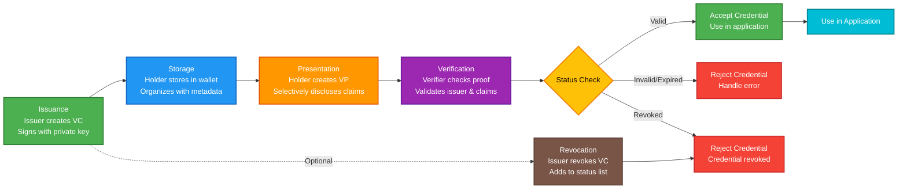

# Verifiable Credentials (VCs)

> TrustWeave expansions in this guide are authored by [Geoknoesis LLC](https://www.geoknoesis.com). They reflect Geoknoesis’ recommended patterns for W3C Verifiable Credentials on the JVM.

## What is a Verifiable Credential?

A **Verifiable Credential** is a tamper-evident attestation following the W3C VC Data Model. It combines:

```kotlin
dependencies {
    implementation("org.trustweave:trustweave-common:1.0.0-SNAPSHOT")
}
```

**Result:** Grants access to the credential builders and verification helpers referenced throughout this guide.

1. **Metadata** – issuer, issuance/expiration dates, schema references.
2. **Credential subject** – the claims being asserted (`name`, `degree`, `license`, etc.).
3. **Proof** – cryptographic signature binding the issuer to the credential content.

## Why VCs matter in TrustWeave

- They are the unit of trust flowing between issuers and verifiers.
- Wallets store VCs, anchor clients notarise them, and verification routines replay the proofs.
- Typed builders and canonicalisation keep the credential lifecycle consistent across DID methods and signature suites.

## Credential Lifecycle

A verifiable credential goes through a complete lifecycle from creation to revocation:



**Key Stages:**
1. **Issuance**: Issuer creates and signs the credential with their private key
2. **Storage**: Holder stores the credential in their wallet for future use
3. **Presentation**: Holder creates a verifiable presentation (optionally with selective disclosure)
4. **Verification**: Verifier checks the proof, validates issuer DID, and checks status
5. **Revocation** (optional): Issuer can revoke credentials, which are checked during verification

## How TrustWeave issues and verifies VCs

| Component | Purpose |
|-----------|---------|
| `CredentialServiceRegistry` | Discovers issuer/verifier services (in-memory or SPI). |
| `trustWeave.issue { }` | High-level DSL performing canonicalisation, signing, and proof attachment. |
| `trustWeave.verify { }` | Rebuilds canonical form, resolves DIDs, validates proofs, and returns `VerificationResult`. |
| `CredentialIssuanceOptions` | Lower-level SPI options (validity window, schema hints) when using `CredentialServiceRegistry`. |

Detailed API signatures live in the [Credential Service API reference](../api-reference/credential-service-api.md).

### Example: issuing a credential

```kotlin
import org.trustweave.TrustWeave
import org.trustweave.credential.IssuanceConfig
import org.trustweave.credential.ProofType
import kotlinx.serialization.json.buildJsonObject
import kotlinx.serialization.json.put

suspend fun issueEmployeeBadge(trustWeave: TrustWeave, issuerDid: String, issuerKeyId: String) =
    trustWeave.issue {
        credential {
            type("EmploymentCredential")
            issuer(issuerDid)
            subject {
                id("did:key:holder-123")
                "role" to "Site Reliability Engineer"
                "level" to "L5"
            }
            issued(Instant.now())
        }
        signedBy(issuerDid = issuerDid, keyId = issuerKeyId)
    }

**Outcome:** Issues a signed credential using typed issuance options, returning a `VerifiableCredential` that downstream wallets or verifiers can consume.

TrustWeave automatically:

- Canonicalises the JSON payload using JSON Canonicalization Scheme (JCS).
- Signs the digest through the configured `KeyManagementService`.
- Embeds the resulting proof (`Ed25519Signature2020` by default) into the VC.
- Returns a `VerifiableCredential` data class that you can store or present.

### Example: verifying a credential

```kotlin
import org.trustweave.TrustWeave
import org.trustweave.credential.models.VerifiableCredential

suspend fun verifyBadge(trustWeave: TrustWeave, credential: VerifiableCredential) {
    val result = trustWeave.verify {
        credential(credential)
    }
    // Note: verify() returns VerificationResult sealed type
    when (result) {
        is VerificationResult.Valid -> {
            println("Credential verified successfully")
        }
        is VerificationResult.Invalid -> {
            println("Verification failed: ${result.reason}")
        }
    }
}

**Outcome:** Surfaces verification success or failure reasons, letting you guard business logic with `result.valid` and log granular errors.

### Verification Pipeline

The verification process involves multiple steps that TrustWeave executes automatically:

```mermaid
flowchart TD
    A[Start Verification<br/>trustWeave.verify { }] --> B[Parse Credential<br/>Validate JSON Structure]
    B --> C{Structure Valid?}
    C -->|No| Z[Invalid: Malformed Structure]
    C -->|Yes| D[Resolve Issuer DID<br/>Fetch DID Document]
    D --> E{DID Resolution<br/>Success?}
    E -->|No| Z1[Invalid: DID Not Found]
    E -->|Yes| F[Extract Public Key<br/>From Verification Method]
    F --> G[Canonicalize Credential<br/>Apply JCS]
    G --> H[Compute Digest<br/>SHA-256 Hash]
    H --> I[Verify Signature<br/>Check Proof]
    I --> J{Signature Valid?}
    J -->|No| Z2[Invalid: Invalid Signature]
    J -->|Yes| K[Check Expiration<br/>Validate issued/expiration Dates]
    K --> L{Not Expired?}
    L -->|No| Z3[Invalid: Credential Expired]
    L -->|Yes| M[Check Revocation<br/>Query Status List]
    M --> N{Not Revoked?}
    N -->|No| Z4[Invalid: Credential Revoked]
    N -->|Yes| O[Validate Schema<br/>If Schema Specified]
    O --> P{Schema Valid?}
    P -->|No| Z5[Invalid: Schema Validation Failed]
    P -->|Yes| Q[Check Trust Policy<br/>If Trust Required]
    Q --> R{Trusted Issuer?}
    R -->|No| Z6[Invalid: Issuer Not Trusted]
    R -->|Yes| S[Valid: Verification Success]
    
    style A fill:#1976d2,stroke:#0d47a1,stroke-width:2px,color:#fff
    style S fill:#4caf50,stroke:#2e7d32,stroke-width:2px,color:#fff
    style Z fill:#f44336,stroke:#c62828,stroke-width:2px,color:#fff
    style Z1 fill:#f44336,stroke:#c62828,stroke-width:2px,color:#fff
    style Z2 fill:#f44336,stroke:#c62828,stroke-width:2px,color:#fff
    style Z3 fill:#f44336,stroke:#c62828,stroke-width:2px,color:#fff
    style Z4 fill:#f44336,stroke:#c62828,stroke-width:2px,color:#fff
    style Z5 fill:#f44336,stroke:#c62828,stroke-width:2px,color:#fff
    style Z6 fill:#f44336,stroke:#c62828,stroke-width:2px,color:#fff
```

**Verification Steps:**
1. **Parse & Validate**: Ensures credential has correct structure
2. **Resolve Issuer DID**: Fetches DID document from resolver
3. **Extract Public Key**: Gets verification method from DID document
4. **Canonicalize**: Applies JCS to get deterministic JSON
5. **Verify Signature**: Checks cryptographic proof
6. **Check Expiration**: Validates credential hasn't expired
7. **Check Revocation**: Queries status list if present
8. **Validate Schema**: Verifies claims against schema (if specified)
9. **Check Trust**: Validates issuer against trust registry (if enabled)

All steps must pass for verification to succeed. Any failure returns detailed error information in the `VerificationResult`.

## Practical usage tips

- **SPI-level options** – drop down to `CredentialServiceRegistry` and supply `CredentialIssuanceOptions` when you need custom proof types, schema hints, or audiences.
- **Anchoring** – store the credential digest with a `BlockchainAnchorClient` to prove freshness (see [Blockchain Anchoring](blockchain-anchoring.md)).
- **Revocation** – integrate status endpoints by adding `credentialStatus` claims; custom verification policies can enforce them.
- **Error handling** – credential operations throw `TrustWeaveError` exceptions directly. Use `try-catch` blocks for error handling. See [Error Handling](../advanced/error-handling.md).
- **Input validation** – TrustWeave automatically validates credential structure, issuer DID format, and method registration before issuance.

## Related How-To Guides

- **[Issue Credentials](../how-to/issue-credentials.md)** - Step-by-step guide for issuing verifiable credentials
- **[Verify Credentials](../how-to/verify-credentials.md)** - Step-by-step guide for verifying credentials

## VC Structure

A Verifiable Credential contains:

A Verifiable Credential contains:

1. **Metadata** – issuer, issuance/expiration dates, schema references
2. **Credential Subject** – the claims being asserted (`name`, `degree`, `license`, etc.)
3. **Proof** – cryptographic signature binding the issuer to the credential content
4. **Schema** – optional schema for validation
5. **Status** – optional revocation status

### Example VC

```json
{
  "@context": [
    "https://www.w3.org/2018/credentials/v1",
    "https://www.w3.org/2018/credentials/examples/v1"
  ],
  "id": "https://example.com/credentials/3732",
  "type": ["VerifiableCredential", "UniversityDegreeCredential"],
  "issuer": "did:key:z6MkhaXgBZDvotDkL5257faiztiGiC2QtKLGpbnnEGta2doK",
  "issuanceDate": "2023-01-01T00:00:00Z",
  "expirationDate": "2028-01-01T00:00:00Z",
  "credentialSubject": {
    "id": "did:key:z6MkhaXgBZDvotDkL5257faiztiGiC2QtKLGpbnnEGta2doK",
    "degree": {
      "type": "BachelorDegree",
      "name": "Bachelor of Science in Computer Science",
      "university": "Example University"
    }
  },
  "proof": {
    "type": "Ed25519Signature2020",
    "created": "2023-01-01T00:00:00Z",
    "verificationMethod": "did:key:z6MkhaXgBZDvotDkL5257faiztiGiC2QtKLGpbnnEGta2doK#keys-1",
    "proofPurpose": "assertionMethod",
    "proofValue": "z5J1pJ2..."
  }
}
```

## VC Lifecycle

### 1. Issuance

A credential is **issued** by an issuer to a subject:

```kotlin
import org.trustweave.credential.models.VerifiableCredential
import org.trustweave.credential.CredentialIssuanceOptions

// Issue credential using TrustWeave DSL API
val trustWeave = TrustWeave.build {
    factories(
        kmsFactory = TestkitKmsFactory(),
        didMethodFactory = TestkitDidMethodFactory()
    )
    keys { provider(IN_MEMORY); algorithm(ED25519) }
    did { method(KEY) { algorithm(ED25519) } }
    credentials { defaultProofType(ProofType.Ed25519Signature2020) }
}

import org.trustweave.trust.types.DidCreationResult
import org.trustweave.trust.types.IssuanceResult

val didResult = trustWeave.createDid {
    method(KEY)
    algorithm(ED25519)
}

val issuerDid = when (didResult) {
    is DidCreationResult.Success -> didResult.did
    else -> throw IllegalStateException("Failed to create DID: ${didResult.reason}")
}

val resolution = trustWeave.resolveDid(issuerDid)
val issuerDoc = when (resolution) {
    is DidResolutionResult.Success -> resolution.document
    else -> throw IllegalStateException("Failed to resolve issuer DID")
}
val issuerKeyId = issuerDoc.verificationMethod.firstOrNull()?.id?.substringAfter("#")
    ?: throw IllegalStateException("No verification method found")

val issuanceResult = trustWeave.issue {
    credential {
        type(CredentialType.Person)
        issuer(issuerDid.value)
        subject {
            id(subjectDid)
            "name" to "Alice"
            "email" to "alice@example.com"
        }
        issued(Instant.now())
    }
    signedBy(issuerDid = issuerDid.value, keyId = issuerKeyId)
}

val issuedCredential = when (issuanceResult) {
    is IssuanceResult.Success -> issuanceResult.credential
    else -> throw IllegalStateException("Failed to issue credential: ${issuanceResult.reason}")
}

**Outcome:** Produces a signed credential ready for distribution, anchored to the specific proof type and key you configured.

### 2. Storage

Store credentials in a wallet:

```kotlin
import org.trustweave.testkit.credential.BasicWallet

val wallet = BasicWallet()
val credentialId = wallet.store(issuedCredential)

**Outcome:** Persists the credential in a wallet so it can be queried, organised, and presented later.
```

### 3. Presentation

Create a **Verifiable Presentation** to share credentials:

```kotlin
import org.trustweave.credential.models.VerifiablePresentation
import org.trustweave.credential.PresentationOptions

val presentation = VerifiablePresentation(
    type = listOf("VerifiablePresentation"),
    verifiableCredential = listOf(issuedCredential),
    holder = subjectDid,
    proof = // ... proof of presentation
)

**Outcome:** Wraps one or more credentials in a holder-signed presentation, enabling selective disclosure downstream.
```

### 4. Verification

Verify a credential or presentation:

```kotlin
import org.trustweave.TrustWeave
import org.trustweave.credential.VerificationConfig

val trustWeave = TrustWeave.build {
    factories(
        kmsFactory = TestkitKmsFactory(),
        didMethodFactory = TestkitDidMethodFactory()
    )
    keys { provider(IN_MEMORY); algorithm(ED25519) }
    did { method(KEY) { algorithm(ED25519) } }
}

val result = trustWeave.verify {
    credential(issuedCredential)
    checkExpiration()
    // checkRevocation() requires status list integration
}

if (result.valid) {
    println("Credential passed structural checks.")
    println("Proof valid: ${result.proofValid}, Issuer valid: ${result.issuerValid}")
} else {
    println("Verification errors: ${result.errors.joinToString()}")
}

**Outcome:** Indicates whether the credential satisfied structural checks (expiration, DID resolution, optional revocation) and surfaces diagnostics for debugging.
```

> **Important:** The built-in verifier performs structural checks today (proof fields, expiration, DID resolution). Integrate a dedicated cryptographic proof validator and revocation resolver for production deployments.

### 5. Revocation

Revoke a credential if needed:

```kotlin
// Credential status is checked during verification
// Revocation is handled via credentialStatus field
```

## Types of Claims

### Identity Claims

Claims about who you are:

- Name
- Date of birth
- Nationality
- Email address

### Achievement Claims

Claims about what you've accomplished:

- Educational degrees
- Professional certifications
- Awards
- Skills

### Authorization Claims

Claims about what you're allowed to do:

- Access permissions
- Membership status
- Role assignments

## Proof Types

TrustWeave supports multiple proof types:

- **Ed25519Signature2020**: Ed25519 signatures (recommended)
- **JsonWebSignature2020**: JWT-based proofs
- **BbsBlsSignature2020**: BBS+ signatures for selective disclosure

## Schema Validation

Credentials can reference schemas for validation:

```kotlin
val credential = VerifiableCredential(
    // ...
    credentialSchema = CredentialSchema(
        id = "https://example.com/schemas/person.json",
        type = "JsonSchemaValidator2018",
        schemaFormat = SchemaFormat.JSON_SCHEMA
    )
)
```

## Privacy Features

### Selective Disclosure

Reveal only specific fields from a credential:

```kotlin
val presentation = wallet.createSelectiveDisclosure(
    credentialIds = listOf(credentialId),
    disclosedFields = listOf("name", "email"), // Only reveal name and email
    holderDid = holderDid,
    options = PresentationOptions(...)
)
```

### Zero-Knowledge Proofs

Some proof types (like BBS+) support zero-knowledge proofs, allowing you to prove claims without revealing the actual values.

## Common Use Cases

- **Education**: Diplomas, certificates, transcripts
- **Employment**: Work history, skills, references
- **Healthcare**: Medical records, prescriptions, test results
- **Identity**: Government IDs, passports, driver's licenses
- **Membership**: Club memberships, subscriptions, loyalty programs

## Best Practices

1. **Always verify credentials** before trusting them
2. **Check expiration dates** to ensure credentials are still valid
3. **Verify revocation status** to ensure credentials haven't been revoked
4. **Use selective disclosure** to minimize data exposure
5. **Store credentials securely** in a wallet

## See also

- [Credential Service API](../api-reference/credential-service-api.md) for parameter details and SPI guidance
- [Quick Start – Step 4 & 5](../getting-started/quick-start.md#step-4-issue-a-credential-and-store-it) for a runnable walkthrough
- [Wallets](wallets.md) for storage and presentation
- [Architecture Overview](../introduction/architecture-overview.md) for the credential flow diagram

## Next Steps

**Ready to use credentials?**
- [Issue Credentials](../how-to/issue-credentials.md) - Step-by-step guide
- [Verify Credentials](../how-to/verify-credentials.md) - Step-by-step guide
- [Quick Start – Step 4 & 5](../getting-started/quick-start.md#step-4-issue-a-credential-and-store-it) - Create your first credential

**Want to learn more?**
- [Wallets](wallets.md) - Managing credentials
- [Wallet API Tutorial](../tutorials/wallet-api-tutorial.md) - Hands-on wallet examples
- [Credential Service API Reference](../api-reference/credential-service-api.md) - Complete API documentation
- [Core API Reference](../api-reference/core-api.md) - TrustLayer API


