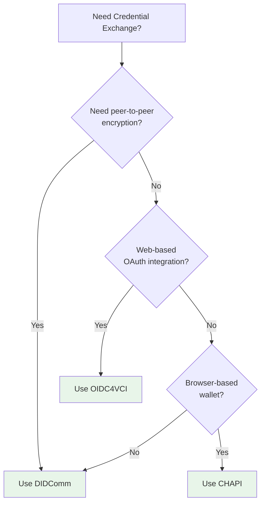

# Credential Exchange Protocols - Workflows

Step-by-step guides for common credential exchange workflows.

## Table of Contents

1. [Issuing a Credential](#issuing-a-credential)
2. [Requesting a Proof](#requesting-a-proof)
3. [Protocol Selection](#protocol-selection)
4. [Error Recovery](#error-recovery)
5. [Protocol Switching](#protocol-switching)

---

## Issuing a Credential

Complete workflow for issuing a credential using any protocol.

### Step 1: Choose a Protocol

**Decision Tree:**



**Text Decision Tree:**
```
Need peer-to-peer encryption?
├─ Yes → Use DIDComm
└─ No
    ├─ Web-based OAuth integration?
    │  ├─ Yes → Use OIDC4VCI
    │  └─ No
    │     └─ Browser-based wallet?
    │        ├─ Yes → Use CHAPI
    │        └─ No → Use DIDComm (default)
```

**Protocol Comparison:**

| Protocol | Encryption | Use Case |
|----------|-----------|----------|
| DIDComm | ✅ End-to-end | Peer-to-peer, high security |
| OIDC4VCI | Via HTTPS | Web-based, OAuth integration |
| CHAPI | Browser | Browser wallet interactions |

### Step 2: Setup Registry and ExchangeService

```kotlin
import org.trustweave.credential.exchange.*
import org.trustweave.credential.exchange.registry.ExchangeProtocolRegistries
import org.trustweave.credential.didcomm.exchange.DidCommExchangeProtocol
import org.trustweave.credential.didcomm.DidCommFactory
import org.trustweave.credential.CredentialService
import org.trustweave.credential.credentialService
import org.trustweave.kms.KeyManagementService
import org.trustweave.testkit.kms.InMemoryKeyManagementService
import org.trustweave.did.resolver.DidResolver
import org.trustweave.did.resolver.DidResolutionResult
import org.trustweave.did.model.DidDocument
import org.trustweave.did.identifiers.Did

// Setup dependencies
val kms: KeyManagementService = InMemoryKeyManagementService()
val didResolver: DidResolver = object : DidResolver {
    override suspend fun resolve(did: Did): DidResolutionResult {
        // Your DID resolver implementation
        val doc = yourDidResolver.resolve(did)
        return DidResolutionResult.Success(doc ?: DidDocument(id = did, verificationMethod = emptyList()))
    }
}
val credentialService: CredentialService = credentialService(didResolver = didResolver)

// Create registry
val registry = ExchangeProtocolRegistries.default()

// Register protocol
val didCommService = DidCommFactory.createInMemoryService(kms) { didStr ->
    val did = Did(didStr)
    DidDocument(id = did, verificationMethod = emptyList())
}
registry.register(DidCommExchangeProtocol(didCommService))

// Create ExchangeService
val exchangeService = ExchangeServices.createExchangeService(
    protocolRegistry = registry,
    credentialService = credentialService,
    didResolver = didResolver
)
```

### Step 3: Create Credential Offer

```kotlin
import org.trustweave.credential.exchange.request.ExchangeRequest
import org.trustweave.credential.exchange.result.ExchangeResult
import org.trustweave.credential.exchange.options.ExchangeOptions
import org.trustweave.credential.exchange.model.CredentialPreview
import org.trustweave.credential.exchange.model.CredentialAttribute
import org.trustweave.credential.identifiers.*
import org.trustweave.did.identifiers.Did

val issuerDid = Did("did:key:issuer")
val holderDid = Did("did:key:holder")

val offerResult = exchangeService.offer(
    ExchangeRequest.Offer(
        protocolName = "didcomm".requireExchangeProtocolName(),
        issuerDid = issuerDid,
        holderDid = holderDid,
        credentialPreview = CredentialPreview(
            attributes = listOf(
                CredentialAttribute("name", "Alice"),
                CredentialAttribute("email", "alice@example.com"),
                CredentialAttribute("role", "Developer")
            )
        ),
        options = ExchangeOptions.builder()
            .addMetadata("fromKeyId", "$issuerDid#key-1")
            .addMetadata("toKeyId", "$holderDid#key-1")
            .build()
    )
)

val offer = when (offerResult) {
    is ExchangeResult.Success -> offerResult.value
    else -> throw IllegalStateException("Offer failed: $offerResult")
}

println("✅ Offer created: ${offer.offerId}")
```

**What happens:**
1. Registry finds the DIDComm protocol
2. Protocol creates a DIDComm offer message
3. Message is encrypted and signed
4. Returns offer ID for reference

### Step 4: Handle Offer Response

```kotlin
// Store offer ID for later reference
val offerId = offer.offerId

// Extract protocol-specific data if needed
val offerData = offer.offerData
when (offer.protocolName) {
    "didcomm" -> {
        val didCommMessage = offerData as DidCommMessage
        // Handle DIDComm-specific data
    }
    "oidc4vci" -> {
        val oidcOffer = offerData as Oidc4VciOffer
        // Handle OIDC4VCI-specific data
    }
}
```

### Step 5: Request Credential

```kotlin
val requestResult = exchangeService.request(
    ExchangeRequest.Request(
        protocolName = "didcomm".requireExchangeProtocolName(),
        holderDid = holderDid,
        issuerDid = issuerDid,
        offerId = offerId,  // Reference to the offer
        options = ExchangeOptions.builder()
            .addMetadata("fromKeyId", "$holderDid#key-1")
            .addMetadata("toKeyId", "$issuerDid#key-1")
            .build()
    )
)

val request = when (requestResult) {
    is ExchangeResult.Success -> requestResult.value
    else -> throw IllegalStateException("Request failed: $requestResult")
}

println("✅ Request created: ${request.requestId}")
```

**What happens:**
1. Registry validates offer ID exists
2. Protocol creates credential request message
3. Message references the original offer
4. Returns request ID for reference

### Step 6: Issue Credential

```kotlin
import org.trustweave.credential.model.vc.VerifiableCredential
import org.trustweave.credential.model.vc.CredentialSubject
import org.trustweave.credential.model.vc.Issuer
import org.trustweave.credential.model.CredentialType
import org.trustweave.core.identifiers.Iri
import kotlinx.serialization.json.JsonPrimitive
import kotlinx.datetime.Clock

// Create the credential
val credential = VerifiableCredential(
    type = listOf(CredentialType.fromString("VerifiableCredential"), CredentialType.fromString("PersonCredential")),
    issuer = Issuer.IriIssuer(Iri(issuerDid.value)),
    issuanceDate = Clock.System.now(),
    credentialSubject = CredentialSubject(
        id = holderDid,
        claims = mapOf(
            "name" to JsonPrimitive("Alice"),
            "email" to JsonPrimitive("alice@example.com"),
            "role" to JsonPrimitive("Developer")
        )
    )
)

// Issue the credential
val issueResult = exchangeService.issue(
    ExchangeRequest.Issue(
        protocolName = "didcomm".requireExchangeProtocolName(),
        issuerDid = issuerDid,
        holderDid = holderDid,
        credential = credential,
        requestId = request.requestId,  // Reference to the request
        options = ExchangeOptions.builder()
            .addMetadata("fromKeyId", "$issuerDid#key-1")
            .addMetadata("toKeyId", "$holderDid#key-1")
            .build()
    )
)

val issue = when (issueResult) {
    is ExchangeResult.Success -> issueResult.value
    else -> throw IllegalStateException("Issue failed: $issueResult")
}

println("✅ Credential issued:")
println("   Credential ID: ${issue.credential.id}")
println("   Issue ID: ${issue.issueId}")
```

**What happens:**
1. Registry validates request ID exists
2. Protocol creates issue message with credential
3. Credential is signed and encrypted
4. Returns issued credential with proof

### Step 7: Verify Credential

```kotlin
// The issued credential can now be verified
val verification = trustLayer.verify {
    credential(issue.credential)
}

if (verification.valid) {
    println("✅ Credential is valid")
} else {
    println("❌ Credential invalid: ${verification.errors}")
}
```

---

## Requesting a Proof

Complete workflow for requesting and receiving a proof presentation.

### Step 1: Create Proof Request

```kotlin
import org.trustweave.credential.exchange.request.ProofExchangeRequest
import org.trustweave.credential.exchange.request.ProofRequest
import org.trustweave.credential.exchange.request.AttributeRequest
import org.trustweave.credential.exchange.request.AttributeRestriction
import org.trustweave.credential.exchange.result.ExchangeResult

val verifierDid = Did("did:key:verifier")
val proverDid = Did("did:key:prover")

val proofRequestResult = exchangeService.requestProof(
    ProofExchangeRequest.Request(
        protocolName = "didcomm".requireExchangeProtocolName(),
        verifierDid = verifierDid,
        proverDid = proverDid,
        proofRequest = ProofRequest(
            name = "Age Verification",
            version = "1.0",
            requestedAttributes = mapOf(
                "name" to AttributeRequest(
                    name = "name",
                    restrictions = listOf(
                        AttributeRestriction(issuerDid = Did("did:key:issuer"))
                    )
                )
            ),
            options = ExchangeOptions.builder()
                .addMetadata("requestedPredicates", mapOf(
                    "age_verification" to mapOf(
                        "name" to "age",
                        "pType" to ">=",
                        "pValue" to 18
                    )
                ))
                .build()
        ),
        options = ExchangeOptions.builder()
            .addMetadata("fromKeyId", "$verifierDid#key-1")
            .addMetadata("toKeyId", "$proverDid#key-1")
            .build()
    )
)

val proofRequest = when (proofRequestResult) {
    is ExchangeResult.Success -> proofRequestResult.value
    else -> throw IllegalStateException("Proof request failed: $proofRequestResult")
}

println("✅ Proof request created: ${proofRequest.requestId}")
```

### Step 2: Create Presentation

```kotlin
// Prover creates a verifiable presentation
val presentation = VerifiablePresentation(
    type = listOf("VerifiablePresentation"),
    holder = proverDid,
    verifiableCredential = listOf(credential),  // Credential from previous workflow
    proof = proof  // Proof of presentation
)
```

### Step 3: Present Proof

```kotlin
val presentationResult = exchangeService.presentProof(
    ProofExchangeRequest.Presentation(
        protocolName = "didcomm".requireExchangeProtocolName(),
        proverDid = proverDid,
        verifierDid = verifierDid,
        presentation = presentation,
        requestId = proofRequest.requestId,  // Reference to the request
        options = ExchangeOptions.builder()
            .addMetadata("fromKeyId", "$proverDid#key-1")
            .addMetadata("toKeyId", "$verifierDid#key-1")
            .build()
    )
)

val presentationResponse = when (presentationResult) {
    is ExchangeResult.Success -> presentationResult.value
    else -> throw IllegalStateException("Presentation failed: $presentationResult")
}
)

println("✅ Proof presented: ${presentationResponse.presentationId}")
```

### Step 4: Verify Presentation

```kotlin
val verification = trustLayer.verify {
    presentation(presentationResponse.presentation)
}

if (verification.valid) {
    println("✅ Presentation is valid")
    // Extract attributes
    val name = extractAttribute(presentationResponse.presentation, "name")
    println("Name: $name")
} else {
    println("❌ Presentation invalid: ${verification.errors}")
}
```

---

## Protocol Selection

Guide for choosing the right protocol for your use case.

### Decision Matrix

| Requirement | DIDComm | OIDC4VCI | CHAPI |
|-------------|---------|----------|-------|
| Peer-to-peer encryption | ✅ Yes | ❌ No | ❌ No |
| Web-based OAuth | ❌ No | ✅ Yes | ❌ No |
| Browser wallet | ❌ No | ❌ No | ✅ Yes |
| Proof requests | ✅ Yes | ❌ No | ✅ Yes |
| Credential issuance | ✅ Yes | ✅ Yes | ✅ Yes |
| Server-to-server | ✅ Yes | ✅ Yes | ❌ No |

### Use DIDComm When:

- You need end-to-end encryption
- Peer-to-peer communication
- High security requirements
- Proof requests needed
- Server-to-server communication

**Example:**
```kotlin
// High-security credential exchange
val offerResult = exchangeService.offer(
    ExchangeRequest.Offer(
        protocolName = "didcomm".requireExchangeProtocolName(),
        issuerDid = issuerDid,
        holderDid = holderDid,
        credentialPreview = preview,
        options = ExchangeOptions.builder().build()
    )
)
val offer = when (offerResult) {
    is ExchangeResult.Success -> offerResult.value
    else -> throw IllegalStateException("Offer failed: $offerResult")
}
```

### Use OIDC4VCI When:

- Web-based application
- OAuth integration needed
- Standard OIDC flow
- Credential issuance only (no proofs)

**Example:**
```kotlin
// Web-based credential issuance
val offerResult = exchangeService.offer(
    ExchangeRequest.Offer(
        protocolName = "oidc4vci".requireExchangeProtocolName(),
        issuerDid = issuerDid,
        holderDid = holderDid,
        credentialPreview = preview,
        options = ExchangeOptions.builder()
            .addMetadata("credentialIssuer", "https://issuer.example.com")
            .build()
    )
)
val offer = when (offerResult) {
    is ExchangeResult.Success -> offerResult.value
    else -> throw IllegalStateException("Offer failed: $offerResult")
}
```

### Use CHAPI When:

- Browser-based wallet
- User-initiated interactions
- Credential storage in browser wallet
- Proof presentation in browser

**Example:**
```kotlin
// Browser wallet interaction
val offerResult = exchangeService.offer(
    ExchangeRequest.Offer(
        protocolName = "chapi".requireExchangeProtocolName(),
        issuerDid = issuerDid,
        holderDid = holderDid,
        credentialPreview = preview,
        options = ExchangeOptions.Empty
    )
)
val offer = when (offerResult) {
    is ExchangeResult.Success -> offerResult.value
    else -> throw IllegalStateException("Offer failed: $offerResult")
}
// Use offer.chapiMessage with navigator.credentials.store()
```

---

## Error Recovery

Strategies for handling errors and recovering from failures.

### Strategy 1: Retry with Different Protocol

```kotlin
suspend fun offerCredentialWithFallback(
    exchangeService: ExchangeService,
    registry: ExchangeProtocolRegistry,
    preferredProtocol: ExchangeProtocolName,
    issuerDid: Did,
    holderDid: Did,
    preview: CredentialPreview,
    options: ExchangeOptions
): ExchangeResponse.Offer? {
    // Try preferred protocol
    val preferredResult = exchangeService.offer(
        ExchangeRequest.Offer(
            protocolName = preferredProtocol,
            issuerDid = issuerDid,
            holderDid = holderDid,
            credentialPreview = preview,
            options = options
        )
    )
    when (preferredResult) {
        is ExchangeResult.Success -> return preferredResult.value
        else -> println("Preferred protocol failed: $preferredResult")
    }

    // Try fallback protocols
    val fallbacks = when (preferredProtocol.value) {
        "didcomm" -> listOf("oidc4vci", "chapi")
        "oidc4vci" -> listOf("didcomm", "chapi")
        "chapi" -> listOf("didcomm", "oidc4vci")
        else -> listOf("didcomm", "oidc4vci", "chapi")
    }

    for (protocolStr in fallbacks) {
        val protocolName = protocolStr.requireExchangeProtocolName()
        if (registry.isRegistered(protocolName)) {
            val result = exchangeService.offer(
                ExchangeRequest.Offer(
                    protocolName = protocolName,
                    issuerDid = issuerDid,
                    holderDid = holderDid,
                    credentialPreview = preview,
                    options = options
                )
            )
            when (result) {
                is ExchangeResult.Success -> return result.value
                else -> println("Fallback protocol $protocolStr failed: $result")
            }
        }
    }

    return null  // All protocols failed
}
```

### Strategy 2: Validate Before Operation

```kotlin
fun validateRequest(request: CredentialOfferRequest): ValidationResult {
    val errors = mutableListOf<String>()

    // Validate DIDs
    if (!isValidDid(request.issuerDid)) {
        errors.add("Invalid issuer DID: ${request.issuerDid}")
    }
    if (!isValidDid(request.holderDid)) {
        errors.add("Invalid holder DID: ${request.holderDid}")
    }

    // Validate preview
    if (request.credentialPreview.attributes.isEmpty()) {
        errors.add("Credential preview must have at least one attribute")
    }

    // Validate protocol-specific options
    // (Implementation depends on protocol)

    return if (errors.isEmpty()) {
        ValidationResult.Valid
    } else {
        ValidationResult.Invalid(errors)
    }
}

// Use before operation (validate DIDs, preview, etc. before calling exchangeService)
// Note: The new API uses Did types and ExchangeRequest types which provide better type safety
val validation = validateRequest(issuerDid, holderDid, credentialPreview)
if (validation is ValidationResult.Invalid) {
    println("Validation failed:")
    validation.errors.forEach { println("  - $it") }
    return
}

val offerResult = exchangeService.offer(
    ExchangeRequest.Offer(
        protocolName = "didcomm".requireExchangeProtocolName(),
        issuerDid = issuerDid,
        holderDid = holderDid,
        credentialPreview = credentialPreview,
        options = ExchangeOptions.builder().build()
    )
)
val offer = when (offerResult) {
    is ExchangeResult.Success -> offerResult.value
    else -> throw IllegalStateException("Offer failed: $offerResult")
}
```

---

## Protocol Switching

How to switch between protocols seamlessly.

### Example: Switch Protocol Mid-Flow

```kotlin
// Start with DIDComm
val didCommOfferResult = exchangeService.offer(
    ExchangeRequest.Offer(
        protocolName = "didcomm".requireExchangeProtocolName(),
        issuerDid = issuerDid,
        holderDid = holderDid,
        credentialPreview = credentialPreview,
        options = ExchangeOptions.Empty
    )
)
val didCommOffer = when (didCommOfferResult) {
    is ExchangeResult.Success -> didCommOfferResult.value
    else -> throw IllegalStateException("DIDComm offer failed: $didCommOfferResult")
}

// Switch to OIDC4VCI for request (if needed)
val oidcRequestResult = exchangeService.request(
    ExchangeRequest.Request(
        protocolName = "oidc4vci".requireExchangeProtocolName(),
        holderDid = holderDid,
        issuerDid = issuerDid,
        offerId = didCommOffer.offerId,
        options = ExchangeOptions.Empty
    )
)
val oidcRequest = when (oidcRequestResult) {
    is ExchangeResult.Success -> oidcRequestResult.value
    else -> throw IllegalStateException("OIDC4VCI request failed: $oidcRequestResult")
}
        holderDid = holderDid,
        issuerDid = issuerDid,
        offerId = didCommOffer.offerId,
        options = mapOf(
            "credentialIssuer" to "https://issuer.example.com"
        )
    )
)

// Continue with OIDC4VCI
val issueResult = exchangeService.issue(
    ExchangeRequest.Issue(
        protocolName = "oidc4vci".requireExchangeProtocolName(),
        issuerDid = issuerDid,
        holderDid = holderDid,
        credential = credential,
        requestId = oidcRequest.requestId,
        options = ExchangeOptions.builder().build()
    )
)
val issue = when (issueResult) {
    is ExchangeResult.Success -> issueResult.value
    else -> throw IllegalStateException("Issue failed: $issueResult")
}
```

**Note:** Protocol switching may not always be possible. Check protocol compatibility before switching.

---

## Related Documentation

- **[Quick Start](./QUICK_START.md)** - Get started quickly (5 minutes)
- **[API Reference](./API_REFERENCE.md)** - Complete API documentation
- **[Error Handling](./ERROR_HANDLING.md)** - Error handling guide
- **[Examples](./EXAMPLES.md)** - Complete code examples
- **[Troubleshooting](./TROUBLESHOOTING.md)** - Common issues and solutions
- **[Best Practices](./BEST_PRACTICES.md)** - Workflow best practices
- **[Glossary](./GLOSSARY.md)** - Terms and concepts
- **[Versioning](./VERSIONING.md)** - Protocol migration guides

