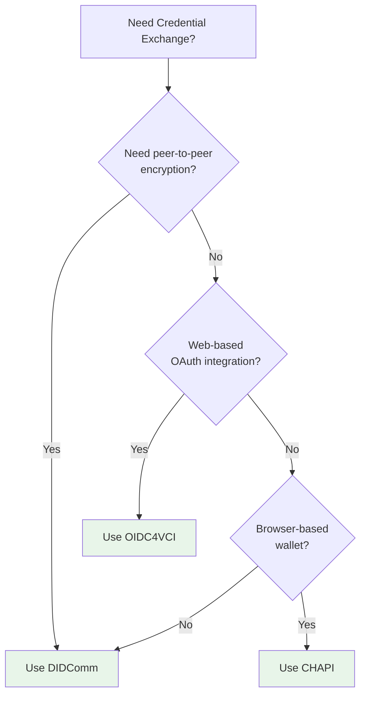

# Credential Exchange Protocols - Workflows

Step-by-step guides for common credential exchange workflows.

## Table of Contents

1. [Issuing a Credential](#issuing-a-credential)
2. [Requesting a Proof](#requesting-a-proof)
3. [Protocol Selection](#protocol-selection)
4. [Error Recovery](#error-recovery)
5. [Protocol Switching](#protocol-switching)

---

## Issuing a Credential

Complete workflow for issuing a credential using any protocol.

### Step 1: Choose a Protocol

**Decision Tree:**



**Text Decision Tree:**
```
Need peer-to-peer encryption?
├─ Yes → Use DIDComm
└─ No
    ├─ Web-based OAuth integration?
    │  ├─ Yes → Use OIDC4VCI
    │  └─ No
    │     └─ Browser-based wallet?
    │        ├─ Yes → Use CHAPI
    │        └─ No → Use DIDComm (default)
```

**Protocol Comparison:**

| Protocol | Encryption | Use Case |
|----------|-----------|----------|
| DIDComm | ✅ End-to-end | Peer-to-peer, high security |
| OIDC4VCI | Via HTTPS | Web-based, OAuth integration |
| CHAPI | Browser | Browser wallet interactions |

### Step 2: Setup Registry

```kotlin
import com.trustweave.credential.exchange.*
import com.trustweave.credential.didcomm.exchange.DidCommExchangeProtocol
import com.trustweave.credential.didcomm.DidCommFactory
import com.trustweave.kms.KeyManagementService
import com.trustweave.testkit.InMemoryKeyManagementService
import com.trustweave.did.DidDocument

// Setup dependencies
val kms: KeyManagementService = InMemoryKeyManagementService()
val resolveDid: suspend (String) -> DidDocument? = { did ->
    // Your DID resolver implementation
    yourDidResolver.resolve(did)
}

// Create registry
val registry = CredentialExchangeProtocolRegistry()

// Register protocol
val didCommService = DidCommFactory.createInMemoryService(kms, resolveDid)
registry.register(DidCommExchangeProtocol(didCommService))
```

### Step 3: Create Credential Offer

```kotlin
val issuerDid = "did:key:issuer"
val holderDid = "did:key:holder"

val offer = registry.offerCredential(
    protocolName = "didcomm",
    request = CredentialOfferRequest(
        issuerDid = issuerDid,
        holderDid = holderDid,
        credentialPreview = CredentialPreview(
            attributes = listOf(
                CredentialAttribute("name", "Alice"),
                CredentialAttribute("email", "alice@example.com"),
                CredentialAttribute("role", "Developer")
            )
        ),
        options = mapOf(
            "fromKeyId" to "$issuerDid#key-1",
            "toKeyId" to "$holderDid#key-1"
        )
    )
)

println("✅ Offer created: ${offer.offerId}")
```

**What happens:**
1. Registry finds the DIDComm protocol
2. Protocol creates a DIDComm offer message
3. Message is encrypted and signed
4. Returns offer ID for reference

### Step 4: Handle Offer Response

```kotlin
// Store offer ID for later reference
val offerId = offer.offerId

// Extract protocol-specific data if needed
val offerData = offer.offerData
when (offer.protocolName) {
    "didcomm" -> {
        val didCommMessage = offerData as DidCommMessage
        // Handle DIDComm-specific data
    }
    "oidc4vci" -> {
        val oidcOffer = offerData as Oidc4VciOffer
        // Handle OIDC4VCI-specific data
    }
}
```

### Step 5: Request Credential

```kotlin
val request = registry.requestCredential(
    protocolName = "didcomm",
    request = CredentialRequestRequest(
        holderDid = holderDid,
        issuerDid = issuerDid,
        offerId = offerId,  // Reference to the offer
        options = mapOf(
            "fromKeyId" to "$holderDid#key-1",
            "toKeyId" to "$issuerDid#key-1"
        )
    )
)

println("✅ Request created: ${request.requestId}")
```

**What happens:**
1. Registry validates offer ID exists
2. Protocol creates credential request message
3. Message references the original offer
4. Returns request ID for reference

### Step 6: Issue Credential

```kotlin
import com.trustweave.credential.models.VerifiableCredential
import kotlinx.serialization.json.buildJsonObject
import kotlinx.serialization.json.put

// Create the credential
val credential = VerifiableCredential(
    type = listOf("VerifiableCredential", "PersonCredential"),
    issuer = issuerDid,
    credentialSubject = buildJsonObject {
        put("id", holderDid)
        put("name", "Alice")
        put("email", "alice@example.com")
        put("role", "Developer")
    },
    issuanceDate = java.time.Instant.now().toString()
)

// Issue the credential
val issue = registry.issueCredential(
    protocolName = "didcomm",
    request = CredentialIssueRequest(
        issuerDid = issuerDid,
        holderDid = holderDid,
        credential = credential,
        requestId = request.requestId,  // Reference to the request
        options = mapOf(
            "fromKeyId" to "$issuerDid#key-1",
            "toKeyId" to "$holderDid#key-1"
        )
    )
)

println("✅ Credential issued:")
println("   Credential ID: ${issue.credential.id}")
println("   Issue ID: ${issue.issueId}")
```

**What happens:**
1. Registry validates request ID exists
2. Protocol creates issue message with credential
3. Credential is signed and encrypted
4. Returns issued credential with proof

### Step 7: Verify Credential

```kotlin
// The issued credential can now be verified
val verification = trustLayer.verify {
    credential(issue.credential)
}

if (verification.valid) {
    println("✅ Credential is valid")
} else {
    println("❌ Credential invalid: ${verification.errors}")
}
```

---

## Requesting a Proof

Complete workflow for requesting and receiving a proof presentation.

### Step 1: Create Proof Request

```kotlin
val verifierDid = "did:key:verifier"
val proverDid = "did:key:prover"

val proofRequest = registry.requestProof(
    protocolName = "didcomm",
    request = ProofRequestRequest(
        verifierDid = verifierDid,
        proverDid = proverDid,
        name = "Age Verification",
        version = "1.0",
        requestedAttributes = mapOf(
            "name" to RequestedAttribute(
                name = "name",
                restrictions = listOf(
                    AttributeRestriction(issuerDid = "did:key:issuer")
                )
            )
        ),
        requestedPredicates = mapOf(
            "age_verification" to RequestedPredicate(
                name = "age",
                pType = ">=",
                pValue = 18
            )
        ),
        options = mapOf(
            "fromKeyId" to "$verifierDid#key-1",
            "toKeyId" to "$proverDid#key-1"
        )
    )
)

println("✅ Proof request created: ${proofRequest.requestId}")
```

### Step 2: Create Presentation

```kotlin
// Prover creates a verifiable presentation
val presentation = VerifiablePresentation(
    type = listOf("VerifiablePresentation"),
    holder = proverDid,
    verifiableCredential = listOf(credential),  // Credential from previous workflow
    proof = proof  // Proof of presentation
)
```

### Step 3: Present Proof

```kotlin
val presentationResponse = registry.presentProof(
    protocolName = "didcomm",
    request = ProofPresentationRequest(
        proverDid = proverDid,
        verifierDid = verifierDid,
        presentation = presentation,
        requestId = proofRequest.requestId,  // Reference to the request
        options = mapOf(
            "fromKeyId" to "$proverDid#key-1",
            "toKeyId" to "$verifierDid#key-1"
        )
    )
)

println("✅ Proof presented: ${presentationResponse.presentationId}")
```

### Step 4: Verify Presentation

```kotlin
val verification = trustLayer.verify {
    presentation(presentationResponse.presentation)
}

if (verification.valid) {
    println("✅ Presentation is valid")
    // Extract attributes
    val name = extractAttribute(presentationResponse.presentation, "name")
    println("Name: $name")
} else {
    println("❌ Presentation invalid: ${verification.errors}")
}
```

---

## Protocol Selection

Guide for choosing the right protocol for your use case.

### Decision Matrix

| Requirement | DIDComm | OIDC4VCI | CHAPI |
|-------------|---------|----------|-------|
| Peer-to-peer encryption | ✅ Yes | ❌ No | ❌ No |
| Web-based OAuth | ❌ No | ✅ Yes | ❌ No |
| Browser wallet | ❌ No | ❌ No | ✅ Yes |
| Proof requests | ✅ Yes | ❌ No | ✅ Yes |
| Credential issuance | ✅ Yes | ✅ Yes | ✅ Yes |
| Server-to-server | ✅ Yes | ✅ Yes | ❌ No |

### Use DIDComm When:

- You need end-to-end encryption
- Peer-to-peer communication
- High security requirements
- Proof requests needed
- Server-to-server communication

**Example:**
```kotlin
// High-security credential exchange
val offer = registry.offerCredential("didcomm", request)
```

### Use OIDC4VCI When:

- Web-based application
- OAuth integration needed
- Standard OIDC flow
- Credential issuance only (no proofs)

**Example:**
```kotlin
// Web-based credential issuance
val offer = registry.offerCredential(
    protocolName = "oidc4vci",
    request = CredentialOfferRequest(
        issuerDid = issuerDid,
        holderDid = holderDid,
        credentialPreview = preview,
        options = mapOf(
            "credentialIssuer" to "https://issuer.example.com"
        )
    )
)
```

### Use CHAPI When:

- Browser-based wallet
- User-initiated interactions
- Credential storage in browser wallet
- Proof presentation in browser

**Example:**
```kotlin
// Browser wallet interaction
val offer = registry.offerCredential("chapi", request)
// Use offer.chapiMessage with navigator.credentials.store()
```

---

## Error Recovery

Strategies for handling errors and recovering from failures.

### Strategy 1: Retry with Different Protocol

```kotlin
suspend fun offerCredentialWithFallback(
    preferredProtocol: String,
    request: CredentialOfferRequest
): CredentialOfferResponse {
    // Try preferred protocol
    try {
        return registry.offerCredential(preferredProtocol, request)
    } catch (e: Exception) {
        println("Preferred protocol failed: ${e.message}")
    }

    // Try fallback protocols
    val fallbacks = when (preferredProtocol) {
        "didcomm" -> listOf("oidc4vci", "chapi")
        "oidc4vci" -> listOf("didcomm", "chapi")
        "chapi" -> listOf("didcomm", "oidc4vci")
        else -> listOf("didcomm", "oidc4vci", "chapi")
    }

    for (protocol in fallbacks) {
        if (registry.isRegistered(protocol)) {
            try {
                return registry.offerCredential(protocol, request)
            } catch (e: Exception) {
                println("Fallback protocol $protocol failed: ${e.message}")
            }
        }
    }

    throw IllegalStateException("All protocols failed")
}
```

### Strategy 2: Validate Before Operation

```kotlin
fun validateRequest(request: CredentialOfferRequest): ValidationResult {
    val errors = mutableListOf<String>()

    // Validate DIDs
    if (!isValidDid(request.issuerDid)) {
        errors.add("Invalid issuer DID: ${request.issuerDid}")
    }
    if (!isValidDid(request.holderDid)) {
        errors.add("Invalid holder DID: ${request.holderDid}")
    }

    // Validate preview
    if (request.credentialPreview.attributes.isEmpty()) {
        errors.add("Credential preview must have at least one attribute")
    }

    // Validate protocol-specific options
    // (Implementation depends on protocol)

    return if (errors.isEmpty()) {
        ValidationResult.Valid
    } else {
        ValidationResult.Invalid(errors)
    }
}

// Use before operation
val validation = validateRequest(request)
if (validation is ValidationResult.Invalid) {
    println("Validation failed:")
    validation.errors.forEach { println("  - $it") }
    return
}

val offer = registry.offerCredential("didcomm", request)
```

---

## Protocol Switching

How to switch between protocols seamlessly.

### Example: Switch Protocol Mid-Flow

```kotlin
// Start with DIDComm
val didCommOffer = registry.offerCredential("didcomm", request)

// Switch to OIDC4VCI for request (if needed)
val oidcRequest = registry.requestCredential(
    protocolName = "oidc4vci",
    request = CredentialRequestRequest(
        holderDid = holderDid,
        issuerDid = issuerDid,
        offerId = didCommOffer.offerId,
        options = mapOf(
            "credentialIssuer" to "https://issuer.example.com"
        )
    )
)

// Continue with OIDC4VCI
val issue = registry.issueCredential("oidc4vci", issueRequest)
```

**Note:** Protocol switching may not always be possible. Check protocol compatibility before switching.

---

## Related Documentation

- **[Quick Start](./QUICK_START.md)** - Get started quickly (5 minutes)
- **[API Reference](./API_REFERENCE.md)** - Complete API documentation
- **[Error Handling](./ERROR_HANDLING.md)** - Error handling guide
- **[Examples](./EXAMPLES.md)** - Complete code examples
- **[Troubleshooting](./TROUBLESHOOTING.md)** - Common issues and solutions
- **[Best Practices](./BEST_PRACTICES.md)** - Workflow best practices
- **[Glossary](./GLOSSARY.md)** - Terms and concepts
- **[Versioning](./VERSIONING.md)** - Protocol migration guides

