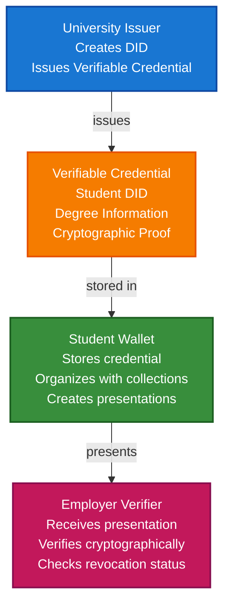

# Academic Credentials Scenario

This guide walks you through building a complete academic credential system using VeriCore. You'll learn how universities can issue verifiable diplomas, how students can store them in wallets, and how employers can verify credentials without contacting the university.

## What You'll Build

By the end of this tutorial, you'll have:

- ✅ Created DIDs for a university (issuer) and a student (holder)
- ✅ Issued a Verifiable Credential for a university degree
- ✅ Stored the credential in a student's wallet
- ✅ Organized credentials with collections and tags
- ✅ Created a Verifiable Presentation for job applications
- ✅ Verified the credential cryptographically

## Big Picture & Significance

### The Academic Credential Challenge

Academic credentials are fundamental to career advancement and professional opportunities. However, traditional credential systems are slow, prone to fraud, and don't respect student privacy or control.

**Industry Context**:
- **Market Size**: Global education technology market projected to reach $404 billion by 2025
- **Credential Volume**: Millions of degrees issued annually worldwide
- **Verification Costs**: Universities spend significant resources on credential verification
- **Fraud Impact**: Credential fraud costs billions annually
- **Student Rights**: Growing demand for student-controlled credentials

**Why This Matters**:
1. **Student Control**: Students own and control their credentials
2. **Instant Verification**: Employers can verify credentials instantly
3. **Privacy**: Selective disclosure protects student privacy
4. **Fraud Prevention**: Cryptographic proof prevents forgery
5. **Portability**: Credentials work across institutions and borders
6. **Efficiency**: Reduces verification costs for all parties

### The Credential Verification Problem

Traditional academic credentials face critical issues:
- **Slow Verification**: Employers must contact universities directly
- **Fraud Vulnerability**: Paper diplomas can be easily forged
- **No Privacy**: Sharing a diploma reveals all information
- **Not Portable**: Credentials tied to specific institutions
- **High Costs**: Verification processes are expensive and time-consuming

## Value Proposition

### Problems Solved

1. **Instant Verification**: Cryptographic proof without contacting universities
2. **Fraud Prevention**: Tamper-proof credentials cannot be forged
3. **Privacy Control**: Selective disclosure shows only necessary information
4. **Student Ownership**: Students control their own credentials
5. **Interoperability**: Standard format works across all institutions
6. **Cost Reduction**: Eliminates expensive verification processes
7. **Portability**: Credentials work across institutions and borders

### Business Benefits

**For Universities**:
- **Cost Savings**: Reduced verification workload
- **Reputation**: Enhanced trust through verifiable credentials
- **Efficiency**: Automated credential issuance
- **Compliance**: Meet accreditation requirements

**For Students**:
- **Control**: Own and control credentials
- **Privacy**: Share only necessary information
- **Convenience**: Access credentials from any device
- **Portability**: Credentials work everywhere

**For Employers**:
- **Speed**: Instant verification
- **Trust**: Cryptographic proof of authenticity
- **Cost**: Reduced verification costs
- **Efficiency**: Streamlined hiring process

### ROI Considerations

- **Verification Costs**: 80-90% reduction in verification costs
- **Fraud Prevention**: Eliminates credential fraud
- **Efficiency**: 10x faster verification process
- **Student Satisfaction**: Improved student experience

## Understanding the Problem

Traditional academic credentials have several problems:

1. **Verification is slow**: Employers must contact universities directly
2. **Fraud is easy**: Paper diplomas can be forged
3. **No privacy**: Sharing a diploma reveals all information
4. **Not portable**: Credentials are tied to institutions

VeriCore solves this by enabling:

- **Instant verification**: Cryptographic proof without contacting the university
- **Tamper-proof**: Credentials are cryptographically signed
- **Privacy-preserving**: Selective disclosure shows only what's needed
- **Self-sovereign**: Students control their own credentials

## How It Works: The Credential Flow



## Prerequisites

- Java 21+
- Kotlin 2.2.0+
- Gradle 8.5+
- Basic understanding of Kotlin and coroutines

## Step 1: Add Dependencies

Add VeriCore dependencies to your `build.gradle.kts`. These modules cover DID management, credential issuance, wallet storage, and the in-memory services used throughout this scenario.

```kotlin
dependencies {
    // Core VeriCore modules
    implementation("com.geoknoesis.vericore:vericore-core:1.0.0-SNAPSHOT")
    implementation("com.geoknoesis.vericore:vericore-json:1.0.0-SNAPSHOT")
    implementation("com.geoknoesis.vericore:vericore-kms:1.0.0-SNAPSHOT")
    implementation("com.geoknoesis.vericore:vericore-did:1.0.0-SNAPSHOT")
    implementation("com.geoknoesis.vericore:vericore-anchor:1.0.0-SNAPSHOT")
    
    // Test kit for in-memory implementations
    implementation("com.geoknoesis.vericore:vericore-testkit:1.0.0-SNAPSHOT")
    
    // Kotlinx Serialization
    implementation("org.jetbrains.kotlinx:kotlinx-serialization-json:1.6.0")
    
    // Coroutines
    implementation("org.jetbrains.kotlinx:kotlinx-coroutines-core:1.7.3")
}
```

**Result:** After syncing, you can run every snippet below without adding more modules or adapters.

## Step 2: Complete Example

Here’s the full academic credential flow in one place. Execute it to observe the baseline behaviour before diving into the details that follow.

```kotlin
import com.geoknoesis.vericore.credential.CredentialIssuanceOptions
import com.geoknoesis.vericore.credential.CredentialVerificationOptions
import com.geoknoesis.vericore.credential.PresentationOptions
import com.geoknoesis.vericore.credential.did.CredentialDidResolver
import com.geoknoesis.vericore.credential.issuer.CredentialIssuer
import com.geoknoesis.vericore.credential.models.CredentialSchema
import com.geoknoesis.vericore.credential.models.VerifiableCredential
import com.geoknoesis.vericore.credential.proof.Ed25519ProofGenerator
import com.geoknoesis.vericore.credential.verifier.CredentialVerifier
import com.geoknoesis.vericore.did.DidMethodRegistry
import com.geoknoesis.vericore.did.toCredentialDidResolution
import com.geoknoesis.vericore.testkit.credential.InMemoryWallet
import com.geoknoesis.vericore.testkit.did.DidKeyMockMethod
import com.geoknoesis.vericore.testkit.kms.InMemoryKeyManagementService
import kotlinx.coroutines.runBlocking
import kotlinx.serialization.json.buildJsonObject
import kotlinx.serialization.json.put
import java.time.Instant
import java.time.temporal.ChronoUnit

fun main() = runBlocking {
    println("=== Academic Credentials Scenario ===")
    val didRegistry = DidMethodRegistry()

    val universityKms = InMemoryKeyManagementService()
    val didMethod = DidKeyMockMethod(universityKms)
    didRegistry.register(didMethod)

    val universityDid = didMethod.createDid()
    val studentDid = didMethod.createDid()

    val didResolver = CredentialDidResolver { did ->
        didRegistry.resolve(did).toCredentialDidResolution()
    }

    val studentWallet = InMemoryWallet(
        walletDid = studentDid.id,
        holderDid = studentDid.id
    )

    val proofGenerator = Ed25519ProofGenerator(
        signer = { payload, keyId -> universityKms.sign(keyId, payload) },
        getPublicKeyId = { keyId -> "${universityDid.id}#$keyId" }
    )
    val credentialIssuer = CredentialIssuer(
        proofGenerator = proofGenerator,
        resolveDid = { did -> didResolver.resolve(did)?.isResolvable == true }
    )

    val degreeCredential = createDegreeCredential(
        issuerDid = universityDid.id,
        studentDid = studentDid.id
    )

    val issuerKey = universityKms.generateKey("Ed25519")
    val issuedCredential = runCatching {
        credentialIssuer.issue(
            credential = degreeCredential,
            issuerDid = universityDid.id,
            keyId = issuerKey.id,
            options = CredentialIssuanceOptions(
                proofType = proofGenerator.proofType,
                challenge = "job-application-12345"
            )
        )
    }.getOrElse { error("Issuance failed: ${it.message}") }

    println("Issued credential proof type: ${issuedCredential.proof?.type}")

    val credentialId = studentWallet.store(issuedCredential)
    studentWallet.tagCredential(credentialId, setOf("degree", "computer-science", "verified"))

    val presentation = studentWallet.createPresentation(
        credentialIds = listOf(credentialId),
        holderDid = studentDid.id,
        options = PresentationOptions(
            holderDid = studentDid.id,
            challenge = "job-application-12345"
        )
    )

    val verifier = CredentialVerifier(didResolver)
    val verificationResult = verifier.verify(
        credential = issuedCredential,
        options = CredentialVerificationOptions(
            checkRevocation = false,
            checkExpiration = true,
            validateSchema = false,
            didResolver = didResolver
        )
    )

    if (!verificationResult.valid) {
        println("Verification errors: ${verificationResult.errors}")
    } else {
        println("Credential verified (structural checks only).")
    }

    val stats = studentWallet.getStatistics()
    println("Wallet summary -> total: ${stats.totalCredentials}, tags: ${stats.tagsCount}")
    println("Presentation holder: ${presentation.holder}")
}

**Result:** The script logs each milestone (DID creation, issuance, wallet storage, presentation verification). A concluding success message confirms the happy path—if that ever changes, use the printed checkpoints to debug.

private fun createDegreeCredential(
    issuerDid: String,
    studentDid: String
): VerifiableCredential {
    val now = Instant.now()
    val expirationDate = now.plus(10, ChronoUnit.YEARS)

    return VerifiableCredential(
        id = "https://example.edu/credentials/degree-${studentDid.substringAfterLast(":")}",
        type = listOf("VerifiableCredential", "DegreeCredential", "BachelorDegreeCredential"),
        issuer = issuerDid,
        credentialSubject = buildJsonObject {
            put("id", studentDid)
            put("degree", buildJsonObject {
                put("type", "BachelorDegree")
                put("name", "Bachelor of Science in Computer Science")
                put("university", "Example University")
                put("graduationDate", "2023-05-15")
                put("gpa", "3.8")
            })
        },
        issuanceDate = now.toString(),
        expirationDate = expirationDate.toString(),
        credentialSchema = CredentialSchema(
            id = "https://example.edu/schemas/degree.json",
            type = "JsonSchemaValidator2018"
        )
    )
}

## Step-by-Step Breakdown

### Step 1: Setup Services

Initialize a clean registry and create the key management service + DID method used by the university:

```kotlin
val didRegistry = DidMethodRegistry()
val universityKms = InMemoryKeyManagementService()
val didMethod = DidKeyMockMethod(universityKms)
didRegistry.register(didMethod)
```

### Step 2: Create DIDs

Each party needs their own DID:

```kotlin
val universityDid = didMethod.createDid()
val studentDid = didMethod.createDid()
```

### Step 3: Create Student Wallet

Students need a wallet to store their credentials:

```kotlin
val studentWallet = InMemoryWallet(
    walletDid = studentDid.id,
    holderDid = studentDid.id
)
```

### Step 4: Issue Credential

The university creates and issues a verifiable credential:

```kotlin
val credential = VerifiableCredential(
    type = listOf("VerifiableCredential", "DegreeCredential"),
    issuer = universityDid.id,
    credentialSubject = buildJsonObject {
        put("id", studentDid.id)
        put("degree", buildJsonObject {
            put("name", "Bachelor of Science")
            // ... more fields
        })
    },
    issuanceDate = Instant.now().toString()
)

val didResolver = CredentialDidResolver { did ->
    didRegistry.resolve(did).toCredentialDidResolution()
}

val proofGenerator = Ed25519ProofGenerator(
    signer = { payload, keyId -> universityKms.sign(keyId, payload) },
    getPublicKeyId = { keyId -> "${universityDid.id}#$keyId" }
)
val credentialIssuer = CredentialIssuer(
    proofGenerator = proofGenerator,
    resolveDid = { did -> didResolver.resolve(did)?.isResolvable == true }
)

val issuerKey = universityKms.generateKey("Ed25519")

val issuedCredential = credentialIssuer.issue(
    credential = credential,
    issuerDid = universityDid.id,
    keyId = issuerKey.id,
    options = CredentialIssuanceOptions(
        proofType = proofGenerator.proofType,
        challenge = "job-application-12345"
    )
)
```

### Step 5: Store in Wallet

The student stores the credential:

```kotlin
val credentialId = studentWallet.store(issuedCredential)
```

### Step 6: Organize Credentials

Use collections and tags to organize:

```kotlin
val educationCollection = studentWallet.createCollection("Education Credentials")
studentWallet.addToCollection(credentialId, educationCollection)
studentWallet.tagCredential(credentialId, setOf("degree", "bachelor"))
```

### Step 7: Query Credentials

Find credentials easily:

```kotlin
val degrees = studentWallet.query {
    byType("DegreeCredential")
    valid()
}
```

### Step 8: Create Presentation

Create a presentation for sharing:

```kotlin
val presentation = studentWallet.createPresentation(
    credentialIds = listOf(credentialId),
    holderDid = studentDid.id,
    options = PresentationOptions(
        holderDid = studentDid.id,
        challenge = "job-application-12345"
    )
)
```

### Step 9: Verify Credential

Employers run structural verification (revocation and cryptographic proof verification are stubs in the current SDK):

```kotlin
val verifier = CredentialVerifier(didResolver)
val result = verifier.verify(
    credential = issuedCredential,
    options = CredentialVerificationOptions(
        checkRevocation = false,
        checkExpiration = true,
        didResolver = didResolver
    )
)
```

## Advanced Features

### Selective Disclosure

Share only specific fields:

```kotlin
val selectivePresentation = studentWallet.createSelectiveDisclosure(
    credentialIds = listOf(credentialId),
    disclosedFields = listOf(
        "degree.name",
        "degree.university",
        "degree.graduationDate"
        // GPA is NOT disclosed
    ),
    holderDid = studentDid.id,
    options = PresentationOptions(...)
)
```

### Multiple Credentials

Students can store multiple credentials:

```kotlin
// Store multiple degrees
val bachelorId = studentWallet.store(bachelorDegree)
val masterId = studentWallet.store(masterDegree)
val certificateId = studentWallet.store(certificate)

// Create collection
val allEducation = studentWallet.createCollection("All Education")
studentWallet.addToCollection(bachelorId, allEducation)
studentWallet.addToCollection(masterId, allEducation)
studentWallet.addToCollection(certificateId, allEducation)
```

### Credential Verification Workflow

Complete verification flow:

```kotlin
suspend fun verifyAcademicCredential(
    credential: VerifiableCredential,
    expectedIssuer: String,
    verifier: CredentialVerifier,
    didResolver: CredentialDidResolver
): Boolean {
    val result = verifier.verify(
        credential = credential,
        options = CredentialVerificationOptions(
            checkRevocation = false, // Revocation checks require a status list implementation
            checkExpiration = true,
            didResolver = didResolver
        )
    )

    if (!result.valid) return false
    if (credential.issuer != expectedIssuer) return false
    return credential.type.contains("DegreeCredential")
}
```

## Real-World Considerations

### Trust & Failure Modes

- **Proof verification**: `CredentialVerifier` currently checks proof structure only. Integrate a dedicated proof validator or external service before relying on the result for high-assurance decisions.
- **Schema validation**: Register schema definitions with `SchemaRegistry.registerSchema` prior to enabling `validateSchema`, otherwise verification will throw an exception.
- **Revocation**: The verifier short-circuits revocation checks. When you add a `credentialStatus`, ensure you also provide a status list resolver and set `checkRevocation = true`.
- **Key custody**: Replace `InMemoryKeyManagementService` with an HSM or cloud KMS. Never persist private keys from the examples in production systems.
- **Registry hygiene**: Create fresh instances of `DidMethodRegistry` and `BlockchainAnchorRegistry` per test to avoid cross-test pollution—no global state required.

### Revocation

Universities can revoke credentials:

```kotlin
// Add revocation status to credential
val revokedCredential = credential.copy(
    credentialStatus = CredentialStatus(
        id = "https://example.edu/status/revocation-list",
        type = "StatusList2021Entry",
        statusPurpose = "revocation",
        statusListIndex = "12345"
    )
)
```

### Expiration

Credentials can have expiration dates:

```kotlin
val credential = VerifiableCredential(
    // ...
    expirationDate = Instant.now()
        .plus(10, ChronoUnit.YEARS)
        .toString()
)
```

### Schema Validation

Use schemas to ensure credential structure:

```kotlin
val credential = VerifiableCredential(
    // ...
    credentialSchema = CredentialSchema(
        id = "https://example.edu/schemas/degree.json",
        type = "JsonSchemaValidator2018",
        schemaFormat = SchemaFormat.JSON_SCHEMA
    )
)
```

## Benefits

1. **Instant Verification**: No need to contact universities
2. **Tamper-Proof**: Cryptographic signatures prevent forgery
3. **Privacy**: Selective disclosure shows only what's needed
4. **Portable**: Students control their credentials
5. **Verifiable**: Employers can verify independently

## Next Steps

- Learn about [Wallet API Tutorial](../tutorials/wallet-api-tutorial.md)
- Explore [Verifiable Credentials](../core-concepts/verifiable-credentials.md)
- Check out [Professional Identity Scenario](professional-identity-scenario.md)

