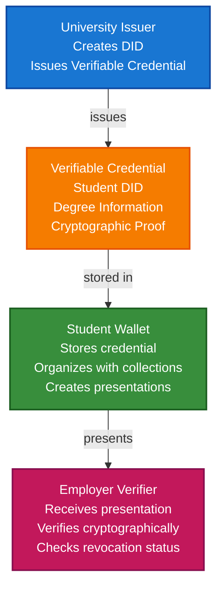

# Academic Credentials Scenario

This guide walks you through building a complete academic credential system using VeriCore. You'll learn how universities can issue verifiable diplomas, how students can store them in wallets, and how employers can verify credentials without contacting the university.

## What You'll Build

By the end of this tutorial, you'll have:

- ✅ Created DIDs for a university (issuer) and a student (holder)
- ✅ Issued a Verifiable Credential for a university degree
- ✅ Stored the credential in a student's wallet
- ✅ Organized credentials with collections and tags
- ✅ Created a Verifiable Presentation for job applications
- ✅ Verified the credential cryptographically

## Big Picture & Significance

### The Academic Credential Challenge

Academic credentials are fundamental to career advancement and professional opportunities. However, traditional credential systems are slow, prone to fraud, and don't respect student privacy or control.

**Industry Context**:
- **Market Size**: Global education technology market projected to reach $404 billion by 2025
- **Credential Volume**: Millions of degrees issued annually worldwide
- **Verification Costs**: Universities spend significant resources on credential verification
- **Fraud Impact**: Credential fraud costs billions annually
- **Student Rights**: Growing demand for student-controlled credentials

**Why This Matters**:
1. **Student Control**: Students own and control their credentials
2. **Instant Verification**: Employers can verify credentials instantly
3. **Privacy**: Selective disclosure protects student privacy
4. **Fraud Prevention**: Cryptographic proof prevents forgery
5. **Portability**: Credentials work across institutions and borders
6. **Efficiency**: Reduces verification costs for all parties

### The Credential Verification Problem

Traditional academic credentials face critical issues:
- **Slow Verification**: Employers must contact universities directly
- **Fraud Vulnerability**: Paper diplomas can be easily forged
- **No Privacy**: Sharing a diploma reveals all information
- **Not Portable**: Credentials tied to specific institutions
- **High Costs**: Verification processes are expensive and time-consuming

## Value Proposition

### Problems Solved

1. **Instant Verification**: Cryptographic proof without contacting universities
2. **Fraud Prevention**: Tamper-proof credentials cannot be forged
3. **Privacy Control**: Selective disclosure shows only necessary information
4. **Student Ownership**: Students control their own credentials
5. **Interoperability**: Standard format works across all institutions
6. **Cost Reduction**: Eliminates expensive verification processes
7. **Portability**: Credentials work across institutions and borders

### Business Benefits

**For Universities**:
- **Cost Savings**: Reduced verification workload
- **Reputation**: Enhanced trust through verifiable credentials
- **Efficiency**: Automated credential issuance
- **Compliance**: Meet accreditation requirements

**For Students**:
- **Control**: Own and control credentials
- **Privacy**: Share only necessary information
- **Convenience**: Access credentials from any device
- **Portability**: Credentials work everywhere

**For Employers**:
- **Speed**: Instant verification
- **Trust**: Cryptographic proof of authenticity
- **Cost**: Reduced verification costs
- **Efficiency**: Streamlined hiring process

### ROI Considerations

- **Verification Costs**: 80-90% reduction in verification costs
- **Fraud Prevention**: Eliminates credential fraud
- **Efficiency**: 10x faster verification process
- **Student Satisfaction**: Improved student experience

## Understanding the Problem

Traditional academic credentials have several problems:

1. **Verification is slow**: Employers must contact universities directly
2. **Fraud is easy**: Paper diplomas can be forged
3. **No privacy**: Sharing a diploma reveals all information
4. **Not portable**: Credentials are tied to institutions

VeriCore solves this by enabling:

- **Instant verification**: Cryptographic proof without contacting the university
- **Tamper-proof**: Credentials are cryptographically signed
- **Privacy-preserving**: Selective disclosure shows only what's needed
- **Self-sovereign**: Students control their own credentials

## How It Works: The Credential Flow



## Prerequisites

- Java 21+
- Kotlin 2.2.0+
- Gradle 8.5+
- Basic understanding of Kotlin and coroutines

## Step 1: Add Dependencies

Add VeriCore dependencies to your `build.gradle.kts`:

```kotlin
dependencies {
    // Core VeriCore modules
    implementation("io.geoknoesis.vericore:vericore-core:1.0.0-SNAPSHOT")
    implementation("io.geoknoesis.vericore:vericore-json:1.0.0-SNAPSHOT")
    implementation("io.geoknoesis.vericore:vericore-kms:1.0.0-SNAPSHOT")
    implementation("io.geoknoesis.vericore:vericore-did:1.0.0-SNAPSHOT")
    implementation("io.geoknoesis.vericore:vericore-anchor:1.0.0-SNAPSHOT")
    
    // Test kit for in-memory implementations
    implementation("io.geoknoesis.vericore:vericore-testkit:1.0.0-SNAPSHOT")
    
    // Kotlinx Serialization
    implementation("org.jetbrains.kotlinx:kotlinx-serialization-json:1.6.0")
    
    // Coroutines
    implementation("org.jetbrains.kotlinx:kotlinx-coroutines-core:1.7.3")
}
```

## Step 2: Complete Example

Here's a complete example that demonstrates the full academic credential flow:

```kotlin
import io.geoknoesis.vericore.credential.models.VerifiableCredential
import io.geoknoesis.vericore.credential.models.VerifiablePresentation
import io.geoknoesis.vericore.credential.CredentialIssuanceOptions
import io.geoknoesis.vericore.credential.CredentialVerificationOptions
import io.geoknoesis.vericore.credential.PresentationOptions
import io.geoknoesis.vericore.credential.issuer.CredentialIssuer
import io.geoknoesis.vericore.credential.verifier.CredentialVerifier
import io.geoknoesis.vericore.credential.proof.Ed25519ProofGenerator
import io.geoknoesis.vericore.credential.proof.ProofGeneratorRegistry
import io.geoknoesis.vericore.testkit.credential.InMemoryWallet
import io.geoknoesis.vericore.testkit.did.DidKeyMockMethod
import io.geoknoesis.vericore.testkit.kms.InMemoryKeyManagementService
import io.geoknoesis.vericore.did.DidRegistry
import kotlinx.coroutines.runBlocking
import kotlinx.serialization.json.buildJsonObject
import kotlinx.serialization.json.put
import java.time.Instant
import java.time.temporal.ChronoUnit

fun main() = runBlocking {
    println("=== Academic Credentials Scenario ===\n")
    
    // Step 1: Setup - Create KMS and DID methods
    println("Step 1: Setting up services...")
    val universityKms = InMemoryKeyManagementService()
    val studentKms = InMemoryKeyManagementService()
    
    val didMethod = DidKeyMockMethod(universityKms)
    DidRegistry.register(didMethod)
    
    // Step 2: Create DIDs
    println("\nStep 2: Creating DIDs...")
    val universityDid = didMethod.createDid(mapOf("algorithm" to "Ed25519"))
    println("University DID: ${universityDid.id}")
    
    val studentDid = didMethod.createDid(mapOf("algorithm" to "Ed25519"))
    println("Student DID: ${studentDid.id}")
    
    // Step 3: Create student wallet
    println("\nStep 3: Creating student wallet...")
    val studentWallet = InMemoryWallet(
        walletDid = studentDid.id,
        holderDid = studentDid.id
    )
    println("Wallet created with ID: ${studentWallet.walletId}")
    
    // Step 4: University issues degree credential
    println("\nStep 4: University issues degree credential...")
    val degreeCredential = createDegreeCredential(
        issuerDid = universityDid.id,
        studentDid = studentDid.id,
        degreeName = "Bachelor of Science in Computer Science",
        universityName = "Example University",
        graduationDate = "2023-05-15",
        gpa = "3.8"
    )
    
    // Issue credential with proof
    val issuerKey = universityKms.generateKey("Ed25519")
    val proofGenerator = Ed25519ProofGenerator(
        signer = { data, keyId -> universityKms.sign(keyId, data) },
        getPublicKeyId = { keyId -> issuerKey.id }
    )
    ProofGeneratorRegistry.register(proofGenerator)
    
    val credentialIssuer = CredentialIssuer(
        proofGenerator = proofGenerator,
        resolveDid = { did -> DidRegistry.resolve(did).document != null }
    )
    
    val issuedCredential = credentialIssuer.issue(
        credential = degreeCredential,
        issuerDid = universityDid.id,
        keyId = issuerKey.id,
        options = CredentialIssuanceOptions(proofType = "Ed25519Signature2020")
    )
    
    println("Credential issued:")
    println("  - Type: ${issuedCredential.type}")
    println("  - Issuer: ${issuedCredential.issuer}")
    println("  - Has proof: ${issuedCredential.proof != null}")
    
    // Step 5: Student stores credential in wallet
    println("\nStep 5: Student stores credential in wallet...")
    val credentialId = studentWallet.store(issuedCredential)
    println("Credential stored with ID: $credentialId")
    
    // Step 6: Organize credentials
    println("\nStep 6: Organizing credentials...")
    val educationCollection = studentWallet.createCollection(
        name = "Education Credentials",
        description = "Academic degrees and certificates"
    )
    studentWallet.addToCollection(credentialId, educationCollection)
    studentWallet.tagCredential(credentialId, setOf("degree", "bachelor", "computer-science", "verified"))
    
    println("Created collection: $educationCollection")
    println("Added tags: degree, bachelor, computer-science, verified")
    
    // Step 7: Query credentials
    println("\nStep 7: Querying credentials...")
    val degrees = studentWallet.query {
        byType("DegreeCredential")
        valid()
    }
    println("Found ${degrees.size} valid degree credentials")
    
    // Step 8: Create presentation for job application
    println("\nStep 8: Creating presentation for job application...")
    val presentation = studentWallet.createPresentation(
        credentialIds = listOf(credentialId),
        holderDid = studentDid.id,
        options = PresentationOptions(
            holderDid = studentDid.id,
            proofType = "Ed25519Signature2020",
            challenge = "job-application-12345"
        )
    )
    
    println("Presentation created:")
    println("  - Holder: ${presentation.holder}")
    println("  - Credentials: ${presentation.verifiableCredential.size}")
    println("  - Challenge: ${presentation.challenge}")
    
    // Step 9: Verify credential
    println("\nStep 9: Verifying credential...")
    val verifier = CredentialVerifier(
        resolveDid = { did -> DidRegistry.resolve(did).document != null }
    )
    
    val verificationResult = verifier.verify(
        credential = issuedCredential,
        options = CredentialVerificationOptions(
            checkRevocation = true,
            checkExpiration = true
        )
    )
    
    if (verificationResult.valid) {
        println("✅ Credential is valid!")
        println("  - Proof valid: ${verificationResult.proofValid}")
        println("  - Issuer valid: ${verificationResult.issuerValid}")
        println("  - Not expired: ${verificationResult.notExpired}")
        println("  - Not revoked: ${verificationResult.notRevoked}")
    } else {
        println("❌ Credential verification failed:")
        verificationResult.errors.forEach { println("  - $it") }
    }
    
    // Step 10: Get wallet statistics
    println("\nStep 10: Wallet statistics...")
    val stats = studentWallet.getStatistics()
    println("""
        Total credentials: ${stats.totalCredentials}
        Valid credentials: ${stats.validCredentials}
        Collections: ${stats.collectionsCount}
        Tags: ${stats.tagsCount}
    """.trimIndent())
    
    println("\n=== Scenario Complete ===")
}

fun createDegreeCredential(
    issuerDid: String,
    studentDid: String,
    degreeName: String,
    universityName: String,
    graduationDate: String,
    gpa: String
): VerifiableCredential {
    val now = Instant.now()
    val expirationDate = now.plus(10, ChronoUnit.YEARS) // Valid for 10 years
    
    return VerifiableCredential(
        id = "https://example.edu/credentials/degree-${studentDid.substringAfterLast(":")}",
        type = listOf("VerifiableCredential", "DegreeCredential", "BachelorDegreeCredential"),
        issuer = issuerDid,
        credentialSubject = buildJsonObject {
            put("id", studentDid)
            put("degree", buildJsonObject {
                put("type", "BachelorDegree")
                put("name", degreeName)
                put("university", universityName)
                put("graduationDate", graduationDate)
                put("gpa", gpa)
            })
        },
        issuanceDate = now.toString(),
        expirationDate = expirationDate.toString(),
        credentialSchema = io.geoknoesis.vericore.credential.models.CredentialSchema(
            id = "https://example.edu/schemas/degree.json",
            type = "JsonSchemaValidator2018",
            schemaFormat = io.geoknoesis.vericore.spi.SchemaFormat.JSON_SCHEMA
        )
    )
}
```

## Step-by-Step Breakdown

### Step 1: Setup Services

Create key management services and DID methods for both the university and student:

```kotlin
val universityKms = InMemoryKeyManagementService()
val studentKms = InMemoryKeyManagementService()
val didMethod = DidKeyMockMethod(universityKms)
DidRegistry.register(didMethod)
```

### Step 2: Create DIDs

Each party needs their own DID:

```kotlin
val universityDid = didMethod.createDid(mapOf("algorithm" to "Ed25519"))
val studentDid = didMethod.createDid(mapOf("algorithm" to "Ed25519"))
```

### Step 3: Create Student Wallet

Students need a wallet to store their credentials:

```kotlin
val studentWallet = InMemoryWallet(
    walletDid = studentDid.id,
    holderDid = studentDid.id
)
```

### Step 4: Issue Credential

The university creates and issues a verifiable credential:

```kotlin
val credential = VerifiableCredential(
    type = listOf("VerifiableCredential", "DegreeCredential"),
    issuer = universityDid.id,
    credentialSubject = buildJsonObject {
        put("id", studentDid.id)
        put("degree", buildJsonObject {
            put("name", "Bachelor of Science")
            // ... more fields
        })
    },
    issuanceDate = Instant.now().toString()
)

val proofGenerator = Ed25519ProofGenerator(
    signer = { data, keyId -> kms.sign(keyId, data) },
    getPublicKeyId = { keyId -> issuerKey.id }
)
ProofGeneratorRegistry.register(proofGenerator)

val credentialIssuer = CredentialIssuer(
    proofGenerator = proofGenerator,
    resolveDid = { did -> DidRegistry.resolve(did).document != null }
)

val issuedCredential = credentialIssuer.issue(
    credential = credential,
    issuerDid = universityDid.id,
    keyId = issuerKey.id,
    options = CredentialIssuanceOptions(proofType = "Ed25519Signature2020")
)
```

### Step 5: Store in Wallet

The student stores the credential:

```kotlin
val credentialId = studentWallet.store(issuedCredential)
```

### Step 6: Organize Credentials

Use collections and tags to organize:

```kotlin
val educationCollection = studentWallet.createCollection("Education Credentials")
studentWallet.addToCollection(credentialId, educationCollection)
studentWallet.tagCredential(credentialId, setOf("degree", "bachelor"))
```

### Step 7: Query Credentials

Find credentials easily:

```kotlin
val degrees = studentWallet.query {
    byType("DegreeCredential")
    valid()
}
```

### Step 8: Create Presentation

Create a presentation for sharing:

```kotlin
val presentation = studentWallet.createPresentation(
    credentialIds = listOf(credentialId),
    holderDid = studentDid.id,
    options = PresentationOptions(
        holderDid = studentDid.id,
        challenge = "job-application-12345"
    )
)
```

### Step 9: Verify Credential

Employers verify cryptographically:

```kotlin
val result = verifier.verify(
    credential = issuedCredential,
    options = CredentialVerificationOptions(
        checkRevocation = true,
        checkExpiration = true
    )
)
```

## Advanced Features

### Selective Disclosure

Share only specific fields:

```kotlin
val selectivePresentation = studentWallet.createSelectiveDisclosure(
    credentialIds = listOf(credentialId),
    disclosedFields = listOf(
        "degree.name",
        "degree.university",
        "degree.graduationDate"
        // GPA is NOT disclosed
    ),
    holderDid = studentDid.id,
    options = PresentationOptions(...)
)
```

### Multiple Credentials

Students can store multiple credentials:

```kotlin
// Store multiple degrees
val bachelorId = studentWallet.store(bachelorDegree)
val masterId = studentWallet.store(masterDegree)
val certificateId = studentWallet.store(certificate)

// Create collection
val allEducation = studentWallet.createCollection("All Education")
studentWallet.addToCollection(bachelorId, allEducation)
studentWallet.addToCollection(masterId, allEducation)
studentWallet.addToCollection(certificateId, allEducation)
```

### Credential Verification Workflow

Complete verification flow:

```kotlin
fun verifyAcademicCredential(
    presentation: VerifiablePresentation,
    expectedIssuer: String
): Boolean {
    // 1. Verify presentation proof
    val presentationValid = verifyPresentationProof(presentation)
    if (!presentationValid) return false
    
    // 2. Verify each credential
    presentation.verifiableCredential.forEach { credential ->
        val result = verifier.verify(
            credential = credential,
            options = CredentialVerificationOptions(
                checkRevocation = true,
                checkExpiration = true,
                validateSchema = true
            )
        )
        
        if (!result.valid) return false
        
        // 3. Check issuer matches expected university
        if (credential.issuer != expectedIssuer) return false
        
        // 4. Check credential type
        if (!credential.type.contains("DegreeCredential")) return false
    }
    
    return true
}
```

## Real-World Considerations

### Revocation

Universities can revoke credentials:

```kotlin
// Add revocation status to credential
val revokedCredential = credential.copy(
    credentialStatus = CredentialStatus(
        id = "https://example.edu/status/revocation-list",
        type = "StatusList2021Entry",
        statusPurpose = "revocation",
        statusListIndex = "12345"
    )
)
```

### Expiration

Credentials can have expiration dates:

```kotlin
val credential = VerifiableCredential(
    // ...
    expirationDate = Instant.now()
        .plus(10, ChronoUnit.YEARS)
        .toString()
)
```

### Schema Validation

Use schemas to ensure credential structure:

```kotlin
val credential = VerifiableCredential(
    // ...
    credentialSchema = CredentialSchema(
        id = "https://example.edu/schemas/degree.json",
        type = "JsonSchemaValidator2018",
        schemaFormat = SchemaFormat.JSON_SCHEMA
    )
)
```

## Benefits

1. **Instant Verification**: No need to contact universities
2. **Tamper-Proof**: Cryptographic signatures prevent forgery
3. **Privacy**: Selective disclosure shows only what's needed
4. **Portable**: Students control their credentials
5. **Verifiable**: Employers can verify independently

## Next Steps

- Learn about [Wallet API Tutorial](../tutorials/wallet-api-tutorial.md)
- Explore [Verifiable Credentials](../core-concepts/verifiable-credentials.md)
- Check out [Professional Identity Scenario](professional-identity-scenario.md)

