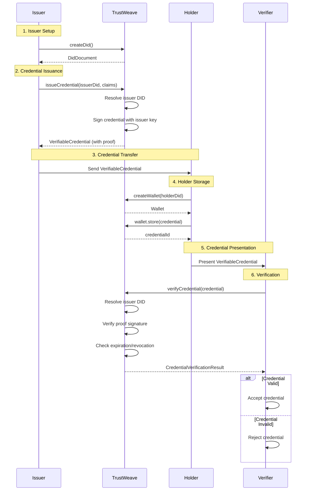

# Common Patterns

> **Version:** 1.0.0-SNAPSHOT
> Learn common usage patterns and best practices for TrustWeave.

## Table of Contents

1. [Issuer → Holder → Verifier Workflow](#issuer--holder--verifier-workflow)
2. [Batch Operations](#batch-operations)
3. [Error Recovery with Fallbacks](#error-recovery-with-fallbacks)
4. [Credential Lifecycle Management](#credential-lifecycle-management)
5. [Multi-Chain Anchoring](#multi-chain-anchoring)
6. [Wallet Organization Patterns](#wallet-organization-patterns)

---

## Issuer → Holder → Verifier Workflow

Complete workflow showing all three parties in a credential ecosystem. This example uses production-ready error handling patterns with `fold()`.

```kotlin
package com.example.patterns.workflow

import org.trustweave.TrustWeave
import org.trustweave.core.*
import kotlinx.coroutines.runBlocking
import kotlinx.serialization.json.buildJsonObject
import kotlinx.serialization.json.put

fun main() = runBlocking {
    val trustweave = TrustWeave.create()

    // ============================================
    // 1. ISSUER: Create DID and issue credential
    // ============================================
    val issuerDidDoc = try {
        trustWeave.createDid { method(KEY) }
    } catch (error: Exception) {
        when (error) {
            is IllegalStateException -> {
                if (error.message?.contains("not configured") == true) {
                println("❌ DID method not registered: ${error.method}")
                println("   Available methods: ${error.availableMethods}")
            }
            else -> {
                println("❌ Failed to create issuer DID: ${error.message}")
            }
        }
        return@runBlocking
    }

    val issuerDid = issuerDidDoc.id
    val issuerKeyId = issuerDidDoc.verificationMethod.firstOrNull()?.id
        ?: error("No verification method found")

    val credential = try {
        trustWeave.issue {
            credential {
                type("VerifiableCredential", "DegreeCredential")
                issuer(issuerDid)
                subject {
                    id("did:key:holder-123")
                    "name" to "Alice"
                    "degree" to "Bachelor of Science"
                }
            }
            signedBy(issuerDid = issuerDid, keyId = issuerKeyId)
        }
    } catch (error: Exception) {
        when (error) {
            is IllegalStateException -> {
                if (error.message?.contains("not configured") == true) {
                    println("❌ Credential issuance failed: ${error.message}")
                } else {
                    println("❌ Credential issuance failed: ${error.message}")
                }
            }
            else -> {
                println("❌ Failed to issue credential: ${error.message}")
            }
        }
        return@runBlocking
    }

    println("✅ Issuer created credential: ${credential.id}")

    // ============================================
    // 2. HOLDER: Store credential in wallet
    // ============================================
    val holderDid = try {
        trustWeave.createDid { method(KEY) }
    } catch (error: Exception) {
        println("❌ Failed to create holder DID: ${error.message}")
        return@runBlocking
    }

    val wallet = try {
        trustweave.wallets.create(holderDid = holderDid)
    } catch (error: TrustWeaveError) {
        when (error) {
            is TrustWeaveError.WalletCreationFailed -> {
                println("❌ Wallet creation failed: ${error.reason}")
                println("   Provider: ${error.provider}")
            }
            else -> {
                println("❌ Failed to create wallet: ${error.message}")
            }
        }
        return@runBlocking
    }

    val credentialId = wallet.store(credential)
    println("✅ Holder stored credential: $credentialId")

    // ============================================
    // 3. VERIFIER: Verify credential
    // ============================================
    val verification = try {
        trustWeave.verify {
            credential(credential)
        }
    } catch (error: Exception) {
        when (error) {
            is IllegalStateException -> {
                println("❌ Credential validation failed: ${error.reason}")
                println("   Field: ${error.field}")
            }
            else -> {
                println("❌ Verification failed: ${error.message}")
            }
        }
        return@runBlocking
    }

    if (verification.valid) {
        println("✅ Verifier confirmed credential is valid")
        println("   Proof valid: ${verification.proofValid}")
        println("   Issuer valid: ${verification.issuerValid}")
        println("   Not revoked: ${verification.notRevoked}")

        if (verification.warnings.isNotEmpty()) {
            println("   Warnings: ${verification.warnings.joinToString()}")
        }
    } else {
        println("❌ Verifier rejected credential")
        println("   Errors: ${verification.errors.joinToString()}")
    }
}
```

**Key Points:**
- Each party has their own DID
- Issuer signs the credential with their key
- Holder stores the credential in their wallet
- Verifier checks the credential without contacting issuer

### Workflow Diagram



---

## Batch Operations

Process multiple DIDs or credentials efficiently using coroutines.

```kotlin
package com.example.patterns.batch

import org.trustweave.TrustWeave
import org.trustweave.core.*
import kotlinx.coroutines.runBlocking

fun main() = runBlocking {
    val trustweave = TrustWeave.create()

    // Batch DID resolution
    val dids = listOf(
        "did:key:z6Mk...",
        "did:key:z6Mk...",
        "did:key:z6Mk..."
    )

    val results = dids.mapAsync { did ->
        runCatching {
            trustWeave.resolveDid(did)
        }
    }

    results.forEachIndexed { index, result ->
        result.fold(
            onSuccess = { resolution ->
                println("✅ DID ${index + 1} resolved: ${resolution.document?.id}")
            },
            onFailure = { error ->
                println("❌ DID ${index + 1} failed: ${error.message}")
            }
        )
    }

    // Batch credential creation
    import org.trustweave.trust.types.getOrThrowDid
    import org.trustweave.trust.types.getOrThrow
    import org.trustweave.did.resolver.DidResolutionResult
    import org.trustweave.did.identifiers.extractKeyId
    
    // Helper extension for resolution results
    fun DidResolutionResult.getOrThrow() = when (this) {
        is DidResolutionResult.Success -> this.document
        else -> throw IllegalStateException("Failed to resolve DID: ${this.errorMessage ?: "Unknown error"}")
    }
    
    val credentials = (1..10).mapAsync { index ->
        runCatching {
            val issuerDid = trustWeave.createDid { method(KEY) }.getOrThrowDid()
            val issuerDoc = trustWeave.resolveDid(issuerDid).getOrThrow()
            val issuerKeyId = issuerDoc.verificationMethod.firstOrNull()?.extractKeyId()
                ?: throw IllegalStateException("No verification method found")
            
            trustWeave.issue {
                credential {
                    issuer(issuerDid)
                    subject {
                        id("did:key:holder-$index")
                        "index" to index
                    }
                    issued(Instant.now())
                }
                signedBy(issuerDid)
            }.getOrThrow()
        }
    }

    val successful = credentials.filter { it.isSuccess }
    val failed = credentials.filter { it.isFailure }

    println("Created ${successful.size} credentials out of ${credentials.size}")
    if (failed.isNotEmpty()) {
        println("Failed: ${failed.size} credentials")
        failed.forEach { result ->
            result.fold(
                onSuccess = { },
                onFailure = { error ->
                    println("  Error: ${error.message}")
                }
            )
        }
    }
}
```

**Key Points:**
- Use `mapAsync` for parallel operations
- Handle each result individually
- Filter successful results for further processing

---

## Error Recovery with Fallbacks

Handle errors gracefully with fallback strategies.

```kotlin
package com.example.patterns.recovery

import org.trustweave.TrustWeave
import org.trustweave.core.*
import kotlinx.coroutines.runBlocking

fun main() = runBlocking {
    val TrustWeave = TrustWeave.create()

    // Pattern: Try multiple DID methods with fallback
    import org.trustweave.trust.types.DidCreationResult
    
    suspend fun createDidWithFallback(methods: List<String>): Did? {
        for (method in methods) {
            val didResult = trustWeave.createDid { method(method) }
            when (didResult) {
                is DidCreationResult.Success -> return didResult.did
                is DidCreationResult.Failure.MethodNotRegistered -> {
                    println("Method '$method' not available, trying next...")
                    // Continue to next method
                }
                else -> {
                    println("Unexpected error with method '$method': ${didResult.reason}")
                    // Try next method anyway
                }
            }
        }
        return null
    }

    val did = createDidWithFallback(listOf("web", "ion", "key"))
        ?: error("All DID methods failed")

    println("✅ Created DID: ${did.id}")

    // Pattern: Retry with exponential backoff
    suspend fun resolveDidWithRetry(did: String, maxRetries: Int = 3): DidResolutionResult? {
        var lastError: Throwable? = null

        for (attempt in 1..maxRetries) {
            val resolution = trustWeave.resolveDid(did)
            when (resolution) {
                is DidResolutionResult.Success -> return resolution
                is DidResolutionResult.Failure -> {
                    lastError = Exception(resolution.reason)
                    if (attempt < maxRetries) {
                        val delay = (attempt * attempt * 100).toLong() // Exponential backoff
                        kotlinx.coroutines.delay(delay)
                        println("Retry $attempt/$maxRetries after ${delay}ms...")
                    }
                }
            )
        }

        println("Failed after $maxRetries attempts: ${lastError?.message}")
        return null
    }
}
```

**Key Points:**
- Try multiple methods/strategies in order
- Use exponential backoff for retries
- Always have a fallback plan
- Log attempts for debugging

---

## Credential Lifecycle Management

Manage credentials through their entire lifecycle: issuance, storage, presentation, verification, and expiration.

```kotlin
package com.example.patterns.lifecycle

import org.trustweave.TrustWeave
import org.trustweave.core.*
import org.trustweave.credential.PresentationOptions
import org.trustweave.spi.services.WalletCreationOptionsBuilder
import kotlinx.coroutines.runBlocking
import kotlinx.serialization.json.buildJsonObject
import kotlinx.serialization.json.put
import java.time.Instant
import java.time.temporal.ChronoUnit

fun main() = runBlocking {
    val TrustWeave = TrustWeave.create()

    // Create issuer and holder
    import org.trustweave.trust.types.getOrThrowDid
    import org.trustweave.trust.types.getOrThrow
    import org.trustweave.did.resolver.DidResolutionResult
    import org.trustweave.did.identifiers.extractKeyId
    
    // Helper extension for resolution results
    fun DidResolutionResult.getOrThrow() = when (this) {
        is DidResolutionResult.Success -> this.document
        else -> throw IllegalStateException("Failed to resolve DID: ${this.errorMessage ?: "Unknown error"}")
    }
    
    val issuerDid = trustWeave.createDid { method(KEY) }.getOrThrowDid()
    val holderDid = trustWeave.createDid { method(KEY) }.getOrThrowDid()

    // Issue credential with expiration
    val expirationDate = Instant.now().plus(1, ChronoUnit.YEARS)
    val issuerDoc = trustWeave.resolveDid(issuerDid).getOrThrow()
    val issuerKeyId = issuerDoc.verificationMethod.firstOrNull()?.extractKeyId()
        ?: throw IllegalStateException("No verification method found")
    
    val credential = trustWeave.issue {
        credential {
            issuer(issuerDid.value)
            subject {
                id(holderDid.value)
                "name" to "Alice"
            }
            issued(Instant.now())
            expires(expirationDate)
        }
        signedBy(issuerDid = issuerDid.value, keyId = issuerKeyId)
    }.getOrThrow()

    // Store in wallet with lifecycle support
    val wallet = trustWeave.wallet {
        holder(holderDid.value)
        enableOrganization()
        enablePresentation()
    }.getOrThrow()

    val credentialId = wallet.store(credential)

    // Organize credential
    wallet.withOrganization { org ->
        val collectionId = org.createCollection("Education", "Academic credentials")
        org.addToCollection(credentialId, collectionId)
        org.tagCredential(credentialId, setOf("degree", "verified"))
    }

    // Create presentation when needed
    val presentation = wallet.withPresentation { pres ->
        pres.createPresentation(
            credentialIds = listOf(credentialId),
            holderDid = holderDid.id,
            options = PresentationOptions(
                holderDid = holderDid.id,
                challenge = "job-application-${System.currentTimeMillis()}"
            )
        )
    }

    // Verify before using
    val verification = try {
        trustWeave.verify {
            credential(credential)
        }
    } catch (error: Exception) {
        println("❌ Verification failed: ${error.message}")
        return@runBlocking
    }

    when (verification) {
        is VerificationResult.Valid -> {
            // Credential is valid, continue
        }
        is VerificationResult.Invalid -> {
        println("⚠️ Credential invalid: ${verification.errors.joinToString()}")
        return@runBlocking
    }

    // Check expiration
    if (credential.expirationDate != null) {
        val expiration = Instant.parse(credential.expirationDate)
        if (expiration.isBefore(Instant.now())) {
            println("⚠️ Credential expired on ${credential.expirationDate}")
            // Archive expired credential
            wallet.withLifecycle { lifecycle ->
                lifecycle.archive(credentialId)
            }
        }
    }

    println("✅ Credential lifecycle managed successfully")
}
```

**Key Points:**
- Always set expiration dates for time-sensitive credentials
- Organize credentials for easy retrieval
- Verify credentials before use
- Archive expired credentials
- Use presentations for selective disclosure

---

## Multi-Chain Anchoring

Anchor the same credential to multiple blockchains for redundancy and interoperability.

```kotlin
package com.example.patterns.multichain

import org.trustweave.TrustWeave
import org.trustweave.anchor.BlockchainAnchorRegistry
import org.trustweave.core.*
import org.trustweave.credential.models.VerifiableCredential
import org.trustweave.testkit.anchor.InMemoryBlockchainAnchorClient
import kotlinx.coroutines.runBlocking
import kotlinx.serialization.json.Json
import kotlinx.serialization.json.encodeToJsonElement

fun main() = runBlocking {
    val TrustWeave = TrustWeave.create {
        blockchains {
            "algorand:testnet" to InMemoryBlockchainAnchorClient("algorand:testnet")
            "polygon:testnet" to InMemoryBlockchainAnchorClient("polygon:testnet")
        }
    }

    // Issue credential
    val issuerDidResult = trustWeave.createDid { method(KEY) }
    val issuerDid = when (issuerDidResult) {
        is DidCreationResult.Success -> issuerDidResult.did
        else -> {
            println("❌ Failed to create issuer DID: ${issuerDidResult.reason}")
            return@runBlocking
        }
    }

    val issuerResolution = trustWeave.resolveDid(issuerDid)
    val issuerDoc = when (issuerResolution) {
        is DidResolutionResult.Success -> issuerResolution.document
        else -> throw IllegalStateException("Failed to resolve issuer DID")
    }
    val issuerKeyId = issuerDoc.verificationMethod.firstOrNull()?.id?.substringAfter("#")
        ?: throw IllegalStateException("No verification method found")

    val issuanceResult = trustWeave.issue {
        credential {
            issuer(issuerDid.value)
            subject {
                id("did:key:holder")
                "data" to "important-data"
            }
            issued(Instant.now())
        }
        signedBy(issuerDid = issuerDid.value, keyId = issuerKeyId)
    }
    
    val credential = when (issuanceResult) {
        is IssuanceResult.Success -> issuanceResult.credential
        else -> {
            println("❌ Failed to issue credential: ${issuanceResult.reason}")
            return@runBlocking
        }
    }

    // Anchor to multiple chains
    val chains = listOf("algorand:testnet", "polygon:testnet")
    val anchorResults = chains.mapNotNull { chainId ->
        try {
            val anchor = trustweave.blockchains.anchor(
                data = credential,
                serializer = VerifiableCredential.serializer(),
                chainId = chainId
            )
            println("✅ Anchored to $chainId: ${anchor.ref.txHash}")
            anchor
        } catch (error: Exception) {
            println("❌ Failed to anchor to $chainId: ${error.message}")
            null
        }
    }

    println("Anchored to ${anchorResults.size} out of ${chains.size} chains")

    // Store all anchor references
    val anchorRefs = anchorResults.map { it.ref }
    // In production, store these in a database for later verification
}
```

**Key Points:**
- Anchor to multiple chains for redundancy
- Handle failures gracefully (some chains may be unavailable)
- Store all anchor references for verification
- Use different chains for different use cases

---

## Wallet Organization Patterns

Organize credentials efficiently using collections, tags, and metadata.

```kotlin
package com.example.patterns.organization

import org.trustweave.TrustWeave
import org.trustweave.core.*
import org.trustweave.spi.services.WalletCreationOptionsBuilder
import kotlinx.coroutines.runBlocking
import kotlinx.serialization.json.buildJsonObject
import kotlinx.serialization.json.put

fun main() = runBlocking {
    val trustweave = TrustWeave.create()

    val holderDid = try {
        trustWeave.createDid { method(KEY) }
    } catch (error: Exception) {
        println("❌ Failed to create holder DID: ${error.message}")
        return@runBlocking
    }

    val wallet = try {
        trustWeave.wallet {
            holder(holderDid.value)
            type("inMemory")
        }
    } catch (error: Exception) {
        println("❌ Failed to create wallet: ${error.message}")
        return@runBlocking
    }

    // Issue multiple credentials
    val issuerDid = try {
        trustWeave.createDid { method(KEY) }
    } catch (error: Exception) {
        println("❌ Failed to create issuer DID: ${error.message}")
        return@runBlocking
    }

    val issuerResolution = trustWeave.resolveDid(issuerDid)
    val issuerDoc = when (issuerResolution) {
        is DidResolutionResult.Success -> issuerResolution.document
        else -> throw IllegalStateException("Failed to resolve issuer DID")
    }
    val issuerKeyId = issuerDoc.verificationMethod.firstOrNull()?.id?.substringAfter("#")
        ?: throw IllegalStateException("No verification method found")

    val credentials = listOf(
        "Bachelor of Science" to "education",
        "Professional License" to "professional",
        "Membership Card" to "membership"
    )

    val credentialIds = credentials.mapNotNull { (name, category) ->
        val credential = try {
            trustWeave.issue {
                credential {
                    issuer(issuerDid)
                    subject {
                        id(holderDid.value)
                        "credentialName" to name
                    }
                    issued(Instant.now())
                }
                signedBy(issuerDid)
            }
                    issuerDid = issuerDid.id
                ),
                types = listOf("VerifiableCredential", "${category}Credential")
            )
        } catch (error: TrustWeaveError) {
            println("❌ Failed to issue credential '$name': ${error.message}")
            return@mapNotNull null
        }

        val credentialId = wallet.store(credential)

        // Organize immediately after storage
        wallet.withOrganization { org ->
            // Create collection by category
            val collectionId = org.createCollection(
                name = category.capitalize(),
                description = "$category credentials"
            )
            org.addToCollection(credentialId, collectionId)

            // Add tags
            org.tagCredential(credentialId, setOf(category, "verified", "active"))

            // Add metadata
            org.addMetadata(credentialId, mapOf(
                "category" to category,
                "storedAt" to System.currentTimeMillis()
            ))
        }

        credentialId
    }

    // Query by collection
    wallet.withOrganization { org ->
        val educationCollection = org.listCollections()
            .firstOrNull { it.name == "Education" }

        if (educationCollection != null) {
            val educationCreds = org.getCredentialsInCollection(educationCollection.id)
            println("Education credentials: ${educationCreds.size}")
        }
    }

    // Query by tag
    wallet.withOrganization { org ->
        val verifiedCreds = org.findByTag("verified")
        println("Verified credentials: ${verifiedCreds.size}")
    }

    // Get statistics
    val stats = wallet.getStatistics()
    println("Wallet stats:")
    println("  Total: ${stats.totalCredentials}")
    println("  Collections: ${stats.collectionsCount}")
    println("  Tags: ${stats.tagsCount}")
}
```

**Key Points:**
- Organize credentials immediately after storage
- Use collections for broad categories
- Use tags for flexible querying
- Add metadata for custom properties
- Query by collection, tag, or metadata

---

## Related Documentation

- [Quick Start](quick-start.md) - Getting started guide
- [Wallet API Reference](../api-reference/wallet-api.md) - Complete wallet API
- [Error Handling](../advanced/error-handling.md) - Error handling patterns
- [Troubleshooting](troubleshooting.md) - Common issues and solutions

