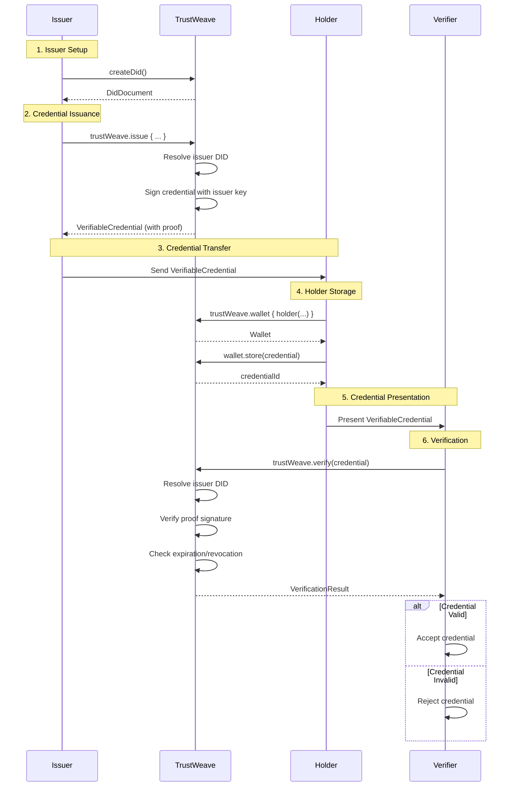

# Common Patterns

> **Version:** 0.6.0
> Learn common usage patterns and best practices for TrustWeave.

## Table of Contents

1. [Issuer → Holder → Verifier workflow](#issuer--holder--verifier-workflow)
2. [Batch Operations](#batch-operations)
3. [Error Recovery with Fallbacks](#error-recovery-with-fallbacks)
4. [Credential Lifecycle Management](#credential-lifecycle-management)
5. [Multi-Chain Anchoring](#multi-chain-anchoring)
6. [Wallet Organization Patterns](#wallet-organization-patterns)

---

## Issuer → Holder → Verifier workflow {#issuer--holder--verifier-workflow}

Complete workflow showing all three parties in a credential ecosystem. This example uses production-ready error handling patterns with `fold()`.

```kotlin
package com.example.patterns.workflow

import org.trustweave.trust.TrustWeave
import org.trustweave.trust.dsl.credential.DidMethods.KEY
import org.trustweave.trust.dsl.credential.KeyAlgorithms.ED25519
import org.trustweave.trust.dsl.credential.KmsProviders.IN_MEMORY
import org.trustweave.trust.types.getOrThrowDid
import org.trustweave.trust.types.WalletCreationResult
import org.trustweave.credential.results.IssuanceResult
import org.trustweave.credential.results.VerificationResult
import kotlinx.coroutines.runBlocking
import org.trustweave.testkit.services.*

fun main() = runBlocking {
    val trustWeave = TrustWeave.quickStart()

    // 1. ISSUER
    val issuerDid = trustWeave.createDid { method(KEY); algorithm(ED25519) }.getOrThrowDid()

    val credential = when (
        val issued = trustWeave.issue {
            credential {
                type("VerifiableCredential", "DegreeCredential")
                issuer(issuerDid)
                subject {
                    id("did:key:holder-123")
                    "name" to "Alice"
                    "degree" to "Bachelor of Science"
                }
            }
            signedBy(issuerDid)
        }
    ) {
        is IssuanceResult.Success -> issued.credential
        is IssuanceResult.Failure -> {
            println("Issue failed: ${issued.allErrors.joinToString()}")
            return@runBlocking
        }
    }
    println("Issuer created credential: ${credential.id}")

    // 2. HOLDER
    val holderDid = trustWeave.createDid { method(KEY); algorithm(ED25519) }.getOrThrowDid()

    val wallet = when (val w = trustWeave.wallet { holder(holderDid) }) {
        is WalletCreationResult.Success -> w.wallet
        is WalletCreationResult.Failure -> {
            println("Wallet creation failed: $w")
            return@runBlocking
        }
    }

    val credentialId = wallet.store(credential)
    println("Holder stored credential: $credentialId")

    // 3. VERIFIER
    when (val v = trustWeave.verify(credential)) {
        is VerificationResult.Valid -> println("Verifier accepted credential")
        is VerificationResult.Invalid -> println("Verification failed: ${v.allErrors.joinToString()}")
    }
}
```

**Key Points:**
- Each party has their own DID
- Issuer signs the credential with their key
- Holder stores the credential in their wallet
- Verifier checks the credential without contacting issuer

### Workflow Diagram


```mermaid
sequenceDiagram
    participant I as Issuer
    participant VC as TrustWeave
    participant H as Holder
    participant V as Verifier

    Note over I: 1. Issuer Setup
    I->>VC: createDid()
    VC-->>I: DidDocument

    Note over I: 2. Credential Issuance
    I->>VC: trustWeave.issue { ... }
    VC->>VC: Resolve issuer DID
    VC->>VC: Sign credential with issuer key
    VC-->>I: VerifiableCredential (with proof)

    Note over I,H: 3. Credential Transfer
    I->>H: Send VerifiableCredential

    Note over H: 4. Holder Storage
    H->>VC: trustWeave.wallet { holder(...) }
    VC-->>H: Wallet
    H->>VC: wallet.store(credential)
    VC-->>H: credentialId

    Note over H,V: 5. Credential Presentation
    H->>V: Present VerifiableCredential

    Note over V: 6. Verification
    V->>VC: trustWeave.verify(credential)
    VC->>VC: Resolve issuer DID
    VC->>VC: Verify proof signature
    VC->>VC: Check expiration/revocation
    VC-->>V: VerificationResult

    alt Credential Valid
        V->>V: Accept credential
    else Credential Invalid
        V->>V: Reject credential
    end
```

---

## Batch Operations

Process multiple DIDs or credentials efficiently using coroutines.

```kotlin
package com.example.patterns.batch

import org.trustweave.trust.TrustWeave
import org.trustweave.trust.dsl.credential.DidMethods.KEY
import org.trustweave.trust.types.getOrThrowDid
import org.trustweave.did.resolver.DidResolutionResult
import org.trustweave.did.identifiers.extractKeyId
import org.trustweave.core.*
import kotlinx.coroutines.runBlocking
import kotlinx.datetime.Instant
import org.trustweave.testkit.services.*
import org.trustweave.did.resolver.errorMessage

fun main() = runBlocking {
    val trustWeave = TrustWeave.quickStart()

    val dids = listOf(
        "did:key:z6Mk...",
        "did:key:z6Mk...",
        "did:key:z6Mk..."
    )

    val results = dids.mapAsync { did -> trustWeave.resolveDid(did) }

    results.forEachIndexed { index, resolution ->
        when (resolution) {
            is DidResolutionResult.Success ->
                println("DID ${index + 1} resolved: ${resolution.document.id}")
            else ->
                println("DID ${index + 1} failed: ${resolution.errorMessage ?: "unknown error"}")
        }
    }

    val credentials = (1..10).mapAsync { index ->
        runCatching {
            val issuerDid = trustWeave.createDid { method(KEY) }.getOrThrowDid()
            val issuerDoc = when (val res = trustWeave.resolveDid(issuerDid)) {
                is DidResolutionResult.Success -> res.document
                else -> throw IllegalStateException(res.errorMessage ?: "Failed to resolve DID")
            }
            val issuerKeyId = issuerDoc.verificationMethod.firstOrNull()?.extractKeyId()
                ?: throw IllegalStateException("No verification method found")

            trustWeave.issue {
                credential {
                    issuer(issuerDid)
                    subject {
                        id("did:key:holder-$index")
                        "index" to index
                    }
                    issued(Instant.now())
                }
                signedBy(issuerDid, issuerKeyId)
            }.getOrThrow()
        }
    }

    val successful = credentials.filter { it.isSuccess }
    val failed = credentials.filter { it.isFailure }

    println("Created ${successful.size} credentials out of ${credentials.size}")
    if (failed.isNotEmpty()) {
        println("Failed: ${failed.size} credentials")
        failed.forEach { result ->
            result.fold(
                onSuccess = { },
                onFailure = { error -> println("  Error: ${error.message}") }
            )
        }
    }
}
```

**Key Points:**
- Use `mapAsync` for parallel operations
- Handle each result individually
- Filter successful results for further processing

---

## Error Recovery with Fallbacks

Handle errors gracefully with fallback strategies.

```kotlin
package com.example.patterns.recovery

import org.trustweave.trust.TrustWeave
import org.trustweave.trust.types.DidCreationResult
import org.trustweave.did.identifiers.Did
import org.trustweave.did.resolver.DidResolutionResult
import org.trustweave.did.resolver.errorMessage
import org.trustweave.core.*
import kotlinx.coroutines.runBlocking

fun main() = runBlocking {
    val trustWeave = TrustWeave.quickStart()

    suspend fun createDidWithFallback(methods: List<String>): Did? {
        for (method in methods) {
            val didResult = trustWeave.createDid { method(method) }
            when (didResult) {
                is DidCreationResult.Success -> return didResult.did
                is DidCreationResult.Failure.MethodNotRegistered -> {
                    println("Method '$method' not available, trying next...")
                }
                else -> {
                    println("Unexpected error with method '$method': $didResult")
                }
            }
        }
        return null
    }

    val did = createDidWithFallback(listOf("web", "ion", "key"))
        ?: error("All DID methods failed")

    println("Created DID: ${did.value}")

    suspend fun resolveDidWithRetry(did: String, maxRetries: Int = 3): DidResolutionResult? {
        var lastReason: String? = null

        for (attempt in 1..maxRetries) {
            val resolution = trustWeave.resolveDid(did)
            when (resolution) {
                is DidResolutionResult.Success -> return resolution
                is DidResolutionResult.Failure -> {
                    lastReason = resolution.errorMessage
                    if (attempt < maxRetries) {
                        val delay = (attempt * attempt * 100).toLong()
                        kotlinx.coroutines.delay(delay)
                        println("Retry $attempt/$maxRetries after ${delay}ms...")
                    }
                }
            }
        }

        println("Failed after $maxRetries attempts: $lastReason")
        return null
    }
}
```

**Key Points:**
- Try multiple methods/strategies in order
- Use exponential backoff for retries
- Always have a fallback plan
- Log attempts for debugging

---

## Credential Lifecycle Management

Manage credentials through their entire lifecycle: issuance, storage, presentation, verification, and expiration.

```kotlin
package com.example.patterns.lifecycle

import org.trustweave.trust.TrustWeave
import org.trustweave.trust.dsl.credential.DidMethods.KEY
import org.trustweave.trust.types.getOrThrowDid
import org.trustweave.did.resolver.DidResolutionResult
import org.trustweave.did.resolver.errorMessage
import org.trustweave.did.identifiers.extractKeyId
import org.trustweave.credential.results.VerificationResult
import kotlinx.coroutines.runBlocking
import java.time.Instant
import java.time.temporal.ChronoUnit
import org.trustweave.testkit.services.*

fun main() = runBlocking {
    val trustWeave = TrustWeave.quickStart()

    val issuerDid = trustWeave.createDid { method(KEY) }.getOrThrowDid()
    val holderDid = trustWeave.createDid { method(KEY) }.getOrThrowDid()

    val expirationDate = Instant.now().plus(1, ChronoUnit.YEARS)
    val issuerDoc = when (val res = trustWeave.resolveDid(issuerDid)) {
        is DidResolutionResult.Success -> res.document
        else -> throw IllegalStateException(res.errorMessage ?: "Failed to resolve DID")
    }
    val issuerKeyId = issuerDoc.verificationMethod.firstOrNull()?.extractKeyId()
        ?: throw IllegalStateException("No verification method found")

    val credential = trustWeave.issue {
        credential {
            issuer(issuerDid)
            subject {
                id(holderDid.value)
                "name" to "Alice"
            }
            issued(Instant.now())
            expires(expirationDate)
        }
        signedBy(issuerDid, issuerKeyId)
    }.getOrThrow()

    val wallet = trustWeave.wallet {
        holder(holderDid)
        enableOrganization()
        enablePresentation()
    }.getOrThrow()

    val credentialId = wallet.store(credential)

    wallet.withOrganization { org ->
        val collectionId = org.createCollection("Education", "Academic credentials")
        org.addToCollection(credentialId, collectionId)
        org.tagCredential(credentialId, setOf("degree", "verified"))
    }

    wallet.withPresentation { pres ->
        pres.createPresentation(
            credentialIds = listOf(credentialId),
            holderDid = holderDid.value,
            options = mapOf(
            "holderDid" to holderDid.value,
            "challenge" to "job-application-${System.currentTimeMillis()}"
        )
        )
    }

    val verification = try {
        trustWeave.verify {
            credential(credential)
        }
    } catch (error: Exception) {
        println("Verification failed: ${error.message}")
        return@runBlocking
    }

    when (verification) {
        is VerificationResult.Valid -> { /* continue */ }
        is VerificationResult.Invalid -> {
            println("Credential invalid: ${verification.allErrors.joinToString()}")
            return@runBlocking
        }
    }

    if (credential.expirationDate != null) {
        val expiration = Instant.parse(credential.expirationDate)
        if (expiration.isBefore(Instant.now())) {
            println("Credential expired on ${credential.expirationDate}")
            wallet.withLifecycle { lifecycle ->
                lifecycle.archive(credentialId)
            }
        }
    }

    println("Credential lifecycle managed successfully")
}
```

**Key Points:**
- Always set expiration dates for time-sensitive credentials
- Organize credentials for easy retrieval
- Verify credentials before use
- Archive expired credentials
- Use presentations for selective disclosure

---

## Multi-Chain Anchoring

Anchor the same credential to multiple blockchains for redundancy and interoperability.

```kotlin
package com.example.patterns.multichain

import org.trustweave.trust.TrustWeave
import org.trustweave.trust.dsl.credential.DidMethods.KEY
import org.trustweave.trust.types.DidCreationResult
import org.trustweave.credential.results.IssuanceResult
import org.trustweave.credential.model.vc.VerifiableCredential
import org.trustweave.did.resolver.DidResolutionResult
import org.trustweave.did.identifiers.extractKeyId
import org.trustweave.core.*
import kotlinx.coroutines.runBlocking
import kotlinx.datetime.Instant
import org.trustweave.testkit.services.*

fun main() = runBlocking {
    val trustWeave = TrustWeave.build {
        anchor {
            chain("algorand:testnet") { inMemory() }
            chain("polygon:testnet") { inMemory() }
        }
        did { method("key") { algorithm("Ed25519") } }
    }

    val issuerDid = when (val issuerDidResult = trustWeave.createDid { method(KEY) }) {
        is DidCreationResult.Success -> issuerDidResult.did
        is DidCreationResult.Failure -> {
            println("Failed to create issuer DID: $issuerDidResult")
            return@runBlocking
        }
    }

    val issuerDoc = when (val issuerResolution = trustWeave.resolveDid(issuerDid)) {
        is DidResolutionResult.Success -> issuerResolution.document
        else -> throw IllegalStateException("Failed to resolve issuer DID")
    }
    val issuerKeyId = issuerDoc.verificationMethod.firstOrNull()?.extractKeyId()
        ?: throw IllegalStateException("No verification method found")

    val credential = when (
        val issuanceResult = trustWeave.issue {
            credential {
                issuer(issuerDid)
                subject {
                    id("did:key:holder")
                    "data" to "important-data"
                }
                issued(Instant.now())
            }
            signedBy(issuerDid, issuerKeyId)
        }
    ) {
        is IssuanceResult.Success -> issuanceResult.credential
        is IssuanceResult.Failure -> {
            println("Failed to issue credential: ${issuanceResult.allErrors.joinToString()}")
            return@runBlocking
        }
    }

    val chains = listOf("algorand:testnet", "polygon:testnet")
    val anchorResults = chains.mapNotNull { chainId ->
        try {
            val anchor = trustWeave.blockchains.anchor(
                data = credential,
                serializer = VerifiableCredential.serializer(),
                chainId = chainId
            )
            println("Anchored to $chainId: ${anchor.ref.txHash}")
            anchor
        } catch (error: Exception) {
            println("Failed to anchor to $chainId: ${error.message}")
            null
        }
    }

    println("Anchored to ${anchorResults.size} out of ${chains.size} chains")
    val anchorRefs = anchorResults.map { it.ref }
}
```

**Key Points:**
- Anchor to multiple chains for redundancy
- Handle failures gracefully (some chains may be unavailable)
- Store all anchor references for verification
- Use different chains for different use cases

---

## Wallet Organization Patterns

Organize credentials efficiently using collections, tags, and metadata.

```kotlin
package com.example.patterns.organization

import org.trustweave.trust.TrustWeave
import org.trustweave.trust.dsl.credential.DidMethods.KEY
import org.trustweave.trust.types.WalletCreationResult
import org.trustweave.trust.types.getOrThrowDid
import org.trustweave.did.resolver.DidResolutionResult
import org.trustweave.core.*
import kotlinx.coroutines.runBlocking
import kotlinx.serialization.json.buildJsonObject
import kotlinx.serialization.json.put
import org.trustweave.testkit.services.*

fun main() = runBlocking {
    val trustWeave = TrustWeave.quickStart()

    val holderDid = trustWeave.createDid { method(KEY) }.getOrThrowDid()

    val walletResult = trustWeave.wallet {
        holder(holderDid)
        provider("inMemory")
    }

    val wallet = when (walletResult) {
        is WalletCreationResult.Success -> walletResult.wallet
        is WalletCreationResult.Failure.InvalidHolderDid -> {
            println("Failed to create wallet: invalid holder DID '${walletResult.holderDid}': ${walletResult.reason}")
            return@runBlocking
        }
        is WalletCreationResult.Failure.FactoryNotConfigured -> {
            println("Failed to create wallet: factory not configured: ${walletResult.reason}")
            return@runBlocking
        }
        is WalletCreationResult.Failure.StorageFailed -> {
            println("Failed to create wallet: storage failed: ${walletResult.reason}")
            return@runBlocking
        }
        is WalletCreationResult.Failure.Other -> {
            println("Failed to create wallet: ${walletResult.reason}")
            return@runBlocking
        }
    }

    val issuerDid = trustWeave.createDid { method(KEY) }.getOrThrowDid()

    val issuerResolution = trustWeave.resolveDid(issuerDid)
    val issuerDoc = when (issuerResolution) {
        is DidResolutionResult.Success -> issuerResolution.document
        else -> throw IllegalStateException("Failed to resolve issuer DID")
    }
    val issuerKeyId = issuerDoc.verificationMethod.firstOrNull()?.extractKeyId()
        ?: throw IllegalStateException("No verification method found")

    val credentials = listOf(
        "Bachelor of Science" to "education",
        "Professional License" to "professional",
        "Membership Card" to "membership"
    )

    val credentialIds = credentials.mapNotNull { (name, category) ->
        val issuanceResult = trustWeave.issue {
            credential {
                issuer(issuerDid)
                subject {
                    id(holderDid.value)
                    "credentialName" to name
                }
                issued(Instant.now())
                type("VerifiableCredential", "${category}Credential")
            }
            signedBy(issuerDid)
        }
        
        val credential = try {
            issuanceResult.getOrThrow()
        } catch (error: IllegalStateException) {
            println("Failed to issue credential '$name': ${error.message}")
            return@mapNotNull null
        }

        val credentialId = wallet.store(credential)

        // Organize immediately after storage
        wallet.withOrganization { org ->
            // Create collection by category
            val collectionId = org.createCollection(
                name = category.replaceFirstChar { it.titlecase() },
                description = "$category credentials"
            )
            org.addToCollection(credentialId, collectionId)

            // Add tags
            org.tagCredential(credentialId, setOf(category, "verified", "active"))

            // Add metadata
            org.addMetadata(credentialId, mapOf(
                "category" to category,
                "storedAt" to System.currentTimeMillis()
            ))
        }

        credentialId
    }

    // Query by collection
    wallet.withOrganization { org ->
        val educationCollection = org.listCollections()
            .firstOrNull { it.name == "Education" }

        if (educationCollection != null) {
            val educationCreds = org.getCredentialsInCollection(educationCollection.id)
            println("Education credentials: ${educationCreds.size}")
        }
    }

    // Query by tag
    wallet.withOrganization { org ->
        val verifiedCreds = org.findByTag("verified")
        println("Verified credentials: ${verifiedCreds.size}")
    }

    // Get statistics
    val stats = wallet.getStatistics()
    println("Wallet stats:")
    println("  Total: ${stats.totalCredentials}")
    println("  Collections: ${stats.collectionsCount}")
    println("  Tags: ${stats.tagsCount}")
}
```

**Key Points:**
- Organize credentials immediately after storage
- Use collections for broad categories
- Use tags for flexible querying
- Add metadata for custom properties
- Query by collection, tag, or metadata

---

## Related Documentation

- [Quick Start](quick-start.md) - Getting started guide
- [Wallet API Reference](../api-reference/wallet-api.md) - Complete wallet API
- [Error Handling](../advanced/error-handling.md) - Error handling patterns
- [Troubleshooting](troubleshooting.md) - Common issues and solutions

