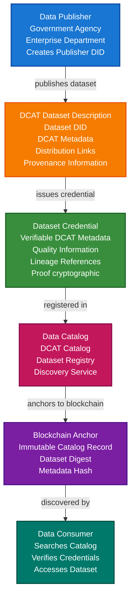

# Data Catalog & DCAT Scenario

This guide demonstrates how to build a verifiable data catalog system using VeriCore and DCAT (Data Catalog Vocabulary) for government agencies or enterprises. You'll learn how to create verifiable dataset descriptions, enable dataset discovery, track data lineage, and ensure data catalog integrity.

## What You'll Build

By the end of this tutorial, you'll have:

- ✅ Created DIDs for data catalog publishers and datasets
- ✅ Built DCAT-compliant dataset descriptions
- ✅ Issued verifiable credentials for dataset metadata
- ✅ Created data catalog with dataset discovery
- ✅ Tracked dataset lineage and provenance
- ✅ Anchored catalog records to blockchain
- ✅ Built complete verifiable data catalog system

## Big Picture & Significance

### The Data Catalog Challenge

Government agencies and enterprises generate vast amounts of data, but finding, understanding, and trusting this data is challenging. Data catalogs help organize and discover data, but they need to be verifiable and trustworthy.

**Industry Context**:
- **Market Size**: Global data catalog software market projected to reach $2.3 billion by 2027
- **Government Initiatives**: Data.gov, EU Open Data Portal, and similar initiatives worldwide
- **Enterprise Need**: Organizations struggle with data discovery and governance
- **Trust Requirements**: Need to verify dataset authenticity and lineage
- **Interoperability**: Standard formats enable cross-platform data discovery

**Why This Matters**:
1. **Data Discovery**: Enable users to find relevant datasets easily
2. **Data Trust**: Verify dataset authenticity and quality
3. **Data Lineage**: Track data origin and transformations
4. **Compliance**: Meet open data and data governance requirements
5. **Interoperability**: Standard DCAT format works across platforms
6. **Accountability**: Hold data publishers accountable for data quality

### The Data Catalog Problem

Traditional data catalogs face critical issues:
- **No Verification**: Can't verify dataset descriptions are accurate
- **No Lineage**: Missing information about data origin
- **No Standards**: Each system uses different formats
- **No Trust**: Can't verify data hasn't been tampered with
- **Silos**: Data catalogs are isolated from each other
- **No Provenance**: Missing information about data processing

## Value Proposition

### Problems Solved

1. **Verifiable Metadata**: Cryptographic proof of dataset descriptions
2. **Data Discovery**: Standard DCAT format enables discovery
3. **Data Lineage**: Complete tracking of data origin and transformations
4. **Interoperability**: DCAT standard works across all platforms
5. **Trust**: Verify dataset authenticity and quality
6. **Compliance**: Meet open data and governance requirements
7. **Accountability**: Hold publishers accountable for data quality

### Business Benefits

**For Government Agencies**:
- **Transparency**: Enable public access to government data
- **Compliance**: Meet open data regulations
- **Efficiency**: Reduce data discovery time
- **Trust**: Build public trust through verifiable catalogs

**For Enterprises**:
- **Data Governance**: Improve data management
- **Discovery**: Faster data discovery for analytics
- **Compliance**: Meet data governance requirements
- **Efficiency**: Reduce time spent finding data

**For Data Consumers**:
- **Discovery**: Easy dataset discovery
- **Trust**: Verify dataset authenticity
- **Quality**: Access verifiable quality information
- **Lineage**: Understand data origin

### ROI Considerations

- **Discovery Time**: 60-80% reduction in data discovery time
- **Compliance**: Automated compliance reduces costs by 50%
- **Trust**: Increased data trust enables new use cases
- **Interoperability**: Standard format reduces integration costs

## Understanding the Problem

Data catalog systems face several critical challenges:

1. **Data Discovery**: Finding relevant datasets is difficult
2. **Metadata Quality**: Dataset descriptions may be inaccurate
3. **Data Lineage**: Missing information about data origin
4. **Trust**: Can't verify dataset authenticity
5. **Standards**: Lack of standard formats
6. **Interoperability**: Different systems can't share catalogs
7. **Provenance**: Missing information about data processing

### Real-World Pain Points

**Example 1: Government Open Data Portal**
- Current: Datasets listed but no verification
- Problem: Can't verify dataset authenticity or quality
- Solution: Verifiable DCAT descriptions with credentials

**Example 2: Enterprise Data Lake**
- Current: Thousands of datasets, hard to find
- Problem: No standard format, no verification
- Solution: DCAT-compliant catalog with verifiable metadata

**Example 3: Cross-Agency Data Sharing**
- Current: Each agency has own catalog
- Problem: Can't share or verify across agencies
- Solution: Standard DCAT format with verifiable credentials

## How It Works: Data Catalog Flow



## Key Concepts

### DCAT Concepts

1. **Catalog**: Collection of dataset descriptions
2. **Dataset**: Collection of data
3. **Distribution**: Accessible form of a dataset
4. **DataService**: Service that provides data access
5. **CatalogRecord**: Record in a catalog

### Dataset Credential Types

1. **Dataset Description Credential**: Verifiable DCAT dataset description
2. **Distribution Credential**: Verifiable distribution information
3. **Quality Credential**: Dataset quality metrics
4. **Lineage Credential**: Data lineage information
5. **Access Credential**: Dataset access permissions

## Prerequisites

- Java 21+
- Kotlin 2.2.0+
- Gradle 8.5+
- Basic understanding of Kotlin and coroutines
- Familiarity with DCAT vocabulary (helpful but not required)

## Step 1: Add Dependencies

Add VeriCore dependencies to your `build.gradle.kts`:

```kotlin
dependencies {
    // Core VeriCore modules
    implementation("io.geoknoesis.vericore:vericore-core:1.0.0-SNAPSHOT")
    implementation("io.geoknoesis.vericore:vericore-json:1.0.0-SNAPSHOT")
    implementation("io.geoknoesis.vericore:vericore-kms:1.0.0-SNAPSHOT")
    implementation("io.geoknoesis.vericore:vericore-did:1.0.0-SNAPSHOT")
    implementation("io.geoknoesis.vericore:vericore-anchor:1.0.0-SNAPSHOT")
    
    // Test kit for in-memory implementations
    implementation("io.geoknoesis.vericore:vericore-testkit:1.0.0-SNAPSHOT")
    
    // Kotlinx Serialization
    implementation("org.jetbrains.kotlinx:kotlinx-serialization-json:1.6.0")
    
    // Coroutines
    implementation("org.jetbrains.kotlinx:kotlinx-coroutines-core:1.7.3")
}
```

## Step 2: Setup and Create Publisher DID

**Purpose**: Initialize the data catalog system and create DIDs for data publishers.

**Why This Matters**: Data publishers need verifiable identities to issue dataset credentials. Their DIDs provide persistent identifiers that enable trust in dataset descriptions.

**Rationale**:
- **Publisher DID**: Represents data publisher identity
- **Persistent Identity**: Survives across systems and time
- **Trust**: Consumers trust credentials from publisher DID
- **Verification**: Anyone can verify credentials came from publisher

```kotlin
import io.geoknoesis.vericore.testkit.did.DidKeyMockMethod
import io.geoknoesis.vericore.testkit.kms.InMemoryKeyManagementService
import io.geoknoesis.vericore.did.DidMethodRegistry
import kotlinx.coroutines.runBlocking

fun main() = runBlocking {
    println("=== Data Catalog & DCAT Scenario ===\n")
    
    // Step 1: Setup services
    println("Step 1: Setting up services...")
    
    // Separate KMS for different participants
    // Publishers, catalog managers, and consumers each have their own keys
    val publisherKms = InMemoryKeyManagementService() // For data publishers
    val catalogKms = InMemoryKeyManagementService()   // For catalog managers
    
    val didMethod = DidKeyMockMethod(publisherKms)
    val didRegistry = DidMethodRegistry().apply { register(didMethod) }
    
    println("Services initialized")
}
```

## Step 3: Create Publisher and Dataset DIDs

**Purpose**: Create DIDs for data publisher and dataset.

**Why This Matters**: Both publishers and datasets need verifiable identities. The dataset DID provides a persistent identifier that survives across systems and enables verifiable references.

**Rationale**:
- **Publisher DID**: Data publisher identity
- **Dataset DID**: Unique identifier for dataset
- **Relationship**: Publisher issues credentials about dataset
- **Verification**: Consumers can verify dataset credentials

```kotlin
import io.geoknoesis.vericore.credential.models.VerifiableCredential
import kotlinx.serialization.json.buildJsonObject
import kotlinx.serialization.json.put
import java.time.Instant

    // Step 2: Create publisher and dataset DIDs
    println("\nStep 2: Creating publisher and dataset DIDs...")
    
    // Publisher DID represents data publisher
    // Example: Government agency, enterprise department
    val publisherDid = didMethod.createDid(mapOf("algorithm" to "Ed25519"))
    println("Publisher DID: ${publisherDid.id}")
    
    // Dataset DID represents the dataset
    // This provides persistent identifier for the dataset
    val datasetDid = didMethod.createDid(mapOf("algorithm" to "Ed25519"))
    println("Dataset DID: ${datasetDid.id}")
    
    // Dataset information following DCAT vocabulary
    val datasetTitle = "National Population Census 2024"
    val datasetDescription = "Complete population census data for all regions"
    val datasetTheme = listOf("demographics", "population", "census")
    val datasetKeywords = listOf("population", "census", "demographics", "statistics")
```

## Step 4: Create DCAT Dataset Description

**Purpose**: Create DCAT-compliant dataset description.

**Why This Matters**: DCAT provides a standard vocabulary for describing datasets. This enables interoperability and makes datasets discoverable across platforms.

**Rationale**:
- **DCAT Compliance**: Follows W3C DCAT standard
- **Interoperability**: Works across all DCAT-compliant systems
- **Discovery**: Enables dataset discovery
- **Standardization**: Consistent dataset descriptions

```kotlin
    // Step 3: Create DCAT dataset description
    println("\nStep 3: Creating DCAT dataset description...")
    
    // DCAT dataset description following W3C DCAT vocabulary
    // This provides standard format for dataset metadata
    val dcatDataset = buildJsonObject {
        put("@context", "https://www.w3.org/ns/dcat#")
        put("@type", "dcat:Dataset")
        put("dct:identifier", datasetDid.id)
        put("dct:title", datasetTitle)
        put("dct:description", datasetDescription)
        put("dct:issued", Instant.now().toString())
        put("dct:modified", Instant.now().toString())
        put("dct:publisher", buildJsonObject {
            put("@type", "foaf:Organization")
            put("foaf:name", "National Statistics Office")
            put("dct:identifier", publisherDid.id)
        })
        put("dcat:theme", datasetTheme)
        put("dcat:keyword", datasetKeywords)
        put("dct:spatial", buildJsonObject {
            put("@type", "dct:Location")
            put("dct:title", "National Coverage")
        })
        put("dct:temporal", buildJsonObject {
            put("@type", "dct:PeriodOfTime")
            put("dct:startDate", "2024-01-01")
            put("dct:endDate", "2024-12-31")
        })
        put("dcat:distribution", listOf(
            buildJsonObject {
                put("@type", "dcat:Distribution")
                put("dct:title", "CSV Download")
                put("dcat:accessURL", "https://data.gov.example.com/datasets/census-2024.csv")
                put("dcat:mediaType", "text/csv")
                put("dcat:format", "CSV")
                put("dcat:byteSize", "10485760") // 10 MB
            },
            buildJsonObject {
                put("@type", "dcat:Distribution")
                put("dct:title", "API Access")
                put("dcat:accessURL", "https://api.data.gov.example.com/v1/census")
                put("dcat:mediaType", "application/json")
                put("dcat:format", "JSON")
            }
        ))
        put("dcat:landingPage", "https://data.gov.example.com/datasets/census-2024")
        put("dct:license", "https://creativecommons.org/licenses/by/4.0/")
        put("dct:language", "en")
    }
    
    println("DCAT dataset description created:")
    println("  - Title: $datasetTitle")
    println("  - Themes: ${datasetTheme.joinToString()}")
    println("  - Distributions: 2")
```

## Step 5: Create Dataset Credential

**Purpose**: Create verifiable credential for dataset description.

**Why This Matters**: The dataset credential provides cryptographic proof that the dataset description is authentic and issued by the publisher. This enables trust in dataset metadata.

**Rationale**:
- **Verification**: Cryptographic proof of authenticity
- **Publisher Attribution**: Proves publisher issued description
- **Metadata Integrity**: Ensures metadata hasn't been tampered with
- **Trust**: Builds trust in dataset descriptions

```kotlin
    // Step 4: Create dataset credential
    println("\nStep 4: Creating dataset credential...")
    
    // Compute digest of DCAT dataset description
    // This provides integrity check for the dataset metadata
    val datasetDigest = io.geoknoesis.vericore.json.DigestUtils.sha256DigestMultibase(
        io.geoknoesis.vericore.json.Json.encodeToJsonElement(dcatDataset)
    )
    
    // Dataset credential wraps DCAT description with verifiable proof
    val datasetCredential = VerifiableCredential(
        id = "https://catalog.example.com/datasets/${datasetDid.id.substringAfterLast(":")}",
        type = listOf("VerifiableCredential", "DatasetCredential", "DCATCredential"),
        issuer = publisherDid.id, // Publisher issues credential about dataset
        credentialSubject = buildJsonObject {
            put("id", datasetDid.id)
            put("dataset", buildJsonObject {
                put("dcat", dcatDataset)
                put("datasetDigest", datasetDigest)
                put("publisherDid", publisherDid.id)
                put("catalogId", "https://catalog.example.com")
            })
        },
        issuanceDate = Instant.now().toString(),
        expirationDate = null
    )
    
    println("Dataset credential created:")
    println("  - Dataset: $datasetTitle")
    println("  - Publisher: ${publisherDid.id}")
    println("  - Digest: $datasetDigest")
```

## Step 6: Issue Dataset Credential with Proof

**Purpose**: Cryptographically sign dataset credential to make it verifiable.

**Why This Matters**: Cryptographic proof ensures dataset credentials are authentic and issued by the publisher. This is critical for trust - consumers need to verify dataset descriptions are legitimate.

**Rationale**:
- **Key Generation**: Generate publisher's signing key
- **Proof Generation**: Create cryptographic proof
- **Credential Issuance**: Sign credential with publisher's key
- **Verification**: Anyone can verify credential authenticity

```kotlin
import io.geoknoesis.vericore.credential.issuer.CredentialIssuer
import io.geoknoesis.vericore.credential.proof.Ed25519ProofGenerator
import io.geoknoesis.vericore.credential.proof.ProofGeneratorRegistry
import io.geoknoesis.vericore.credential.CredentialIssuanceOptions

    // Step 5: Issue dataset credential with proof
    println("\nStep 5: Issuing dataset credential...")
    
    // Generate publisher's signing key
    val publisherKey = publisherKms.generateKey("Ed25519")
    
    // Create proof generator for publisher
    val publisherProofGenerator = Ed25519ProofGenerator(
        signer = { data, keyId -> publisherKms.sign(keyId, data) },
        getPublicKeyId = { keyId -> publisherKey.id }
    )
    ProofGeneratorRegistry.register(publisherProofGenerator)
    
    // Create credential issuer
    val publisherIssuer = CredentialIssuer(
        proofGenerator = publisherProofGenerator,
        didResolver = CredentialDidResolver { did ->
            didRegistry.resolve(did).toCredentialDidResolution()
        }
    )
    
    // Issue dataset credential
    val issuedDatasetCredential = publisherIssuer.issue(
        credential = datasetCredential,
        issuerDid = publisherDid.id,
        keyId = publisherKey.id,
        options = CredentialIssuanceOptions(proofType = "Ed25519Signature2020")
    )
    
    println("Dataset credential issued:")
    println("  - Proof: ${issuedDatasetCredential.proof != null}")
    println("  - Issuer: ${publisherDid.id}")
```

## Step 7: Create Data Catalog

**Purpose**: Create DCAT-compliant data catalog containing dataset descriptions.

**Why This Matters**: The data catalog provides a central registry of datasets. DCAT compliance enables interoperability and discovery across platforms.

**Rationale**:
- **Catalog Structure**: Organizes dataset descriptions
- **DCAT Compliance**: Follows W3C DCAT standard
- **Discovery**: Enables dataset discovery
- **Interoperability**: Works across all DCAT systems

```kotlin
    // Step 6: Create data catalog
    println("\nStep 6: Creating data catalog...")
    
    // Catalog manager DID
    val catalogManagerDid = didMethod.createDid(mapOf("algorithm" to "Ed25519"))
    
    // DCAT catalog description
    val dcatCatalog = buildJsonObject {
        put("@context", "https://www.w3.org/ns/dcat#")
        put("@type", "dcat:Catalog")
        put("dct:title", "National Data Catalog")
        put("dct:description", "Central catalog of government datasets")
        put("dct:issued", Instant.now().toString())
        put("dct:modified", Instant.now().toString())
        put("dct:publisher", buildJsonObject {
            put("@type", "foaf:Organization")
            put("foaf:name", "Data Catalog Authority")
            put("dct:identifier", catalogManagerDid.id)
        })
        put("dcat:dataset", listOf(
            buildJsonObject {
                put("@id", datasetDid.id)
                put("dct:title", datasetTitle)
            }
        ))
        put("dcat:themeTaxonomy", buildJsonObject {
            put("@type", "skos:ConceptScheme")
            put("dct:title", "Dataset Themes")
        })
    }
    
    println("DCAT catalog created:")
    println("  - Title: National Data Catalog")
    println("  - Datasets: 1")
    println("  - Manager: ${catalogManagerDid.id}")
```

## Step 8: Create Catalog Record Credential

**Purpose**: Create credential recording dataset registration in catalog.

**Why This Matters**: Catalog record credentials provide verifiable proof that datasets are registered in the catalog. This enables trust in catalog contents.

**Rationale**:
- **Registration Proof**: Verifies dataset is in catalog
- **Catalog Integrity**: Ensures catalog hasn't been tampered with
- **Verification**: Consumers can verify catalog records
- **Trust**: Builds trust in catalog contents

```kotlin
    // Step 7: Create catalog record credential
    println("\nStep 7: Creating catalog record credential...")
    
    // Catalog record credential proves dataset is registered
    val catalogRecordCredential = VerifiableCredential(
        type = listOf("VerifiableCredential", "CatalogRecordCredential", "DCATCredential"),
        issuer = catalogManagerDid.id, // Catalog manager issues record credential
        credentialSubject = buildJsonObject {
            put("catalogRecord", buildJsonObject {
                put("catalogId", "https://catalog.example.com")
                put("datasetDid", datasetDid.id)
                put("datasetTitle", datasetTitle)
                put("registrationDate", Instant.now().toString())
                put("status", "published")
                put("catalogDigest", io.geoknoesis.vericore.json.DigestUtils.sha256DigestMultibase(
                    io.geoknoesis.vericore.json.Json.encodeToJsonElement(dcatCatalog)
                ))
            })
        },
        issuanceDate = Instant.now().toString(),
        expirationDate = null
    )
    
    // Issue catalog record credential
    val catalogKey = catalogKms.generateKey("Ed25519")
    val catalogProofGenerator = Ed25519ProofGenerator(
        signer = { data, keyId -> catalogKms.sign(keyId, data) },
        getPublicKeyId = { keyId -> catalogKey.id }
    )
    ProofGeneratorRegistry.register(catalogProofGenerator)
    
    val catalogIssuer = CredentialIssuer(
        proofGenerator = catalogProofGenerator,
        didResolver = CredentialDidResolver { did ->
            didRegistry.resolve(did).toCredentialDidResolution()
        }
    )
    
    val issuedCatalogRecord = catalogIssuer.issue(
        credential = catalogRecordCredential,
        issuerDid = catalogManagerDid.id,
        keyId = catalogKey.id,
        options = CredentialIssuanceOptions(proofType = "Ed25519Signature2020")
    )
    
    println("Catalog record credential created:")
    println("  - Dataset: $datasetTitle")
    println("  - Status: published")
    println("  - Catalog: https://catalog.example.com")
```

## Step 9: Verify Dataset Credentials

**Purpose**: Verify dataset credentials are authentic and valid.

**Why This Matters**: Verification ensures dataset credentials are legitimate and haven't been tampered with. This is critical for trust - consumers need to verify dataset descriptions before using them.

**Rationale**:
- **Credential Verification**: Verify credential authenticity
- **Publisher Verification**: Verify publisher is legitimate
- **Revocation Check**: Check if credential is revoked
- **Trust**: Builds trust in dataset descriptions

```kotlin
import io.geoknoesis.vericore.credential.verifier.CredentialVerifier
import io.geoknoesis.vericore.credential.CredentialVerificationOptions

    // Step 8: Verify dataset credentials
    println("\nStep 8: Verifying dataset credentials...")
    
    val verifier = CredentialVerifier(
        didResolver = CredentialDidResolver { did ->
            didRegistry.resolve(did).toCredentialDidResolution()
        }
    )
    
    // Verify dataset credential
    val datasetVerification = verifier.verify(
        credential = issuedDatasetCredential,
        options = CredentialVerificationOptions(
            checkRevocation = true,
            checkExpiration = false
        )
    )
    
    if (datasetVerification.valid) {
        println("✅ Dataset credential verified")
        println("  - Publisher: ${publisherDid.id}")
        println("  - Dataset: $datasetTitle")
    } else {
        println("❌ Dataset credential verification failed:")
        datasetVerification.errors.forEach { println("  - $it") }
    }
    
    // Verify catalog record credential
    val catalogVerification = verifier.verify(
        credential = issuedCatalogRecord,
        options = CredentialVerificationOptions(
            checkRevocation = true,
            checkExpiration = false
        )
    )
    
    if (catalogVerification.valid) {
        println("✅ Catalog record credential verified")
        println("  - Catalog: https://catalog.example.com")
        println("  - Dataset: $datasetTitle")
    } else {
        println("❌ Catalog record verification failed:")
        catalogVerification.errors.forEach { println("  - $it") }
    }
```

## Step 10: Anchor Catalog to Blockchain

**Purpose**: Create immutable record of catalog and dataset registration.

**Why This Matters**: Blockchain anchoring provides permanent, tamper-proof record of catalog contents. This enables long-term verification and prevents catalog tampering.

**Rationale**:
- **Immutability**: Cannot be tampered with
- **Audit Trail**: Permanent record
- **Verification**: Anyone can verify catalog contents
- **Integrity**: Prevents catalog tampering

```kotlin
import io.geoknoesis.vericore.testkit.anchor.InMemoryBlockchainAnchorClient
import io.geoknoesis.vericore.anchor.BlockchainAnchorRegistry
import io.geoknoesis.vericore.anchor.anchorTyped
import kotlinx.serialization.Serializable
import kotlinx.serialization.json.Json

@Serializable
data class CatalogRecord(
    val catalogId: String,
    val datasetDid: String,
    val datasetTitle: String,
    val publisherDid: String,
    val catalogDigest: String,
    val timestamp: String
)

    // Step 9: Anchor catalog to blockchain
    println("\nStep 9: Anchoring catalog to blockchain...")
    
    val anchorClient = InMemoryBlockchainAnchorClient("eip155:1", emptyMap())
    val blockchainRegistry = BlockchainAnchorRegistry().apply {
        register("eip155:1", anchorClient)
    }
    
    // Create catalog record
    val catalogDigest = io.geoknoesis.vericore.json.DigestUtils.sha256DigestMultibase(
        Json.encodeToJsonElement(
            VerifiableCredential.serializer(),
            issuedCatalogRecord
        )
    )
    
    val catalogRecord = CatalogRecord(
        catalogId = "https://catalog.example.com",
        datasetDid = datasetDid.id,
        datasetTitle = datasetTitle,
        publisherDid = publisherDid.id,
        catalogDigest = catalogDigest,
        timestamp = Instant.now().toString()
    )
    
    // Anchor to blockchain
    val anchorResult = blockchainRegistry.anchorTyped(
        value = catalogRecord,
        serializer = CatalogRecord.serializer(),
        targetChainId = "eip155:1"
    )
    
    println("Catalog anchored to blockchain:")
    println("  - Transaction hash: ${anchorResult.ref.txHash}")
    println("  - Provides immutable catalog record")
    println("  - Enables long-term verification")
```

## Step 11: Dataset Discovery

**Purpose**: Enable dataset discovery through catalog search.

**Why This Matters**: Dataset discovery enables users to find relevant datasets. DCAT compliance ensures datasets can be discovered across platforms.

**Rationale**:
- **Search Functionality**: Enable dataset search
- **DCAT Compliance**: Standard format enables discovery
- **Filtering**: Filter datasets by theme, keyword, etc.
- **Access**: Provide access to dataset information

```kotlin
    // Step 10: Dataset discovery
    println("\nStep 10: Dataset discovery...")
    
    // Function to search catalog by theme
    fun searchCatalogByTheme(
        theme: String,
        datasetCredential: VerifiableCredential
    ): Boolean {
        val dataset = datasetCredential.credentialSubject.jsonObject["dataset"]?.jsonObject
            ?.get("dcat")?.jsonObject
            ?: return false
        
        val themes = dataset["dcat:theme"]?.jsonArray
            ?.map { it.jsonPrimitive.content }
            ?: return false
        
        return themes.contains(theme)
    }
    
    // Search for datasets by theme
    val searchTheme = "demographics"
    val found = searchCatalogByTheme(searchTheme, issuedDatasetCredential)
    
    if (found) {
        println("✅ Dataset found for theme: $searchTheme")
        println("  - Title: $datasetTitle")
        println("  - Dataset DID: ${datasetDid.id}")
    } else {
        println("❌ No dataset found for theme: $searchTheme")
    }
    
    // Function to get dataset distribution information
    fun getDatasetDistributions(
        datasetCredential: VerifiableCredential
    ): List<Map<String, String>> {
        val dataset = datasetCredential.credentialSubject.jsonObject["dataset"]?.jsonObject
            ?.get("dcat")?.jsonObject
            ?: return emptyList()
        
        val distributions = dataset["dcat:distribution"]?.jsonArray
            ?: return emptyList()
        
        return distributions.map { dist ->
            val distObj = dist.jsonObject
            mapOf(
                "title" to (distObj["dct:title"]?.jsonPrimitive?.content ?: ""),
                "format" to (distObj["dcat:format"]?.jsonPrimitive?.content ?: ""),
                "accessURL" to (distObj["dcat:accessURL"]?.jsonPrimitive?.content ?: "")
            )
        }
    }
    
    // Get distribution information
    val distributions = getDatasetDistributions(issuedDatasetCredential)
    println("\nDataset distributions:")
    distributions.forEach { dist ->
        println("  - ${dist["title"]}: ${dist["format"]} (${dist["accessURL"]})")
    }
}
```

## Advanced Features

### Multi-Catalog Federation

Enable federation across multiple catalogs:

```kotlin
fun federateCatalogs(
    catalog1Did: String,
    catalog2Did: String,
    datasetDid: String
): VerifiableCredential {
    return VerifiableCredential(
        type = listOf("VerifiableCredential", "FederationCredential"),
        issuer = catalog1Did,
        credentialSubject = buildJsonObject {
            put("federation", buildJsonObject {
                put("sourceCatalog", catalog1Did)
                put("targetCatalog", catalog2Did)
                put("datasetDid", datasetDid)
                put("federationDate", Instant.now().toString())
            })
        },
        issuanceDate = Instant.now().toString()
    )
}
```

### Dataset Quality Metrics

Track dataset quality:

```kotlin
fun createQualityCredential(
    datasetDid: String,
    qualityMetrics: Map<String, Any>
): VerifiableCredential {
    return VerifiableCredential(
        type = listOf("VerifiableCredential", "QualityCredential"),
        issuer = publisherDid.id,
        credentialSubject = buildJsonObject {
            put("id", datasetDid)
            put("quality", buildJsonObject {
                qualityMetrics.forEach { (key, value) ->
                    put(key, value.toString())
                }
            })
        },
        issuanceDate = Instant.now().toString()
    )
}
```

## Real-World Use Cases

### 1. Government Open Data Portal

**Scenario**: National government publishes datasets for public access.

**Implementation**: Use DCAT-compliant catalog with verifiable dataset credentials.

### 2. Enterprise Data Lake Catalog

**Scenario**: Enterprise catalogs datasets in data lake.

**Implementation**: DCAT catalog with verifiable metadata for all datasets.

### 3. Cross-Agency Data Sharing

**Scenario**: Multiple agencies share datasets through federated catalog.

**Implementation**: Federated DCAT catalogs with verifiable credentials.

## Benefits

1. **Data Discovery**: Easy dataset discovery with DCAT
2. **Verifiable Metadata**: Cryptographic proof of dataset descriptions
3. **Interoperability**: Standard DCAT format works across platforms
4. **Trust**: Verify dataset authenticity and quality
5. **Compliance**: Meet open data and governance requirements
6. **Accountability**: Hold publishers accountable for data quality
7. **Lineage**: Track data origin and transformations
8. **Accessibility**: Standard format enables accessibility
9. **Federation**: Enable cross-catalog federation
10. **Quality**: Track and verify dataset quality

## Best Practices

1. **DCAT Compliance**: Follow W3C DCAT vocabulary
2. **Verification**: Always verify dataset credentials
3. **Metadata Quality**: Ensure accurate dataset descriptions
4. **Lineage Tracking**: Track data origin and transformations
5. **Blockchain Anchoring**: Anchor critical catalog records
6. **Error Handling**: Handle verification failures gracefully
7. **Documentation**: Document dataset descriptions clearly
8. **Access Control**: Implement appropriate access controls
9. **Quality Metrics**: Track dataset quality
10. **Federation**: Enable cross-catalog federation

## Next Steps

- Learn about [Earth Observation Scenario](earth-observation-scenario.md) for related data integrity concepts
- Explore [Digital Workflow & Provenance Scenario](digital-workflow-provenance-scenario.md) for data lineage
- Check out [Government Digital Identity Scenario](government-digital-identity-scenario.md) for related concepts
- Review [Core Concepts: Blockchain Anchoring](../core-concepts/blockchain-anchoring.md) for anchoring details


