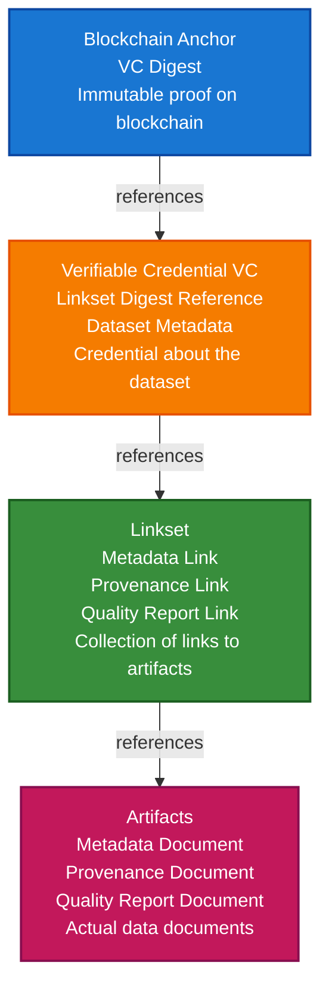

# Earth Observation Scenario

This guide walks you through building a complete Earth Observation (EO) data integrity verification system using VeriCore. You'll learn how to create DIDs, compute digests, build integrity chains, and anchor data to blockchains.

## What You'll Build

By the end of this tutorial, you'll have:

- ✅ Created a DID for a data provider
- ✅ Generated metadata, provenance, and quality reports for EO datasets
- ✅ Built a Linkset connecting all artifacts
- ✅ Created a Verifiable Credential referencing the Linkset
- ✅ Anchored the VC digest to a blockchain
- ✅ Verified the complete integrity chain

## Big Picture & Significance

### The Earth Observation Data Challenge

Earth Observation data powers critical applications from climate monitoring to disaster response. However, ensuring data integrity, authenticity, and provenance is a fundamental challenge that affects trust, compliance, and decision-making.

**Industry Context**:
- **Market Size**: Global EO market projected to reach $11.3 billion by 2026 (CAGR 9.8%)
- **Data Volume**: Petabytes of satellite imagery generated daily
- **Critical Applications**: Climate monitoring, disaster management, agriculture, urban planning
- **Trust Requirements**: Data used for policy decisions, scientific research, and emergency response
- **Regulatory Pressure**: Increasing requirements for data provenance and quality assurance

**Why This Matters**:
1. **Data Trust**: Verify EO data hasn't been tampered with or corrupted
2. **Provenance**: Track data lineage from satellite to end user
3. **Quality Assurance**: Ensure data meets quality standards for critical applications
4. **Compliance**: Meet regulatory requirements for data integrity
5. **Reproducibility**: Enable scientific reproducibility with verifiable data
6. **Accountability**: Hold data providers accountable for data quality

### The Data Integrity Problem

Traditional EO data systems struggle with integrity because:
- **No Verification**: Can't verify data hasn't been tampered with
- **No Provenance**: Missing information about data origin and processing
- **No Quality Tracking**: Can't verify data quality claims
- **Centralized Trust**: Reliance on single authorities creates bottlenecks
- **No Interoperability**: Different systems can't verify each other's data

## Value Proposition

### Problems Solved

1. **Data Integrity**: Cryptographic proof that data hasn't been tampered with
2. **Provenance Tracking**: Complete lineage from satellite to end user
3. **Quality Verification**: Verifiable quality reports and metadata
4. **Interoperability**: Standard format works across all EO systems
5. **Compliance**: Automated audit trails for regulatory requirements
6. **Trust**: Build trust in EO data through verifiable credentials
7. **Accountability**: Hold data providers accountable for data quality

### Business Benefits

**For Data Providers**:
- **Trust**: Build trust with data consumers
- **Compliance**: Meet regulatory requirements
- **Differentiation**: Stand out with verifiable data quality
- **Accountability**: Clear responsibility tracking

**For Data Consumers**:
- **Confidence**: Verify data integrity before use
- **Quality**: Access verifiable quality reports
- **Provenance**: Understand data lineage
- **Compliance**: Meet data quality requirements

**For Regulators**:
- **Audit Trails**: Complete data lineage records
- **Verification**: Verify data quality claims
- **Transparency**: Understand data processing

### ROI Considerations

- **Trust**: Increased data trust enables new use cases
- **Compliance**: Automated compliance reduces costs by 50%
- **Quality**: Reduced errors save time and money
- **Interoperability**: Standard format reduces integration costs

## Understanding the Problem

Earth Observation data (like satellite imagery) needs to be trustworthy. When someone receives EO data, they need to verify:

1. **Who created it?** - Identity of the data provider
2. **Is it authentic?** - Has it been tampered with?
3. **What's its quality?** - Is the data reliable?
4. **Where did it come from?** - What's the data's provenance?

VeriCore solves this by creating a **verifiable integrity chain** that links all this information together and anchors it to a blockchain for tamper-proof verification.

## How It Works: The Integrity Chain

Think of the integrity chain like a Russian nesting doll, where each layer protects and verifies the next:



**Key Concept**: Each level contains a **digest** (cryptographic hash) of the level below it. If any data is tampered with, the digest won't match, and verification will fail.

## Prerequisites

- Java 21+
- Kotlin 2.2.0+
- Gradle 8.5+
- Basic understanding of Kotlin and coroutines

**Note**: Don't worry if you're new to DIDs, Verifiable Credentials, or blockchain! This guide explains everything step-by-step.

## Step 1: Add Dependencies

Add VeriCore dependencies to your `build.gradle.kts`:

```kotlin
dependencies {
    // Core VeriCore modules
    implementation("io.geoknoesis.vericore:vericore-core:1.0.0-SNAPSHOT")
    implementation("io.geoknoesis.vericore:vericore-json:1.0.0-SNAPSHOT")
    implementation("io.geoknoesis.vericore:vericore-kms:1.0.0-SNAPSHOT")
    implementation("io.geoknoesis.vericore:vericore-did:1.0.0-SNAPSHOT")
    implementation("io.geoknoesis.vericore:vericore-anchor:1.0.0-SNAPSHOT")
    
    // Test kit for in-memory implementations
    implementation("io.geoknoesis.vericore:vericore-testkit:1.0.0-SNAPSHOT")
    
    // Optional: Algorand adapter for real blockchain anchoring
    implementation("io.geoknoesis.vericore:vericore-algorand:1.0.0-SNAPSHOT")
    
    // Kotlinx Serialization
    implementation("org.jetbrains.kotlinx:kotlinx-serialization-json:1.6.0")
    
    // Coroutines
    implementation("org.jetbrains.kotlinx:kotlinx-coroutines-core:1.7.3")
}
```

## Step 2: Complete Example

Here's a complete example demonstrating the EO integrity workflow:

```kotlin
package com.example.eo

import io.geoknoesis.vericore.anchor.*
import io.geoknoesis.vericore.did.*
import io.geoknoesis.vericore.json.DigestUtils
import io.geoknoesis.vericore.testkit.anchor.InMemoryBlockchainAnchorClient
import io.geoknoesis.vericore.testkit.did.DidKeyMockMethod
import io.geoknoesis.vericore.testkit.integrity.IntegrityVerifier
import io.geoknoesis.vericore.testkit.integrity.TestDataBuilders
import io.geoknoesis.vericore.testkit.kms.InMemoryKeyManagementService
import kotlinx.coroutines.runBlocking
import kotlinx.serialization.json.*

/**
 * Earth Observation (EO) Data Integrity Example
 * 
 * This example demonstrates how to:
 * 1. Create a DID for a data provider
 * 2. Generate metadata, provenance, and quality reports
 * 3. Create a Linkset connecting all artifacts
 * 4. Issue a Verifiable Credential referencing the Linkset
 * 5. Anchor the VC digest to a blockchain
 * 6. Verify the complete integrity chain
 */
fun main() = runBlocking {
    println("=== Earth Observation Data Integrity Workflow ===\n")
    
    // ============================================================
    // Step 1: Setup Services
    // ============================================================
    println("Step 1: Setting up services...")
    
    // Key Management Service (KMS): Manages cryptographic keys
    // Think of it as a secure keychain for your application
    val kms = InMemoryKeyManagementService()
    
    // DID Method: Defines how to create and resolve DIDs
    // We're using did:key, which is simple and self-contained
    // (no external registration needed - perfect for testing)
    val didMethod = DidKeyMockMethod(kms)
    
    // Blockchain Client: Handles anchoring data to blockchains
    // We're using an in-memory client for testing (no real blockchain needed)
    // In production, you'd use AlgorandBlockchainAnchorClient for real anchoring
    val chainId = "algorand:testnet"
    val anchorClient = InMemoryBlockchainAnchorClient(chainId)
    
    // Register services so VeriCore can find them
    // This is like adding tools to your toolbox
    val didRegistry = DidMethodRegistry().apply { register(didMethod) }
    val blockchainRegistry = BlockchainAnchorRegistry().apply {
        register(chainId, anchorClient)
    }
    
    println("✓ Services configured")
    println("  - Key Management: In-memory")
    println("  - DID Method: did:key")
    println("  - Blockchain: In-memory (testnet)\n")
    
    // ============================================================
    // Step 2: Create DID for Data Provider
    // ============================================================
    println("Step 2: Creating DID for data provider...")
    
    // A DID (Decentralized Identifier) is like a digital identity card
    // It uniquely identifies the data provider without relying on a central authority
    // Example: did:key:zABC123... (self-contained, no external registration)
    
    // Create a DID using Ed25519 algorithm (modern, efficient cryptographic algorithm)
    val issuerDoc = didMethod.createDid(mapOf("algorithm" to "Ed25519"))
    val issuerDid = issuerDoc.id
    
    // The DID Document contains:
    // - The DID itself (unique identifier)
    // - Verification methods (public keys for signing/verification)
    // - Authentication capabilities
    
    println("✓ Created issuer DID: $issuerDid")
    println("  Verification Methods: ${issuerDoc.verificationMethod.size}")
    println("  This DID represents the data provider's identity\n")
    
    // ============================================================
    // Step 3: Create Artifacts (Metadata, Provenance, Quality)
    // ============================================================
    println("Step 3: Creating EO dataset artifacts...")
    
    // Artifacts are the actual data documents that describe the EO dataset.
    // Each artifact gets a cryptographic digest (hash) that acts as a fingerprint.
    // If the artifact changes, the digest changes - making tampering detectable.
    
    // 1. Metadata Artifact: Describes WHAT the data is
    //    - Title, description, spatial/temporal coverage
    //    - Follows ISO 19115 / DCAT standards for geospatial metadata
    val (metadataArtifact, metadataDigest) = TestDataBuilders.createMetadataArtifact(
        id = "metadata-1",
        title = "Sentinel-2 L2A Dataset",
        description = "Atmospherically corrected Sentinel-2 Level 2A product covering area XYZ"
    )
    // metadataDigest is a hash like "uABC123..." - a unique fingerprint of the metadata
    
    // 2. Provenance Artifact: Describes WHERE the data came from
    //    - Who collected it, when, how
    //    - Follows PROV (Provenance) standard
    val (provenanceArtifact, provenanceDigest) = TestDataBuilders.createProvenanceArtifact(
        id = "provenance-1",
        activity = "EO Data Collection",
        agent = issuerDid  // Links back to the DID we created in Step 2
    )
    // provenanceDigest is a hash of the provenance information
    
    // 3. Quality Report Artifact: Describes HOW GOOD the data is
    //    - Quality scores, metrics, assessments
    //    - Follows DQV (Data Quality Vocabulary) standard
    val (qualityArtifact, qualityDigest) = TestDataBuilders.createQualityReportArtifact(
        id = "quality-1",
        qualityScore = 0.95,  // 95% quality score
        metrics = mapOf(
            "completeness" to 0.98,      // 98% complete
            "accuracy" to 0.92,           // 92% accurate
            "temporalConsistency" to 0.96 // 96% temporally consistent
        )
    )
    // qualityDigest is a hash of the quality information
    
    println("✓ Created artifacts:")
    println("  - Metadata: $metadataDigest")
    println("  - Provenance: $provenanceDigest")
    println("  - Quality Report: $qualityDigest")
    println("  Each artifact has a unique digest (fingerprint) that proves its integrity\n")
    
    // ============================================================
    // Step 4: Create Linkset
    // ============================================================
    println("Step 4: Creating Linkset...")
    
    // A Linkset is like a table of contents that links all artifacts together.
    // It contains references (links) to each artifact along with its digest.
    // This allows us to verify that all artifacts are present and untampered.
    
    // Create links to each artifact
    // Each link contains:
    // - href: Reference to the artifact (like a filename or URL)
    // - digestMultibase: The digest (fingerprint) of the artifact
    // - type: What kind of artifact it is
    val links = listOf(
        TestDataBuilders.buildLink(
            href = "metadata-1",
            digestMultibase = metadataDigest,  // Reference to metadata digest from Step 3
            type = "Metadata"
        ),
        TestDataBuilders.buildLink(
            href = "provenance-1",
            digestMultibase = provenanceDigest,  // Reference to provenance digest
            type = "Provenance"
        ),
        TestDataBuilders.buildLink(
            href = "quality-1",
            digestMultibase = qualityDigest,  // Reference to quality digest
            type = "QualityReport"
        )
    )
    
    // IMPORTANT: We compute the Linkset digest BEFORE adding it to the Linkset
    // This avoids a circular dependency (digest depends on Linkset, but Linkset contains digest)
    // We build the Linkset without the digest field, compute the digest, then add it
    val linksetWithoutDigest = buildJsonObject {
        put("@context", "https://www.w3.org/ns/json-ld#")  // JSON-LD context
        put("links", Json.encodeToJsonElement(links))
    }
    
    // Compute the digest of the Linkset (this becomes the Linkset's fingerprint)
    val linksetDigest = DigestUtils.sha256DigestMultibase(linksetWithoutDigest)
    
    // Now build the complete Linkset WITH the digest
    val linksetWithDigest = TestDataBuilders.buildLinkset(
        digestMultibase = linksetDigest,
        links = links
    )
    
    println("✓ Created Linkset:")
    println("  - Digest: $linksetDigest")
    println("  - Links: ${links.size}")
    println("  The Linkset connects all artifacts and has its own digest\n")
    
    // ============================================================
    // Step 5: Create Verifiable Credential
    // ============================================================
    println("Step 5: Creating Verifiable Credential...")
    
    // A Verifiable Credential (VC) is like a digital certificate that attests to something.
    // In our case, it attests that:
    // - A specific EO dataset exists
    // - It has associated metadata, provenance, and quality reports
    // - These are linked together via the Linkset
    
    // The "subject" is what the credential is about - our EO dataset
    val subject = buildJsonObject {
        put("id", "eo-dataset-sentinel2-l2a-xyz")
        put("type", "EarthObservationDataset")
        put("title", "Sentinel-2 L2A Dataset")
        put("spatialCoverage", buildJsonObject {
            put("type", "BoundingBox")
            put("coordinates", buildJsonArray {
                add(buildJsonArray { add(10.0); add(45.0) }) // Southwest corner (lon, lat)
                add(buildJsonArray { add(11.0); add(46.0) }) // Northeast corner (lon, lat)
            })
        })
        put("temporalCoverage", buildJsonObject {
            put("start", "2024-01-15T10:00:00Z")
            put("end", "2024-01-15T10:20:00Z")
        })
    }
    
    // IMPORTANT: We compute the VC digest BEFORE adding it to the VC
    // Similar to the Linkset, we avoid circular dependency by computing digest first
    // Use a fixed timestamp for consistent digest computation (in real apps, use actual timestamp)
    val fixedTimestamp = "2024-01-15T10:30:00Z"
    val vcWithoutDigest = buildJsonObject {
        put("id", "vc-eo-sentinel2-l2a-xyz")
        put("type", buildJsonArray { add("VerifiableCredential") })
        put("issuer", issuerDid)  // Who issued this credential (the DID from Step 2)
        put("credentialSubject", subject)  // What it's about (the EO dataset)
        put("linksetDigest", linksetDigest)  // Reference to the Linkset digest from Step 4
        put("issued", fixedTimestamp)  // When it was issued
    }
    
    // Compute the digest of the VC (this becomes the VC's fingerprint)
    val vcDigest = DigestUtils.sha256DigestMultibase(vcWithoutDigest)
    
    // Now build the complete VC WITH the digest
    val vcWithDigest = buildJsonObject {
        put("id", "vc-eo-sentinel2-l2a-xyz")
        put("type", buildJsonArray { add("VerifiableCredential") })
        put("issuer", issuerDid)
        put("credentialSubject", subject)
        put("digestMultibase", vcDigest)  // The VC's own digest
        put("linksetDigest", linksetDigest)  // Reference to Linkset (for verification)
        put("issued", fixedTimestamp)
    }
    
    println("✓ Created Verifiable Credential:")
    println("  - VC ID: vc-eo-sentinel2-l2a-xyz")
    println("  - VC Digest: $vcDigest")
    println("  - Linkset Digest Reference: $linksetDigest")
    println("  The VC attests to the dataset and references the Linkset\n")
    
    // ============================================================
    // Step 6: Anchor VC Digest to Blockchain
    // ============================================================
    println("Step 6: Anchoring VC digest to blockchain...")
    
    // Blockchain anchoring provides tamper-proof, timestamped proof that the VC existed
    // at a specific point in time. We anchor the VC digest (not the full VC) to save space
    // and costs on the blockchain.
    
    // Create a payload containing the essential information
    val digestPayload = buildJsonObject {
        put("vcId", "vc-eo-sentinel2-l2a-xyz")  // Which VC this is
        put("vcDigest", vcDigest)  // The fingerprint of the VC (from Step 5)
        put("issuer", issuerDid)  // Who issued it
        put("timestamp", fixedTimestamp)  // When it was anchored
    }
    
    // Write the payload to the blockchain
    // This creates an immutable record that proves the VC existed at this time
    val anchorResult = anchorClient.writePayload(digestPayload)
    
    // The anchor result contains:
    // - ref: A reference to find this data on the blockchain
    // - payload: What was stored
    // - timestamp: When it was stored
    
    println("✓ Anchored to blockchain:")
    println("  - Chain ID: ${anchorResult.ref.chainId}")
    println("  - Transaction Hash: ${anchorResult.ref.txHash}")
    println("  - Timestamp: ${anchorResult.timestamp}")
    println("  The VC digest is now immutably stored on the blockchain\n")
    
    // ============================================================
    // Step 7: Verify Integrity Chain
    // ============================================================
    println("Step 7: Verifying integrity chain...")
    
    // Verification checks the entire integrity chain from bottom to top:
    // 1. Verify each artifact's digest matches its link in the Linkset
    // 2. Verify the Linkset digest matches the reference in the VC
    // 3. Verify the VC digest matches what's stored on the blockchain
    
    // Create a map of artifacts (keyed by their IDs for easy lookup)
    val artifacts = mapOf(
        "metadata-1" to metadataArtifact,
        "provenance-1" to provenanceArtifact,
        "quality-1" to qualityArtifact
    )
    
    // Perform the complete integrity verification
    // This checks:
    // - Blockchain anchor matches VC digest
    // - VC references Linkset correctly
    // - Linkset references artifacts correctly
    // - Each artifact's content matches its digest
    val verificationResult = IntegrityVerifier.verifyIntegrityChain(
        vc = vcWithDigest,
        linkset = linksetWithDigest,
        artifacts = artifacts,
        anchorRef = anchorResult.ref  // Reference to blockchain anchor from Step 6
    )
    
    // Display verification results
    if (verificationResult.valid) {
        println("✓ Integrity chain verification PASSED!")
        println("\nVerification Steps:")
        verificationResult.steps.forEachIndexed { index, step ->
            println("  ${index + 1}. ${step.name}: ${if (step.valid) "✓ PASS" else "✗ FAIL"}")
            if (step.digest != null) {
                println("     Digest: ${step.digest}")
            }
        }
        println("\nAll checks passed! The data integrity chain is valid.")
    } else {
        println("✗ Integrity chain verification FAILED!")
        verificationResult.steps.forEach { step ->
            if (!step.valid) {
                println("  ✗ ${step.name}: ${step.error}")
            }
        }
        println("\nOne or more checks failed. The data may have been tampered with.")
    }
    
    println("\n=== Workflow Complete ===")
    println("Summary:")
    println("  - Issuer DID: $issuerDid")
    println("  - VC Digest: $vcDigest")
    println("  - Blockchain Anchor: ${anchorResult.ref.txHash}")
    println("  - Integrity Status: ${if (verificationResult.valid) "VERIFIED" else "FAILED"}")
}
```

## Understanding the Workflow

### The Integrity Chain Explained

The EO integrity workflow creates a verifiable chain where each level protects the next:

```
┌─────────────────────────────────────────┐
│   Blockchain Anchor                     │
│   (VC Digest stored immutably)          │
│                                         │
│   Purpose: Prove VC existed at a time  │
│   Contains: VC digest + metadata        │
└──────────────┬──────────────────────────┘
               │ references (digest)
               ↓
┌─────────────────────────────────────────┐
│   Verifiable Credential (VC)            │
│   (Credential about the dataset)         │
│                                         │
│   Purpose: Attest to dataset + Linkset  │
│   Contains: Dataset info + Linkset ref   │
└──────────────┬──────────────────────────┘
               │ references (digest)
               ↓
┌─────────────────────────────────────────┐
│   Linkset                                │
│   (Table of contents for artifacts)      │
│                                         │
│   Purpose: Link all artifacts together  │
│   Contains: Links to each artifact        │
└──────────────┬──────────────────────────┘
               │ references (digests)
               ↓
┌─────────────────────────────────────────┐
│   Artifacts                              │
│   (Actual data documents)                │
│   - Metadata: What the data is          │
│   - Provenance: Where it came from     │
│   - Quality: How good it is             │
└─────────────────────────────────────────┘
```

**How Verification Works:**

1. **Compute digests**: Each level computes a digest (hash) of its content
2. **Store references**: Each level stores the digest of the level below
3. **Verify chain**: When verifying, recompute digests and compare:
   - If any data changed → digest changes → verification fails
   - If all data intact → digests match → verification passes

### Key Concepts Explained

1. **DIDs (Decentralized Identifiers)**
   - Like a digital identity card, but decentralized
   - No central authority needed
   - Example: `did:key:zABC123...`
   - Contains public keys for verification

2. **Digests (Cryptographic Hashes)**
   - A unique fingerprint of data
   - If data changes even slightly, digest changes completely
   - Uses SHA-256 algorithm
   - Encoded with multibase (base58btc) for compactness
   - Example: `uABC123...` (the 'u' means base58btc encoding)

3. **Linksets**
   - A collection of links to artifacts
   - Each link contains the artifact's digest
   - Like a table of contents with fingerprints
   - Allows verification that all artifacts are present and correct

4. **Verifiable Credentials (VCs)**
   - Digital certificates that attest to something
   - Issued by a DID (the issuer)
   - Contains claims about a subject (the EO dataset)
   - References the Linkset to connect to artifacts

5. **Blockchain Anchoring**
   - Stores VC digest on a blockchain
   - Provides immutable, timestamped proof
   - Anyone can verify the VC existed at a specific time
   - Only stores digest (not full VC) to save space/cost

## Why This Approach Works

### Tamper Detection

If someone tries to tamper with any part of the chain:

1. **Tamper with artifact** → Artifact digest changes → Link digest doesn't match → Verification fails
2. **Tamper with Linkset** → Linkset digest changes → VC reference doesn't match → Verification fails
3. **Tamper with VC** → VC digest changes → Blockchain anchor doesn't match → Verification fails
4. **Tamper with blockchain** → Impossible! Blockchain is immutable

### Benefits

- **Decentralized**: No single point of failure
- **Tamper-proof**: Any modification is detectable
- **Verifiable**: Anyone can verify the chain
- **Efficient**: Only digests stored on blockchain (not full data)
- **Standards-based**: Uses W3C standards (DIDs, VCs, JSON-LD)

## Step 4: Running the Example

1. Save the code to `src/main/kotlin/com/example/eo/EoExample.kt`
2. Run the application:
```bash
./gradlew run
```

Expected output:
```
=== Earth Observation Data Integrity Workflow ===

Step 1: Setting up services...
✓ Services configured

Step 2: Creating DID for data provider...
✓ Created issuer DID: did:key:zABC123...

Step 3: Creating EO dataset artifacts...
✓ Created artifacts:
  - Metadata: uDEF456...
  - Provenance: uGHI789...
  - Quality Report: uJKL012...

Step 4: Creating Linkset...
✓ Created Linkset:
  - Digest: uMNO345...
  - Links: 3

Step 5: Creating Verifiable Credential...
✓ Created Verifiable Credential:
  - VC ID: vc-eo-sentinel2-l2a-xyz
  - VC Digest: uPQR678...
  - Linkset Digest Reference: uMNO345...

Step 6: Anchoring VC digest to blockchain...
✓ Anchored to blockchain:
  - Chain ID: algorand:testnet
  - Transaction Hash: tx_ABC123...
  - Timestamp: 1705315800

Step 7: Verifying integrity chain...
✓ Integrity chain verification PASSED!

Verification Steps:
  1. VC Digest: ✓ PASS
  2. Linkset Digest: ✓ PASS
  3. Metadata Artifact: ✓ PASS
  4. Provenance Artifact: ✓ PASS
  5. Quality Report Artifact: ✓ PASS

=== Workflow Complete ===
```

## Step 5: Using Real Blockchain (Algorand)

So far, we've used an in-memory blockchain client for testing. For production, you'll want to use a real blockchain like Algorand.

### Why Algorand?

- **Fast**: Transactions confirm in seconds
- **Low cost**: Very affordable for anchoring
- **Eco-friendly**: Uses proof-of-stake (low energy)
- **Testnet available**: Free testing environment

### Switching to Real Algorand

Replace the in-memory client with Algorand:

```kotlin
import io.geoknoesis.vericore.algorand.AlgorandBlockchainAnchorClient

// Replace this:
// val anchorClient = InMemoryBlockchainAnchorClient(chainId)

// With this:
val anchorClient = AlgorandBlockchainAnchorClient(
    chainId = AlgorandBlockchainAnchorClient.TESTNET,  // Use TESTNET for testing
    options = mapOf(
        "algodUrl" to "https://testnet-api.algonode.cloud",  // Algorand testnet API
        "privateKey" to "your-private-key-base64"  // Your Algorand account private key
    )
)
```

### Getting Algorand Testnet Credentials

1. **Create a testnet account**: Use [Algorand Testnet Faucet](https://bank.testnet.algorand.network/)
2. **Get your private key**: Export from Algorand wallet
3. **Use testnet API**: Public endpoints available (no API key needed)

**Important**: Never use real Algorand mainnet credentials in test code!

## Step 6: Customizing Artifacts

The example uses standard artifact types, but you can customize them for your specific needs.

### Custom Metadata

Add domain-specific fields to metadata:

```kotlin
// Custom metadata artifact with EO-specific fields
val customMetadata = buildJsonObject {
    put("title", "My Custom Dataset")
    put("description", "Custom description")
    put("spatialResolution", "10m")  // Resolution in meters
    put("temporalResolution", "5 days")  // How often data is collected
    put("sensor", "Sentinel-2")  // Which satellite/sensor
    put("processingLevel", "L2A")  // Processing level
    put("cloudCoverage", 0.05)  // Cloud coverage percentage
    put("bands", buildJsonArray {  // Available spectral bands
        add("B02"); add("B03"); add("B04"); add("B08")
    })
}
val metadataDigest = DigestUtils.sha256DigestMultibase(customMetadata)
val metadataArtifact = TestDataBuilders.buildArtifact(
    id = "custom-metadata-1",
    type = "Metadata",
    content = customMetadata,
    digestMultibase = metadataDigest
)
```

### Custom Provenance

Track detailed provenance information:

```kotlin
val customProvenance = buildJsonObject {
    put("activity", "EO Data Collection")
    put("agent", issuerDid)
    put("startTime", "2024-01-15T10:00:00Z")
    put("endTime", "2024-01-15T10:20:00Z")
    put("instrument", "MSI")  // MultiSpectral Instrument
    put("orbit", "12345")
    put("processingSteps", buildJsonArray {
        add("Atmospheric correction")
        add("Cloud masking")
        add("Radiometric calibration")
    })
}
```

### Custom Quality Metrics

Add domain-specific quality metrics:

```kotlin
val customQuality = buildJsonObject {
    put("overallQuality", 0.95)
    put("metrics", buildJsonObject {
        put("completeness", 0.98)
        put("accuracy", 0.92)
        put("temporalConsistency", 0.96)
        put("spatialAccuracy", 0.94)  // EO-specific
        put("radiometricAccuracy", 0.91)  // EO-specific
        put("geometricAccuracy", 0.93)  // EO-specific
    })
    put("validation", buildJsonObject {
        put("validatedBy", "Quality Assurance Team")
        put("validationDate", "2024-01-16")
        put("validationMethod", "Automated + Manual Review")
    })
}
```

**Tip**: Follow existing standards (ISO 19115, DCAT, PROV, DQV) when possible for interoperability.

## Next Steps

- Explore [Core Concepts](../core-concepts/README.md) for deeper understanding
- Check out [Examples](../examples/earth-observation-scenario.md) for more scenarios
- Learn about [Integration Modules](../integrations/README.md) for production use
- Read [Best Practices](../best-practices/README.md) for security guidelines

## Common Questions

### Why do we compute digests before adding them?

We compute digests before adding them to avoid circular dependencies:
- **VC digest** depends on VC content (including linksetDigest)
- But if VC digest was already in VC, it would change the digest!
- Solution: Compute digest from VC without digest field, then add it

Same logic applies to Linkset.

### Why store only digests on blockchain?

Storing full data on blockchain is expensive and unnecessary:
- **Digests are small**: ~44 characters vs. potentially megabytes of data
- **Digests are sufficient**: If digest matches, data is intact
- **Data can be stored elsewhere**: IPFS, cloud storage, etc.
- **Blockchain provides proof**: Timestamp and immutability

### What if I need to update data?

The integrity chain is immutable, but you can:
1. **Create a new VC**: Issue a new credential with updated data
2. **Link versions**: Reference previous VC in new VC
3. **Track history**: All versions remain verifiable

### How do I share this with others?

Share:
- The VC (with digest and linksetDigest)
- The Linkset
- The artifacts
- The blockchain anchor reference

Anyone can verify the chain using these components!

## Troubleshooting

### Issue: Digest mismatch

**Problem**: Verification fails with digest mismatch

**Cause**: Digests are computed from specific content. If you include/exclude wrong fields, digests won't match.

**Solution**: Ensure you're computing digests from the correct content:
- **VC digest**: Computed from VC **without** `digestMultibase`, `evidence`, `credentialStatus`
- **Linkset digest**: Computed from Linkset **without** `digestMultibase` field
- **Artifact digest**: Computed from artifact `content` field, **not** the entire artifact object

**Debug tip**: Print the JSON you're digesting to see what's included.

### Issue: Blockchain client not found

**Problem**: `No blockchain client registered for chain: algorand:testnet`

**Cause**: The blockchain client wasn't registered before use.

**Solution**: Register the blockchain client before using it:
```kotlin
val blockchainRegistry = BlockchainAnchorRegistry().apply {
    register(chainId, anchorClient)
}
```

**Check**: Ensure the registry registration happens before calling `anchorClient.writePayload()`.

### Issue: DID method not found

**Problem**: `DID method 'key' is not registered`

**Cause**: The DID method wasn't registered before creating/resolving DIDs.

**Solution**: Register the DID method:
```kotlin
val didRegistry = DidMethodRegistry().apply { register(didMethod) }
```

**Check**: Ensure registration happens before calling `didMethod.createDid()` or resolving through `didRegistry`.

### Issue: Verification fails unexpectedly

**Problem**: All data looks correct but verification fails

**Possible causes**:
1. **Timestamp mismatch**: Using different timestamps changes VC digest
2. **Key order**: JSON key order shouldn't matter (canonicalization handles this)
3. **Extra fields**: Adding fields to artifacts changes digests
4. **Wrong artifact**: Using wrong artifact in verification map

**Debug**: Check each verification step individually to find which one fails.

## Summary

Congratulations! You've built a complete Earth Observation data integrity system. Here's what you accomplished:

### What You Built

1. ✅ **Service Setup**: Configured KMS, DID methods, and blockchain clients
2. ✅ **Identity Creation**: Created a DID for the data provider
3. ✅ **Artifact Generation**: Generated metadata, provenance, and quality reports
4. ✅ **Linkset Creation**: Built a Linkset connecting all artifacts
5. ✅ **Credential Issuance**: Created a Verifiable Credential attesting to the dataset
6. ✅ **Blockchain Anchoring**: Anchored the VC digest for immutable proof
7. ✅ **Integrity Verification**: Verified the complete chain from blockchain to artifacts

### Key Takeaways

- **Digests are fingerprints**: They uniquely identify data and detect tampering
- **Chain of trust**: Each level verifies the next through digest references
- **Blockchain provides proof**: Immutable, timestamped proof of existence
- **Verification is public**: Anyone can verify the chain with the right components

### Next Steps

- **Explore production adapters**: Try real blockchain adapters (Algorand, Polygon)
- **Add more artifacts**: Include additional metadata or quality metrics
- **Implement in your system**: Integrate this workflow into your EO data pipeline
- **Learn more**: Check out [Core Concepts](../core-concepts/README.md) and [API Reference](../api-reference/README.md)

### Real-World Applications

This pattern works for:
- **Satellite imagery**: Verify authenticity and provenance
- **Sensor data**: Ensure data hasn't been tampered with
- **Processing pipelines**: Track data transformations
- **Data catalogs**: Verify catalog entries match actual data
- **Data sharing**: Provide verifiable data to consumers

This workflow ensures EO data integrity from collection to verification, providing tamper-proof guarantees through blockchain anchoring and cryptographic digests. Your data is now verifiable, traceable, and trustworthy! 🎉

