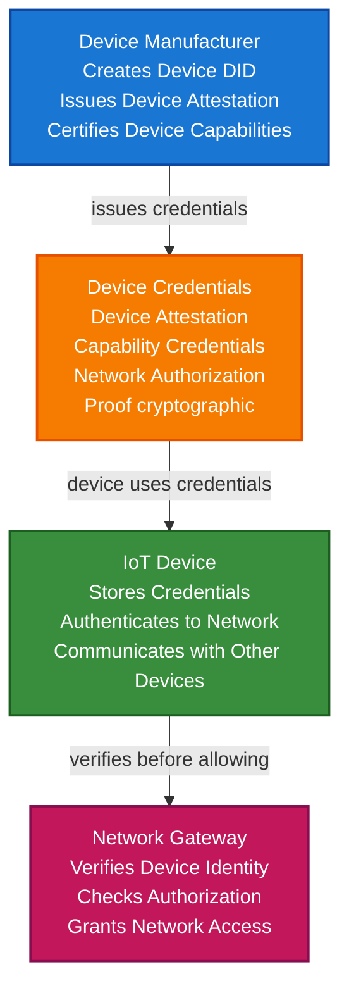

# IoT & Device Identity Scenario

This guide demonstrates how to build an IoT device identity system using VeriCore that enables device authentication, secure device-to-device communication, device attestation, and network authorization.

## What You'll Build

By the end of this tutorial, you'll have:

- ✅ Created DIDs for IoT devices and device manufacturers
- ✅ Issued device attestation credentials
- ✅ Built secure device-to-device communication
- ✅ Implemented device capability proofs
- ✅ Created network authorization system
- ✅ Anchored device identity to blockchain
- ✅ Built device lifecycle management

## Big Picture & Significance

### The IoT Identity Challenge

The Internet of Things (IoT) is rapidly expanding, with billions of devices connecting to networks. Each device needs a secure, verifiable identity to enable trusted communication, prevent unauthorized access, and ensure device authenticity.

**Industry Context**:
- **Market Size**: Global IoT market projected to reach $1.8 trillion by 2028
- **Device Count**: Over 30 billion IoT devices expected by 2025
- **Security Concerns**: IoT devices are prime targets for cyberattacks
- **Regulatory Pressure**: Increasing requirements for device security and identity
- **Interoperability**: Need for devices from different manufacturers to work together

**Why This Matters**:
1. **Security**: Prevent unauthorized device access and attacks
2. **Trust**: Verify device authenticity and capabilities
3. **Interoperability**: Enable devices from different manufacturers to communicate
4. **Scalability**: Handle millions of devices efficiently
5. **Compliance**: Meet regulatory requirements for device security
6. **Device Lifecycle**: Manage device identity throughout lifecycle

### The IoT Device Problem

Traditional IoT device management faces critical issues:
- **Weak Authentication**: Default passwords, no identity verification
- **No Device Identity**: Devices lack verifiable identities
- **Trust Issues**: Can't verify device authenticity or capabilities
- **Scalability**: Centralized management doesn't scale
- **Interoperability**: Devices from different manufacturers can't verify each other
- **Lifecycle Management**: Difficult to manage device identity over time

## Value Proposition

### Problems Solved

1. **Device Authentication**: Cryptographic proof of device identity
2. **Trust**: Verify device authenticity and capabilities
3. **Security**: Prevent unauthorized device access
4. **Interoperability**: Standard format works across manufacturers
5. **Scalability**: Decentralized identity scales to millions of devices
6. **Lifecycle Management**: Manage device identity throughout lifecycle
7. **Network Authorization**: Control which devices can join networks

### Business Benefits

**For Device Manufacturers**:
- **Brand Protection**: Prevent device counterfeiting
- **Security**: Reduce security vulnerabilities
- **Compliance**: Meet regulatory requirements
- **Customer Trust**: Build trust through verifiable identity

**For Network Operators**:
- **Security**: Prevent unauthorized devices
- **Management**: Efficient device management
- **Compliance**: Meet security requirements
- **Scalability**: Handle millions of devices

**For End Users**:
- **Security**: Trusted device connections
- **Privacy**: Control device data sharing
- **Convenience**: Seamless device integration
- **Transparency**: See device capabilities and status

### ROI Considerations

- **Security**: Prevents costly security breaches
- **Management**: Reduces device management costs by 40%
- **Compliance**: Automated compliance reduces costs
- **Interoperability**: Enables new revenue streams
- **Customer Trust**: Increases device adoption

## Understanding the Problem

IoT device identity management faces several critical challenges:

1. **Device Authentication**: How to verify device identity
2. **Capability Verification**: How to verify device capabilities
3. **Network Authorization**: How to control network access
4. **Device Lifecycle**: How to manage identity over time
5. **Interoperability**: How devices from different manufacturers work together
6. **Security**: How to prevent unauthorized access
7. **Scalability**: How to handle millions of devices

### Real-World Pain Points

**Example 1: Smart Home Security**
- Current: Weak authentication, no device verification
- Problem: Vulnerable to attacks, unauthorized access
- Solution: Verifiable device identity with cryptographic proof

**Example 2: Industrial IoT**
- Current: No way to verify device authenticity
- Problem: Counterfeit devices, security risks
- Solution: Device attestation credentials

**Example 3: Vehicle-to-Vehicle Communication**
- Current: No device identity verification
- Problem: Security risks, trust issues
- Solution: Verifiable vehicle device identity

## How It Works: IoT Device Identity Flow



## Key Concepts

### Device Identity Types

1. **Device Attestation Credential**: Proves device authenticity from manufacturer
2. **Capability Credential**: Describes device capabilities and features
3. **Network Authorization Credential**: Grants network access permissions
4. **Secure Boot Credential**: Proves device booted securely
5. **Lifecycle Credential**: Tracks device status and updates

### Device Capabilities

- **Sensors**: What sensors the device has
- **Actuators**: What actuators the device controls
- **Communication**: Communication protocols supported
- **Processing**: Processing capabilities
- **Storage**: Storage capacity

### Network Authorization

- **Network Access**: Which networks device can join
- **Resource Access**: What resources device can access
- **Communication**: Which devices device can communicate with
- **Time Restrictions**: When device can access network

## Prerequisites

- Java 21+
- Kotlin 2.2.0+
- Gradle 8.5+
- Basic understanding of Kotlin and coroutines
- Familiarity with IoT concepts (helpful but not required)

## Step 1: Add Dependencies

Add VeriCore dependencies to your `build.gradle.kts`:

```kotlin
dependencies {
    // Core VeriCore modules
    implementation("io.geoknoesis.vericore:vericore-core:1.0.0-SNAPSHOT")
    implementation("io.geoknoesis.vericore:vericore-json:1.0.0-SNAPSHOT")
    implementation("io.geoknoesis.vericore:vericore-kms:1.0.0-SNAPSHOT")
    implementation("io.geoknoesis.vericore:vericore-did:1.0.0-SNAPSHOT")
    implementation("io.geoknoesis.vericore:vericore-anchor:1.0.0-SNAPSHOT")
    
    // Test kit for in-memory implementations
    implementation("io.geoknoesis.vericore:vericore-testkit:1.0.0-SNAPSHOT")
    
    // Kotlinx Serialization
    implementation("org.jetbrains.kotlinx:kotlinx-serialization-json:1.6.0")
    
    // Coroutines
    implementation("org.jetbrains.kotlinx:kotlinx-coroutines-core:1.7.3")
}
```

## Step 2: Setup and Create Device Identity

**Purpose**: Initialize the IoT device identity system and create the foundational device DID.

**Why This Matters**: Every IoT device needs a unique, verifiable identity. The DID provides a decentralized identifier that persists throughout the device's lifecycle, independent of any network or manufacturer changes.

**Rationale**: Using DIDs instead of traditional device IDs provides:
- **Persistence**: Identity doesn't change when manufacturer changes
- **Verifiability**: Cryptographic proof of identity
- **Decentralization**: No central registry required
- **Interoperability**: Works across different systems

```kotlin
import io.geoknoesis.vericore.testkit.did.DidKeyMockMethod
import io.geoknoesis.vericore.testkit.kms.InMemoryKeyManagementService
import io.geoknoesis.vericore.did.DidMethodRegistry
import kotlinx.coroutines.runBlocking

fun main() = runBlocking {
    println("=== IoT & Device Identity Scenario ===\n")
    
    // Step 1: Setup services
    println("Step 1: Setting up services...")
    
    // Separate KMS for manufacturer ensures manufacturer has independent keys
    // This is critical for security - manufacturer keys must be isolated
    val manufacturerKms = InMemoryKeyManagementService()
    
    // Device KMS represents the device's own key management
    // In production, this would be a hardware security module (HSM) or secure element
    val deviceKms = InMemoryKeyManagementService()
    
    // Network gateway KMS for network authorization
    val gatewayKms = InMemoryKeyManagementService()
    
    // Register DID method for creating device identities
    // In production, use a real DID method like did:key or did:web
    val didMethod = DidKeyMockMethod(manufacturerKms)
    val didRegistry = DidMethodRegistry().apply { register(didMethod) }
    
    println("Services initialized")
}
```

## Step 3: Create Manufacturer and Device DIDs

**Purpose**: Establish verifiable identities for the device manufacturer and the IoT device itself.

**Why This Matters**: The manufacturer DID serves as a trust anchor - it proves the device came from a legitimate manufacturer. The device DID provides the device's persistent identity that will be used throughout its lifecycle.

**Rationale**: 
- **Manufacturer DID**: Acts as trust anchor for device attestation
- **Device DID**: Provides persistent device identity
- **Separation**: Separate DIDs ensure proper identity isolation

```kotlin
    // Step 2: Create manufacturer DID
    println("\nStep 2: Creating manufacturer DID...")
    
    // Manufacturer DID serves as trust anchor
    // All device attestation credentials will be issued by this DID
    // This proves devices are from legitimate manufacturer
    val manufacturerDid = didMethod.createDid(mapOf("algorithm" to "Ed25519"))
    println("Manufacturer DID: ${manufacturerDid.id}")
    
    // Step 3: Create device DID
    println("\nStep 3: Creating device DID...")
    
    // Device DID provides persistent identity for the IoT device
    // This DID will be used throughout device lifecycle
    // Even if device changes networks or owners, DID persists
    val deviceDid = didMethod.createDid(mapOf("algorithm" to "Ed25519"))
    println("Device DID: ${deviceDid.id}")
    
    // Step 4: Create network gateway DID
    println("\nStep 4: Creating network gateway DID...")
    
    // Gateway DID represents the network gateway that controls access
    // This DID will issue network authorization credentials
    val gatewayDid = didMethod.createDid(mapOf("algorithm" to "Ed25519"))
    println("Gateway DID: ${gatewayDid.id}")
```

## Step 4: Create Device Attestation Credential

**Purpose**: Issue a credential that proves the device is authentic and came from the manufacturer.

**Why This Matters**: Device attestation prevents counterfeiting and ensures devices are genuine. This is critical for security - you only want legitimate devices on your network.

**Rationale**: The attestation credential includes:
- **Device Information**: Model, serial number, manufacturing date
- **Manufacturer Proof**: Cryptographic signature from manufacturer
- **Device Capabilities**: What the device can do
- **Security Features**: Security capabilities of the device

```kotlin
import io.geoknoesis.vericore.credential.models.VerifiableCredential
import io.geoknoesis.vericore.credential.CredentialIssuanceOptions
import io.geoknoesis.vericore.credential.issuer.CredentialIssuer
import io.geoknoesis.vericore.credential.proof.Ed25519ProofGenerator
import io.geoknoesis.vericore.credential.proof.ProofGeneratorRegistry
import kotlinx.serialization.json.buildJsonObject
import kotlinx.serialization.json.put
import java.time.Instant

    // Step 5: Create device attestation credential
    println("\nStep 5: Creating device attestation credential...")
    
    // Device attestation proves device is authentic and from manufacturer
    // This credential will be used to verify device authenticity throughout its lifecycle
    val deviceAttestation = VerifiableCredential(
        id = "https://manufacturer.example.com/devices/${deviceDid.id.substringAfterLast(":")}/attestation",
        type = listOf("VerifiableCredential", "DeviceAttestationCredential", "IoTCredential"),
        issuer = manufacturerDid.id,
        credentialSubject = buildJsonObject {
            put("id", deviceDid.id)
            put("device", buildJsonObject {
                put("model", "SmartSensor Pro")
                put("serialNumber", "SSP-2024-001234")
                put("manufacturingDate", "2024-01-15")
                put("manufacturerDid", manufacturerDid.id)
                put("firmwareVersion", "2.1.0")
            })
        },
        issuanceDate = Instant.now().toString(),
        expirationDate = null, // Device attestation doesn't expire
        credentialSchema = io.geoknoesis.vericore.credential.models.CredentialSchema(
            id = "https://example.com/schemas/device-attestation.json",
            type = "JsonSchemaValidator2018",
            schemaFormat = io.geoknoesis.vericore.spi.SchemaFormat.JSON_SCHEMA
        )
    )
    
    println("Device attestation credential created:")
    println("  - Model: SmartSensor Pro")
    println("  - Serial: SSP-2024-001234")
    println("  - Manufacturer: ${manufacturerDid.id}")
```

## Step 5: Issue Attestation Credential with Proof

**Purpose**: Cryptographically sign the device attestation credential to make it verifiable.

**Why This Matters**: The cryptographic proof ensures the credential cannot be tampered with and proves it came from the manufacturer. This is the foundation of device trust.

**Rationale**: 
- **Key Generation**: Generate manufacturer's signing key
- **Proof Generator**: Create proof generator that uses manufacturer's KMS
- **Credential Issuance**: Sign credential with manufacturer's key
- **Verification**: Anyone can verify the credential came from manufacturer

```kotlin
    // Step 6: Issue device attestation credential
    println("\nStep 6: Issuing device attestation credential...")
    
    // Generate manufacturer's signing key
    // In production, this key would be stored in a hardware security module (HSM)
    // The key must be kept secure - if compromised, all device attestations are at risk
    val manufacturerKey = manufacturerKms.generateKey("Ed25519")
    
    // Create proof generator that uses manufacturer's KMS for signing
    // Ed25519 is chosen for its security and efficiency
    // The signer function wraps the KMS sign operation
    val manufacturerProofGenerator = Ed25519ProofGenerator(
        signer = { data, keyId -> 
            // Sign the credential data with manufacturer's key
            // This creates cryptographic proof that manufacturer issued this credential
            manufacturerKms.sign(keyId, data) 
        },
        getPublicKeyId = { keyId -> manufacturerKey.id }
    )
    
    // Register proof generator so it can be used
    ProofGeneratorRegistry.register(manufacturerProofGenerator)
    
    // Create credential issuer that uses the proof generator
    // The resolveDid function checks if DIDs are valid (simplified for example)
    val manufacturerIssuer = CredentialIssuer(
        proofGenerator = manufacturerProofGenerator,
        didResolver = CredentialDidResolver { did ->
            didRegistry.resolve(did).toCredentialDidResolution()
        }
    )
    
    // Issue the credential with cryptographic proof
    // The proof is attached to the credential and can be verified by anyone
    val issuedAttestation = manufacturerIssuer.issue(
        credential = deviceAttestation,
        issuerDid = manufacturerDid.id,
        keyId = manufacturerKey.id,
        options = CredentialIssuanceOptions(proofType = "Ed25519Signature2020")
    )
    
    println("Device attestation credential issued:")
    println("  - Has proof: ${issuedAttestation.proof != null}")
    println("  - Proof type: ${issuedAttestation.proof?.type}")
```

## Step 6: Create Device Capability Credential

**Purpose**: Issue a credential that describes what the device can do (sensors, actuators, communication protocols).

**Why This Matters**: Capability credentials enable other devices and systems to understand what a device can do without direct communication. This enables automated device discovery and integration.

**Rationale**: 
- **Sensors**: Lists what sensors the device has (temperature, humidity, etc.)
- **Actuators**: Lists what the device can control
- **Communication**: Lists supported protocols (WiFi, Bluetooth, Zigbee)
- **Processing**: Describes processing capabilities
- **Security**: Lists security features

```kotlin
    // Step 7: Create device capability credential
    println("\nStep 7: Creating device capability credential...")
    
    // Capability credential describes what the device can do
    // This enables other systems to understand device capabilities
    // Without this, systems would need to query device directly
    val capabilityCredential = VerifiableCredential(
        id = "https://manufacturer.example.com/devices/${deviceDid.id.substringAfterLast(":")}/capabilities",
        type = listOf("VerifiableCredential", "DeviceCapabilityCredential", "IoTCredential"),
        issuer = manufacturerDid.id,
        credentialSubject = buildJsonObject {
            put("id", deviceDid.id)
            put("capabilities", buildJsonObject {
                // Sensors: What the device can sense
                put("sensors", listOf(
                    "temperature",
                    "humidity",
                    "motion",
                    "light"
                ))
                
                // Actuators: What the device can control
                put("actuators", listOf(
                    "led",
                    "buzzer"
                ))
                
                // Communication protocols the device supports
                put("communication", listOf(
                    "WiFi",
                    "Bluetooth",
                    "Zigbee"
                ))
                
                // Processing capabilities
                put("processing", buildJsonObject {
                    put("cpu", "ARM Cortex-M4")
                    put("ram", "256KB")
                    put("storage", "1MB")
                })
                
                // Security features
                put("security", listOf(
                    "secure-boot",
                    "encryption",
                    "tls-support"
                ))
            })
        },
        issuanceDate = Instant.now().toString(),
        expirationDate = null
    )
    
    // Issue capability credential
    val issuedCapability = manufacturerIssuer.issue(
        credential = capabilityCredential,
        issuerDid = manufacturerDid.id,
        keyId = manufacturerKey.id,
        options = CredentialIssuanceOptions(proofType = "Ed25519Signature2020")
    )
    
    println("Device capability credential issued:")
    println("  - Sensors: temperature, humidity, motion, light")
    println("  - Communication: WiFi, Bluetooth, Zigbee")
```

## Step 7: Create Network Authorization Credential

**Purpose**: Issue a credential that grants the device permission to join a specific network.

**Why This Matters**: Network authorization prevents unauthorized devices from joining networks. Only devices with valid authorization credentials can access network resources.

**Rationale**:
- **Network Access**: Specifies which network device can join
- **Resource Access**: What resources device can access
- **Time Restrictions**: When device can access network
- **Revocation**: Can be revoked if device is compromised

```kotlin
    // Step 8: Create network authorization credential
    println("\nStep 8: Creating network authorization credential...")
    
    // Network authorization grants device permission to join network
    // This is issued by network gateway, not manufacturer
    // Gateway verifies device attestation before issuing authorization
    val networkAuthorization = VerifiableCredential(
        id = "https://gateway.example.com/authorizations/${deviceDid.id.substringAfterLast(":")}",
        type = listOf("VerifiableCredential", "NetworkAuthorizationCredential", "IoTCredential"),
        issuer = gatewayDid.id,
        credentialSubject = buildJsonObject {
            put("id", deviceDid.id)
            put("networkAuthorization", buildJsonObject {
                put("networkId", "smart-home-network-001")
                put("networkName", "Smart Home Network")
                put("authorizedResources", listOf(
                    "sensor-data",
                    "device-control",
                    "local-communication"
                ))
                put("timeRestrictions", buildJsonObject {
                    put("allowedHours", "00:00-23:59") // 24/7 access
                    put("timezone", "UTC")
                })
                put("authorizationDate", Instant.now().toString())
            })
        },
        issuanceDate = Instant.now().toString(),
        expirationDate = Instant.now().plus(365, java.time.temporal.ChronoUnit.DAYS).toString()
    )
    
    // Issue network authorization
    val gatewayKey = gatewayKms.generateKey("Ed25519")
    val gatewayProofGenerator = Ed25519ProofGenerator(
        signer = { data, keyId -> gatewayKms.sign(keyId, data) },
        getPublicKeyId = { keyId -> gatewayKey.id }
    )
    ProofGeneratorRegistry.register(gatewayProofGenerator)
    
    val gatewayIssuer = CredentialIssuer(
        proofGenerator = gatewayProofGenerator,
        didResolver = CredentialDidResolver { did ->
            didRegistry.resolve(did).toCredentialDidResolution()
        }
    )
    
    val issuedNetworkAuth = gatewayIssuer.issue(
        credential = networkAuthorization,
        issuerDid = gatewayDid.id,
        keyId = gatewayKey.id,
        options = CredentialIssuanceOptions(proofType = "Ed25519Signature2020")
    )
    
    println("Network authorization credential issued:")
    println("  - Network: Smart Home Network")
    println("  - Authorized resources: sensor-data, device-control")
```

## Step 8: Verify Device Before Network Access

**Purpose**: Verify device identity and authorization before allowing network access.

**Why This Matters**: This is the critical security checkpoint. The gateway must verify:
1. Device is authentic (attestation valid)
2. Device has network authorization
3. Credentials haven't expired or been revoked

**Rationale**: 
- **Attestation Verification**: Ensures device is from legitimate manufacturer
- **Authorization Verification**: Ensures device has permission to join network
- **Expiration Check**: Ensures credentials are still valid
- **Revocation Check**: Ensures credentials haven't been revoked

```kotlin
import io.geoknoesis.vericore.credential.verifier.CredentialVerifier
import io.geoknoesis.vericore.credential.CredentialVerificationOptions

    // Step 9: Verify device before network access
    println("\nStep 9: Verifying device before network access...")
    
    // Create verifier to check device credentials
    // This verifier will check cryptographic proofs and credential validity
    val verifier = CredentialVerifier(
        didResolver = CredentialDidResolver { did ->
            didRegistry.resolve(did).toCredentialDidResolution()
        }
    )
    
    // First, verify device attestation
    // This proves device is authentic and from legitimate manufacturer
    val attestationVerification = verifier.verify(
        credential = issuedAttestation,
        options = CredentialVerificationOptions(
            checkRevocation = true,
            checkExpiration = false, // Attestation doesn't expire
            validateSchema = true
        )
    )
    
    if (!attestationVerification.valid) {
        println("❌ Device attestation verification failed:")
        attestationVerification.errors.forEach { println("  - $it") }
        return@runBlocking
    }
    
    println("✅ Device attestation verified")
    
    // Second, verify network authorization
    // This proves device has permission to join network
    val authorizationVerification = verifier.verify(
        credential = issuedNetworkAuth,
        options = CredentialVerificationOptions(
            checkRevocation = true,
            checkExpiration = true,
            validateSchema = true
        )
    )
    
    if (!authorizationVerification.valid) {
        println("❌ Network authorization verification failed:")
        authorizationVerification.errors.forEach { println("  - $it") }
        return@runBlocking
    }
    
    println("✅ Network authorization verified")
    println("  - Device can join network")
```

## Step 9: Device-to-Device Communication

**Purpose**: Enable secure communication between IoT devices using their DIDs.

**Why This Matters**: Devices need to verify each other's identity before communicating. This prevents man-in-the-middle attacks and ensures devices only communicate with trusted peers.

**Rationale**:
- **Device Authentication**: Each device verifies the other's identity
- **Credential Exchange**: Devices exchange credentials to establish trust
- **Secure Communication**: Communication is encrypted using device keys
- **Trust Verification**: Devices verify each other's capabilities

```kotlin
    // Step 10: Device-to-device communication
    println("\nStep 10: Setting up device-to-device communication...")
    
    // Create second device for communication example
    val device2Did = didMethod.createDid(mapOf("algorithm" to "Ed25519"))
    println("Second device DID: ${device2Did.id}")
    
    // Device 1 wants to communicate with Device 2
    // First, Device 1 verifies Device 2's attestation
    // In a real scenario, Device 2 would present its attestation credential
    val device2Attestation = VerifiableCredential(
        type = listOf("VerifiableCredential", "DeviceAttestationCredential"),
        issuer = manufacturerDid.id,
        credentialSubject = buildJsonObject {
            put("id", device2Did.id)
            put("device", buildJsonObject {
                put("model", "SmartActuator Pro")
                put("serialNumber", "SAP-2024-005678")
            })
        },
        issuanceDate = Instant.now().toString()
    )
    
    val issuedDevice2Attestation = manufacturerIssuer.issue(
        credential = device2Attestation,
        issuerDid = manufacturerDid.id,
        keyId = manufacturerKey.id,
        options = CredentialIssuanceOptions(proofType = "Ed25519Signature2020")
    )
    
    // Verify Device 2's attestation
    val device2Verification = verifier.verify(
        credential = issuedDevice2Attestation,
        options = CredentialVerificationOptions(checkRevocation = true)
    )
    
    if (device2Verification.valid) {
        println("✅ Device 2 verified - secure communication can proceed")
        println("  - Device 1 can trust Device 2")
        println("  - Communication can be encrypted using device keys")
    }
```

## Step 10: Anchor Device Identity to Blockchain

**Purpose**: Create immutable record of device identity on blockchain.

**Why This Matters**: Blockchain anchoring provides:
- **Immutability**: Cannot be tampered with
- **Audit Trail**: Permanent record of device identity
- **Trust**: Third parties can verify device identity independently
- **Non-Repudiation**: Manufacturer cannot deny device issuance

**Rationale**: 
- **Device Record**: Create structured record of device identity
- **Blockchain Anchoring**: Anchor to blockchain for immutability
- **Digest**: Cryptographic hash of device credentials
- **Verification**: Anyone can verify device identity from blockchain

```kotlin
import io.geoknoesis.vericore.testkit.anchor.InMemoryBlockchainAnchorClient
import io.geoknoesis.vericore.anchor.BlockchainAnchorRegistry
import io.geoknoesis.vericore.anchor.anchorTyped
import kotlinx.serialization.Serializable

@Serializable
data class DeviceIdentityRecord(
    val deviceDid: String,
    val manufacturerDid: String,
    val model: String,
    val serialNumber: String,
    val attestationDigest: String
)

    // Step 11: Anchor device identity to blockchain
    println("\nStep 11: Anchoring device identity to blockchain...")
    
    // Setup blockchain client
    val anchorClient = InMemoryBlockchainAnchorClient("eip155:1", emptyMap())
    val blockchainRegistry = BlockchainAnchorRegistry().apply {
        register("eip155:1", anchorClient)
    }
    
    // Compute digest of device attestation credential
    // This digest uniquely identifies the credential
    val attestationDigest = io.geoknoesis.vericore.json.DigestUtils.sha256DigestMultibase(
        Json.encodeToJsonElement(
            io.geoknoesis.vericore.credential.models.VerifiableCredential.serializer(),
            issuedAttestation
        )
    )
    
    // Create device identity record
    // This record will be permanently stored on blockchain
    val deviceIdentityRecord = DeviceIdentityRecord(
        deviceDid = deviceDid.id,
        manufacturerDid = manufacturerDid.id,
        model = "SmartSensor Pro",
        serialNumber = "SSP-2024-001234",
        attestationDigest = attestationDigest
    )
    
    // Anchor to blockchain
    // This creates immutable record that cannot be tampered with
    val anchorResult = blockchainRegistry.anchorTyped(
        value = deviceIdentityRecord,
        serializer = DeviceIdentityRecord.serializer(),
        targetChainId = "eip155:137"
    )
    
    println("Device identity anchored to blockchain:")
    println("  - Transaction hash: ${anchorResult.ref.txHash}")
    println("  - Provides immutable device identity record")
    println("  - Can be verified by anyone")
```

## Extensive Step-by-Step Breakdown

### Step 1: Setup and Initialization

**Purpose**: Initialize IoT device identity system with proper key management.

**Detailed Explanation**:
1. **Multiple KMS Instances**: Separate key management for manufacturer, device, and gateway ensures proper key isolation. This is critical because:
   - **Manufacturer Keys**: Must be highly secure - if compromised, all device attestations are at risk
   - **Device Keys**: Stored on device (ideally in HSM or secure element)
   - **Gateway Keys**: Used for network authorization

2. **DID Method Registration**: Register DID method for creating device identities. In production, use real DID methods like `did:key` or `did:web`.

3. **Why Separation Matters**: 
   - **Security**: If one system is compromised, others remain secure
   - **Scalability**: Each system can scale independently
   - **Compliance**: Meets security requirements for key isolation

### Step 2: Create Manufacturer DID

**Purpose**: Establish manufacturer as trust anchor.

**Detailed Explanation**:
- **Trust Anchor**: Manufacturer DID serves as root of trust
- **Credential Issuance**: All device attestation credentials issued by this DID
- **Verification**: Anyone can verify device came from this manufacturer
- **Persistence**: Manufacturer DID persists even if company changes

**Why This Matters**: The manufacturer DID is the foundation of device trust. All device attestations reference this DID, so it must be well-known and trusted.

### Step 3: Create Device DID

**Purpose**: Provide persistent identity for IoT device.

**Detailed Explanation**:
- **Persistence**: Device DID doesn't change throughout device lifecycle
- **Independence**: Not tied to any network or manufacturer system
- **Verifiability**: Cryptographic proof of device identity
- **Portability**: Works across different networks and systems

**Why This Matters**: Device DIDs enable devices to maintain identity even when:
- Changing networks
- Changing owners
- Manufacturer systems change
- Device firmware is updated

### Step 4: Create Device Attestation Credential

**Purpose**: Prove device is authentic and from manufacturer.

**Detailed Explanation**:

**Credential Structure**:
1. **Device Information**: Model, serial number, manufacturing date
   - **Why**: Identifies specific device instance
   - **Use Case**: Recall management, warranty tracking

2. **Manufacturer Reference**: Links to manufacturer DID
   - **Why**: Proves device came from legitimate manufacturer
   - **Use Case**: Prevents counterfeiting

3. **Firmware Version**: Current firmware version
   - **Why**: Enables firmware update tracking
   - **Use Case**: Security patch management

**Security Features**:
- **Tamper-Proof**: Cryptographic proof prevents tampering
- **Verifiable**: Anyone can verify credential
- **Non-Repudiation**: Manufacturer cannot deny issuance
- **Permanent**: Attestation doesn't expire (device is always from manufacturer)

### Step 5: Issue Attestation Credential

**Purpose**: Cryptographically sign device attestation.

**Detailed Explanation**:

**Proof Generation Process**:
1. **Key Generation**: Generate manufacturer's signing key
   - **Security**: Key must be stored in HSM in production
   - **Backup**: Key backup is critical - loss means cannot issue new credentials

2. **Proof Generator Creation**: Create Ed25519 proof generator
   - **Why Ed25519**: Secure, efficient, widely supported
   - **Signer Function**: Wraps KMS sign operation
   - **Public Key ID**: Enables verification

3. **Credential Issuance**: Sign credential with manufacturer key
   - **Proof Attachment**: Proof is attached to credential
   - **Verification**: Anyone can verify proof

**Why This Matters**: The cryptographic proof is what makes the credential trustworthy. Without it, anyone could create fake device attestations.

### Step 6: Create Capability Credential

**Purpose**: Describe device capabilities.

**Detailed Explanation**:

**Capability Information**:
1. **Sensors**: What the device can sense
   - **Why**: Enables automated device discovery
   - **Use Case**: Smart home systems finding temperature sensors

2. **Actuators**: What the device can control
   - **Why**: Enables automated control
   - **Use Case**: Home automation systems controlling lights

3. **Communication**: Supported protocols
   - **Why**: Enables protocol selection
   - **Use Case**: Choosing communication protocol

4. **Processing**: Processing capabilities
   - **Why**: Enables workload distribution
   - **Use Case**: Edge computing decisions

**Why This Matters**: Capability credentials enable:
- **Automated Discovery**: Systems can find devices with specific capabilities
- **Interoperability**: Devices from different manufacturers can work together
- **Resource Planning**: Systems can plan resource usage

### Step 7: Create Network Authorization Credential

**Purpose**: Grant device permission to join network.

**Detailed Explanation**:

**Authorization Details**:
1. **Network ID**: Specific network device can join
   - **Why**: Prevents unauthorized network access
   - **Security**: Device can only join authorized networks

2. **Authorized Resources**: What resources device can access
   - **Why**: Principle of least privilege
   - **Security**: Limits device access to necessary resources

3. **Time Restrictions**: When device can access network
   - **Why**: Enables time-based access control
   - **Use Case**: Restricting device access during maintenance

**Why This Matters**: Network authorization provides:
- **Access Control**: Only authorized devices can join
- **Resource Protection**: Limits what devices can access
- **Security**: Prevents unauthorized access

### Step 8: Verify Device Before Network Access

**Purpose**: Security checkpoint before allowing network access.

**Detailed Explanation**:

**Verification Steps**:
1. **Attestation Verification**: Verify device is authentic
   - **Why**: Ensures device is from legitimate manufacturer
   - **Security**: Prevents counterfeit devices

2. **Authorization Verification**: Verify device has network permission
   - **Why**: Ensures device is authorized for this network
   - **Security**: Prevents unauthorized access

3. **Expiration Check**: Verify credentials haven't expired
   - **Why**: Ensures credentials are still valid
   - **Security**: Prevents use of stale credentials

4. **Revocation Check**: Verify credentials haven't been revoked
   - **Why**: Ensures device hasn't been compromised
   - **Security**: Prevents compromised devices from accessing network

**Why This Matters**: This verification is the critical security checkpoint. Without it, any device could join the network.

### Step 9: Device-to-Device Communication

**Purpose**: Enable secure communication between devices.

**Detailed Explanation**:

**Communication Setup**:
1. **Identity Verification**: Devices verify each other's identity
   - **Why**: Ensures devices are authentic
   - **Security**: Prevents man-in-the-middle attacks

2. **Credential Exchange**: Devices exchange credentials
   - **Why**: Establishes trust between devices
   - **Security**: Enables secure communication

3. **Key Exchange**: Devices exchange encryption keys
   - **Why**: Enables encrypted communication
   - **Security**: Protects data in transit

**Why This Matters**: Device-to-device communication enables:
- **Local Processing**: Devices can process data locally
- **Reduced Latency**: No need to go through cloud
- **Privacy**: Data stays local
- **Resilience**: Works even if cloud is down

### Step 10: Anchor Device Identity to Blockchain

**Purpose**: Create immutable record of device identity.

**Detailed Explanation**:

**Blockchain Benefits**:
1. **Immutability**: Record cannot be tampered with
   - **Why**: Provides permanent record
   - **Use Case**: Audit trails, compliance

2. **Verification**: Anyone can verify device identity
   - **Why**: No need to contact manufacturer
   - **Use Case**: Third-party verification

3. **Non-Repudiation**: Manufacturer cannot deny issuance
   - **Why**: Provides legal proof
   - **Use Case**: Warranty claims, recalls

**Why This Matters**: Blockchain anchoring provides:
- **Trust**: Third parties can verify independently
- **Compliance**: Meets regulatory requirements
- **Audit**: Permanent audit trail
- **Transparency**: Public verification

## Advanced Features

### Secure Boot Verification

Verify device booted securely:

```kotlin
fun createSecureBootCredential(
    deviceDid: String,
    bootMeasurement: String,
    issuerDid: String
): VerifiableCredential {
    // Secure boot credential proves device booted with trusted firmware
    // bootMeasurement is cryptographic hash of boot process
    // This prevents compromised firmware from running
    return VerifiableCredential(
        type = listOf("VerifiableCredential", "SecureBootCredential"),
        issuer = issuerDid,
        credentialSubject = buildJsonObject {
            put("id", deviceDid)
            put("secureBoot", buildJsonObject {
                put("bootMeasurement", bootMeasurement)
                put("bootDate", Instant.now().toString())
                put("firmwareHash", "sha256:abc123...")
            })
        },
        issuanceDate = Instant.now().toString()
    )
}
```

### Device Lifecycle Management

Track device through lifecycle:

```kotlin
fun createLifecycleCredential(
    deviceDid: String,
    lifecycleStage: String,
    issuerDid: String
): VerifiableCredential {
    // Lifecycle credential tracks device status
    // Stages: manufactured, deployed, active, maintenance, decommissioned
    return VerifiableCredential(
        type = listOf("VerifiableCredential", "DeviceLifecycleCredential"),
        issuer = issuerDid,
        credentialSubject = buildJsonObject {
            put("id", deviceDid)
            put("lifecycle", buildJsonObject {
                put("stage", lifecycleStage)
                put("transitionDate", Instant.now().toString())
                put("previousStage", "manufactured")
            })
        },
        issuanceDate = Instant.now().toString()
    )
}
```

### Device Update Credentials

Track firmware updates:

```kotlin
fun createUpdateCredential(
    deviceDid: String,
    firmwareVersion: String,
    updateHash: String,
    issuerDid: String
): VerifiableCredential {
    // Update credential proves firmware update was legitimate
    // Prevents malicious firmware updates
    return VerifiableCredential(
        type = listOf("VerifiableCredential", "DeviceUpdateCredential"),
        issuer = issuerDid,
        credentialSubject = buildJsonObject {
            put("id", deviceDid)
            put("update", buildJsonObject {
                put("firmwareVersion", firmwareVersion)
                put("updateHash", updateHash)
                put("updateDate", Instant.now().toString())
                put("signedBy", issuerDid)
            })
        },
        issuanceDate = Instant.now().toString()
    )
}
```

## Real-World Use Cases

### 1. Smart Home Device Authentication

**Scenario**: Smart home hub verifies devices before allowing them to join network.

**Implementation**:

```kotlin
fun authenticateSmartHomeDevice(
    deviceAttestation: VerifiableCredential,
    hubDid: String
): Boolean {
    // Verify device attestation
    val verifier = CredentialVerifier(
        didResolver = CredentialDidResolver { did ->
            didRegistry.resolve(did).toCredentialDidResolution()
        }
    )
    
    val verification = verifier.verify(
        credential = deviceAttestation,
        options = CredentialVerificationOptions(checkRevocation = true)
    )
    
    if (!verification.valid) return false
    
    // Check if device is from trusted manufacturer
    val manufacturerDid = deviceAttestation.issuer
    val trustedManufacturers = listOf(
        "did:example:manufacturer1",
        "did:example:manufacturer2"
    )
    
    return manufacturerDid in trustedManufacturers
}
```

### 2. Industrial IoT Device Management

**Scenario**: Industrial system verifies device capabilities before deployment.

**Implementation**:

```kotlin
fun verifyDeviceCapabilities(
    capabilityCredential: VerifiableCredential,
    requiredCapabilities: List<String>
): Boolean {
    val capabilities = capabilityCredential.credentialSubject.jsonObject["capabilities"]?.jsonObject
        ?: return false
    
    val deviceSensors = capabilities["sensors"]?.jsonArray
        ?.map { it.jsonPrimitive.content }
        ?: return false
    
    // Check if device has all required capabilities
    return requiredCapabilities.all { it in deviceSensors }
}
```

### 3. Vehicle-to-Vehicle Communication

**Scenario**: Vehicles verify each other's identity before communicating.

**Implementation**:

```kotlin
fun establishVehicleCommunication(
    vehicle1Did: String,
    vehicle2Did: String,
    vehicle1Attestation: VerifiableCredential,
    vehicle2Attestation: VerifiableCredential
): Boolean {
    val verifier = CredentialVerifier(
        didResolver = CredentialDidResolver { did ->
            didRegistry.resolve(did).toCredentialDidResolution()
        }
    )
    
    // Verify both vehicle attestations
    val v1Verification = verifier.verify(
        credential = vehicle1Attestation,
        options = CredentialVerificationOptions(checkRevocation = true)
    )
    
    val v2Verification = verifier.verify(
        credential = vehicle2Attestation,
        options = CredentialVerificationOptions(checkRevocation = true)
    )
    
    // Both vehicles must be verified
    return v1Verification.valid && v2Verification.valid
}
```

## Benefits

1. **Device Authentication**: Cryptographic proof of device identity
2. **Trust**: Verify device authenticity and capabilities
3. **Security**: Prevent unauthorized device access
4. **Interoperability**: Standard format works across manufacturers
5. **Scalability**: Decentralized identity scales to millions of devices
6. **Lifecycle Management**: Manage device identity throughout lifecycle
7. **Network Authorization**: Control which devices can join networks
8. **Device-to-Device Communication**: Secure communication between devices
9. **Compliance**: Meet regulatory requirements
10. **Audit Trail**: Immutable records of device identity

## Best Practices

1. **Secure Key Storage**: Use HSMs or secure elements for device keys
2. **Attestation Verification**: Always verify device attestation
3. **Network Authorization**: Issue network authorization separately
4. **Capability Verification**: Verify device capabilities before use
5. **Lifecycle Management**: Track device through lifecycle
6. **Update Management**: Verify firmware updates
7. **Revocation**: Enable credential revocation
8. **Error Handling**: Handle verification failures gracefully
9. **Key Rotation**: Rotate keys periodically
10. **Audit Logging**: Log all device authentication events

## Next Steps

- Learn about [Spatial Web Authorization Scenario](spatial-web-authorization-scenario.md) for related authorization concepts
- Explore [Proof of Location Scenario](proof-of-location-scenario.md) for location-based device tracking
- Check out [Supply Chain & Traceability Scenario](supply-chain-traceability-scenario.md) for device manufacturing tracking
- Review [Core Concepts: DIDs](../core-concepts/dids.md) for identity management


