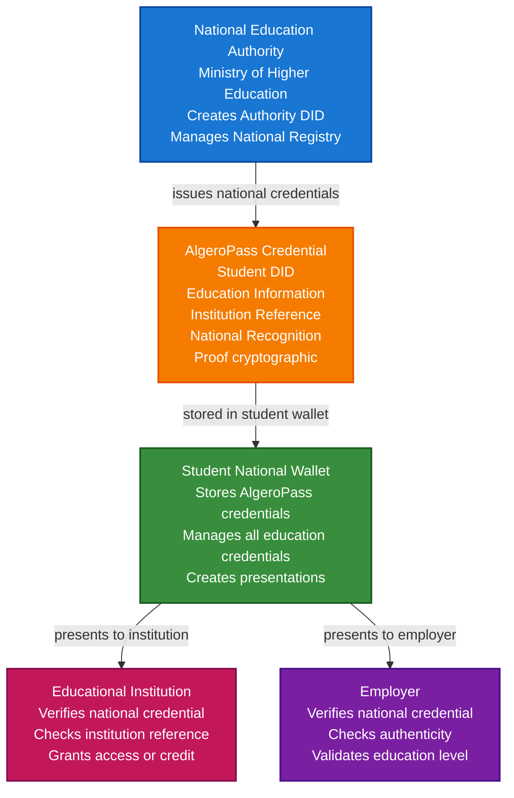

# National Education Credentials Scenario (AlgeroPass)

This guide demonstrates how to build a national-level education credential system using VeriCore, specifically designed for Algeria's AlgeroPass initiative. You'll learn how a national education authority can issue verifiable credentials to students, enable cross-institution verification, and provide a unified credential system across the entire country.

## What You'll Build

By the end of this tutorial, you'll have:

- ✅ Created DIDs for national education authority and educational institutions
- ✅ Issued national-level education credentials (AlgeroPass credentials)
- ✅ Built cross-institution credential verification system
- ✅ Implemented credential portability across Algerian universities
- ✅ Created student credential wallet for national credentials
- ✅ Anchored critical credentials to blockchain for immutability
- ✅ Built complete national education credential ecosystem

## Big Picture & Significance

### The National Education Credential Challenge

National education systems face the challenge of providing unified, verifiable credentials that work across all educational institutions. Students need credentials that are recognized nationally, portable across institutions, and verifiable without contacting individual universities.

**Industry Context**:
- **Market Size**: Global digital identity in education market projected to reach $8.1 billion by 2027
- **National Initiatives**: Countries worldwide implementing national education credential systems
- **Student Mobility**: Increasing need for credentials that work across institutions
- **Fraud Prevention**: National-level systems reduce credential fraud
- **Interoperability**: Standard format enables seamless credential sharing

**Why This Matters**:
1. **National Recognition**: Credentials recognized across all Algerian institutions
2. **Student Mobility**: Easy transfer between universities
3. **Fraud Prevention**: Cryptographic proof prevents credential forgery
4. **Efficiency**: Eliminates need for manual verification between institutions
5. **Portability**: Students own and control their credentials
6. **Compliance**: Meets national education standards and regulations

### The National Credential Problem

Traditional national education systems face critical issues:
- **Fragmented Systems**: Each institution has its own credential system
- **No Portability**: Credentials don't transfer between institutions
- **Manual Verification**: Slow, expensive verification processes
- **Fraud Risk**: Paper credentials can be forged
- **No National Registry**: No unified system for credential management
- **Privacy Concerns**: Centralized databases create privacy risks

## Value Proposition

### Problems Solved

1. **National Recognition**: Credentials recognized across all Algerian institutions
2. **Cross-Institution Portability**: Credentials work at any university
3. **Instant Verification**: Cryptographic proof without contacting institutions
4. **Fraud Prevention**: Tamper-proof credentials cannot be forged
5. **Student Control**: Students own and control their credentials
6. **Interoperability**: Standard format works across all institutions
7. **Efficiency**: Eliminates expensive verification processes

### Business Benefits

**For National Education Authority**:
- **Unified System**: Single credential system for entire country
- **Compliance**: Meet national education standards
- **Efficiency**: Automated credential issuance and verification
- **Fraud Prevention**: Reduced credential fraud
- **Cost Savings**: Eliminate duplicate verification systems

**For Educational Institutions**:
- **Efficiency**: Instant credential verification
- **Cost Savings**: Reduced verification workload
- **Trust**: Cryptographic proof of authenticity
- **Compliance**: Meet national standards
- **Student Satisfaction**: Improved student experience

**For Students**:
- **Portability**: Credentials work across all institutions
- **Control**: Own and control credentials
- **Privacy**: Selective disclosure protects privacy
- **Convenience**: Access credentials from any device
- **Mobility**: Easy transfer between universities

**For Employers**:
- **Speed**: Instant verification
- **Trust**: Cryptographic proof of authenticity
- **National Recognition**: Credentials recognized nationwide
- **Efficiency**: Streamlined hiring process

### ROI Considerations

- **Verification Costs**: 80-90% reduction in verification costs
- **Fraud Prevention**: Eliminates credential fraud
- **Efficiency**: 10x faster verification process
- **Student Mobility**: Increased student transfers between institutions
- **National Compliance**: Automated compliance with national standards

## Understanding the Problem

National education credential systems face several critical challenges:

1. **Fragmentation**: Each institution has its own system
2. **No Portability**: Credentials don't transfer between institutions
3. **Manual Verification**: Slow, expensive processes
4. **Fraud Risk**: Credentials can be forged
5. **Privacy Concerns**: Centralized databases create risks
6. **Compliance**: Complex national standards
7. **Student Mobility**: Difficult to transfer credentials

### Real-World Pain Points

**Example 1: Student Transfer**
- Current: Student must request transcripts from each institution
- Problem: Slow, expensive, not portable
- Solution: National credentials transfer instantly

**Example 2: Employer Verification**
- Current: Must contact multiple institutions
- Problem: Slow, expensive, inconsistent
- Solution: Instant verification with national credentials

**Example 3: Graduate School Applications**
- Current: Manual submission of transcripts
- Problem: Time-consuming, privacy concerns
- Solution: Selective disclosure of credentials

## How It Works: National Education Credential Flow



## Key Concepts

### AlgeroPass Credential Types

1. **Student Enrollment Credential**: Proves student enrollment at national level
2. **Academic Achievement Credential**: Records academic achievements and grades
3. **Degree Credential**: National recognition of degree completion
4. **Transfer Credential**: Enables transfer between institutions
5. **Continuing Education Credential**: Records ongoing education

### National Registry

- **Institution Registry**: All recognized educational institutions
- **Credential Registry**: National registry of issued credentials
- **Verification Registry**: Public verification endpoints
- **Revocation Registry**: National revocation list

### Credential Levels

1. **Basic**: Student enrollment verification
2. **Standard**: Academic achievements and grades
3. **Enhanced**: Complete academic history
4. **Premium**: Includes certifications and continuing education

## Prerequisites

- Java 21+
- Kotlin 2.2.0+
- Gradle 8.5+
- Basic understanding of Kotlin and coroutines
- Familiarity with education credential concepts

## Step 1: Add Dependencies

Add VeriCore dependencies to your `build.gradle.kts`:

```kotlin
dependencies {
    // Core VeriCore modules
    implementation("com.geoknoesis.vericore:vericore-core:1.0.0-SNAPSHOT")
    implementation("com.geoknoesis.vericore:vericore-json:1.0.0-SNAPSHOT")
    implementation("com.geoknoesis.vericore:vericore-kms:1.0.0-SNAPSHOT")
    implementation("com.geoknoesis.vericore:vericore-did:1.0.0-SNAPSHOT")
    implementation("com.geoknoesis.vericore:vericore-anchor:1.0.0-SNAPSHOT")
    
    // Test kit for in-memory implementations
    implementation("com.geoknoesis.vericore:vericore-testkit:1.0.0-SNAPSHOT")
    
    // Kotlinx Serialization
    implementation("org.jetbrains.kotlinx:kotlinx-serialization-json:1.6.0")
    
    // Coroutines
    implementation("org.jetbrains.kotlinx:kotlinx-coroutines-core:1.7.3")
}
```

## Step 2: Setup and Create National Authority DID

**Purpose**: Initialize the national education credential system and create DIDs for the national education authority.

**Why This Matters**: The national education authority needs a verifiable identity to issue credentials. Its DID provides a persistent identifier that all institutions and students can trust.

**Rationale**:
- **Authority DID**: Represents the national education authority
- **Persistent Identity**: Survives across time and systems
- **Trust**: All parties trust credentials from this DID
- **Verification**: Anyone can verify credentials came from authority

```kotlin
import com.geoknoesis.vericore.testkit.did.DidKeyMockMethod
import com.geoknoesis.vericore.testkit.kms.InMemoryKeyManagementService
import com.geoknoesis.vericore.did.DidMethodRegistry
import kotlinx.coroutines.runBlocking

fun main() = runBlocking {
    println("=== National Education Credentials (AlgeroPass) Scenario ===\n")
    
    // Step 1: Setup services
    println("Step 1: Setting up services...")
    
    // Separate KMS for different participants
    // National authority, institutions, and students each have their own keys
    val authorityKms = InMemoryKeyManagementService() // For national education authority
    val institutionKms = InMemoryKeyManagementService() // For educational institutions
    val studentKms = InMemoryKeyManagementService() // For students
    
    val didMethod = DidKeyMockMethod(authorityKms)
    val didRegistry = DidMethodRegistry().apply { register(didMethod) }
    
    println("Services initialized")
}
```

## Step 3: Create National Authority and Institution DIDs

**Purpose**: Create DIDs for the national education authority and educational institutions.

**Why This Matters**: Both the national authority and institutions need verifiable identities. The authority issues national credentials, while institutions provide education and reference information.

**Rationale**:
- **Authority DID**: National education authority identity
- **Institution DID**: Individual educational institution identity
- **Relationship**: Authority can verify institution credentials
- **Trust**: Students trust credentials from recognized institutions

```kotlin
    // Step 2: Create national authority and institution DIDs
    println("\nStep 2: Creating national authority and institution DIDs...")
    
    // National Education Authority DID
    // Represents the Ministry of Higher Education and Scientific Research
    // This is the trusted issuer of national credentials
    val authorityDid = didMethod.createDid()
    println("National Education Authority DID: ${authorityDid.id}")
    
    // Educational Institution DID
    // Example: University of Algiers, University of Oran, etc.
    // Institutions are registered with the national authority
    val institutionDid = didMethod.createDid()
    println("Educational Institution DID: ${institutionDid.id}")
    
    // Create institution registration credential
    // This proves the institution is recognized by the national authority
    val institutionRegistrationCredential = createInstitutionRegistrationCredential(
        institutionDid = institutionDid.id,
        authorityDid = authorityDid.id,
        institutionName = "University of Algiers",
        institutionCode = "UA-001",
        recognitionDate = Instant.now().toString()
    )
    
    println("Institution registration credential created:")
    println("  - Institution: University of Algiers")
    println("  - Code: UA-001")
    println("  - Recognized by: ${authorityDid.id}")
```

## Step 4: Create Student DID and Enrollment Credential

**Purpose**: Create DID for student and issue national enrollment credential.

**Why This Matters**: Students need verifiable identities and national credentials proving their enrollment. This enables cross-institution recognition and portability.

**Rationale**:
- **Student DID**: Individual student identity
- **Enrollment Credential**: Proves student enrollment at national level
- **National Recognition**: Credential recognized by all institutions
- **Portability**: Enables student mobility

```kotlin
import com.geoknoesis.vericore.credential.models.VerifiableCredential
import kotlinx.serialization.json.buildJsonObject
import kotlinx.serialization.json.put
import java.time.Instant

    // Step 3: Create student DID and enrollment credential
    println("\nStep 3: Creating student DID and enrollment credential...")
    
    // Student DID
    // Represents individual student
    // Students own their DIDs and credentials
    val studentDid = didMethod.createDid()
    println("Student DID: ${studentDid.id}")
    
    // Create AlgeroPass enrollment credential
    // This is the national-level credential proving student enrollment
    // It references the institution but is issued by national authority
    val enrollmentCredential = VerifiableCredential(
        id = "https://algeropass.dz/credentials/${studentDid.id.substringAfterLast(":")}/enrollment",
        type = listOf("VerifiableCredential", "AlgeroPassCredential", "EnrollmentCredential", "EducationCredential"),
        issuer = authorityDid.id, // National authority issues credential
        credentialSubject = buildJsonObject {
            put("id", studentDid.id)
            put("algeroPass", buildJsonObject {
                put("credentialType", "enrollment")
                put("studentId", "STU-2024-001234")
                put("nationalId", "1234567890123") // Algerian national ID
                put("institution", buildJsonObject {
                    put("institutionDid", institutionDid.id)
                    put("institutionName", "University of Algiers")
                    put("institutionCode", "UA-001")
                })
                put("program", buildJsonObject {
                    put("programName", "Computer Science")
                    put("programCode", "CS-BS")
                    put("degreeLevel", "Bachelor")
                })
                put("enrollmentDate", "2024-09-01")
                put("status", "active")
                put("academicYear", "2024-2025")
            })
        },
        issuanceDate = Instant.now().toString(),
        expirationDate = null
    )
    
    println("AlgeroPass enrollment credential created:")
    println("  - Student ID: STU-2024-001234")
    println("  - Institution: University of Algiers")
    println("  - Program: Computer Science (Bachelor)")
    println("  - Status: active")
```

## Step 5: Issue Enrollment Credential with Proof

**Purpose**: Cryptographically sign the enrollment credential to make it verifiable.

**Why This Matters**: Cryptographic proof ensures the credential is authentic and issued by the national authority. This is critical for trust - institutions need to verify credentials are legitimate.

**Rationale**:
- **Key Generation**: Generate authority's signing key
- **Proof Generation**: Create cryptographic proof
- **Credential Issuance**: Sign credential with authority's key
- **Verification**: Anyone can verify credential authenticity

```kotlin
import com.geoknoesis.vericore.credential.issuer.CredentialIssuer
import com.geoknoesis.vericore.credential.proof.Ed25519ProofGenerator
import com.geoknoesis.vericore.credential.CredentialIssuanceOptions

    // Step 4: Issue enrollment credential with proof
    println("\nStep 4: Issuing AlgeroPass enrollment credential...")
    
    // Generate authority's signing key
    // This key will be used to sign all national credentials
    // In production, use hardware security module (HSM)
    val authorityKey = authorityKms.generateKey("Ed25519")
    
    // Create proof generator for authority
    val authorityProofGenerator = Ed25519ProofGenerator(
        signer = { data, keyId -> authorityKms.sign(keyId, data) },
        getPublicKeyId = { keyId -> authorityKey.id }
    )
    
    val didResolver = CredentialDidResolver { did ->
        didRegistry.resolve(did).toCredentialDidResolution()
    }
    
    // Create credential issuer
    val authorityIssuer = CredentialIssuer(
        proofGenerator = authorityProofGenerator,
        resolveDid = { did -> didResolver.resolve(did)?.isResolvable == true }
    )
    
    // Issue enrollment credential
    // This proves the student is enrolled at national level
    val issuedEnrollmentCredential = authorityIssuer.issue(
        credential = enrollmentCredential,
        issuerDid = authorityDid.id,
        keyId = authorityKey.id,
        options = CredentialIssuanceOptions(proofType = "Ed25519Signature2020")
    )
    
    println("AlgeroPass enrollment credential issued:")
    println("  - Proof: ${issuedEnrollmentCredential.proof != null}")
    println("  - Issuer: ${authorityDid.id}")
```

## Step 6: Create Academic Achievement Credential

**Purpose**: Create credential recording academic achievements and grades.

**Why This Matters**: Academic achievement credentials provide verifiable proof of student performance. This enables credit transfer and recognition across institutions.

**Rationale**:
- **Achievement Tracking**: Records academic performance
- **National Recognition**: Achievements recognized nationally
- **Credit Transfer**: Enables transfer between institutions
- **Verification**: Institutions can verify achievements

```kotlin
    // Step 5: Create academic achievement credential
    println("\nStep 5: Creating academic achievement credential...")
    
    // Academic achievement credential records student performance
    // This is issued by the institution but recognized nationally
    val achievementCredential = VerifiableCredential(
        type = listOf("VerifiableCredential", "AlgeroPassCredential", "AchievementCredential", "EducationCredential"),
        issuer = institutionDid.id, // Institution issues achievement credential
        credentialSubject = buildJsonObject {
            put("id", studentDid.id)
            put("algeroPass", buildJsonObject {
                put("credentialType", "achievement")
                put("studentId", "STU-2024-001234")
                put("institution", buildJsonObject {
                    put("institutionDid", institutionDid.id)
                    put("institutionName", "University of Algiers")
                })
                put("academicYear", "2024-2025")
                put("semester", "Fall")
                put("achievements", buildJsonObject {
                    put("courses", listOf(
                        buildJsonObject {
                            put("courseCode", "CS101")
                            put("courseName", "Introduction to Computer Science")
                            put("credits", "3")
                            put("grade", "A")
                            put("gpa", "4.0")
                        },
                        buildJsonObject {
                            put("courseCode", "MATH101")
                            put("courseName", "Calculus I")
                            put("credits", "4")
                            put("grade", "B+")
                            put("gpa", "3.5")
                        }
                    ))
                    put("semesterGPA", "3.75")
                    put("cumulativeGPA", "3.75")
                })
                put("timestamp", Instant.now().toString())
            })
        },
        issuanceDate = Instant.now().toString(),
        expirationDate = null
    )
    
    // Issue achievement credential
    val institutionKey = institutionKms.generateKey("Ed25519")
    val institutionProofGenerator = Ed25519ProofGenerator(
        signer = { data, keyId -> institutionKms.sign(keyId, data) },
        getPublicKeyId = { keyId -> institutionKey.id }
    )
    
    val institutionIssuer = CredentialIssuer(
        proofGenerator = institutionProofGenerator,
        resolveDid = { did -> didResolver.resolve(did)?.isResolvable == true }
    )
    
    val issuedAchievementCredential = institutionIssuer.issue(
        credential = achievementCredential,
        issuerDid = institutionDid.id,
        keyId = institutionKey.id,
        options = CredentialIssuanceOptions(proofType = "Ed25519Signature2020")
    )
    
    println("Academic achievement credential created:")
    println("  - Semester GPA: 3.75")
    println("  - Courses: 2")
    println("  - Issued by: University of Algiers")
```

## Step 7: Store Credentials in Student Wallet

**Purpose**: Store national credentials in student's wallet for easy access and management.

**Why This Matters**: Students need a secure place to store their credentials. The wallet enables easy access, organization, and presentation of credentials.

**Rationale**:
- **Credential Storage**: Secure storage for credentials
- **Organization**: Organize credentials by type
- **Access Control**: Students control their credentials
- **Presentation**: Easy creation of presentations

```kotlin
import com.geoknoesis.vericore.testkit.credential.InMemoryWallet

    // Step 6: Store credentials in student wallet
    println("\nStep 6: Storing credentials in student wallet...")
    
    // Create student's national credential wallet
    // This wallet stores all AlgeroPass credentials
    val studentWallet = InMemoryWallet(
        walletDid = studentDid.id,
        holderDid = studentDid.id
    )
    
    // Store enrollment credential
    val enrollmentCredentialId = studentWallet.store(issuedEnrollmentCredential)
    println("Enrollment credential stored: $enrollmentCredentialId")
    
    // Store achievement credential
    val achievementCredentialId = studentWallet.store(issuedAchievementCredential)
    println("Achievement credential stored: $achievementCredentialId")
    
    // Create collections for organization
    val enrollmentCollection = studentWallet.createCollection("AlgeroPass Enrollment")
    val achievementCollection = studentWallet.createCollection("Academic Achievements")
    
    studentWallet.addToCollection(enrollmentCredentialId, enrollmentCollection)
    studentWallet.addToCollection(achievementCredentialId, achievementCollection)
    
    // Tag credentials for easy searching
    studentWallet.tagCredential(enrollmentCredentialId, setOf("algeropass", "enrollment", "national"))
    studentWallet.tagCredential(achievementCredentialId, setOf("algeropass", "achievement", "grades"))
    
    println("Credentials organized in wallet:")
    println("  - Collections: 2")
    println("  - Total credentials: ${studentWallet.listCredentials().size}")
```

## Step 8: Verify Credentials

**Purpose**: Verify credentials are authentic and valid.

**Why This Matters**: Verification ensures credentials are legitimate and haven't been tampered with. This is critical for trust - institutions need to verify credentials before accepting them.

**Rationale**:
- **Credential Verification**: Verify credential authenticity
- **Issuer Verification**: Verify issuer is legitimate
- **Revocation Check**: Check if credential is revoked
- **Trust**: Builds trust in credential system

```kotlin
import com.geoknoesis.vericore.credential.verifier.CredentialVerifier
import com.geoknoesis.vericore.credential.CredentialVerificationOptions

    // Step 7: Verify credentials
    println("\nStep 7: Verifying credentials...")
    
    val verifier = CredentialVerifier(didResolver)
    
    // Verify enrollment credential
    val enrollmentVerification = verifier.verify(
        credential = issuedEnrollmentCredential,
        options = CredentialVerificationOptions(
            checkRevocation = false,
            checkExpiration = false,
            didResolver = didResolver
        )
    )
    
    if (enrollmentVerification.valid) {
        println("✅ Enrollment credential verified")
        println("  - Issuer: ${authorityDid.id}")
        println("  - Student: ${studentDid.id}")
    } else {
        println("❌ Enrollment credential verification failed:")
        enrollmentVerification.errors.forEach { println("  - $it") }
    }
    
    // Verify achievement credential
    val achievementVerification = verifier.verify(
        credential = issuedAchievementCredential,
        options = CredentialVerificationOptions(
            checkRevocation = false,
            checkExpiration = false,
            didResolver = didResolver
        )
    )
    
    if (achievementVerification.valid) {
        println("✅ Achievement credential verified")
        println("  - Issuer: ${institutionDid.id}")
        println("  - Institution: University of Algiers")
    } else {
        println("❌ Achievement credential verification failed:")
        achievementVerification.errors.forEach { println("  - $it") }
    }
```

## Step 9: Create Transfer Credential

**Purpose**: Create credential enabling student transfer between institutions.

**Why This Matters**: Transfer credentials enable student mobility. Students can transfer between institutions while maintaining their academic history and achievements.

**Rationale**:
- **Student Mobility**: Enables transfer between institutions
- **Academic History**: Preserves academic achievements
- **Credit Transfer**: Enables credit recognition
- **National Recognition**: Transfer recognized nationally

```kotlin
    // Step 8: Create transfer credential
    println("\nStep 8: Creating transfer credential...")
    
    // Target institution for transfer
    val targetInstitutionDid = didMethod.createDid()
    
    // Transfer credential enables student to transfer
    // This is issued by the national authority and references both institutions
    val transferCredential = VerifiableCredential(
        type = listOf("VerifiableCredential", "AlgeroPassCredential", "TransferCredential", "EducationCredential"),
        issuer = authorityDid.id, // National authority issues transfer credential
        credentialSubject = buildJsonObject {
            put("id", studentDid.id)
            put("algeroPass", buildJsonObject {
                put("credentialType", "transfer")
                put("studentId", "STU-2024-001234")
                put("sourceInstitution", buildJsonObject {
                    put("institutionDid", institutionDid.id)
                    put("institutionName", "University of Algiers")
                })
                put("targetInstitution", buildJsonObject {
                    put("institutionDid", targetInstitutionDid.id)
                    put("institutionName", "University of Oran")
                })
                put("transferDate", Instant.now().toString())
                put("academicYear", "2024-2025")
                put("creditsTransferred", "7") // Credits eligible for transfer
                put("status", "approved")
            })
        },
        issuanceDate = Instant.now().toString(),
        expirationDate = null
    )
    
    // Issue transfer credential
    val issuedTransferCredential = authorityIssuer.issue(
        credential = transferCredential,
        issuerDid = authorityDid.id,
        keyId = authorityKey.id,
        options = CredentialIssuanceOptions(proofType = "Ed25519Signature2020")
    )
    
    // Store in wallet
    val transferCredentialId = studentWallet.store(issuedTransferCredential)
    studentWallet.tagCredential(transferCredentialId, setOf("algeropass", "transfer"))
    
    println("Transfer credential created:")
    println("  - From: University of Algiers")
    println("  - To: University of Oran")
    println("  - Credits transferred: 7")
    println("  - Status: approved")
```

## Step 10: Anchor Critical Credentials to Blockchain

**Purpose**: Create immutable record of critical credentials.

**Why This Matters**: Blockchain anchoring provides permanent, tamper-proof record of credentials. This enables long-term verification and prevents credential fraud.

**Rationale**:
- **Immutability**: Cannot be tampered with
- **Audit Trail**: Permanent record
- **Verification**: Anyone can verify credentials
- **Fraud Prevention**: Prevents credential forgery

```kotlin
import com.geoknoesis.vericore.testkit.anchor.InMemoryBlockchainAnchorClient
import com.geoknoesis.vericore.anchor.BlockchainAnchorRegistry
import com.geoknoesis.vericore.anchor.anchorTyped
import kotlinx.serialization.Serializable
import kotlinx.serialization.json.Json

@Serializable
data class AlgeroPassRecord(
    val studentDid: String,
    val studentId: String,
    val credentialType: String,
    val institutionDid: String,
    val credentialDigest: String,
    val timestamp: String
)

    // Step 9: Anchor critical credentials to blockchain
    println("\nStep 9: Anchoring credentials to blockchain...")
    
    val anchorClient = InMemoryBlockchainAnchorClient("eip155:1", emptyMap())
    val blockchainRegistry = BlockchainAnchorRegistry().apply {
        register("eip155:1", anchorClient)
    }
    
    // Compute digest of enrollment credential
    val enrollmentDigest = com.geoknoesis.vericore.json.DigestUtils.sha256DigestMultibase(
        Json.encodeToJsonElement(
            VerifiableCredential.serializer(),
            issuedEnrollmentCredential
        )
    )
    
    // Create AlgeroPass record
    val algeroPassRecord = AlgeroPassRecord(
        studentDid = studentDid.id,
        studentId = "STU-2024-001234",
        credentialType = "enrollment",
        institutionDid = institutionDid.id,
        credentialDigest = enrollmentDigest,
        timestamp = Instant.now().toString()
    )
    
    // Anchor to blockchain
    val anchorResult = blockchainRegistry.anchorTyped(
        value = algeroPassRecord,
        serializer = AlgeroPassRecord.serializer(),
        targetChainId = "eip155:1"
    )
    
    println("AlgeroPass credential anchored to blockchain:")
    println("  - Transaction hash: ${anchorResult.ref.txHash}")
    println("  - Provides immutable credential record")
    println("  - Enables long-term verification")
}

fun createInstitutionRegistrationCredential(
    institutionDid: String,
    authorityDid: String,
    institutionName: String,
    institutionCode: String,
    recognitionDate: String
): VerifiableCredential {
    return VerifiableCredential(
        type = listOf("VerifiableCredential", "InstitutionRegistrationCredential"),
        issuer = authorityDid,
        credentialSubject = buildJsonObject {
            put("id", institutionDid)
            put("institution", buildJsonObject {
                put("institutionName", institutionName)
                put("institutionCode", institutionCode)
                put("recognitionDate", recognitionDate)
                put("authorityDid", authorityDid)
            })
        },
        issuanceDate = Instant.now().toString(),
        expirationDate = null
    )
}
```

## Advanced Features

### Cross-Institution Credit Transfer

Enable automatic credit recognition:

```kotlin
fun verifyCreditTransfer(
    sourceCredential: VerifiableCredential,
    targetInstitutionDid: String,
    verifier: CredentialVerifier
): Boolean {
    // Verify source credential
    val verification = verifier.verify(
        credential = sourceCredential,
        options = CredentialVerificationOptions(checkRevocation = true)
    )
    
    if (!verification.valid) return false
    
    // Check if target institution recognizes source institution
    // This would check against national registry
    val sourceInstitution = sourceCredential.credentialSubject.jsonObject["algeroPass"]?.jsonObject
        ?.get("institution")?.jsonObject
        ?.get("institutionDid")?.jsonPrimitive?.content
    
    // Verify institutions are both registered
    return sourceInstitution != null && targetInstitutionDid.isNotEmpty()
}
```

### National Credential Registry Query

Query credentials from national registry:

```kotlin
fun queryNationalCredentials(
    studentDid: String,
    credentialType: String? = null
): List<VerifiableCredential> {
    // Query national registry for student credentials
    // This would connect to AlgeroPass national registry
    return emptyList() // Placeholder
}
```

## Real-World Use Cases

### 1. Student Transfer Between Universities

**Scenario**: Student transfers from University of Algiers to University of Oran.

**Implementation**: Use transfer credential and achievement credentials to enable credit recognition.

### 2. Graduate School Application

**Scenario**: Student applies to graduate program at different institution.

**Implementation**: Present academic achievement credentials with selective disclosure.

### 3. Employer Verification

**Scenario**: Employer verifies student's education credentials.

**Implementation**: Student presents degree credential, employer verifies instantly.

## Benefits

1. **National Recognition**: Credentials recognized across all Algerian institutions
2. **Student Mobility**: Easy transfer between universities
3. **Fraud Prevention**: Cryptographic proof prevents forgery
4. **Efficiency**: Instant verification without contacting institutions
5. **Student Control**: Students own and control credentials
6. **Privacy**: Selective disclosure protects student privacy
7. **Interoperability**: Standard format works across all institutions
8. **Compliance**: Meets national education standards
9. **Cost Reduction**: Eliminates expensive verification processes
10. **Transparency**: Clear credential history and verification

## Best Practices

1. **National Standards**: Follow AlgeroPass national standards
2. **Institution Registration**: Register all institutions with national authority
3. **Credential Issuance**: Issue credentials promptly
4. **Verification**: Always verify credentials before acceptance
5. **Revocation**: Maintain revocation registry
6. **Privacy**: Respect student privacy with selective disclosure
7. **Blockchain Anchoring**: Anchor critical credentials
8. **Error Handling**: Handle verification failures gracefully
9. **Documentation**: Document credential types and formats
10. **Compliance**: Meet national education regulations

## Next Steps

- Learn about [Academic Credentials Scenario](academic-credentials-scenario.md) for institution-level credentials
- Explore [Government Digital Identity Scenario](government-digital-identity-scenario.md) for related concepts
- Check out [Professional Identity Scenario](professional-identity-scenario.md) for credential management
- Review [Core Concepts: Verifiable Credentials](../core-concepts/verifiable-credentials.md) for credential details


