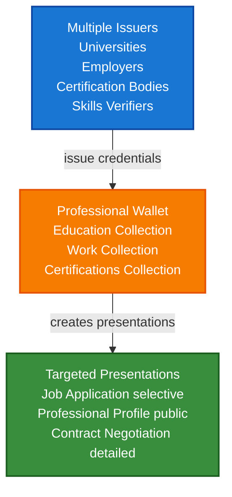

# Professional Identity Wallet Scenario

This guide demonstrates how professionals can build a comprehensive digital identity wallet using VeriCore. You'll learn how to manage multiple credentials (education, work experience, certifications), organize them effectively, and create targeted presentations for different purposes.

## What You'll Build

By the end of this tutorial, you'll have:

- ✅ Created a professional identity wallet
- ✅ Stored multiple types of credentials (education, work, certifications)
- ✅ Organized credentials with collections and tags
- ✅ Created targeted presentations for different scenarios
- ✅ Implemented selective disclosure for privacy
- ✅ Built a credential verification system

## Big Picture & Significance

### The Professional Identity Challenge

Professionals accumulate credentials throughout their careers, but managing them effectively is challenging. Traditional systems scatter credentials across platforms, make verification difficult, and don't respect privacy.

**Industry Context**:
- **Market Size**: Professional credential market growing rapidly with digital transformation
- **Credential Volume**: Professionals accumulate 10+ credentials over their careers
- **Verification Costs**: Employers spend significant time verifying credentials
- **Privacy Concerns**: Sharing all credentials reveals too much information
- **Portability**: Credentials tied to specific platforms limit mobility

**Why This Matters**:
1. **Professional Control**: Professionals own and control their credentials
2. **Privacy**: Selective disclosure protects sensitive information
3. **Efficiency**: Unified credential management saves time
4. **Verification**: Instant verification without intermediaries
5. **Portability**: Credentials work across platforms and borders
6. **Career Mobility**: Easy credential sharing enables career opportunities

### The Credential Management Problem

Traditional credential systems face critical issues:
- **Scattered Storage**: Credentials stored in different places
- **Verification Difficulty**: Employers must contact multiple sources
- **Privacy Issues**: Sharing everything reveals too much
- **No Portability**: Tied to specific platforms or institutions
- **No Organization**: Hard to find and manage credentials

## Value Proposition

### Problems Solved

1. **Unified Storage**: All credentials in one wallet
2. **Easy Organization**: Collections, tags, and metadata
3. **Privacy Control**: Selective disclosure for different contexts
4. **Instant Verification**: Cryptographic proof without intermediaries
5. **Portability**: Credentials work across platforms
6. **Professional Control**: Professionals own their credentials
7. **Efficiency**: Streamlined credential management

### Business Benefits

**For Professionals**:
- **Control**: Own and control all credentials
- **Privacy**: Share only necessary information
- **Convenience**: Access credentials from any device
- **Portability**: Credentials work everywhere
- **Organization**: Easy credential management

**For Employers**:
- **Speed**: Instant verification
- **Trust**: Cryptographic proof of authenticity
- **Efficiency**: Streamlined hiring process
- **Cost**: Reduced verification costs

**For Credential Issuers**:
- **Efficiency**: Automated credential issuance
- **Compliance**: Meet regulatory requirements
- **Reputation**: Enhanced trust through verifiable credentials

### ROI Considerations

- **Time Savings**: 80% reduction in credential management time
- **Verification Costs**: 70-90% reduction in verification costs
- **Privacy**: Enhanced privacy protection
- **Career Opportunities**: Easier credential sharing enables opportunities

## Understanding the Problem

Professionals accumulate many credentials throughout their careers:

- **Education**: Degrees, certificates, courses
- **Work Experience**: Employment history, roles, achievements
- **Certifications**: Professional licenses, industry certifications
- **Skills**: Verified skills and competencies

Managing these credentials is challenging:

1. **Scattered**: Credentials are stored in different places
2. **Hard to verify**: Employers must contact multiple sources
3. **Privacy concerns**: Sharing everything reveals too much
4. **Not portable**: Tied to specific platforms or institutions

VeriCore solves this by providing:

- **Unified storage**: All credentials in one wallet
- **Easy organization**: Collections, tags, and metadata
- **Privacy control**: Selective disclosure for different contexts
- **Instant verification**: Cryptographic proof without intermediaries

## How It Works: Professional Identity Flow



## Prerequisites

- Java 21+
- Kotlin 2.2.0+
- Gradle 8.5+
- Basic understanding of Kotlin and coroutines

## Step 1: Add Dependencies

Add VeriCore dependencies to your `build.gradle.kts`:

```kotlin
dependencies {
    // Core VeriCore modules
    implementation("io.geoknoesis.vericore:vericore-core:1.0.0-SNAPSHOT")
    implementation("io.geoknoesis.vericore:vericore-json:1.0.0-SNAPSHOT")
    implementation("io.geoknoesis.vericore:vericore-kms:1.0.0-SNAPSHOT")
    implementation("io.geoknoesis.vericore:vericore-did:1.0.0-SNAPSHOT")
    implementation("io.geoknoesis.vericore:vericore-anchor:1.0.0-SNAPSHOT")
    
    // Test kit for in-memory implementations
    implementation("io.geoknoesis.vericore:vericore-testkit:1.0.0-SNAPSHOT")
    
    // Kotlinx Serialization
    implementation("org.jetbrains.kotlinx:kotlinx-serialization-json:1.6.0")
    
    // Coroutines
    implementation("org.jetbrains.kotlinx:kotlinx-coroutines-core:1.7.3")
}
```

## Step 2: Complete Example

Here's a complete example demonstrating professional identity management:

```kotlin
import io.geoknoesis.vericore.credential.models.VerifiableCredential
import io.geoknoesis.vericore.credential.models.VerifiablePresentation
import io.geoknoesis.vericore.credential.PresentationOptions
import io.geoknoesis.vericore.testkit.credential.InMemoryWallet
import io.geoknoesis.vericore.testkit.did.DidKeyMockMethod
import io.geoknoesis.vericore.testkit.kms.InMemoryKeyManagementService
import io.geoknoesis.vericore.did.DidMethodRegistry
import kotlinx.coroutines.runBlocking
import kotlinx.serialization.json.buildJsonObject
import kotlinx.serialization.json.put
import java.time.Instant
import java.time.temporal.ChronoUnit

fun main() = runBlocking {
    println("=== Professional Identity Wallet Scenario ===\n")
    
    // Step 1: Setup
    println("Step 1: Setting up services...")
    val kms = InMemoryKeyManagementService()
    val didMethod = DidKeyMockMethod(kms)
    val didRegistry = DidMethodRegistry().apply { register(didMethod) }
    
    val professionalDid = didMethod.createDid()
    println("Professional DID: ${professionalDid.id}")
    
    // Step 2: Create professional wallet
    println("\nStep 2: Creating professional wallet...")
    val wallet = InMemoryWallet(
        walletDid = professionalDid.id,
        holderDid = professionalDid.id
    )
    println("Wallet created: ${wallet.walletId}")
    
    // Step 3: Store education credentials
    println("\nStep 3: Storing education credentials...")
    val bachelorDegree = createEducationCredential(
        issuerDid = "did:key:university",
        holderDid = professionalDid.id,
        degreeType = "Bachelor",
        field = "Computer Science",
        institution = "Tech University",
        year = "2018"
    )
    val bachelorId = wallet.store(bachelorDegree)
    
    val masterDegree = createEducationCredential(
        issuerDid = "did:key:university",
        holderDid = professionalDid.id,
        degreeType = "Master",
        field = "Software Engineering",
        institution = "Tech University",
        year = "2020"
    )
    val masterId = wallet.store(masterDegree)
    
    println("Stored ${wallet.list().size} education credentials")
    
    // Step 4: Store work experience credentials
    println("\nStep 4: Storing work experience credentials...")
    val job1 = createEmploymentCredential(
        issuerDid = "did:key:company1",
        holderDid = professionalDid.id,
        company = "Tech Corp",
        role = "Software Engineer",
        startDate = "2020-06-01",
        endDate = "2022-12-31",
        achievements = listOf(
            "Led development of microservices architecture",
            "Mentored 3 junior developers",
            "Increased system performance by 40%"
        )
    )
    val job1Id = wallet.store(job1)
    
    val job2 = createEmploymentCredential(
        issuerDid = "did:key:company2",
        holderDid = professionalDid.id,
        company = "Innovation Labs",
        role = "Senior Software Engineer",
        startDate = "2023-01-01",
        endDate = null, // Current position
        achievements = listOf(
            "Architected cloud-native platform",
            "Reduced infrastructure costs by 30%"
        )
    )
    val job2Id = wallet.store(job2)
    
    println("Stored ${wallet.list().size} total credentials")
    
    // Step 5: Store certifications
    println("\nStep 5: Storing certifications...")
    val awsCert = createCertificationCredential(
        issuerDid = "did:key:aws",
        holderDid = professionalDid.id,
        certificationName = "AWS Certified Solutions Architect",
        issuer = "Amazon Web Services",
        issueDate = "2021-03-15",
        expirationDate = "2024-03-15",
        credentialId = "AWS-12345"
    )
    val awsCertId = wallet.store(awsCert)
    
    val kubernetesCert = createCertificationCredential(
        issuerDid = "did:key:cncf",
        holderDid = professionalDid.id,
        certificationName = "Certified Kubernetes Administrator",
        issuer = "Cloud Native Computing Foundation",
        issueDate = "2022-06-20",
        expirationDate = "2025-06-20",
        credentialId = "CKA-67890"
    )
    val k8sCertId = wallet.store(kubernetesCert)
    
    println("Stored ${wallet.list().size} total credentials")
    
    // Step 6: Organize credentials
    println("\nStep 6: Organizing credentials...")
    
    // Create collections
    val educationCollection = wallet.createCollection(
        name = "Education",
        description = "Academic degrees and certificates"
    )
    val workCollection = wallet.createCollection(
        name = "Work Experience",
        description = "Employment history and achievements"
    )
    val certificationsCollection = wallet.createCollection(
        name = "Certifications",
        description = "Professional licenses and certifications"
    )
    
    // Add credentials to collections
    wallet.addToCollection(bachelorId, educationCollection)
    wallet.addToCollection(masterId, educationCollection)
    wallet.addToCollection(job1Id, workCollection)
    wallet.addToCollection(job2Id, workCollection)
    wallet.addToCollection(awsCertId, certificationsCollection)
    wallet.addToCollection(k8sCertId, certificationsCollection)
    
    // Add tags
    wallet.tagCredential(bachelorId, setOf("education", "degree", "bachelor", "computer-science"))
    wallet.tagCredential(masterId, setOf("education", "degree", "master", "software-engineering"))
    wallet.tagCredential(job1Id, setOf("work", "employment", "software-engineer", "completed"))
    wallet.tagCredential(job2Id, setOf("work", "employment", "senior-engineer", "current"))
    wallet.tagCredential(awsCertId, setOf("certification", "cloud", "aws", "active"))
    wallet.tagCredential(k8sCertId, setOf("certification", "kubernetes", "cncf", "active"))
    
    // Add metadata
    wallet.addMetadata(bachelorId, mapOf(
        "gpa" to "3.8",
        "honors" to "Summa Cum Laude"
    ))
    wallet.addMetadata(job1Id, mapOf(
        "salary_range" to "confidential",
        "team_size" to 8
    ))
    
    println("Created ${wallet.listCollections().size} collections")
    println("Total tags: ${wallet.getAllTags().size}")
    
    // Step 7: Query credentials
    println("\nStep 7: Querying credentials...")
    
    // Find all active certifications
    val activeCerts = wallet.query {
        byType("CertificationCredential")
        notExpired()
        valid()
    }
    println("Active certifications: ${activeCerts.size}")
    
    // Find current employment
    val currentJobs = wallet.query {
        byType("EmploymentCredential")
        // Add custom filter for current positions
    }
    println("Current positions: ${currentJobs.size}")
    
    // Find credentials by tag
    val cloudCredentials = wallet.findByTag("cloud")
    println("Cloud-related credentials: ${cloudCredentials.size}")
    
    // Step 8: Create targeted presentations
    println("\nStep 8: Creating targeted presentations...")
    
    // Presentation for job application (selective disclosure)
    val jobApplicationPresentation = wallet.createSelectiveDisclosure(
        credentialIds = listOf(masterId, job1Id, job2Id, awsCertId),
        disclosedFields = listOf(
            "degree.field",
            "degree.institution",
            "degree.year",
            "employment.company",
            "employment.role",
            "employment.startDate",
            "certification.name",
            "certification.issuer"
            // GPA, salary, and other sensitive info NOT disclosed
        ),
        holderDid = professionalDid.id,
        options = PresentationOptions(
            holderDid = professionalDid.id,
            proofType = "Ed25519Signature2020",
            challenge = "job-application-${Instant.now().toEpochMilli()}"
        )
    )
    println("Job application presentation created with ${jobApplicationPresentation.verifiableCredential.size} credentials")
    
    // Presentation for professional profile (public)
    val profilePresentation = wallet.createPresentation(
        credentialIds = listOf(masterId, job2Id, awsCertId, k8sCertId),
        holderDid = professionalDid.id,
        options = PresentationOptions(
            holderDid = professionalDid.id,
            proofType = "Ed25519Signature2020"
        )
    )
    println("Professional profile presentation created")
    
    // Step 9: Archive old credentials
    println("\nStep 9: Archiving old credentials...")
    // Archive first job since it's completed
    wallet.archive(job1Id)
    val archived = wallet.getArchived()
    println("Archived credentials: ${archived.size}")
    
    // Step 10: Wallet statistics
    println("\nStep 10: Wallet statistics...")
    val stats = wallet.getStatistics()
    println("""
        Total credentials: ${stats.totalCredentials}
        Valid credentials: ${stats.validCredentials}
        Expired credentials: ${stats.expiredCredentials}
        Collections: ${stats.collectionsCount}
        Tags: ${stats.tagsCount}
        Archived: ${stats.archivedCount}
    """.trimIndent())
    
    // Step 11: Export for different purposes
    println("\nStep 11: Exporting credentials for different purposes...")
    
    // Export education credentials only
    val educationCreds = wallet.getCredentialsInCollection(educationCollection)
    println("Education credentials available for export: ${educationCreds.size}")
    
    // Export active certifications
    val activeCertifications = wallet.query {
        byType("CertificationCredential")
        notExpired()
    }
    println("Active certifications available: ${activeCertifications.size}")
    
    println("\n=== Scenario Complete ===")
}

fun createEducationCredential(
    issuerDid: String,
    holderDid: String,
    degreeType: String,
    field: String,
    institution: String,
    year: String
): VerifiableCredential {
    return VerifiableCredential(
        id = "https://example.edu/credentials/${degreeType.lowercase()}-${holderDid.substringAfterLast(":")}",
        type = listOf("VerifiableCredential", "EducationCredential", "${degreeType}DegreeCredential"),
        issuer = issuerDid,
        credentialSubject = buildJsonObject {
            put("id", holderDid)
            put("degree", buildJsonObject {
                put("type", degreeType)
                put("field", field)
                put("institution", institution)
                put("year", year)
            })
        },
        issuanceDate = Instant.now().toString(),
        expirationDate = null // Education credentials typically don't expire
    )
}

fun createEmploymentCredential(
    issuerDid: String,
    holderDid: String,
    company: String,
    role: String,
    startDate: String,
    endDate: String?,
    achievements: List<String>
): VerifiableCredential {
    return VerifiableCredential(
        id = "https://example.com/employment/${company.lowercase()}-${holderDid.substringAfterLast(":")}",
        type = listOf("VerifiableCredential", "EmploymentCredential"),
        issuer = issuerDid,
        credentialSubject = buildJsonObject {
            put("id", holderDid)
            put("employment", buildJsonObject {
                put("company", company)
                put("role", role)
                put("startDate", startDate)
                if (endDate != null) {
                    put("endDate", endDate)
                } else {
                    put("current", true)
                }
                put("achievements", achievements)
            })
        },
        issuanceDate = Instant.now().toString(),
        expirationDate = null
    )
}

fun createCertificationCredential(
    issuerDid: String,
    holderDid: String,
    certificationName: String,
    issuer: String,
    issueDate: String,
    expirationDate: String,
    credentialId: String
): VerifiableCredential {
    return VerifiableCredential(
        id = "https://example.com/certifications/$credentialId",
        type = listOf("VerifiableCredential", "CertificationCredential"),
        issuer = issuerDid,
        credentialSubject = buildJsonObject {
            put("id", holderDid)
            put("certification", buildJsonObject {
                put("name", certificationName)
                put("issuer", issuer)
                put("issueDate", issueDate)
                put("expirationDate", expirationDate)
                put("credentialId", credentialId)
            })
        },
        issuanceDate = issueDate,
        expirationDate = expirationDate
    )
}
```

## Key Features Demonstrated

### 1. Multi-Type Credential Management

Store different types of credentials in one wallet:

```kotlin
// Education
val degreeId = wallet.store(bachelorDegree)

// Work Experience
val jobId = wallet.store(employmentCredential)

// Certifications
val certId = wallet.store(certificationCredential)
```

### 2. Organization with Collections

Group related credentials:

```kotlin
val educationCollection = wallet.createCollection("Education")
val workCollection = wallet.createCollection("Work Experience")
val certCollection = wallet.createCollection("Certifications")

wallet.addToCollection(degreeId, educationCollection)
wallet.addToCollection(jobId, workCollection)
wallet.addToCollection(certId, certCollection)
```

### 3. Tagging for Easy Discovery

Tag credentials for flexible querying:

```kotlin
wallet.tagCredential(degreeId, setOf("education", "degree", "bachelor"))
wallet.tagCredential(jobId, setOf("work", "employment", "current"))
wallet.tagCredential(certId, setOf("certification", "cloud", "active"))

// Find by tag
val cloudCreds = wallet.findByTag("cloud")
```

### 4. Selective Disclosure

Share only what's needed:

```kotlin
val presentation = wallet.createSelectiveDisclosure(
    credentialIds = listOf(degreeId, jobId),
    disclosedFields = listOf(
        "degree.field",
        "degree.institution",
        "employment.company",
        "employment.role"
        // GPA, salary, etc. NOT disclosed
    ),
    holderDid = holderDid,
    options = PresentationOptions(...)
)
```

### 5. Advanced Querying

Find credentials efficiently:

```kotlin
// Active certifications
val activeCerts = wallet.query {
    byType("CertificationCredential")
    notExpired()
    valid()
}

// Current employment
val currentJobs = wallet.query {
    byType("EmploymentCredential")
    // Add custom logic for current positions
}

// By issuer
val universityCreds = wallet.query {
    byIssuer("did:key:university")
}
```

## Real-World Use Cases

### Job Application

Create a presentation showing relevant credentials:

```kotlin
fun createJobApplicationPresentation(
    wallet: Wallet,
    jobRequirements: List<String>
): VerifiablePresentation {
    // Find relevant credentials based on job requirements
    val relevantCreds = findRelevantCredentials(wallet, jobRequirements)
    
    return wallet.createSelectiveDisclosure(
        credentialIds = relevantCreds.map { it.id!! },
        disclosedFields = listOf(
            "degree.field",
            "degree.institution",
            "employment.role",
            "certification.name"
        ),
        holderDid = wallet.holderDid,
        options = PresentationOptions(
            holderDid = wallet.holderDid,
            challenge = "job-application-${UUID.randomUUID()}"
        )
    )
}
```

### Professional Profile

Create a public profile:

```kotlin
fun createProfessionalProfile(wallet: Wallet): VerifiablePresentation {
    val publicCreds = wallet.query {
        byTypes("EducationCredential", "CertificationCredential")
        valid()
    }
    
    return wallet.createPresentation(
        credentialIds = publicCreds.mapNotNull { it.id },
        holderDid = wallet.holderDid,
        options = PresentationOptions(
            holderDid = wallet.holderDid,
            proofType = "Ed25519Signature2020"
        )
    )
}
```

### Contract Negotiation

Share detailed credentials:

```kotlin
fun createDetailedPresentation(wallet: Wallet): VerifiablePresentation {
    val allCreds = wallet.list()
    
    return wallet.createPresentation(
        credentialIds = allCreds.mapNotNull { it.id },
        holderDid = wallet.holderDid,
        options = PresentationOptions(
            holderDid = wallet.holderDid,
            challenge = "contract-negotiation-${UUID.randomUUID()}"
        )
    )
}
```

## Best Practices

1. **Organize Early**: Create collections and tags when storing credentials
2. **Use Selective Disclosure**: Only share what's necessary
3. **Archive Old Credentials**: Keep history but hide from normal queries
4. **Tag Consistently**: Use consistent tagging conventions
5. **Verify Before Storing**: Always verify credentials before storing
6. **Monitor Expiration**: Regularly check for expired credentials

## Benefits

1. **Unified Management**: All credentials in one place
2. **Easy Organization**: Collections and tags for quick access
3. **Privacy Control**: Selective disclosure for different contexts
4. **Instant Verification**: Cryptographic proof without intermediaries
5. **Portable**: You control your credentials

## Next Steps

- Learn about [Wallet API Tutorial](../tutorials/wallet-api-tutorial.md)
- Explore [Academic Credentials Scenario](academic-credentials-scenario.md)
- Check out [Verifiable Credentials](../core-concepts/verifiable-credentials.md)

