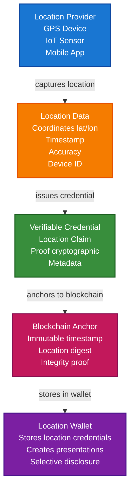

# Proof of Location Scenario

This guide demonstrates how to implement proof of location credentials using VeriCore, inspired by decentralized geospatial web concepts. You'll learn how to create location-based verifiable credentials, anchor them to blockchains for tamper-proof verification, and build a system for geospatial data integrity.

## What You'll Build

By the end of this tutorial, you'll have:

- ✅ Created DIDs for location providers and verifiers
- ✅ Issued Verifiable Credentials proving location claims
- ✅ Anchored location proofs to blockchain for immutability
- ✅ Built a location verification system
- ✅ Created location-based presentations with selective disclosure
- ✅ Implemented geospatial data integrity verification

## Big Picture & Significance

### The Location Verification Challenge

Location data is critical for many applications, but verifying location claims and protecting privacy are fundamental challenges. Traditional systems rely on central authorities and don't protect user privacy.

**Industry Context**:
- **Market Size**: Location-based services market projected to reach $157 billion by 2026
- **Privacy Concerns**: Location data is highly sensitive
- **Trust Requirements**: Need to verify location claims for critical applications
- **Regulatory Pressure**: GDPR and other regulations require location data protection
- **Decentralization**: Growing demand for decentralized location verification

**Why This Matters**:
1. **Privacy**: Protect sensitive location data
2. **Trust**: Verify location claims cryptographically
3. **Decentralization**: Avoid reliance on central authorities
4. **Integrity**: Ensure location data hasn't been tampered with
5. **Selective Disclosure**: Share location without revealing exact coordinates
6. **Compliance**: Meet regulatory requirements for location data

### The Location Verification Problem

Traditional location systems face critical issues:
- **Centralized Trust**: Reliance on single authorities creates bottlenecks
- **Privacy Violations**: Location data often shared without consent
- **No Verification**: Can't verify location claims
- **No Integrity**: Location data can be tampered with
- **No Interoperability**: Different systems can't verify each other's claims

## Value Proposition

### Problems Solved

1. **Cryptographic Proof**: Location claims are cryptographically signed
2. **Privacy Protection**: Selective disclosure protects sensitive data
3. **Blockchain Anchoring**: Immutable proof of when/where data was created
4. **Verifiable Credentials**: Standard format for location claims
5. **Self-Sovereign**: Users control their location data
6. **Interoperability**: Standard format works across systems
7. **Decentralization**: No reliance on central authorities

### Business Benefits

**For Users**:
- **Privacy**: Control what location information is shared
- **Trust**: Verify location claims cryptographically
- **Control**: Own and control location data
- **Portability**: Location credentials work across platforms

**For Service Providers**:
- **Trust**: Verify location claims without intermediaries
- **Compliance**: Meet regulatory requirements
- **Efficiency**: Automated location verification
- **Innovation**: Enable new location-based services

**For Regulators**:
- **Audit Trails**: Complete location data records
- **Privacy**: Enhanced privacy protection
- **Compliance**: Meet regulatory requirements

### ROI Considerations

- **Privacy**: Enhanced privacy protection reduces liability
- **Trust**: Increased trust enables new use cases
- **Compliance**: Automated compliance reduces costs
- **Innovation**: Enable new location-based services

## Understanding the Problem

Geospatial data and location claims face several challenges:

1. **Trust**: How do you verify someone was actually at a location?
2. **Privacy**: Location data is highly sensitive and needs protection
3. **Integrity**: Geospatial data can be tampered with
4. **Provenance**: Need to track where location data came from
5. **Decentralization**: Avoid reliance on central authorities

VeriCore solves this by enabling:

- **Cryptographic proof**: Location claims are cryptographically signed
- **Selective disclosure**: Share location without revealing exact coordinates
- **Blockchain anchoring**: Immutable proof of when/where data was created
- **Verifiable credentials**: Standard format for location claims
- **Self-sovereign**: Users control their location data

## How It Works: Location Proof Flow



## Prerequisites

- Java 21+
- Kotlin 2.2.0+
- Gradle 8.5+
- Basic understanding of Kotlin and coroutines
- Basic understanding of geospatial concepts (coordinates, bounding boxes)

## Step 1: Add Dependencies

Add VeriCore dependencies to your `build.gradle.kts`:

```kotlin
dependencies {
    // Core VeriCore modules
    implementation("io.geoknoesis.vericore:vericore-core:1.0.0-SNAPSHOT")
    implementation("io.geoknoesis.vericore:vericore-json:1.0.0-SNAPSHOT")
    implementation("io.geoknoesis.vericore:vericore-kms:1.0.0-SNAPSHOT")
    implementation("io.geoknoesis.vericore:vericore-did:1.0.0-SNAPSHOT")
    implementation("io.geoknoesis.vericore:vericore-anchor:1.0.0-SNAPSHOT")
    
    // Test kit for in-memory implementations
    implementation("io.geoknoesis.vericore:vericore-testkit:1.0.0-SNAPSHOT")
    
    // Kotlinx Serialization
    implementation("org.jetbrains.kotlinx:kotlinx-serialization-json:1.6.0")
    
    // Coroutines
    implementation("org.jetbrains.kotlinx:kotlinx-coroutines-core:1.7.3")
}
```

## Step 2: Complete Example

Here's a complete example demonstrating proof of location:

```kotlin
import io.geoknoesis.vericore.credential.models.VerifiableCredential
import io.geoknoesis.vericore.credential.models.VerifiablePresentation
import io.geoknoesis.vericore.credential.CredentialIssuanceOptions
import io.geoknoesis.vericore.credential.CredentialVerificationOptions
import io.geoknoesis.vericore.credential.PresentationOptions
import io.geoknoesis.vericore.credential.issuer.CredentialIssuer
import io.geoknoesis.vericore.credential.verifier.CredentialVerifier
import io.geoknoesis.vericore.credential.proof.Ed25519ProofGenerator
import io.geoknoesis.vericore.credential.proof.ProofGeneratorRegistry
import io.geoknoesis.vericore.testkit.credential.InMemoryWallet
import io.geoknoesis.vericore.testkit.did.DidKeyMockMethod
import io.geoknoesis.vericore.testkit.kms.InMemoryKeyManagementService
import io.geoknoesis.vericore.testkit.anchor.InMemoryBlockchainAnchorClient
import io.geoknoesis.vericore.anchor.BlockchainRegistry
import io.geoknoesis.vericore.anchor.anchorTyped
import io.geoknoesis.vericore.anchor.AnchorResult
import io.geoknoesis.vericore.anchor.readTyped
import kotlinx.serialization.json.Json

@Serializable
data class LocationClaim(
    val latitude: Double,
    val longitude: Double,
    val accuracy: Double, // meters
    val altitude: Double? = null,
    val timestamp: String,
    val deviceId: String,
    val locationMethod: String = "GPS" // GPS, WiFi, Cell Tower, etc.
)

@Serializable
data class LocationProof(
    val locationClaim: LocationClaim,
    val credentialDigest: String,
    val anchorRef: String? = null
)

fun main() = runBlocking {
    println("=== Proof of Location Scenario ===\n")
    
    // Step 1: Setup services
    println("Step 1: Setting up services...")
    val locationProviderKms = InMemoryKeyManagementService()
    val verifierKms = InMemoryKeyManagementService()
    
    val didMethod = DidKeyMockMethod(locationProviderKms)
    DidRegistry.register(didMethod)
    
    // Setup blockchain for anchoring
    val anchorClient = InMemoryBlockchainAnchorClient("eip155:1", emptyMap())
    BlockchainRegistry.register("eip155:1", anchorClient)
    
    // Step 2: Create DIDs
    println("\nStep 2: Creating DIDs...")
    val locationProviderDid = didMethod.createDid(mapOf("algorithm" to "Ed25519"))
    println("Location Provider DID: ${locationProviderDid.id}")
    
    val deviceDid = didMethod.createDid(mapOf("algorithm" to "Ed25519"))
    println("Device DID: ${deviceDid.id}")
    
    // Step 3: Create location wallet
    println("\nStep 3: Creating location wallet...")
    val locationWallet = InMemoryWallet(
        walletDid = deviceDid.id,
        holderDid = deviceDid.id
    )
    println("Location wallet created: ${locationWallet.walletId}")
    
    // Step 4: Capture location data
    println("\nStep 4: Capturing location data...")
    val locationClaim = LocationClaim(
        latitude = 37.7749,
        longitude = -122.4194,
        accuracy = 10.5, // 10.5 meters accuracy
        altitude = 52.0,
        timestamp = Instant.now().toString(),
        deviceId = deviceDid.id,
        locationMethod = "GPS"
    )
    println("Location captured:")
    println("  - Coordinates: (${locationClaim.latitude}, ${locationClaim.longitude})")
    println("  - Accuracy: ${locationClaim.accuracy} meters")
    println("  - Timestamp: ${locationClaim.timestamp}")
    
    // Step 5: Create location credential
    println("\nStep 5: Creating location credential...")
    val locationCredential = VerifiableCredential(
        id = "https://example.com/location/${deviceDid.id.substringAfterLast(":")}-${Instant.now().toEpochMilli()}",
        type = listOf("VerifiableCredential", "LocationCredential", "ProofOfLocation"),
        issuer = locationProviderDid.id,
        credentialSubject = buildJsonObject {
            put("id", deviceDid.id)
            put("location", buildJsonObject {
                put("latitude", locationClaim.latitude)
                put("longitude", locationClaim.longitude)
                put("accuracy", locationClaim.accuracy)
                locationClaim.altitude?.let { put("altitude", it) }
                put("timestamp", locationClaim.timestamp)
                put("deviceId", locationClaim.deviceId)
                put("locationMethod", locationClaim.locationMethod)
            })
        },
        issuanceDate = Instant.now().toString(),
        expirationDate = null, // Location proofs typically don't expire
        credentialSchema = io.geoknoesis.vericore.credential.models.CredentialSchema(
            id = "https://example.com/schemas/location.json",
            type = "JsonSchemaValidator2018",
            schemaFormat = io.geoknoesis.vericore.spi.SchemaFormat.JSON_SCHEMA
        )
    )
    
    // Step 6: Issue credential with proof
    println("\nStep 6: Issuing credential with proof...")
    val issuerKey = locationProviderKms.generateKey("Ed25519")
    val proofGenerator = Ed25519ProofGenerator(
        signer = { data, keyId -> locationProviderKms.sign(keyId, data) },
        getPublicKeyId = { keyId -> issuerKey.id }
    )
    ProofGeneratorRegistry.register(proofGenerator)
    
    val credentialIssuer = CredentialIssuer(
        proofGenerator = proofGenerator,
        resolveDid = { did -> DidRegistry.resolve(did).document != null }
    )
    
    val issuedCredential = credentialIssuer.issue(
        credential = locationCredential,
        issuerDid = locationProviderDid.id,
        keyId = issuerKey.id,
        options = CredentialIssuanceOptions(proofType = "Ed25519Signature2020")
    )
    
    println("Credential issued:")
    println("  - Type: ${issuedCredential.type}")
    println("  - Has proof: ${issuedCredential.proof != null}")
    
    // Step 7: Compute digest and anchor to blockchain
    println("\nStep 7: Anchoring location proof to blockchain...")
    val credentialDigest = DigestUtils.sha256DigestMultibase(
        kotlinx.serialization.json.Json.encodeToJsonElement(
            io.geoknoesis.vericore.credential.models.VerifiableCredential.serializer(),
            issuedCredential
        )
    )
    
    val locationProof = LocationProof(
        locationClaim = locationClaim,
        credentialDigest = credentialDigest
    )
    
    val anchorResult = anchorTyped(
        value = locationProof,
        serializer = LocationProof.serializer(),
        targetChainId = "eip155:1"
    )
    
    println("Location proof anchored:")
    println("  - Transaction hash: ${anchorResult.ref.txHash}")
    println("  - Chain ID: ${anchorResult.ref.chainId}")
    println("  - Digest: $credentialDigest")
    
    // Step 8: Store credential in wallet
    println("\nStep 8: Storing credential in wallet...")
    val credentialId = locationWallet.store(issuedCredential)
    println("Credential stored with ID: $credentialId")
    
    // Step 9: Organize location credentials
    println("\nStep 9: Organizing location credentials...")
    val locationCollection = locationWallet.createCollection(
        name = "Location History",
        description = "Historical location proofs"
    )
    locationWallet.addToCollection(credentialId, locationCollection)
    
    // Tag by location type
    val locationTags = when {
        locationClaim.latitude > 37.7 && locationClaim.latitude < 37.8 -> 
            setOf("san-francisco", "california", "usa", "gps")
        else -> setOf("location", "gps", "verified")
    }
    locationWallet.tagCredential(credentialId, locationTags)
    
    // Add metadata
    locationWallet.addMetadata(credentialId, mapOf(
        "city" to "San Francisco",
        "country" to "USA",
        "anchorTxHash" to anchorResult.ref.txHash,
        "accuracy" to locationClaim.accuracy
    ))
    
    println("Created collection: $locationCollection")
    println("Added tags: ${locationTags.joinToString()}")
    
    // Step 10: Query location credentials
    println("\nStep 10: Querying location credentials...")
    val recentLocations = locationWallet.query {
        byType("LocationCredential")
        valid()
    }
    println("Found ${recentLocations.size} valid location credentials")
    
    // Find locations in specific area (using tags)
    val sfLocations = locationWallet.findByTag("san-francisco")
    println("San Francisco locations: ${sfLocations.size}")
    
    // Step 11: Create location presentation with selective disclosure
    println("\nStep 11: Creating location presentation...")
    
    // Selective disclosure: reveal approximate location but not exact coordinates
    val approximatePresentation = locationWallet.createSelectiveDisclosure(
        credentialIds = listOf(credentialId),
        disclosedFields = listOf(
            "location.timestamp",
            "location.locationMethod"
            // Exact coordinates NOT disclosed for privacy
        ),
        holderDid = deviceDid.id,
        options = PresentationOptions(
            holderDid = deviceDid.id,
            proofType = "Ed25519Signature2020",
            challenge = "location-verification-${Instant.now().toEpochMilli()}"
        )
    )
    println("Approximate location presentation created (coordinates hidden)")
    
    // Full location presentation (for trusted verifiers)
    val fullPresentation = locationWallet.createPresentation(
        credentialIds = listOf(credentialId),
        holderDid = deviceDid.id,
        options = PresentationOptions(
            holderDid = deviceDid.id,
            proofType = "Ed25519Signature2020",
            challenge = "full-location-verification"
        )
    )
    println("Full location presentation created")
    
    // Step 12: Verify location credential
    println("\nStep 12: Verifying location credential...")
    val verifier = CredentialVerifier(
        resolveDid = { did -> DidRegistry.resolve(did).document != null }
    )
    
    val verificationResult = verifier.verify(
        credential = issuedCredential,
        options = CredentialVerificationOptions(
            checkRevocation = true,
            checkExpiration = false, // Location proofs don't expire
            validateSchema = true
        )
    )
    
    if (verificationResult.valid) {
        println("✅ Location credential is valid!")
        println("  - Proof valid: ${verificationResult.proofValid}")
        println("  - Issuer valid: ${verificationResult.issuerValid}")
        println("  - Schema valid: ${verificationResult.schemaValid}")
    } else {
        println("❌ Location credential verification failed:")
        verificationResult.errors.forEach { println("  - $it") }
    }
    
    // Step 13: Verify blockchain anchor
    println("\nStep 13: Verifying blockchain anchor...")
    val retrievedProof = io.geoknoesis.vericore.anchor.readTyped<LocationProof>(
        ref = anchorResult.ref,
        serializer = LocationProof.serializer()
    )
    
    val retrievedDigest = retrievedProof.credentialDigest
    if (retrievedDigest == credentialDigest) {
        println("✅ Blockchain anchor verified!")
        println("  - Digest matches: $retrievedDigest")
        println("  - Location proof is immutable")
    } else {
        println("❌ Digest mismatch - location proof may have been tampered with")
    }
    
    // Step 14: Location-based queries
    println("\nStep 14: Location-based queries...")
    val stats = locationWallet.getStatistics()
    println("""
        Location Wallet Statistics:
        - Total location credentials: ${stats.totalCredentials}
        - Valid credentials: ${stats.validCredentials}
        - Collections: ${stats.collectionsCount}
        - Tags: ${stats.tagsCount}
    """.trimIndent())
    
    println("\n=== Scenario Complete ===")
}
```

## Step-by-Step Breakdown

### Step 1: Setup Services

Create key management services and blockchain client:

```kotlin
val locationProviderKms = InMemoryKeyManagementService()
val anchorClient = InMemoryBlockchainAnchorClient("eip155:1", emptyMap())
BlockchainRegistry.register("eip155:1", anchorClient)
```

### Step 2: Create Location Claim

Capture location data from device:

```kotlin
val locationClaim = LocationClaim(
    latitude = 37.7749,
    longitude = -122.4194,
    accuracy = 10.5, // meters
    timestamp = Instant.now().toString(),
    deviceId = deviceDid.id,
    locationMethod = "GPS"
)
```

### Step 3: Create Location Credential

Create a verifiable credential for the location:

```kotlin
val locationCredential = VerifiableCredential(
    type = listOf("VerifiableCredential", "LocationCredential"),
    issuer = locationProviderDid.id,
    credentialSubject = buildJsonObject {
        put("location", buildJsonObject {
            put("latitude", locationClaim.latitude)
            put("longitude", locationClaim.longitude)
            put("accuracy", locationClaim.accuracy)
            put("timestamp", locationClaim.timestamp)
        })
    },
    issuanceDate = Instant.now().toString()
)
```

### Step 4: Issue and Anchor

Issue credential and anchor to blockchain:

```kotlin
val issuedCredential = credentialIssuer.issue(...)

val credentialDigest = DigestUtils.sha256DigestMultibase(
    Json.encodeToJsonElement(issuedCredential)
)

val locationProof = LocationProof(
    locationClaim = locationClaim,
    credentialDigest = credentialDigest
)

val anchorResult = anchorTyped(
    value = locationProof,
    serializer = LocationProof.serializer(),
    targetChainId = "eip155:1"
)
```

### Step 5: Store and Organize

Store in wallet and organize:

```kotlin
val credentialId = locationWallet.store(issuedCredential)

val locationCollection = locationWallet.createCollection("Location History")
locationWallet.addToCollection(credentialId, locationCollection)
locationWallet.tagCredential(credentialId, setOf("san-francisco", "gps"))
```

### Step 6: Selective Disclosure

Share location with privacy:

```kotlin
// Approximate location (privacy-preserving)
val approximatePresentation = locationWallet.createSelectiveDisclosure(
    credentialIds = listOf(credentialId),
    disclosedFields = listOf(
        "location.timestamp",
        "location.locationMethod"
        // Coordinates hidden
    ),
    holderDid = deviceDid.id,
    options = PresentationOptions(...)
)
```

## Advanced Geospatial Features

### Geofencing Verification

Verify location within a geographic boundary:

```kotlin
fun verifyLocationInGeofence(
    credential: VerifiableCredential,
    minLat: Double,
    maxLat: Double,
    minLon: Double,
    maxLon: Double
): Boolean {
    val location = credential.credentialSubject.jsonObject["location"]?.jsonObject
        ?: return false
    
    val lat = location["latitude"]?.jsonPrimitive?.content?.toDouble() ?: return false
    val lon = location["longitude"]?.jsonPrimitive?.content?.toDouble() ?: return false
    
    return lat in minLat..maxLat && lon in minLon..maxLon
}

// Usage: Verify device is in San Francisco
val inSF = verifyLocationInGeofence(
    credential = issuedCredential,
    minLat = 37.7,
    maxLat = 37.8,
    minLon = -122.5,
    maxLon = -122.3
)
```

### Distance-Based Verification

Verify location within a certain distance:

```kotlin
fun verifyLocationWithinDistance(
    credential: VerifiableCredential,
    targetLat: Double,
    targetLon: Double,
    maxDistance: Double // meters
): Boolean {
    val location = credential.credentialSubject.jsonObject["location"]?.jsonObject
        ?: return false
    
    val lat = location["latitude"]?.jsonPrimitive?.content?.toDouble() ?: return false
    val lon = location["longitude"]?.jsonPrimitive?.content?.toDouble() ?: return false
    val accuracy = location["accuracy"]?.jsonPrimitive?.content?.toDouble() ?: Double.MAX_VALUE
    
    val distance = calculateHaversineDistance(lat, lon, targetLat, targetLon)
    
    // Account for location accuracy
    return distance <= (maxDistance + accuracy)
}

// Haversine formula for great-circle distance
fun calculateHaversineDistance(
    lat1: Double,
    lon1: Double,
    lat2: Double,
    lon2: Double
): Double {
    val earthRadius = 6371000.0 // meters
    val dLat = Math.toRadians(lat2 - lat1)
    val dLon = Math.toRadians(lon2 - lon1)
    val a = Math.sin(dLat / 2) * Math.sin(dLat / 2) +
            Math.cos(Math.toRadians(lat1)) * Math.cos(Math.toRadians(lat2)) *
            Math.sin(dLon / 2) * Math.sin(dLon / 2)
    val c = 2 * Math.atan2(Math.sqrt(a), Math.sqrt(1 - a))
    return earthRadius * c
}

### Privacy-Preserving Location Sharing

Share location without revealing exact coordinates:

```kotlin
fun createPrivacyPreservingLocationPresentation(
    wallet: Wallet,
    credentialId: String,
    privacyLevel: PrivacyLevel
): VerifiablePresentation {
    return when (privacyLevel) {
        PrivacyLevel.EXACT -> {
            // Share exact coordinates
            wallet.createPresentation(
                credentialIds = listOf(credentialId),
                holderDid = wallet.holderDid,
                options = PresentationOptions(...)
            )
        }
        PrivacyLevel.APPROXIMATE -> {
            // Share approximate location (rounded coordinates)
            wallet.createSelectiveDisclosure(
                credentialIds = listOf(credentialId),
                disclosedFields = listOf(
                    "location.timestamp",
                    "location.locationMethod"
                    // Coordinates rounded/obfuscated
                ),
                holderDid = wallet.holderDid,
                options = PresentationOptions(...)
            )
        }
        PrivacyLevel.REGION -> {
            // Share only region/city, not coordinates
            wallet.createSelectiveDisclosure(
                credentialIds = listOf(credentialId),
                disclosedFields = listOf(
                    "location.timestamp"
                    // Only timestamp, no coordinates
                ),
                holderDid = wallet.holderDid,
                options = PresentationOptions(...)
            )
        }
    }
}

enum class PrivacyLevel {
    EXACT,      // Exact coordinates
    APPROXIMATE, // Approximate location
    REGION      // Region only
}
```

data class BoundingBox(
    val minLat: Double,
    val maxLat: Double,
    val minLon: Double,
    val maxLon: Double
)

## Real-World Use Cases

### 1. Emergency Response (NG9-1-1)

Verify caller location for emergency services:

```kotlin
fun createEmergencyLocationCredential(
    callerDid: String,
    location: LocationClaim,
    emergencyType: String
): VerifiableCredential {
    return VerifiableCredential(
        type = listOf("VerifiableCredential", "EmergencyLocationCredential"),
        issuer = emergencyServiceDid.id,
        credentialSubject = buildJsonObject {
            put("id", callerDid)
            put("emergencyType", emergencyType)
            put("location", buildJsonObject {
                put("latitude", location.latitude)
                put("longitude", location.longitude)
                put("accuracy", location.accuracy)
                put("timestamp", location.timestamp)
            })
        },
        issuanceDate = Instant.now().toString()
    )
}
```

### 2. Vehicular Network Security

Prevent Sybil attacks in VANETs using location proofs:

```kotlin
fun createVehicleLocationProof(
    vehicleDid: String,
    location: LocationClaim,
    roadsideUnitDid: String
): VerifiableCredential {
    return VerifiableCredential(
        type = listOf("VerifiableCredential", "VehicleLocationProof"),
        issuer = roadsideUnitDid,
        credentialSubject = buildJsonObject {
            put("id", vehicleDid)
            put("location", buildJsonObject {
                put("latitude", location.latitude)
                put("longitude", location.longitude)
                put("timestamp", location.timestamp)
            })
            put("roadsideUnit", roadsideUnitDid)
        },
        issuanceDate = location.timestamp
    )
}

// Verify vehicle trajectory using multiple proofs
fun verifyVehicleTrajectory(
    locationProofs: List<VerifiableCredential>
): Boolean {
    // Check proofs are from different roadside units
    val issuers = locationProofs.map { it.issuer }.toSet()
    if (issuers.size < 2) return false // Need multiple sources
    
    // Verify temporal sequence
    val timestamps = locationProofs.mapNotNull { credential ->
        credential.credentialSubject.jsonObject["location"]?.jsonObject
            ?.get("timestamp")?.jsonPrimitive?.content
    }.sorted()
    
    // Check timestamps are sequential
    return timestamps.zipWithNext().all { (t1, t2) ->
        Instant.parse(t1).isBefore(Instant.parse(t2))
    }
}
```

### 3. Cloud Data Location Verification

Verify data is stored in authorized geographic locations:

```kotlin
fun createDataLocationCredential(
    dataHash: String,
    storageLocation: LocationClaim,
    dataCenterDid: String
): VerifiableCredential {
    return VerifiableCredential(
        type = listOf("VerifiableCredential", "DataLocationCredential"),
        issuer = dataCenterDid,
        credentialSubject = buildJsonObject {
            put("dataHash", dataHash)
            put("storageLocation", buildJsonObject {
                put("latitude", storageLocation.latitude)
                put("longitude", storageLocation.longitude)
                put("dataCenter", dataCenterDid)
                put("timestamp", storageLocation.timestamp)
            })
        },
        issuanceDate = storageLocation.timestamp
    )
}

// Verify data is in authorized region
fun verifyDataLocationCompliance(
    credential: VerifiableCredential,
    allowedRegions: List<BoundingBox>
): Boolean {
    val location = credential.credentialSubject.jsonObject["storageLocation"]?.jsonObject
        ?: return false
    
    val lat = location["latitude"]?.jsonPrimitive?.content?.toDouble() ?: return false
    val lon = location["longitude"]?.jsonPrimitive?.content?.toDouble() ?: return false
    
    return allowedRegions.any { region ->
        lat in region.minLat..region.maxLat && lon in region.minLon..region.maxLon
    }
}
```

### 4. Multimedia Content Authentication

Verify location where media was captured (like ProofMode):

```kotlin
fun createMediaLocationCredential(
    mediaHash: String,
    captureLocation: LocationClaim,
    deviceDid: String,
    mediaType: String
): VerifiableCredential {
    return VerifiableCredential(
        type = listOf("VerifiableCredential", "MediaLocationCredential"),
        issuer = deviceDid,
        credentialSubject = buildJsonObject {
            put("mediaHash", mediaHash)
            put("mediaType", mediaType)
            put("captureLocation", buildJsonObject {
                put("latitude", captureLocation.latitude)
                put("longitude", captureLocation.longitude)
                put("accuracy", captureLocation.accuracy)
                put("timestamp", captureLocation.timestamp)
            })
            put("deviceId", deviceDid)
        },
        issuanceDate = captureLocation.timestamp
    )
}

// Verify media authenticity
fun verifyMediaLocation(
    mediaHash: String,
    claimedLocation: Pair<Double, Double>,
    credential: VerifiableCredential
): Boolean {
    val credentialHash = credential.credentialSubject.jsonObject["mediaHash"]?.jsonPrimitive?.content
    if (credentialHash != mediaHash) return false
    
    val location = credential.credentialSubject.jsonObject["captureLocation"]?.jsonObject
        ?: return false
    
    val lat = location["latitude"]?.jsonPrimitive?.content?.toDouble() ?: return false
    val lon = location["longitude"]?.jsonPrimitive?.content?.toDouble() ?: return false
    
    val distance = calculateHaversineDistance(
        lat, lon,
        claimedLocation.first,
        claimedLocation.second
    )
    
    return distance < 100.0 // Within 100 meters
}
```

### 5. Supply Chain Tracking

Track products through supply chain with location proofs:

```kotlin
fun createSupplyChainLocationProof(
    productId: String,
    location: LocationClaim,
    facility: String,
    timestamp: String
): VerifiableCredential {
    return VerifiableCredential(
        type = listOf("VerifiableCredential", "SupplyChainLocationCredential"),
        issuer = facilityDid.id,
        credentialSubject = buildJsonObject {
            put("productId", productId)
            put("location", buildJsonObject {
                put("latitude", location.latitude)
                put("longitude", location.longitude)
                put("facility", facility)
                put("timestamp", timestamp)
            })
        },
        issuanceDate = timestamp
    )
}
```

### 6. IoT Device Location

Track IoT device locations:

```kotlin
fun createIoTLocationCredential(
    deviceId: String,
    location: LocationClaim,
    sensorData: Map<String, Any>
): VerifiableCredential {
    return VerifiableCredential(
        type = listOf("VerifiableCredential", "IoTLocationCredential"),
        issuer = iotGatewayDid.id,
        credentialSubject = buildJsonObject {
            put("deviceId", deviceId)
            put("location", buildJsonObject {
                put("latitude", location.latitude)
                put("longitude", location.longitude)
                put("accuracy", location.accuracy)
                put("timestamp", location.timestamp)
            })
            put("sensorData", sensorData)
        },
        issuanceDate = location.timestamp
    )
}
```

### Decentralized Geospatial Data Sharing

Share geospatial datasets with verifiable provenance:

```kotlin
@Serializable
data class GeospatialDataset(
    val datasetId: String,
    val name: String,
    val description: String,
    val boundingBox: BoundingBox,
    val dataHash: String,
    val format: String = "GeoJSON",
    val crs: String = "EPSG:4326",
    val providerDid: String,
    val timestamp: String
)

fun createGeospatialDatasetCredential(
    dataset: GeospatialDataset,
    issuerDid: String
): VerifiableCredential {
    return VerifiableCredential(
        type = listOf("VerifiableCredential", "GeospatialDatasetCredential"),
        issuer = issuerDid,
        credentialSubject = buildJsonObject {
            put("datasetId", dataset.datasetId)
            put("name", dataset.name)
            put("description", dataset.description)
            put("boundingBox", buildJsonObject {
                put("minLat", dataset.boundingBox.minLat)
                put("maxLat", dataset.boundingBox.maxLat)
                put("minLon", dataset.boundingBox.minLon)
                put("maxLon", dataset.boundingBox.maxLon)
            })
            put("dataHash", dataset.dataHash)
            put("format", dataset.format)
            put("crs", dataset.crs)
            put("providerDid", dataset.providerDid)
            put("timestamp", dataset.timestamp)
        },
        issuanceDate = dataset.timestamp
    )
}

// Anchor dataset metadata to blockchain
fun anchorGeospatialDataset(
    dataset: GeospatialDataset,
    chainId: String
): AnchorResult {
    val credential = createGeospatialDatasetCredential(dataset, dataset.providerDid)
    val digest = DigestUtils.sha256DigestMultibase(
        Json.encodeToJsonElement(VerifiableCredential.serializer(), credential)
    )
    
    return anchorTyped(
        value = dataset,
        serializer = GeospatialDataset.serializer(),
        targetChainId = chainId
    )
}
```

### Multi-Source Location Verification

Verify location using multiple sources (GPS, WiFi, Cell Tower):

```kotlin
fun createMultiSourceLocationCredential(
    deviceDid: String,
    gpsLocation: LocationClaim?,
    wifiLocation: LocationClaim?,
    cellLocation: LocationClaim?,
    issuerDid: String
): VerifiableCredential {
    val locations = buildJsonObject {
        gpsLocation?.let {
            put("gps", buildJsonObject {
                put("latitude", it.latitude)
                put("longitude", it.longitude)
                put("accuracy", it.accuracy)
                put("timestamp", it.timestamp)
            })
        }
        wifiLocation?.let {
            put("wifi", buildJsonObject {
                put("latitude", it.latitude)
                put("longitude", it.longitude)
                put("accuracy", it.accuracy)
                put("timestamp", it.timestamp)
            })
        }
        cellLocation?.let {
            put("cell", buildJsonObject {
                put("latitude", it.latitude)
                put("longitude", it.longitude)
                put("accuracy", it.accuracy)
                put("timestamp", it.timestamp)
            })
        }
    }
    
    // Calculate consensus location
    val consensusLocation = calculateConsensusLocation(
        listOfNotNull(gpsLocation, wifiLocation, cellLocation)
    )
    
    return VerifiableCredential(
        type = listOf("VerifiableCredential", "MultiSourceLocationCredential"),
        issuer = issuerDid,
        credentialSubject = buildJsonObject {
            put("id", deviceDid)
            put("locations", locations)
            put("consensus", buildJsonObject {
                put("latitude", consensusLocation.first)
                put("longitude", consensusLocation.second)
                put("confidence", consensusLocation.third)
            })
        },
        issuanceDate = Instant.now().toString()
    )
}

fun calculateConsensusLocation(
    locations: List<LocationClaim>
): Triple<Double, Double, Double> { // lat, lon, confidence
    if (locations.isEmpty()) {
        throw IllegalArgumentException("At least one location required")
    }
    
    // Weighted average based on accuracy (lower accuracy = higher weight)
    val weights = locations.map { 1.0 / it.accuracy }
    val totalWeight = weights.sum()
    
    val avgLat = locations.zip(weights).sumOf { (loc, weight) ->
        loc.latitude * weight
    } / totalWeight
    
    val avgLon = locations.zip(weights).sumOf { (loc, weight) ->
        loc.longitude * weight
    } / totalWeight
    
    // Confidence based on number of sources and agreement
    val confidence = when {
        locations.size >= 3 -> 0.95
        locations.size == 2 -> 0.85
        else -> 0.70
    }
    
    return Triple(avgLat, avgLon, confidence)
}
```

## Benefits

1. **Cryptographic Proof**: Location claims are cryptographically verifiable
2. **Privacy Control**: Selective disclosure protects sensitive location data
3. **Immutability**: Blockchain anchoring provides tamper-proof records
4. **Decentralized**: No reliance on central location services
5. **Standard Format**: W3C VC standard for interoperability
6. **Self-Sovereign**: Users control their location data

## Best Practices

1. **Privacy First**: Use selective disclosure to minimize location exposure
2. **Anchor Important Locations**: Anchor critical location proofs to blockchain
3. **Organize by Context**: Use collections and tags for location types
4. **Verify Before Trust**: Always verify location credentials
5. **Consider Accuracy**: Include accuracy information in claims
6. **Timestamp Everything**: Always include precise timestamps

## Next Steps

- Learn about [Wallet API Tutorial](../tutorials/wallet-api-tutorial.md)
- Explore [Blockchain Anchoring](../core-concepts/blockchain-anchoring.md)
- Check out [Earth Observation Scenario](earth-observation-scenario.md) for related geospatial concepts

