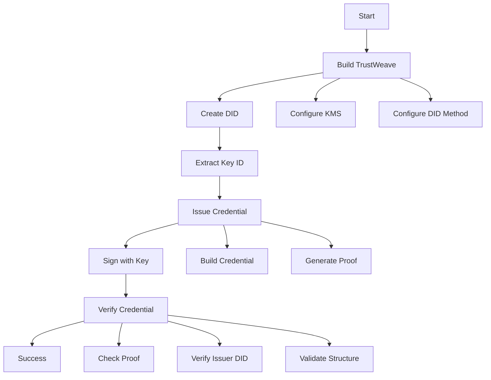

# Quick Start

Get started with TrustWeave in 5 minutes! This guide will walk you through creating your first TrustWeave application.

> **Version:** 1.0.0-SNAPSHOT
> **Kotlin:** 2.2.21+ | **Java:** 21+
> See [Installation](installation.md) for setup details.

## Hello TrustWeave (30 Seconds) ⚡

Here's the absolute minimum to get your first credential working. Copy, paste, run:

```kotlin
import org.trustweave.trust.dsl.trustWeave
import org.trustweave.trust.dsl.credential.*
import org.trustweave.trust.types.VerificationResult
import org.trustweave.testkit.services.*
import kotlinx.coroutines.runBlocking

fun main() = runBlocking {
    trustWeave {
        factories(
            kmsFactory = TestkitKmsFactory(),
            didMethodFactory = TestkitDidMethodFactory()
        )
        keys { provider(IN_MEMORY); algorithm(ED25519) }
        did { method(KEY) { algorithm(ED25519) } }
    }.run {
        // Create issuer DID (uses default method from config)
        val (issuerDid, issuerDoc) = createDid().getOrThrow()
        val keyId = issuerDoc.verificationMethod.first().id.substringAfter("#")
        println("✅ Created DID: ${issuerDid.value}")

        // Issue credential
        val credential = issue {
            credential {
                type("HelloCredential")
                issuer(issuerDid.value)
                subject {
                    id("did:key:holder")
                    "message" to "Hello TrustWeave!"
                }
            }
            signedBy(issuerDid.value, keyId)
        }.getOrThrow()

        // Verify credential
        val result = verify { credential(credential) }
        when (result) {
            is VerificationResult.Valid -> println("✅ Credential verified!")
            else -> println("❌ Verification failed")
        }
    }
}
```

**Expected Output:**
```
✅ Created DID: did:key:z6Mk...
✅ Credential verified!
```

**What just happened?**
1. ✅ Created a decentralized identity (DID) for the issuer
2. ✅ Issued a verifiable credential with a simple claim
3. ✅ Verified the credential cryptographically

This demonstrates TrustWeave's core value: **cryptographically verifiable credentials** that can't be forged. The credential contains a proof that can be independently verified without contacting the issuer.

### Onboarding Flow

Here's what happens under the hood:



> **Next Steps:** Continue reading for a complete example with proper error handling, or jump to [Installation](installation.md) to set up your project.

## Complete Runnable Example

Here's a complete, copy-paste ready example that demonstrates the full TrustWeave workflow with proper error handling. This example uses try-catch blocks for error handling, which is the recommended pattern for all TrustWeave operations.

> **Note:** All `TrustWeave` methods throw domain-specific exceptions on failure (e.g., `DidException`, `CredentialException`, `WalletException`). These extend `TrustWeaveException` and provide structured error codes and context. Always wrap operations in try-catch blocks for production code. Verification methods return sealed `VerificationResult` types for exhaustive error handling. See [Error Handling Patterns](#error-handling-patterns) below for details.

```kotlin
package com.example.TrustWeave.quickstart

import org.trustweave.trust.dsl.trustWeave
import org.trustweave.trust.dsl.credential.*
import org.trustweave.trust.types.VerificationResult
import org.trustweave.core.util.DigestUtils
import org.trustweave.testkit.services.*
import kotlinx.coroutines.runBlocking
import kotlinx.serialization.json.buildJsonObject
import kotlinx.serialization.json.put

fun main() = runBlocking {
    trustWeave {
        factories(
            kmsFactory = TestkitKmsFactory(),
            didMethodFactory = TestkitDidMethodFactory()
        )
        keys {
            provider(IN_MEMORY)
            algorithm(ED25519)
        }
        did {
            method(KEY) {
                algorithm(ED25519)
            }
        }
    }.run {
        // Step 1: Compute a digest (demonstrates canonicalization)
        val credentialSubject = buildJsonObject {
            put("id", "did:key:holder-placeholder")
            put("name", "Alice Example")
            put("role", "Site Reliability Engineer")
        }
        val digest = DigestUtils.sha256DigestMultibase(credentialSubject)
        println("Canonical credential-subject digest: $digest")

        // Step 2: Create issuer DID (uses default method from config)
        val (issuerDid, issuerDoc) = createDid().getOrThrow()
        val issuerKeyId = issuerDoc.verificationMethod.first().id.substringAfter("#")
        println("Issuer DID: ${issuerDid.value} (keyId=$issuerKeyId)")

        // Step 3: Issue credential
        val credential = issue {
            credential {
                type("QuickStartCredential")
                issuer(issuerDid.value)
                subject {
                    id("did:key:holder-placeholder")
                    "name" to "Alice Example"
                    "role" to "Site Reliability Engineer"
                }
            }
            signedBy(issuerDid.value, issuerKeyId)
        }.getOrThrow()
        println("Issued credential id: ${credential.id}")

        // Step 4: Verify credential
        val verification = verify {
            credential(credential)
            checkRevocation()
            checkExpiration()
        }

        when (verification) {
            is VerificationResult.Valid -> {
                println("✅ Verification succeeded")
                if (verification.warnings.isNotEmpty()) {
                    println("Warnings: ${verification.warnings.joinToString()}")
                }
            }
            is VerificationResult.Invalid.Expired -> {
                println("❌ Credential expired at ${verification.expiredAt}")
            }
            is VerificationResult.Invalid.Revoked -> {
                println("❌ Credential revoked")
            }
            is VerificationResult.Invalid.InvalidProof -> {
                println("❌ Invalid proof: ${verification.reason}")
            }
            is VerificationResult.Invalid.UntrustedIssuer -> {
                println("❌ Untrusted issuer: ${verification.issuer}")
            }
            is VerificationResult.Invalid.SchemaValidationFailed -> {
                println("❌ Schema validation failed: ${verification.errors.joinToString()}")
            }
            else -> {
                println("❌ Verification failed: ${verification}")
            }
        }

        // Step 5: Create wallet and store credential
        val wallet = wallet {
            holder("did:key:holder-placeholder")
        }.getOrThrow()
        
        val credentialId = wallet.store(credential)
        println("✅ Stored credential: $credentialId")
    }
}
```

### Simplified Example (Testing Only)

For quick testing and prototypes, you can use a simplified version without detailed error handling. **Do not use this in production:**

```kotlin
import org.trustweave.trust.dsl.trustWeave
import org.trustweave.trust.dsl.credential.*
import org.trustweave.testkit.services.*
import kotlinx.coroutines.runBlocking

fun main() = runBlocking {
    trustWeave {
        factories(
            kmsFactory = TestkitKmsFactory(),
            didMethodFactory = TestkitDidMethodFactory()
        )
        keys { provider(IN_MEMORY); algorithm(ED25519) }
        did { method(KEY) { algorithm(ED25519) } }
    }.run {
        // Operations will throw exceptions on failure
        val (did, _) = createDid().getOrThrow()
        val credential = issue { ... }.getOrThrow()
        // ... rest of code
    }
}
```

**Why not in production?** Exceptions will crash your application. Always use try-catch in production code.

### Production Pattern with Error Handling

The example above already shows the production pattern. Here's an enhanced version with more detailed error handling:

```kotlin
import org.trustweave.trust.dsl.trustWeave
import org.trustweave.trust.dsl.credential.*
import org.trustweave.testkit.services.*
import kotlinx.coroutines.runBlocking

fun main() = runBlocking {
    trustWeave {
        factories(
            kmsFactory = TestkitKmsFactory(),
            didMethodFactory = TestkitDidMethodFactory()
        )
        keys {
            provider(IN_MEMORY)
            algorithm(ED25519)
        }
        did {
            method(KEY) {
                algorithm(ED25519)
            }
        }
    }.run {
        // Production pattern: Use getOrThrow() for concise error handling
        val (issuerDid, issuerDoc) = createDid().getOrThrow()
        val issuerKeyId = issuerDoc.verificationMethod.first().id.substringAfter("#")

        val credential = issue {
            credential {
                type("QuickStartCredential")
                issuer(issuerDid.value)
                subject {
                    id("did:key:holder")
                    "name" to "Alice"
                }
            }
            signedBy(issuerDid.value, issuerKeyId)
        }.getOrThrow()

        println("✅ Credential issued: ${credential.id}")
    }
}
```

**Expected Output:**
```
Canonical credential-subject digest: u5v...
Issuer DID: did:key:z6Mk... (keyId=did:key:z6Mk...#key-1)
Issued credential id: urn:uuid:...
Verification succeeded (proof=true, issuer=true, revocation=true)
Anchored credential on inmemory:anchor: tx_...
```

**To run this example:**
1. Add the dependency (see Step 1 below)
2. Copy the code above into `src/main/kotlin/QuickStart.kt`
3. Run with `./gradlew run` or execute in your IDE

---

## Step-by-Step Guide

The sections below explain each step in detail.

## Step 1: Add a single dependency

**Why:** `distribution-all` bundles every public module (core APIs, DID support, KMS, anchoring, DSLs) so you can get going with one line.
**How it works:** It's a convenience metapackage that re-exports the same artifacts you would otherwise add one-by-one.
**How simple:** Drop one dependency and you're done.

> **Note:** For production deployments, consider using individual modules instead of `distribution-all` to minimize bundle size. See [Installation Guide](installation.md) for details.

```kotlin
dependencies {
    implementation("org.trustweave:distribution-all:1.0.0-SNAPSHOT")
    testImplementation("org.trustweave:testkit:1.0.0-SNAPSHOT")
}
```

**What this does**
- Pulls in every public TrustWeave module (core APIs, DID support, KMS, anchoring, DSLs) with a single coordinate so you never chase transitive dependencies.
- Adds `testkit` for the in-memory DID/KMS/wallet implementations used in the tutorials and automated tests.

**Design significance**
TrustWeave promotes a “batteries included” experience for newcomers. The monolithic artifact keeps onboarding simple; when you graduate to production you can swap in individual modules without changing API usage.

## Step 2: Bootstrap TrustWeave and compute a digest

**Why:** Most flows start by hashing JSON so signatures and anchors are stable.
**How it works:** `DigestUtils.sha256DigestMultibase` canonicalises JSON and returns a multibase string.
**How simple:** One helper call, no manual canonicalisation.

```kotlin
import org.trustweave.trust.dsl.trustWeave
import org.trustweave.trust.dsl.credential.*
import org.trustweave.core.util.DigestUtils
import org.trustweave.testkit.services.*
import kotlinx.coroutines.runBlocking
import kotlinx.serialization.json.buildJsonObject
import kotlinx.serialization.json.put

fun main() = runBlocking {
    trustWeave {
        factories(
            kmsFactory = TestkitKmsFactory(),
            didMethodFactory = TestkitDidMethodFactory()
        )
        keys {
            provider(IN_MEMORY)
            algorithm(ED25519)
        }
        did {
            method(KEY) {
                algorithm(ED25519)
            }
        }
    }.run {
        // Build credential subject payload
        val credentialSubject = buildJsonObject {
            put("id", "did:key:holder-placeholder")
            put("name", "Alice Example")
            put("role", "Site Reliability Engineer")
        }

        // Compute deterministic digest (canonicalizes JSON first)
        val digest = DigestUtils.sha256DigestMultibase(credentialSubject)
        println("Digest: $digest")
    }
}
```

**What this does**
- Instantiates TrustWeave with sensible defaults (in-memory registries) suitable for playground and unit tests.
- Builds a credential payload using Kotlinx Serialization builders so the structure is type-safe.
- Canonicalises and hashes the payload, returning a multibase-encoded digest you can anchor or sign.

> **Important:** The defaults use in-memory components (KMS, wallets, DID methods) suitable for testing only. For production, configure your own KMS, DID methods, and storage backends. See [Default Configuration](../configuration/defaults.md) and [Production Deployment](../deployment/production-checklist.md) for details.

**Result**
`DigestUtils.sha256DigestMultibase` prints a deterministic digest (for example `u5v...`) that becomes the integrity reference for later steps.

**Design significance**
Everything in TrustWeave assumes deterministic canonicalization, so the very first code sample reinforces the pattern: serialize → canonicalize → hash → sign/anchor. This is the backbone of interoperability.

## Step 3: Create a DID with typed options

**Why:** You need an issuer DID before issuing credentials.
**How it works:** `trustWeave.createDid { }` uses the configured DID method registry and DSL builder.
**How simple:** Configure only what you need using a fluent builder—defaults cover the rest.

```kotlin
// Simple: use defaults (did:key method, ED25519 algorithm from config)
val (issuerDid, issuerDoc) = trustWeave.createDid().getOrThrow()
val issuerKeyId = issuerDoc.verificationMethod.first().id.substringAfter("#")
println("Issuer DID: ${issuerDid.value} (keyId=$issuerKeyId)")

// Advanced: specify method explicitly
val (customDid, customDoc) = trustWeave.createDid {
    method(KEY)
    algorithm(ED25519)
}.getOrThrow()
```

**What this does**
- Calls the facade to provision a DID using the default registry (in this case `did:key`).
- Returns the fully materialised DID document with verification methods.
- Extracts the DID identifier and key ID for use in credential issuance.

**Result**
`issuerDid` now holds a resolvable DID such as `did:key:z6M...` that acts as the issuer for credentials. The `issuerKeyId` is needed for signing credentials.

**Design significance**
Typed builders (`DidCreationOptions`) are a core design choice: they prevent misconfigured DID creation at compile time and make IDE autocompletion an onboarding tool rather than documentation guesswork.

## Step 4: Issue a credential and store it

**Why:** Credential issuance is the heart of most TrustWeave solutions.
**How it works:** The facade orchestrates KMS, proofs, and registries, returning a `Result<VerifiableCredential>`.
**How simple:** Provide the issuer DID/key and credential subject JSON; the API handles proof generation and validation.

```kotlin
// Issue credential using the issuer DID and key ID from Step 3
val credential = trustWeave.issue {
    credential {
        type("QuickStartCredential")
        issuer(issuerDid.value)
        subject {
            id("did:key:holder-placeholder")
            "name" to "Alice Example"
            "role" to "Site Reliability Engineer"
        }
    }
    signedBy(issuerDid.value, issuerKeyId)
}.getOrThrow()

println("Issued credential id: ${credential.id}")
```

**What this does**
- Invokes the credential issuance facade which orchestrates key lookup/generation, proof creation, and credential assembly.
- Configures the credential subject payload and credential types.
- Returns a signed `VerifiableCredential` with cryptographic proof attached.

**Result**
The printed ID corresponds to a tamper-evident credential JSON object that you can store, present, or anchor.

**Design significance**
The type-safe `IssuerIdentity` ensures that issuer DID and key ID are properly validated at compile time, reducing runtime errors and improving developer experience.

> ✅ **Run the sample**
> The full quick-start flow lives in `distribution/examples/src/main/kotlin/org.trustweave/examples/quickstart/QuickStartSample.kt`.
> Execute it locally with `./gradlew :distribution:examples:runQuickStartSample`.

## Step 5: Verify the credential

**Why:** Consumers must trust the credential; verification validates proofs and checks revocation.
**How it works:** `verifyCredential` rebuilds proofs, resolves issuer DIDs, and performs validity checks.
**How simple:** One call returns a structured result with validation details.

```kotlin
// Verify credential
val verification = trustWeave.verify {
    credential(credential)
    checkRevocation()
    checkExpiration()
}

when (verification) {
    is VerificationResult.Valid -> {
        println("✅ Verification succeeded")
        if (verification.warnings.isNotEmpty()) {
            println("Warnings: ${verification.warnings.joinToString()}")
        }
    }
    is VerificationResult.Invalid -> {
        println("❌ Verification failed: $verification")
    }
}
```

**What this does**
- Verifies the credential by rebuilding proofs and performing validity checks.
- Checks issuer DID resolution, proof validity, and revocation status.
- Returns a sealed `VerificationResult` type for exhaustive error handling.

**Result**
You get a `VerificationResult` sealed class that can be `Valid` or one of several `Invalid` subtypes, each providing specific error information. This enables exhaustive when-expressions for type-safe error handling.

## Step 6: Anchor to blockchain (optional)

**Why:** Anchoring provides tamper evidence and timestamping on a blockchain.
**How it works:** Register a blockchain client and use it to anchor credential data.
**How simple:** Register client, serialize credential, write to chain.

```kotlin
// Create wallet and store credential
val wallet = trustWeave.wallet {
    holder("did:key:holder-placeholder")
}.getOrThrow()

val credentialId = wallet.store(credential)
println("✅ Stored credential: $credentialId")
```

**What this does**
- Registers an in-memory blockchain client (for testing; use real clients in production).
- Serializes the credential to JSON and writes it to the anchor client.
- Returns an `AnchorRef` with chain ID and transaction hash.

**Result**
You get an `AnchorRef` representing the write operation. In production you'd persist this for audits and use a real chain adapter (Algorand, Polygon, etc.).

**Design significance**
Anchoring is abstracted behind the same interface regardless of provider. The sample sticks to the in-memory implementation, but the code path is identical for Algorand, Polygon, Indy, or future adapters—making environment swaps low risk.

## Error Handling Patterns

TrustWeave methods throw exceptions on failure. Understanding error handling patterns is important for production code.

> **Best Practice:** Always use try-catch blocks for production code. Only skip error handling in quick prototypes and tests.

### When to Skip Error Handling (Testing/Prototyping Only)

Skip error handling **only** for:
- ✅ Quick start examples and prototypes
- ✅ Simple scripts where you can let errors bubble up
- ✅ Test code where exceptions are acceptable
- ✅ Learning and experimentation

```kotlin
// ⚠️ Simple usage (exceptions will propagate) - Testing/Prototyping Only
// For production, always use try-catch instead
val (did, _) = trustWeave.createDid().getOrThrow()
val credential = trustWeave.issue { ... }.getOrThrow()
```

**Why not in production?** Unhandled exceptions can crash your application. Production code should handle errors gracefully.

### When to Use Try-Catch (Production Pattern)

Use try-catch blocks **always** for:
- ✅ Production code
- ✅ When you need to handle specific error types
- ✅ When you want to provide user-friendly error messages
- ✅ When you need to log errors before handling
- ✅ When you need to recover from errors

```kotlin
import org.trustweave.trust.dsl.credential.*

// ✅ Production pattern with getOrThrow() for concise error handling
try {
    val (did, doc) = trustWeave.createDid().getOrThrow()
    processDid(did)
} catch (error: IllegalStateException) {
    // getOrThrow() throws IllegalStateException with detailed error messages
    logger.error("DID creation failed: ${error.message}", error)
    // Handle error appropriately
} catch (error: Exception) {
    logger.error("Unexpected error: ${error.message}", error)
    // Handle generic error
}
```

**Why use domain-specific exceptions?** They provide structured error information with error codes, context, and type-safe handling. The compiler ensures exhaustive handling in `when` expressions.

## Handling errors and verification failures

TrustWeave methods throw exceptions on failure. Always use try-catch blocks for error handling:

```kotlin
// Verify credential with exhaustive error handling
try {
    val verification = trustWeave.verify {
        credential(credential)
        checkRevocation()
        checkExpiration()
    }

    when (verification) {
        is VerificationResult.Valid -> {
            println("✅ Credential is valid: ${verification.credential.id}")
            if (verification.warnings.isNotEmpty()) {
                verification.warnings.forEach { println("Warning: $it") }
            }
        }
        is VerificationResult.Invalid.Expired -> {
            println("❌ Credential expired at ${verification.expiredAt}")
        }
        is VerificationResult.Invalid.Revoked -> {
            println("❌ Credential revoked")
        }
        is VerificationResult.Invalid.InvalidProof -> {
            println("❌ Invalid proof: ${verification.reason}")
        }
        is VerificationResult.Invalid.UntrustedIssuer -> {
            println("❌ Untrusted issuer: ${verification.issuer}")
        }
        is VerificationResult.Invalid.SchemaValidationFailed -> {
            println("❌ Schema validation failed: ${verification.errors.joinToString()}")
        }
        // Compiler ensures all cases are handled
    }
} catch (error: CredentialException) {
    println("❌ Credential error: ${error.message}")
} catch (error: TrustWeaveException) {
    println("❌ TrustWeave error [${error.code}]: ${error.message}")
} catch (error: Exception) {
    println("❌ Unexpected error: ${error.message}")
}
```

**Best Practice:** Always use exhaustive `when` expressions to handle all `VerificationResult` cases. This ensures type-safe error handling and prevents missing error cases. Use try-catch blocks for exceptions thrown by the verification method itself.

See [Error Handling](../advanced/error-handling.md) for more details on error handling patterns.

## Scenario Playbook

Ready to explore real-world workflows? Each guide below walks through an end-to-end scenario using the same APIs you just touched:

- **[View All Scenarios](../scenarios/README.md)** – Complete list of all available scenarios

**Popular Scenarios:**
- [Academic Credentials](../scenarios/academic-credentials-scenario.md) – issue diplomas, validate transcripts, and manage revocation.
- [Employee Onboarding](../scenarios/employee-onboarding-scenario.md) – complete onboarding with education, work history, and background checks.
- [Vaccination Health Passports](../scenarios/vaccination-health-passport-scenario.md) – privacy-preserving health credentials for travel and access.
- [Event Ticketing](../scenarios/event-ticketing-scenario.md) – verifiable tickets with transfer control and fraud prevention.
- [Age Verification](../scenarios/age-verification-scenario.md) – verify age without revealing personal information.
- [Insurance Claims](../scenarios/insurance-claims-scenario.md) – complete claims verification with fraud prevention.
- [Financial Services (KYC)](../scenarios/financial-services-kyc-scenario.md) – streamline onboarding and reuse credentials across institutions.
- [Government Digital Identity](../scenarios/government-digital-identity-scenario.md) – citizens receive, store, and present official IDs.
- [Healthcare Records](../scenarios/healthcare-medical-records-scenario.md) – share consented medical data across providers with audit trails.
- [Supply Chain Traceability](../scenarios/supply-chain-traceability-scenario.md) – follow goods from origin to shelf with verifiable checkpoints.

## Troubleshooting

If you encounter issues:
- See [Troubleshooting Guide](troubleshooting.md) for common problems and solutions
- Check [Error Handling](../advanced/error-handling.md) for error handling patterns
- Review [FAQ](../faq.md) for frequently asked questions

## Learning Path

Follow this structured path to master TrustWeave:

### 1. Get Started (You are here!)
- ✅ Complete this Quick Start guide
- ✅ Run the example code
- ✅ Understand basic concepts

### 2. Learn the Fundamentals
- **[Beginner Tutorial Series](../tutorials/beginner-tutorial-series.md)** - Structured 5-tutorial series (2+ hours)
  - Tutorial 1: Your First DID (15-20 min)
  - Tutorial 2: Issuing Your First Credential (20-25 min)
  - Tutorial 3: Managing Credentials with Wallets (25-30 min)
  - Tutorial 4: Building a Complete Workflow (30-35 min)
  - Tutorial 5: Adding Blockchain Anchoring (25-30 min)

### 3. Build Real Applications
- **[Your First Application](your-first-application.md)** - Build a complete example
- **[Common Patterns](common-patterns.md)** - Production-ready patterns
- **[Scenarios](../scenarios/README.md)** - Real-world use cases

### 4. Deepen Your Knowledge
- **[Core Concepts](../core-concepts/README.md)** - Deep dives into fundamentals
- **[API Reference](../api-reference/core-api.md)** - Complete API documentation
- **[Advanced Topics](../advanced/README.md)** - Key rotation, verification policies, etc.

### 5. Production Deployment
- **[Error Handling Guide](../advanced/error-handling.md)** - Production error handling
- **[Troubleshooting](troubleshooting.md)** - Debugging and solutions
- **[Security Best Practices](../security/README.md)** - Security guidelines

## What's Next?

**New to TrustWeave?**
1. Start with [Beginner Tutorial Series](../tutorials/beginner-tutorial-series.md) - Tutorial 1
2. Complete all 5 tutorials in order
3. Move to [Common Patterns](common-patterns.md) for production patterns

**Already familiar with DIDs/VCs?**
1. Review [Common Patterns](common-patterns.md) for TrustWeave-specific patterns
2. Explore [Scenarios](../scenarios/README.md) for your use case
3. Reference [API Reference](../api-reference/core-api.md) as needed

**Building a specific application?**
1. Check [Scenarios](../scenarios/README.md) for similar use cases
2. Review [Common Patterns](common-patterns.md) for reusable patterns
3. Consult [API Reference](../api-reference/core-api.md) for details

## Additional Resources

- [Core Concepts](../core-concepts/README.md) - Learn the fundamentals
- [API Reference](../api-reference/core-api.md) - Complete API documentation
- [Troubleshooting](troubleshooting.md) - Common issues and solutions
- [Error Handling Guide](../advanced/error-handling.md) - Detailed error handling patterns
- [FAQ](../faq.md) - Frequently asked questions

