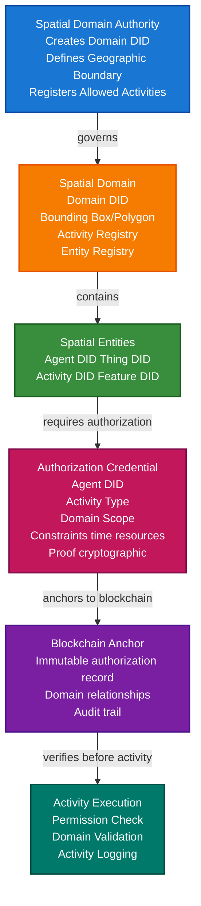

# Spatial Web Authorization Scenario

This guide demonstrates how to build a decentralized Spatial Web system where entities (agents, activities, things, spatial features) are identified by DIDs, and agents require verifiable credentials to perform activities within spatial domains.

## What You'll Build

By the end of this tutorial, you'll have:

- ✅ Created DIDs for different entity types (agents, activities, things, spatial features)
- ✅ Defined spatial domains with geographic boundaries
- ✅ Issued activity authorization credentials
- ✅ Verified agent permissions before allowing activities
- ✅ Implemented domain-based access control
- ✅ Anchored spatial entity relationships to blockchain
- ✅ Built a complete authorization workflow

## Big Picture & Significance

### The Spatial Web Vision

The Spatial Web represents a paradigm shift toward a decentralized, location-aware internet where physical and digital spaces converge. Unlike traditional web systems that operate independently of geographic context, the Spatial Web embeds location, space, and spatial relationships as first-class concepts.

**Industry Context**:
- **Market Size**: The geospatial analytics market is projected to reach $134.48 billion by 2027 (CAGR 15.2%)
- **Emerging Technologies**: Integration with IoT, autonomous systems, smart cities, and augmented reality
- **Regulatory Drivers**: Increasing need for location-based access control (airspace management, maritime zones, environmental monitoring)
- **Decentralization Trend**: Moving away from centralized platforms toward peer-to-peer spatial networks

**Why This Matters**:
1. **Autonomous Systems**: Drones, self-driving cars, and robots need verifiable permissions to operate in specific areas
2. **Smart Cities**: Urban infrastructure requires fine-grained access control for services and resources
3. **Environmental Monitoring**: Sensors and monitoring systems need authorization to collect data in protected areas
4. **Resource Management**: Shared spatial resources (airspace, waterways, public spaces) need decentralized governance

### The Authorization Challenge

Traditional access control systems fail in spatial contexts because:
- **Centralized Bottlenecks**: Single points of failure for critical operations
- **Lack of Interoperability**: Different systems can't verify permissions across domains
- **No Geographic Context**: Permissions don't account for spatial boundaries
- **Trust Issues**: No cryptographic proof of authorization
- **Scalability Problems**: Can't handle millions of entities and dynamic permissions

## Value Proposition

### Problems Solved

1. **Decentralized Authorization**: No single authority controls all permissions
2. **Cryptographic Trust**: Verifiable credentials provide tamper-proof authorization
3. **Spatial Awareness**: Permissions are tied to geographic domains
4. **Interoperability**: Standard DID/VC format works across systems
5. **Scalability**: Can handle millions of entities and activities
6. **Privacy**: Selective disclosure of permissions
7. **Auditability**: Blockchain anchoring provides immutable audit trail

### Business Benefits

**For Organizations**:
- **Reduced Costs**: Eliminate centralized authorization infrastructure
- **Faster Operations**: Instant permission verification without API calls
- **Compliance**: Immutable audit trail for regulatory requirements
- **Innovation**: Enable new spatial applications and services

**For Developers**:
- **Simplified Integration**: Standard APIs for all authorization needs
- **Flexibility**: Support multiple domains and activity types
- **Security**: Cryptographic guarantees reduce attack surface
- **Future-Proof**: Works with emerging spatial technologies

**For End Users**:
- **Privacy**: Control what permissions are shared
- **Portability**: Permissions work across different systems
- **Transparency**: Can verify who authorized what and when

### ROI Considerations

- **Infrastructure Savings**: 60-80% reduction in authorization server costs
- **Operational Efficiency**: 10x faster permission verification
- **Compliance**: Automated audit trails reduce compliance costs by 40%
- **Innovation**: Enable new revenue streams from spatial services

## Understanding the Problem

In a decentralized Spatial Web, we face several critical challenges:

1. **Entity Identity**: All entities (agents, activities, things, spatial features) need unique, verifiable identities that work across systems
2. **Domain Boundaries**: Spatial domains define where entities exist and operate, requiring precise geographic representation
3. **Activity Authorization**: Agents need credentials proving they can perform specific activities within domains
4. **Access Control**: Systems must verify credentials before allowing activities, often in real-time
5. **Trust**: Need cryptographic proof of permissions and relationships without central authorities
6. **Scalability**: Must handle millions of entities, activities, and domains simultaneously
7. **Interoperability**: Different systems must understand and verify the same credentials

### Real-World Pain Points

**Example 1: Drone Operations**
- Current: Manual approval processes, centralized airspace management
- Problem: Slow, doesn't scale, single point of failure
- Solution: Verifiable credentials for airspace authorization, instant verification

**Example 2: IoT Sensor Networks**
- Current: Hard-coded permissions, difficult to update
- Problem: Can't dynamically authorize new sensors or change permissions
- Solution: DID-based sensor identity with revocable authorization credentials

**Example 3: Autonomous Vehicles**
- Current: Centralized route approval systems
- Problem: Latency, scalability, trust issues
- Solution: Domain-based route authorization with verifiable credentials

## How It Works: Spatial Web Authorization Flow



## Key Concepts

### Entity Types

1. **Agent**: An actor that can perform activities (e.g., drone, robot, human operator, autonomous vehicle)
   - Has a DID for identity
   - Can hold authorization credentials
   - Can initiate activities

2. **Activity**: An action that can be performed (e.g., "data-collection", "monitoring", "maintenance", "transportation")
   - Has a DID for identity
   - Defined by domain authority
   - Has associated constraints and requirements

3. **Thing**: A physical or digital object (e.g., sensor, vehicle, data stream, device)
   - Has a DID for identity
   - Can be associated with activities
   - Can have capabilities and properties

4. **Spatial Feature**: A geographic feature (e.g., building, park, zone, airspace, waterway)
   - Has a DID for identity
   - Has geographic representation (bounding box, polygon)
   - Can be part of domains

### Spatial Domain

A spatial domain defines:
- **Geographic Boundary**: Bounding box or polygon coordinates
- **Domain Authority**: DID of the entity governing the domain
- **Allowed Activities**: List of activity types permitted in the domain
- **Entity Registry**: DIDs of entities registered in the domain
- **Rules**: Constraints and policies for activities

### Activity Authorization

Credentials that grant agents permission to:
- Perform specific activities
- Within specific domains
- For a limited time
- With certain constraints (resource limits, conditions)

## Prerequisites

- Java 21+
- Kotlin 2.2.0+
- Gradle 8.5+
- Basic understanding of Kotlin and coroutines
- Basic understanding of geospatial concepts (coordinates, bounding boxes, polygons)
- Familiarity with DIDs and Verifiable Credentials (see [Core Concepts](../core-concepts/README.md))

## Step 1: Add Dependencies

Add VeriCore dependencies to your `build.gradle.kts`:

```kotlin
dependencies {
    // Core VeriCore modules
    implementation("io.geoknoesis.vericore:vericore-core:1.0.0-SNAPSHOT")
    implementation("io.geoknoesis.vericore:vericore-json:1.0.0-SNAPSHOT")
    implementation("io.geoknoesis.vericore:vericore-kms:1.0.0-SNAPSHOT")
    implementation("io.geoknoesis.vericore:vericore-did:1.0.0-SNAPSHOT")
    implementation("io.geoknoesis.vericore:vericore-anchor:1.0.0-SNAPSHOT")
    
    // Test kit for in-memory implementations
    implementation("io.geoknoesis.vericore:vericore-testkit:1.0.0-SNAPSHOT")
    
    // Kotlinx Serialization
    implementation("org.jetbrains.kotlinx:kotlinx-serialization-json:1.6.0")
    
    // Coroutines
    implementation("org.jetbrains.kotlinx:kotlinx-coroutines-core:1.7.3")
}
```

## Step 2: Complete Example

Here's a complete example demonstrating spatial web authorization:

```kotlin
import io.geoknoesis.vericore.credential.models.VerifiableCredential
import io.geoknoesis.vericore.credential.models.VerifiablePresentation
import io.geoknoesis.vericore.credential.CredentialIssuanceOptions
import io.geoknoesis.vericore.credential.CredentialVerificationOptions
import io.geoknoesis.vericore.credential.PresentationOptions
import io.geoknoesis.vericore.credential.issuer.CredentialIssuer
import io.geoknoesis.vericore.credential.verifier.CredentialVerifier
import io.geoknoesis.vericore.credential.proof.Ed25519ProofGenerator
import io.geoknoesis.vericore.credential.proof.ProofGeneratorRegistry
import io.geoknoesis.vericore.testkit.credential.InMemoryWallet
import io.geoknoesis.vericore.testkit.did.DidKeyMockMethod
import io.geoknoesis.vericore.testkit.kms.InMemoryKeyManagementService
import io.geoknoesis.vericore.testkit.anchor.InMemoryBlockchainAnchorClient
import io.geoknoesis.vericore.anchor.BlockchainAnchorRegistry
import io.geoknoesis.vericore.anchor.anchorTyped
import io.geoknoesis.vericore.anchor.AnchorResult
import io.geoknoesis.vericore.did.DidMethodRegistry
import kotlinx.coroutines.runBlocking
import kotlinx.serialization.Serializable
import kotlinx.serialization.json.buildJsonObject
import kotlinx.serialization.json.put
import kotlinx.serialization.json.Json
import java.time.Instant
import java.time.temporal.ChronoUnit

// Data models for spatial web entities
@Serializable
data class BoundingBox(
    val minLat: Double,
    val maxLat: Double,
    val minLon: Double,
    val maxLon: Double
)

@Serializable
data class SpatialDomain(
    val domainId: String,
    val domainDid: String,
    val authorityDid: String,
    val boundary: BoundingBox,
    val allowedActivities: List<String>,
    val description: String
)

@Serializable
data class ActivityAuthorization(
    val agentDid: String,
    val activityDid: String,
    val domainDid: String,
    val constraints: Map<String, String>,
    val credentialDigest: String
)

fun main() = runBlocking {
    println("=== Spatial Web Authorization Scenario ===\n")
    
    // Step 1: Setup services
    println("Step 1: Setting up services...")
    val domainAuthorityKms = InMemoryKeyManagementService()
    val agentKms = InMemoryKeyManagementService()
    
    val didMethod = DidKeyMockMethod(domainAuthorityKms)
    val didRegistry = DidMethodRegistry().apply { register(didMethod) }
    
    // Setup blockchain for anchoring
    val anchorClient = InMemoryBlockchainAnchorClient("eip155:1", emptyMap())
    val blockchainRegistry = BlockchainAnchorRegistry().apply {
        register("eip155:1", anchorClient)
    }
    
    // Step 2: Create DIDs for domain authority
    println("\nStep 2: Creating domain authority DID...")
    val domainAuthorityDid = didMethod.createDid()
    println("Domain Authority DID: ${domainAuthorityDid.id}")
    
    // Step 3: Create spatial domain
    println("\nStep 3: Creating spatial domain...")
    val airspaceDomain = SpatialDomain(
        domainId = "airspace-sf-bay",
        domainDid = domainAuthorityDid.id,
        authorityDid = domainAuthorityDid.id,
        boundary = BoundingBox(
            minLat = 37.5,
            maxLat = 38.0,
            minLon = -122.6,
            maxLon = -122.2
        ),
        allowedActivities = listOf(
            "data-collection",
            "monitoring",
            "transportation",
            "inspection"
        ),
        description = "San Francisco Bay Area Airspace"
    )
    println("Created domain: ${airspaceDomain.domainId}")
    println("  Boundary: (${airspaceDomain.boundary.minLat}, ${airspaceDomain.boundary.minLon}) to (${airspaceDomain.boundary.maxLat}, ${airspaceDomain.boundary.maxLon})")
    println("  Allowed activities: ${airspaceDomain.allowedActivities.joinToString()}")
    
    // Step 4: Create entity DIDs
    println("\nStep 4: Creating entity DIDs...")
    
    // Agent: Drone
    val droneAgentDid = didMethod.createDid()
    println("Agent (Drone) DID: ${droneAgentDid.id}")
    
    // Activity: Data Collection
    val dataCollectionActivityDid = didMethod.createDid()
    println("Activity (Data Collection) DID: ${dataCollectionActivityDid.id}")
    
    // Thing: Environmental Sensor
    val sensorThingDid = didMethod.createDid()
    println("Thing (Sensor) DID: ${sensorThingDid.id}")
    
    // Spatial Feature: Monitoring Zone
    val monitoringZoneDid = didMethod.createDid()
    println("Spatial Feature (Monitoring Zone) DID: ${monitoringZoneDid.id}")
    
    // Step 5: Create authorization credential
    println("\nStep 5: Creating activity authorization credential...")
    val authorizationCredential = VerifiableCredential(
        id = "https://example.com/authorizations/${droneAgentDid.id.substringAfterLast(":")}-${Instant.now().toEpochMilli()}",
        type = listOf("VerifiableCredential", "ActivityAuthorizationCredential", "SpatialWebCredential"),
        issuer = domainAuthorityDid.id,
        credentialSubject = buildJsonObject {
            put("id", droneAgentDid.id)
            put("authorization", buildJsonObject {
                put("agentDid", droneAgentDid.id)
                put("activityDid", dataCollectionActivityDid.id)
                put("activityType", "data-collection")
                put("domainDid", airspaceDomain.domainDid)
                put("domainId", airspaceDomain.domainId)
                put("constraints", buildJsonObject {
                    put("maxAltitude", "400") // feet
                    put("maxDuration", "PT2H") // 2 hours
                    put("timeWindow", "2024-01-01T08:00:00Z/2024-01-01T18:00:00Z")
                    put("allowedResources", "sensor-data-collection")
                })
                put("associatedThings", listOf(sensorThingDid.id))
                put("spatialFeatures", listOf(monitoringZoneDid.id))
            })
        },
        issuanceDate = Instant.now().toString(),
        expirationDate = Instant.now().plus(30, ChronoUnit.DAYS).toString(),
        credentialSchema = io.geoknoesis.vericore.credential.models.CredentialSchema(
            id = "https://example.com/schemas/activity-authorization.json",
            type = "JsonSchemaValidator2018",
            schemaFormat = io.geoknoesis.vericore.spi.SchemaFormat.JSON_SCHEMA
        )
    )
    
    // Step 6: Issue credential with proof
    println("\nStep 6: Issuing authorization credential...")
    val authorityKey = domainAuthorityKms.generateKey("Ed25519")
    val proofGenerator = Ed25519ProofGenerator(
        signer = { data, keyId -> domainAuthorityKms.sign(keyId, data) },
        getPublicKeyId = { keyId -> authorityKey.id }
    )

    val proofRegistry = ProofGeneratorRegistry().apply { register(proofGenerator) }
    
    val credentialIssuer = CredentialIssuer(
        proofGenerator = proofGenerator,
        resolveDid = { did -> didRegistry.resolve(did) != null },
        proofRegistry = proofRegistry
    )
    
    val issuedCredential = credentialIssuer.issue(
        credential = authorizationCredential,
        issuerDid = domainAuthorityDid.id,
        keyId = authorityKey.id,
        options = CredentialIssuanceOptions(proofType = "Ed25519Signature2020")
    )
    
    println("Authorization credential issued:")
    println("  - Agent: ${droneAgentDid.id}")
    println("  - Activity: data-collection")
    println("  - Domain: ${airspaceDomain.domainId}")
    println("  - Has proof: ${issuedCredential.proof != null}")
    
    // Step 7: Anchor authorization to blockchain
    println("\nStep 7: Anchoring authorization to blockchain...")
    val credentialDigest = io.geoknoesis.vericore.json.DigestUtils.sha256DigestMultibase(
        Json.encodeToJsonElement(
            io.geoknoesis.vericore.credential.models.VerifiableCredential.serializer(),
            issuedCredential
        )
    )
    
    val activityAuth = ActivityAuthorization(
        agentDid = droneAgentDid.id,
        activityDid = dataCollectionActivityDid.id,
        domainDid = airspaceDomain.domainDid,
        constraints = mapOf(
            "maxAltitude" to "400",
            "maxDuration" to "PT2H"
        ),
        credentialDigest = credentialDigest
    )
    
    val anchorResult = blockchainRegistry.anchorTyped(
        value = activityAuth,
        serializer = ActivityAuthorization.serializer(),
        targetChainId = "eip155:137"
    )
    
    println("Authorization anchored:")
    println("  - Transaction hash: ${anchorResult.ref.txHash}")
    println("  - Chain ID: ${anchorResult.ref.chainId}")
    println("  - Digest: $credentialDigest")
    
    // Step 8: Create agent wallet and store credential
    println("\nStep 8: Creating agent wallet...")
    val agentWallet = InMemoryWallet(
        walletDid = droneAgentDid.id,
        holderDid = droneAgentDid.id
    )
    
    val credentialId = agentWallet.store(issuedCredential)
    println("Credential stored in agent wallet: $credentialId")
    
    // Step 9: Verify authorization before activity
    println("\nStep 9: Verifying authorization before activity...")
    val verifier = CredentialVerifier(
    defaultDidResolver = didResolver
    )
    
    val verificationResult = verifier.verify(
        credential = issuedCredential,
        options = CredentialVerificationOptions(
        checkRevocation = false,
        checkExpiration = true,
        validateSchema = false,
        didResolver = didResolver
        )
    )
    
    if (verificationResult.valid) {
        println("✅ Authorization credential is valid!")
        println("  - Proof valid: ${verificationResult.proofValid}")
        println("  - Issuer valid: ${verificationResult.issuerValid}")
        println("  - Not expired: ${verificationResult.notExpired}")
    } else {
        println("❌ Authorization verification failed:")
        verificationResult.errors.forEach { println("  - $it") }
    }
    
    // Step 10: Check domain authorization
    println("\nStep 10: Checking domain authorization...")
    val isAuthorized = checkDomainAuthorization(
        agentDid = droneAgentDid.id,
        activityType = "data-collection",
        domain = airspaceDomain,
        credential = issuedCredential,
        currentLocation = Pair(37.7749, -122.4194) // San Francisco
    )
    
    if (isAuthorized) {
        println("✅ Agent is authorized to perform 'data-collection' in domain '${airspaceDomain.domainId}'")
    } else {
        println("❌ Agent is NOT authorized")
    }
    
    // Step 11: Create activity presentation
    println("\nStep 11: Creating activity presentation...")
    val activityPresentation = agentWallet.createPresentation(
        credentialIds = listOf(credentialId),
        holderDid = droneAgentDid.id,
        options = PresentationOptions(
            holderDid = droneAgentDid.id,
            proofType = "Ed25519Signature2020",
            challenge = "activity-request-${Instant.now().toEpochMilli()}"
        )
    )
    
    println("Activity presentation created:")
    println("  - Holder: ${activityPresentation.holder}")
    println("  - Credentials: ${activityPresentation.verifiableCredential.size}")
    println("  - Challenge: ${activityPresentation.challenge}")
    
    println("\n=== Scenario Complete ===")
}

// Helper function to check domain authorization
fun checkDomainAuthorization(
    agentDid: String,
    activityType: String,
    domain: SpatialDomain,
    credential: VerifiableCredential,
    currentLocation: Pair<Double, Double>
): Boolean {
    // 1. Verify credential is for this agent
    val credentialAgentDid = credential.credentialSubject.jsonObject["id"]?.jsonPrimitive?.content
    if (credentialAgentDid != agentDid) return false
    
    // 2. Verify activity type matches
    val authActivityType = credential.credentialSubject.jsonObject["authorization"]?.jsonObject
        ?.get("activityType")?.jsonPrimitive?.content
    if (authActivityType != activityType) return false
    
    // 3. Verify domain matches
    val authDomainId = credential.credentialSubject.jsonObject["authorization"]?.jsonObject
        ?.get("domainId")?.jsonPrimitive?.content
    if (authDomainId != domain.domainId) return false
    
    // 4. Verify activity is allowed in domain
    if (!domain.allowedActivities.contains(activityType)) return false
    
    // 5. Verify location is within domain boundary
    val (lat, lon) = currentLocation
    val inBoundary = lat >= domain.boundary.minLat &&
            lat <= domain.boundary.maxLat &&
            lon >= domain.boundary.minLon &&
            lon <= domain.boundary.maxLon
    
    if (!inBoundary) return false
    
    // 6. Check constraints (time, altitude, etc.)
    val constraints = credential.credentialSubject.jsonObject["authorization"]?.jsonObject
        ?.get("constraints")?.jsonObject
    
    // Check time window if specified
    constraints?.get("timeWindow")?.jsonPrimitive?.content?.let { timeWindow ->
        // Parse ISO 8601 interval (simplified)
        val now = Instant.now()
        // In production, properly parse the interval
        // For now, assume it's valid if constraint exists
    }
    
    return true
}
```

## Extensive Step-by-Step Breakdown

### Step 1: Setup and Initialization

**Purpose**: Initialize the core services needed for spatial web authorization.

**Detailed Explanation**:
1. **Key Management Services**: Create separate KMS instances for domain authority and agents. This separation ensures that domain authorities and agents have independent cryptographic keys.
2. **DID Method Registration**: Register a DID method (using test implementation) that will be used to create DIDs for all entities.
3. **Blockchain Setup**: Initialize a blockchain anchor client for immutable record-keeping. In production, this would connect to a real blockchain network.

**Why This Matters**: Proper initialization ensures secure key management and establishes the foundation for all subsequent operations.

### Step 2: Create Domain Authority DID

**Purpose**: Establish the identity of the entity that governs spatial domains.

**Detailed Explanation**:
- The domain authority is the trusted entity that issues authorization credentials
- The DID provides a decentralized, persistent identifier
- The DID document contains verification methods for signing credentials

**Key Considerations**:
- Domain authorities should be well-known, trusted entities
- In production, domain authority DIDs should be published and resolvable
- Multiple domain authorities can exist for different regions or purposes

### Step 3: Define Spatial Domain

**Purpose**: Create a spatial domain that defines geographic boundaries and allowed activities.

**Detailed Explanation**:
1. **Geographic Boundary**: The bounding box defines the geographic extent of the domain. In production, you might use complex polygons for irregular boundaries.
2. **Allowed Activities**: List of activity types that can be performed in this domain. This provides a whitelist approach to authorization.
3. **Domain Metadata**: Additional information like description helps with domain discovery and understanding.

**Real-World Example**: An airspace domain might allow "data-collection" and "monitoring" but not "transportation" for certain areas.

### Step 4: Create Entity DIDs

**Purpose**: Establish unique, verifiable identities for all spatial web entities.

**Detailed Explanation**:

**Agent DID**: Represents an actor that can perform activities
- Examples: Drone, autonomous vehicle, robot, human operator
- Agents hold authorization credentials
- Agents initiate activities

**Activity DID**: Represents a type of action
- Examples: "data-collection", "monitoring", "maintenance"
- Activities are defined by domain authorities
- Activities have associated constraints and requirements

**Thing DID**: Represents a physical or digital object
- Examples: Sensor, vehicle, data stream, device
- Things can be associated with activities
- Things have capabilities and properties

**Spatial Feature DID**: Represents a geographic feature
- Examples: Building, park, zone, airspace, waterway
- Features have geographic representation
- Features can be part of domains

**Why DIDs Matter**: DIDs provide:
- Decentralized identity (no central registry)
- Persistence (don't change when providers change)
- Cryptographic verifiability
- Interoperability across systems

### Step 5: Create Authorization Credential

**Purpose**: Issue a verifiable credential that grants an agent permission to perform an activity.

**Detailed Explanation**:

**Credential Structure**:
1. **Agent Reference**: Links credential to the agent DID
2. **Activity Reference**: Specifies which activity is authorized
3. **Domain Reference**: Limits authorization to specific domain
4. **Constraints**: Defines limits and conditions:
   - Time windows (when activity is allowed)
   - Resource limits (altitude, duration, etc.)
   - Associated entities (things, features)

**Constraint Examples**:
- `maxAltitude: "400"` - Maximum altitude in feet
- `maxDuration: "PT2H"` - Maximum duration (ISO 8601)
- `timeWindow: "2024-01-01T08:00:00Z/2024-01-01T18:00:00Z"` - Allowed time range
- `allowedResources: "sensor-data-collection"` - Specific resource types

**Why Constraints Matter**: Constraints provide fine-grained control over authorization, enabling:
- Time-based restrictions (daylight-only operations)
- Resource limits (prevent resource exhaustion)
- Conditional permissions (weather-dependent activities)

### Step 6: Issue Credential with Proof

**Purpose**: Cryptographically sign the authorization credential to make it verifiable.

**Detailed Explanation**:

1. **Key Generation**: Generate a signing key for the domain authority
2. **Proof Generator**: Create an Ed25519 proof generator that uses the KMS for signing
3. **Proof Registration**: Register the proof generator so it can be used
4. **Credential Issuance**: Issue the credential with cryptographic proof

**Proof Generation Process**:
1. Build proof document (credential without proof field)
2. Canonicalize and hash the document
3. Sign the hash with domain authority's private key
4. Create proof object with signature and metadata
5. Attach proof to credential

**Security Considerations**:
- Private keys must be securely stored (use hardware security modules in production)
- Proof generation should be atomic (all-or-nothing)
- Proofs should include timestamps and nonces to prevent replay attacks

### Step 7: Anchor Authorization to Blockchain

**Purpose**: Create an immutable record of the authorization on a blockchain.

**Detailed Explanation**:

1. **Digest Computation**: Compute a cryptographic hash of the credential
2. **Authorization Record**: Create a structured record containing:
   - Agent DID
   - Activity DID
   - Domain DID
   - Constraints
   - Credential digest
3. **Blockchain Anchoring**: Anchor the record to blockchain

**Why Anchor to Blockchain**:
- **Immutability**: Cannot be tampered with after anchoring
- **Audit Trail**: Provides permanent record of all authorizations
- **Trust**: Third parties can verify authorizations independently
- **Non-repudiation**: Domain authority cannot deny issuing authorization

**Blockchain Considerations**:
- Choose blockchain based on requirements (cost, speed, finality)
- Consider privacy (public vs private blockchains)
- Handle blockchain failures gracefully

### Step 8: Store Credential in Agent Wallet

**Purpose**: Enable the agent to present authorization credentials when needed.

**Detailed Explanation**:

1. **Wallet Creation**: Create a wallet for the agent using its DID
2. **Credential Storage**: Store the authorization credential in the wallet
3. **Organization**: Use collections and tags to organize credentials

**Wallet Benefits**:
- Secure storage of credentials
- Easy retrieval and presentation
- Organization and querying capabilities
- Privacy control (selective disclosure)

### Step 9: Verify Authorization Credential

**Purpose**: Verify that an authorization credential is valid before allowing an activity.

**Detailed Explanation**:

**Verification Steps**:
1. **Proof Verification**: Verify cryptographic signature
2. **Issuer Verification**: Verify domain authority DID is valid
3. **Expiration Check**: Ensure credential hasn't expired
4. **Revocation Check**: Verify credential hasn't been revoked
5. **Schema Validation**: Validate credential structure

**Verification Result**:
- `valid`: Overall validity
- `proofValid`: Cryptographic proof is valid
- `issuerValid`: Issuer DID resolves correctly
- `notExpired`: Credential is within validity period
- `notRevoked`: Credential hasn't been revoked
- `schemaValid`: Credential matches schema

**Error Handling**:
- Invalid proof: Credential may be tampered with
- Expired credential: Need to request renewal
- Revoked credential: Authorization has been withdrawn
- Invalid issuer: Credential from untrusted source

### Step 10: Check Domain Authorization

**Purpose**: Verify that an agent is authorized to perform an activity in a specific domain at a specific location.

**Detailed Explanation**:

**Authorization Check Process**:
1. **Agent Verification**: Verify credential is for the requesting agent
2. **Activity Verification**: Verify activity type matches request
3. **Domain Verification**: Verify domain matches and activity is allowed
4. **Location Verification**: Verify current location is within domain boundary
5. **Constraint Verification**: Verify constraints are satisfied (time, altitude, etc.)

**Geographic Boundary Check**:
- Simple bounding box: Check if coordinates are within min/max lat/lon
- Complex polygons: Use point-in-polygon algorithms
- 3D boundaries: Include altitude checks for airspace domains

**Constraint Validation**:
- Time windows: Check current time is within allowed range
- Resource limits: Verify requested resources don't exceed limits
- Conditions: Check any conditional requirements

### Step 11: Create Activity Presentation

**Purpose**: Create a verifiable presentation that the agent can use to prove authorization.

**Detailed Explanation**:

**Presentation Creation**:
1. **Credential Selection**: Select relevant authorization credentials
2. **Presentation Options**: Set options like challenge (prevents replay attacks)
3. **Presentation Signing**: Sign the presentation with agent's key

**Presentation Use Cases**:
- **Activity Request**: Present to domain authority when requesting to perform activity
- **Access Control**: Present to systems that control access to resources
- **Audit**: Provide proof of authorization for compliance

**Security Features**:
- **Challenge**: Random value prevents replay attacks
- **Domain**: Optional domain parameter for additional security
- **Timestamp**: Proves when presentation was created

## Advanced Features

### Multi-Domain Activities

Activities that span multiple domains require coordination:

```kotlin
fun createMultiDomainAuthorization(
    agentDid: String,
    activityDid: String,
    domains: List<SpatialDomain>,
    domainAuthorities: Map<String, String> // domainId -> authorityDid
): List<VerifiableCredential> {
    return domains.map { domain ->
        val authorityDid = domainAuthorities[domain.domainId]!!
        // Issue credential for each domain
        createAuthorizationCredential(
            agentDid = agentDid,
            activityDid = activityDid,
            domain = domain,
            issuerDid = authorityDid
        )
    }
}

// Verify multi-domain authorization
fun verifyMultiDomainAuthorization(
    credentials: List<VerifiableCredential>,
    requiredDomains: List<String>
): Boolean {
    val authorizedDomains = credentials.mapNotNull { credential ->
        credential.credentialSubject.jsonObject["authorization"]?.jsonObject
            ?.get("domainId")?.jsonPrimitive?.content
    }.toSet()
    
    return requiredDomains.all { it in authorizedDomains }
}
```

### Activity Constraints

Advanced constraint checking:

```kotlin
data class ActivityConstraints(
    val maxAltitude: Double? = null,
    val maxDuration: java.time.Duration? = null,
    val timeWindow: Pair<Instant, Instant>? = null,
    val weatherConditions: List<String>? = null,
    val resourceLimits: Map<String, Double>? = null,
    val requiredCapabilities: List<String>? = null
)

fun checkConstraints(
    credential: VerifiableCredential,
    currentConditions: CurrentConditions
): Boolean {
    val constraints = extractConstraints(credential)
    
    // Check altitude
    constraints.maxAltitude?.let {
        if (currentConditions.altitude > it) return false
    }
    
    // Check time window
    constraints.timeWindow?.let { (start, end) ->
        val now = Instant.now()
        if (now.isBefore(start) || now.isAfter(end)) return false
    }
    
    // Check weather conditions
    constraints.weatherConditions?.let { allowedConditions ->
        if (currentConditions.weather !in allowedConditions) return false
    }
    
    return true
}
```

### Entity Relationships

Model relationships between entities:

```kotlin
fun createEntityRelationshipCredential(
    sourceEntityDid: String,
    targetEntityDid: String,
    relationshipType: String,
    issuerDid: String
): VerifiableCredential {
    return VerifiableCredential(
        type = listOf("VerifiableCredential", "EntityRelationshipCredential"),
        issuer = issuerDid,
        credentialSubject = buildJsonObject {
            put("sourceEntityDid", sourceEntityDid)
            put("targetEntityDid", targetEntityDid)
            put("relationshipType", relationshipType)
            put("properties", buildJsonObject {
                // Relationship-specific properties
            })
        },
        issuanceDate = Instant.now().toString()
    )
}

// Example: Associate agent with thing
val agentThingRelationship = createEntityRelationshipCredential(
    sourceEntityDid = droneAgentDid.id,
    targetEntityDid = sensorThingDid.id,
    relationshipType = "controls",
    issuerDid = domainAuthorityDid.id
)
```

### Revocation

Revoke authorizations when needed:

```kotlin
fun revokeAuthorization(
    credentialId: String,
    revocationReason: String,
    revokerDid: String
): VerifiableCredential {
    // Add revocation status to credential
    return credential.copy(
        credentialStatus = io.geoknoesis.vericore.credential.models.CredentialStatus(
            id = "https://example.com/revocation-list",
            type = "StatusList2021Entry",
            statusPurpose = "revocation",
            statusListIndex = credentialId
        )
    )
}

// Check revocation status
fun isRevoked(credential: VerifiableCredential): Boolean {
    return credential.credentialStatus != null &&
            credential.credentialStatus?.statusPurpose == "revocation"
}
```

## Real-World Use Cases

### 1. Drone Operations in Controlled Airspace

**Scenario**: Commercial drone operator needs authorization to fly in controlled airspace for data collection.

**Implementation**:

```kotlin
fun authorizeDroneOperation(
    droneDid: String,
    operatorDid: String,
    airspaceDomain: SpatialDomain,
    flightPlan: FlightPlan
): VerifiableCredential {
    // Verify operator has required certifications
    val operatorCert = verifyOperatorCertification(operatorDid)
    if (!operatorCert.valid) {
        throw IllegalArgumentException("Operator not certified")
    }
    
    // Check flight plan is within domain boundaries
    val flightPathInDomain = flightPlan.waypoints.all { waypoint ->
        isWithinBoundary(waypoint.location, airspaceDomain.boundary)
    }
    if (!flightPathInDomain) {
        throw IllegalArgumentException("Flight plan outside domain")
    }
    
    // Create authorization credential
    return createAuthorizationCredential(
        agentDid = droneDid,
        activityDid = "data-collection",
        domain = airspaceDomain,
        constraints = mapOf(
            "maxAltitude" to flightPlan.maxAltitude.toString(),
            "timeWindow" to "${flightPlan.startTime}/${flightPlan.endTime}",
            "operatorDid" to operatorDid
        ),
        issuerDid = airspaceDomain.authorityDid
    )
}
```

### 2. IoT Sensor Data Collection Permissions

**Scenario**: Environmental monitoring sensors need authorization to collect data in protected areas.

**Implementation**:

```kotlin
fun authorizeSensorDataCollection(
    sensorDid: String,
    monitoringDomain: SpatialDomain,
    dataTypes: List<String>
): VerifiableCredential {
    // Verify sensor capabilities match requirements
    val sensorCapabilities = getSensorCapabilities(sensorDid)
    val requiredCapabilities = monitoringDomain.requiredCapabilities
    
    if (!requiredCapabilities.all { it in sensorCapabilities }) {
        throw IllegalArgumentException("Sensor lacks required capabilities")
    }
    
    // Create authorization with data type constraints
    return createAuthorizationCredential(
        agentDid = sensorDid,
        activityDid = "environmental-monitoring",
        domain = monitoringDomain,
        constraints = mapOf(
            "allowedDataTypes" to dataTypes.joinToString(","),
            "collectionInterval" to "PT1H", // Hourly
            "dataRetention" to "P1Y" // 1 year
        ),
        issuerDid = monitoringDomain.authorityDid
    )
}
```

### 3. Autonomous Vehicle Route Authorization

**Scenario**: Autonomous vehicle needs authorization to travel through multiple domains.

**Implementation**:

```kotlin
fun authorizeVehicleRoute(
    vehicleDid: String,
    route: List<RouteSegment>,
    domains: Map<String, SpatialDomain>
): List<VerifiableCredential> {
    // Group route segments by domain
    val segmentsByDomain = route.groupBy { segment ->
        findDomainForLocation(segment.location, domains.values)
    }
    
    // Request authorization for each domain
    return segmentsByDomain.mapNotNull { (domain, segments) ->
        if (domain == null) return@mapNotNull null
        
        createAuthorizationCredential(
            agentDid = vehicleDid,
            activityDid = "transportation",
            domain = domain,
            constraints = mapOf(
                "routeSegments" to segments.map { it.id }.joinToString(","),
                "vehicleType" to getVehicleType(vehicleDid),
                "maxSpeed" to segments.maxOf { it.maxSpeed }.toString()
            ),
            issuerDid = domain.authorityDid
        )
    }
}
```

### 4. Environmental Monitoring Activities

**Scenario**: Research organization needs authorization for multiple monitoring activities across different zones.

**Implementation**:

```kotlin
fun authorizeMonitoringActivities(
    organizationDid: String,
    researcherDid: String,
    monitoringZones: List<SpatialDomain>,
    activities: List<String>
): Map<String, VerifiableCredential> {
    // Verify researcher credentials
    val researcherCreds = verifyResearcherCredentials(researcherDid)
    if (!researcherCreds.valid) {
        throw IllegalArgumentException("Researcher not authorized")
    }
    
    // Create authorizations for each zone-activity combination
    return monitoringZones.flatMap { zone ->
        activities.map { activity ->
            val authId = "${zone.domainId}-${activity}"
            authId to createAuthorizationCredential(
                agentDid = organizationDid,
                activityDid = activity,
                domain = zone,
                constraints = mapOf(
                    "researcherDid" to researcherDid,
                    "organizationDid" to organizationDid,
                    "monitoringPurpose" to "research"
                ),
                issuerDid = zone.authorityDid
            )
        }
    }.toMap()
}
```

## Benefits

1. **Decentralized Authorization**: No single point of failure, works across organizational boundaries
2. **Cryptographic Trust**: Verifiable credentials provide tamper-proof authorization
3. **Spatial Awareness**: Permissions are tied to geographic domains
4. **Interoperability**: Standard DID/VC format works across different systems
5. **Scalability**: Can handle millions of entities and activities
6. **Privacy**: Selective disclosure of permissions
7. **Auditability**: Blockchain anchoring provides immutable audit trail
8. **Flexibility**: Supports complex constraints and multi-domain scenarios
9. **Real-time Verification**: Fast permission checks without API calls
10. **Revocation**: Can revoke permissions when needed

## Best Practices

1. **Domain Design**: Design domains with clear boundaries and well-defined activities
2. **Constraint Definition**: Define constraints that are verifiable and enforceable
3. **Credential Lifecycle**: Implement proper issuance, renewal, and revocation processes
4. **Key Management**: Use secure key management for domain authorities
5. **Verification**: Always verify credentials before allowing activities
6. **Location Verification**: Verify location is within domain boundary
7. **Constraint Checking**: Check all constraints before authorizing activity
8. **Audit Logging**: Log all authorization checks for compliance
9. **Error Handling**: Handle verification failures gracefully
10. **Performance**: Cache verification results for frequently checked credentials

## Next Steps

- Learn about [Wallet API Tutorial](../tutorials/wallet-api-tutorial.md)
- Explore [Proof of Location Scenario](proof-of-location-scenario.md) for related geospatial concepts
- Check out [IoT & Device Identity Scenario](iot-device-identity-scenario.md) for device authorization
- Review [Core Concepts: DIDs](../core-concepts/dids.md) for identity management
- Study [Core Concepts: Verifiable Credentials](../core-concepts/verifiable-credentials.md) for credential details


