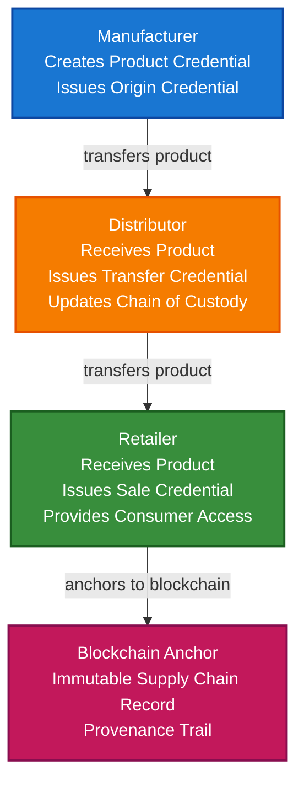

# Supply Chain & Traceability Scenario

This guide demonstrates how to build a supply chain traceability system using VeriCore that enables multi-party credentials, provenance tracking, product authenticity verification, and immutable chain of custody records.

## What You'll Build

By the end of this tutorial, you'll have:

- ✅ Created DIDs for supply chain participants (manufacturers, distributors, retailers)
- ✅ Issued product credentials at each supply chain stage
- ✅ Built provenance tracking system
- ✅ Implemented chain of custody verification
- ✅ Created product authenticity verification
- ✅ Anchored supply chain events to blockchain
- ✅ Built multi-party credential workflow

## Big Picture & Significance

### The Supply Chain Transparency Revolution

Modern supply chains are complex, global networks involving multiple parties. Consumers and regulators demand transparency, authenticity, and ethical sourcing. Blockchain-anchored verifiable credentials provide immutable proof of product journey from origin to consumer.

**Industry Context**:
- **Market Size**: Global supply chain management market projected to reach $37.4 billion by 2027
- **Regulatory Pressure**: Increasing requirements for product traceability (FDA, EU regulations)
- **Consumer Demand**: 73% of consumers want to know product origins
- **Fraud Impact**: Counterfeit goods cost $1.7 trillion annually globally
- **Sustainability**: Growing demand for ethical and sustainable sourcing

**Why This Matters**:
1. **Product Authenticity**: Prevent counterfeiting with cryptographic proof
2. **Food Safety**: Track food from farm to table for safety recalls
3. **Ethical Sourcing**: Verify fair trade and ethical labor practices
4. **Regulatory Compliance**: Meet traceability requirements
5. **Consumer Trust**: Build trust through transparency
6. **Sustainability**: Track carbon footprint and environmental impact

### The Supply Chain Challenge

Traditional supply chains face critical issues:
- **Lack of Transparency**: No visibility into product journey
- **Counterfeiting**: Fake products enter supply chain
- **Data Silos**: Each party maintains separate records
- **Trust Issues**: No cryptographic proof of authenticity
- **Regulatory Compliance**: Difficult to prove compliance
- **Recall Challenges**: Slow and incomplete recall processes

## Value Proposition

### Problems Solved

1. **Provenance Tracking**: Complete product journey from origin to consumer
2. **Authenticity Verification**: Cryptographic proof prevents counterfeiting
3. **Multi-Party Coordination**: Standard format works across all participants
4. **Regulatory Compliance**: Immutable records meet traceability requirements
5. **Recall Efficiency**: Instant identification of affected products
6. **Consumer Trust**: Transparent product information
7. **Sustainability**: Track environmental impact

### Business Benefits

**For Manufacturers**:
- **Brand Protection**: Prevent counterfeiting
- **Compliance**: Meet regulatory requirements
- **Efficiency**: Faster recall processes
- **Trust**: Build consumer confidence

**For Retailers**:
- **Authenticity**: Verify product authenticity
- **Compliance**: Meet regulatory requirements
- **Consumer Trust**: Provide product transparency
- **Risk Reduction**: Reduce liability from counterfeit products

**For Consumers**:
- **Authenticity**: Verify product is genuine
- **Transparency**: See product journey
- **Safety**: Track product safety information
- **Ethics**: Verify ethical sourcing

### ROI Considerations

- **Counterfeit Prevention**: Saves millions in lost revenue
- **Recall Efficiency**: 10x faster recall processes
- **Compliance**: Automated regulatory compliance
- **Consumer Trust**: Increased brand loyalty
- **Sustainability**: Enable premium pricing for verified products

## Understanding the Problem

Supply chain management faces several critical challenges:

1. **Provenance**: Track product from origin to consumer
2. **Authenticity**: Verify products are genuine
3. **Multi-Party**: Coordinate across multiple organizations
4. **Data Integrity**: Ensure records aren't tampered with
5. **Regulatory Compliance**: Meet traceability requirements
6. **Recall Management**: Quickly identify affected products
7. **Consumer Trust**: Provide transparent product information

### Real-World Pain Points

**Example 1: Food Safety Recall**
- Current: Manual tracking, slow identification, incomplete recalls
- Problem: Public health risk, financial losses
- Solution: Instant product tracking with verifiable credentials

**Example 2: Counterfeit Products**
- Current: No way to verify authenticity
- Problem: Brand damage, lost revenue, consumer harm
- Solution: Cryptographic proof of authenticity

**Example 3: Ethical Sourcing**
- Current: Difficult to verify supply chain ethics
- Problem: Consumer distrust, regulatory issues
- Solution: Verifiable credentials for each supply chain stage

## How It Works: Supply Chain Traceability Flow



## Key Concepts

### Supply Chain Participants

1. **Manufacturer**: Creates products, issues origin credentials
2. **Distributor**: Transports products, issues transfer credentials
3. **Retailer**: Sells products, issues sale credentials
4. **Consumer**: Receives products, can verify provenance

### Product Credentials

1. **Origin Credential**: Product creation at manufacturer
2. **Transfer Credential**: Product transfer between parties
3. **Processing Credential**: Product processing or transformation
4. **Sale Credential**: Product sale to consumer
5. **Chain of Custody**: Complete history of product ownership

### Provenance Tracking

- **Product ID**: Unique identifier for each product
- **Event Chain**: Sequence of credentials showing product journey
- **Verification**: Verify each step in the chain
- **Blockchain Anchoring**: Immutable record of supply chain events

## Prerequisites

- Java 21+
- Kotlin 2.2.0+
- Gradle 8.5+
- Basic understanding of Kotlin and coroutines
- Familiarity with supply chain concepts (helpful but not required)

## Step 1: Add Dependencies

Add VeriCore dependencies to your `build.gradle.kts`:

```kotlin
dependencies {
    // Core VeriCore modules
    implementation("io.geoknoesis.vericore:vericore-core:1.0.0-SNAPSHOT")
    implementation("io.geoknoesis.vericore:vericore-json:1.0.0-SNAPSHOT")
    implementation("io.geoknoesis.vericore:vericore-kms:1.0.0-SNAPSHOT")
    implementation("io.geoknoesis.vericore:vericore-did:1.0.0-SNAPSHOT")
    implementation("io.geoknoesis.vericore:vericore-anchor:1.0.0-SNAPSHOT")
    
    // Test kit for in-memory implementations
    implementation("io.geoknoesis.vericore:vericore-testkit:1.0.0-SNAPSHOT")
    
    // Kotlinx Serialization
    implementation("org.jetbrains.kotlinx:kotlinx-serialization-json:1.6.0")
    
    // Coroutines
    implementation("org.jetbrains.kotlinx:kotlinx-coroutines-core:1.7.3")
}
```

## Step 2: Complete Example

Here's a complete example demonstrating supply chain traceability:

```kotlin
import io.geoknoesis.vericore.credential.models.VerifiableCredential
import io.geoknoesis.vericore.credential.models.VerifiablePresentation
import io.geoknoesis.vericore.credential.CredentialIssuanceOptions
import io.geoknoesis.vericore.credential.CredentialVerificationOptions
import io.geoknoesis.vericore.credential.PresentationOptions
import io.geoknoesis.vericore.credential.issuer.CredentialIssuer
import io.geoknoesis.vericore.credential.verifier.CredentialVerifier
import io.geoknoesis.vericore.credential.proof.Ed25519ProofGenerator
import io.geoknoesis.vericore.credential.proof.ProofGeneratorRegistry
import io.geoknoesis.vericore.testkit.credential.InMemoryWallet
import io.geoknoesis.vericore.testkit.did.DidKeyMockMethod
import io.geoknoesis.vericore.testkit.kms.InMemoryKeyManagementService
import io.geoknoesis.vericore.testkit.anchor.InMemoryBlockchainAnchorClient
import io.geoknoesis.vericore.anchor.BlockchainAnchorRegistry
import io.geoknoesis.vericore.anchor.anchorTyped
import io.geoknoesis.vericore.did.DidMethodRegistry
import kotlinx.coroutines.runBlocking
import kotlinx.serialization.Serializable
import kotlinx.serialization.json.buildJsonObject
import kotlinx.serialization.json.put
import kotlinx.serialization.json.Json
import java.time.Instant
import java.util.UUID

@Serializable
data class SupplyChainEvent(
    val productId: String,
    val eventType: String,
    val participantDid: String,
    val timestamp: String,
    val credentialDigest: String,
    val previousEventDigest: String? = null
)

fun main() = runBlocking {
    println("=== Supply Chain & Traceability Scenario ===\n")
    
    // Step 1: Setup services
    println("Step 1: Setting up services...")
    val manufacturerKms = InMemoryKeyManagementService()
    val distributorKms = InMemoryKeyManagementService()
    val retailerKms = InMemoryKeyManagementService()
    
    val didMethod = DidKeyMockMethod(manufacturerKms)
    val didRegistry = DidMethodRegistry().apply { register(didMethod) }
    
    // Setup blockchain for anchoring
    val anchorClient = InMemoryBlockchainAnchorClient("eip155:1", emptyMap())
    val blockchainRegistry = BlockchainAnchorRegistry().apply {
        register("eip155:1", anchorClient)
    }
    
    // Step 2: Create supply chain participant DIDs
    println("\nStep 2: Creating supply chain participant DIDs...")
    val manufacturerDid = didMethod.createDid(mapOf("algorithm" to "Ed25519"))
    println("Manufacturer DID: ${manufacturerDid.id}")
    
    val distributorDid = didMethod.createDid(mapOf("algorithm" to "Ed25519"))
    println("Distributor DID: ${distributorDid.id}")
    
    val retailerDid = didMethod.createDid(mapOf("algorithm" to "Ed25519"))
    println("Retailer DID: ${retailerDid.id}")
    
    // Step 3: Create product
    println("\nStep 3: Creating product...")
    val productId = "PROD-${UUID.randomUUID()}"
    val productName = "Organic Coffee Beans"
    val batchNumber = "BATCH-2024-001"
    
    println("Product created:")
    println("  - Product ID: $productId")
    println("  - Name: $productName")
    println("  - Batch: $batchNumber")
    
    // Step 4: Manufacturer issues origin credential
    println("\nStep 4: Manufacturer issues origin credential...")
    val originCredential = createOriginCredential(
        productId = productId,
        productName = productName,
        batchNumber = batchNumber,
        manufacturerDid = manufacturerDid.id,
        originLocation = "Farm XYZ, Colombia",
        productionDate = Instant.now().toString(),
        certifications = listOf("Organic", "Fair Trade")
    )
    
    val manufacturerKey = manufacturerKms.generateKey("Ed25519")
    val manufacturerProofGenerator = Ed25519ProofGenerator(
        signer = { data, keyId -> manufacturerKms.sign(keyId, data) },
        getPublicKeyId = { keyId -> manufacturerKey.id }
    )
    
val didResolver = CredentialDidResolver { did ->
    didRegistry.resolve(did).toCredentialDidResolution()
}
    
    val manufacturerIssuer = CredentialIssuer(
        proofGenerator = manufacturerProofGenerator,
        resolveDid = { did -> didResolver.resolve(did)?.isResolvable == true }
    )
    
    val issuedOriginCredential = manufacturerIssuer.issue(
        credential = originCredential,
        issuerDid = manufacturerDid.id,
        keyId = manufacturerKey.id,
        options = CredentialIssuanceOptions(proofType = "Ed25519Signature2020")
    )
    
    println("Origin credential issued:")
    println("  - Product: $productName")
    println("  - Origin: Farm XYZ, Colombia")
    println("  - Certifications: Organic, Fair Trade")
    
    // Step 5: Anchor origin event to blockchain
    println("\nStep 5: Anchoring origin event to blockchain...")
    val originDigest = io.geoknoesis.vericore.json.DigestUtils.sha256DigestMultibase(
        Json.encodeToJsonElement(
            io.geoknoesis.vericore.credential.models.VerifiableCredential.serializer(),
            issuedOriginCredential
        )
    )
    
    val originEvent = SupplyChainEvent(
        productId = productId,
        eventType = "origin",
        participantDid = manufacturerDid.id,
        timestamp = Instant.now().toString(),
        credentialDigest = originDigest
    )
    
    val originAnchorResult = anchorTyped(
        value = originEvent,
        serializer = SupplyChainEvent.serializer(),
        targetChainId = "eip155:1"
    )
    
    println("Origin event anchored:")
    println("  - Transaction hash: ${originAnchorResult.ref.txHash}")
    println("  - Digest: $originDigest")
    
    // Step 6: Distributor receives product and issues transfer credential
    println("\nStep 6: Distributor receives product...")
    val transferCredential = createTransferCredential(
        productId = productId,
        fromDid = manufacturerDid.id,
        toDid = distributorDid.id,
        transferDate = Instant.now().toString(),
        transferLocation = "Distribution Center A",
        previousCredentialDigest = originDigest
    )
    
    val distributorKey = distributorKms.generateKey("Ed25519")
    val distributorProofGenerator = Ed25519ProofGenerator(
        signer = { data, keyId -> distributorKms.sign(keyId, data) },
        getPublicKeyId = { keyId -> distributorKey.id }
    )
    
    val distributorIssuer = CredentialIssuer(
        proofGenerator = distributorProofGenerator,
        resolveDid = { did -> didResolver.resolve(did)?.isResolvable == true }
    )
    
    val issuedTransferCredential = distributorIssuer.issue(
        credential = transferCredential,
        issuerDid = distributorDid.id,
        keyId = distributorKey.id,
        options = CredentialIssuanceOptions(proofType = "Ed25519Signature2020")
    )
    
    println("Transfer credential issued:")
    println("  - From: Manufacturer")
    println("  - To: Distributor")
    println("  - Location: Distribution Center A")
    
    // Step 7: Anchor transfer event
    println("\nStep 7: Anchoring transfer event...")
    val transferDigest = io.geoknoesis.vericore.json.DigestUtils.sha256DigestMultibase(
        Json.encodeToJsonElement(
            io.geoknoesis.vericore.credential.models.VerifiableCredential.serializer(),
            issuedTransferCredential
        )
    )
    
    val transferEvent = SupplyChainEvent(
        productId = productId,
        eventType = "transfer",
        participantDid = distributorDid.id,
        timestamp = Instant.now().toString(),
        credentialDigest = transferDigest,
        previousEventDigest = originDigest
    )
    
    val transferAnchorResult = anchorTyped(
        value = transferEvent,
        serializer = SupplyChainEvent.serializer(),
        targetChainId = "eip155:1"
    )
    
    println("Transfer event anchored")
    
    // Step 8: Retailer receives product and issues sale credential
    println("\nStep 8: Retailer receives product...")
    val saleCredential = createSaleCredential(
        productId = productId,
        fromDid = distributorDid.id,
        toDid = retailerDid.id,
        saleDate = Instant.now().toString(),
        saleLocation = "Retail Store B",
        previousCredentialDigest = transferDigest
    )
    
    val retailerKey = retailerKms.generateKey("Ed25519")
    val retailerProofGenerator = Ed25519ProofGenerator(
        signer = { data, keyId -> retailerKms.sign(keyId, data) },
        getPublicKeyId = { keyId -> retailerKey.id }
    )
    
    val retailerIssuer = CredentialIssuer(
        proofGenerator = retailerProofGenerator,
        resolveDid = { did -> didResolver.resolve(did)?.isResolvable == true }
    )
    
    val issuedSaleCredential = retailerIssuer.issue(
        credential = saleCredential,
        issuerDid = retailerDid.id,
        keyId = retailerKey.id,
        options = CredentialIssuanceOptions(proofType = "Ed25519Signature2020")
    )
    
    println("Sale credential issued")
    
    // Step 9: Verify product provenance
    println("\nStep 9: Verifying product provenance...")
    val provenanceChain = listOf(
        issuedOriginCredential,
        issuedTransferCredential,
        issuedSaleCredential
    )
    
    val provenanceValid = verifyProvenanceChain(provenanceChain)
    
    if (provenanceValid) {
        println("✅ Product provenance verified!")
        println("  - Origin: Farm XYZ, Colombia")
        println("  - Transfer: Manufacturer → Distributor")
        println("  - Sale: Distributor → Retailer")
    } else {
        println("❌ Provenance verification failed")
    }
    
    // Step 10: Verify product authenticity
    println("\nStep 10: Verifying product authenticity...")
    val verifier = CredentialVerifier(
        didResolver = CredentialDidResolver { did ->
            didRegistry.resolve(did).toCredentialDidResolution()
        }
    )
    
    val authenticityValid = verifier.verify(
        credential = issuedOriginCredential,
        options = CredentialVerificationOptions(
            checkRevocation = true,
            checkExpiration = false,
            validateSchema = true
        )
    )
    
    if (authenticityValid.valid) {
        println("✅ Product is authentic!")
        println("  - Verified manufacturer: ${manufacturerDid.id}")
        println("  - Certifications: Organic, Fair Trade")
    }
    
    // Step 11: Trace product history
    println("\nStep 11: Tracing product history...")
    val productHistory = traceProductHistory(
        productId = productId,
        events = listOf(originEvent, transferEvent)
    )
    
    println("Product history:")
    productHistory.forEach { event ->
        println("  - ${event.eventType}: ${event.participantDid} at ${event.timestamp}")
    }
    
    println("\n=== Scenario Complete ===")
}

fun createOriginCredential(
    productId: String,
    productName: String,
    batchNumber: String,
    manufacturerDid: String,
    originLocation: String,
    productionDate: String,
    certifications: List<String>
): VerifiableCredential {
    return VerifiableCredential(
        id = "https://manufacturer.example.com/products/$productId/origin",
        type = listOf("VerifiableCredential", "OriginCredential", "SupplyChainCredential"),
        issuer = manufacturerDid,
        credentialSubject = buildJsonObject {
            put("productId", productId)
            put("productName", productName)
            put("batchNumber", batchNumber)
            put("origin", buildJsonObject {
                put("location", originLocation)
                put("productionDate", productionDate)
                put("certifications", certifications)
            })
        },
        issuanceDate = Instant.now().toString(),
        expirationDate = null,
        credentialSchema = io.geoknoesis.vericore.credential.models.CredentialSchema(
            id = "https://example.com/schemas/origin-credential.json",
            type = "JsonSchemaValidator2018",
            schemaFormat = io.geoknoesis.vericore.spi.SchemaFormat.JSON_SCHEMA
        )
    )
}

fun createTransferCredential(
    productId: String,
    fromDid: String,
    toDid: String,
    transferDate: String,
    transferLocation: String,
    previousCredentialDigest: String
): VerifiableCredential {
    return VerifiableCredential(
        id = "https://distributor.example.com/transfers/$productId-${Instant.now().toEpochMilli()}",
        type = listOf("VerifiableCredential", "TransferCredential", "SupplyChainCredential"),
        issuer = toDid,
        credentialSubject = buildJsonObject {
            put("productId", productId)
            put("transfer", buildJsonObject {
                put("fromDid", fromDid)
                put("toDid", toDid)
                put("transferDate", transferDate)
                put("transferLocation", transferLocation)
                put("previousCredentialDigest", previousCredentialDigest)
            })
        },
        issuanceDate = Instant.now().toString(),
        expirationDate = null,
        credentialSchema = io.geoknoesis.vericore.credential.models.CredentialSchema(
            id = "https://example.com/schemas/transfer-credential.json",
            type = "JsonSchemaValidator2018",
            schemaFormat = io.geoknoesis.vericore.spi.SchemaFormat.JSON_SCHEMA
        )
    )
}

fun createSaleCredential(
    productId: String,
    fromDid: String,
    toDid: String,
    saleDate: String,
    saleLocation: String,
    previousCredentialDigest: String
): VerifiableCredential {
    return VerifiableCredential(
        id = "https://retailer.example.com/sales/$productId-${Instant.now().toEpochMilli()}",
        type = listOf("VerifiableCredential", "SaleCredential", "SupplyChainCredential"),
        issuer = toDid,
        credentialSubject = buildJsonObject {
            put("productId", productId)
            put("sale", buildJsonObject {
                put("fromDid", fromDid)
                put("toDid", toDid)
                put("saleDate", saleDate)
                put("saleLocation", saleLocation)
                put("previousCredentialDigest", previousCredentialDigest)
            })
        },
        issuanceDate = Instant.now().toString(),
        expirationDate = null,
        credentialSchema = io.geoknoesis.vericore.credential.models.CredentialSchema(
            id = "https://example.com/schemas/sale-credential.json",
            type = "JsonSchemaValidator2018",
            schemaFormat = io.geoknoesis.vericore.spi.SchemaFormat.JSON_SCHEMA
        )
    )
}

fun verifyProvenanceChain(credentials: List<VerifiableCredential>): Boolean {
    if (credentials.isEmpty()) return false
    
    // Verify each credential
    val verifier = CredentialVerifier(
        didResolver = CredentialDidResolver { did ->
            didRegistry.resolve(did).toCredentialDidResolution()
        }
    )
    
    credentials.forEach { credential ->
        val verification = verifier.verify(
            credential = credential,
            options = CredentialVerificationOptions(
                checkRevocation = true,
                checkExpiration = false
            )
        )
        if (!verification.valid) return false
    }
    
    // Verify chain continuity (each credential references previous)
    for (i in 1 until credentials.size) {
        val current = credentials[i]
        val previous = credentials[i - 1]
        
        val previousDigest = io.geoknoesis.vericore.json.DigestUtils.sha256DigestMultibase(
            Json.encodeToJsonElement(
                io.geoknoesis.vericore.credential.models.VerifiableCredential.serializer(),
                previous
            )
        )
        
        val referencedDigest = current.credentialSubject.jsonObject
            .get("transfer")?.jsonObject
            ?.get("previousCredentialDigest")?.jsonPrimitive?.content
            ?: current.credentialSubject.jsonObject
                .get("sale")?.jsonObject
                ?.get("previousCredentialDigest")?.jsonPrimitive?.content
        
        if (referencedDigest != previousDigest) return false
    }
    
    return true
}

fun traceProductHistory(
    productId: String,
    events: List<SupplyChainEvent>
): List<SupplyChainEvent> {
    return events.filter { it.productId == productId }
        .sortedBy { it.timestamp }
}
```

## Extensive Step-by-Step Breakdown

### Step 1: Setup and Initialization

**Purpose**: Initialize supply chain traceability system with proper key management for multiple participants.

**Detailed Explanation**:
1. **Multiple Participant KMS**: Separate key management for manufacturer, distributor, retailer ensures proper key isolation
2. **DID Method Registration**: Register DID method for creating participant identities
3. **Blockchain Setup**: Initialize blockchain for anchoring supply chain events

**Why This Matters**: Supply chains involve multiple independent parties. Proper initialization ensures each party has secure, independent cryptographic capabilities.

### Step 2: Create Supply Chain Participant DIDs

**Purpose**: Establish verifiable identities for all supply chain participants.

**Detailed Explanation**:
- **Manufacturer DID**: Represents product manufacturer
- **Distributor DID**: Represents product distributor
- **Retailer DID**: Represents product retailer

**Key Considerations**:
- Each participant has independent DID
- DIDs provide persistent, verifiable identities
- No central registry required
- Works across different systems

### Step 3: Create Product

**Purpose**: Define product with unique identifier.

**Detailed Explanation**:
- **Product ID**: Unique identifier for tracking
- **Product Name**: Human-readable product name
- **Batch Number**: Batch identifier for grouping products

**Why This Matters**: Unique product identification enables precise tracking throughout the supply chain.

### Step 4: Manufacturer Issues Origin Credential

**Purpose**: Create verifiable credential for product origin.

**Detailed Explanation**:
1. **Origin Data**: Location, production date, certifications
2. **Credential Structure**: Follows W3C VC standard
3. **Proof Generation**: Cryptographic signature from manufacturer
4. **Certifications**: Include certifications (Organic, Fair Trade, etc.)

**Security Features**:
- Tamper-proof cryptographic proof
- Verifiable manufacturer
- Certifications provide additional trust signals
- Can be verified by any party

### Step 5: Anchor Origin Event to Blockchain

**Purpose**: Create immutable record of product origin.

**Detailed Explanation**:
1. **Event Record**: Create structured record of origin event
2. **Blockchain Anchoring**: Anchor to blockchain for immutability
3. **Digest**: Cryptographic hash of credential

**Benefits**:
- Immutable record
- Timestamped origin
- Cannot be tampered with
- Provides audit trail

### Step 6: Distributor Issues Transfer Credential

**Purpose**: Create verifiable credential for product transfer.

**Detailed Explanation**:
1. **Transfer Data**: From/to parties, location, date
2. **Chain Continuity**: References previous credential digest
3. **Proof Generation**: Cryptographic signature from distributor

**Chain of Custody**:
- Links to previous credential
- Maintains provenance chain
- Verifiable transfer
- Immutable record

### Step 7: Anchor Transfer Event

**Purpose**: Create immutable record of product transfer.

**Detailed Explanation**:
1. **Event Record**: Create structured record of transfer
2. **Previous Event Reference**: Links to origin event
3. **Blockchain Anchoring**: Anchor to blockchain

**Provenance Benefits**:
- Complete product journey
- Verifiable chain of custody
- Immutable transfer records
- Audit trail

### Step 8: Retailer Issues Sale Credential

**Purpose**: Create verifiable credential for product sale.

**Detailed Explanation**:
1. **Sale Data**: From/to parties, location, date
2. **Chain Continuity**: References previous credential digest
3. **Proof Generation**: Cryptographic signature from retailer

**Final Step**:
- Completes supply chain journey
- Enables consumer verification
- Provides sale record
- Maintains provenance chain

### Step 9: Verify Product Provenance

**Purpose**: Verify complete product journey from origin to sale.

**Detailed Explanation**:
1. **Credential Verification**: Verify each credential in chain
2. **Chain Continuity**: Verify each credential references previous
3. **Participant Verification**: Verify all participants are legitimate

**Verification Process**:
- Check cryptographic proofs
- Verify credential signatures
- Check chain continuity
- Validate participant DIDs

### Step 10: Verify Product Authenticity

**Purpose**: Verify product is genuine and from claimed manufacturer.

**Detailed Explanation**:
1. **Origin Verification**: Verify origin credential
2. **Manufacturer Verification**: Verify manufacturer DID
3. **Certification Verification**: Verify certifications

**Authenticity Benefits**:
- Prevents counterfeiting
- Verifies manufacturer
- Confirms certifications
- Builds consumer trust

### Step 11: Trace Product History

**Purpose**: Retrieve complete product history from blockchain.

**Detailed Explanation**:
1. **Event Retrieval**: Retrieve all events for product
2. **Chronological Order**: Sort events by timestamp
3. **History Display**: Show complete product journey

**Traceability Benefits**:
- Complete visibility
- Consumer transparency
- Regulatory compliance
- Recall efficiency

## Advanced Features

### Multi-Stage Processing

Track product through processing stages:

```kotlin
fun createProcessingCredential(
    productId: String,
    processorDid: String,
    processingType: String,
    processingDate: String,
    previousCredentialDigest: String
): VerifiableCredential {
    return VerifiableCredential(
        type = listOf("VerifiableCredential", "ProcessingCredential", "SupplyChainCredential"),
        issuer = processorDid,
        credentialSubject = buildJsonObject {
            put("productId", productId)
            put("processing", buildJsonObject {
                put("processingType", processingType)
                put("processingDate", processingDate)
                put("processorDid", processorDid)
                put("previousCredentialDigest", previousCredentialDigest)
            })
        },
        issuanceDate = Instant.now().toString()
    )
}
```

### Quality Certifications

Add quality certifications at each stage:

```kotlin
fun addQualityCertification(
    productId: String,
    certifierDid: String,
    certificationType: String,
    testResults: Map<String, String>
): VerifiableCredential {
    return VerifiableCredential(
        type = listOf("VerifiableCredential", "QualityCertificationCredential"),
        issuer = certifierDid,
        credentialSubject = buildJsonObject {
            put("productId", productId)
            put("certification", buildJsonObject {
                put("certificationType", certificationType)
                put("testResults", buildJsonObject {
                    testResults.forEach { (key, value) ->
                        put(key, value)
                    }
                })
            })
        },
        issuanceDate = Instant.now().toString()
    )
}
```

### Recall Management

Enable efficient product recalls:

```kotlin
fun recallProducts(
    batchNumber: String,
    recallReason: String,
    affectedProducts: List<String>
): List<VerifiableCredential> {
    return affectedProducts.map { productId ->
        VerifiableCredential(
            type = listOf("VerifiableCredential", "RecallCredential"),
            issuer = "did:example:regulatory-authority",
            credentialSubject = buildJsonObject {
                put("productId", productId)
                put("batchNumber", batchNumber)
                put("recallReason", recallReason)
                put("recallDate", Instant.now().toString())
            },
            issuanceDate = Instant.now().toString()
        )
    }
}

fun checkProductRecall(productId: String, credentials: List<VerifiableCredential>): Boolean {
    return credentials.any { credential ->
        credential.type.contains("RecallCredential") &&
        credential.credentialSubject.jsonObject["productId"]?.jsonPrimitive?.content == productId
    }
}
```

## Real-World Use Cases

### 1. Food Traceability (Farm to Table)

**Scenario**: Track organic produce from farm to consumer.

**Implementation**:

```kotlin
fun createFarmToTableTraceability(
    productId: String,
    farmDid: String,
    processorDid: String,
    distributorDid: String,
    retailerDid: String
): List<VerifiableCredential> {
    // Farm origin
    val farmCredential = createOriginCredential(
        productId = productId,
        productName = "Organic Tomatoes",
        batchNumber = "BATCH-2024-001",
        manufacturerDid = farmDid,
        originLocation = "Organic Farm XYZ",
        productionDate = Instant.now().toString(),
        certifications = listOf("Organic", "Non-GMO")
    )
    
    // Processing
    val processingCredential = createProcessingCredential(
        productId = productId,
        processorDid = processorDid,
        processingType = "Washing and Packaging",
        processingDate = Instant.now().toString(),
        previousCredentialDigest = "farm-digest"
    )
    
    // Distribution
    val distributionCredential = createTransferCredential(
        productId = productId,
        fromDid = processorDid,
        toDid = distributorDid,
        transferDate = Instant.now().toString(),
        transferLocation = "Cold Storage Facility",
        previousCredentialDigest = "processing-digest"
    )
    
    // Retail sale
    val saleCredential = createSaleCredential(
        productId = productId,
        fromDid = distributorDid,
        toDid = retailerDid,
        saleDate = Instant.now().toString(),
        saleLocation = "Grocery Store ABC",
        previousCredentialDigest = "distribution-digest"
    )
    
    return listOf(farmCredential, processingCredential, distributionCredential, saleCredential)
}
```

### 2. Pharmaceutical Tracking

**Scenario**: Track pharmaceuticals through supply chain to prevent counterfeiting.

**Implementation**:

```kotlin
fun createPharmaceuticalTracking(
    productId: String,
    manufacturerDid: String,
    distributorDid: String,
    pharmacyDid: String,
    lotNumber: String,
    expirationDate: String
): List<VerifiableCredential> {
    // Manufacturer origin
    val originCredential = VerifiableCredential(
        type = listOf("VerifiableCredential", "PharmaceuticalOriginCredential"),
        issuer = manufacturerDid,
        credentialSubject = buildJsonObject {
            put("productId", productId)
            put("pharmaceutical", buildJsonObject {
                put("drugName", "Medication XYZ")
                put("lotNumber", lotNumber)
                put("manufacturingDate", Instant.now().toString())
                put("expirationDate", expirationDate)
                put("manufacturerDid", manufacturerDid)
            })
        },
        issuanceDate = Instant.now().toString()
    )
    
    // Distribution
    val distributionCredential = createTransferCredential(
        productId = productId,
        fromDid = manufacturerDid,
        toDid = distributorDid,
        transferDate = Instant.now().toString(),
        transferLocation = "Pharmaceutical Distribution Center",
        previousCredentialDigest = "origin-digest"
    )
    
    // Pharmacy receipt
    val pharmacyCredential = createSaleCredential(
        productId = productId,
        fromDid = distributorDid,
        toDid = pharmacyDid,
        saleDate = Instant.now().toString(),
        saleLocation = "Pharmacy ABC",
        previousCredentialDigest = "distribution-digest"
    )
    
    return listOf(originCredential, distributionCredential, pharmacyCredential)
}
```

### 3. Luxury Goods Authentication

**Scenario**: Verify authenticity of luxury goods.

**Implementation**:

```kotlin
fun verifyLuxuryGoodAuthenticity(
    productId: String,
    brandDid: String,
    credentials: List<VerifiableCredential>
): Boolean {
    // Find origin credential from brand
    val originCredential = credentials.firstOrNull { credential ->
        credential.type.contains("OriginCredential") &&
        credential.issuer == brandDid
    } ?: return false
    
    // Verify origin credential
    val verifier = CredentialVerifier(
        didResolver = CredentialDidResolver { did ->
            didRegistry.resolve(did).toCredentialDidResolution()
        }
    )
    
    val verification = verifier.verify(
        credential = originCredential,
        options = CredentialVerificationOptions(
            checkRevocation = true,
            checkExpiration = false
        )
    )
    
    if (!verification.valid) return false
    
    // Verify provenance chain
    return verifyProvenanceChain(credentials)
}
```

## Benefits

1. **Provenance Tracking**: Complete product journey visibility
2. **Authenticity Verification**: Cryptographic proof prevents counterfeiting
3. **Multi-Party Coordination**: Standard format works across all participants
4. **Regulatory Compliance**: Immutable records meet traceability requirements
5. **Recall Efficiency**: Instant identification of affected products
6. **Consumer Trust**: Transparent product information
7. **Sustainability**: Track environmental impact
8. **Fraud Prevention**: Tamper-proof credentials prevent fraud
9. **Efficiency**: Faster verification processes
10. **Interoperability**: Works across different systems

## Best Practices

1. **Unique Product IDs**: Use unique identifiers for each product
2. **Chain Continuity**: Always reference previous credential digest
3. **Blockchain Anchoring**: Anchor critical events to blockchain
4. **Verification**: Verify credentials at each stage
5. **Schema Validation**: Validate credential structure
6. **Error Handling**: Handle verification failures gracefully
7. **Audit Logging**: Log all supply chain events
8. **Key Management**: Use secure key storage
9. **Participant Verification**: Verify participant DIDs
10. **Recall Planning**: Plan for efficient recalls

## Next Steps

- Learn about [Blockchain Anchoring](../core-concepts/blockchain-anchoring.md)
- Explore [Proof of Location Scenario](proof-of-location-scenario.md) for geospatial tracking
- Check out [Financial Services & KYC Scenario](financial-services-kyc-scenario.md) for related verification
- Review [Core Concepts: Verifiable Credentials](../core-concepts/verifiable-credentials.md) for credential details


