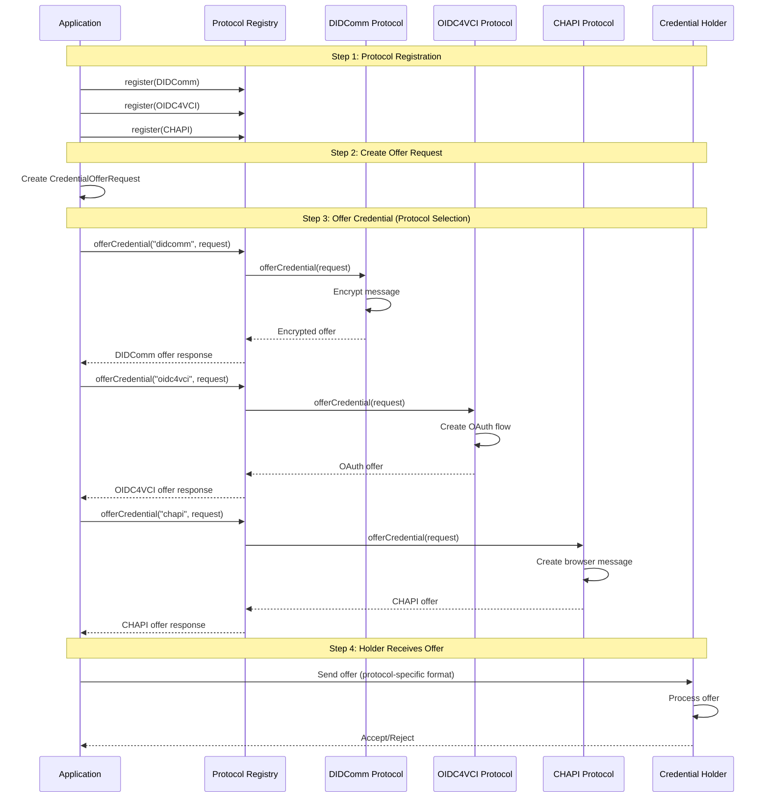

# Exchange Credentials with Multiple Protocols

This guide shows you how to use TrustWeave's unified API to exchange credentials using any protocol (DIDComm, OIDC4VCI, CHAPI) with the same code. Switch protocols at runtime without changing your application logic.

## Prerequisites

Before you begin, ensure you have:

- ✅ TrustWeave dependencies added to your project
- ✅ Understanding of credential issuance and verification
- ✅ Basic knowledge of credential exchange protocols
- ✅ Protocol-specific dependencies (optional, for specific protocols)

## Expected Outcome

After completing this guide, you will have:

- ✅ Registered multiple credential exchange protocols
- ✅ Exchanged credentials using different protocols with the same API
- ✅ Understood when to use each protocol
- ✅ Implemented protocol switching at runtime

## Quick Example

Here's a complete example showing unified API for all protocols:

```kotlin
import com.trustweave.credential.exchange.*
import com.trustweave.credential.didcomm.exchange.DidCommExchangeProtocol
import com.trustweave.credential.oidc4vci.exchange.Oidc4VciExchangeProtocol
import com.trustweave.credential.chapi.exchange.ChapiExchangeProtocol
import kotlinx.coroutines.runBlocking

fun main() = runBlocking {
    // Step 1: Create registry
    val registry = CredentialExchangeProtocolRegistry()
    
    // Step 2: Register protocols
    registry.register(DidCommExchangeProtocol(didCommService))
    registry.register(Oidc4VciExchangeProtocol(oidc4vciService))
    registry.register(ChapiExchangeProtocol(chapiService))
    
    // Step 3: Create offer request (same for all protocols)
    val request = CredentialOfferRequest(
        issuerDid = "did:key:issuer",
        holderDid = "did:key:holder",
        credentialPreview = CredentialPreview(...)
    )
    
    // Step 4: Use any protocol with identical API
    val didCommOffer = registry.offerCredential("didcomm", request)
    val oidcOffer = registry.offerCredential("oidc4vci", request)
    val chapiOffer = registry.offerCredential("chapi", request)
    
    println("✅ Created offers with all protocols")
}
```

**Expected Output:**
```
✅ Created offers with all protocols
```

## Step-by-Step Guide

### Step 1: Set Up Protocol Services

First, create the protocol-specific services:

```kotlin
import com.trustweave.credential.didcomm.DidCommFactory
import com.trustweave.credential.oidc4vci.Oidc4VciService
import com.trustweave.credential.chapi.ChapiService
import com.trustweave.kms.KeyManagementService

// Create KMS for cryptographic operations
val kms: KeyManagementService = InMemoryKeyManagementService()

// Create DID resolver function
val resolveDid: suspend (String) -> DidDocument? = { did ->
    // Your DID resolution logic
    null
}

// Create protocol services
val didCommService = DidCommFactory.createInMemoryService(kms, resolveDid)
val oidc4vciService = Oidc4VciService(...)
val chapiService = ChapiService(...)
```

**What this does:**
- ✅ Sets up key management for encryption/signing
- ✅ Configures DID resolution
- ✅ Creates protocol-specific services

**Expected Result:** Protocol services ready for registration.

---

### Step 2: Create and Register Protocols

Create the registry and register all protocols:

```kotlin
import com.trustweave.credential.exchange.CredentialExchangeProtocolRegistry
import com.trustweave.credential.didcomm.exchange.DidCommExchangeProtocol
import com.trustweave.credential.oidc4vci.exchange.Oidc4VciExchangeProtocol
import com.trustweave.credential.chapi.exchange.ChapiExchangeProtocol

val registry = CredentialExchangeProtocolRegistry()

// Register DIDComm
registry.register(DidCommExchangeProtocol(didCommService))

// Register OIDC4VCI
registry.register(Oidc4VciExchangeProtocol(oidc4vciService))

// Register CHAPI
registry.register(ChapiExchangeProtocol(chapiService))
```

**What this does:**
- ✅ Creates a unified registry
- ✅ Registers all available protocols
- ✅ Makes protocols available via unified API

**Expected Result:** Registry with all protocols registered.

---

### Step 3: Create Credential Offer Request

Create a request that works with all protocols:

```kotlin
import com.trustweave.credential.exchange.CredentialOfferRequest
import com.trustweave.credential.exchange.CredentialPreview

val request = CredentialOfferRequest(
    issuerDid = "did:key:issuer",
    holderDid = "did:key:holder",
    credentialPreview = CredentialPreview(
        type = listOf("VerifiableCredential", "EducationCredential"),
        claims = mapOf(
            "degree" to "Bachelor of Science",
            "university" to "Example University"
        )
    )
)
```

**What this does:**
- ✅ Defines issuer and holder DIDs
- ✅ Creates credential preview
- ✅ Works with all protocols

**Expected Result:** A request object ready for any protocol.

---

### Step 4: Offer Credential with Any Protocol

Use the same API for all protocols:

```kotlin
// DIDComm
val didCommOffer = registry.offerCredential("didcomm", request)

// OIDC4VCI
val oidcOffer = registry.offerCredential("oidc4vci", request)

// CHAPI
val chapiOffer = registry.offerCredential("chapi", request)
```

**What this does:**
- ✅ Creates offers using different protocols
- ✅ Uses identical API for all
- ✅ Returns protocol-specific responses

**Expected Result:** Credential offers created with all protocols.

---

## Workflow: Multi-Protocol Credential Exchange

The following swimlane diagram shows how different components interact during credential exchange:



---

## Protocol Comparison

### When to Use Each Protocol

| Protocol | Best For | Encryption | Transport |
|----------|----------|------------|-----------|
| **DIDComm** | Peer-to-peer, high security | ✅ End-to-end (ECDH-1PU) | Direct messaging |
| **OIDC4VCI** | Web-based, OAuth integration | Via HTTPS | HTTP/REST |
| **CHAPI** | Browser wallet interactions | Browser security | Browser API |

### Decision Tree

```
Need credential exchange?
├─ Need peer-to-peer encryption?
│  └─ Yes → Use DIDComm
└─ No
   ├─ Web-based OAuth integration?
   │  └─ Yes → Use OIDC4VCI
   └─ No
      └─ Browser-based wallet?
         └─ Yes → Use CHAPI
```

---

## Common Patterns

### Pattern 1: Protocol Selection at Runtime

Select protocol based on holder capabilities:

```kotlin
fun selectProtocol(holderCapabilities: HolderCapabilities): String {
    return when {
        holderCapabilities.supportsDidComm -> "didcomm"
        holderCapabilities.supportsOidc4vci -> "oidc4vci"
        holderCapabilities.supportsChapi -> "chapi"
        else -> "didcomm" // Default
    }
}

// Use selected protocol
val protocol = selectProtocol(holderCapabilities)
val offer = registry.offerCredential(protocol, request)
```

### Pattern 2: Multi-Protocol Support

Support multiple protocols and let holder choose:

```kotlin
// Create offers with all protocols
val offers = mapOf(
    "didcomm" to registry.offerCredential("didcomm", request),
    "oidc4vci" to registry.offerCredential("oidc4vci", request),
    "chapi" to registry.offerCredential("chapi", request)
)

// Present options to holder
holder.selectProtocol(offers.keys) { selectedProtocol ->
    val offer = offers[selectedProtocol]
    // Continue with selected protocol
}
```

### Pattern 3: Protocol Fallback

Try protocols in order of preference:

```kotlin
suspend fun offerWithFallback(
    request: CredentialOfferRequest,
    preferredProtocols: List<String> = listOf("didcomm", "oidc4vci", "chapi")
): CredentialOfferResponse? {
    for (protocol in preferredProtocols) {
        try {
            return registry.offerCredential(protocol, request)
        } catch (e: ExchangeException.ProtocolNotRegistered) {
            // Try next protocol
            continue
        } catch (e: Exception) {
            // Protocol error, try next
            continue
        }
    }
    return null // All protocols failed
}
```

---

## Complete Workflow Example

End-to-end credential exchange with protocol abstraction:

```kotlin
import com.trustweave.credential.exchange.*
import kotlinx.coroutines.runBlocking

fun main() = runBlocking {
    // 1. Setup
    val registry = CredentialExchangeProtocolRegistry()
    registry.register(DidCommExchangeProtocol(didCommService))
    registry.register(Oidc4VciExchangeProtocol(oidc4vciService))
    
    // 2. Create offer request
    val request = CredentialOfferRequest(
        issuerDid = "did:key:issuer",
        holderDid = "did:key:holder",
        credentialPreview = CredentialPreview(...)
    )
    
    // 3. Offer credential (protocol selection)
    val protocol = "didcomm" // or select dynamically
    val offer = registry.offerCredential(protocol, request)
    
    // 4. Holder requests credential
    val credentialRequest = registry.requestCredential(
        protocol,
        RequestCredentialRequest(
            offerId = offer.offerId,
            holderDid = "did:key:holder"
        )
    )
    
    // 5. Issue credential
    val issuedCredential = registry.issueCredential(
        protocol,
        IssueCredentialRequest(
            requestId = credentialRequest.requestId,
            credential = credential,
            issuerDid = "did:key:issuer"
        )
    )
    
    println("✅ Credential issued via $protocol")
}
```

---

## Error Handling

Handle protocol-specific errors:

```kotlin
import com.trustweave.credential.exchange.exception.ExchangeException

try {
    val offer = registry.offerCredential("didcomm", request)
} catch (error: ExchangeException) {
    when (error) {
        is ExchangeException.ProtocolNotRegistered -> {
            println("Protocol not registered: ${error.protocolName}")
            println("Available: ${registry.getRegisteredProtocols()}")
        }
        is ExchangeException.MissingRequiredOption -> {
            println("Missing option: ${error.option}")
        }
        else -> {
            println("Exchange error: ${error.message}")
        }
    }
}
```

---

## Benefits of Unified API

### Before (Without TrustWeave)

```kotlin
// Each protocol requires completely different code
val didCommOffer = didCommService.createOffer(
    from = issuerDid,
    to = holderDid,
    credentialPreview = preview,
    encryptionKey = keyAgreementKey,
    signingKey = signingKey
)

val oidc4vciOffer = oidc4vciClient.requestCredentialOffer(
    issuerUrl = issuerEndpoint,
    clientId = oauthClientId,
    redirectUri = callbackUrl,
    scope = "credential_offer"
)

val chapiOffer = chapiHandler.createOfferMessage(
    credentialManifest = manifest,
    wallet = browserWallet,
    options = chapiOptions
)
```

**Problems:**
- ❌ Different APIs for each protocol
- ❌ Hard to switch protocols
- ❌ Code duplication
- ❌ Difficult to maintain

### After (With TrustWeave)

```kotlin
// One API, any protocol
val didCommOffer = registry.offerCredential("didcomm", request)
val oidc4vciOffer = registry.offerCredential("oidc4vci", request)
val chapiOffer = registry.offerCredential("chapi", request)
```

**Benefits:**
- ✅ Same API for all protocols
- ✅ Easy protocol switching
- ✅ No code duplication
- ✅ Easy to maintain

---

## Next Steps

Now that you've learned credential exchange, you can:

1. **[Issue Credentials](issue-credentials.md)** - Learn credential issuance details
2. **[Verify Credentials](verify-credentials.md)** - Verify exchanged credentials
3. **[Configure TrustWeave](configure-trustlayer.md)** - Full configuration options
4. **[Protocol-Specific Guides](../features/credential-exchange-protocols/)** - Deep dive into each protocol

---

## Related Documentation

- **[Credential Exchange Protocols](../features/credential-exchange-protocols/README.md)** - Complete protocol documentation
- **[API Reference](../api-reference/core-api.md)** - Complete API documentation
- **[Core Concepts](../core-concepts/credential-exchange-protocols.md)** - Understanding protocol abstraction

