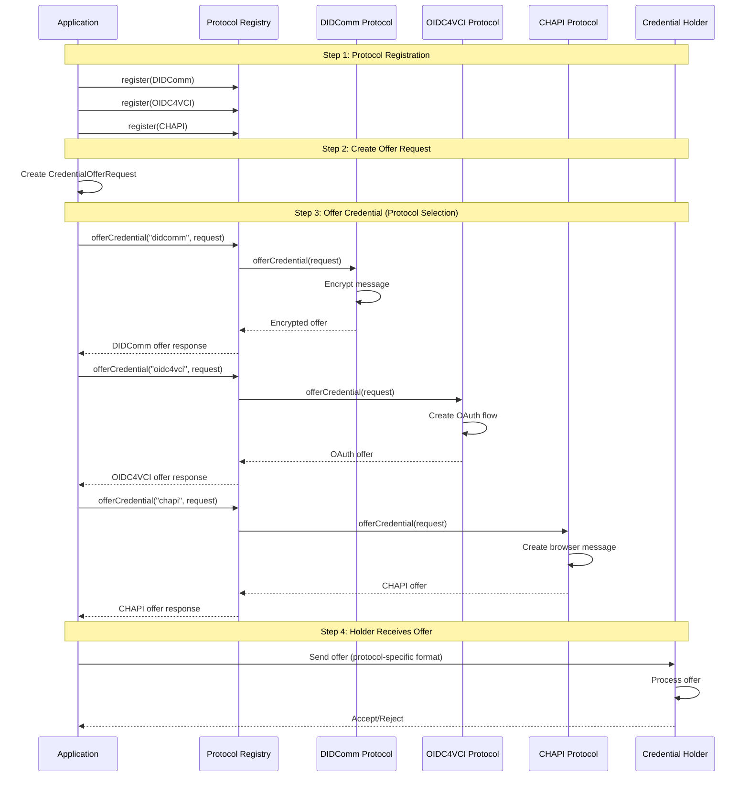

# Exchange Credentials with Multiple Protocols

This guide shows you how to use TrustWeave's unified API to exchange credentials using any protocol (DIDComm, OIDC4VCI, CHAPI) with the same code. Switch protocols at runtime without changing your application logic.

## Prerequisites

Before you begin, ensure you have:

- TrustWeave dependencies added to your project
- Understanding of credential issuance and verification
- Basic knowledge of credential exchange protocols
- Protocol-specific dependencies (optional, for specific protocols)

## Expected Outcome

After completing this guide, you will have:

- Registered multiple credential exchange protocols
- Exchanged credentials using different protocols with the same API
- Understood when to use each protocol
- Implemented protocol switching at runtime

## Credential Exchange Flow

Credential exchange involves multiple parties working together:

```mermaid
sequenceDiagram
    participant Issuer
    participant Holder
    participant Verifier
    participant Protocol as Exchange Protocol<br/>(DIDComm/OIDC4VCI/CHAPI)
    
    Note over Issuer,Verifier: Phase 1: Credential Offer
    Issuer->>Protocol: Create Credential Offer
    Protocol->>Holder: Send Offer
    Holder->>Holder: Review Credential Offer
    
    Note over Issuer,Verifier: Phase 2: Credential Request
    Holder->>Protocol: Request Credential
    Protocol->>Issuer: Forward Request
    Issuer->>Issuer: Validate Request
    
    Note over Issuer,Verifier: Phase 3: Credential Issuance
    Issuer->>Protocol: Issue Credential
    Protocol->>Holder: Deliver Credential
    Holder->>Holder: Store in Wallet
    
    Note over Issuer,Verifier: Phase 4: Presentation
    Verifier->>Holder: Request Presentation
    Holder->>Protocol: Create Presentation
    Protocol->>Verifier: Send Presentation
    Verifier->>Verifier: Verify Presentation
    
    style Issuer fill:#4caf50,stroke:#2e7d32,stroke-width:2px,color:#fff
    style Holder fill:#2196f3,stroke:#1565c0,stroke-width:2px,color:#fff
    style Verifier fill:#ff9800,stroke:#e65100,stroke-width:2px,color:#fff
    style Protocol fill:#9c27b0,stroke:#6a1b9a,stroke-width:2px,color:#fff
```

**Key Phases:**
1. **Offer**: Issuer creates and sends credential offer to holder
2. **Request**: Holder requests the credential from issuer
3. **Issuance**: Issuer issues credential to holder
4. **Presentation**: Holder creates presentation and shares with verifier

## Quick Example

The unified entry point is `org.trustweave.credential.exchange.ExchangeService`. Build
it once via `ExchangeServices.createExchangeServiceWithAutoDiscovery(...)` (which
picks up every `CredentialExchangeProtocol` on the classpath via Java ServiceLoader),
then call `offer(...)`, `request(...)`, `issue(...)`, `requestProof(...)`, or
`presentProof(...)`. Each call returns a sealed `ExchangeResult<...>` you must
exhaustively handle.

```kotlin
import kotlinx.coroutines.runBlocking
import org.trustweave.credential.exchange.ExchangeServices
import org.trustweave.credential.exchange.model.CredentialPreview
import org.trustweave.credential.exchange.request.ExchangeRequest
import org.trustweave.credential.exchange.result.ExchangeResult
import org.trustweave.credential.identifiers.ExchangeProtocolName
import org.trustweave.did.identifiers.Did

fun main() = runBlocking {
    val service = ExchangeServices.createExchangeServiceWithAutoDiscovery(
        credentialService = credentialService,    // your configured CredentialService
        didResolver       = didResolver            // your configured DidResolver
    )

    val offer = ExchangeRequest.Offer(
        protocolName      = ExchangeProtocolName.DidComm,
        issuerDid         = Did("did:key:issuer"),
        holderDid         = Did("did:key:holder"),
        credentialPreview = CredentialPreview(
            type   = listOf("VerifiableCredential", "EducationCredential"),
            claims = mapOf("degree" to "Bachelor of Science")
        )
    )

    when (val result = service.offer(offer)) {
        is ExchangeResult.Success ->
            println("Offer created: id=${result.value.offerId.value}")
        is ExchangeResult.Failure.ProtocolNotSupported ->
            println("Protocol ${result.protocolName.value} not on classpath. " +
                "Available: ${result.availableProtocols.map { it.value }}")
        is ExchangeResult.Failure ->
            println("Offer failed: ${result.errors.joinToString()}")
    }
}
```

**Expected Output (when the DIDComm plugin is on the classpath):**
```
Offer created: id=<uuid>
```

## Step-by-Step Guide

### Step 1: Build the `ExchangeService`

Pick one of the three factories on `ExchangeServices`:

- `createExchangeServiceWithAutoDiscovery(credentialService, didResolver)` — discovers
  every `CredentialExchangeProtocol` on the classpath via `META-INF/services` (recommended).
- `createExchangeServiceWithAutoDiscovery(credentialService, didResolver, protocols = [...])` —
  same as above but restricted to a list of `ExchangeProtocolName` values.
- `createExchangeService(credentialService, didResolver, vararg protocols)` — register
  protocols explicitly when you need full control.

```kotlin
import org.trustweave.credential.exchange.ExchangeServices

val service = ExchangeServices.createExchangeServiceWithAutoDiscovery(
    credentialService = credentialService,
    didResolver       = didResolver
)

println("Supported protocols: ${service.supportedProtocols().map { it.value }}")
```

**Expected Result:** A single `ExchangeService` wired to every protocol plugin
(`anchors:plugins:didcomm`, `credentials:plugins:oidc4vci`, `credentials:plugins:chapi`, …)
present on the classpath.

---

### Step 2: Build a protocol-agnostic `ExchangeRequest`

Pick the protocol via `ExchangeRequest.Offer.protocolName` — the *same* `ExchangeRequest`
data class works for every transport.

```kotlin
import org.trustweave.credential.exchange.model.CredentialPreview
import org.trustweave.credential.exchange.request.ExchangeRequest
import org.trustweave.credential.identifiers.ExchangeProtocolName
import org.trustweave.did.identifiers.Did

val offer = ExchangeRequest.Offer(
    protocolName      = ExchangeProtocolName.DidComm,
    issuerDid         = Did("did:key:issuer"),
    holderDid         = Did("did:key:holder"),
    credentialPreview = CredentialPreview(
        type   = listOf("VerifiableCredential", "EducationCredential"),
        claims = mapOf(
            "degree"     to "Bachelor of Science",
            "university" to "Example University"
        )
    )
)
```

---

### Step 3: Drive the exchange (offer → request → issue)

```kotlin
import org.trustweave.credential.exchange.request.ExchangeRequest
import org.trustweave.credential.exchange.result.ExchangeResult
import org.trustweave.credential.exchange.result.getOrThrow

val offerResp  = service.offer(offer).getOrThrow()

val requestResp = service.request(
    ExchangeRequest.Request(
        protocolName = offer.protocolName,
        holderDid    = offer.holderDid,
        issuerDid    = offer.issuerDid,
        offerId      = offerResp.offerId
    )
).getOrThrow()

val issueResp = service.issue(
    ExchangeRequest.Issue(
        protocolName = offer.protocolName,
        issuerDid    = offer.issuerDid,
        holderDid    = offer.holderDid,
        credential   = signedCredential,                 // produced by trustWeave.issue { ... }
        requestId    = requestResp.requestId
    )
).getOrThrow()

println("Issued credential: ${issueResp.credential.id}")
```

`getOrThrow()` is convenient for prototyping; in production switch to an exhaustive
`when (val r = service.offer(...)) { is ExchangeResult.Success -> ...; is ExchangeResult.Failure.* -> ... }`.

---

### Step 4: Switch protocols at runtime

Reuse the same `ExchangeRequest.Offer` shape — only the `protocolName` changes:

```kotlin
val didCommOffer = service.offer(offer.copy(protocolName = ExchangeProtocolName.DidComm))
val oidcOffer    = service.offer(offer.copy(protocolName = ExchangeProtocolName.Oidc4Vci))
val chapiOffer   = service.offer(offer.copy(protocolName = ExchangeProtocolName.Chapi))
```

If a protocol is not on the classpath, the call returns
`ExchangeResult.Failure.ProtocolNotSupported`, never a thrown exception. Check support
explicitly with `service.supports(ExchangeProtocolName.Chapi)`.

---

## Workflow: Multi-Protocol Credential Exchange

The following swimlane diagram shows how different components interact during credential exchange:


```mermaid
sequenceDiagram
    participant App as Application
    participant Registry as Protocol Registry
    participant DIDComm as DIDComm Protocol
    participant OIDC4VCI as OIDC4VCI Protocol
    participant CHAPI as CHAPI Protocol
    participant Holder as Credential Holder

    Note over App,Holder: Step 1: Protocol Registration
    App->>Registry: register(DIDComm)
    App->>Registry: register(OIDC4VCI)
    App->>Registry: register(CHAPI)

    Note over App,Holder: Step 2: Create Offer Request
    App->>App: Create CredentialOfferRequest

    Note over App,Holder: Step 3: Offer Credential (Protocol Selection)
    App->>Registry: offerCredential("didcomm", request)
    Registry->>DIDComm: offerCredential(request)
    DIDComm->>DIDComm: Encrypt message
    DIDComm-->>Registry: Encrypted offer
    Registry-->>App: DIDComm offer response

    App->>Registry: offerCredential("oidc4vci", request)
    Registry->>OIDC4VCI: offerCredential(request)
    OIDC4VCI->>OIDC4VCI: Create OAuth flow
    OIDC4VCI-->>Registry: OAuth offer
    Registry-->>App: OIDC4VCI offer response

    App->>Registry: offerCredential("chapi", request)
    Registry->>CHAPI: offerCredential(request)
    CHAPI->>CHAPI: Create browser message
    CHAPI-->>Registry: CHAPI offer
    Registry-->>App: CHAPI offer response

    Note over App,Holder: Step 4: Holder Receives Offer
    App->>Holder: Send offer (protocol-specific format)
    Holder->>Holder: Process offer
    Holder-->>App: Accept/Reject
```

---

## Protocol Comparison

### When to Use Each Protocol

| Protocol | Best For | Encryption | Transport |
|----------|----------|------------|-----------|
| **DIDComm** | Peer-to-peer, high security | ✅ End-to-end (ECDH-1PU) | Direct messaging |
| **OIDC4VCI** | Web-based, OAuth integration | Via HTTPS | HTTP/REST |
| **CHAPI** | Browser wallet interactions | Browser security | Browser API |

### Decision Tree

```
Need credential exchange?
├─ Need peer-to-peer encryption?
│  └─ Yes → Use DIDComm
└─ No
   ├─ Web-based OAuth integration?
   │  └─ Yes → Use OIDC4VCI
   └─ No
      └─ Browser-based wallet?
         └─ Yes → Use CHAPI
```

---

## Common Patterns

### Pattern 1: Protocol Selection at Runtime

Pick a protocol based on holder capabilities, falling back to whatever is actually
registered in the service.

```kotlin
import org.trustweave.credential.identifiers.ExchangeProtocolName

fun selectProtocol(
    service: ExchangeService,
    holderCapabilities: HolderCapabilities
): ExchangeProtocolName = when {
    holderCapabilities.supportsDidComm  && service.supports(ExchangeProtocolName.DidComm)  -> ExchangeProtocolName.DidComm
    holderCapabilities.supportsOidc4vci && service.supports(ExchangeProtocolName.Oidc4Vci) -> ExchangeProtocolName.Oidc4Vci
    holderCapabilities.supportsChapi    && service.supports(ExchangeProtocolName.Chapi)    -> ExchangeProtocolName.Chapi
    else -> service.supportedProtocols().first()
}

val offerResult = service.offer(offer.copy(protocolName = selectProtocol(service, holderCapabilities)))
```

### Pattern 2: Multi-Protocol Support

Produce an offer per registered protocol and let the holder pick.

```kotlin
val offers: Map<ExchangeProtocolName, ExchangeResult<ExchangeResponse.Offer>> =
    service.supportedProtocols().associateWith { name ->
        service.offer(offer.copy(protocolName = name))
    }

offers.forEach { (name, result) ->
    when (result) {
        is ExchangeResult.Success -> println("${name.value}: offer=${result.value.offerId.value}")
        is ExchangeResult.Failure -> println("${name.value}: ${result.errors.joinToString()}")
    }
}
```

### Pattern 3: Protocol Fallback

Try protocols in order. Failures are values (`ExchangeResult.Failure`), so no
`try/catch` is needed for the supported-protocol case.

```kotlin
suspend fun offerWithFallback(
    service: ExchangeService,
    base: ExchangeRequest.Offer,
    preferred: List<ExchangeProtocolName> = listOf(
        ExchangeProtocolName.DidComm,
        ExchangeProtocolName.Oidc4Vci,
        ExchangeProtocolName.Chapi
    )
): ExchangeResult<ExchangeResponse.Offer>? {
    for (name in preferred) {
        val r = service.offer(base.copy(protocolName = name))
        if (r is ExchangeResult.Success) return r
        // else: continue to next protocol
    }
    return null
}
```

---

## Complete Workflow Example

End-to-end issuance via the protocol-agnostic API. The same flow works for any
registered protocol — substitute `ExchangeProtocolName.Oidc4Vci` / `.Chapi` for the
DIDComm name to switch.

```kotlin
import kotlinx.coroutines.runBlocking
import org.trustweave.credential.exchange.ExchangeServices
import org.trustweave.credential.exchange.model.CredentialPreview
import org.trustweave.credential.exchange.request.ExchangeRequest
import org.trustweave.credential.exchange.result.ExchangeResult
import org.trustweave.credential.exchange.result.getOrThrow
import org.trustweave.credential.identifiers.ExchangeProtocolName
import org.trustweave.did.identifiers.Did

fun main() = runBlocking {
    val service = ExchangeServices.createExchangeServiceWithAutoDiscovery(
        credentialService = credentialService,
        didResolver       = didResolver
    )

    val protocol  = ExchangeProtocolName.DidComm
    val issuerDid = Did("did:key:issuer")
    val holderDid = Did("did:key:holder")

    // 1. Issuer creates an offer
    val offerResp = service.offer(
        ExchangeRequest.Offer(
            protocolName      = protocol,
            issuerDid         = issuerDid,
            holderDid         = holderDid,
            credentialPreview = CredentialPreview(
                type   = listOf("VerifiableCredential", "EducationCredential"),
                claims = mapOf("degree" to "Bachelor of Science")
            )
        )
    ).getOrThrow()

    // 2. Holder responds with a credential request
    val requestResp = service.request(
        ExchangeRequest.Request(
            protocolName = protocol,
            holderDid    = holderDid,
            issuerDid    = issuerDid,
            offerId      = offerResp.offerId
        )
    ).getOrThrow()

    // 3. Issuer issues the (already signed) credential
    val issueResp = service.issue(
        ExchangeRequest.Issue(
            protocolName = protocol,
            issuerDid    = issuerDid,
            holderDid    = holderDid,
            credential   = signedCredential,        // from trustWeave.issue { ... }.getOrThrow()
            requestId    = requestResp.requestId
        )
    ).getOrThrow()

    println("Credential issued via ${protocol.value}: ${issueResp.credential.id}")
}
```

---

## Error Handling

`ExchangeResult.Failure` is sealed and exhaustively pattern-matchable. Prefer this
over exception handling; the underlying transport may still throw, but the protocol
layer surfaces errors through `Failure`.

```kotlin
when (val r = service.offer(offer)) {
    is ExchangeResult.Success -> { /* use r.value */ }
    is ExchangeResult.Failure.ProtocolNotSupported ->
        println("Protocol ${r.protocolName.value} not registered. " +
            "Available: ${r.availableProtocols.map { it.value }}")
    is ExchangeResult.Failure.OperationNotSupported ->
        println("Protocol ${r.protocolName.value} cannot do ${r.operation}")
    is ExchangeResult.Failure.InvalidRequest ->
        println("Invalid request: field=${r.field} reason=${r.reason}")
    is ExchangeResult.Failure.MessageNotFound ->
        println("Message not found: id=${r.messageId} type=${r.messageType}")
    is ExchangeResult.Failure.NetworkError ->
        println("Network error: ${r.reason}")
    is ExchangeResult.Failure.Unknown ->
        println("Unknown failure: ${r.reason}")
}
```

---

## Benefits of Unified API

### Before (Without TrustWeave)

```kotlin
// Each protocol requires completely different code
val didCommOffer = didCommService.createOffer(
    from = issuerDid,
    to = holderDid,
    credentialPreview = preview,
    encryptionKey = keyAgreementKey,
    signingKey = signingKey
)

val oidc4vciOffer = oidc4vciClient.requestCredentialOffer(
    issuerUrl = issuerEndpoint,
    clientId = oauthClientId,
    redirectUri = callbackUrl,
    scope = "credential_offer"
)

val chapiOffer = chapiHandler.createOfferMessage(
    credentialManifest = manifest,
    wallet = browserWallet,
    options = chapiOptions
)
```

**Problems:**
- Different APIs for each protocol
- Hard to switch protocols
- Code duplication
- Difficult to maintain

### After (With TrustWeave)

```kotlin
// One API, any protocol — only the protocolName field changes.
val didCommOffer  = service.offer(offer.copy(protocolName = ExchangeProtocolName.DidComm))
val oidc4vciOffer = service.offer(offer.copy(protocolName = ExchangeProtocolName.Oidc4Vci))
val chapiOffer    = service.offer(offer.copy(protocolName = ExchangeProtocolName.Chapi))
```

**Benefits:**
- Same API for all protocols
- Easy protocol switching
- No code duplication
- Easy to maintain

---

## Next Steps

Now that you've learned credential exchange, you can:

1. **[Issue Credentials](issue-credentials.md)** - Learn credential issuance details
2. **[Verify Credentials](verify-credentials.md)** - Verify exchanged credentials
3. **[Configure TrustWeave](configure-trustlayer.md)** - Full configuration options
4. **[Protocol-Specific Guides](../features/credential-exchange-protocols/)** - Deep dive into each protocol

---

## Related Documentation

- **[Credential Exchange Protocols](../features/credential-exchange-protocols/README.md)** - Complete protocol documentation
- **[API Reference](../api-reference/core-api.md)** - Complete API documentation
- **[Core Concepts](../core-concepts/credential-exchange-protocols.md)** - Understanding protocol abstraction

