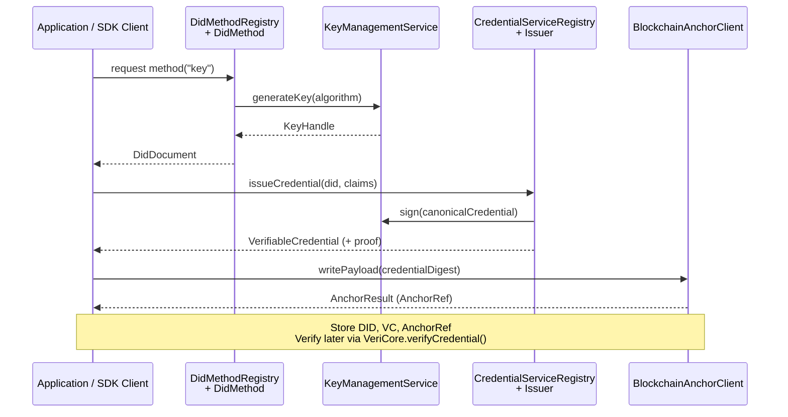

# Architecture Overview

VeriCore follows a modular, pluggable architecture that enables flexibility and extensibility. This page ties the high-level mental model—DIDs, credentials, proofs, anchoring—into the modules you will touch as you build a trust layer.

## End-to-End Identity Flow



**Roles and relationships**

- **DID creation**: `DidMethodRegistry` resolves a method implementation, which collaborates with `KeyManagementService` to mint keys and returns a W3C-compliant `DidDocument`.
- **Credential issuance**: The `CredentialServiceRegistry` hands off to an issuer that canonicalises the payload, signs it through the same KMS, and produces a `VerifiableCredential` with a proof.
- **Anchoring**: The credential digest (or any payload) flows through `BlockchainAnchorClient`, yielding an `AnchorRef` teams can persist for tamper evidence.
- **Verification**: When verifying, VeriCore pulls the DID document, replays canonicalisation + signature validation, and optionally checks the anchor reference.

Use this flow as a mental checklist: if you know which step you are implementing, the linked module sections below show the relevant interfaces and extension points.

## Module Structure

VeriCore is organized into a domain-centric structure with core modules and plugin implementations:

```
vericore/
├── core/                          # Core framework modules
│   ├── vericore-core/             # Base types, exceptions, credential APIs
│   ├── vericore-spi/              # Service Provider Interface definitions
│   ├── vericore-json/             # JSON canonicalization utilities
│   ├── vericore-trust/            # Trust registry and trust layer
│   └── vericore-testkit/          # Test utilities and mocks
│
├── did/                           # DID domain
│   ├── vericore-did/              # Core DID abstraction
│   └── plugins/                   # DID method implementations
│       ├── key/                   # did:key implementation
│       ├── web/                   # did:web implementation
│       ├── ion/                   # did:ion implementation
│       └── ...                    # Other DID methods
│
├── kms/                           # KMS domain
│   ├── vericore-kms/              # Core KMS abstraction
│   └── plugins/                   # KMS implementations
│       ├── aws/                   # AWS KMS
│       ├── azure/                 # Azure Key Vault
│       ├── google/                # Google Cloud KMS
│       └── ...                    # Other KMS providers
│
├── chains/                        # Blockchain/Chain domain
│   ├── vericore-anchor/           # Core anchor abstraction
│   └── plugins/                   # Chain implementations
│       ├── algorand/              # Algorand adapter
│       ├── polygon/               # Polygon adapter
│       └── ...                    # Other blockchain adapters
│
└── distribution/                  # Distribution modules
    ├── vericore-all/              # All-in-one module
    ├── vericore-bom/              # Bill of Materials
    └── vericore-examples/         # Example applications
```

## Core Modules

### vericore-core
- Base exception classes
- Common constants
- Shared types

### vericore-json
- JSON canonicalization
- Digest computation (SHA-256 + multibase)
- No dependencies on other VeriCore modules

### vericore-kms
- `KeyManagementService` interface
- Key generation, signing, retrieval
- Algorithm-agnostic design

### vericore-did
- `DidMethod` interface
- DID Document models (W3C compliant)
- `DidMethodRegistry` for method registration (instance-scoped)

### vericore-anchor
- `BlockchainAnchorClient` interface
- `AnchorRef` for chain-agnostic references
- `BlockchainAnchorRegistry` for client registration (instance-scoped)

### vericore-testkit
- In-memory implementations
- Test utilities
- Mock implementations for testing

## Integration Modules

### KMS Plugins

- **walt.id** (`com.geoknoesis.vericore.kms:waltid`) – walt.id-based KMS and DID methods. See [walt.id Integration Guide](../integrations/waltid.md).
- **AWS KMS** (`com.geoknoesis.vericore.kms:aws`) – AWS Key Management Service. See [AWS KMS Integration Guide](../integrations/aws-kms.md).
- **Azure Key Vault** (`com.geoknoesis.vericore.kms:azure`) – Azure Key Vault integration. See [Azure KMS Integration Guide](../integrations/azure-kms.md).
- **Google Cloud KMS** (`com.geoknoesis.vericore.kms:google`) – Google Cloud KMS integration. See [Google KMS Integration Guide](../integrations/google-kms.md).
- **HashiCorp Vault** (`com.geoknoesis.vericore.kms:hashicorp`) – HashiCorp Vault Transit engine. See [HashiCorp Vault KMS Integration Guide](../integrations/hashicorp-vault-kms.md).

### DID Method Plugins

- **GoDiddy** (`com.geoknoesis.vericore.did:godiddy`) – HTTP integration with GoDiddy services. Universal Resolver, Registrar, Issuer, Verifier. Supports 20+ DID methods. See [GoDiddy Integration Guide](../integrations/godiddy.md).
- **did:key** (`com.geoknoesis.vericore.did:key`) – Native did:key implementation. See [Key DID Integration Guide](../integrations/key-did.md).
- **did:web** (`com.geoknoesis.vericore.did:web`) – Web DID method. See [Web DID Integration Guide](../integrations/web-did.md).
- **did:ion** (`com.geoknoesis.vericore.did:ion`) – Microsoft ION DID method. See [ION DID Integration Guide](../integrations/ion-did.md).
- See [Integration Modules](../integrations/README.md) for all DID method implementations.

### Blockchain Anchor Plugins

- **Algorand** (`com.geoknoesis.vericore.chains:algorand`) – Algorand blockchain adapter. Mainnet and testnet support. See [Algorand Integration Guide](../integrations/algorand.md).
- **Polygon** (`com.geoknoesis.vericore.chains:polygon`) – Polygon blockchain adapter. See [Integration Modules](../integrations/README.md#blockchain-anchor-integrations).
- **Ethereum** (`com.geoknoesis.vericore.chains:ethereum`) – Ethereum blockchain adapter. See [Ethereum Anchor Integration Guide](../integrations/ethereum-anchor.md).
- **Base** (`com.geoknoesis.vericore.chains:base`) – Base (Coinbase L2) adapter. See [Base Anchor Integration Guide](../integrations/base-anchor.md).
- **Arbitrum** (`com.geoknoesis.vericore.chains:arbitrum`) – Arbitrum adapter. See [Arbitrum Anchor Integration Guide](../integrations/arbitrum-anchor.md).
- See [Integration Modules](../integrations/README.md) for all blockchain adapters.

## Design Patterns

### Scoped Registry Pattern

Registries are owned by the application context rather than global singletons:

```kotlin
val didRegistry = DidMethodRegistry().apply { register(didMethod) }
val blockchainRegistry = BlockchainAnchorRegistry().apply { register(chainId, client) }

val config = VeriCoreConfig(
    kms = kms,
    walletFactory = walletFactory,
    didRegistry = didRegistry,
    blockchainRegistry = blockchainRegistry,
    credentialRegistry = CredentialServiceRegistry.create()
)
val vericore = VeriCore.create(config)
```

### Service Provider Interface (SPI)

Adapters can be automatically discovered via Java ServiceLoader:

```kotlin
// Automatic discovery
val result = WaltIdIntegration.discoverAndRegister()
```

### Interface-Based Design

All external dependencies are abstracted through interfaces:

- `KeyManagementService` - Key operations
- `DidMethod` - DID operations
- `BlockchainAnchorClient` - Blockchain operations

## Data Flow

### DID Creation Flow

```
Application
    ↓
VeriCoreContext.getDidMethod("key")
    ↓
DidMethod.createDid()
    ↓
KeyManagementService.generateKey()
    ↓
DidDocument (returned)
```

### Blockchain Anchoring Flow

```
Application
    ↓
VeriCoreContext.getBlockchainClient("algorand:mainnet")
    ↓
BlockchainAnchorClient.writePayload()
    ↓
AnchorResult (with AnchorRef)
```

### Integrity Verification Flow

```
Blockchain Anchor
    ↓
Verifiable Credential (with digest)
    ↓
Linkset (with digest)
    ↓
Artifacts (with digests)
    ↓
Verification Result
```

## Dependencies

### Core Module Dependencies

```
vericore-core
    (no dependencies)

vericore-json
    → vericore-core

vericore-kms
    → vericore-core

vericore-did
    → vericore-core
    → vericore-kms

vericore-anchor
    → vericore-core
    → vericore-json

vericore-testkit
    → vericore-core
    → vericore-json
    → vericore-kms
    → vericore-did
    → vericore-anchor
```

### Integration Module Dependencies

```
KMS Plugins (com.geoknoesis.vericore.kms:*)
    → vericore-core
    → vericore-kms
    See: [KMS Integration Guides](../integrations/README.md#other-did--kms-integrations)

DID Plugins (com.geoknoesis.vericore.did:*)
    → vericore-core
    → vericore-did
    → vericore-kms
    See: [DID Integration Guides](../integrations/README.md#did-method-integrations)

Chain Plugins (com.geoknoesis.vericore.chains:*)
    → vericore-core
    → vericore-anchor
    → vericore-json
    See: [Blockchain Integration Guides](../integrations/README.md#blockchain-anchor-integrations)
```

## Extensibility

### Adding a New DID Method

1. Implement `DidMethod` interface
2. Optionally implement `DidMethodProvider` for SPI
3. Register via `DidMethodRegistry.register()`

### Adding a New Blockchain Adapter

1. Implement `BlockchainAnchorClient` interface
2. Optionally implement `BlockchainAnchorClientProvider` for SPI
3. Register via `BlockchainAnchorRegistry.register()`

### Adding a New KMS Backend

1. Implement `KeyManagementService` interface
2. Optionally implement `KeyManagementServiceProvider` for SPI
3. Use directly or register via SPI

## Next Steps

- Learn about [Core Modules](modules/core-modules.md)
- Explore [Integration Modules](integrations/README.md)
- See [Examples](examples/README.md) for practical usage
- Review the [Trust Layer Setup Checklist](../core-concepts/trust-registry.md#trust-layer-setup-checklist) before wiring issuance or verification flows

