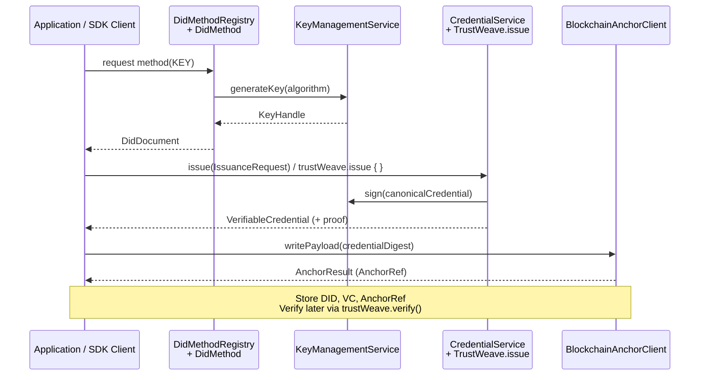

# Architecture Overview

TrustWeave follows a modular, pluggable architecture that enables flexibility and extensibility. This page ties the high-level mental model—DIDs, credentials, proofs, anchoring—into the modules you will touch as you build on TrustWeave.

## TrustWeave Mental Model

TrustWeave operates on three abstraction layers that provide different levels of control and simplicity:

### 1. Facade Layer - Simplest API

The facade provides a unified, high-level API with sensible defaults. For the quickest start:

```kotlin
val trustWeave = TrustWeave.quickStart()  // In-memory, did:key
val did = trustWeave.createDid().getOrThrowDid()
val credential = trustWeave.issue {
    credential { type("Person"); issuer(did); subject("did:key:holder") { "name" to "Alice" } }
    signedBy(did)  // Key ID auto-extracted
}.getOrThrow()
val result = trustWeave.verify(credential)  // Simple overload
```

For custom configuration, use `TrustWeave.build { ... }` with `keys`, `did`, and other blocks.

**When to use:**
- Quick prototypes and demos
- Simple applications with standard requirements
- When you want TrustWeave to handle configuration automatically

### 2. Service Layer (Direct Interfaces) - Fine-Grained Control

Access individual services directly for maximum control:

```kotlin
val kms = InMemoryKeyManagementService()
val didMethod = DidKeyMockMethod(kms)
val didRegistry = DidMethodRegistry().apply { register(didMethod) }
val document = didMethod.createDid(options)
```

**When to use:**
- Custom configurations
- Advanced use cases
- When you need to compose services manually

### 3. DSL Layer (`TrustWeave.build { }`) - Declarative Configuration

Use the DSL for declarative, readable configuration:

```kotlin
val trustWeave = TrustWeave.build {
    keys { provider("inMemory"); algorithm("Ed25519") }
    did { method("key") { algorithm("Ed25519") } }
    anchor {
        chain("algorand:testnet") {
            provider("algorand")
            options { /* RPC / credentials for your environment */ }
        }
    }
}
```

**When to use:**
- Complex TrustWeave configurations
- When you prefer declarative style
- Building reusable trust configurations

### Component Interaction Flow

Understanding how components interact helps you debug and extend TrustWeave:


```mermaid
flowchart TB
    subgraph Application["Application Layer"]
        AppCode[Your Application<br/>Business Logic]
    end
    
    subgraph Facade["TrustWeave Facade"]
        TW["TrustWeave: createDid, issue, verify, wallet"]
    end
    
    subgraph Context["TrustWeaveConfig"]
        Config[Configuration<br/>Service Registries<br/>Plugin Settings]
    end
    
    subgraph Services["Service Interfaces"]
        DIDService[DID Service<br/>DidMethod]
        CredService[Credential Service<br/>CredentialService]
        KMSInterface[KMS Interface<br/>KeyManagementService]
        AnchorInterface[Anchor Interface<br/>BlockchainAnchorClient]
        WalletService[Wallet Service<br/>WalletFactory]
    end
    
    subgraph Registries["Service Registries"]
        DIDReg[DidMethodRegistry<br/>Method Registration]
        CredReg[CredentialService<br/>+ CredentialServices factory]
        AnchorReg[BlockchainAnchorRegistry<br/>Client Registration]
    end
    
    subgraph Plugins["Plugin Implementations"]
        DIDPlugins[DidKeyMethod<br/>DidWebMethod<br/>DidIonMethod]
        KMSPlugins[InMemoryKMS<br/>AWS KMS<br/>Azure KMS]
        AnchorPlugins[AlgorandClient<br/>PolygonClient<br/>EthereumClient]
    end
    
    subgraph External["External Systems"]
        Blockchains[Blockchains<br/>Algorand<br/>Ethereum<br/>Polygon]
        KMSProviders[KMS Providers<br/>AWS<br/>Azure<br/>Google Cloud]
        DIDResolvers[DID Resolvers<br/>Universal Resolver<br/>Method-Specific]
    end
    
    AppCode -->|Calls| TW
    TW -->|Uses| Config
    Config -->|Manages| Registries
    TW -->|Delegates to| Services
    Services -->|Uses| Registries
    Registries -->|Routes to| Plugins
    Plugins -->|Connects to| External
    
    style Application fill:#e3f2fd,stroke:#1976d2,stroke-width:2px,color:#000
    style Facade fill:#c8e6c9,stroke:#388e3c,stroke-width:2px,color:#000
    style Context fill:#fff9c4,stroke:#f57f17,stroke-width:2px,color:#000
    style Services fill:#f3e5f5,stroke:#7b1fa2,stroke-width:2px,color:#000
    style Registries fill:#e1f5fe,stroke:#0277bd,stroke-width:2px,color:#000
    style Plugins fill:#e0f2f1,stroke:#00796b,stroke-width:2px,color:#000
    style External fill:#fce4ec,stroke:#c2185b,stroke-width:2px,color:#000
```

**Key Interactions:**

1. **Application → Facade**: Your application code calls TrustWeave methods
2. **Facade → Configuration**: TrustWeave uses configuration to access services
3. **Configuration → Registries**: Configuration manages service registries
4. **Facade → Services**: TrustWeave delegates operations to service interfaces
5. **Services → Registries**: Services use registries to find implementations
6. **Registries → Plugins**: Registries route requests to plugin implementations
7. **Plugins → External**: Plugins connect to external systems (blockchains, KMS, etc.)

### Plugin Architecture

TrustWeave uses the Service Provider Interface (SPI) pattern for automatic plugin discovery:

1. **Plugin Registration**: Plugins implement provider interfaces (e.g., `DidMethodProvider`)
2. **Automatic Discovery**: Java ServiceLoader discovers plugins on the classpath
3. **Manual Registration**: You can also register plugins manually via registries

```kotlin
// Automatic discovery (via SPI)
val result = WaltIdIntegration.discoverAndRegister(registry)

// Manual registration
val didRegistry = DidMethodRegistry().apply {
    register(DidKeyMethod(kms))
    register(DidWebMethod(kms))
}
```

### Trust Layer Concept

The **Trust Layer** is TrustWeave's configuration DSL that lets you declaratively configure all services:

```kotlin
val trustWeave = TrustWeave.build {
    keys {
        provider("inMemory")
        algorithm("Ed25519")
    }
    did {
        method("key") { algorithm("Ed25519") }
    }
    anchor {
        chain("algorand:testnet") {
            provider("algorand")
            options { /* blockchain client options */ }
        }
    }
    // Optional: factories(walletFactory = yourWalletFactory)
}
```

**When to use the DSL:**
- Complex multi-service configurations
- Reusable trust configurations across applications
- When you want a single source of truth for configuration

## End-to-End Identity Flow


```mermaid
sequenceDiagram
    participant App as Application / SDK Client
    participant DID as DidMethodRegistry<br/>+ DidMethod
    participant KMS as KeyManagementService
    participant VC as CredentialService<br/>+ TrustWeave.issue
    participant Anchor as BlockchainAnchorClient

    App->>DID: request method(KEY)
    DID->>KMS: generateKey(algorithm)
    KMS-->>DID: KeyHandle
    DID-->>App: DidDocument
    App->>VC: issue(IssuanceRequest) / trustWeave.issue { }
    VC->>KMS: sign(canonicalCredential)
    VC-->>App: VerifiableCredential (+ proof)
    App->>Anchor: writePayload(credentialDigest)
    Anchor-->>App: AnchorResult (AnchorRef)
    note over App,Anchor: Store DID, VC, AnchorRef<br/>Verify later via trustWeave.verify()
```

**Roles and relationships**

- **DID creation**: `DidMethodRegistry` resolves a method implementation, which collaborates with `KeyManagementService` to mint keys and returns a W3C-compliant `DidDocument`.
- **Credential issuance**: **`CredentialService.issue(IssuanceRequest)`** (usually wired by **`TrustWeave`**) canonicalises the payload, signs through the KMS, and produces a **`VerifiableCredential`** with a proof.
- **Anchoring**: The credential digest (or any payload) flows through `BlockchainAnchorClient`, yielding an `AnchorRef` teams can persist for tamper evidence.
- **Verification**: When verifying, TrustWeave pulls the DID document, replays canonicalisation + signature validation, and optionally checks the anchor reference.

Use this flow as a mental checklist: if you know which step you are implementing, the linked module sections below show the relevant interfaces and extension points.

## Module Structure

TrustWeave is organized into a domain-centric structure with core modules and plugin implementations:

```
TrustWeave/
├── common/                         # Common module
│   └── trustweave-common/             # Base types, exceptions, JSON utilities, plugin infrastructure (includes SPI interfaces)
├── trust/                          # Trust module
│   └── trustweave-trust/            # Trust registry and trust APIs
├── testkit/                        # Test utilities
│   └── trustweave-testkit/          # Test utilities and mocks
│
├── did/                           # DID domain
│   ├── trustweave-did/              # Core DID abstraction
│   └── plugins/                   # DID method implementations
│       ├── key/                   # did:key implementation
│       ├── web/                   # did:web implementation
│       ├── ion/                   # did:ion implementation
│       └── ...                    # Other DID methods
│
├── kms/                           # KMS domain
│   ├── trustweave-kms/              # Core KMS abstraction
│   └── plugins/                   # KMS implementations
│       ├── aws/                   # AWS KMS
│       ├── azure/                 # Azure Key Vault
│       ├── google/                # Google Cloud KMS
│       └── ...                    # Other KMS providers
│
├── chains/                        # Blockchain/Chain domain
│   ├── trustweave-anchor/           # Core anchor abstraction
│   └── plugins/                   # Chain implementations
│       ├── algorand/              # Algorand adapter
│       ├── polygon/               # Polygon adapter
│       └── ...                    # Other blockchain adapters
│
└── distribution/                  # Distribution modules
    ├── trustweave-all/              # All-in-one module
    ├── trustweave-bom/              # Bill of Materials
    └── trustweave-examples/         # Example applications
```

## Core Modules

### trustweave-common
- Base exception classes (`org.trustweave.core.exception`)
- Common constants and utilities (`org.trustweave.core.util`)
- Plugin infrastructure (`org.trustweave.core.plugin`)
- JSON canonicalization and digest computation (`org.trustweave.core.util.DigestUtils`)
- Input validation utilities (`org.trustweave.core.util`)
- Result extensions and error handling (`org.trustweave.core.util`)

### trustweave-kms
- `KeyManagementService` interface
- Key generation, signing, retrieval
- Algorithm-agnostic design

### trustweave-did
- `DidMethod` interface
- DID Document models (W3C compliant)
- `DidMethodRegistry` for method registration (instance-scoped)

### trustweave-anchor
- `BlockchainAnchorClient` interface
- `AnchorRef` for chain-agnostic references
- `BlockchainAnchorRegistry` for client registration (instance-scoped)

### trustweave-testkit
- In-memory implementations
- Test utilities
- Mock implementations for testing

## Integration Modules

### KMS Plugins

#### Cloud KMS Providers

- **AWS KMS** (`org.trustweave:kms-plugins-aws`) – AWS Key Management Service. See [AWS KMS Integration Guide](../integrations/aws-kms.md).
- **AWS CloudHSM** (`org.trustweave:kms-plugins-cloudhsm`) – AWS CloudHSM for dedicated hardware security modules. Documentation coming soon.
- **Azure Key Vault** (`org.trustweave:kms-plugins-azure`) – Azure Key Vault integration. See [Azure KMS Integration Guide](../integrations/azure-kms.md).
- **Google Cloud KMS** (`org.trustweave:kms-plugins-google`) – Google Cloud KMS integration. See [Google KMS Integration Guide](../integrations/google-kms.md).
- **IBM Key Protect** (`org.trustweave:kms-plugins-ibm`) – IBM Cloud Key Protect integration. Documentation coming soon.

#### Self-Hosted KMS Providers

- **HashiCorp Vault** (`org.trustweave:kms-plugins-hashicorp`) – HashiCorp Vault Transit engine. See [HashiCorp Vault KMS Integration Guide](../integrations/hashicorp-vault-kms.md).
- **Thales CipherTrust** (`org.trustweave:kms-plugins-thales`) – Thales CipherTrust Manager integration. Documentation coming soon.
- **Thales Luna** (`org.trustweave:kms-plugins-thales-luna`) – Thales Luna HSM integration. Documentation coming soon.
- **CyberArk Conjur** (`org.trustweave:kms-plugins-cyberark`) – CyberArk Conjur secrets management integration. Documentation coming soon.
- **Fortanix DSM** (`org.trustweave:kms-plugins-fortanix`) – Fortanix Data Security Manager multi-cloud key management. Documentation coming soon.
- **Entrust** (`org.trustweave:kms-plugins-entrust`) – Entrust key management integration. Documentation coming soon.
- **Utimaco** (`org.trustweave:kms-plugins-utimaco`) – Utimaco HSM integration. Documentation coming soon.

#### Other KMS Integrations

- **walt.id** (`org.trustweave:kms-plugins-waltid`) – walt.id-based KMS and DID methods. See [walt.id Integration Guide](../integrations/waltid.md).

### DID Method Plugins

- **GoDiddy** (`org.trustweave:did-plugins-godiddy`) – HTTP integration with GoDiddy services. Universal Resolver, Registrar, Issuer, Verifier. Supports 20+ DID methods. See [GoDiddy Integration Guide](../integrations/godiddy.md).
- **did:key** (`org.trustweave:did-plugins-key`) – Native did:key implementation. See [Key DID Integration Guide](../integrations/key-did.md).
- **did:web** (`org.trustweave:did-plugins-web`) – Web DID method. See [Web DID Integration Guide](../integrations/web-did.md).
- **did:ion** (`org.trustweave:did-plugins-ion`) – Microsoft ION DID method. See [ION DID Integration Guide](../integrations/ion-did.md).
- See [Integration Modules](../integrations/README.md) for all DID method implementations.

### Blockchain Anchor Plugins

- **Algorand** (`org.trustweave:anchors-plugins-algorand`) – Algorand blockchain adapter. Mainnet and testnet support. See [Algorand Integration Guide](../integrations/algorand.md).
- **Polygon** (`org.trustweave:anchors-plugins-polygon`) – Polygon blockchain adapter. See [Integration Modules](../integrations/README.md#blockchain-anchor-integrations).
- **Ethereum** (`org.trustweave:anchors-plugins-ethereum`) – Ethereum blockchain adapter. See [Ethereum Anchor Integration Guide](../integrations/ethereum-anchor.md).
- **Base** (`org.trustweave:anchors-plugins-base`) – Base (Coinbase L2) adapter. See [Base Anchor Integration Guide](../integrations/base-anchor.md).
- **Arbitrum** (`org.trustweave:anchors-plugins-arbitrum`) – Arbitrum adapter. See [Arbitrum Anchor Integration Guide](../integrations/arbitrum-anchor.md).
- See [Integration Modules](../integrations/README.md) for all blockchain adapters.

## Design Patterns

### Scoped Registry Pattern

Registries are owned by the application context rather than global singletons. Application code normally does **not** construct **`TrustWeaveConfig`** directly (its constructor is **`internal`**). The **`TrustWeave.build { }`** factory wires KMS, DID methods, anchor clients, and registries for you (`build` is **`suspend`**):

```kotlin
import kotlinx.coroutines.runBlocking
import org.trustweave.trust.TrustWeave
import org.trustweave.trust.dsl.credential.AnchorProviders

fun main() = runBlocking {
    val trustWeave = TrustWeave.build {
        customKms(kms)
        did {
            method("web") { domain("example.com") }
        }
        anchor {
            chain("algorand:testnet") {
                provider(AnchorProviders.ALGORAND)
                options { /* provider options */ }
            }
        }
        factories(walletFactory = walletFactory)
    }
}
```

### Service Provider Interface (SPI)

Adapters can be automatically discovered via Java ServiceLoader:

```kotlin
// Automatic discovery
val result = WaltIdIntegration.discoverAndRegister()
```

### Interface-Based Design

All external dependencies are abstracted through interfaces:

- `KeyManagementService` - Key operations
- `DidMethod` - DID operations
- `BlockchainAnchorClient` - Blockchain operations

## Data Flow

### DID Creation Flow

```
Application
    ↓
trustWeave.createDid { … }  (uses DidManagementService + DidMethodRegistry)
    ↓
DidMethod.createDid()
    ↓
KeyManagementService.generateKey()
    ↓
DidCreationResult / DidDocument (per API)
```

### Blockchain Anchoring Flow

```
Application
    ↓
trustWeave.blockchains.anchor(…, chainId = "algorand:mainnet")
    ↓
BlockchainAnchorClient.writePayload()
    ↓
AnchorResult (with AnchorRef)
```

### Integrity Verification Flow

```
Blockchain Anchor
    ↓
Verifiable Credential (with digest)
    ↓
Linkset (with digest)
    ↓
Artifacts (with digests)
    ↓
Verification Result
```

## Dependencies

### Core Module Dependencies

```
trustweave-common
    (no dependencies - includes JSON utilities, plugin infrastructure, SPI interfaces)

trustweave-kms
    → trustweave-common

trustweave-did
    → trustweave-common
    → trustweave-kms

trustweave-anchor
    → trustweave-common

trustweave-testkit
    → trustweave-common
    → trustweave-kms
    → trustweave-did
    → trustweave-anchor
```

### Integration Module Dependencies

```
KMS Plugins (org.trustweave:kms-plugins-*)
    → trustweave-common
    → trustweave-kms
    See: [KMS Integration Guides](../integrations/README.md#other-did--kms-integrations)

DID Plugins (org.trustweave:did-plugins-*)
    → trustweave-common
    → trustweave-did
    → trustweave-kms
    See: [DID Integration Guides](../integrations/README.md#did-method-integrations)

Chain Plugins (org.trustweave:anchors-plugins-*)
    → trustweave-common
    → trustweave-anchor
    See: [Blockchain Integration Guides](../integrations/README.md#blockchain-anchor-integrations)
```

## Extensibility

### Adding a New DID Method

1. Implement `DidMethod` interface
2. Optionally implement `DidMethodProvider` for SPI
3. Register via `DidMethodRegistry.register()`

### Adding a New Blockchain Adapter

1. Implement `BlockchainAnchorClient` interface
2. Optionally implement `BlockchainAnchorClientProvider` for SPI
3. Register via `BlockchainAnchorRegistry.register()`

### Adding a New KMS Backend

1. Implement `KeyManagementService` interface
2. Optionally implement `KeyManagementServiceProvider` for SPI
3. Use directly or register via SPI

## Next Steps

- Learn about [Core Modules](../modules/core-modules.md)
- Explore [Integration Modules](../integrations/README.md)
- Review the [TrustWeave setup checklist](../core-concepts/trust-registry.md#trustweave-setup-checklist) before wiring issuance or verification flows

