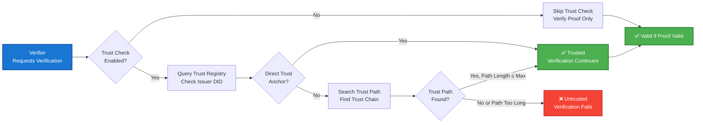

# TrustWeave Mental Model

Understanding how TrustWeave works at a conceptual level will help you use it effectively and confidently.

## Overview

TrustWeave is built on a **layered architecture** with clear separation between:
- **Facade Layer** (`TrustWeave`) - High-level, developer-friendly API
- **Service Layer** - Domain-specific services (DID, Credential, Wallet, etc.)
- **Plugin Layer** - Pluggable implementations (DID methods, KMS, blockchains)

```mermaid
flowchart TB
    subgraph Application["Application Code"]
        AppCode[Your Application<br/>Business Logic]
    end
    
    subgraph Facade["TrustWeave (Facade)"]
        FacadeAPI[createDid()<br/>issue()<br/>verify()<br/>trust {}]
    end
    
    subgraph Orchestrator["TrustWeaveContext (Orchestrator)"]
        Context[Coordinates Services<br/>Manages DSL Builders]
    end
    
    subgraph Services["Services (Domain Logic)"]
        DIDService[DID Service]
        CredService[Credential Service]
        WalletService[Wallet Service]
        TrustRegistry[Trust Registry]
    end
    
    subgraph Plugins["Plugin Layer (Implementations)"]
        DIDMethods[DID Methods<br/>key, web, ion, etc.]
        KMSProviders[KMS Providers<br/>inMemory, AWS, etc.]
        BlockchainClients[Blockchain Clients<br/>Algorand, etc.]
    end
    
    AppCode --> FacadeAPI
    FacadeAPI --> Context
    Context --> DIDService
    Context --> CredService
    Context --> WalletService
    Context --> TrustRegistry
    DIDService --> DIDMethods
    CredService --> KMSProviders
    CredService --> BlockchainClients
    
    style Application fill:#e3f2fd,stroke:#1976d2,stroke-width:2px
    style Facade fill:#c8e6c9,stroke:#388e3c,stroke-width:2px
    style Orchestrator fill:#fff9c4,stroke:#f57f17,stroke-width:2px
    style Services fill:#f3e5f5,stroke:#7b1fa2,stroke-width:2px
    style Plugins fill:#e0f2f1,stroke:#00796b,stroke-width:2px
```

## Core Components

### 1. TrustWeave (Main Entry Point)

`TrustWeave` is the **primary facade** for all operations. It provides:
- Type-safe DSL builders for configuration and operations
- Unified error handling (exceptions)
- Simplified API that hides complexity

**Key Characteristics:**
- All methods are **suspend functions** (coroutine-based)
- All methods **throw exceptions** on failure (use try-catch)
- Configuration is done via DSL builders

**Example:**
```kotlin
val trustWeave = TrustWeave.build {
    keys { provider(IN_MEMORY); algorithm(ED25519) }
    did { method(KEY) { algorithm(ED25519) } }
}

// All operations throw exceptions
try {
    val did = trustWeave.createDid { method(KEY) }
    val credential = trustWeave.issue { ... }
} catch (error: TrustWeaveException) {
    // Handle error
}
```

### 2. TrustWeaveContext (Internal Orchestrator)

`TrustWeaveContext` coordinates between services. You rarely interact with it directly, but it:
- Manages DSL builders
- Routes operations to appropriate services
- Handles service lifecycle

**Access:** Use `trustWeave.getDslContext()` only when you need advanced operations.

### 3. Services (Domain Logic)

Services implement domain-specific logic:
- **DID Service**: Creates, resolves, updates DIDs
- **Credential Service**: Issues and verifies credentials
- **Wallet Service**: Manages credential storage
- **Trust Registry**: Manages trust anchors

Services are **configured** during `TrustWeave.build { }` and **used** via `TrustWeave` methods.

### 4. Plugins (Implementations)

Plugins provide concrete implementations:
- **DID Methods**: `did:key`, `did:web`, `did:ion`, etc.
- **KMS Providers**: `inMemory`, `AWS KMS`, `Azure Key Vault`, etc.
- **Blockchain Clients**: `Algorand`, `Polygon`, `Ethereum`, etc.

Plugins are **registered** during configuration and **selected** via provider names.

## Data Flow

### Credential Issuance Flow

```mermaid
flowchart TD
    A[Application calls<br/>trustWeave.issue { ... }] --> B[TrustWeave<br/>Delegates to Context]
    B --> C[TrustWeaveContext<br/>Orchestrates]
    C --> D[DID Service<br/>Resolve Issuer DID]
    C --> E[KMS Provider<br/>Get Signing Key]
    C --> F[Credential Service<br/>Build Credential + Proof]
    
    D --> D1[DID Method Plugin<br/>Fetch DID Document]
    E --> E1[KMS Plugin<br/>Retrieve Key Material]
    F --> F1[Proof Generator<br/>Create Cryptographic Proof]
    
    D1 --> G[Return VerifiableCredential<br/>to Application]
    E1 --> G
    F1 --> G
    
    style A fill:#1976d2,stroke:#0d47a1,stroke-width:2px,color:#fff
    style B fill:#388e3c,stroke:#1b5e20,stroke-width:2px,color:#fff
    style C fill:#388e3c,stroke:#1b5e20,stroke-width:2px,color:#fff
    style G fill:#4caf50,stroke:#2e7d32,stroke-width:2px,color:#fff
```

### Credential Verification Flow

```mermaid
flowchart TD
    A[Application calls<br/>trustWeave.verify { credential(...) }] --> B[TrustWeaveContext<br/>Orchestrates Verification]
    B --> C[Credential Service<br/>Validate Structure]
    B --> D[DID Service<br/>Resolve Issuer DID]
    B --> E[Proof Verifier<br/>Verify Signature]
    B --> F[Revocation Service<br/>Check Revocation Status]
    B --> G[Trust Registry<br/>Check Issuer Trust]
    
    D --> D1[DID Method Plugin<br/>Fetch DID Document]
    E --> E1[KMS Provider<br/>Get Public Key]
    F --> F1[Status List Manager<br/>Query Status List]
    G --> G1{Issuer Trusted?}
    
    G1 -->|Yes| H[Return VerificationResult.Valid]
    G1 -->|No| I[Return VerificationResult.Invalid.UntrustedIssuer]
    C --> H
    E1 --> H
    F1 --> H
    
    style A fill:#1976d2,stroke:#0d47a1,stroke-width:2px,color:#fff
    style B fill:#388e3c,stroke:#1b5e20,stroke-width:2px,color:#fff
    style H fill:#4caf50,stroke:#2e7d32,stroke-width:2px,color:#fff
    style I fill:#f44336,stroke:#c62828,stroke-width:2px,color:#fff
```

### Trust Flow

Trust evaluation happens during verification when trust checking is enabled:



**Trust Evaluation:**
1. **Direct Trust**: Issuer is a direct trust anchor → Trusted
2. **Trust Path**: Issuer is reachable through trust relationships → Trusted (if path length ≤ max)
3. **No Trust**: Issuer not in registry or no path found → Untrusted

## Configuration Model

TrustWeave uses a **builder pattern** for configuration:

```kotlin
TrustWeave.build {
    // Configure KMS
    keys {
        provider(IN_MEMORY)  // Select KMS plugin
        algorithm(ED25519)  // Select algorithm
    }

    // Configure DID methods
    did {
        method(KEY) {        // Register did:key method
            algorithm(ED25519)
        }
        method(WEB) {        // Register did:web method
            domain("example.com")
        }
    }

    // Configure blockchain anchors
    anchor {
        chain("algorand:testnet") {
            provider(ALGORAND)
        }
    }

    // Configure trust registry
    trust {
        provider(IN_MEMORY)
    }
}
```

**Key Points:**
- Configuration is **type-safe** (compile-time checks)
- Plugins are **registered** by name/provider
- Configuration is **immutable** after creation

## Error Handling Model

TrustWeave uses **two error handling patterns**:

### 1. Exception-Based (TrustWeave Methods)

All `TrustWeave` methods throw exceptions:

```kotlin
import org.trustweave.did.exception.DidException
import org.trustweave.did.exception.DidException.DidMethodNotRegistered
import org.trustweave.core.exception.TrustWeaveException

try {
    val did = trustWeave.createDid { method(KEY) }
} catch (error: DidException) {
    when (error) {
        is DidMethodNotRegistered -> {
            // Handle method not registered
        }
        else -> {
            // Handle other DID errors
        }
    }
} catch (error: TrustWeaveException) {
    // Handle TrustWeave errors with error codes
} catch (error: Exception) {
    // Handle other errors
}
```

**Why exceptions?** Simpler API for common operations, familiar pattern for Kotlin developers.

### 2. Result-Based (Lower-Level APIs)

Some lower-level APIs return `Result<T>`:

```kotlin
val result = someService.operation()
result.fold(
    onSuccess = { value -> /* handle success */ },
    onFailure = { error -> /* handle error */ }
)
```

**Why Result?** More functional style, better for composition, explicit error handling.

## Key Design Principles

### 1. Type Safety

- DSL builders provide compile-time type checking
- Invalid configurations fail at compile time
- IDE autocomplete guides correct usage

### 2. Pluggability

- All external dependencies via interfaces
- Easy to swap implementations
- Test with in-memory, deploy with production plugins

### 3. Coroutines

- All operations are suspend functions
- Non-blocking by default
- Easy to compose async operations

### 4. Domain-Agnostic

- No domain-specific logic in core
- Works for any use case (education, healthcare, IoT, etc.)
- Domain logic lives in your application

## Common Patterns

### Pattern 1: Create → Configure → Use

```kotlin
// 1. Create and configure
val trustWeave = TrustWeave.build { ... }

// 2. Use
val did = trustWeave.createDid { ... }
val credential = trustWeave.issue { ... }
```

### Pattern 2: Error Handling

```kotlin
import org.trustweave.did.exception.DidException
import org.trustweave.core.exception.TrustWeaveException

try {
    val result = trustWeave.operation { ... }
    // Use result
} catch (error: DidException) {
    // Handle DID-specific errors
} catch (error: TrustWeaveException) {
    // Handle TrustWeave errors with error codes
} catch (error: Exception) {
    // Handle other errors
}
```

### Pattern 3: Service Composition

```kotlin
// Create DIDs
val issuerDid = trustWeave.createDid { ... }
val holderDid = trustWeave.createDid { ... }

// Issue credential
val credential = trustWeave.issue {
    credential { issuer(issuerDid); subject { id(holderDid) } }
    signedBy(issuerDid = issuerDid, keyId = "$issuerDid#key-1")
}

// Store in wallet
val wallet = trustWeave.wallet { holder(holderDid) }
wallet.store(credential)
```

## Next Steps

- [Quick Start](../getting-started/quick-start.md) - Hands-on introduction
- [Core Concepts](../core-concepts/README.md) - Deep dives into DIDs, VCs, etc.
- [API Reference](../api-reference/core-api.md) - Complete API documentation
- [Architecture Overview](architecture-overview.md) - Technical architecture details

