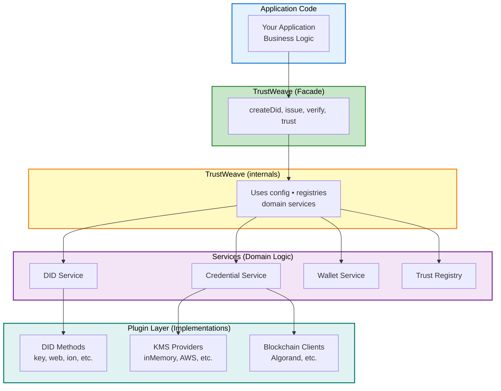
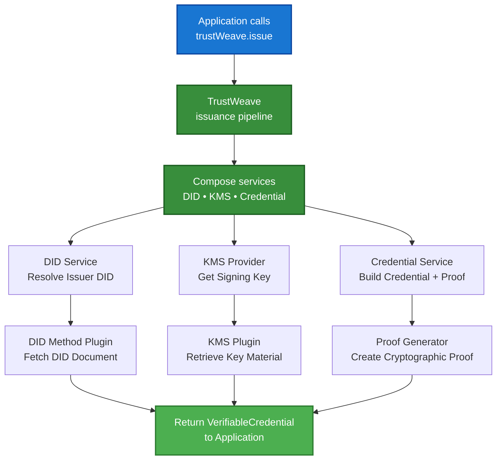
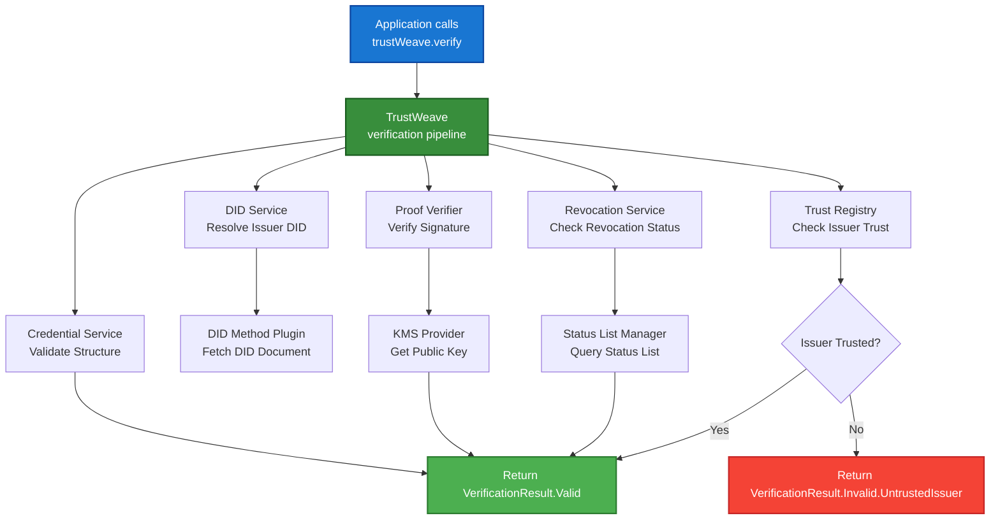
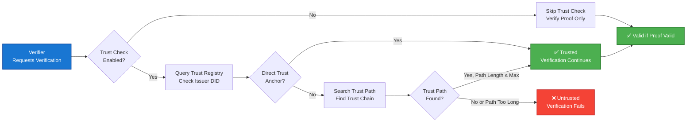

# TrustWeave Mental Model

Understanding how TrustWeave works at a conceptual level will help you use it effectively and confidently.

## Overview

TrustWeave follows [Clean Architecture](architecture/CLEAN_ARCHITECTURE.md) principles (Uncle Bob) with clear separation between:
- **Facade Layer** (`TrustWeave`) - High-level, developer-friendly API
- **Service Layer** - Domain-specific services (DID, Credential, Wallet, etc.)
- **Plugin Layer** - Pluggable implementations (DID methods, KMS, blockchains)


```mermaid
flowchart TB
    subgraph Application["Application Code"]
        AppCode[Your Application<br/>Business Logic]
    end
    
    subgraph Facade["TrustWeave (Facade)"]
        FacadeAPI["createDid, issue, verify, trust"]
    end
    
    subgraph Orchestrator["TrustWeave (internals)"]
        Context[Uses config • registries<br/>domain services]
    end
    
    subgraph Services["Services (Domain Logic)"]
        DIDService[DID Service]
        CredService[Credential Service]
        WalletService[Wallet Service]
        TrustRegistry[Trust Registry]
    end
    
    subgraph Plugins["Plugin Layer (Implementations)"]
        DIDMethods[DID Methods<br/>key, web, ion, etc.]
        KMSProviders[KMS Providers<br/>inMemory, AWS, etc.]
        BlockchainClients[Blockchain Clients<br/>Algorand, etc.]
    end
    
    AppCode --> FacadeAPI
    FacadeAPI --> Context
    Context --> DIDService
    Context --> CredService
    Context --> WalletService
    Context --> TrustRegistry
    DIDService --> DIDMethods
    CredService --> KMSProviders
    CredService --> BlockchainClients
    
    style Application fill:#e3f2fd,stroke:#1976d2,stroke-width:2px,color:#000
    style Facade fill:#c8e6c9,stroke:#388e3c,stroke-width:2px,color:#000
    style Orchestrator fill:#fff9c4,stroke:#f57f17,stroke-width:2px,color:#000
    style Services fill:#f3e5f5,stroke:#7b1fa2,stroke-width:2px,color:#000
    style Plugins fill:#e0f2f1,stroke:#00796b,stroke-width:2px,color:#000
```

## Core Components

### 1. TrustWeave (Main Entry Point)

`TrustWeave` is the **primary facade** for all operations. It provides:
- Type-safe DSL builders for configuration and operations
- **Sealed results** for credential issuance, verification, and presentations (plus wallet/DID results where applicable)
- Simplified API that hides complexity

**Key Characteristics:**
- Public operations are **suspend functions** (coroutine-based).
- **Credential pipeline:** `issue` returns `IssuanceResult`; `verify` returns `VerificationResult`; `presentationResult` / `presentationFromWalletResult` return `PresentationResult` (trust module). Use `when` for exhaustive handling. If `CredentialService` is not configured, you get `IssuanceResult.Failure.AdapterNotReady`, `VerificationResult.Invalid.AdapterNotReady`, or `PresentationResult.Failure.AdapterNotReady` instead of a successful value.
- **DSL validation** (e.g. missing holder in a presentation builder) surfaces as `PresentationResult.Failure.InvalidRequest`. Unwrapping with **`PresentationResult.getOrThrow()`** throws **`TrustWeaveException.InvalidState`** (`PRESENTATION_*` codes).
- **Extensions** such as `getOrThrow()` / `getOrThrowDid()` throw on failure—use only when that matches your error strategy.
- Configuration is done via DSL builders.

**Example:**
```kotlin
import org.trustweave.testkit.services.*
val trustWeave = TrustWeave.build {
    keys { provider(IN_MEMORY); algorithm(ED25519) }
    did { method(KEY) { algorithm(ED25519) } }
}

val did = trustWeave.createDid { method(KEY) }.getOrThrowDid()

when (val issued = trustWeave.issue { /* ... */ }) {
    is IssuanceResult.Success -> { /* use issued.credential */ }
    is IssuanceResult.Failure -> { /* handle issued.allErrors */ }
}

when (val v = trustWeave.verify(credential)) {
    is VerificationResult.Valid -> { /* ... */ }
    is VerificationResult.Invalid.AdapterNotReady -> { /* misconfigured service */ }
    is VerificationResult.Invalid -> { /* ... */ }
}
```

See [Result types guide](../api-reference/result-types-guide.md) and [API patterns](../getting-started/api-patterns.md#api-contract-results-vs-exceptions).

### 2. Configuration (`TrustWeaveConfig`)

Runtime wiring lives in `trustWeave.configuration` (`TrustWeaveConfig`): KMS, DID registry, anchor clients, credential service, revocation manager, trust registry, and wallet factory. Prefer facade methods (`createDid`, `issue`, `verify`, `wallet`, `trust`, `revocation`, …) and use `configuration` when you need direct access to a registry or client.

### 3. Services (Domain Logic)

Services implement domain-specific logic:
- **DID Service**: Creates, resolves, updates DIDs
- **Credential Service**: Issues and verifies credentials
- **Wallet Service**: Manages credential storage
- **Trust Registry**: Manages trust anchors

Services are **configured** during `TrustWeave.build { }` and **used** via `TrustWeave` methods.

### 4. Plugins (Implementations)

Plugins provide concrete implementations:
- **DID Methods**: `did:key`, `did:web`, `did:ion`, etc.
- **KMS Providers**: `inMemory`, `AWS KMS`, `Azure Key Vault`, etc.
- **Blockchain Clients**: `Algorand`, `Polygon`, `Ethereum`, etc.

Plugins are **registered** during configuration and **selected** via provider names.

## Data Flow

### Credential Issuance Flow


```mermaid
flowchart TD
    A[Application calls<br/>trustWeave.issue] --> B[TrustWeave<br/>issuance pipeline]
    B --> C[Compose services<br/>DID • KMS • Credential]
    C --> D[DID Service<br/>Resolve Issuer DID]
    C --> E[KMS Provider<br/>Get Signing Key]
    C --> F[Credential Service<br/>Build Credential + Proof]
    
    D --> D1[DID Method Plugin<br/>Fetch DID Document]
    E --> E1[KMS Plugin<br/>Retrieve Key Material]
    F --> F1[Proof Generator<br/>Create Cryptographic Proof]
    
    D1 --> G[Return VerifiableCredential<br/>to Application]
    E1 --> G
    F1 --> G
    
    style A fill:#1976d2,stroke:#0d47a1,stroke-width:2px,color:#fff
    style B fill:#388e3c,stroke:#1b5e20,stroke-width:2px,color:#fff
    style C fill:#388e3c,stroke:#1b5e20,stroke-width:2px,color:#fff
    style G fill:#4caf50,stroke:#2e7d32,stroke-width:2px,color:#fff
```

### Credential Verification Flow


```mermaid
flowchart TD
    A[Application calls<br/>trustWeave.verify] --> B[TrustWeave<br/>verification pipeline]
    B --> C[Credential Service<br/>Validate Structure]
    B --> D[DID Service<br/>Resolve Issuer DID]
    B --> E[Proof Verifier<br/>Verify Signature]
    B --> F[Revocation Service<br/>Check Revocation Status]
    B --> G[Trust Registry<br/>Check Issuer Trust]
    
    D --> D1[DID Method Plugin<br/>Fetch DID Document]
    E --> E1[KMS Provider<br/>Get Public Key]
    F --> F1[Status List Manager<br/>Query Status List]
    G --> G1{Issuer Trusted?}
    
    G1 -->|Yes| H[Return VerificationResult.Valid]
    G1 -->|No| I[Return VerificationResult.Invalid.UntrustedIssuer]
    C --> H
    E1 --> H
    F1 --> H
    
    style A fill:#1976d2,stroke:#0d47a1,stroke-width:2px,color:#fff
    style B fill:#388e3c,stroke:#1b5e20,stroke-width:2px,color:#fff
    style H fill:#4caf50,stroke:#2e7d32,stroke-width:2px,color:#fff
    style I fill:#f44336,stroke:#c62828,stroke-width:2px,color:#fff
```

### Trust Flow

Trust evaluation happens during verification when trust checking is enabled:


```mermaid
flowchart LR
    A[Verifier<br/>Requests Verification] --> B{Trust Check<br/>Enabled?}
    B -->|No| C[Skip Trust Check<br/>Verify Proof Only]
    B -->|Yes| D[Query Trust Registry<br/>Check Issuer DID]
    D --> E{Direct Trust<br/>Anchor?}
    E -->|Yes| F[✅ Trusted<br/>Verification Continues]
    E -->|No| G[Search Trust Path<br/>Find Trust Chain]
    G --> H{Trust Path<br/>Found?}
    H -->|Yes, Path Length ≤ Max| F
    H -->|No or Path Too Long| I[❌ Untrusted<br/>Verification Fails]
    C --> J[✅ Valid if Proof Valid]
    F --> J
    
    style A fill:#1976d2,stroke:#0d47a1,stroke-width:2px,color:#fff
    style F fill:#4caf50,stroke:#2e7d32,stroke-width:2px,color:#fff
    style I fill:#f44336,stroke:#c62828,stroke-width:2px,color:#fff
    style J fill:#4caf50,stroke:#2e7d32,stroke-width:2px,color:#fff
```

**Trust Evaluation:**
1. **Direct Trust**: Issuer is a direct trust anchor → Trusted
2. **Trust Path**: Issuer is reachable through trust relationships → Trusted (if path length ≤ max)
3. **No Trust**: Issuer not in registry or no path found → Untrusted

## Configuration Model

TrustWeave uses a **builder pattern** for configuration:

```kotlin
import org.trustweave.testkit.services.*
TrustWeave.build {
    // Configure KMS
    keys {
        provider(IN_MEMORY)  // Select KMS plugin
        algorithm(ED25519)  // Select algorithm
    }

    // Configure DID methods
    did {
        method(KEY) {        // Register did:key method
            algorithm(ED25519)
        }
        method(WEB) {        // Register did:web method
            domain("example.com")
        }
    }

    // Configure blockchain anchors
    anchor {
        chain("algorand:testnet") {
            provider(ALGORAND)
        }
    }

    // Configure trust registry
    trust {
        provider(IN_MEMORY)
    }
}
```

**Key Points:**
- Configuration is **type-safe** (compile-time checks)
- Plugins are **registered** by name/provider
- Configuration is **immutable** after creation

## Error Handling Model

TrustWeave uses a **hybrid** model; the [API patterns — results vs exceptions](../getting-started/api-patterns.md#api-contract-results-vs-exceptions) table is the source of truth.

### 1. Sealed results (credential pipeline and many facade APIs)

`issue`, `verify`, `presentationResult`, `issueBatch`, `verifyBatch`, and several DID operations return **sealed types** (`IssuanceResult`, `VerificationResult`, `PresentationResult`, `DidCreationResult`, …). Prefer exhaustive `when` branches so misconfiguration (`AdapterNotReady`) never becomes an uncaught exception.

### 2. Throwing helpers and non-credential paths

`getOrThrowDid()` and most credential **`getOrThrow()`** helpers convert failures to **`IllegalStateException`**. **`PresentationResult.getOrThrow()`** throws **`TrustWeaveException.InvalidState`**. Some wallet or integration surfaces may still throw other domain exceptions.

### 3. Kotlin `Result` and lower-level services

Some services expose `Result<T>` or functional APIs for composition.

```kotlin
import org.trustweave.trust.types.DidCreationResult
import org.trustweave.testkit.services.*

val didResult = trustWeave.createDid { method(KEY) }
val did = when (didResult) {
    is DidCreationResult.Success -> didResult.did
    is DidCreationResult.Failure -> {
        // Handle method not registered, resolution failure, etc.
        return@runBlocking
    }
}
```

## Key Design Principles

### 1. Type Safety

- DSL builders provide compile-time type checking
- Invalid configurations fail at compile time
- IDE autocomplete guides correct usage

### 2. Pluggability

- All external dependencies via interfaces
- Easy to swap implementations
- Test with in-memory, deploy with production plugins

### 3. Coroutines

- All operations are suspend functions
- Non-blocking by default
- Easy to compose async operations

### 4. Domain-Agnostic

- No domain-specific logic in core
- Works for any use case (education, healthcare, IoT, etc.)
- Domain logic lives in your application

## Common Patterns

### Pattern 1: Create → Configure → Use

```kotlin
// 1. Create and configure
val trustWeave = TrustWeave.build { ... }

// 2. Use (createDid / issue return sealed results—use when or getOrThrow*)
val didResult = trustWeave.createDid { ... }
val issuanceResult = trustWeave.issue { ... }
```

### Pattern 2: Error Handling

```kotlin
import org.trustweave.credential.results.VerificationResult

val verification = trustWeave.verify(credential)
when (verification) {
    is VerificationResult.Valid -> { /* ... */ }
    is VerificationResult.Invalid.AdapterNotReady -> { /* misconfigured service */ }
    is VerificationResult.Invalid -> { /* other invalid cases */ }
}

// Or try-catch around getOrThrow() / wallet { } when you choose throwing APIs
```

### Pattern 3: Service Composition

```kotlin
// Create DIDs (sealed results — unwrap explicitly)
val issuerDid = trustWeave.createDid { ... }.getOrThrowDid()
val holderDid = trustWeave.createDid { ... }.getOrThrowDid()

// Issue credential (`IssuanceResult` — here via getOrThrow(); prefer `when` in production)
val credential = trustWeave.issue {
    credential { issuer(issuerDid); subject { id(holderDid) } }
    signedBy(issuerDid, "key-1")
}.getOrThrow()

// Store in wallet (`WalletCreationResult`)
when (val w = trustWeave.wallet { holder(holderDid) }) {
    is WalletCreationResult.Success -> w.wallet.store(credential)
    is WalletCreationResult.Failure -> error("wallet: $w")
}
```

## Next Steps

- Quick Start](../getting-started/quick-start.md) - Hands-on introduction
- Core Concepts](../core-concepts/README.md) - Deep dives into DIDs, VCs, etc.
- API Reference](../api-reference/core-api.md) - Complete API documentation
- Architecture Overview](architecture-overview.md) - Technical architecture details

