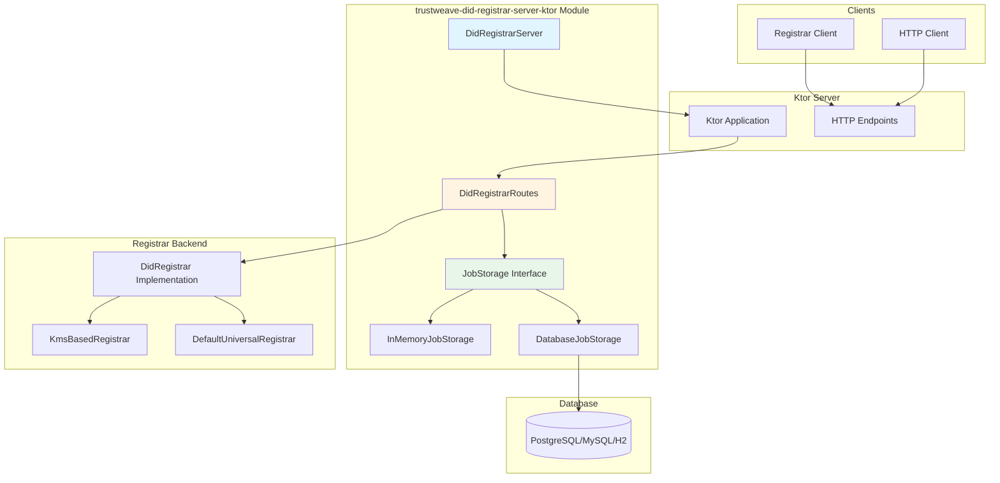
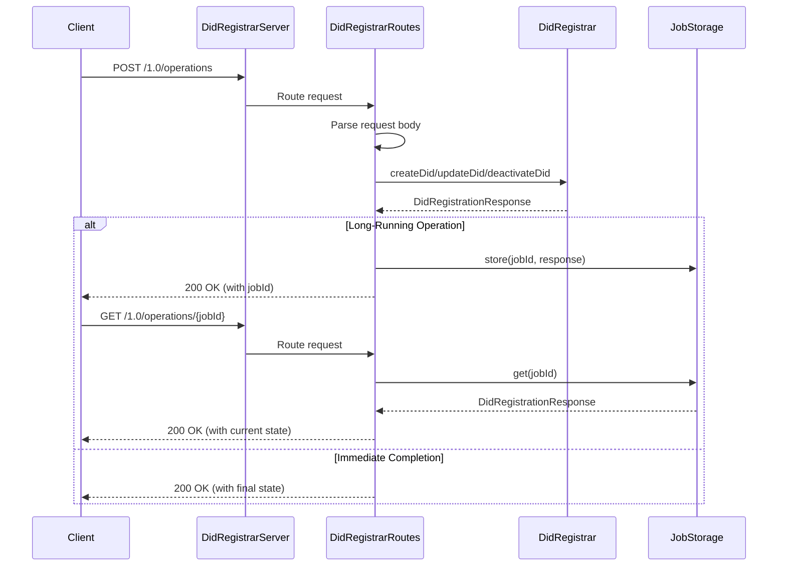
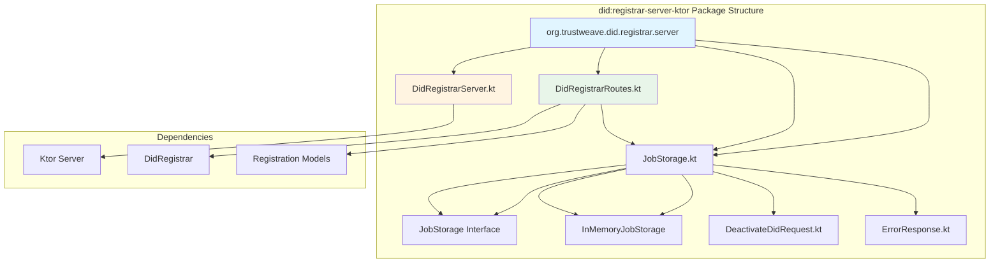

# trustweave-did-registrar-server (Ktor)

The `trustweave-did-registrar-server-ktor` module provides a Ktor-based HTTP server implementation of the Universal Registrar protocol, allowing you to host your own Universal Registrar service.

```kotlin
dependencies {
    implementation("org.trustweave.did:registrar-server-ktor:1.0.0-SNAPSHOT")
    implementation("org.trustweave:trustweave-did-registrar:1.0.0-SNAPSHOT")
    implementation("org.trustweave:trustweave-did:1.0.0-SNAPSHOT")
    implementation("org.trustweave:trustweave-kms:1.0.0-SNAPSHOT")
}
```

**Result:** Gradle exposes a Universal Registrar server that implements the DID Registration specification endpoints, allowing clients to create, update, and deactivate DIDs through HTTP.

> **Note:** For Spring Boot applications, use the `registrar-server-spring` module instead. See [trustweave-did-registrar-server-spring](trustweave-did-registrar-server-spring.md) for details.

## Overview

The `trustweave-did-registrar-server-ktor` module provides:

- **DID Registrar Server** – Ktor-based HTTP server implementing both Universal Registrar protocol and RESTful endpoints
- **RESTful API Endpoints** – recommended endpoints for DID operations (`POST /1.0/dids`, `PUT /1.0/dids/{did}`, `DELETE /1.0/dids/{did}`, `GET /1.0/jobs/{jobId}`)
- **Protocol Endpoints** – Universal Registrar protocol-compliant endpoints (`POST /1.0/operations`, `GET /1.0/operations/{jobId}`) for specification compliance
- **Type-Safe DTOs** – request/response DTOs for type-safe API usage
- **Job Storage** – interface and implementation for tracking long-running operations
- **Spec Compliance** – full compliance with DID Registration specification
- **Pluggable Backend** – works with any `DidRegistrar` implementation

## Architecture



## Key Components

### DidRegistrarServer

Main server class that configures and runs the DID Registrar HTTP service:

```kotlin
import org.trustweave.did.registrar.server.*
import org.trustweave.did.registrar.client.*
import org.trustweave.kms.*

// Create registrar backend
val kms = InMemoryKeyManagementService()
val registrar = KmsBasedRegistrar(kms)

// Create and start server
val server = DidRegistrarServer(
    registrar = registrar,
    port = 8080,
    host = "0.0.0.0",
    jobStorage = InMemoryJobStorage()
)

server.start(wait = true)  // Block until server stops
```

**What this does:** Provides a complete HTTP server implementation with both RESTful and protocol-compliant endpoints.

**Outcome:** Enables hosting your own DID Registrar service that clients can use for DID operations.

### DidRegistrarRoutes

Ktor routing configuration that implements both RESTful and Universal Registrar protocol endpoints:

**RESTful Endpoints (Recommended):**
- `POST /1.0/dids` – Create DID
- `PUT /1.0/dids/{did}` – Update DID
- `DELETE /1.0/dids/{did}` – Deactivate DID
- `GET /1.0/jobs/{jobId}` – Get job status

**Protocol Endpoints (For Specification Compliance):**
- `POST /1.0/operations` – Create, update, or deactivate DIDs
- `GET /1.0/operations/{jobId}` – Get status of long-running operations

```kotlin
import io.ktor.server.routing.*

routing {
    configureDidRegistrarRoutes(registrar, jobStorage)
}
```

**What this does:** Configures HTTP routes with both RESTful and protocol-compliant endpoints.

**Outcome:** Provides type-safe RESTful endpoints for new integrations and protocol-compliant endpoints for specification compliance.

### JobStorage

Interface for tracking long-running DID registration operations:

```kotlin
interface JobStorage {
    fun store(jobId: String, response: DidRegistrationResponse)
    fun get(jobId: String): DidRegistrationResponse?
    fun remove(jobId: String): Boolean
    fun exists(jobId: String): Boolean
}
```

**Implementations:**
- `InMemoryJobStorage` – in-memory implementation (for development/testing)
- `DatabaseJobStorage` – database-backed implementation (for production)
- Custom implementations – can use Redis, etc. for production

**What this does:** Provides storage for tracking long-running operations that return `jobId`.

**Outcome:** Enables proper handling of asynchronous DID registration operations.

#### DatabaseJobStorage

Database-backed implementation that stores job responses in a relational database:

```kotlin
import org.trustweave.did.registrar.server.*
import com.zaxxer.hikari.HikariDataSource
import javax.sql.DataSource

// Create DataSource (using HikariCP)
val dataSource = HikariDataSource().apply {
    jdbcUrl = "jdbc:postgresql://localhost:5432/trustweave"
    username = "user"
    password = "password"
    maximumPoolSize = 10
}

// Create database job storage
val jobStorage = DatabaseJobStorage(
    dataSource = dataSource,
    tableName = "did_registration_jobs"  // Optional, defaults to "did_registration_jobs"
)

// Use with server
val server = DidRegistrarServer(
    registrar = registrar,
    jobStorage = jobStorage
)
```

**Features:**
- Supports PostgreSQL, MySQL, and H2 databases
- Automatic schema initialization
- JSON storage for `DidRegistrationResponse`
- Cleanup methods for old completed jobs
- Thread-safe operations

**Database Schema:**
```sql
CREATE TABLE did_registration_jobs (
    job_id VARCHAR(255) PRIMARY KEY,
    response_data TEXT NOT NULL,
    created_at TIMESTAMP DEFAULT CURRENT_TIMESTAMP,
    updated_at TIMESTAMP DEFAULT CURRENT_TIMESTAMP
);

CREATE INDEX idx_did_registration_jobs_created_at ON did_registration_jobs(created_at);
```

**Additional Methods:**
- `cleanupCompletedJobs(olderThanDays: Int)` – Removes old completed jobs
- `count()` – Returns total number of jobs in storage

## API Endpoints

### RESTful Endpoints (Recommended)

The following RESTful endpoints are recommended for new integrations. They provide type-safe request/response DTOs and follow RESTful conventions.

#### POST /1.0/dids

Creates a new DID.

**Request:**
```json
{
  "method": "web",
  "options": {
    "keyManagementMode": "internal-secret",
    "returnSecrets": true
  }
}
```

**Response:**
```json
{
  "jobId": "job-123",  // Present if long-running
  "didState": {
    "state": "finished",
    "did": "did:web:example.com",
    "didDocument": { /* DID Document */ },
    "secret": { /* Optional secrets */ }
  }
}
```

#### PUT /1.0/dids/{did}

Updates an existing DID.

**Request:**
```json
{
  "didDocument": {
    "id": "did:web:example.com",
    "verificationMethod": [ /* ... */ ]
  },
  "options": {
    "secret": { /* Authorization secrets */ }
  }
}
```

**Response:**
```json
{
  "jobId": "job-123",
  "didState": {
    "state": "finished",
    "did": "did:web:example.com",
    "didDocument": { /* Updated DID Document */ }
  }
}
```

#### DELETE /1.0/dids/{did}

Deactivates a DID.

**Request:**
```json
{
  "options": {
    "secret": { /* Authorization secrets */ }
  }
}
```

**Response:**
```json
{
  "jobId": "job-123",
  "didState": {
    "state": "finished",
    "did": "did:web:example.com"
  }
}
```

#### GET /1.0/jobs/{jobId}

Gets the status of a long-running operation.

**Response:**
```json
{
  "jobId": "job-123",
  "didState": {
    "state": "finished",
    "did": "did:web:example.com",
    "didDocument": { /* DID Document */ }
  }
}
```

### Universal Registrar Protocol Endpoints

The following endpoints implement the Universal Registrar protocol specification. They are kept for specification compliance and backward compatibility. For new integrations, prefer the RESTful endpoints above.

#### POST /1.0/operations

Creates, updates, or deactivates a DID based on the request body.

**Create Operation:**
```json
{
  "method": "web",
  "options": {
    "keyManagementMode": "internal-secret",
    "returnSecrets": true
  }
}
```

**Update Operation:**
```json
{
  "did": "did:web:example.com",
  "didDocument": { /* Updated DID Document */ },
  "options": {
    "secret": { /* Authorization secrets */ }
  }
}
```

**Deactivate Operation:**
```json
{
  "did": "did:web:example.com",
  "operation": "deactivate",
  "options": {
    "secret": { /* Authorization secrets */ }
  }
}
```

#### GET /1.0/operations/{jobId}

Gets the status of a long-running operation.

**Response:**
```json
{
  "jobId": "job-123",
  "didState": {
    "state": "finished",
    "did": "did:web:example.com",
    "didDocument": { /* DID Document */ }
  }
}
```

## Request/Response Flow



## Usage Examples

### Basic Server Setup

```kotlin
import org.trustweave.did.registrar.server.*
import org.trustweave.did.registrar.client.*
import org.trustweave.kms.*

fun main() {
    // Create registrar backend
    val kms = InMemoryKeyManagementService()
    val registrar = KmsBasedRegistrar(kms)

    // Create and start server
    val server = DidRegistrarServer(
        registrar = registrar,
        port = 8080
    )

    server.start(wait = true)
}
```

### Using DatabaseJobStorage

For production deployments, use the database-backed implementation:

```kotlin
import org.trustweave.did.registrar.server.*
import com.zaxxer.hikari.HikariDataSource

// Create DataSource
val dataSource = HikariDataSource().apply {
    jdbcUrl = "jdbc:postgresql://localhost:5432/trustweave"
    username = "user"
    password = "password"
    maximumPoolSize = 10
    minimumIdle = 2
}

// Create database job storage
val jobStorage = DatabaseJobStorage(dataSource)

// Use with server
val server = DidRegistrarServer(
    registrar = registrar,
    jobStorage = jobStorage
)

// Optional: Cleanup old jobs periodically
// jobStorage.cleanupCompletedJobs(olderThanDays = 30)
```

**Note:** To use `DatabaseJobStorage`, you need to add database dependencies to your `build.gradle.kts`:

```kotlin
dependencies {
    // Database dependencies for DatabaseJobStorage
    implementation(libs.bundles.database)
}
```

### Custom Job Storage

You can also implement your own `JobStorage`:

```kotlin
import org.trustweave.did.registrar.server.*
import org.trustweave.did.registrar.model.*

// Custom job storage implementation (e.g., Redis)
class RedisJobStorage : JobStorage {
    // Implement using Redis
    override fun store(jobId: String, response: DidRegistrationResponse) {
        // Store in Redis
    }

    override fun get(jobId: String): DidRegistrationResponse? {
        // Retrieve from Redis
    }

    // ... other methods
}

// Use custom storage
val server = DidRegistrarServer(
    registrar = registrar,
    jobStorage = RedisJobStorage()
)
```

### Using with DefaultUniversalRegistrar

You can chain registrars, using a local server that delegates to another Universal Registrar:

```kotlin
import org.trustweave.did.registrar.server.*
import org.trustweave.did.registrar.client.*

// Create upstream registrar
val upstreamRegistrar = DefaultUniversalRegistrar(
    baseUrl = "https://dev.uniregistrar.io"
)

// Create server that uses upstream registrar
val server = DidRegistrarServer(
    registrar = upstreamRegistrar,
    port = 8080
)

server.start()
```

### Client Usage

Once the server is running, clients can use it:

```kotlin
import org.trustweave.did.registrar.client.*

// Client connects to your server
val client = DefaultUniversalRegistrar(
    baseUrl = "http://localhost:8080"
)

// Create DID through your server
val response = client.createDid(
    method = "web",
    options = CreateDidOptions(
        keyManagementMode = KeyManagementMode.INTERNAL_SECRET
    )
)
```

## Module Structure



## Deployment Considerations

### Production Deployment

For production use, consider:

1. **Persistent Job Storage** – Use `DatabaseJobStorage` instead of `InMemoryJobStorage`
2. **Connection Pooling** – Use HikariCP or similar for database connections
3. **Job Cleanup** – Periodically clean up old completed jobs using `cleanupCompletedJobs()`
4. **Authentication** – Add authentication middleware to protect endpoints
5. **Rate Limiting** – Implement rate limiting to prevent abuse
6. **Monitoring** – Add logging and metrics for observability
7. **HTTPS** – Use HTTPS/TLS for secure communication
8. **Load Balancing** – Use multiple server instances behind a load balancer

### Example with Authentication

```kotlin
import io.ktor.server.application.*
import io.ktor.server.auth.*

fun Application.module() {
    install(Authentication) {
        bearer {
            validate { token ->
                // Validate API key or JWT token
                if (token == "your-api-key") {
                    UserIdPrincipal("user")
                } else null
            }
        }
    }

    routing {
        authenticate {
            configureDidRegistrarRoutes(registrar, jobStorage)
        }
    }
}
```

## Dependencies

- Depends on [`trustweave-did-registrar`](trustweave-did-registrar.md) for `DidRegistrar` implementations
- Depends on [`trustweave-did`](trustweave-did.md) for models and interfaces
- Depends on `ktor-server-core` and `ktor-server-netty` for HTTP server
- Depends on `ktor-serialization-kotlinx-json` for JSON serialization

## Related Modules

- **[trustweave-did](trustweave-did.md)** – Core DID module with `DidRegistrar` interface
- **[trustweave-did-registrar](trustweave-did-registrar.md)** – DID Registrar client implementations

## Next Steps

- Review [DID Registration Specification](../integrations/did-registration/OFFICIAL_SPEC.md) for detailed spec compliance
- See [Universal Registrar Protocol](https://identity.foundation/did-registration/) for endpoint specifications
- Check [Ktor Documentation](https://ktor.io/docs/) for server configuration options
- Explore [DID Registrar Module](trustweave-did-registrar.md) for client implementations

