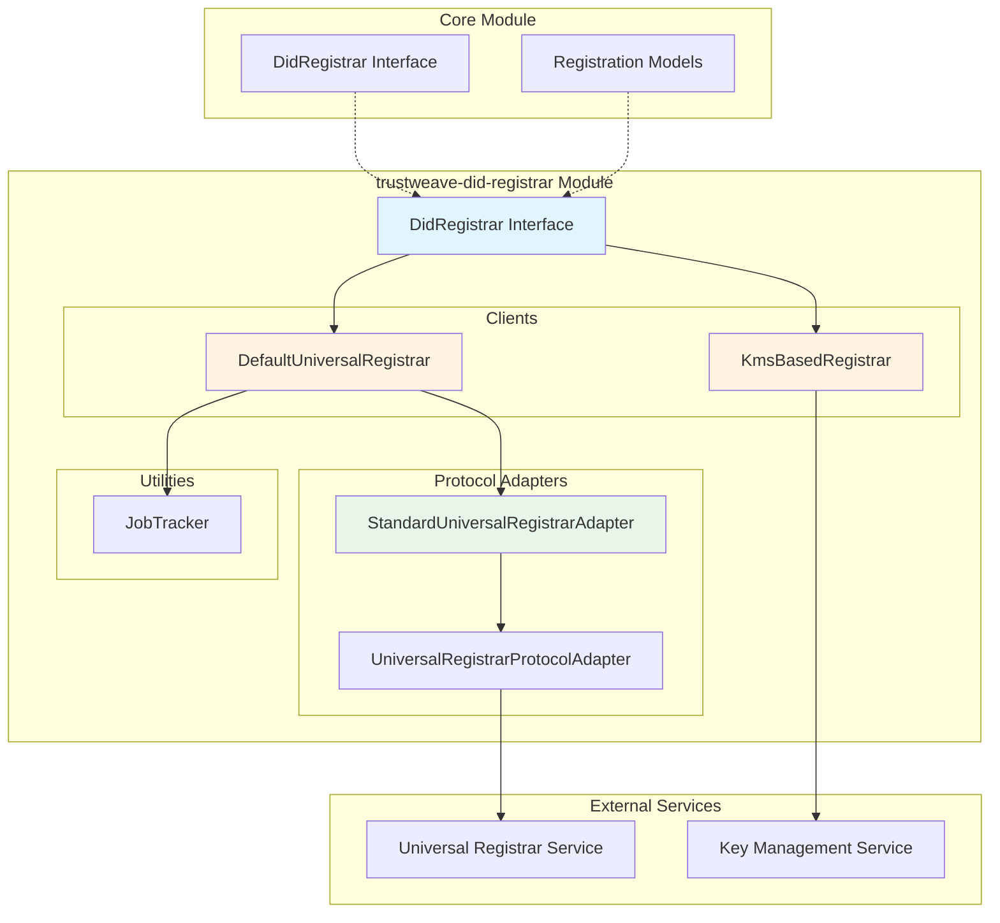
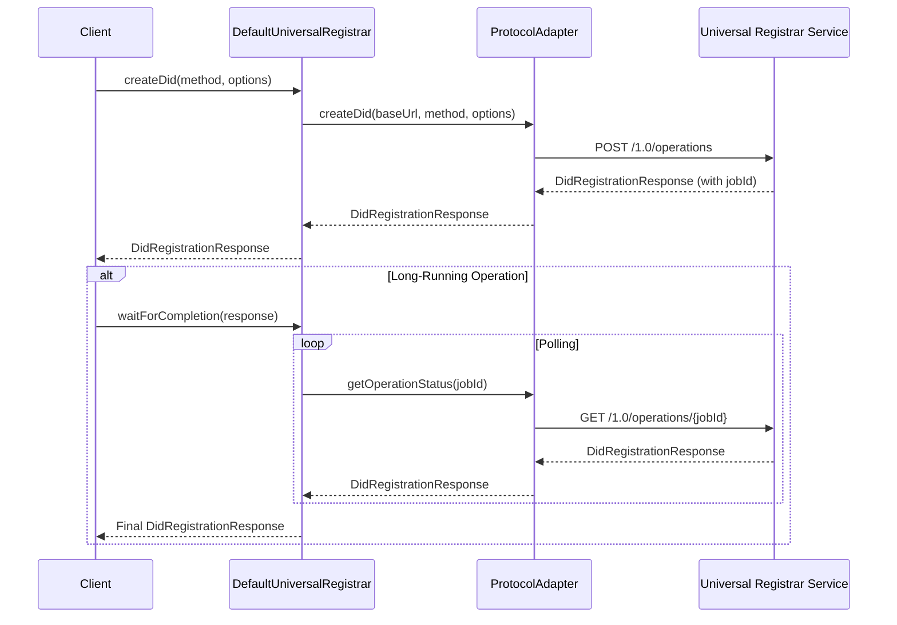
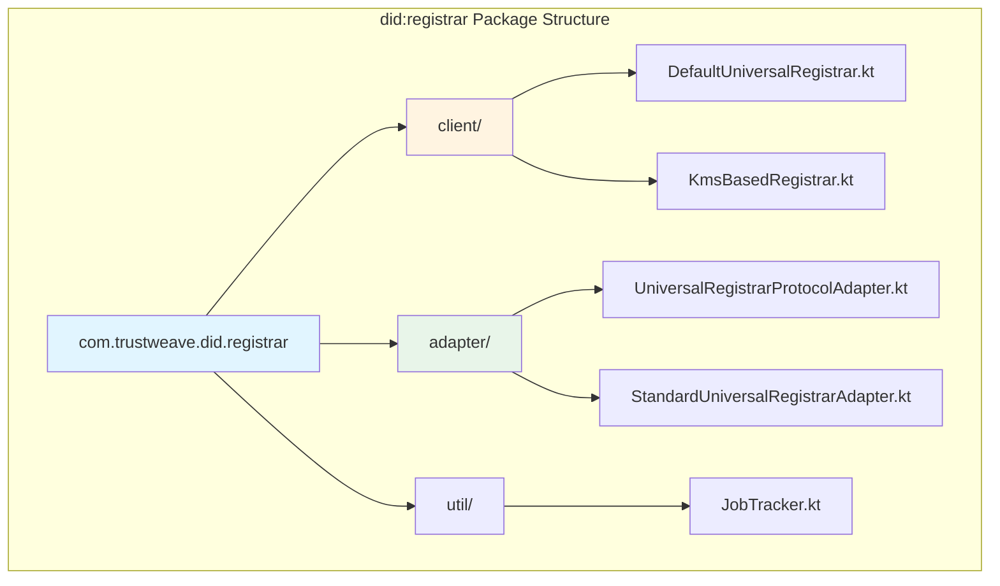

# trustweave-did-registrar

The `trustweave-did-registrar` module provides implementations of the `DidRegistrar` interface for creating, updating, and deactivating DIDs according to the [DID Registration specification](https://identity.foundation/did-registration/).

```kotlin
dependencies {
    implementation("com.trustweave:trustweave-did-registrar:1.0.0-SNAPSHOT")
    implementation("com.trustweave:trustweave-did:1.0.0-SNAPSHOT")
    implementation("com.trustweave:trustweave-kms:1.0.0-SNAPSHOT")
}
```

**Result:** Gradle exposes DID Registrar implementations that can be used with any DID method to perform registration operations through Universal Registrar services or local KMS-based implementations.

## Overview

The `trustweave-did-registrar` module provides:

- **DidRegistrar Implementations** – clients for Universal Registrar services and local KMS-based registrars
- **Protocol Adapters** – adapters for different Universal Registrar implementations (standard, GoDiddy, etc.)
- **Key Management Modes** – support for Internal Secret Mode and External Secret Mode
- **Long-Running Operations** – support for tracking and polling long-running registration operations
- **Spec Compliance** – full compliance with DID Registration specification

## Architecture



## Key Components

### DefaultUniversalRegistrar

A client implementation for Universal Registrar services that supports:

- Standard Universal Registrar protocol
- Pluggable protocol adapters
- Long-running operation polling
- Automatic job tracking

```kotlin
import com.trustweave.did.registrar.client.*
import com.trustweave.did.registrar.model.*

val registrar = DefaultUniversalRegistrar(
    baseUrl = "https://dev.uniregistrar.io",
    protocolAdapter = StandardUniversalRegistrarAdapter()
)

// Create a DID
val response = registrar.createDid(
    method = "web",
    options = CreateDidOptions(
        keyManagementMode = KeyManagementMode.INTERNAL_SECRET,
        returnSecrets = true
    )
)

// Wait for completion if long-running
val finalResponse = registrar.waitForCompletion(response)
val did = finalResponse.didState.did
```

**What this does:** Provides a client for interacting with Universal Registrar services over HTTP.

**Outcome:** Enables DID registration operations through any Universal Registrar instance.

### KmsBasedRegistrar

A local registrar implementation that uses a Key Management Service (KMS) for Internal Secret Mode:

```kotlin
import com.trustweave.did.registrar.client.*
import com.trustweave.kms.*

val kms = InMemoryKeyManagementService()
val registrar = KmsBasedRegistrar(kms)

val response = registrar.createDid(
    method = "key",
    options = CreateDidOptions(
        keyManagementMode = KeyManagementMode.INTERNAL_SECRET,
        returnSecrets = true
    )
)

val did = response.didState.did
```

**What this does:** Provides a local registrar that generates and manages keys using a KMS.

**Outcome:** Enables DID creation without requiring an external Universal Registrar service.

**Key Management Modes:**
- **Internal Secret Mode**: Registrar generates and manages keys internally
- **External Secret Mode**: Not supported (use a registrar that supports external wallet/KMS integration)

### UniversalRegistrarProtocolAdapter

Interface for protocol adapters that abstract differences between Universal Registrar implementations:

```kotlin
interface UniversalRegistrarProtocolAdapter {
    suspend fun createDid(
        baseUrl: String,
        method: String,
        options: CreateDidOptions
    ): DidRegistrationResponse
    
    suspend fun updateDid(
        baseUrl: String,
        did: String,
        document: DidDocument,
        options: UpdateDidOptions
    ): DidRegistrationResponse
    
    suspend fun deactivateDid(
        baseUrl: String,
        did: String,
        options: DeactivateDidOptions
    ): DidRegistrationResponse
    
    suspend fun getOperationStatus(
        baseUrl: String,
        jobId: String
    ): DidRegistrationResponse
}
```

**What this does:** Provides a pluggable adapter pattern for different Universal Registrar implementations.

**Outcome:** Enables support for multiple Universal Registrar providers (standard, GoDiddy, custom) through a unified interface.

### StandardUniversalRegistrarAdapter

Implementation of `UniversalRegistrarProtocolAdapter` for standard Universal Registrar endpoints:

- Operations: `POST /1.0/operations`
- Status: `GET /1.0/operations/{jobId}`

**What this does:** Implements the standard Universal Registrar protocol as defined by the reference implementation.

**Outcome:** Enables compatibility with public Universal Registrar instances like `dev.uniregistrar.io`.

## Key Management Modes

The module supports two key management modes as defined by the DID Registration specification:

### Internal Secret Mode

The registrar generates and manages keys internally:

```kotlin
val options = CreateDidOptions(
    keyManagementMode = KeyManagementMode.INTERNAL_SECRET,
    storeSecrets = false,      // Whether registrar stores keys
    returnSecrets = true       // Whether registrar returns keys to client
)
```

**Use Cases:**
- Quick DID creation for testing
- Applications that don't need to manage keys externally
- Development and prototyping

### External Secret Mode

The client provides keys via external wallet/KMS:

```kotlin
val options = CreateDidOptions(
    keyManagementMode = KeyManagementMode.EXTERNAL_SECRET,
    secret = Secret(
        keys = listOf(/* key material */)
    )
)
```

**Use Cases:**
- Production applications with existing key management
- Compliance requirements for key custody
- Integration with hardware security modules (HSMs)

**Note:** `KmsBasedRegistrar` does not support External Secret Mode. Use a registrar that supports external wallet/KMS integration.

## Long-Running Operations

The DID Registration specification supports long-running operations that return a `jobId` for status tracking:

```kotlin
val response = registrar.createDid(method, options)

if (response.jobId != null) {
    // Operation is long-running, poll for status
    val finalResponse = registrar.waitForCompletion(response)
    val did = finalResponse.didState.did
} else {
    // Operation completed immediately
    val did = response.didState.did
}
```

**Operation States:**
- `FINISHED` – Operation completed successfully
- `FAILED` – Operation encountered an error
- `ACTION` – Additional steps are required
- `WAIT` – Operation is pending

## Data Flow



## Usage Examples

### Using Universal Registrar Client

```kotlin
import com.trustweave.did.registrar.client.*
import com.trustweave.did.registrar.model.*

// Create registrar client
val registrar = DefaultUniversalRegistrar(
    baseUrl = "https://dev.uniregistrar.io",
    pollInterval = 1000,      // Poll every 1 second
    maxPollAttempts = 60      // Poll up to 60 times
)

// Create a DID
val response = registrar.createDidAndWait(
    method = "web",
    options = CreateDidOptions(
        keyManagementMode = KeyManagementMode.INTERNAL_SECRET,
        returnSecrets = true
    )
)

println("Created DID: ${response.didState.did}")
```

### Using KMS-Based Registrar

```kotlin
import com.trustweave.did.registrar.client.*
import com.trustweave.kms.*

// Create KMS and registrar
val kms = InMemoryKeyManagementService()
val registrar = KmsBasedRegistrar(kms)

// Create a DID
val response = registrar.createDid(
    method = "key",
    options = CreateDidOptions(
        keyManagementMode = KeyManagementMode.INTERNAL_SECRET,
        returnSecrets = true
    )
)

println("Created DID: ${response.didState.did}")
if (response.didState.secret != null) {
    println("Secrets returned: ${response.didState.secret.keys?.size} keys")
}
```

### Integrating with DidMethod

```kotlin
import com.trustweave.did.*
import com.trustweave.did.registrar.client.*
import com.trustweave.did.registration.impl.*

// Create registrar
val registrar = DefaultUniversalRegistrar("https://dev.uniregistrar.io")

// Create HTTP-based DID method with registrar
val spec = DidRegistrationSpec(
    name = "web",
    driver = DriverConfig(
        type = "universal-resolver",
        baseUrl = "https://dev.uniresolver.io"
    ),
    capabilities = MethodCapabilities(
        create = true,
        resolve = true,
        update = true,
        deactivate = true
    )
)

val method = HttpDidMethod(spec, registrar)

// Use the method
val didDoc = method.createDid(DidCreationOptions())
```

## Module Structure



## Dependencies

- Depends on [`trustweave-did`](trustweave-did.md) for `DidRegistrar` interface and models
- Depends on [`trustweave-kms`](trustweave-kms.md) for `KmsBasedRegistrar` implementation
- Depends on `kotlinx.coroutines` for async operations
- Depends on `kotlinx.serialization` for JSON serialization

## Related Modules

- **[trustweave-did](trustweave-did.md)** – Core DID module with `DidRegistrar` interface
- **[trustweave-did-registrar-server](trustweave-did-registrar-server.md)** – Universal Registrar server implementation

## Next Steps

- Review [DID Registration Specification](../integrations/did-registration/OFFICIAL_SPEC.md) for detailed spec compliance
- See [DID Registration Integration Guide](../integrations/did-registration/README.md) for JSON-based method registration
- Check [Universal Registrar Server](trustweave-did-registrar-server.md) for hosting your own registrar service
- Explore [Key Management](../core-concepts/key-management.md) for KMS integration details

