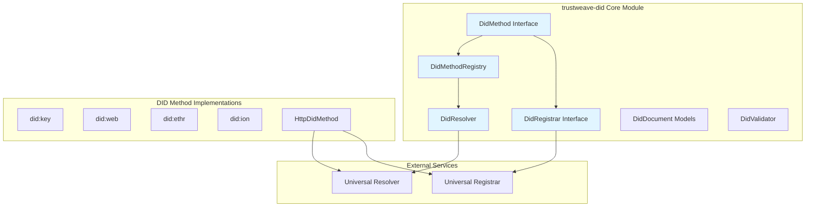
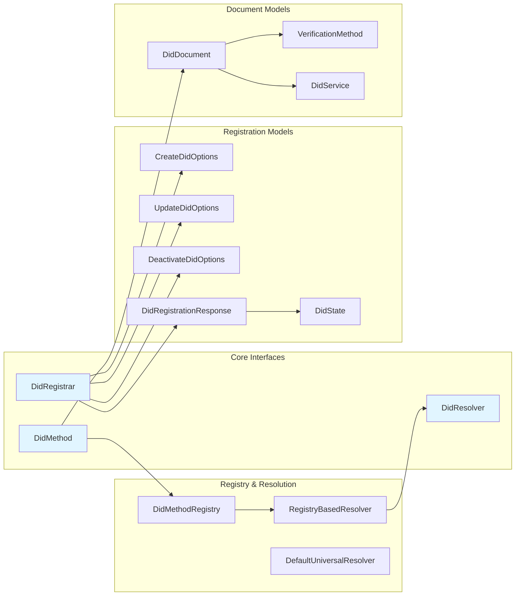
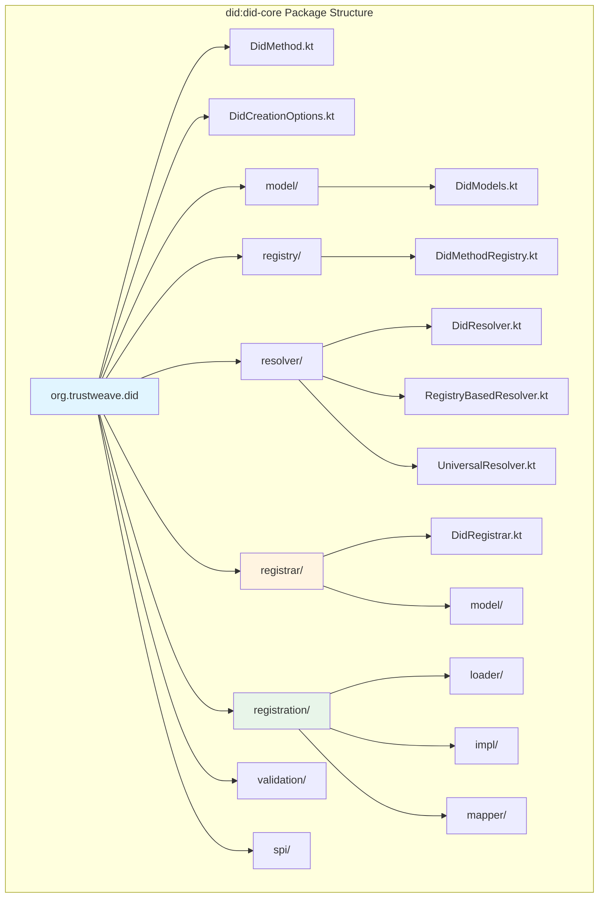

# trustweave-did (Core Module)

The `trustweave-did` module provides Decentralized Identifier (DID) and DID Document management with support for pluggable DID methods, DID resolution, and DID registration interfaces.

```kotlin
dependencies {
    implementation("org.trustweave:trustweave-did:1.0.0-SNAPSHOT")
    implementation("org.trustweave:trustweave-common:1.0.0-SNAPSHOT")
    implementation("org.trustweave:trustweave-kms:1.0.0-SNAPSHOT")
}
```

**Result:** Gradle exposes the DID registry, DID method interfaces, DID Document models, DID resolution, and DID registration interfaces so you can create, resolve, update, and deactivate DIDs using any supported DID method.

## Overview

The `trustweave-did` core module provides:

- **DidMethod Interface** – contract for DID method implementations
- **DID Document Models** – W3C-compliant DID Document structures
- **DidMethodRegistry** – instance-scoped registry for managing DID methods
- **DID Resolution** – unified interface for resolving DIDs across methods
- **DID Registration** – interfaces and models for DID registration operations
- **DID Operations** – create, resolve, update, and deactivate operations
- **SPI Support** – service provider interface for auto-discovery of DID method implementations
- **JSON Registration** – support for loading DID methods from JSON configuration files

## Architecture



## Key Components

### DidMethod Interface

```kotlin
import org.trustweave.did.*
import org.trustweave.did.identifiers.Did

interface DidMethod {
    val method: String  // e.g., "key", "web", "ion"

    suspend fun createDid(options: DidCreationOptions): DidDocument
    suspend fun resolveDid(did: Did): DidResolutionResult
    suspend fun updateDid(did: Did, updater: (DidDocument) -> DidDocument): DidDocument
    suspend fun deactivateDid(did: Did): Boolean
}
```

**What this does:** Defines the contract for DID operations that all DID method implementations must fulfill.

**Outcome:** Enables TrustWeave to support multiple DID methods (key, web, ethr, ion, etc.) through a unified interface.

### DidMethodRegistry

```kotlin
val registry = DidMethodRegistry()
registry.register("key", keyDidMethod)
registry.register("web", webDidMethod)

val method = registry.get("key")
val didDoc = method?.createDid(options)
```

**What this does:** Provides instance-scoped registration and retrieval of DID methods.

**Outcome:** Allows multiple DID methods to coexist in the same application context.

### DidResolver

```kotlin
import org.trustweave.did.identifiers.Did

val resolver = RegistryBasedResolver(registry)
val did = Did("did:key:z6Mk...")
val result = resolver.resolve(did)
```

**What this does:** Provides a unified interface for resolving DIDs across different methods.

**Outcome:** Enables method-agnostic DID resolution with proper error handling.

### DidRegistrar Interface

```kotlin
import org.trustweave.did.registrar.*

interface DidRegistrar {
    suspend fun createDid(method: String, options: CreateDidOptions): DidRegistrationResponse
    suspend fun updateDid(did: String, document: DidDocument, options: UpdateDidOptions): DidRegistrationResponse
    suspend fun deactivateDid(did: String, options: DeactivateDidOptions): DidRegistrationResponse
}
```

**What this does:** Defines the contract for DID registration operations according to the DID Registration specification.

**Outcome:** Enables method-agnostic DID creation, updates, and deactivation through registrar services.

**Note:** The `DidRegistrar` interface is defined in the core module, but implementations are provided in the `trustweave-did-registrar` module. See [DID Registrar Module](trustweave-did-registrar.md) for implementation details.

### DID Document Models

The module includes W3C-compliant models for:

- `DidDocument` – complete DID Document structure
- `VerificationMethod` – public key and verification methods
- `DidService` – service endpoints
- `DidResolutionResult` – resolution response with metadata
- `DidRegistrationResponse` – registration response with job tracking
- `DidState` – operation state (finished, failed, action, wait)
- `Secret` – key material for registration operations

**What this does:** Provides type-safe, serializable models for DID documents that comply with W3C DID Core specification and DID Registration specification.

**Outcome:** Ensures interoperability with other DID implementations and proper serialization.

### JSON-Based DID Method Registration

The module supports loading DID methods from JSON configuration files that follow the [DID Method Registry](https://identity.foundation/did-registration/) format:

```kotlin
val loader = JsonDidMethodLoader()
val method = loader.loadFromFile(Paths.get("did-methods/web.json"))
registry.register(method)
```

**What this does:** Enables DID methods to be registered without writing code, using JSON configuration files.

**Outcome:** Simplifies adding support for new DID methods by providing configuration-driven registration.

See [DID Registration Integration Guide](../integrations/did-registration/README.md) for detailed information.

## Component Relationships



## Usage Example

```kotlin
import org.trustweave.TrustWeave
import org.trustweave.did.*
import kotlinx.coroutines.runBlocking

fun main() = runBlocking {
    // Create TrustWeave instance with DID methods
    val trustweave = TrustWeave.create {
        didMethods {
            + DidKeyMethod(kms)  // Register did:key method
        }
    }

    // Create DID with options
    val didDoc = trustweave.dids.create("key") {
        algorithm = KeyAlgorithm.Ed25519
    }

    println("Created DID: ${didDoc.id}")

    // Resolve DID
    val resolution = trustweave.dids.resolve(didDoc.id)
    if (resolution.document != null) {
        println("Resolved DID: ${resolution.document.id}")
    } else {
        println("DID not found: ${resolution.resolutionMetadata["error"]}")
    }
}
```

**What this does:** Uses SPI to discover a DID method provider, creates a DID using the did:key method, and then resolves it.

**Outcome:** Enables seamless DID operations across different DID methods.

## Supported DID Methods

TrustWeave provides implementations for:

- **did:key** (`org.trustweave.did:key`) – Native did:key implementation. See [Key DID Integration Guide](../integrations/key-did.md).
- **did:web** (`org.trustweave.did:web`) – Web DID method. See [Web DID Integration Guide](../integrations/web-did.md).
- **did:ethr** (`org.trustweave.did:ethr`) – Ethereum DID method. See [Ethereum DID Integration Guide](../integrations/ethr-did.md).
- **did:ion** (`org.trustweave.did:ion`) – Microsoft ION DID method. See [ION DID Integration Guide](../integrations/ion-did.md).
- **did:jwk** (`org.trustweave.did:jwk`) – JWK DID method. See [JWK DID Integration Guide](../integrations/jwk-did.md).
- **did:peer** (`org.trustweave.did:peer`) – Peer DID method. See [Peer DID Integration Guide](../integrations/peer-did.md).
- **did:plc** (`org.trustweave.did:plc`) – PLC DID method. See [PLC DID Integration Guide](../integrations/plc-did.md).
- **did:ens** (`org.trustweave.did:ens`) – ENS DID method. See [ENS DID Integration Guide](../integrations/ens-did.md).
- **did:polygon** (`org.trustweave.did:polygon`) – Polygon DID method. See [Polygon DID Integration Guide](../integrations/polygon-did.md).
- **did:sol** (`org.trustweave.did:sol`) – Solana DID method. See [Solana DID Integration Guide](../integrations/sol-did.md).
- **did:cheqd** (`org.trustweave.did:cheqd`) – Cheqd DID method. See [Cheqd DID Integration Guide](../integrations/cheqd-did.md).

Additionally, the module supports HTTP-based DID methods through JSON configuration. See [DID Registration Integration Guide](../integrations/did-registration/README.md) for details.

## Module Structure



## Dependencies

- Depends on [`trustweave-common`](trustweave-common.md) for core types, exceptions, and SPI interfaces
- Depends on [`trustweave-kms`](trustweave-kms.md) for key operations

## Related Modules

- **[trustweave-did-registrar](trustweave-did-registrar.md)** – DID Registrar implementations (clients and adapters)
- **[trustweave-did-registrar-server](trustweave-did-registrar-server.md)** – Universal Registrar server implementation

## Next Steps

- Review [DID Concepts](../core-concepts/dids.md) for understanding DIDs
- Explore [DID Integration Guides](../integrations/README.md) for specific method setups
- See [DID Operations Tutorial](../tutorials/did-operations-tutorial.md) for step-by-step examples
- Check [Creating Plugins](../contributing/creating-plugins.md) to implement custom DID methods
- Learn about [DID Registration](../integrations/did-registration/README.md) for JSON-based method registration
