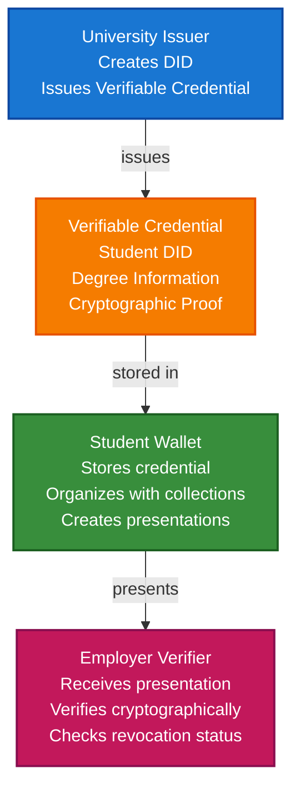

# Academic Credentials Scenario

This guide walks you through building a complete academic credential system using TrustWeave. You'll learn how universities can issue verifiable diplomas, how students can store them in wallets, and how employers can verify credentials without contacting the university.

## What You'll Build

By the end of this tutorial, you'll have:

- ✅ Created DIDs for a university (issuer) and a student (holder)
- ✅ Issued a Verifiable Credential for a university degree
- ✅ Stored the credential in a student's wallet
- ✅ Organized credentials with collections and tags
- ✅ Created a Verifiable Presentation for job applications
- ✅ Verified the credential cryptographically

## Big Picture & Significance

### The Academic Credential Challenge

Academic credentials are fundamental to career advancement and professional opportunities. However, traditional credential systems are slow, prone to fraud, and don't respect student privacy or control.

**Industry Context**:
- **Market Size**: Global education technology market projected to reach $404 billion by 2025
- **Credential Volume**: Millions of degrees issued annually worldwide
- **Verification Costs**: Universities spend significant resources on credential verification
- **Fraud Impact**: Credential fraud costs billions annually
- **Student Rights**: Growing demand for student-controlled credentials

**Why This Matters**:
1. **Student Control**: Students own and control their credentials
2. **Instant Verification**: Employers can verify credentials instantly
3. **Privacy**: Selective disclosure protects student privacy
4. **Fraud Prevention**: Cryptographic proof prevents forgery
5. **Portability**: Credentials work across institutions and borders
6. **Efficiency**: Reduces verification costs for all parties

### The Credential Verification Problem

Traditional academic credentials face critical issues:
- **Slow Verification**: Employers must contact universities directly
- **Fraud Vulnerability**: Paper diplomas can be easily forged
- **No Privacy**: Sharing a diploma reveals all information
- **Not Portable**: Credentials tied to specific institutions
- **High Costs**: Verification processes are expensive and time-consuming

## Value Proposition

### Problems Solved

1. **Instant Verification**: Cryptographic proof without contacting universities
2. **Fraud Prevention**: Tamper-proof credentials cannot be forged
3. **Privacy Control**: Selective disclosure shows only necessary information
4. **Student Ownership**: Students control their own credentials
5. **Interoperability**: Standard format works across all institutions
6. **Cost Reduction**: Eliminates expensive verification processes
7. **Portability**: Credentials work across institutions and borders

### Business Benefits

**For Universities**:
- **Cost Savings**: Reduced verification workload
- **Reputation**: Enhanced trust through verifiable credentials
- **Efficiency**: Automated credential issuance
- **Compliance**: Meet accreditation requirements

**For Students**:
- **Control**: Own and control credentials
- **Privacy**: Share only necessary information
- **Convenience**: Access credentials from any device
- **Portability**: Credentials work everywhere

**For Employers**:
- **Speed**: Instant verification
- **Trust**: Cryptographic proof of authenticity
- **Cost**: Reduced verification costs
- **Efficiency**: Streamlined hiring process

### ROI Considerations

- **Verification Costs**: 80-90% reduction in verification costs
- **Fraud Prevention**: Eliminates credential fraud
- **Efficiency**: 10x faster verification process
- **Student Satisfaction**: Improved student experience

## Understanding the Problem

Traditional academic credentials have several problems:

1. **Verification is slow**: Employers must contact universities directly
2. **Fraud is easy**: Paper diplomas can be forged
3. **No privacy**: Sharing a diploma reveals all information
4. **Not portable**: Credentials are tied to institutions

TrustWeave solves this by enabling:

- **Instant verification**: Cryptographic proof without contacting the university
- **Tamper-proof**: Credentials are cryptographically signed
- **Privacy-preserving**: Selective disclosure shows only what's needed
- **Self-sovereign**: Students control their own credentials

## How It Works: The Credential Flow



## Prerequisites

- Java 21+
- Kotlin 2.2.0+
- Gradle 8.5+
- Basic understanding of Kotlin and coroutines

## Step 1: Add Dependencies

Add TrustWeave dependencies to your `build.gradle.kts`. These modules cover DID management, credential issuance, wallet storage, and the in-memory services used throughout this scenario.

```kotlin
dependencies {
    // Core TrustWeave modules
    implementation("com.trustweave:trustweave-core:1.0.0-SNAPSHOT")
    implementation("com.trustweave:trustweave-json:1.0.0-SNAPSHOT")
    implementation("com.trustweave:trustweave-kms:1.0.0-SNAPSHOT")
    implementation("com.trustweave:trustweave-did:1.0.0-SNAPSHOT")
    implementation("com.trustweave:trustweave-anchor:1.0.0-SNAPSHOT")
    
    // Test kit for in-memory implementations
    implementation("com.trustweave:trustweave-testkit:1.0.0-SNAPSHOT")
    
    // Kotlinx Serialization
    implementation("org.jetbrains.kotlinx:kotlinx-serialization-json:1.6.0")
    
    // Coroutines
    implementation("org.jetbrains.kotlinx:kotlinx-coroutines-core:1.7.3")
}
```

**Result:** After syncing, you can run every snippet below without adding more modules or adapters.

## Step 2: Complete Runnable Example

Here's the full academic credential flow using the TrustWeave facade API. This complete, copy-paste ready example demonstrates the entire workflow from issuance to verification.

```kotlin
package com.example.academic.credentials

import com.trustweave.TrustWeave
import com.trustweave.core.*
import com.trustweave.credential.PresentationOptions
import com.trustweave.credential.wallet.Wallet
import kotlinx.coroutines.runBlocking
import kotlinx.serialization.json.buildJsonObject
import kotlinx.serialization.json.put
import java.time.Instant
import java.time.temporal.ChronoUnit

fun main() = runBlocking {
    println("=".repeat(70))
    println("Academic Credentials Scenario - Complete End-to-End Example")
    println("=".repeat(70))
    
    // Step 1: Create TrustWeave instance
    val TrustWeave = TrustWeave.create()
    println("\n✅ TrustWeave initialized")
    
    // Step 2: Create DIDs for university (issuer) and student (holder)
    val universityDidDoc = TrustWeave.dids.create()
    val universityDid = universityDidDoc.id
    val universityKeyId = universityDidDoc.verificationMethod.firstOrNull()?.id
        ?: error("No verification method found")
    
    val studentDidDoc = TrustWeave.dids.create()
    val studentDid = studentDidDoc.id
    
    println("✅ University DID: $universityDid")
    println("✅ Student DID: $studentDid")
    
    // Step 3: Issue a degree credential
    val credential = TrustWeave.issueCredential(
        issuerDid = universityDid,
        issuerKeyId = universityKeyId,
        credentialSubject = buildJsonObject {
            put("id", studentDid)
            put("degree", buildJsonObject {
                put("type", "BachelorDegree")
                put("name", "Bachelor of Science in Computer Science")
                put("university", "Example University")
                put("graduationDate", "2023-05-15")
                put("gpa", "3.8")
                put("major", "Computer Science")
                put("honors", "Summa Cum Laude")
            })
        },
        types = listOf("VerifiableCredential", "DegreeCredential", "BachelorDegreeCredential"),
        expirationDate = Instant.now().plus(10, ChronoUnit.YEARS).toString()
    ).getOrThrow()
    
    println("✅ Credential issued: ${credential.id}")
    println("   Type: ${credential.type.joinToString()}")
    println("   Issuer: ${credential.issuer}")
    
    // Step 4: Create student wallet and store credential
    val studentWallet = TrustWeave.createWallet(
        holderDid = studentDid
    ) {
        enableOrganization = true
        enablePresentation = true
    }.getOrThrow()
    
    val credentialId = studentWallet.store(credential)
    println("✅ Credential stored in wallet: $credentialId")
    
    // Step 5: Organize credential with collections and tags
    studentWallet.withOrganization { org ->
        val collectionId = org.createCollection("Education", "Academic credentials")
        org.addToCollection(credentialId, collectionId)
        org.tagCredential(credentialId, setOf("degree", "computer-science", "bachelor", "verified"))
        println("✅ Credential organized: collection=$collectionId, tags=${org.getTags(credentialId)}")
    }
    
    // Step 6: Create a verifiable presentation for job application
    val presentation = studentWallet.withPresentation { pres ->
        pres.createPresentation(
            credentialIds = listOf(credentialId),
            holderDid = studentDid,
            options = PresentationOptions(
                holderDid = studentDid,
                challenge = "job-application-12345"
            )
        )
    } ?: error("Presentation capability not available")
    
    println("✅ Presentation created: ${presentation.id}")
    println("   Holder: ${presentation.holder}")
    println("   Credentials: ${presentation.verifiableCredential.size}")
    
    // Step 7: Verify the credential
    val verification = TrustWeave.verifyCredential(credential).getOrThrow()
    
    if (verification.valid) {
        println("\n✅ Credential Verification SUCCESS")
        println("   Proof valid: ${verification.proofValid}")
        println("   Issuer valid: ${verification.issuerValid}")
        println("   Not revoked: ${verification.notRevoked}")
        if (verification.warnings.isNotEmpty()) {
            println("   Warnings: ${verification.warnings}")
        }
    } else {
        println("\n❌ Credential Verification FAILED")
        println("   Errors: ${verification.errors}")
    }
    
    // Step 8: Display wallet statistics
    val stats = studentWallet.getStatistics()
    println("\n📊 Wallet Statistics:")
    println("   Total credentials: ${stats.totalCredentials}")
    println("   Valid credentials: ${stats.validCredentials}")
    println("   Collections: ${stats.collectionsCount}")
    println("   Tags: ${stats.tagsCount}")
    
    println("\n" + "=".repeat(70))
    println("✅ Academic Credentials Scenario Complete!")
    println("=".repeat(70))
}
```

**Expected Output:**

```text
======================================================================
Academic Credentials Scenario - Complete End-to-End Example
======================================================================

✅ TrustWeave initialized
✅ University DID: did:key:z6Mk...
✅ Student DID: did:key:z6Mk...
✅ Credential issued: https://example.edu/credentials/degree-...
   Type: VerifiableCredential, DegreeCredential, BachelorDegreeCredential
   Issuer: did:key:z6Mk...
✅ Credential stored in wallet: urn:uuid:...
✅ Credential organized: collection=..., tags=[degree, computer-science, bachelor, verified]
✅ Presentation created: urn:uuid:...
   Holder: did:key:z6Mk...
   Credentials: 1

✅ Credential Verification SUCCESS
   Proof valid: true
   Issuer valid: true
   Not revoked: true

📊 Wallet Statistics:
   Total credentials: 1
   Valid credentials: 1
   Collections: 1
   Tags: 4

======================================================================
✅ Academic Credentials Scenario Complete!
======================================================================
```

**To run this example:**
1. Copy the code above into `src/main/kotlin/AcademicCredentialsExample.kt`
2. Ensure dependencies are added (see Step 1)
3. Run with `./gradlew run` or execute in your IDE

**What this demonstrates:**
- ✅ Complete issuer → holder → verifier workflow
- ✅ DID creation for multiple parties
- ✅ Credential issuance with structured data
- ✅ Wallet storage and organization
- ✅ Presentation creation for selective disclosure
- ✅ Cryptographic verification
- ✅ Error handling with Result types

## Step-by-Step Breakdown

This section breaks down the complete example above into individual steps with explanations.

### Step 1: Initialize TrustWeave

Create a TrustWeave instance that provides access to all functionality:

```kotlin
val TrustWeave = TrustWeave.create()
```

**What this does:** Initializes TrustWeave with default configuration, including in-memory KMS, DID methods, and wallet factories. For production, configure with specific providers.

### Step 2: Create DIDs

Each party (university issuer and student holder) needs their own DID:

```kotlin
// Create university DID (issuer)
val universityDidDoc = TrustWeave.dids.create()
val universityDid = universityDidDoc.id
val universityKeyId = universityDidDoc.verificationMethod.firstOrNull()?.id
    ?: error("No verification method found")

// Create student DID (holder)
val studentDidDoc = TrustWeave.dids.create()
val studentDid = studentDidDoc.id
```

**What this does:** Creates self-sovereign identifiers for both parties. The university DID will be used as the credential issuer, and the student DID will be the credential subject.

### Step 3: Issue Credential

The university creates and issues a verifiable credential:

```kotlin
val credential = TrustWeave.issueCredential(
    issuerDid = universityDid,
    issuerKeyId = universityKeyId,
    credentialSubject = buildJsonObject {
        put("id", studentDid)
        put("degree", buildJsonObject {
            put("type", "BachelorDegree")
            put("name", "Bachelor of Science in Computer Science")
            put("university", "Example University")
            put("graduationDate", "2023-05-15")
            put("gpa", "3.8")
            put("major", "Computer Science")
            put("honors", "Summa Cum Laude")
        })
    },
    types = listOf("VerifiableCredential", "DegreeCredential", "BachelorDegreeCredential"),
    expirationDate = Instant.now().plus(10, ChronoUnit.YEARS).toString()
).getOrThrow()
```

**What this does:** Issues a cryptographically signed credential with the university's DID. The credential includes degree information and is valid for 10 years.

### Step 4: Create Student Wallet

Students need a wallet to store their credentials:

```kotlin
val studentWallet = TrustWeave.createWallet(
    holderDid = studentDid
) {
    enableOrganization = true  // Enable collections and tags
    enablePresentation = true  // Enable presentation creation
}.getOrThrow()
```

**What this does:** Creates an in-memory wallet for the student with organization and presentation capabilities enabled.

### Step 5: Store Credential

The student stores the credential in their wallet:

```kotlin
val credentialId = studentWallet.store(credential)
```

**What this does:** Stores the credential in the wallet and returns a unique credential ID for later retrieval.

### Step 6: Organize Credentials

Use collections and tags to organize credentials:

```kotlin
studentWallet.withOrganization { org ->
    val collectionId = org.createCollection("Education", "Academic credentials")
    org.addToCollection(credentialId, collectionId)
    org.tagCredential(credentialId, setOf("degree", "computer-science", "bachelor", "verified"))
}
```

**What this does:** Organizes the credential into an "Education" collection and adds tags for easy searching and filtering.

### Step 7: Query Credentials

Find credentials easily using the query API:

```kotlin
val degrees = studentWallet.query {
    byType("DegreeCredential")
    valid()
}
```

**What this does:** Queries the wallet for all valid degree credentials.

### Step 8: Create Presentation

Create a verifiable presentation for sharing with employers:

```kotlin
val presentation = studentWallet.withPresentation { pres ->
    pres.createPresentation(
        credentialIds = listOf(credentialId),
        holderDid = studentDid,
        options = PresentationOptions(
            holderDid = studentDid,
            challenge = "job-application-12345"
        )
    )
} ?: error("Presentation capability not available")
```

**What this does:** Creates a verifiable presentation containing the credential, signed by the student. The challenge prevents replay attacks.

### Step 9: Verify Credential

Employers verify the credential cryptographically:

```kotlin
val verification = TrustWeave.verifyCredential(credential).getOrThrow()

if (verification.valid) {
    println("Credential is valid!")
    println("Proof valid: ${verification.proofValid}")
    println("Issuer valid: ${verification.issuerValid}")
    println("Not revoked: ${verification.notRevoked}")
} else {
    println("Credential verification failed: ${verification.errors}")
}
```

**What this does:** Verifies the credential's cryptographic proof, checks issuer DID resolution, validates expiration, and checks revocation status.

## Advanced Features

### Selective Disclosure

Share only specific fields from credentials. Note: Full selective disclosure requires BBS+ proofs. For basic use cases, you can create presentations with only the credentials you want to share:

```kotlin
// Create presentation with only specific credentials
val selectivePresentation = studentWallet.withPresentation { pres ->
    pres.createPresentation(
        credentialIds = listOf(credentialId),  // Only include this credential
        holderDid = studentDid,
        options = PresentationOptions(
            holderDid = studentDid,
            challenge = "job-application-12345"
        )
    )
}

// For true selective disclosure (field-level), use BBS+ proof generator
// This requires credentials issued with BBS+ proofs
```

### Multiple Credentials

Students can store multiple credentials:

```kotlin
// Store multiple degrees
val bachelorId = studentWallet.store(bachelorDegree)
val masterId = studentWallet.store(masterDegree)
val certificateId = studentWallet.store(certificate)

// Organize into collection
studentWallet.withOrganization { org ->
    val allEducation = org.createCollection("All Education", "Complete education history")
    org.addToCollection(bachelorId, allEducation)
    org.addToCollection(masterId, allEducation)
    org.addToCollection(certificateId, allEducation)
}
```

### Credential Verification Workflow

Complete verification flow using TrustWeave facade:

```kotlin
suspend fun verifyAcademicCredential(
    credential: VerifiableCredential,
    expectedIssuer: String,
    TrustWeave: TrustWeave
): Boolean {
    val result = TrustWeave.verifyCredential(credential).getOrThrow()

    if (!result.valid) return false
    if (credential.issuer != expectedIssuer) return false
    if (!credential.type.contains("DegreeCredential")) return false
    
    return true
}
```

## Real-World Considerations

### Trust & Failure Modes

- **Proof verification**: TrustWeave's `verifyCredential` performs full cryptographic proof verification. For high-assurance decisions, ensure you're using production-grade KMS providers.
- **Schema validation**: Register schema definitions before enabling schema validation in verification options.
- **Revocation**: When you add a `credentialStatus` to credentials, ensure you configure a status list resolver. Set `checkRevocation = true` in verification options.
- **Key custody**: Replace the default in-memory KMS with an HSM or cloud KMS (AWS KMS, Azure Key Vault, etc.) for production. Never persist private keys in plaintext.
- **DID resolution**: Ensure DID methods are properly registered and resolvable. For production, use real DID methods (did:key, did:web, did:ethr, etc.) instead of test implementations.

### Revocation

Universities can revoke credentials:

```kotlin
// Add revocation status to credential
val revokedCredential = credential.copy(
    credentialStatus = CredentialStatus(
        id = "https://example.edu/status/revocation-list",
        type = "StatusList2021Entry",
        statusPurpose = "revocation",
        statusListIndex = "12345"
    )
)
```

### Expiration

Credentials can have expiration dates:

```kotlin
val credential = VerifiableCredential(
    // ...
    expirationDate = Instant.now()
        .plus(10, ChronoUnit.YEARS)
        .toString()
)
```

### Schema Validation

Use schemas to ensure credential structure:

```kotlin
val credential = VerifiableCredential(
    // ...
    credentialSchema = CredentialSchema(
        id = "https://example.edu/schemas/degree.json",
        type = "JsonSchemaValidator2018",
        schemaFormat = SchemaFormat.JSON_SCHEMA
    )
)
```

## Benefits

1. **Instant Verification**: No need to contact universities
2. **Tamper-Proof**: Cryptographic signatures prevent forgery
3. **Privacy**: Selective disclosure shows only what's needed
4. **Portable**: Students control their credentials
5. **Verifiable**: Employers can verify independently

## Next Steps

- Learn about [Wallet API Tutorial](../tutorials/wallet-api-tutorial.md)
- Explore [Verifiable Credentials](../core-concepts/verifiable-credentials.md)
- Check out [Professional Identity Scenario](professional-identity-scenario.md)

