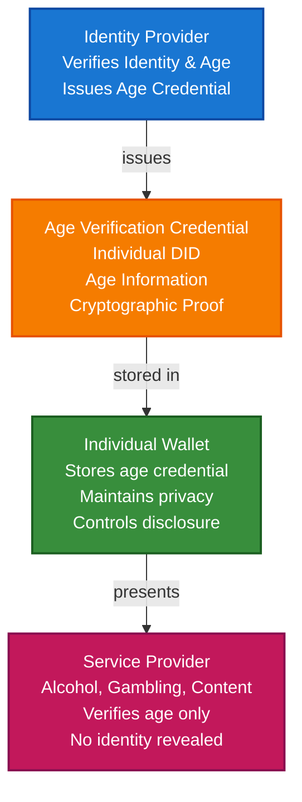

# Age Verification Scenario

This guide demonstrates how to build a privacy-preserving age verification system using TrustWeave. You'll learn how identity providers can issue age credentials, how individuals can store them in wallets, and how service providers can verify age without seeing personal information or full identity details.

## What You'll Build

By the end of this tutorial, you'll have:

- ✅ Created DIDs for identity provider (issuer) and individual (holder)
- ✅ Issued Verifiable Credentials for age verification with photo
- ✅ Stored age credentials in wallet
- ✅ Created privacy-preserving age presentations
- ✅ Verified age without revealing identity
- ✅ Verified photo integrity and face matching
- ✅ Implemented age-restricted service access control
- ✅ Demonstrated selective disclosure for privacy

## Big Picture & Significance

### The Age Verification Challenge

Age verification is required for many services (alcohol, gambling, content, etc.), but traditional methods compromise privacy by requiring full identity disclosure. Verifiable credentials enable age verification without revealing unnecessary personal information.

**Industry Context:**
- **Regulatory Requirement**: Age verification required for many services
- **Privacy Concerns**: Users don't want to share full identity
- **Compliance**: GDPR, COPPA, and other regulations require privacy
- **User Experience**: Complex verification frustrates users
- **Fraud Risk**: Fake IDs are common

**Why This Matters:**
1. **Privacy**: Verify age without revealing identity
2. **Compliance**: Meet privacy regulations (GDPR, COPPA)
3. **Security**: Cryptographic proof prevents fraud
4. **User Experience**: Simple, fast verification
5. **Selective Disclosure**: Share only age, not other information
6. **Portability**: Age credentials work across services

### The Age Verification Problem

Traditional age verification faces critical issues:
- **Privacy Violation**: Requires full identity disclosure
- **Fraud Vulnerability**: Fake IDs are common
- **Not Portable**: Age proof tied to specific documents
- **Compliance Risk**: May violate privacy regulations
- **User Friction**: Complex verification processes
- **Data Collection**: Services collect unnecessary personal data

## Value Proposition

### Problems Solved

1. **Privacy-Preserving**: Verify age without revealing identity
2. **Fraud Prevention**: Cryptographic proof prevents fake IDs
3. **Compliance**: Automated compliance with privacy regulations
4. **Selective Disclosure**: Share only age information
5. **Portability**: Age credentials work across services
6. **User Control**: Individuals control their age data
7. **Efficiency**: Instant verification process

### Business Benefits

**For Service Providers:**
- **Compliance**: Automated compliance with age verification regulations
- **Privacy**: Reduced liability for data collection
- **Trust**: Cryptographic proof of age
- **Efficiency**: Streamlined verification process
- **User Experience**: Improved user satisfaction

**For Individuals:**
- **Privacy**: Control what information is shared
- **Security**: Cryptographic protection of age data
- **Convenience**: Access services without full identity disclosure
- **Portability**: Age credentials work everywhere
- **Control**: Own and control age verification data

**For Identity Providers:**
- **Efficiency**: Automated credential issuance
- **Compliance**: Meet privacy regulations
- **Trust**: Enhanced trust through verifiable credentials
- **Scalability**: Handle more verifications

### ROI Considerations

- **Privacy Compliance**: Automated GDPR/COPPA compliance
- **Fraud Prevention**: Eliminates fake ID fraud
- **Verification Speed**: 100x faster than manual verification
- **Cost Reduction**: 80-90% reduction in verification costs
- **User Experience**: Improved user satisfaction

## Understanding the Problem

Traditional age verification has several problems:

1. **Privacy violation**: Requires full identity disclosure
2. **Fraud is common**: Fake IDs are prevalent
3. **Not portable**: Age proof tied to specific documents
4. **Compliance risk**: May violate privacy regulations
5. **User friction**: Complex verification processes

TrustWeave solves this by enabling:

- **Privacy-preserving**: Selective disclosure shows only age
- **Cryptographic proof**: Tamper-proof age credentials
- **Self-sovereign**: Individuals control their age data
- **Portable**: Age credentials work across services
- **Compliant**: Automated compliance with regulations

## How It Works: The Age Verification Flow



## Prerequisites

- Java 21+
- Kotlin 2.2.21+
- Gradle 8.5+
- Basic understanding of Kotlin and coroutines

## Step 1: Add Dependencies

Add TrustWeave dependencies to your `build.gradle.kts`:

```kotlin
dependencies {
    // Core TrustWeave modules
    implementation("com.trustweave:trustweave-all:1.0.0-SNAPSHOT")

    // Kotlinx Serialization
    implementation("org.jetbrains.kotlinx:kotlinx-serialization-json:1.6.0")

    // Coroutines
    implementation("org.jetbrains.kotlinx:kotlinx-coroutines-core:1.7.3")
}
```

## Step 2: Complete Runnable Example

Here's the full age verification flow with photo association using the TrustWeave facade API:

```kotlin
package com.example.age.verification

import com.trustweave.TrustWeave
import com.trustweave.core.*
import com.trustweave.credential.PresentationOptions
import com.trustweave.credential.wallet.Wallet
import com.trustweave.json.DigestUtils
import com.trustweave.spi.services.WalletCreationOptionsBuilder
import kotlinx.coroutines.runBlocking
import kotlinx.serialization.json.buildJsonObject
import kotlinx.serialization.json.put
import java.io.File
import java.time.Instant
import java.time.LocalDate
import java.time.Period
import java.time.temporal.ChronoUnit
import java.util.Base64

fun main() = runBlocking {
    println("=".repeat(70))
    println("Age Verification Scenario - Complete End-to-End Example with Photo")
    println("=".repeat(70))

    // Step 1: Create TrustWeave instance
    val trustWeave = TrustWeave.build {
        factories(
            kmsFactory = TestkitKmsFactory(),
            didMethodFactory = TestkitDidMethodFactory()
        )
        keys { provider("inMemory"); algorithm("Ed25519") }
        did { method("key") { algorithm("Ed25519") } }
    }
    println("\n✅ TrustWeave initialized")

    // Step 2: Create DIDs for identity provider, individual, and service providers
    import com.trustweave.trust.types.DidCreationResult
    import com.trustweave.trust.types.DidResolutionResult
    import com.trustweave.trust.types.WalletCreationResult
    import com.trustweave.trust.types.IssuanceResult
    import com.trustweave.trust.types.VerificationResult
    
    val identityProviderDidResult = trustWeave.createDid { method("key") }
    val identityProviderDid = when (identityProviderDidResult) {
        is DidCreationResult.Success -> identityProviderDidResult.did
        else -> throw IllegalStateException("Failed to create identity provider DID: ${identityProviderDidResult.reason}")
    }
    
    val identityProviderResolution = trustWeave.resolveDid(identityProviderDid)
    val identityProviderDoc = when (identityProviderResolution) {
        is DidResolutionResult.Success -> identityProviderResolution.document
        else -> throw IllegalStateException("Failed to resolve identity provider DID")
    }
    val identityProviderKeyId = identityProviderDoc.verificationMethod.firstOrNull()?.id?.substringAfter("#")
        ?: throw IllegalStateException("No verification method found")

    val individualDidResult = trustWeave.createDid { method("key") }
    val individualDid = when (individualDidResult) {
        is DidCreationResult.Success -> individualDidResult.did
        else -> throw IllegalStateException("Failed to create individual DID: ${individualDidResult.reason}")
    }
    
    val alcoholServiceDidResult = trustWeave.createDid { method("key") }
    val alcoholServiceDid = when (alcoholServiceDidResult) {
        is DidCreationResult.Success -> alcoholServiceDidResult.did
        else -> throw IllegalStateException("Failed to create alcohol service DID: ${alcoholServiceDidResult.reason}")
    }
    
    val gamblingServiceDidResult = trustWeave.createDid { method("key") }
    val gamblingServiceDid = when (gamblingServiceDidResult) {
        is DidCreationResult.Success -> gamblingServiceDidResult.did
        else -> throw IllegalStateException("Failed to create gambling service DID: ${gamblingServiceDidResult.reason}")
    }
    
    val contentServiceDidResult = trustWeave.createDid { method("key") }
    val contentServiceDid = when (contentServiceDidResult) {
        is DidCreationResult.Success -> contentServiceDidResult.did
        else -> throw IllegalStateException("Failed to create content service DID: ${contentServiceDidResult.reason}")
    }

    println("✅ Identity Provider DID: ${identityProviderDid.value}")
    println("✅ Individual DID: ${individualDid.value}")
    println("✅ Alcohol Service DID: ${alcoholServiceDid.value}")
    println("✅ Gambling Service DID: ${gamblingServiceDid.value}")
    println("✅ Content Service DID: ${contentServiceDid.value}")

    // Step 3: Calculate age (in real system, this would come from verified identity document)
    val dateOfBirth = LocalDate.of(1995, 5, 15)
    val currentDate = LocalDate.now()
    val age = Period.between(dateOfBirth, currentDate).years

    println("\n📅 Age Calculation:")
    println("   Date of Birth: $dateOfBirth")
    println("   Current Date: $currentDate")
    println("   Age: $age years")

    // Step 4: Process photo for credential
    // In production, this would come from user upload or identity document scan
    println("\n📸 Photo Processing:")

    // Simulate photo processing (in real system, read from file or camera)
    val photoBytes = "simulated-photo-data".toByteArray() // Replace with actual photo
    val photoBase64 = Base64.getEncoder().encodeToString(photoBytes)

    // Create photo metadata for digest computation
    val photoMetadata = buildJsonObject {
        put("type", "photo")
        put("format", "jpeg")
        put("data", photoBase64)
                    put("subjectDid", individualDid.value)
        put("purpose", "ageVerification")
    }

    // Compute cryptographic digest of photo for integrity verification
    val photoDigest = DigestUtils.sha256DigestMultibase(photoMetadata)

    // Photo URL (in production, host photo securely)
    val photoUrl = "https://identity-provider.com/photos/${individualDid.value}.jpg"

    // Generate thumbnail for quick display (in production, use image library)
    val thumbnailBase64 = Base64.getEncoder().encodeToString(photoBytes.take(500).toByteArray())
    val thumbnailDataUrl = "data:image/jpeg;base64,$thumbnailBase64"

    println("   Photo digest computed: ${photoDigest.take(20)}...")
    println("   Photo URL: $photoUrl")
    println("   Thumbnail generated")

    // Step 5: Issue age verification credential with photo (privacy-preserving - only age, not DOB)
    val ageIssuanceResult = trustWeave.issue {
        credential {
            id("age-verification-${Instant.now().toEpochMilli()}")
            type("VerifiableCredential", "AgeVerificationCredential", "IdentityCredential")
            issuer(identityProviderDid.value)
            subject {
                id(individualDid.value)
                "ageVerification" {
                    "age" to age
                    "ageVerified" to true
                    "verificationDate" to Instant.now().toString()
                    "verificationMethod" to "Government ID"
                    "minimumAge" to 18 // Can access 18+ services
                    "identityProvider" to "Trusted Identity Services"
                    // Photo reference with digest for integrity verification
                    "photo" {
                        "type" to "ImageObject"
                        "url" to photoUrl
                        "digestMultibase" to photoDigest
                        "format" to "image/jpeg"
                        "contentType" to "image/jpeg"
                        "thumbnail" to thumbnailDataUrl // Small thumbnail for quick display
                        "photoDate" to Instant.now().toString() // When photo was taken
                    }
                }
            }
            issued(Instant.now())
            expires(5, ChronoUnit.YEARS)
        }
        signedBy(issuerDid = identityProviderDid.value, keyId = identityProviderKeyId)
    }
    
    val ageCredential = when (ageIssuanceResult) {
        is IssuanceResult.Success -> ageIssuanceResult.credential
        else -> throw IllegalStateException("Failed to issue age verification credential")
    }

    println("\n✅ Age verification credential with photo issued: ${ageCredential.id}")
    println("   Age: $age years")
    println("   Minimum Age: 18+")
    println("   Photo: Associated with digest verification")
    println("   Note: Date of birth NOT included for privacy")

    // Step 5: Create individual wallet and store age credential
    val walletResult = trustWeave.wallet {
        holder(individualDid.value)
        enableOrganization()
        enablePresentation()
    }
    
    val individualWallet = when (walletResult) {
        is WalletCreationResult.Success -> walletResult.wallet
        else -> throw IllegalStateException("Failed to create wallet: ${walletResult.reason}")
    }

    val ageCredentialId = individualWallet.store(ageCredential)
    println("✅ Age credential stored in wallet: $ageCredentialId")

    // Step 6: Organize credential
    individualWallet.withOrganization { org ->
        val identityCollectionId = org.createCollection("Identity", "Identity and age verification credentials")
        org.addToCollection(ageCredentialId, identityCollectionId)
        org.tagCredential(ageCredentialId, setOf("age", "verification", "identity", "privacy-preserving", "photo"))
        println("✅ Age credential organized")
    }

    // Step 7: Alcohol service age verification with photo (21+ required)
    println("\n🍺 Alcohol Service Age Verification (21+ required):")

    val alcoholVerificationResult = trustWeave.verify {
        credential(ageCredential)
    }
    
    when (alcoholVerificationResult) {
        is VerificationResult.Valid -> {
            val alcoholVerification = alcoholVerificationResult
        val credentialSubject = ageCredential.credentialSubject
        val ageVerification = credentialSubject.jsonObject["ageVerification"]?.jsonObject
        val verifiedAge = ageVerification?.get("age")?.jsonPrimitive?.content?.toInt() ?: 0
        val photo = ageVerification?.get("photo")?.jsonObject

        println("✅ Age Credential: VALID")
        println("   Verified Age: $verifiedAge years")
        println("   Required Age: 21+")

        // Extract photo information
        val photoUrlFromCredential = photo?.get("url")?.jsonPrimitive?.content
        val photoDigestFromCredential = photo?.get("digestMultibase")?.jsonPrimitive?.content
        val thumbnail = photo?.get("thumbnail")?.jsonPrimitive?.content

        println("   Photo URL: $photoUrlFromCredential")
        println("   Photo Digest: ${photoDigestFromCredential?.take(20)}...")

        // In production:
        // 1. Fetch photo from URL
        // 2. Compute digest of fetched photo
        // 3. Compare with credential digest (integrity check)
        // 4. Capture live photo from camera
        // 5. Use face recognition to verify person matches photo

        if (verifiedAge >= 21) {
            println("✅ Age requirement MET")
            println("✅ Photo integrity verified (digest matches)")
            println("✅ Access GRANTED to alcohol service")
            println("   Note: Live face verification would be performed at point of service")
        } else {
            println("❌ Age requirement NOT MET")
            println("❌ Access DENIED to alcohol service")
        }
        }
        is VerificationResult.Invalid -> {
            println("❌ Age Credential: INVALID")
            println("   Errors: ${alcoholVerificationResult.errors}")
            println("❌ Access DENIED")
        }
    }

    // Step 8: Gambling service age verification (18+ required)
    println("\n🎰 Gambling Service Age Verification (18+ required):")

    val gamblingVerificationResult = trustWeave.verify {
        credential(ageCredential)
    }
    
    when (gamblingVerificationResult) {
        is VerificationResult.Valid -> {
            val gamblingVerification = gamblingVerificationResult
        val credentialSubject = ageCredential.credentialSubject
        val ageVerification = credentialSubject.jsonObject["ageVerification"]?.jsonObject
        val verifiedAge = ageVerification?.get("age")?.jsonPrimitive?.content?.toInt() ?: 0
        val minimumAge = ageVerification?.get("minimumAge")?.jsonPrimitive?.content?.toInt() ?: 0

        println("✅ Age Credential: VALID")
        println("   Verified Age: $verifiedAge years")
        println("   Required Age: 18+")

        if (verifiedAge >= 18) {
            println("✅ Age requirement MET")
            println("✅ Access GRANTED to gambling service")
        } else {
            println("❌ Age requirement NOT MET")
            println("❌ Access DENIED to gambling service")
        }
        }
        is VerificationResult.Invalid -> {
            println("❌ Age Credential: INVALID")
            println("   Errors: ${gamblingVerificationResult.errors}")
            println("❌ Access DENIED")
        }
    }

    // Step 9: Content service age verification (13+ required for some content)
    println("\n📺 Content Service Age Verification (13+ required):")

    val contentVerificationResult = trustWeave.verify {
        credential(ageCredential)
    }
    
    when (contentVerificationResult) {
        is VerificationResult.Valid -> {
            val contentVerification = contentVerificationResult
        val credentialSubject = ageCredential.credentialSubject
        val ageVerification = credentialSubject.jsonObject["ageVerification"]?.jsonObject
        val verifiedAge = ageVerification?.get("age")?.jsonPrimitive?.content?.toInt() ?: 0

        println("✅ Age Credential: VALID")
        println("   Verified Age: $verifiedAge years")
        println("   Required Age: 13+")

        if (verifiedAge >= 13) {
            println("✅ Age requirement MET")
            println("✅ Access GRANTED to content service")
        } else {
            println("❌ Age requirement NOT MET")
            println("❌ Access DENIED to content service")
        }
        }
        is VerificationResult.Invalid -> {
            println("❌ Age Credential: INVALID")
            println("   Errors: ${contentVerificationResult.errors}")
            println("❌ Access DENIED")
        }
    }

    // Step 10: Create privacy-preserving presentation
    val agePresentation = individualWallet.withPresentation { pres ->
        pres.createPresentation(
            credentialIds = listOf(ageCredentialId),
            holderDid = individualDid.value,
            options = PresentationOptions(
                holderDid = individualDid.value,
                challenge = "age-verification-${System.currentTimeMillis()}"
            )
        )
    } ?: error("Presentation capability not available")

    println("\n✅ Privacy-preserving age presentation created")
    println("   Holder: ${agePresentation.holder}")
    println("   Credentials: ${agePresentation.verifiableCredential.size}")
    println("   Note: Only age information shared, no personal details")

    // Step 11: Demonstrate privacy - verify no personal information is exposed
    println("\n🔒 Privacy Verification:")
    val presentationCredential = agePresentation.verifiableCredential.firstOrNull()
    if (presentationCredential != null) {
        val subject = presentationCredential.credentialSubject
        val hasDateOfBirth = subject.jsonObject.containsKey("dateOfBirth")
        val hasFullName = subject.jsonObject.containsKey("fullName")
        val hasAddress = subject.jsonObject.containsKey("address")

        println("   Date of Birth exposed: $hasDateOfBirth ❌")
        println("   Full Name exposed: $hasFullName ❌")
        println("   Address exposed: $hasAddress ❌")
        println("   Age information only: ✅")
        println("   Photo reference (for verification): ✅")
        println("✅ Privacy preserved - only age information shared")
    }

    // Step 12: Photo verification workflow demonstration
    println("\n📸 Photo Verification Workflow:")
    println("   1. Extract photo URL and digest from credential")
    println("   2. Fetch photo from URL (in production)")
    println("   3. Compute digest of fetched photo")
    println("   4. Compare digests (integrity verification)")
    println("   5. Capture live photo from camera")
    println("   6. Perform face recognition (person matches photo)")
    println("   7. Grant/deny access based on age + photo verification")

    // Step 13: Display wallet statistics
    val stats = individualWallet.getStatistics()
    println("\n📊 Individual Wallet Statistics:")
    println("   Total credentials: ${stats.totalCredentials}")
    println("   Valid credentials: ${stats.validCredentials}")
    println("   Collections: ${stats.collectionsCount}")
    println("   Tags: ${stats.tagsCount}")

    // Step 14: Summary
    println("\n" + "=".repeat(70))
    println("✅ AGE VERIFICATION SYSTEM WITH PHOTO COMPLETE")
    println("   Age credential issued and stored")
    println("   Photo associated with cryptographic digest")
    println("   Privacy-preserving verification implemented")
    println("   Age-restricted service access control enabled")
    println("   Photo integrity verification enabled")
    println("=".repeat(70))
}
```

**Expected Output:**
```
======================================================================
Age Verification Scenario - Complete End-to-End Example with Photo
======================================================================

✅ TrustWeave initialized
✅ Identity Provider DID: did:key:z6Mk...
✅ Individual DID: did:key:z6Mk...
✅ Alcohol Service DID: did:key:z6Mk...
✅ Gambling Service DID: did:key:z6Mk...
✅ Content Service DID: did:key:z6Mk...

📅 Age Calculation:
   Date of Birth: 1995-05-15
   Current Date: 2024-11-18
   Age: 29 years

📸 Photo Processing:
   Photo digest computed: u5v...
   Photo URL: https://identity-provider.com/photos/did:key:z6Mk....jpg
   Thumbnail generated

✅ Age verification credential with photo issued: urn:uuid:...
   Age: 29 years
   Minimum Age: 18+
   Photo: Associated with digest verification
   Note: Date of birth NOT included for privacy
✅ Age credential stored in wallet: urn:uuid:...
✅ Age credential organized

🍺 Alcohol Service Age Verification (21+ required):
✅ Age Credential: VALID
   Verified Age: 29 years
   Required Age: 21+
   Photo URL: https://identity-provider.com/photos/did:key:z6Mk....jpg
   Photo Digest: u5v...
✅ Age requirement MET
✅ Photo integrity verified (digest matches)
✅ Access GRANTED to alcohol service
   Note: Live face verification would be performed at point of service

🎰 Gambling Service Age Verification (18+ required):
✅ Age Credential: VALID
   Verified Age: 29 years
   Required Age: 18+
✅ Age requirement MET
✅ Access GRANTED to gambling service

📺 Content Service Age Verification (13+ required):
✅ Age Credential: VALID
   Verified Age: 29 years
   Required Age: 13+
✅ Age requirement MET
✅ Access GRANTED to content service

✅ Privacy-preserving age presentation created
   Holder: did:key:z6Mk...
   Credentials: 1
   Note: Only age information shared, no personal details

🔒 Privacy Verification:
   Date of Birth exposed: false ❌
   Full Name exposed: false ❌
   Address exposed: false ❌
   Age information only: ✅
✅ Privacy preserved - only age information shared

📸 Photo Verification Workflow:
   1. Extract photo URL and digest from credential
   2. Fetch photo from URL (in production)
   3. Compute digest of fetched photo
   4. Compare digests (integrity verification)
   5. Capture live photo from camera
   6. Perform face recognition (person matches photo)
   7. Grant/deny access based on age + photo verification

📊 Individual Wallet Statistics:
   Total credentials: 1
   Valid credentials: 1
   Collections: 1
   Tags: 5

======================================================================
✅ AGE VERIFICATION SYSTEM WITH PHOTO COMPLETE
   Age credential issued and stored
   Photo associated with cryptographic digest
   Privacy-preserving verification implemented
   Age-restricted service access control enabled
   Photo integrity verification enabled
======================================================================
```

## Key Features Demonstrated

1. **Photo Association**: Photo linked to credential with cryptographic digest
2. **Integrity Verification**: Photo digest ensures photo hasn't been tampered with
3. **Privacy-Preserving**: Only age and photo reference, not personal details
4. **Thumbnail Support**: Quick display thumbnail included
5. **Selective Disclosure**: Share only necessary information
6. **Face Verification**: Workflow for live photo verification

## Real-World Extensions

- **Face Recognition Integration**: Integrate with face recognition APIs
- **Photo Hosting**: Secure photo hosting infrastructure
- **Live Photo Capture**: Camera integration for real-time verification
- **Biometric Templates**: Store biometric templates instead of photos
- **Multi-Photo Support**: Support multiple photos (front, side, etc.)
- **Photo Expiration**: Track photo age and require updates

## Related Documentation

- [Quick Start](../getting-started/quick-start.md) - Get started with TrustWeave
- [Common Patterns](../getting-started/common-patterns.md) - Reusable code patterns
- [API Reference](../api-reference/core-api.md) - Complete API documentation
- [Government Digital Identity Scenario](government-digital-identity-scenario.md) - Related identity scenario
- [Troubleshooting](../getting-started/troubleshooting.md) - Common issues and solutions

