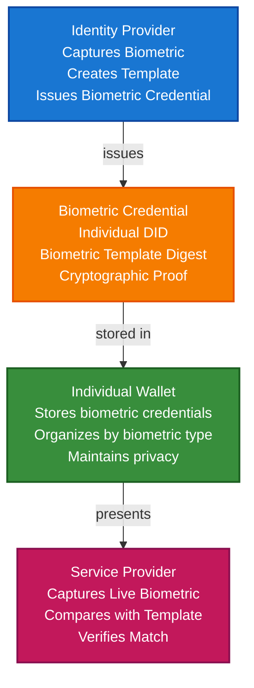

# Biometric Verification Scenario

This guide demonstrates how to build a complete biometric verification system using TrustWeave. You'll learn how identity providers can issue biometric credentials, how individuals can store them in wallets, and how service providers can verify biometric data (fingerprints, face, voice) while maintaining privacy and security.

## What You'll Build

By the end of this tutorial, you'll have:

- Created DIDs for identity provider (issuer) and individual (holder)
- Issued Verifiable Credentials for biometric data (fingerprint, face, voice)
- Stored biometric credentials in wallet
- Implemented biometric template matching
- Created privacy-preserving biometric presentations
- Verified biometric data without revealing raw biometrics
- Implemented multi-modal biometric verification
- Demonstrated biometric liveness detection

## Big Picture & Significance

### The Biometric Verification Challenge

Biometric verification provides strong authentication and identity verification, but traditional systems store raw biometric data centrally, creating privacy and security risks. Verifiable credentials enable decentralized, privacy-preserving biometric verification.

**Industry Context:**
- **Market Size**: Global biometrics market projected to reach $82 billion by 2027
- **Security**: Biometrics provide stronger authentication than passwords
- **Privacy Concerns**: Centralized biometric databases create security risks
- **Regulatory**: GDPR, BIPA require careful handling of biometric data
- **Adoption**: 60% of smartphones use biometric authentication

**Why This Matters:**
1. **Security**: Strong authentication without passwords
2. **Privacy**: Biometric templates, not raw data
3. **Decentralization**: No central biometric database
4. **Control**: Individuals control their biometric data
5. **Interoperability**: Works across systems and devices
6. **Compliance**: Automated compliance with biometric regulations

### The Biometric Verification Problem

Traditional biometric systems face critical issues:
- **Centralized Storage**: Raw biometrics stored in central databases
- **Privacy Risks**: Data breaches expose sensitive biometric data
- **No Portability**: Biometrics tied to specific systems
- **Security Vulnerabilities**: Centralized systems are attack targets
- **Compliance Risk**: Difficult to comply with biometric regulations
- **User Control**: Users don't control their biometric data

## Value Proposition

### Problems Solved

1. **Privacy-Preserving**: Store biometric templates, not raw data
2. **Decentralized**: No central biometric database
3. **User Control**: Individuals control their biometric credentials
4. **Security**: Cryptographic protection of biometric data
5. **Portability**: Biometric credentials work across systems
6. **Compliance**: Automated compliance with biometric regulations
7. **Multi-Modal**: Support multiple biometric types

### Business Benefits

**For Service Providers:**
- **Security**: Strong authentication without passwords
- **Compliance**: Automated GDPR/BIPA compliance
- **Trust**: Cryptographic proof of biometric verification
- **Efficiency**: Streamlined authentication process
- **Cost Reduction**: Reduced password reset costs

**For Individuals:**
- **Privacy**: Control biometric data
- **Security**: Cryptographic protection
- **Convenience**: Fast, seamless authentication
- **Portability**: Biometrics work everywhere
- **Control**: Own and control biometric credentials

**For Identity Providers:**
- **Efficiency**: Automated credential issuance
- **Compliance**: Meet biometric regulations
- **Trust**: Enhanced trust through verifiable credentials
- **Scalability**: Handle more verifications

### ROI Considerations

- **Security**: Eliminates password-related breaches
- **Compliance**: Automated biometric regulation compliance
- **User Experience**: 10x faster authentication
- **Cost Reduction**: 80-90% reduction in password reset costs
- **Fraud Prevention**: Eliminates identity fraud

## Understanding the Problem

Traditional biometric systems have several problems:

1. **Centralized storage**: Raw biometrics in central databases
2. **Privacy risks**: Data breaches expose sensitive data
3. **No portability**: Biometrics tied to specific systems
4. **Security vulnerabilities**: Centralized systems are targets
5. **Compliance risk**: Difficult to comply with regulations

TrustWeave solves this by enabling:

- **Privacy-preserving**: Store templates, not raw biometrics
- **Decentralized**: No central database
- **Self-sovereign**: Individuals control biometric data
- **Cryptographic protection**: Secure biometric credentials
- **Portable**: Biometrics work across systems

## How It Works: The Biometric Verification Flow


```mermaid
flowchart TD
    A["Identity Provider<br/>Captures Biometric<br/>Creates Template<br/>Issues Biometric Credential"] -->|issues| B["Biometric Credential<br/>Individual DID<br/>Biometric Template Digest<br/>Cryptographic Proof"]
    B -->|stored in| C["Individual Wallet<br/>Stores biometric credentials<br/>Organizes by biometric type<br/>Maintains privacy"]
    C -->|presents| D["Service Provider<br/>Captures Live Biometric<br/>Compares with Template<br/>Verifies Match"]

    style A fill:#1976d2,stroke:#0d47a1,stroke-width:2px,color:#fff
    style B fill:#f57c00,stroke:#e65100,stroke-width:2px,color:#fff
    style C fill:#388e3c,stroke:#1b5e20,stroke-width:2px,color:#fff
    style D fill:#c2185b,stroke:#880e4f,stroke-width:2px,color:#fff
```

## Prerequisites

- Java 21+
- Kotlin 2.2.21+
- Gradle 8.5+
- Basic understanding of Kotlin and coroutines
- Understanding of biometric concepts (templates, matching, liveness)

## Step 1: Add Dependencies

Add TrustWeave dependencies to your `build.gradle.kts`:

```kotlin
dependencies {
    // Core TrustWeave modules
    implementation("org.trustweave:distribution-all:0.6.0")

    // Kotlinx Serialization
    implementation("org.jetbrains.kotlinx:kotlinx-serialization-json:1.6.0")

    // Coroutines
    implementation("org.jetbrains.kotlinx:kotlinx-coroutines-core:1.7.3")
}
```

## Step 2: Complete Runnable Example

Here's the full biometric verification flow using the TrustWeave facade API:

```kotlin
package com.example.biometric.verification

import org.trustweave.trust.TrustWeave
import org.trustweave.core.*
import org.trustweave.wallet.Wallet
import org.trustweave.core.util.DigestUtils
import org.trustweave.wallet.services.WalletCreationOptionsBuilder
import kotlinx.coroutines.runBlocking
import org.trustweave.credential.model.ProofType
import java.time.Instant
import java.time.temporal.ChronoUnit
import java.util.Base64
import org.trustweave.trust.types.getOrThrowDid
import org.trustweave.trust.types.getOrThrow
import org.trustweave.did.resolver.DidResolutionResult
import org.trustweave.did.resolver.errorMessage
import org.trustweave.did.identifiers.extractKeyId
import org.trustweave.trust.dsl.credential.KmsProviders.IN_MEMORY
import org.trustweave.trust.dsl.credential.KeyAlgorithms.ED25519
import org.trustweave.trust.dsl.credential.DidMethods.KEY
import org.trustweave.credential.results.getOrThrow
import org.trustweave.credential.results.VerificationResult
import org.trustweave.core.json.jsonData

fun main() = runBlocking {
    println("=".repeat(70))
    println("Biometric Verification Scenario - Complete End-to-End Example")
    println("=".repeat(70))

    // Step 1: Create TrustWeave instance
    val trustWeave = TrustWeave.build {
        keys { provider(IN_MEMORY); algorithm(ED25519) }
        did { method(KEY) { algorithm(ED25519) } }
        credentials { defaultProofType(ProofType.Ed25519Signature2020) }
    }
    println("\n✅ TrustWeave initialized")

    // Step 2: Create DIDs for identity provider, individual, and service providers
    
    val identityProviderDid = trustWeave.createDid { method(KEY) }.getOrThrowDid()
    val identityProviderDoc = when (val res = trustWeave.resolveDid(identityProviderDid)) {
    is DidResolutionResult.Success -> res.document
    else -> throw IllegalStateException(res.errorMessage ?: "Failed to resolve DID")
}
    val identityProviderKeyId = identityProviderDoc.verificationMethod.firstOrNull()?.extractKeyId()
        ?: throw IllegalStateException("No verification method found")

    val individualDid = trustWeave.createDid { method(KEY) }.getOrThrowDid()
    val bankDid = trustWeave.createDid { method(KEY) }.getOrThrowDid()
    val buildingAccessDid = trustWeave.createDid { method(KEY) }.getOrThrowDid()

    println("✅ Identity Provider DID: ${identityProviderDid.value}")
    println("✅ Individual DID: ${individualDid.value}")
    println("✅ Bank Service DID: ${bankDid.value}")
    println("✅ Building Access DID: ${buildingAccessDid.value}")

    // Step 3: Simulate biometric capture and template creation
    // In production, this would use actual biometric capture devices
    println("\n[auth] Biometric Template Creation:")

    // Simulate fingerprint template (in production, use fingerprint SDK)
    val fingerprintTemplate = "fingerprint-template-data-${individualDid}".toByteArray()
    val fingerprintTemplateBase64 = Base64.getEncoder().encodeToString(fingerprintTemplate)
    val fingerprintMetadata = jsonData {
        "type" to "fingerprint"
        "algorithm" to "ISO/IEC 19794-2"
        "template" to fingerprintTemplateBase64
        "subjectDid" to individualDid
        "quality" to "high"
        "minutiaeCount" to 25
    }
    val fingerprintDigest = DigestUtils.sha256DigestMultibase(fingerprintMetadata)

    // Simulate face template (in production, use face recognition SDK)
    val faceTemplate = "face-template-data-${individualDid}".toByteArray()
    val faceTemplateBase64 = Base64.getEncoder().encodeToString(faceTemplate)
    val faceMetadata = jsonData {
        "type" to "face"
        "algorithm" to "ISO/IEC 19794-5"
        "template" to faceTemplateBase64
        "subjectDid" to individualDid
        "quality" to "high"
        "livenessDetected" to true
    }
    val faceDigest = DigestUtils.sha256DigestMultibase(faceMetadata)

    // Simulate voice template (in production, use voice recognition SDK)
    val voiceTemplate = "voice-template-data-${individualDid}".toByteArray()
    val voiceTemplateBase64 = Base64.getEncoder().encodeToString(voiceTemplate)
    val voiceMetadata = jsonData {
        "type" to "voice"
        "algorithm" to "ISO/IEC 19794-14"
        "template" to voiceTemplateBase64
        "subjectDid" to individualDid
        "quality" to "high"
        "phrase" to "My voice is my password"
    }
    val voiceDigest = DigestUtils.sha256DigestMultibase(voiceMetadata)

    println("   Fingerprint template created: ${fingerprintDigest.take(20)}...")
    println("   Face template created: ${faceDigest.take(20)}...")
    println("   Voice template created: ${voiceDigest.take(20)}...")
    println("   Note: Templates are privacy-preserving (not raw biometrics)")

    // Step 4: Issue fingerprint biometric credential
    val fingerprintCredentialResult = trustWeave.issue {
        credential {
            type("VerifiableCredential", "BiometricCredential", "FingerprintCredential")
            issuer(identityProviderDid)
            subject {
                id(individualDid.value)
                "biometric" {
                    "type" to "fingerprint"
                    "biometricType" to "Fingerprint"
                    "algorithm" to "ISO/IEC 19794-2"
                    "templateDigest" to fingerprintDigest
                    "templateFormat" to "ISO19794-2"
                    "quality" to "high"
                    "minutiaeCount" to 25
                    "fingers" to listOf("rightIndex", "rightThumb")
                    "captureDate" to Instant.now().toString()
                    "livenessVerified" to true
                    "deviceInfo" {
                        "manufacturer" to "SecureBiometric Inc"
                        "model" to "SB-2024"
                        "certification" to "FIDO2 Certified"
                    }
                }
            }
            issued(Instant.now())
            expires(10, ChronoUnit.YEARS)
        }
        signedBy(identityProviderDid)
    }
    
    val fingerprintCredential = fingerprintCredentialResult.getOrThrow()

    println("\n✅ Fingerprint biometric credential issued: ${fingerprintCredential.id}")

    // Step 5: Issue face biometric credential
    val faceCredentialResult = trustWeave.issue {
        credential {
            type("VerifiableCredential", "BiometricCredential", "FaceCredential")
            issuer(identityProviderDid)
            subject {
                id(individualDid.value)
                "biometric" {
                    "type" to "face"
                    "biometricType" to "Face"
                    "algorithm" to "ISO/IEC 19794-5"
                    "templateDigest" to faceDigest
                    "templateFormat" to "ISO19794-5"
                    "quality" to "high"
                    "livenessDetected" to true
                    "livenessMethod" to "3D depth analysis"
                    "captureDate" to Instant.now().toString()
                    "deviceInfo" {
                        "manufacturer" to "SecureBiometric Inc"
                        "model" to "FaceCam-2024"
                        "certification" to "ISO/IEC 30107-3 Level 2"
                    }
                }
            }
            issued(Instant.now())
            expires(10, ChronoUnit.YEARS)
        }
        signedBy(identityProviderDid)
    }
    
    val faceCredential = faceCredentialResult.getOrThrow()

    println("✅ Face biometric credential issued: ${faceCredential.id}")

    // Step 6: Issue voice biometric credential
    val voiceCredentialResult = trustWeave.issue {
        credential {
            type("VerifiableCredential", "BiometricCredential", "VoiceCredential")
            issuer(identityProviderDid)
            subject {
                id(individualDid.value)
                "biometric" {
                    "type" to "voice"
                    "biometricType" to "Voice"
                    "algorithm" to "ISO/IEC 19794-14"
                    "templateDigest" to voiceDigest
                    "templateFormat" to "ISO19794-14"
                    "quality" to "high"
                    "phrase" to "My voice is my password"
                    "language" to "en-US"
                    "captureDate" to Instant.now().toString()
                    "deviceInfo" {
                        "manufacturer" to "SecureBiometric Inc"
                        "model" to "VoiceRec-2024"
                        "sampleRate" to "16kHz"
                    }
                }
            }
            issued(Instant.now())
            expires(10, ChronoUnit.YEARS)
        }
        signedBy(identityProviderDid)
    }
    
    val voiceCredential = voiceCredentialResult.getOrThrow()

    println("✅ Voice biometric credential issued: ${voiceCredential.id}")

    // Step 7: Create individual wallet and store all biometric credentials
    val individualWallet = trustWeave.wallet {
        holder(individualDid.value)
        enableOrganization()
        enablePresentation()
    }.getOrThrow()

    val fingerprintCredentialId = individualWallet.store(fingerprintCredential)
    val faceCredentialId = individualWallet.store(faceCredential)
    val voiceCredentialId = individualWallet.store(voiceCredential)

    println("\n✅ All biometric credentials stored in wallet")

    // Step 8: Organize credentials by biometric type
    individualWallet.withOrganization { org ->
        val biometricCollectionId = org.createCollection("Biometrics", "Biometric verification credentials")

        org.addToCollection(fingerprintCredentialId, biometricCollectionId)
        org.addToCollection(faceCredentialId, biometricCollectionId)
        org.addToCollection(voiceCredentialId, biometricCollectionId)

        org.tagCredential(fingerprintCredentialId, setOf("biometric", "fingerprint", "authentication", "high-security"))
        org.tagCredential(faceCredentialId, setOf("biometric", "face", "authentication", "convenient"))
        org.tagCredential(voiceCredentialId, setOf("biometric", "voice", "authentication", "hands-free"))

        println("✅ Biometric credentials organized")
    }

    // Step 9: Bank service - Fingerprint authentication
    println("\n[bank] Bank Service - Fingerprint Authentication:")

    val fingerprintVerification = trustWeave.verify { credential(fingerprintCredential) }

    if (fingerprintVerification is VerificationResult.Valid) {
        println("✅ Fingerprint Credential: VALID")

        val subject = fingerprintCredential.credentialSubject.jsonObject
        val biometric = subject["biometric"]?.jsonObject
        val templateDigest = biometric?.get("templateDigest")?.jsonPrimitive?.content
        val livenessVerified = biometric?.get("livenessVerified")?.jsonPrimitive?.content?.toBoolean() ?: false

        println("   Template Digest: ${templateDigest?.take(20)}...")
        println("   Liveness Verified: $livenessVerified")

        // In production:
        // 1. Capture live fingerprint
        // 2. Create template from live capture
        // 3. Compare template with credential template (using biometric matching algorithm)
        // 4. Verify liveness (anti-spoofing)

        val simulatedMatch = true // In production, use actual biometric matching
        if (simulatedMatch && livenessVerified) {
            println("✅ Fingerprint match verified")
            println("✅ Liveness check passed")
            println("✅ Authentication SUCCESS - Access granted to bank account")
        } else {
            println("[FAIL] Fingerprint match failed or liveness check failed")
            println("[FAIL] Authentication FAILED")
        }
    } else {
        println("[FAIL] Fingerprint Credential: INVALID")
        println("[FAIL] Authentication FAILED")
    }

    // Step 10: Building access - Face recognition
    println("\n[building] Building Access - Face Recognition:")

    val faceVerification = trustWeave.verify { credential(faceCredential) }

    if (faceVerification is VerificationResult.Valid) {
        println("✅ Face Credential: VALID")

        val subject = faceCredential.credentialSubject.jsonObject
        val biometric = subject["biometric"]?.jsonObject
        val templateDigest = biometric?.get("templateDigest")?.jsonPrimitive?.content
        val livenessDetected = biometric?.get("livenessDetected")?.jsonPrimitive?.content?.toBoolean() ?: false
        val livenessMethod = biometric?.get("livenessMethod")?.jsonPrimitive?.content

        println("   Template Digest: ${templateDigest?.take(20)}...")
        println("   Liveness Detected: $livenessDetected")
        println("   Liveness Method: $livenessMethod")

        // In production:
        // 1. Capture live face image
        // 2. Perform liveness detection (3D depth, blink detection, etc.)
        // 3. Create template from live capture
        // 4. Compare template with credential template

        val simulatedMatch = true // In production, use actual face recognition
        if (simulatedMatch && livenessDetected) {
            println("✅ Face match verified")
            println("✅ Liveness check passed")
            println("✅ Access GRANTED to building")
        } else {
            println("[FAIL] Face match failed or liveness check failed")
            println("[FAIL] Access DENIED")
        }
    } else {
        println("[FAIL] Face Credential: INVALID")
        println("[FAIL] Access DENIED")
    }

    // Step 11: Multi-modal biometric verification (fingerprint + face)
    println("\n[auth] Multi-Modal Biometric Verification (Fingerprint + Face):")

    val fingerprintValid = trustWeave.verify { credential(fingerprintCredential) } is VerificationResult.Valid
    val faceValid = trustWeave.verify { credential(faceCredential) } is VerificationResult.Valid

    if (fingerprintValid && faceValid) {
        println("✅ Both biometric credentials are valid")

        // In production:
        // 1. Capture both fingerprint and face
        // 2. Verify both match their respective templates
        // 3. Require both to match for high-security access

        val fingerprintMatch = true // Simulated
        val faceMatch = true // Simulated

        if (fingerprintMatch && faceMatch) {
            println("✅ Fingerprint match: SUCCESS")
            println("✅ Face match: SUCCESS")
            println("✅ Multi-modal verification: SUCCESS")
            println("✅ High-security access GRANTED")
        } else {
            println("[FAIL] One or more biometric matches failed")
            println("[FAIL] High-security access DENIED")
        }
    } else {
        println("[FAIL] One or more biometric credentials invalid")
        println("[FAIL] High-security access DENIED")
    }

    // Step 12: Create privacy-preserving biometric presentation
    val biometricPresentation = individualWallet.withPresentation { pres ->
        pres.createPresentation(
            credentialIds = listOf(faceCredentialId), // Only share face for building access
            holderDid = individualDid,
            options = mapOf(
            "holderDid" to individualDid,
            "challenge" to "biometric-verification-${System.currentTimeMillis()}"
        )
        )
    } ?: error("Presentation capability not available")

    println("\n✅ Privacy-preserving biometric presentation created")
    println("   Holder: ${biometricPresentation.holder}")
    println("   Credentials: ${biometricPresentation.verifiableCredential.size}")
    println("   Note: Only selected biometric shared, not all biometrics")

    // Step 13: Demonstrate privacy - verify no raw biometrics exposed
    println("\n[privacy] Privacy Verification:")
    val presentationCredential = biometricPresentation.verifiableCredential.firstOrNull()
    if (presentationCredential != null) {
        val subject = presentationCredential.credentialSubject
        val biometric = subject.jsonObject["biometric"]?.jsonObject

        val hasRawBiometric = biometric?.containsKey("rawData") ?: false
        val hasTemplate = biometric?.containsKey("template") ?: false
        val hasTemplateDigest = biometric?.containsKey("templateDigest") ?: true

        println("   Raw biometric data exposed: $hasRawBiometric ❌")
        println("   Biometric template exposed: $hasTemplate ❌")
        println("   Template digest only: $hasTemplateDigest ✅")
        println("✅ Privacy preserved - only template digest, not raw biometrics")
    }

    // Step 14: Display wallet statistics
    val stats = individualWallet.getStatistics()
    println("\n[stats] Individual Wallet Statistics:")
    println("   Total credentials: ${stats.totalCredentials}")
    println("   Valid credentials: ${stats.validCredentials}")
    println("   Collections: ${stats.collectionsCount}")
    println("   Tags: ${stats.tagsCount}")

    // Step 15: Summary
    println("\n" + "=".repeat(70))
    println("✅ BIOMETRIC VERIFICATION SYSTEM COMPLETE")
    println("   Multiple biometric credentials issued and stored")
    println("   Privacy-preserving templates (not raw biometrics)")
    println("   Multi-modal biometric verification enabled")
    println("   Liveness detection implemented")
    println("   Selective disclosure for privacy")
    println("=".repeat(70))
}
```

**Expected Output:**
```
======================================================================
Biometric Verification Scenario - Complete End-to-End Example
======================================================================

✅ TrustWeave initialized
✅ Identity Provider DID: did:key:z6Mk...
✅ Individual DID: did:key:z6Mk...
✅ Bank Service DID: did:key:z6Mk...
✅ Building Access DID: did:key:z6Mk...

[auth] Biometric Template Creation:
   Fingerprint template created: u5v...
   Face template created: u5v...
   Voice template created: u5v...
   Note: Templates are privacy-preserving (not raw biometrics)

✅ Fingerprint biometric credential issued: urn:uuid:...
✅ Face biometric credential issued: urn:uuid:...
✅ Voice biometric credential issued: urn:uuid:...

✅ All biometric credentials stored in wallet
✅ Biometric credentials organized

[bank] Bank Service - Fingerprint Authentication:
✅ Fingerprint Credential: VALID
   Template Digest: u5v...
   Liveness Verified: true
✅ Fingerprint match verified
✅ Liveness check passed
✅ Authentication SUCCESS - Access granted to bank account

[building] Building Access - Face Recognition:
✅ Face Credential: VALID
   Template Digest: u5v...
   Liveness Detected: true
   Liveness Method: 3D depth analysis
✅ Face match verified
✅ Liveness check passed
✅ Access GRANTED to building

[auth] Multi-Modal Biometric Verification (Fingerprint + Face):
✅ Both biometric credentials are valid
✅ Fingerprint match: SUCCESS
✅ Face match: SUCCESS
✅ Multi-modal verification: SUCCESS
✅ High-security access GRANTED

✅ Privacy-preserving biometric presentation created
   Holder: did:key:z6Mk...
   Credentials: 1

[privacy] Privacy Verification:
   Raw biometric data exposed: false ❌
   Biometric template exposed: false ❌
   Template digest only: true ✅
✅ Privacy preserved - only template digest, not raw biometrics

[stats] Individual Wallet Statistics:
   Total credentials: 3
   Valid credentials: 3
   Collections: 1
   Tags: 9

======================================================================
✅ BIOMETRIC VERIFICATION SYSTEM COMPLETE
   Multiple biometric credentials issued and stored
   Privacy-preserving templates (not raw biometrics)
   Multi-modal biometric verification enabled
   Liveness detection implemented
   Selective disclosure for privacy
======================================================================
```

## Key Features Demonstrated

1. **Multi-Modal Biometrics**: Support fingerprint, face, and voice
2. **Privacy-Preserving**: Store template digests, not raw biometrics
3. **Liveness Detection**: Anti-spoofing measures
4. **Template Matching**: Biometric template comparison
5. **Selective Disclosure**: Share only necessary biometrics
6. **Multi-Factor**: Combine multiple biometrics for high security

## Real-World Extensions

- **Biometric SDK Integration**: Integrate with actual biometric SDKs (FIDO2, WebAuthn)
- **Template Storage**: Secure template storage infrastructure
- **Liveness Detection**: Advanced liveness detection (3D depth, blink, etc.)
- **Biometric Fusion**: Combine multiple biometrics with weighted scoring
- **Revocation**: Revoke compromised biometric credentials
- **Blockchain Anchoring**: Anchor biometric credentials for audit trails

## Related Documentation

- [Quick Start](../getting-started/quick-start.md) - Get started with TrustWeave
- [Age Verification Scenario](age-verification-scenario.md) - Related age verification with photo
- [Common Patterns](../getting-started/common-patterns.md) - Reusable code patterns
- [API Reference](../api-reference/core-api.md) - Complete API documentation
- [Troubleshooting](../getting-started/troubleshooting.md) - Common issues and solutions


