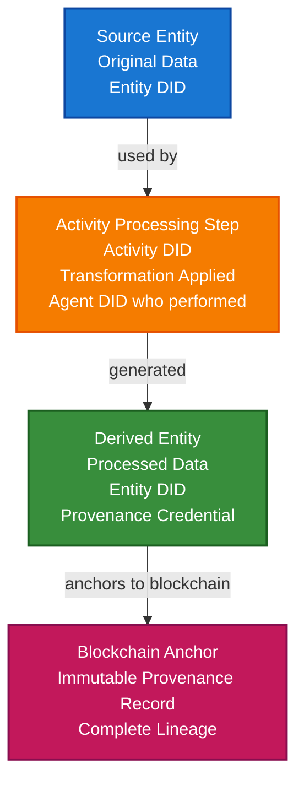

# Digital Workflow & Provenance Scenario

This guide demonstrates how to build a digital workflow provenance system using TrustWeave and PROV-O (Provenance Ontology) to track and verify the provenance of digital information through processing workflows, transformations, and data lineage.

## What You'll Build

By the end of this tutorial, you'll have:

- ✅ Created DIDs for workflow participants (agents, activities, entities)
- ✅ Tracked digital information through processing workflows
- ✅ Built provenance chains using PROV-O concepts
- ✅ Issued provenance credentials for workflow steps
- ✅ Verified data lineage and transformation history
- ✅ Anchored provenance records to blockchain
- ✅ Built complete workflow provenance system

## Big Picture & Significance

### The Digital Provenance Challenge

In digital workflows, information undergoes multiple transformations, processing steps, and handoffs between different agents. Understanding where data came from, how it was processed, and who handled it is critical for trust, compliance, and debugging.

**Industry Context**:
- **Market Size**: Data lineage and provenance market projected to reach $2.1 billion by 2027
- **Regulatory Pressure**: Increasing requirements for data provenance (GDPR, data governance)
- **Trust Issues**: Need to verify data hasn't been tampered with
- **Compliance**: Audit trails required for regulatory compliance
- **Debugging**: Provenance helps debug data quality issues

**Why This Matters**:
1. **Data Trust**: Verify data hasn't been tampered with
2. **Compliance**: Meet regulatory requirements for data lineage
3. **Debugging**: Trace data issues to their source
4. **Accountability**: Know who processed data and when
5. **Reproducibility**: Reproduce data processing workflows
6. **Transparency**: Understand data transformations

### The Provenance Problem

Traditional systems struggle with provenance because:
- **No Standard Format**: Each system tracks provenance differently
- **Data Silos**: Provenance information is scattered
- **No Verification**: Can't verify provenance claims
- **Incomplete Records**: Missing information about transformations
- **No Interoperability**: Can't share provenance across systems

## Value Proposition

### Problems Solved

1. **Standard Provenance**: PROV-O standard format for interoperability
2. **Verifiable Provenance**: Cryptographic proof of provenance claims
3. **Complete Lineage**: Track data through all transformations
4. **Interoperability**: Standard format works across systems
5. **Compliance**: Automated audit trails for regulatory requirements
6. **Trust**: Verify data hasn't been tampered with
7. **Reproducibility**: Reproduce data processing workflows

### Business Benefits

**For Organizations**:
- **Compliance**: Meet regulatory requirements
- **Trust**: Build trust in data quality
- **Debugging**: Faster issue resolution
- **Accountability**: Clear responsibility tracking

**For Data Scientists**:
- **Reproducibility**: Reproduce workflows
- **Transparency**: Understand data transformations
- **Collaboration**: Share workflows easily

**For Regulators**:
- **Audit Trails**: Complete data lineage
- **Verification**: Verify provenance claims
- **Transparency**: Understand data processing

### ROI Considerations

- **Compliance**: Automated compliance reduces costs by 50%
- **Debugging**: Faster issue resolution saves time
- **Trust**: Increased data trust enables new use cases
- **Reproducibility**: Enables collaboration and knowledge sharing

## Understanding the Problem

Digital workflow provenance faces several critical challenges:

1. **Data Lineage**: Track data through multiple transformations
2. **Agent Tracking**: Know which agents processed data
3. **Transformation History**: Understand what transformations were applied
4. **Verification**: Verify provenance claims
5. **Interoperability**: Share provenance across systems
6. **Completeness**: Ensure complete provenance records

### Real-World Pain Points

**Example 1: Image Processing Pipeline**
- Current: No way to track image through processing steps
- Problem: Can't verify image authenticity or processing history
- Solution: Verifiable provenance credentials for each processing step

**Example 2: Data Science Workflow**
- Current: No provenance tracking for data transformations
- Problem: Can't reproduce results or debug issues
- Solution: Complete provenance chain with verifiable credentials

**Example 3: Content Creation**
- Current: No way to prove content creation process
- Problem: Can't verify content authenticity or authorship
- Solution: Provenance credentials tracking creation workflow

## How It Works: Provenance Flow



## Key Concepts

### PROV-O Concepts

1. **Entity**: A digital object (e.g., image, dataset, document)
2. **Activity**: A processing step or transformation
3. **Agent**: Who or what performed the activity
4. **Used**: Relationship showing entity was used by activity
5. **Generated**: Relationship showing activity generated entity
6. **WasAttributedTo**: Relationship showing entity was attributed to agent

### Provenance Credential Types

1. **Entity Credential**: Describes a digital entity
2. **Activity Credential**: Describes a processing activity
3. **Provenance Chain Credential**: Links entities through activities
4. **Transformation Credential**: Describes data transformation

## Prerequisites

- Java 21+
- Kotlin 2.2.0+
- Gradle 8.5+
- Basic understanding of Kotlin and coroutines
- Familiarity with PROV-O concepts (helpful but not required)

## Step 1: Add Dependencies

Add TrustWeave dependencies to your `build.gradle.kts`. These modules provide DID support, credential issuance, wallet storage, and the in-memory services used to model provenance workflows.

```kotlin
dependencies {
    // Core TrustWeave modules
    implementation("com.trustweave:trustweave-core:1.0.0-SNAPSHOT")
    implementation("com.trustweave:trustweave-json:1.0.0-SNAPSHOT")
    implementation("com.trustweave:trustweave-kms:1.0.0-SNAPSHOT")
    implementation("com.trustweave:trustweave-did:1.0.0-SNAPSHOT")
    implementation("com.trustweave:trustweave-anchor:1.0.0-SNAPSHOT")

    // Test kit for in-memory implementations
    implementation("com.trustweave:trustweave-testkit:1.0.0-SNAPSHOT")

    // Kotlinx Serialization
    implementation("org.jetbrains.kotlinx:kotlinx-serialization-json:1.6.0")

    // Coroutines
    implementation("org.jetbrains.kotlinx:kotlinx-coroutines-core:1.7.3")
}
```

**Result:** With the dependencies synced, you can run the provenance walkthrough without wiring additional adapters.

## Step 2: Setup and Create Entity DIDs

**Purpose**: Initialize the provenance system and create DIDs for workflow entities.

**Why This Matters**: In PROV-O, everything is an entity, activity, or agent. Each needs a unique DID for verifiable identity. This enables tracking relationships between entities through activities.

**Rationale**:
- **Entity DIDs**: Represent digital objects (images, datasets, documents)
- **Activity DIDs**: Represent processing steps (transformations, analyses)
- **Agent DIDs**: Represent who/what performed activities
- **Separation**: Clear separation enables precise provenance tracking

```kotlin
import com.trustweave.testkit.did.DidKeyMockMethod
import com.trustweave.testkit.kms.InMemoryKeyManagementService
import com.trustweave.did.DidMethodRegistry
import kotlinx.coroutines.runBlocking

fun main() = runBlocking {
    println("=== Digital Workflow & Provenance Scenario ===\n")

    // Step 1: Setup services
    println("Step 1: Setting up services...")

    // Separate KMS for different workflow participants
    // This ensures proper key isolation and security
    val processorKms = InMemoryKeyManagementService() // For processing agents
    val sourceKms = InMemoryKeyManagementService()   // For source entities

    val didMethod = DidKeyMockMethod(processorKms)
    val didRegistry = DidMethodRegistry().apply { register(didMethod) }

    println("Services initialized")
}
```

## Step 3: Create Source Entity DID

**Purpose**: Create DID for the original source entity (e.g., original image).

**Why This Matters**: The source entity is the starting point of the provenance chain. Its DID provides a persistent identifier that can be referenced throughout the workflow.

**Rationale**:
- **Source Entity**: Represents original, unprocessed data
- **Entity DID**: Provides persistent identifier
- **Provenance Start**: Beginning of provenance chain
- **Verification**: Can verify entity hasn't been tampered with

```kotlin
    // Step 2: Create source entity DID
    println("\nStep 2: Creating source entity DID...")

    // Source entity represents original data before any processing
    // In image processing example, this would be the original photograph
    // The DID provides persistent identity that survives transformations
    val sourceEntityDid = didMethod.createDid()
    println("Source Entity DID: ${sourceEntityDid.id}")

    // Create entity credential for source
    // This credential describes the original entity
    val sourceEntityCredential = createEntityCredential(
        entityDid = sourceEntityDid.id,
        entityType = "Image",
        entityHash = "sha256:original-image-hash",
        metadata = mapOf(
            "format" to "JPEG",
            "resolution" to "1920x1080",
            "created" to Instant.now().toString()
        )
    )

    println("Source entity credential created:")
    println("  - Type: Image")
    println("  - Format: JPEG")
    println("  - Resolution: 1920x1080")
```

## Step 4: Create Activity and Agent DIDs

**Purpose**: Create DIDs for processing activity and the agent performing it.

**Why This Matters**: PROV-O requires tracking who (agent) did what (activity) to which entities. These DIDs enable verifiable provenance relationships.

**Rationale**:
- **Activity DID**: Represents the processing step (e.g., "image-resize")
- **Agent DID**: Represents who/what performed it (e.g., processing service)
- **Relationship Tracking**: DIDs enable tracking relationships
- **Verification**: Can verify who did what and when

```kotlin
    // Step 3: Create activity and agent DIDs
    println("\nStep 3: Creating activity and agent DIDs...")

    // Activity DID represents a processing step
    // In PROV-O, activities are things that happen and transform entities
    // Example: "resize-image", "apply-filter", "crop-image"
    val resizeActivityDid = didMethod.createDid()
    println("Activity (Resize) DID: ${resizeActivityDid.id}")

    // Agent DID represents who or what performed the activity
    // This could be a person, software service, or automated system
    // Example: "image-processing-service", "user-alice"
    val processingAgentDid = didMethod.createDid()
    println("Agent (Image Processor) DID: ${processingAgentDid.id}")
```

## Step 5: Create Activity Credential

**Purpose**: Create credential describing the processing activity.

**Why This Matters**: The activity credential records what transformation was applied. This is critical for reproducibility - you need to know exactly what was done to the data.

**Rationale**:
- **Activity Description**: What processing was performed
- **Parameters**: How the processing was configured
- **Timing**: When the activity occurred
- **Agent Reference**: Who/what performed it

```kotlin
import com.trustweave.credential.models.VerifiableCredential
import kotlinx.serialization.json.buildJsonObject
import kotlinx.serialization.json.put
import java.time.Instant

    // Step 4: Create activity credential
    println("\nStep 4: Creating activity credential...")

    // Activity credential describes the processing step
    // This follows PROV-O "Activity" concept
    // Records what transformation was applied and how
    val resizeActivityCredential = VerifiableCredential(
        id = "https://processor.example.com/activities/${resizeActivityDid.id.substringAfterLast(":")}",
        type = listOf("VerifiableCredential", "ActivityCredential", "ProvenanceCredential"),
        issuer = processingAgentDid.id, // Agent issues credential about activity they performed
        credentialSubject = buildJsonObject {
            put("id", resizeActivityDid.id)
            put("activity", buildJsonObject {
                put("activityType", "resize-image")
                put("description", "Resize image to target dimensions")
                put("parameters", buildJsonObject {
                    put("targetWidth", "800")
                    put("targetHeight", "600")
                    put("algorithm", "lanczos")
                    put("maintainAspectRatio", "true")
                })
                put("startTime", Instant.now().toString())
                put("endTime", Instant.now().plusSeconds(5).toString())
                put("agentDid", processingAgentDid.id)
            })
        },
        issuanceDate = Instant.now().toString(),
        expirationDate = null
    )

    println("Activity credential created:")
    println("  - Type: resize-image")
    println("  - Parameters: 800x600, lanczos algorithm")
    println("  - Agent: ${processingAgentDid.id}")
```

## Step 6: Create Provenance Chain Credential

**Purpose**: Create credential linking source entity to derived entity through activity.

**Why This Matters**: This credential captures the PROV-O relationships: entity was "used" by activity, activity "generated" new entity. This creates the provenance chain.

**Rationale**:
- **Used Relationship**: Source entity was used by activity
- **Generated Relationship**: Activity generated derived entity
- **Chain Continuity**: Links entities through activities
- **Complete Lineage**: Enables full provenance tracking

```kotlin
    // Step 5: Create derived entity DID
    println("\nStep 5: Creating derived entity DID...")

    // Derived entity is the result of processing
    // In PROV-O, activities generate new entities from used entities
    // This entity is the resized image
    val derivedEntityDid = didMethod.createDid()
    println("Derived Entity DID: ${derivedEntityDid.id}")

    // Step 6: Create provenance chain credential
    println("\nStep 6: Creating provenance chain credential...")

    // Provenance chain credential links entities through activities
    // This follows PROV-O relationships:
    // - sourceEntity was "used" by activity
    // - activity "generated" derivedEntity
    // This creates verifiable provenance chain
    val provenanceChainCredential = VerifiableCredential(
        id = "https://processor.example.com/provenance/${sourceEntityDid.id.substringAfterLast(":")}-to-${derivedEntityDid.id.substringAfterLast(":")}",
        type = listOf("VerifiableCredential", "ProvenanceChainCredential", "ProvenanceCredential"),
        issuer = processingAgentDid.id,
        credentialSubject = buildJsonObject {
            put("provenance", buildJsonObject {
                // PROV-O: Entity that was used
                put("usedEntity", buildJsonObject {
                    put("entityDid", sourceEntityDid.id)
                    put("entityHash", "sha256:original-image-hash")
                    put("role", "input")
                })

                // PROV-O: Activity that used the entity
                put("activity", buildJsonObject {
                    put("activityDid", resizeActivityDid.id)
                    put("activityType", "resize-image")
                })

                // PROV-O: Entity that was generated
                put("generatedEntity", buildJsonObject {
                    put("entityDid", derivedEntityDid.id)
                    put("entityHash", "sha256:resized-image-hash")
                    put("role", "output")
                })

                // PROV-O: Agent that performed activity
                put("agent", buildJsonObject {
                    put("agentDid", processingAgentDid.id)
                    put("agentType", "image-processing-service")
                })

                // Timestamp of transformation
                put("timestamp", Instant.now().toString())
            })
        },
        issuanceDate = Instant.now().toString(),
        expirationDate = null
    )

    println("Provenance chain credential created:")
    println("  - Used: ${sourceEntityDid.id}")
    println("  - Activity: resize-image")
    println("  - Generated: ${derivedEntityDid.id}")
```

## Step 7: Issue Credentials with Proof

**Purpose**: Cryptographically sign provenance credentials to make them verifiable.

**Why This Matters**: Cryptographic proof ensures provenance claims cannot be tampered with. This is critical for trust - you need to verify that provenance records are authentic.

**Rationale**:
- **Key Generation**: Generate signing key for processing agent
- **Proof Generation**: Create cryptographic proof
- **Credential Issuance**: Sign credentials with agent's key
- **Verification**: Anyone can verify credentials came from agent

```kotlin
import com.trustweave.credential.issuer.CredentialIssuer
import com.trustweave.credential.proof.Ed25519ProofGenerator
import com.trustweave.credential.proof.ProofGeneratorRegistry
import com.trustweave.credential.CredentialIssuanceOptions

    // Step 7: Issue credentials with proof
    println("\nStep 7: Issuing provenance credentials...")

    // Generate agent's signing key
    // This key will be used to sign all provenance credentials
    // In production, use hardware security module (HSM)
    val agentKey = processorKms.generateKey("Ed25519")

    // Create proof generator for agent
    // Ed25519 provides strong security with good performance
    val agentProofGenerator = Ed25519ProofGenerator(
        signer = { data, keyId -> processorKms.sign(keyId, data) },
        getPublicKeyId = { keyId -> agentKey.id }
    )
    val agentProofRegistry = ProofGeneratorRegistry().apply {
        register(agentProofGenerator)
    }

    // Create credential issuer
    val agentIssuer = CredentialIssuer(
        proofGenerator = agentProofGenerator,
        resolveDid = { did -> didRegistry.resolve(did) != null },
        proofRegistry = agentProofRegistry
    )

    // Issue activity credential
    // This proves the activity was performed by the agent
    val issuedActivityCredential = agentIssuer.issue(
        credential = resizeActivityCredential,
        issuerDid = processingAgentDid.id,
        keyId = agentKey.id,
        options = CredentialIssuanceOptions(proofType = "Ed25519Signature2020")
    )

    // Issue provenance chain credential
    // This proves the provenance relationships are authentic
    val issuedProvenanceChain = agentIssuer.issue(
        credential = provenanceChainCredential,
        issuerDid = processingAgentDid.id,
        keyId = agentKey.id,
        options = CredentialIssuanceOptions(proofType = "Ed25519Signature2020")
    )

    println("Provenance credentials issued:")
    println("  - Activity credential: ${issuedActivityCredential.proof != null}")
    println("  - Provenance chain: ${issuedProvenanceChain.proof != null}")
```

## Step 8: Build Multi-Step Provenance Chain

**Purpose**: Extend provenance chain through multiple processing steps.

**Why This Matters**: Real workflows have multiple steps. Each step generates a new entity and extends the provenance chain. This enables complete lineage tracking.

**Rationale**:
- **Chain Extension**: Each step adds to the chain
- **Entity References**: Each step references previous entity
- **Complete Lineage**: Enables full workflow tracking
- **Verification**: Can verify entire chain

```kotlin
    // Step 8: Build multi-step provenance chain
    println("\nStep 8: Building multi-step provenance chain...")

    // Real workflows have multiple processing steps
    // Each step creates a new entity and extends the provenance chain
    // Example: Original Image → Resize → Apply Filter → Crop → Final Image

    // Step 2: Apply filter to resized image
    val filterActivityDid = didMethod.createDid()
    val filteredEntityDid = didMethod.createDid()

    // Create filter activity credential
    val filterActivityCredential = VerifiableCredential(
        type = listOf("VerifiableCredential", "ActivityCredential", "ProvenanceCredential"),
        issuer = processingAgentDid.id,
        credentialSubject = buildJsonObject {
            put("id", filterActivityDid.id)
            put("activity", buildJsonObject {
                put("activityType", "apply-filter")
                put("parameters", buildJsonObject {
                    put("filterType", "sharpen")
                    put("intensity", "0.5")
                })
                put("agentDid", processingAgentDid.id)
            })
        },
        issuanceDate = Instant.now().toString()
    )

    // Create provenance chain credential linking resized to filtered
    // This extends the provenance chain: original → resized → filtered
    val filterProvenanceChain = VerifiableCredential(
        type = listOf("VerifiableCredential", "ProvenanceChainCredential"),
        issuer = processingAgentDid.id,
        credentialSubject = buildJsonObject {
            put("provenance", buildJsonObject {
                // Previous entity (resized image)
                put("usedEntity", buildJsonObject {
                    put("entityDid", derivedEntityDid.id)
                    put("entityHash", "sha256:resized-image-hash")
                })

                // Current activity (apply filter)
                put("activity", buildJsonObject {
                    put("activityDid", filterActivityDid.id)
                    put("activityType", "apply-filter")
                })

                // Generated entity (filtered image)
                put("generatedEntity", buildJsonObject {
                    put("entityDid", filteredEntityDid.id)
                    put("entityHash", "sha256:filtered-image-hash")
                })

                put("agent", buildJsonObject {
                    put("agentDid", processingAgentDid.id)
                })

                put("timestamp", Instant.now().toString())
            })
        },
        issuanceDate = Instant.now().toString()
    )

    // Issue credentials
    val issuedFilterActivity = agentIssuer.issue(
        credential = filterActivityCredential,
        issuerDid = processingAgentDid.id,
        keyId = agentKey.id,
        options = CredentialIssuanceOptions(proofType = "Ed25519Signature2020")
    )

    val issuedFilterChain = agentIssuer.issue(
        credential = filterProvenanceChain,
        issuerDid = processingAgentDid.id,
        keyId = agentKey.id,
        options = CredentialIssuanceOptions(proofType = "Ed25519Signature2020")
    )

    println("Multi-step provenance chain created:")
    println("  - Step 1: Original → Resized")
    println("  - Step 2: Resized → Filtered")
```

## Step 9: Verify Provenance Chain

**Purpose**: Verify complete provenance chain from source to final entity.

**Why This Matters**: Verification ensures the provenance chain is authentic and complete. This enables trust in the data processing workflow.

**Rationale**:
- **Chain Verification**: Verify each credential in chain
- **Continuity Check**: Verify entities link correctly
- **Agent Verification**: Verify agents are legitimate
- **Completeness**: Ensure no missing steps

```kotlin
import com.trustweave.credential.verifier.CredentialVerifier
import com.trustweave.credential.CredentialVerificationOptions

    // Step 9: Verify provenance chain
    println("\nStep 9: Verifying provenance chain...")

    // Create verifier to check provenance credentials
    val verifier = CredentialVerifier(
        didResolver = CredentialDidResolver { did ->
            didRegistry.resolve(did).toCredentialDidResolution()
        }
    )

    // Verify all credentials in chain
    val provenanceChain = listOf(
        issuedProvenanceChain,
        issuedFilterChain
    )

    var chainValid = true
    provenanceChain.forEachIndexed { index, credential ->
        val verification = verifier.verify(
            credential = credential,
            options = CredentialVerificationOptions(
                checkRevocation = true,
                checkExpiration = false
            )
        )

        if (verification.valid) {
            println("✅ Step ${index + 1} verified")
        } else {
            println("❌ Step ${index + 1} verification failed:")
            verification.errors.forEach { println("  - $it") }
            chainValid = false
        }
    }

    if (chainValid) {
        println("✅ Complete provenance chain verified!")
        println("  - Can trace from source to final entity")
        println("  - All transformations verified")
    }
```

## Step 10: Trace Data Lineage

**Purpose**: Retrieve complete data lineage from source to final entity.

**Why This Matters**: Data lineage enables understanding how data was transformed. This is critical for debugging, compliance, and trust.

**Rationale**:
- **Lineage Retrieval**: Get all steps in workflow
- **Entity Tracking**: Track entities through transformations
- **Activity Tracking**: Track activities performed
- **Agent Tracking**: Track who performed activities

```kotlin
    // Step 10: Trace data lineage
    println("\nStep 10: Tracing data lineage...")

    // Function to trace lineage from final entity back to source
    fun traceLineage(
        finalEntityDid: String,
        provenanceChains: List<VerifiableCredential>
    ): List<LineageStep> {
        val lineage = mutableListOf<LineageStep>()
        var currentEntityDid = finalEntityDid

        // Trace backwards through provenance chain
        while (true) {
            val chainCredential = provenanceChains.find { credential ->
                val generatedEntity = credential.credentialSubject.jsonObject["provenance"]?.jsonObject
                    ?.get("generatedEntity")?.jsonObject
                    ?.get("entityDid")?.jsonPrimitive?.content
                generatedEntity == currentEntityDid
            } ?: break

            val provenance = chainCredential.credentialSubject.jsonObject["provenance"]?.jsonObject
                ?: break

            val usedEntity = provenance["usedEntity"]?.jsonObject
                ?.get("entityDid")?.jsonPrimitive?.content ?: break

            val activity = provenance["activity"]?.jsonObject
                ?.get("activityType")?.jsonPrimitive?.content ?: break

            val agent = provenance["agent"]?.jsonObject
                ?.get("agentDid")?.jsonPrimitive?.content ?: break

            lineage.add(LineageStep(
                entityDid = currentEntityDid,
                activityType = activity,
                agentDid = agent,
                previousEntityDid = usedEntity
            ))

            currentEntityDid = usedEntity
        }

        return lineage.reversed() // Reverse to show source to final
    }

    // Trace lineage from filtered image back to original
    val lineage = traceLineage(
        finalEntityDid = filteredEntityDid.id,
        provenanceChains = provenanceChain
    )

    println("Data lineage traced:")
    lineage.forEachIndexed { index, step ->
        println("  ${index + 1}. ${step.activityType} by ${step.agentDid}")
        println("     Entity: ${step.entityDid}")
    }
}

data class LineageStep(
    val entityDid: String,
    val activityType: String,
    val agentDid: String,
    val previousEntityDid: String
)

fun createEntityCredential(
    entityDid: String,
    entityType: String,
    entityHash: String,
    metadata: Map<String, String>
): VerifiableCredential {
    return VerifiableCredential(
        type = listOf("VerifiableCredential", "EntityCredential", "ProvenanceCredential"),
        issuer = entityDid, // Entity issues its own credential
        credentialSubject = buildJsonObject {
            put("id", entityDid)
            put("entity", buildJsonObject {
                put("entityType", entityType)
                put("entityHash", entityHash)
                metadata.forEach { (key, value) ->
                    put(key, value)
                }
            })
        },
        issuanceDate = Instant.now().toString(),
        expirationDate = null
    )
}
```

## Step 11: Anchor Provenance to Blockchain

**Purpose**: Create immutable record of provenance chain.

**Why This Matters**: Blockchain anchoring provides permanent, tamper-proof record of provenance. This enables long-term audit trails and verification.

**Rationale**:
- **Immutability**: Cannot be tampered with
- **Audit Trail**: Permanent record
- **Verification**: Anyone can verify
- **Non-Repudiation**: Agents cannot deny activities

```kotlin
import com.trustweave.testkit.anchor.InMemoryBlockchainAnchorClient
import com.trustweave.anchor.BlockchainAnchorRegistry
import com.trustweave.anchor.anchorTyped
import kotlinx.serialization.Serializable
import kotlinx.serialization.json.Json

@Serializable
data class ProvenanceRecord(
    val sourceEntityDid: String,
    val finalEntityDid: String,
    val activityCount: Int,
    val provenanceDigest: String,
    val timestamp: String
)

    // Step 11: Anchor provenance to blockchain
    println("\nStep 11: Anchoring provenance to blockchain...")

    // Setup blockchain client
    val anchorClient = InMemoryBlockchainAnchorClient("eip155:1", emptyMap())
    val blockchainRegistry = BlockchainAnchorRegistry().apply {
        register("eip155:1", anchorClient)
    }

    // Compute digest of complete provenance chain
    // This digest uniquely identifies the entire workflow
    val provenanceDigest = com.trustweave.json.DigestUtils.sha256DigestMultibase(
        Json.encodeToJsonElement(
            com.trustweave.credential.models.VerifiableCredential.serializer(),
            issuedProvenanceChain
        )
    )

    // Create provenance record
    val provenanceRecord = ProvenanceRecord(
        sourceEntityDid = sourceEntityDid.id,
        finalEntityDid = filteredEntityDid.id,
        activityCount = 2, // resize + filter
        provenanceDigest = provenanceDigest,
        timestamp = Instant.now().toString()
    )

    // Anchor to blockchain
    val anchorResult = blockchainRegistry.anchorTyped(
        value = provenanceRecord,
        serializer = ProvenanceRecord.serializer(),
        targetChainId = "eip155:137"
    )

    println("Provenance anchored to blockchain:")
    println("  - Transaction hash: ${anchorResult.ref.txHash}")
    println("  - Provides immutable provenance record")
    println("  - Enables long-term audit trail")
```

## Extensive Step-by-Step Breakdown

### Step 1: Setup and Initialization

**Purpose**: Initialize provenance system with proper key management.

**Detailed Explanation**:
1. **Multiple KMS Instances**: Separate key management for processors and sources ensures proper isolation
2. **DID Method Registration**: Register DID method for creating identities
3. **Why Separation Matters**:
   - **Security**: If one system compromised, others remain secure
   - **Accountability**: Clear separation of responsibilities
   - **Scalability**: Each system scales independently

### Step 2: Create Source Entity DID

**Purpose**: Establish identity for original data entity.

**Detailed Explanation**:
- **Source Entity**: Represents original, unprocessed data
- **Entity DID**: Provides persistent identifier
- **Provenance Start**: Beginning of provenance chain
- **Why This Matters**: Source entity is the root of all provenance. Its DID enables tracking all derived entities.

### Step 3: Create Activity and Agent DIDs

**Purpose**: Establish identities for processing activities and agents.

**Detailed Explanation**:
- **Activity DID**: Represents processing step
- **Agent DID**: Represents who/what performed it
- **PROV-O Compliance**: Follows PROV-O ontology structure
- **Why This Matters**: Activities and agents are core PROV-O concepts. Their DIDs enable verifiable provenance relationships.

### Step 4: Create Activity Credential

**Purpose**: Record what processing was performed.

**Detailed Explanation**:
- **Activity Description**: What transformation was applied
- **Parameters**: How transformation was configured
- **Timing**: When activity occurred
- **Why This Matters**: Activity credentials enable reproducibility. You can recreate the exact transformation.

### Step 5: Create Provenance Chain Credential

**Purpose**: Link entities through activities.

**Detailed Explanation**:
- **Used Relationship**: Source entity was used by activity
- **Generated Relationship**: Activity generated derived entity
- **PROV-O Compliance**: Follows PROV-O relationships
- **Why This Matters**: This credential creates the provenance chain. It proves how entities are related.

### Step 6: Issue Credentials with Proof

**Purpose**: Make provenance credentials verifiable.

**Detailed Explanation**:
- **Key Generation**: Generate agent's signing key
- **Proof Generation**: Create cryptographic proof
- **Credential Issuance**: Sign credentials
- **Why This Matters**: Cryptographic proof ensures provenance cannot be tampered with. This is critical for trust.

### Step 7: Build Multi-Step Chain

**Purpose**: Extend provenance through multiple steps.

**Detailed Explanation**:
- **Chain Extension**: Each step adds to chain
- **Entity References**: Each step references previous entity
- **Complete Lineage**: Enables full workflow tracking
- **Why This Matters**: Real workflows have multiple steps. This enables complete provenance tracking.

### Step 8: Verify Provenance Chain

**Purpose**: Ensure provenance chain is authentic.

**Detailed Explanation**:
- **Credential Verification**: Verify each credential
- **Chain Continuity**: Verify entities link correctly
- **Agent Verification**: Verify agents are legitimate
- **Why This Matters**: Verification ensures provenance is trustworthy. This enables trust in data processing.

### Step 9: Trace Data Lineage

**Purpose**: Retrieve complete data lineage.

**Detailed Explanation**:
- **Lineage Retrieval**: Get all steps in workflow
- **Backward Tracing**: Trace from final to source
- **Complete History**: See all transformations
- **Why This Matters**: Lineage enables understanding data transformations. Critical for debugging and compliance.

### Step 10: Anchor to Blockchain

**Purpose**: Create immutable provenance record.

**Detailed Explanation**:
- **Immutability**: Cannot be tampered with
- **Audit Trail**: Permanent record
- **Verification**: Anyone can verify
- **Why This Matters**: Blockchain provides permanent, verifiable record. Critical for long-term audit trails.

## Advanced Features

### Multi-Agent Workflows

Track workflows with multiple agents:

```kotlin
fun createMultiAgentProvenance(
    sourceEntityDid: String,
    intermediateEntityDid: String,
    finalEntityDid: String,
    agent1Did: String,
    agent2Did: String
): List<VerifiableCredential> {
    // Agent 1 performs first step
    val step1Credential = createProvenanceChainCredential(
        usedEntityDid = sourceEntityDid,
        activityDid = "activity-1",
        generatedEntityDid = intermediateEntityDid,
        agentDid = agent1Did
    )

    // Agent 2 performs second step
    val step2Credential = createProvenanceChainCredential(
        usedEntityDid = intermediateEntityDid,
        activityDid = "activity-2",
        generatedEntityDid = finalEntityDid,
        agentDid = agent2Did
    )

    return listOf(step1Credential, step2Credential)
}
```

### Provenance Queries

Query provenance by various criteria:

```kotlin
fun queryProvenanceByAgent(
    agentDid: String,
    provenanceChains: List<VerifiableCredential>
): List<VerifiableCredential> {
    return provenanceChains.filter { credential ->
        val agent = credential.credentialSubject.jsonObject["provenance"]?.jsonObject
            ?.get("agent")?.jsonObject
            ?.get("agentDid")?.jsonPrimitive?.content
        agent == agentDid
    }
}

fun queryProvenanceByActivityType(
    activityType: String,
    provenanceChains: List<VerifiableCredential>
): List<VerifiableCredential> {
    return provenanceChains.filter { credential ->
        val activity = credential.credentialSubject.jsonObject["provenance"]?.jsonObject
            ?.get("activity")?.jsonObject
            ?.get("activityType")?.jsonPrimitive?.content
        activity == activityType
    }
}
```

## Real-World Use Cases

### 1. Image Processing Pipeline

**Scenario**: Track image through multiple processing steps.

**Implementation**:

```kotlin
fun createImageProcessingProvenance(
    originalImageDid: String,
    processingSteps: List<ProcessingStep>
): List<VerifiableCredential> {
    var currentEntityDid = originalImageDid
    val provenanceChains = mutableListOf<VerifiableCredential>()

    processingSteps.forEach { step ->
        val activityDid = step.activityDid
        val outputEntityDid = step.outputEntityDid

        val chainCredential = createProvenanceChainCredential(
            usedEntityDid = currentEntityDid,
            activityDid = activityDid,
            generatedEntityDid = outputEntityDid,
            agentDid = step.agentDid
        )

        provenanceChains.add(chainCredential)
        currentEntityDid = outputEntityDid
    }

    return provenanceChains
}

data class ProcessingStep(
    val activityDid: String,
    val outputEntityDid: String,
    val agentDid: String
)
```

### 2. Data Science Workflow

**Scenario**: Track data through data science pipeline.

**Implementation**:

```kotlin
fun createDataScienceProvenance(
    rawDataDid: String,
    transformations: List<DataTransformation>
): List<VerifiableCredential> {
    var currentDataDid = rawDataDid
    val provenanceChains = mutableListOf<VerifiableCredential>()

    transformations.forEach { transformation ->
        val outputDataDid = transformation.outputDataDid

        val chainCredential = VerifiableCredential(
            type = listOf("VerifiableCredential", "ProvenanceChainCredential"),
            issuer = transformation.analystDid,
            credentialSubject = buildJsonObject {
                put("provenance", buildJsonObject {
                    put("usedEntity", buildJsonObject {
                        put("entityDid", currentDataDid)
                    })
                    put("activity", buildJsonObject {
                        put("activityDid", transformation.transformationDid)
                        put("activityType", transformation.type)
                        put("parameters", transformation.parameters)
                    })
                    put("generatedEntity", buildJsonObject {
                        put("entityDid", outputDataDid)
                    })
                    put("agent", buildJsonObject {
                        put("agentDid", transformation.analystDid)
                    })
                })
            },
            issuanceDate = Instant.now().toString()
        )

        provenanceChains.add(chainCredential)
        currentDataDid = outputDataDid
    }

    return provenanceChains
}

data class DataTransformation(
    val transformationDid: String,
    val type: String,
    val parameters: Map<String, String>,
    val outputDataDid: String,
    val analystDid: String
)
```

## Benefits

1. **Standard Provenance**: PROV-O standard format
2. **Verifiable Provenance**: Cryptographic proof
3. **Complete Lineage**: Track all transformations
4. **Interoperability**: Works across systems
5. **Compliance**: Automated audit trails
6. **Reproducibility**: Reproduce workflows
7. **Trust**: Verify data processing
8. **Debugging**: Trace issues to source
9. **Accountability**: Know who did what
10. **Transparency**: Understand transformations

## Best Practices

1. **PROV-O Compliance**: Follow PROV-O ontology
2. **Complete Records**: Record all processing steps
3. **Entity References**: Always reference entity DIDs
4. **Activity Details**: Record activity parameters
5. **Agent Tracking**: Track who performed activities
6. **Timestamps**: Record when activities occurred
7. **Chain Verification**: Verify entire chain
8. **Blockchain Anchoring**: Anchor critical provenance
9. **Error Handling**: Handle verification failures
10. **Documentation**: Document workflow steps

## Next Steps

- Learn about [Earth Observation Scenario](earth-observation-scenario.md) for related integrity concepts
- Explore [News Industry Scenario](news-industry-scenario.md) for content provenance
- Check out [Supply Chain & Traceability Scenario](supply-chain-traceability-scenario.md) for related tracking
- Review [Core Concepts: Blockchain Anchoring](../core-concepts/blockchain-anchoring.md) for anchoring details


