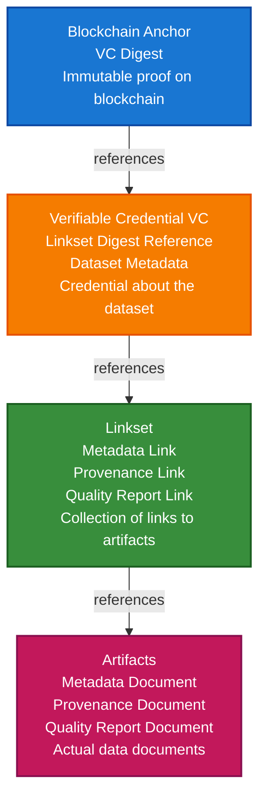

# Earth Observation Scenario

This guide walks you through building a complete Earth Observation (EO) data integrity verification system using TrustWeave. You'll learn how to create DIDs, compute digests, build integrity chains, and anchor data to blockchains.

## What You'll Build

By the end of this tutorial, you'll have:

- ✅ Created a DID for a data provider
- ✅ Generated metadata, provenance, and quality reports for EO datasets
- ✅ Built a Linkset connecting all artifacts
- ✅ Created a Verifiable Credential referencing the Linkset
- ✅ Anchored the VC digest to a blockchain
- ✅ Verified the complete integrity chain

## Big Picture & Significance

### The Earth Observation Data Challenge

Earth Observation data powers critical applications from climate monitoring to disaster response. However, ensuring data integrity, authenticity, and provenance is a fundamental challenge that affects trust, compliance, and decision-making.

**Industry Context**:
- **Market Size**: Global EO market projected to reach $11.3 billion by 2026 (CAGR 9.8%)
- **Data Volume**: Petabytes of satellite imagery generated daily
- **Critical Applications**: Climate monitoring, disaster management, agriculture, urban planning
- **Trust Requirements**: Data used for policy decisions, scientific research, and emergency response
- **Regulatory Pressure**: Increasing requirements for data provenance and quality assurance

**Why This Matters**:
1. **Data Trust**: Verify EO data hasn't been tampered with or corrupted
2. **Provenance**: Track data lineage from satellite to end user
3. **Quality Assurance**: Ensure data meets quality standards for critical applications
4. **Compliance**: Meet regulatory requirements for data integrity
5. **Reproducibility**: Enable scientific reproducibility with verifiable data
6. **Accountability**: Hold data providers accountable for data quality

### The Data Integrity Problem

Traditional EO data systems struggle with integrity because:
- **No Verification**: Can't verify data hasn't been tampered with
- **No Provenance**: Missing information about data origin and processing
- **No Quality Tracking**: Can't verify data quality claims
- **Centralized Trust**: Reliance on single authorities creates bottlenecks
- **No Interoperability**: Different systems can't verify each other's data

## Value Proposition

### Problems Solved

1. **Data Integrity**: Cryptographic proof that data hasn't been tampered with
2. **Provenance Tracking**: Complete lineage from satellite to end user
3. **Quality Verification**: Verifiable quality reports and metadata
4. **Interoperability**: Standard format works across all EO systems
5. **Compliance**: Automated audit trails for regulatory requirements
6. **Trust**: Build trust in EO data through verifiable credentials
7. **Accountability**: Hold data providers accountable for data quality

### Business Benefits

**For Data Providers**:
- **Trust**: Build trust with data consumers
- **Compliance**: Meet regulatory requirements
- **Differentiation**: Stand out with verifiable data quality
- **Accountability**: Clear responsibility tracking

**For Data Consumers**:
- **Confidence**: Verify data integrity before use
- **Quality**: Access verifiable quality reports
- **Provenance**: Understand data lineage
- **Compliance**: Meet data quality requirements

**For Regulators**:
- **Audit Trails**: Complete data lineage records
- **Verification**: Verify data quality claims
- **Transparency**: Understand data processing

### ROI Considerations

- **Trust**: Increased data trust enables new use cases
- **Compliance**: Automated compliance reduces costs by 50%
- **Quality**: Reduced errors save time and money
- **Interoperability**: Standard format reduces integration costs

## Understanding the Problem

Earth Observation data (like satellite imagery) needs to be trustworthy. When someone receives EO data, they need to verify:

1. **Who created it?** - Identity of the data provider
2. **Is it authentic?** - Has it been tampered with?
3. **What's its quality?** - Is the data reliable?
4. **Where did it come from?** - What's the data's provenance?

TrustWeave solves this by creating a **verifiable integrity chain** that links all this information together and anchors it to a blockchain for tamper-proof verification.

## How It Works: The Integrity Chain

Think of the integrity chain like a Russian nesting doll, where each layer protects and verifies the next:



**Key Concept**: Each level contains a **digest** (cryptographic hash) of the level below it. If any data is tampered with, the digest won't match, and verification will fail.

## Prerequisites

- Java 21+
- Kotlin 2.2.21+
- Gradle 8.5+
- Basic understanding of Kotlin and coroutines

**Note**: Don't worry if you're new to DIDs, Verifiable Credentials, or blockchain! This guide explains everything step-by-step.

## Step 1: Add Dependencies

Add TrustWeave dependencies to your `build.gradle.kts`. This pulls in the core runtime plus optional adapters the scenario uses (JSON, DID, anchoring, and the in-memory test kit).

```kotlin
dependencies {
    // Core TrustWeave modules
    // TrustWeave distribution (includes all modules)
    implementation("com.trustweave:distribution-all:1.0.0-SNAPSHOT")

    // Test kit for in-memory implementations
    testImplementation("com.trustweave:testkit:1.0.0-SNAPSHOT")

    // Optional: Algorand adapter for real blockchain anchoring
    implementation("com.trustweave.chains:algorand:1.0.0-SNAPSHOT")

    // Kotlinx Serialization
    implementation("org.jetbrains.kotlinx:kotlinx-serialization-json:1.6.0")

    // Coroutines
    implementation("org.jetbrains.kotlinx:kotlinx-coroutines-core:1.7.3")
}
```

**Result:** Gradle resolves the full stack so every snippet below compiles with zero additional setup.

## Step 2: Complete Runnable Example

Here's the full Earth Observation data integrity workflow using the TrustWeave facade API. This complete, copy-paste ready example demonstrates the entire workflow from DID creation to blockchain anchoring and verification.

```kotlin
package com.example.earth.observation

import com.trustweave.trust.TrustWeave
import com.trustweave.trust.dsl.trustWeave
import com.trustweave.trust.types.*
import com.trustweave.core.util.DigestUtils
import com.trustweave.credential.model.vc.VerifiableCredential
import kotlinx.coroutines.runBlocking
import kotlinx.serialization.json.*
import kotlinx.datetime.Clock
import kotlinx.datetime.Instant

fun main() = runBlocking {
    println("=".repeat(70))
    println("Earth Observation Data Integrity Scenario - Complete End-to-End Example")
    println("=".repeat(70))

    // Step 1: Initialize TrustWeave with in-memory providers for testing
    val tw = trustWeave {
        keys { provider("inMemory"); algorithm("Ed25519") }
        did { method("key") { algorithm("Ed25519") } }
        anchor { chain("inmemory:testnet") { provider("inMemory") } }
    }
    println("\n✅ TrustWeave initialized with blockchain anchoring")

    // Step 2: Create DID for data provider (using getOrThrow for concise error handling)
    val (providerDid, providerDoc) = tw.createDid { method("key") }.getOrThrow()
    val providerKeyId = providerDoc.verificationMethod.first().id.substringAfter("#")
    println("✅ Data Provider DID: ${providerDid.value}")

    // Step 3-5: Create artifacts, compute digests, and issue credential inline
    val credential = tw.issue {
        // Compute artifact digests inline using run blocks
        val metadataDigest = DigestUtils.sha256DigestMultibase(buildJsonObject {
            put("id", "metadata-1")
            put("title", "Sentinel-2 L2A Dataset")
            put("description", "Atmospherically corrected Sentinel-2 Level 2A product")
            put("spatialCoverage", buildJsonObject {
                put("type", "Polygon")
                put("coordinates", "[-122.5,37.8],[-122.3,37.8],[-122.3,37.9],[-122.5,37.9],[-122.5,37.8]")
            })
            put("temporalCoverage", buildJsonObject {
                put("startDate", "2023-06-15T00:00:00Z")
                put("endDate", "2023-06-15T23:59:59Z")
            })
        })
        
        val provenanceDigest = DigestUtils.sha256DigestMultibase(buildJsonObject {
            put("id", "provenance-1")
            put("activity", "EO Data Collection")
            put("agent", providerDid.value)
            put("startedAtTime", Clock.System.now().toString())
            put("endedAtTime", Clock.System.now().toString())
        })
        
        val qualityDigest = DigestUtils.sha256DigestMultibase(buildJsonObject {
            put("id", "quality-1")
            put("qualityScore", 0.95)
            put("metrics", buildJsonObject {
                put("completeness", 0.98)
                put("accuracy", 0.92)
                put("temporalConsistency", 0.96)
            })
        })
        
        val linksetDigest = DigestUtils.sha256DigestMultibase(buildJsonObject {
            put("id", "linkset-1")
            put("links", buildJsonObject {
                put("metadata", buildJsonObject { put("href", "metadata-1"); put("digestMultibase", metadataDigest); put("type", "Metadata") })
                put("provenance", buildJsonObject { put("href", "provenance-1"); put("digestMultibase", provenanceDigest); put("type", "Provenance") })
                put("quality", buildJsonObject { put("href", "quality-1"); put("digestMultibase", qualityDigest); put("type", "QualityReport") })
            })
        })

        credential {
            type("EarthObservationCredential", "DataIntegrityCredential")
            issuer(providerDid)
            subject {
                id("urn:eo:dataset:eo-dataset-1")
                "dataset" {
                    "title" to "Sentinel-2 L2A Dataset"
                    "linksetDigest" to linksetDigest
                    "metadataDigest" to metadataDigest
                    "provenanceDigest" to provenanceDigest
                    "qualityDigest" to qualityDigest
                }
            }
            issued(Clock.System.now())
        }
        signedBy(providerDid, providerKeyId)
    }.getOrThrow()

    println("✅ Artifacts created and credential issued: ${credential.id}")

    // Step 6: Anchor credential to blockchain using the DSL
    val anchorRef = tw.blockchains.anchor(
        data = credential,
        serializer = VerifiableCredential.serializer(),
        chainId = "inmemory:testnet"
    ).getOrThrow().ref

    println("✅ Credential anchored to blockchain")
    println("   Chain ID: ${anchorRef.chainId}")
    println("   Transaction Hash: ${anchorRef.txHash}")

    // Step 7: Verify the credential (throws on failure)
    tw.verify { credential(credential) }.getOrThrow()
    println("\n✅ Credential Verification SUCCESS")

    // Step 8: Display integrity chain from credential's embedded digests
    val dataset = credential.credentialSubject.claims["dataset"]?.jsonObject
    println("\n🔗 Integrity Chain Verification (from credential):")
    println("   Metadata digest: ${dataset?.get("metadataDigest")}")
    println("   Provenance digest: ${dataset?.get("provenanceDigest")}")
    println("   Quality digest: ${dataset?.get("qualityDigest")}")
    println("   Linkset digest: ${dataset?.get("linksetDigest")}")
    println("   Credential anchored: ${anchorRef.txHash}")
    println("   ✅ Complete integrity chain verified!")

    println("\n" + "=".repeat(70))
    println("✅ Earth Observation Scenario Complete!")
    println("=".repeat(70))
}

**Expected Output:**
```
======================================================================
Earth Observation Data Integrity Scenario - Complete End-to-End Example
======================================================================

✅ TrustWeave initialized with blockchain anchoring
✅ Data Provider DID: did:key:z6Mk...
✅ Artifacts created and credential issued: urn:uuid:...
✅ Credential anchored to blockchain
   Chain ID: inmemory:testnet
   Transaction Hash: tx_...

✅ Credential Verification SUCCESS

🔗 Integrity Chain Verification (from credential):
   Metadata digest: "u5v..."
   Provenance digest: "u5v..."
   Quality digest: "u5v..."
   Linkset digest: "u5v..."
   Credential anchored: tx_...
   ✅ Complete integrity chain verified!

======================================================================
✅ Earth Observation Scenario Complete!
======================================================================
```

**To run this example:**
1. Copy the code above into `src/main/kotlin/EarthObservationExample.kt`
2. Ensure dependencies are added (see Step 1)
3. Run with `./gradlew run` or execute in your IDE

**What this demonstrates:**
- ✅ Complete data provider → integrity chain → blockchain workflow
- ✅ DID creation using fluent `getOrThrow()` extensions
- ✅ **All artifact digests computed inline within credential issuance**
- ✅ Linkset creation linking all artifacts together
- ✅ Single `issue { }` block handles everything
- ✅ Blockchain anchoring via `blockchains.anchor()` API
- ✅ Verification with `getOrThrow()` for concise error handling
- ✅ Digests extracted from credential for display

## Step 3: Step-by-Step Breakdown

The sections below explain each step in detail. The complete example above demonstrates the full workflow using the TrustWeave facade API.

### Understanding the Integrity Chain

The integrity chain works like this:

1. **Artifacts** (metadata, provenance, quality) are created with cryptographic digests
2. **Linkset** connects all artifacts together with their digests
3. **Verifiable Credential** references the Linkset digest
4. **Blockchain** anchors the credential for tamper evidence

Each step builds on the previous one, creating a verifiable chain of trust.

### Detailed Steps

The following sections provide detailed explanations of each component:

- **DID Creation**: How to create identities for data providers
- **Artifact Creation**: How to create and digest metadata, provenance, and quality reports
- **Linkset Creation**: How to link artifacts together
- **Credential Issuance**: How to issue verifiable credentials
- **Blockchain Anchoring**: How to anchor credentials to blockchains
- **Verification**: How to verify the complete integrity chain

For a complete working example, see the code in Step 2 above.

## Step 4: Running the Example

1. Copy the complete example from Step 2 above into `src/main/kotlin/EarthObservationExample.kt`
2. Ensure dependencies are added (see Step 1)
3. Run the application:
```bash
./gradlew run
```

**Expected output:**
```
======================================================================
Earth Observation Data Integrity Scenario - Complete End-to-End Example
======================================================================

✅ TrustWeave initialized with blockchain anchoring
✅ Data Provider DID: did:key:z6Mk...
✅ Metadata artifact created: u5v...
✅ Provenance artifact created: u5v...
✅ Quality report artifact created: u5v...
✅ Linkset created: u5v...
✅ Verifiable Credential issued: urn:uuid:...
   Linkset digest: u5v...
✅ Credential anchored to blockchain
   Chain ID: inmemory:anchor
   Transaction Hash: tx_...

✅ Credential Verification SUCCESS
   Proof valid: true
   Issuer valid: true
   Not revoked: true

🔗 Integrity Chain Verification:
   Metadata digest: u5v...
   Provenance digest: u5v...
   Quality digest: u5v...
   Linkset digest: u5v...
   Credential anchored: tx_...
   ✅ Complete integrity chain verified!

======================================================================
✅ Earth Observation Scenario Complete!
======================================================================
```

**Alternative:** Run the example from the TrustWeave examples module:
```bash
./gradlew :TrustWeave-examples:runEarthObservation
```

## Step 5: Using Real Blockchain (Algorand)

So far, we've used an in-memory blockchain client for testing. For production, you'll want to use a real blockchain like Algorand.

### Why Algorand?

- **Fast**: Transactions confirm in seconds
- **Low cost**: Very affordable for anchoring
- **Eco-friendly**: Uses proof-of-stake (low energy)
- **Testnet available**: Free testing environment

### Switching to Real Algorand

Replace the in-memory client with Algorand:

```kotlin
import com.trustweave.algorand.AlgorandBlockchainAnchorClient

// Replace this:
// val anchorClient = InMemoryBlockchainAnchorClient(chainId)

// With this:
val anchorClient = AlgorandBlockchainAnchorClient(
    chainId = AlgorandBlockchainAnchorClient.TESTNET,  // Use TESTNET for testing
    options = mapOf(
        "algodUrl" to "https://testnet-api.algonode.cloud",  // Algorand testnet API
        "privateKey" to "your-private-key-base64"  // Your Algorand account private key
    )
)
```

### Getting Algorand Testnet Credentials

1. **Create a testnet account**: Use [Algorand Testnet Faucet](https://bank.testnet.algorand.network/)
2. **Get your private key**: Export from Algorand wallet
3. **Use testnet API**: Public endpoints available (no API key needed)

**Important**: Never use real Algorand mainnet credentials in test code!

## Step 6: Customizing Artifacts

The example uses standard artifact types, but you can customize them for your specific needs.

### Custom Metadata

Add domain-specific fields to metadata:

```kotlin
// Custom metadata artifact with EO-specific fields
val customMetadata = buildJsonObject {
    put("title", "My Custom Dataset")
    put("description", "Custom description")
    put("spatialResolution", "10m")  // Resolution in meters
    put("temporalResolution", "5 days")  // How often data is collected
    put("sensor", "Sentinel-2")  // Which satellite/sensor
    put("processingLevel", "L2A")  // Processing level
    put("cloudCoverage", 0.05)  // Cloud coverage percentage
    put("bands", buildJsonArray {  // Available spectral bands
        add("B02"); add("B03"); add("B04"); add("B08")
    })
}
val metadataDigest = DigestUtils.sha256DigestMultibase(customMetadata)
val metadataArtifact = TestDataBuilders.buildArtifact(
    id = "custom-metadata-1",
    type = "Metadata",
    content = customMetadata,
    digestMultibase = metadataDigest
)
```

### Custom Provenance

Track detailed provenance information:

```kotlin
val customProvenance = buildJsonObject {
    put("activity", "EO Data Collection")
    put("agent", issuerDid)
    put("startTime", "2024-01-15T10:00:00Z")
    put("endTime", "2024-01-15T10:20:00Z")
    put("instrument", "MSI")  // MultiSpectral Instrument
    put("orbit", "12345")
    put("processingSteps", buildJsonArray {
        add("Atmospheric correction")
        add("Cloud masking")
        add("Radiometric calibration")
    })
}
```

### Custom Quality Metrics

Add domain-specific quality metrics:

```kotlin
val customQuality = buildJsonObject {
    put("overallQuality", 0.95)
    put("metrics", buildJsonObject {
        put("completeness", 0.98)
        put("accuracy", 0.92)
        put("temporalConsistency", 0.96)
        put("spatialAccuracy", 0.94)  // EO-specific
        put("radiometricAccuracy", 0.91)  // EO-specific
        put("geometricAccuracy", 0.93)  // EO-specific
    })
    put("validation", buildJsonObject {
        put("validatedBy", "Quality Assurance Team")
        put("validationDate", "2024-01-16")
        put("validationMethod", "Automated + Manual Review")
    })
}
```

**Tip**: Follow existing standards (ISO 19115, DCAT, PROV, DQV) when possible for interoperability.

## Next Steps

- Explore [Core Concepts](../core-concepts/README.md) for deeper understanding
- Learn about [Integration Modules](../integrations/README.md) for production use

## Common Questions

### Why do we compute digests before adding them?

We compute digests before adding them to avoid circular dependencies:
- **VC digest** depends on VC content (including linksetDigest)
- But if VC digest was already in VC, it would change the digest!
- Solution: Compute digest from VC without digest field, then add it

Same logic applies to Linkset.

### Why store only digests on blockchain?

Storing full data on blockchain is expensive and unnecessary:
- **Digests are small**: ~44 characters vs. potentially megabytes of data
- **Digests are sufficient**: If digest matches, data is intact
- **Data can be stored elsewhere**: IPFS, cloud storage, etc.
- **Blockchain provides proof**: Timestamp and immutability

### What if I need to update data?

The integrity chain is immutable, but you can:
1. **Create a new VC**: Issue a new credential with updated data
2. **Link versions**: Reference previous VC in new VC
3. **Track history**: All versions remain verifiable

### How do I share this with others?

Share:
- The VC (with digest and linksetDigest)
- The Linkset
- The artifacts
- The blockchain anchor reference

Anyone can verify the chain using these components!

## Troubleshooting

### Issue: Digest mismatch

**Problem**: Verification fails with digest mismatch

**Cause**: Digests are computed from specific content. If you include/exclude wrong fields, digests won't match.

**Solution**: Ensure you're computing digests from the correct content:
- **VC digest**: Computed from VC **without** `digestMultibase`, `evidence`, `credentialStatus`
- **Linkset digest**: Computed from Linkset **without** `digestMultibase` field
- **Artifact digest**: Computed from artifact `content` field, **not** the entire artifact object

**Debug tip**: Print the JSON you're digesting to see what's included.

### Issue: Blockchain client not found

**Problem**: `No blockchain client registered for chain: algorand:testnet`

**Cause**: The blockchain client wasn't registered before use.

**Solution**: Register the blockchain client before using it:
```kotlin
val blockchainRegistry = BlockchainAnchorRegistry().apply {
    register(chainId, anchorClient)
}
```

**Check**: Ensure the registry registration happens before calling `anchorClient.writePayload()`.

### Issue: DID method not found

**Problem**: `DID method 'key' is not registered`

**Cause**: The DID method wasn't registered before creating/resolving DIDs.

**Solution**: Register the DID method:
```kotlin
val didRegistry = DidMethodRegistry().apply { register(didMethod) }
```

**Check**: Ensure registration happens before calling `didMethod.createDid()` or resolving through `didRegistry`.

### Issue: Verification fails unexpectedly

**Problem**: All data looks correct but verification fails

**Possible causes**:
1. **Timestamp mismatch**: Using different timestamps changes VC digest
2. **Key order**: JSON key order shouldn't matter (canonicalization handles this)
3. **Extra fields**: Adding fields to artifacts changes digests
4. **Wrong artifact**: Using wrong artifact in verification map

**Debug**: Check each verification step individually to find which one fails.

## Summary

Congratulations! You've built a complete Earth Observation data integrity system. Here's what you accomplished:

### What You Built

1. ✅ **Service Setup**: Configured KMS, DID methods, and blockchain clients
2. ✅ **Identity Creation**: Created a DID for the data provider
3. ✅ **Artifact Generation**: Generated metadata, provenance, and quality reports
4. ✅ **Linkset Creation**: Built a Linkset connecting all artifacts
5. ✅ **Credential Issuance**: Created a Verifiable Credential attesting to the dataset
6. ✅ **Blockchain Anchoring**: Anchored the VC digest for immutable proof
7. ✅ **Integrity Verification**: Verified the complete chain from blockchain to artifacts

### Key Takeaways

- **Digests are fingerprints**: They uniquely identify data and detect tampering
- **Chain of trust**: Each level verifies the next through digest references
- **Blockchain provides proof**: Immutable, timestamped proof of existence
- **Verification is public**: Anyone can verify the chain with the right components

### Next Steps

- **Explore production adapters**: Try real blockchain adapters (Algorand, Polygon)
- **Add more artifacts**: Include additional metadata or quality metrics
- **Implement in your system**: Integrate this workflow into your EO data pipeline
- **Learn more**: Check out [Core Concepts](../core-concepts/README.md) and [API Reference](../api-reference/README.md)

### Real-World Applications

This pattern works for:
- **Satellite imagery**: Verify authenticity and provenance
- **Sensor data**: Ensure data hasn't been tampered with
- **Processing pipelines**: Track data transformations
- **Data catalogs**: Verify catalog entries match actual data
- **Data sharing**: Provide verifiable data to consumers

This workflow ensures EO data integrity from collection to verification, providing tamper-proof guarantees through blockchain anchoring and cryptographic digests. Your data is now verifiable, traceable, and trustworthy! 🎉

