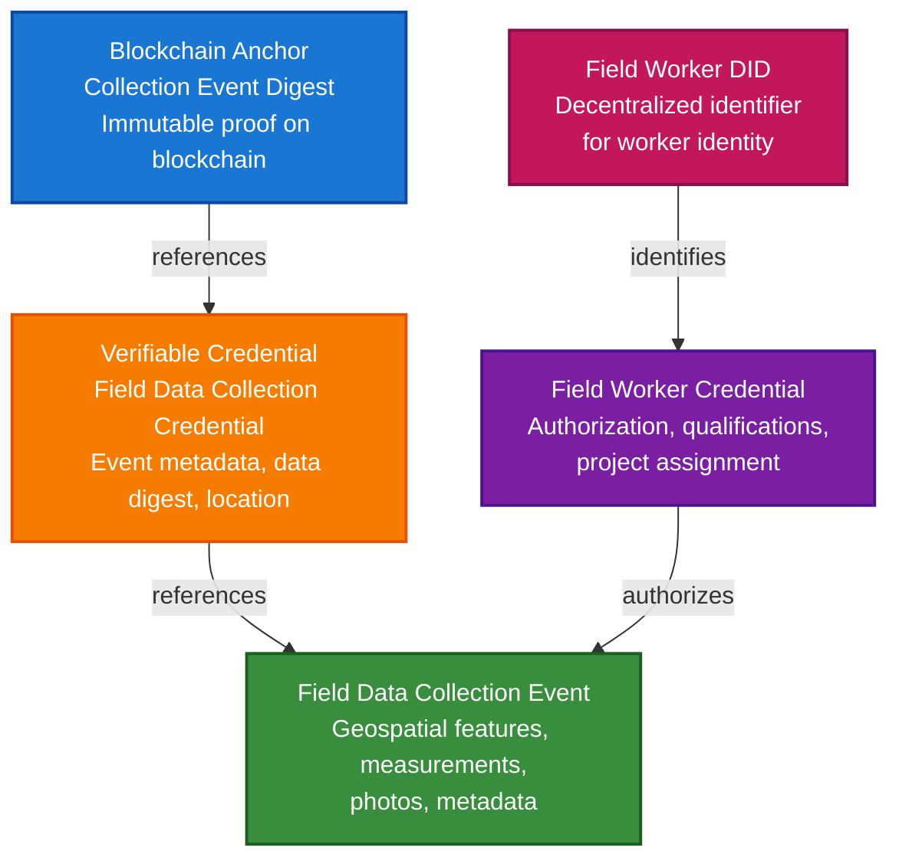

# Field Data Collection Scenario

This guide walks you through building a complete field data collection and verification system using TrustWeave. You'll learn how to create DIDs for field workers, issue authorization credentials, collect geospatial data in the field, anchor collection events to blockchain, and verify data integrity.

## What You'll Build

By the end of this tutorial, you'll have:

- ✅ Created DIDs for an organization (issuer) and field workers (holders)
- ✅ Issued Verifiable Credentials authorizing field workers
- ✅ Created verifiable credentials for field data collection events
- ✅ Anchored collection event digests to blockchain for tamper-proof records
- ✅ Verified data integrity and worker authorization
- ✅ Built a complete audit trail for field data

## Big Picture & Significance

### The Field Data Collection Challenge

Field data collection is critical for industries ranging from forestry and agriculture to infrastructure inspection and environmental monitoring. However, ensuring data integrity, verifying collector identity, and maintaining tamper-proof records are fundamental challenges that affect trust, compliance, and decision-making.

**Industry Context**:
- **Market Size**: Global field data collection market projected to reach $8.2 billion by 2027
- **Data Volume**: Millions of field observations collected daily across industries
- **Critical Applications**: Forest surveys, crop monitoring, infrastructure inspection, disaster assessment, environmental compliance
- **Trust Requirements**: Data used for regulatory compliance, insurance claims, scientific research, and policy decisions
- **Regulatory Pressure**: Increasing requirements for data provenance, collector identity verification, and audit trails

**Why This Matters**:
1. **Data Integrity**: Verify field data hasn't been tampered with after collection
2. **Identity Verification**: Ensure only authorized personnel collect data
3. **Provenance**: Track who collected what data, when, and where
4. **Compliance**: Meet regulatory requirements for field data collection
5. **Audit Trails**: Immutable records for insurance, legal, and regulatory purposes
6. **Accountability**: Hold collectors accountable for data quality and accuracy

### The Field Data Collection Problem

Traditional field data collection systems struggle with:

- **No Integrity Verification**: Can't verify data hasn't been modified after collection
- **Identity Issues**: Difficult to verify who actually collected the data
- **No Audit Trail**: Missing immutable records of collection events
- **Tampering Risk**: Data can be altered without detection
- **Compliance Gaps**: Lack of verifiable records for regulatory requirements
- **Trust Issues**: Uncertainty about data authenticity and collector authorization

## Value Proposition

### Problems Solved

1. **Data Integrity**: Cryptographic proof that field data hasn't been tampered with
2. **Identity Verification**: Verifiable credentials prove collector authorization
3. **Provenance Tracking**: Complete record of who collected what, when, and where
4. **Immutable Audit Trail**: Blockchain-anchored records cannot be altered
5. **Compliance**: Automated compliance with regulatory requirements
6. **Trust**: Build trust in field data through verifiable credentials
7. **Accountability**: Clear responsibility tracking for data collection

### Business Benefits

**For Organizations**:
- **Compliance**: Meet regulatory requirements with verifiable records
- **Trust**: Build trust with stakeholders through verifiable data
- **Efficiency**: Automated verification reduces manual processes
- **Risk Reduction**: Tamper-proof records reduce legal and financial risk
- **Quality Assurance**: Verify data quality and collector qualifications

**For Field Workers**:
- **Identity**: Verifiable proof of authorization and qualifications
- **Portability**: Credentials work across projects and organizations
- **Privacy**: Control over what information is shared
- **Accountability**: Clear record of work performed

**For Regulators and Auditors**:
- **Verification**: Instantly verify data integrity and collector identity
- **Audit Trails**: Complete immutable records of all collection events
- **Transparency**: Understand data provenance and processing
- **Compliance**: Automated compliance verification

### ROI Considerations

- **Compliance**: Automated compliance reduces costs by 60-80%
- **Verification**: Instant verification saves time and resources
- **Trust**: Increased data trust enables new use cases and partnerships
- **Risk Reduction**: Tamper-proof records reduce legal and financial exposure
- **Efficiency**: Automated processes reduce manual verification workload

## Understanding the Problem

Field data collection involves multiple challenges:

1. **Who collected it?** - Identity of the field worker
2. **Are they authorized?** - Proof of authorization and qualifications
3. **Is it authentic?** - Has the data been tampered with?
4. **When was it collected?** - Timestamp verification
5. **Where was it collected?** - Location verification

TrustWeave solves this by creating a **verifiable data collection chain** that:
- Issues credentials to authorized field workers
- Creates verifiable credentials for each collection event
- Anchors data digests to blockchain for tamper-proof records
- Enables instant verification of data integrity and worker identity

## How It Works: The Verification Chain

The verification chain creates an immutable link from field worker identity to collected data:



**Key Concept**: Each collection event is cryptographically signed, creating a verifiable link between the field worker's identity, their authorization, and the collected data. The data digest is anchored to blockchain, creating an immutable record that cannot be altered.

## Prerequisites

- Java 21+
- Kotlin 2.2.21+
- Gradle 8.5+
- Basic understanding of Kotlin and coroutines

**Note**: Don't worry if you're new to DIDs, Verifiable Credentials, or blockchain! This guide explains everything step-by-step.

## Step 1: Add Dependencies

Add TrustWeave dependencies to your `build.gradle.kts`:

```kotlin
dependencies {
    // TrustWeave distribution (includes all modules)
    implementation("com.trustweave:distribution-all:1.0.0-SNAPSHOT")

    // Test kit for in-memory implementations
    testImplementation("com.trustweave:testkit:1.0.0-SNAPSHOT")

    // Optional: Blockchain adapters for real blockchain anchoring
    implementation("com.trustweave.chains:algorand:1.0.0-SNAPSHOT")

    // Kotlinx Serialization
    implementation("org.jetbrains.kotlinx:kotlinx-serialization-json:1.6.0")

    // Coroutines
    implementation("org.jetbrains.kotlinx:kotlinx-coroutines-core:1.7.3")
}
```

## Step 2: Define Data Models

Create data models for field data collection:

```kotlin
package com.trustweave.examples.fielddata

import kotlinx.serialization.Serializable
import java.time.Instant

/**
 * Represents a field data collection event
 */
@Serializable
data class FieldCollectionEvent(
    val id: String,
    val collectorDid: String,  // DID of the field worker
    val projectId: String,
    val timestamp: String,  // ISO 8601 timestamp
    val location: GeoLocation,
    val features: List<FieldFeature>,
    val metadata: Map<String, String>,
    val attachments: List<Attachment>? = null
)

@Serializable
data class GeoLocation(
    val latitude: Double,
    val longitude: Double,
    val altitude: Double? = null,
    val accuracy: Double? = null
)

@Serializable
data class FieldFeature(
    val id: String,
    val geometry: String,  // GeoJSON geometry
    val properties: Map<String, String>,
    val type: String  // Point, LineString, Polygon, etc.
)

@Serializable
data class Attachment(
    val type: String,  // photo, video, audio, document
    val uri: String,
    val digest: String? = null  // SHA-256 digest of the file
)

/**
 * Payload for blockchain anchoring
 */
@Serializable
data class FieldDataAnchor(
    val collectionEventId: String,
    val collectorDid: String,
    val projectId: String,
    val dataDigest: String,  // SHA-256 digest of the collection event
    val timestamp: String,
    val locationDigest: String? = null
)
```

## Step 3: Setup TrustWeave

Configure TrustWeave with blockchain anchoring support:

```kotlin
import com.trustweave.trust.TrustWeave
import com.trustweave.testkit.anchor.InMemoryBlockchainAnchorClient
import kotlinx.coroutines.runBlocking

fun main() = runBlocking {
    // Setup TrustWeave with blockchain support
    val chainId = "algorand:testnet"
    val anchorClient = InMemoryBlockchainAnchorClient(chainId)

    val trustWeave = TrustWeave.build {
        keys {
            provider("inMemory")
            algorithm("Ed25519")
        }
        did {
            method("key") {
                algorithm("Ed25519")
            }
        }
        blockchains {
            chainId to anchorClient
        }
    }

    println("✓ TrustWeave configured")
    println("  - Chain: $chainId")
    println("  - Mode: In-memory (for testing)")
    println("  - Note: In production, use real blockchain clients")
}
```

## Step 4: Create Organization DID

Create a DID for your organization (the issuer of credentials):

```kotlin
// Create organization DID
import com.trustweave.trust.types.DidCreationResult
import com.trustweave.trust.types.DidResolutionResult
import com.trustweave.trust.types.IssuanceResult

val organizationDidResult = trustWeave.createDid {
    method("key")
    algorithm("Ed25519")
}

val organizationDid = when (organizationDidResult) {
    is DidCreationResult.Success -> organizationDidResult.did
    else -> throw IllegalStateException("Failed to create organization DID")
}

println("✓ Organization DID created: ${organizationDid.value}")
println("  - This DID will issue credentials to field workers")
println("  - This DID will issue credentials for collection events")
```

## Step 5: Create Field Worker DID and Issue Authorization Credential

Create a DID for a field worker and issue an authorization credential:

```kotlin
import com.trustweave.credential.models.VerifiableCredential
import java.time.Instant

// Create field worker DID
val workerDidResult = trustWeave.createDid {
    method("key")
    algorithm("Ed25519")
}

val workerDid = when (workerDidResult) {
    is DidCreationResult.Success -> workerDidResult.did
    else -> throw IllegalStateException("Failed to create worker DID")
}

println("✓ Field worker DID created: ${workerDid.value}")

// Resolve organization DID to get key ID
val organizationResolution = trustWeave.resolveDid(organizationDid)
val organizationDoc = when (organizationResolution) {
    is DidResolutionResult.Success -> organizationResolution.document
    else -> throw IllegalStateException("Failed to resolve organization DID")
}
val organizationKeyId = organizationDoc.verificationMethod.firstOrNull()?.id?.substringAfter("#")
    ?: throw IllegalStateException("No verification method found")

// Issue authorization credential
val expirationDate = Instant.now()
    .plusSeconds(365 * 24 * 60 * 60L)  // 1 year
    .toString()

val workerIssuanceResult = trustWeave.issue {
    credential {
        id("credential:worker-auth-001")
        type("VerifiableCredential", "FieldWorkerCredential")
        issuer(organizationDid.value)
        subject {
            id(workerDid.value)
            "role" to "ForestSurveyor"
            "projectId" to "project-forest-survey-2024"
            "authorized" to true
            "qualifications" to listOf("Certified Forester", "GPS Certified")
            "expirationDate" to expirationDate
        }
        expirationDate(expirationDate)
    }
    by(
        issuerDid = organizationDid.value,
        keyId = organizationKeyId
    )
}

val workerCredential = when (workerIssuanceResult) {
    is IssuanceResult.Success -> workerIssuanceResult.credential
    else -> throw IllegalStateException("Failed to issue worker credential")
}

println("✓ Worker authorization credential issued")
println("  - Credential ID: ${workerCredential.id}")
println("  - Role: Forest Surveyor")
println("  - Project: project-forest-survey-2024")
println("  - Expires: $expirationDate")
```

## Step 6: Create Field Data Collection Event

Simulate a field data collection event:

```kotlin
// Create collection event
val collectionEvent = FieldCollectionEvent(
    id = "collection-${Instant.now().toEpochMilli()}",
    collectorDid = workerDid.value,
    projectId = "project-forest-survey-2024",
    timestamp = Instant.now().toString(),
    location = GeoLocation(
        latitude = 46.5197,
        longitude = 6.6323,
        altitude = 380.0,
        accuracy = 5.0
    ),
    features = listOf(
        FieldFeature(
            id = "tree-001",
            geometry = """{"type":"Point","coordinates":[6.6323,46.5197]}""",
            properties = mapOf(
                "species" to "Quercus robur",
                "height" to "15.5",
                "dbh" to "45.2",
                "health" to "good"
            ),
            type = "Point"
        ),
        FieldFeature(
            id = "tree-002",
            geometry = """{"type":"Point","coordinates":[6.6325,46.5199]}""",
            properties = mapOf(
                "species" to "Fagus sylvatica",
                "height" to "18.2",
                "dbh" to "52.1",
                "health" to "excellent"
            ),
            type = "Point"
        )
    ),
    metadata = mapOf(
        "device" to "Mobile GPS Device",
        "version" to "3.0.1",
        "weather" to "sunny",
        "temperature" to "22.5"
    ),
    attachments = listOf(
        Attachment(
            type = "photo",
            uri = "file:///storage/tree-001.jpg",
            digest = "sha256:abc123def456..." // Would be computed from actual file
        )
    )
)

println("✓ Collection event created")
println("  - Event ID: ${collectionEvent.id}")
println("  - Features: ${collectionEvent.features.size}")
println("  - Location: (${collectionEvent.location.latitude}, ${collectionEvent.location.longitude})")
```

## Step 7: Compute Data Digest and Issue Collection Credential

Compute the data digest and issue a verifiable credential for the collection event:

```kotlin
import com.trustweave.core.util.DigestUtils
import kotlinx.serialization.json.*

// Compute data digest
val eventJson = Json.encodeToJsonElement(collectionEvent)
val dataDigest = DigestUtils.sha256DigestMultibase(eventJson)

println("✓ Data digest computed: $dataDigest")

// Issue collection event credential
val collectionIssuanceResult = trustWeave.issue {
    credential {
        id("credential:${collectionEvent.id}")
        type("VerifiableCredential", "FieldDataCollectionCredential")
        issuer(organizationDid.value)
        subject {
            id(workerDid.value)
            "collectionEventId" to collectionEvent.id
            "projectId" to collectionEvent.projectId
            "timestamp" to collectionEvent.timestamp
            "dataDigest" to dataDigest
            "location" {
                "latitude" to collectionEvent.location.latitude
                "longitude" to collectionEvent.location.longitude
                "altitude" to (collectionEvent.location.altitude ?: JsonNull)
                "accuracy" to (collectionEvent.location.accuracy ?: JsonNull)
            }
            "featureCount" to collectionEvent.features.size
            "attachmentCount" to (collectionEvent.attachments?.size ?: 0)
        }
    }
    by(
        issuerDid = organizationDid.value,
        keyId = organizationKeyId
    )
}

val collectionCredential = when (collectionIssuanceResult) {
    is IssuanceResult.Success -> collectionIssuanceResult.credential
    else -> throw IllegalStateException("Failed to issue collection credential")
}

println("✓ Collection event credential issued")
println("  - Credential ID: ${collectionCredential.id}")
println("  - Data Digest: $dataDigest")
```

## Step 8: Anchor Data to Blockchain

Anchor the collection event digest to blockchain for tamper-proof records:

```kotlin
import com.trustweave.anchor.AnchorResult

// Create anchor payload
val anchorPayload = FieldDataAnchor(
    collectionEventId = collectionEvent.id,
    collectorDid = workerDid.value,
    projectId = collectionEvent.projectId,
    dataDigest = dataDigest,
    timestamp = collectionEvent.timestamp,
    locationDigest = computeLocationDigest(collectionEvent.location)
)

// Anchor to blockchain
val anchorResult = trustWeave.blockchains.anchor(
    data = anchorPayload,
    serializer = FieldDataAnchor.serializer(),
    chainId = chainId
)

println("✓ Data anchored to blockchain")
println("  - Transaction Hash: ${anchorResult.ref.txHash}")
println("  - Chain: ${anchorResult.ref.chainId}")
println("  - Timestamp: ${anchorResult.timestamp}")
```

## Step 9: Verify Data Integrity

Verify that the data hasn't been tampered with:

```kotlin
// Recompute digest from current data
val currentDigest = DigestUtils.sha256DigestMultibase(eventJson)

// Read anchored data
val anchoredData = trustWeave.blockchains.readAnchor<FieldDataAnchor>(
    anchorRef = anchorResult.ref
)

// Verify integrity
val isIntact = anchoredData.dataDigest == currentDigest

if (isIntact) {
    println("✓ Data integrity verified!")
    println("  - Data has not been tampered with")
    println("  - Digest matches: $currentDigest")
} else {
    println("✗ Data integrity check failed!")
    println("  - Expected: ${anchoredData.dataDigest}")
    println("  - Actual: $currentDigest")
}
```

## Step 10: Verify Worker Authorization

Verify that the field worker is authorized to collect data:

```kotlin
// Verify worker credential
val workerVerification = trustWeave.verify {
    credential(workerCredential)
    checkTrust(true)
}

when (workerVerification) {
    is VerificationResult.Valid -> {
        println("✓ Worker authorization verified")
        println("  - Worker is authorized for project: project-forest-survey-2024")
        println("  - Credential is valid and not expired")
    }
    is VerificationResult.Invalid -> {
        println("✗ Worker authorization verification failed")
        workerVerification.errors.forEach { error ->
            println("  - Error: $error")
        }
    }
}

// Verify collection event credential
val collectionVerification = trustWeave.verify {
    credential(collectionCredential)
    checkTrust(true)
}

when (collectionVerification) {
    is VerificationResult.Valid -> {
        println("✓ Collection event credential verified")
        println("  - Credential signature is valid")
        println("  - Issuer is trusted")
    }
    is VerificationResult.Invalid -> {
        println("✗ Collection event credential verification failed")
        collectionVerification.errors.forEach { error ->
            println("  - Error: $error")
        }
    }
}
```

## Complete Example

Here's a complete runnable example that brings everything together:

```kotlin
package com.trustweave.examples.fielddata

import com.trustweave.trust.TrustWeave
import com.trustweave.testkit.anchor.InMemoryBlockchainAnchorClient
import com.trustweave.core.util.DigestUtils
import com.trustweave.trust.types.VerificationResult
import kotlinx.coroutines.runBlocking
import kotlinx.serialization.json.*
import java.time.Instant

fun main() = runBlocking {
    println("=".repeat(70))
    println("Field Data Collection - Complete Verification Scenario")
    println("=".repeat(70))
    println()

    // Step 1: Setup TrustWeave
    val chainId = "algorand:testnet"
    val anchorClient = InMemoryBlockchainAnchorClient(chainId)

    val trustWeave = TrustWeave.build {
        keys {
            provider("inMemory")
            algorithm("Ed25519")
        }
        did {
            method("key") {
                algorithm("Ed25519")
            }
        }
        blockchains {
            chainId to anchorClient
        }
    }

    println("Step 1: TrustWeave configured")
    println("  - Chain: $chainId")
    println()

    // Step 2: Create organization DID
    import com.trustweave.trust.types.DidCreationResult
    import com.trustweave.trust.types.DidResolutionResult
    import com.trustweave.trust.types.IssuanceResult
    
    val organizationDidResult = trustWeave.createDid {
        method("key")
    }
    val organizationDid = when (organizationDidResult) {
        is DidCreationResult.Success -> organizationDidResult.did
        else -> throw IllegalStateException("Failed to create organization DID")
    }
    println("Step 2: Organization DID created")
    println("  - DID: ${organizationDid.value}")
    println()

    // Resolve organization DID to get key ID
    val organizationResolution = trustWeave.resolveDid(organizationDid)
    val organizationDoc = when (organizationResolution) {
        is DidResolutionResult.Success -> organizationResolution.document
        else -> throw IllegalStateException("Failed to resolve organization DID")
    }
    val organizationKeyId = organizationDoc.verificationMethod.firstOrNull()?.id?.substringAfter("#")
        ?: throw IllegalStateException("No verification method found")

    // Step 3: Create field worker DID
    val workerDidResult = trustWeave.createDid {
        method("key")
    }
    val workerDid = when (workerDidResult) {
        is DidCreationResult.Success -> workerDidResult.did
        else -> throw IllegalStateException("Failed to create worker DID")
    }
    println("Step 3: Field worker DID created")
    println("  - DID: ${workerDid.value}")
    println()

    // Step 4: Issue worker authorization credential
    val expirationDate = Instant.now()
        .plusSeconds(365 * 24 * 60 * 60L)
        .toString()

    val workerIssuanceResult = trustWeave.issue {
        credential {
            id("credential:worker-auth-001")
            type("VerifiableCredential", "FieldWorkerCredential")
            issuer(organizationDid.value)
            subject {
                id(workerDid.value)
                "role" to "ForestSurveyor"
                "projectId" to "project-forest-survey-2024"
                "authorized" to true
                "qualifications" to listOf("Certified Forester", "GPS Certified")
                "expirationDate" to expirationDate
            }
            expirationDate(expirationDate)
        }
        by(
            issuerDid = organizationDid.value,
            keyId = organizationKeyId
        )
    }
    
    val workerCredential = when (workerIssuanceResult) {
        is IssuanceResult.Success -> workerIssuanceResult.credential
        else -> throw IllegalStateException("Failed to issue worker credential")
    }

    println("Step 4: Worker authorization credential issued")
    println("  - Credential ID: ${workerCredential.id}")
    println("  - Role: Forest Surveyor")
    println()

    // Step 5: Create collection event
    val collectionEvent = FieldCollectionEvent(
        id = "collection-${Instant.now().toEpochMilli()}",
        collectorDid = workerDid.value,
        projectId = "project-forest-survey-2024",
        timestamp = Instant.now().toString(),
        location = GeoLocation(
            latitude = 46.5197,
            longitude = 6.6323,
            altitude = 380.0,
            accuracy = 5.0
        ),
        features = listOf(
            FieldFeature(
                id = "tree-001",
                geometry = """{"type":"Point","coordinates":[6.6323,46.5197]}""",
                properties = mapOf(
                    "species" to "Quercus robur",
                    "height" to "15.5",
                    "dbh" to "45.2"
                ),
                type = "Point"
            )
        ),
        metadata = mapOf(
            "device" to "Mobile GPS Device",
            "weather" to "sunny"
        )
    )

    println("Step 5: Collection event created")
    println("  - Event ID: ${collectionEvent.id}")
    println("  - Features: ${collectionEvent.features.size}")
    println()

    // Step 6: Compute digest and issue collection credential
    val eventJson = Json.encodeToJsonElement(collectionEvent)
    val dataDigest = DigestUtils.sha256DigestMultibase(eventJson)

    val collectionIssuanceResult = trustWeave.issue {
        credential {
            id("credential:${collectionEvent.id}")
            type("VerifiableCredential", "FieldDataCollectionCredential")
            issuer(organizationDid.value)
            subject {
                id(workerDid.value)
                "collectionEventId" to collectionEvent.id
                "dataDigest" to dataDigest
                "location" {
                    "latitude" to collectionEvent.location.latitude
                    "longitude" to collectionEvent.location.longitude
                }
            }
        }
        by(
            issuerDid = organizationDid.value,
            keyId = organizationKeyId
        )
    }
    
    val collectionCredential = when (collectionIssuanceResult) {
        is IssuanceResult.Success -> collectionIssuanceResult.credential
        else -> throw IllegalStateException("Failed to issue collection credential")
    }

    println("Step 6: Collection credential issued")
    println("  - Data Digest: $dataDigest")
    println()

    // Step 7: Anchor to blockchain
    val anchorPayload = FieldDataAnchor(
        collectionEventId = collectionEvent.id,
        collectorDid = workerDid.value,
        projectId = collectionEvent.projectId,
        dataDigest = dataDigest,
        timestamp = collectionEvent.timestamp
    )

    val anchorResult = trustWeave.blockchains.anchor(
        data = anchorPayload,
        serializer = FieldDataAnchor.serializer(),
        chainId = chainId
    )

    println("Step 7: Data anchored to blockchain")
    println("  - TX Hash: ${anchorResult.ref.txHash}")
    println()

    // Step 8: Verify integrity
    val anchoredData = trustWeave.blockchains.readAnchor<FieldDataAnchor>(
        anchorRef = anchorResult.ref
    )
    val currentDigest = DigestUtils.sha256DigestMultibase(eventJson)
    val isIntact = anchoredData.dataDigest == currentDigest

    println("Step 8: Data integrity verification")
    if (isIntact) {
        println("  ✓ Data integrity verified - no tampering detected")
    } else {
        println("  ✗ Data integrity check failed - possible tampering")
    }
    println()

    // Step 9: Verify credentials
    val workerVerification = trustWeave.verify {
        credential(workerCredential)
        checkTrust(true)
    }

    val collectionVerification = trustWeave.verify {
        credential(collectionCredential)
        checkTrust(true)
    }

    println("Step 9: Credential verification")
    when (workerVerification) {
        is VerificationResult.Valid -> println("  ✓ Worker credential verified")
        is VerificationResult.Invalid -> println("  ✗ Worker credential invalid")
    }
    when (collectionVerification) {
        is VerificationResult.Valid -> println("  ✓ Collection credential verified")
        is VerificationResult.Invalid -> println("  ✗ Collection credential invalid")
    }
    println()

    println("=".repeat(70))
    println("Scenario Complete!")
    println("=".repeat(70))
}

fun computeLocationDigest(location: GeoLocation): String {
    val locationJson = buildJsonObject {
        put("latitude", location.latitude)
        put("longitude", location.longitude)
        put("altitude", location.altitude ?: JsonNull)
    }
    return DigestUtils.sha256DigestMultibase(locationJson)
}
```

## Next Steps

Now that you've built a complete field data collection verification system, you can:

1. **Extend the Data Model**: Add more fields specific to your use case (crop data, infrastructure measurements, etc.)
2. **Add Worker Wallet**: Store worker credentials in a wallet for easy access
3. **Build Verification API**: Create REST endpoints for verifying data integrity
4. **Integrate with Mobile Apps**: Connect to mobile field data collection applications
5. **Add Multi-Chain Support**: Anchor to multiple blockchains for redundancy
6. **Implement Batch Processing**: Process multiple collection events efficiently
7. **Add Revocation**: Implement credential revocation for unauthorized workers

## Real-World Applications

This scenario can be adapted for:

- **Forestry**: Tree surveys, forest inventory, timber tracking
- **Agriculture**: Crop monitoring, soil sampling, yield tracking
- **Infrastructure**: Bridge inspections, utility mapping, road surveys
- **Environmental**: Water quality monitoring, wildlife tracking, pollution assessment
- **Disaster Response**: Damage assessment, resource mapping, recovery tracking
- **Archaeology**: Site documentation, artifact cataloging, preservation tracking

## Summary

You've learned how to:

- ✅ Create DIDs for organizations and field workers
- ✅ Issue verifiable credentials for worker authorization
- ✅ Create verifiable credentials for field data collection events
- ✅ Compute cryptographic digests for data integrity
- ✅ Anchor data to blockchain for tamper-proof records
- ✅ Verify data integrity and worker authorization

This creates a complete, verifiable field data collection system that ensures data integrity, verifies worker identity, and provides immutable audit trails for compliance and trust.


