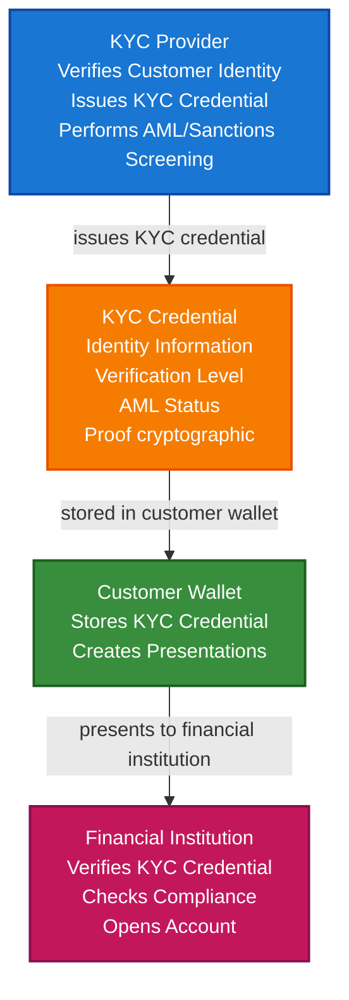

# Financial Services & KYC/AML Scenario

This guide demonstrates how to build a financial services identity verification system using TrustWeave that enables reusable KYC credentials, compliance verification, cross-institution sharing, and regulatory anchoring.

## What You'll Build

By the end of this tutorial, you'll have:

- ✅ Created DIDs for financial institutions and customers
- ✅ Issued KYC credentials with identity verification
- ✅ Built reusable identity proof system
- ✅ Implemented compliance verification (AML, sanctions screening)
- ✅ Created cross-institution credential sharing
- ✅ Anchored KYC records to blockchain for regulatory compliance
- ✅ Built customer identity wallet

## Big Picture & Significance

### The Financial Identity Revolution

Financial services face increasing regulatory requirements for Know Your Customer (KYC) and Anti-Money Laundering (AML) compliance. Traditional KYC processes are expensive, repetitive, and create privacy concerns. Verifiable credentials enable reusable, privacy-preserving identity verification.

**Industry Context**:
- **Market Size**: Global KYC solutions market projected to reach $28.1 billion by 2027
- **Regulatory Pressure**: Increasing KYC/AML requirements globally (FATF, FinCEN, EU regulations)
- **Cost Impact**: KYC compliance costs financial institutions $10+ billion annually
- **Customer Friction**: Repetitive KYC processes frustrate customers
- **Privacy Concerns**: Centralized KYC databases create privacy risks

**Why This Matters**:
1. **Cost Reduction**: Reusable KYC credentials reduce verification costs by 60-80%
2. **Customer Experience**: One-time KYC, reuse across institutions
3. **Compliance**: Automated regulatory compliance with audit trails
4. **Privacy**: Customers control their identity data
5. **Fraud Prevention**: Cryptographic proof prevents identity fraud
6. **Interoperability**: Works across different financial institutions

### The KYC/AML Challenge

Traditional KYC systems face critical issues:
- **Repetitive Processes**: Customers repeat KYC at each institution
- **High Costs**: Each KYC verification costs $50-150
- **Privacy Risks**: Centralized databases are attractive targets
- **Slow Processes**: Manual verification takes days or weeks
- **Compliance Burden**: Complex regulatory requirements
- **Data Silos**: Institutions can't share verified identity data
- **Fraud Risk**: Identity documents can be forged

## Value Proposition

### Problems Solved

1. **Reusable Identity**: One-time KYC, reuse across institutions
2. **Cost Reduction**: 60-80% reduction in KYC costs
3. **Privacy**: Customer-controlled identity data
4. **Compliance**: Automated regulatory compliance
5. **Speed**: Instant verification without manual checks
6. **Interoperability**: Works across all financial institutions
7. **Fraud Prevention**: Cryptographic proof prevents identity theft
8. **Audit Trail**: Immutable records for regulatory compliance

### Business Benefits

**For Financial Institutions**:
- **Cost Savings**: 60-80% reduction in KYC costs
- **Faster Onboarding**: 10x faster customer onboarding
- **Compliance**: Automated regulatory compliance
- **Risk Reduction**: Reduced fraud and identity theft
- **Customer Satisfaction**: Improved customer experience

**For Customers**:
- **Convenience**: One-time KYC, reuse everywhere
- **Privacy**: Control what identity information is shared
- **Speed**: Faster account opening
- **Security**: Reduced risk of identity theft
- **Portability**: Identity credentials work across institutions

**For Regulators**:
- **Transparency**: Verifiable audit trails
- **Compliance**: Automated compliance verification
- **Efficiency**: Reduced regulatory burden
- **Fraud Prevention**: Better fraud detection

### ROI Considerations

- **KYC Cost Reduction**: $50-150 per verification → $5-15 with reusable credentials
- **Onboarding Speed**: Days/weeks → Minutes
- **Compliance**: Automated compliance reduces costs by 40%
- **Fraud Prevention**: Saves millions in prevented fraud
- **Customer Acquisition**: Faster onboarding increases conversions

## Understanding the Problem

Financial services identity verification faces several critical challenges:

1. **Repetitive KYC**: Customers repeat verification at each institution
2. **High Costs**: Expensive manual verification processes
3. **Privacy Concerns**: Centralized identity databases
4. **Slow Processes**: Manual verification takes time
5. **Compliance Complexity**: Complex regulatory requirements
6. **Data Silos**: Institutions can't share verified data
7. **Fraud Risk**: Identity document forgery

### Real-World Pain Points

**Example 1: Bank Account Opening**
- Current: Manual document verification, takes days
- Problem: High costs, customer frustration, privacy concerns
- Solution: Instant verification with reusable KYC credentials

**Example 2: Crypto Exchange KYC**
- Current: Each exchange requires separate KYC
- Problem: Repetitive, time-consuming, privacy concerns
- Solution: Reusable KYC credentials across exchanges

**Example 3: Cross-Border Banking**
- Current: Complex international verification
- Problem: Slow, expensive, compliance challenges
- Solution: Verifiable credentials recognized internationally

## How It Works: KYC Credential Flow



## Key Concepts

### KYC Credential Types

1. **Identity Verification Credential**: Basic identity information (name, DOB, address)
2. **Enhanced KYC Credential**: Additional verification (source of funds, occupation)
3. **AML Status Credential**: AML and sanctions screening results
4. **Risk Assessment Credential**: Customer risk rating
5. **Compliance Credential**: Regulatory compliance status

### Verification Levels

1. **Basic**: Name, DOB, address verification
2. **Standard**: Basic + identity document verification
3. **Enhanced**: Standard + source of funds verification
4. **Premium**: Enhanced + ongoing monitoring

### Compliance Features

- **AML Screening**: Anti-money laundering checks
- **Sanctions Screening**: Sanctions list verification
- **PEP Screening**: Politically Exposed Person checks
- **Risk Rating**: Customer risk assessment
- **Audit Trail**: Immutable compliance records

## Prerequisites

- Java 21+
- Kotlin 2.2.0+
- Gradle 8.5+
- Basic understanding of Kotlin and coroutines
- Familiarity with KYC/AML concepts (helpful but not required)

## Step 1: Add Dependencies

Add TrustWeave dependencies to your `build.gradle.kts`. These libraries cover DID management, credential issuance, wallet storage, and the in-memory adapters the scenario relies on for KYC flows.

```kotlin
dependencies {
    // Core TrustWeave modules
    implementation("com.trustweave:TrustWeave-core:1.0.0-SNAPSHOT")
    implementation("com.trustweave:TrustWeave-json:1.0.0-SNAPSHOT")
    implementation("com.trustweave:TrustWeave-kms:1.0.0-SNAPSHOT")
    implementation("com.trustweave:TrustWeave-did:1.0.0-SNAPSHOT")
    implementation("com.trustweave:TrustWeave-anchor:1.0.0-SNAPSHOT")
    
    // Test kit for in-memory implementations
    implementation("com.trustweave:TrustWeave-testkit:1.0.0-SNAPSHOT")
    
    // Kotlinx Serialization
    implementation("org.jetbrains.kotlinx:kotlinx-serialization-json:1.6.0")
    
    // Coroutines
    implementation("org.jetbrains.kotlinx:kotlinx-coroutines-core:1.7.3")
}
```

**Result:** Gradle now resolves everything you need to run the snippets—no extra module wiring required.

## Step 2: Complete Example

Here’s the full KYC credential management workflow. Run it once to observe the happy path, then use the breakdowns that follow to understand each step in detail.

```kotlin
import com.trustweave.credential.models.VerifiableCredential
import com.trustweave.credential.models.VerifiablePresentation
import com.trustweave.credential.CredentialIssuanceOptions
import com.trustweave.credential.CredentialVerificationOptions
import com.trustweave.credential.PresentationOptions
import com.trustweave.credential.issuer.CredentialIssuer
import com.trustweave.credential.verifier.CredentialVerifier
import com.trustweave.credential.proof.Ed25519ProofGenerator
import com.trustweave.testkit.credential.InMemoryWallet
import com.trustweave.testkit.did.DidKeyMockMethod
import com.trustweave.testkit.kms.InMemoryKeyManagementService
import com.trustweave.testkit.anchor.InMemoryBlockchainAnchorClient
import com.trustweave.anchor.BlockchainAnchorRegistry
import com.trustweave.anchor.anchorTyped
import com.trustweave.did.DidMethodRegistry
import kotlinx.coroutines.runBlocking
import kotlinx.serialization.Serializable
import kotlinx.serialization.json.buildJsonObject
import kotlinx.serialization.json.put
import kotlinx.serialization.json.Json
import java.time.Instant
import java.time.temporal.ChronoUnit

@Serializable
data class KYCRecord(
    val customerDid: String,
    val kycProviderDid: String,
    val verificationLevel: String,
    val credentialDigest: String,
    val complianceStatus: String
)

fun main() = runBlocking {
    println("=== Financial Services & KYC/AML Scenario ===\n")
    
    // Step 1: Setup services
    println("Step 1: Setting up services...")
    val kycProviderKms = InMemoryKeyManagementService()
    val bankKms = InMemoryKeyManagementService()
    val cryptoExchangeKms = InMemoryKeyManagementService()
    val customerKms = InMemoryKeyManagementService()
    
    val didMethod = DidKeyMockMethod(kycProviderKms)
    val didRegistry = DidMethodRegistry().apply { register(didMethod) }
    
    // Setup blockchain for anchoring
    val anchorClient = InMemoryBlockchainAnchorClient("eip155:1", emptyMap())
    val blockchainRegistry = BlockchainAnchorRegistry().apply {
        register("eip155:1", anchorClient)
    }
    
    // Step 2: Create DIDs
    println("\nStep 2: Creating DIDs...")
    val kycProviderDid = didMethod.createDid()
    println("KYC Provider DID: ${kycProviderDid.id}")
    
    val bankDid = didMethod.createDid()
    println("Bank DID: ${bankDid.id}")
    
    val cryptoExchangeDid = didMethod.createDid()
    println("Crypto Exchange DID: ${cryptoExchangeDid.id}")
    
    val customerDid = didMethod.createDid()
    println("Customer DID: ${customerDid.id}")
    
    // Step 3: Create customer wallet
    println("\nStep 3: Creating customer wallet...")
    val customerWallet = InMemoryWallet(
        walletDid = customerDid.id,
        holderDid = customerDid.id
    )
    println("Customer wallet created: ${customerWallet.walletId}")
    
    // Step 4: Perform KYC verification
    println("\nStep 4: Performing KYC verification...")
    val identityData = mapOf(
        "fullName" to "Jane Smith",
        "dateOfBirth" to "1990-05-15",
        "address" to "456 Oak St, City, State 67890",
        "nationality" to "US",
        "idDocumentType" to "Passport",
        "idDocumentNumber" to "P123456789"
    )
    
    // Simulate KYC verification process
    val kycVerificationResult = performKYCVerification(
        customerDid = customerDid.id,
        identityData = identityData,
        kycProviderDid = kycProviderDid.id
    )
    
    println("KYC verification completed:")
    println("  - Status: ${kycVerificationResult.status}")
    println("  - Verification Level: ${kycVerificationResult.verificationLevel}")
    println("  - AML Status: ${kycVerificationResult.amlStatus}")
    
    // Step 5: Issue KYC credential
    println("\nStep 5: Issuing KYC credential...")
    val kycCredential = createKYCCredential(
        customerDid = customerDid.id,
        issuerDid = kycProviderDid.id,
        identityData = identityData,
        verificationLevel = kycVerificationResult.verificationLevel,
        amlStatus = kycVerificationResult.amlStatus,
        riskRating = kycVerificationResult.riskRating
    )
    
    val kycProviderKey = kycProviderKms.generateKey("Ed25519")
    val kycProofGenerator = Ed25519ProofGenerator(
        signer = { data, keyId -> kycProviderKms.sign(keyId, data) },
        getPublicKeyId = { keyId -> kycProviderKey.id }
    )
val didResolver = CredentialDidResolver { did ->
    didRegistry.resolve(did).toCredentialDidResolution()
}
    
    val kycIssuer = CredentialIssuer(
        proofGenerator = kycProofGenerator,
        resolveDid = { did -> didResolver.resolve(did)?.isResolvable == true }
    )
    
    val issuedKYCCredential = kycIssuer.issue(
        credential = kycCredential,
        issuerDid = kycProviderDid.id,
        keyId = kycProviderKey.id,
        options = CredentialIssuanceOptions(proofType = "Ed25519Signature2020")
    )
    
    println("KYC credential issued:")
    println("  - Verification Level: ${kycVerificationResult.verificationLevel}")
    println("  - AML Status: ${kycVerificationResult.amlStatus}")
    println("  - Has proof: ${issuedKYCCredential.proof != null}")
    
    // Step 6: Store KYC credential in customer wallet
    println("\nStep 6: Storing KYC credential in customer wallet...")
    val kycCredentialId = customerWallet.store(issuedKYCCredential)
    println("KYC credential stored: $kycCredentialId")
    
    // Step 7: Anchor KYC record to blockchain
    println("\nStep 7: Anchoring KYC record to blockchain...")
    val kycDigest = com.trustweave.json.DigestUtils.sha256DigestMultibase(
        Json.encodeToJsonElement(
            com.trustweave.credential.models.VerifiableCredential.serializer(),
            issuedKYCCredential
        )
    )
    
    val kycRecord = KYCRecord(
        customerDid = customerDid.id,
        kycProviderDid = kycProviderDid.id,
        verificationLevel = kycVerificationResult.verificationLevel,
        credentialDigest = kycDigest,
        complianceStatus = "compliant"
    )
    
    val anchorResult = blockchainRegistry.anchorTyped(
        value = kycRecord,
        serializer = KYCRecord.serializer(),
        targetChainId = "eip155:1"
    )
    
    println("KYC record anchored:")
    println("  - Transaction hash: ${anchorResult.ref.txHash}")
    println("  - Provides regulatory audit trail")
    
    // Step 8: Bank verifies KYC credential
    println("\nStep 8: Bank verifies KYC credential for account opening...")
    val bankVerifier = CredentialVerifier(didResolver)
    
    val bankVerification = bankVerifier.verify(
        credential = issuedKYCCredential,
        options = CredentialVerificationOptions(
            checkRevocation = false,
            checkExpiration = true,
            validateSchema = false,
            didResolver = didResolver
        )
    )
    
    if (bankVerification.valid) {
        println("✅ KYC credential verified by bank!")
        println("  - Proof valid: ${bankVerification.proofValid}")
        println("  - Issuer valid: ${bankVerification.issuerValid}")
        println("  - Not expired: ${bankVerification.notExpired}")
        
        // Check compliance requirements
        val meetsBankRequirements = checkComplianceRequirements(
            credential = issuedKYCCredential,
            requiredLevel = "Standard",
            requiredAMLStatus = "clear"
        )
        
        if (meetsBankRequirements) {
            println("✅ Meets bank compliance requirements")
            println("  - Account can be opened")
        }
    }
    
    // Step 9: Create bank account opening presentation
    println("\nStep 9: Creating bank account opening presentation...")
    val bankPresentation = customerWallet.createSelectiveDisclosure(
        credentialIds = listOf(kycCredentialId),
        disclosedFields = listOf(
            "identity.fullName",
            "identity.dateOfBirth",
            "identity.nationality",
            "verificationLevel",
            "amlStatus"
            // Address and document numbers NOT disclosed
        ),
        holderDid = customerDid.id,
        options = PresentationOptions(
            holderDid = customerDid.id,
            proofType = "Ed25519Signature2020",
            challenge = "bank-account-opening-${Instant.now().toEpochMilli()}"
        )
    )
    
    println("Bank account opening presentation created")
    
    // Step 10: Crypto exchange verifies same KYC credential
    println("\nStep 10: Crypto exchange verifies KYC credential...")
    val exchangeVerification = bankVerifier.verify(
        credential = issuedKYCCredential,
        options = CredentialVerificationOptions(
            checkRevocation = false,
            checkExpiration = true,
            didResolver = didResolver
        )
    )
    
    if (exchangeVerification.valid) {
        println("✅ KYC credential verified by crypto exchange!")
        println("  - Same credential reused - no need for new KYC")
        println("  - Account can be opened instantly")
    }
    
    // Step 11: Create exchange account opening presentation
    println("\nStep 11: Creating exchange account opening presentation...")
    val exchangePresentation = customerWallet.createSelectiveDisclosure(
        credentialIds = listOf(kycCredentialId),
        disclosedFields = listOf(
            "identity.fullName",
            "verificationLevel",
            "amlStatus"
            // Minimal information for exchange
        ),
        holderDid = customerDid.id,
        options = PresentationOptions(
            holderDid = customerDid.id,
            proofType = "Ed25519Signature2020",
            challenge = "crypto-exchange-opening-${Instant.now().toEpochMilli()}"
        )
    )
    
    println("Exchange account opening presentation created")
    
    // Step 12: Wallet statistics
    println("\nStep 12: Customer wallet statistics...")
    val stats = customerWallet.getStatistics()
    println("""
        Total credentials: ${stats.totalCredentials}
        Valid credentials: ${stats.validCredentials}
    """.trimIndent())
    
    println("\n=== Scenario Complete ===")
}

data class KYCVerificationResult(
    val status: String,
    val verificationLevel: String,
    val amlStatus: String,
    val riskRating: String
)

fun performKYCVerification(
    customerDid: String,
    identityData: Map<String, String>,
    kycProviderDid: String
): KYCVerificationResult {
    // Simulate KYC verification process
    // In production, this would involve:
    // - Document verification
    // - Identity database checks
    // - AML/sanctions screening
    // - PEP checks
    // - Risk assessment
    
    return KYCVerificationResult(
        status = "verified",
        verificationLevel = "Standard",
        amlStatus = "clear",
        riskRating = "low"
    )
}

fun createKYCCredential(
    customerDid: String,
    issuerDid: String,
    identityData: Map<String, String>,
    verificationLevel: String,
    amlStatus: String,
    riskRating: String
): VerifiableCredential {
    return VerifiableCredential(
        id = "https://kyc-provider.example.com/kyc/${customerDid.substringAfterLast(":")}-${Instant.now().toEpochMilli()}",
        type = listOf("VerifiableCredential", "KYCCredential", "IdentityCredential"),
        issuer = issuerDid,
        credentialSubject = buildJsonObject {
            put("id", customerDid)
            put("identity", buildJsonObject {
                identityData.forEach { (key, value) ->
                    put(key, value)
                }
            })
            put("kyc", buildJsonObject {
                put("verificationLevel", verificationLevel)
                put("verificationDate", Instant.now().toString())
                put("amlStatus", amlStatus)
                put("riskRating", riskRating)
                put("kycProviderDid", issuerDid)
            })
        },
        issuanceDate = Instant.now().toString(),
        expirationDate = Instant.now().plus(1, ChronoUnit.YEARS).toString(),
        credentialSchema = com.trustweave.credential.models.CredentialSchema(
            id = "https://example.com/schemas/kyc-credential.json",
            type = "JsonSchemaValidator2018",
            schemaFormat = com.trustweave.spi.SchemaFormat.JSON_SCHEMA
        )
    )
}

fun checkComplianceRequirements(
    credential: VerifiableCredential,
    requiredLevel: String,
    requiredAMLStatus: String
): Boolean {
    val kyc = credential.credentialSubject.jsonObject["kyc"]?.jsonObject
        ?: return false
    
    val verificationLevel = kyc["verificationLevel"]?.jsonPrimitive?.content
        ?: return false
    
    val amlStatus = kyc["amlStatus"]?.jsonPrimitive?.content
        ?: return false
    
    // Check verification level meets requirement
    val levelHierarchy = mapOf(
        "Basic" to 1,
        "Standard" to 2,
        "Enhanced" to 3,
        "Premium" to 4
    )
    
    val customerLevel = levelHierarchy[verificationLevel] ?: return false
    val requiredLevelValue = levelHierarchy[requiredLevel] ?: return false
    
    if (customerLevel < requiredLevelValue) return false
    
    // Check AML status
    if (amlStatus != requiredAMLStatus) return false
    
    return true
}
```

## Extensive Step-by-Step Breakdown

### Step 1: Setup and Initialization

**Purpose**: Initialize financial services identity system with proper key management.

**Detailed Explanation**:
1. **Multiple Institution KMS**: Separate key management for KYC provider, bank, crypto exchange ensures proper key isolation
2. **Customer KMS**: Separate key management for customer ensures customer control
3. **DID Method Registration**: Register DID method for creating identities
4. **Blockchain Setup**: Initialize blockchain for anchoring KYC records

**Why This Matters**: Financial services require the highest security standards. Multiple KMS instances ensure proper key isolation and regulatory compliance.

### Step 2: Create Financial Institution DIDs

**Purpose**: Establish verifiable identities for financial institutions.

**Detailed Explanation**:
- **KYC Provider DID**: Represents KYC service provider
- **Bank DID**: Represents bank institution
- **Crypto Exchange DID**: Represents crypto exchange

**Key Considerations**:
- Financial institution DIDs serve as trust anchors
- Must be well-known and resolvable
- Cryptographic proof of institution authority
- Can be verified by customers and regulators

### Step 3: Create Customer DID

**Purpose**: Establish customer's self-sovereign identity.

**Detailed Explanation**:
- Customer DID provides persistent identity
- Not tied to any specific financial institution
- Works across all financial services
- Customer controls the DID

**Benefits**:
- Single identity across all services
- Not dependent on any single institution
- Portable across institutions
- Privacy-preserving

### Step 4: Perform KYC Verification

**Purpose**: Verify customer identity and perform compliance checks.

**Detailed Explanation**:
1. **Identity Verification**: Verify identity documents
2. **AML Screening**: Check against money laundering databases
3. **Sanctions Screening**: Check against sanctions lists
4. **PEP Screening**: Check for Politically Exposed Persons
5. **Risk Assessment**: Assess customer risk level

**Compliance Features**:
- Regulatory compliance (FATF, FinCEN)
- Automated screening
- Risk-based approach
- Audit trail

### Step 5: Issue KYC Credential

**Purpose**: Create verifiable KYC credential.

**Detailed Explanation**:
1. **Identity Data**: Name, DOB, address, nationality
2. **Verification Level**: Basic, Standard, Enhanced, Premium
3. **AML Status**: Clear, flagged, pending
4. **Risk Rating**: Low, medium, high
5. **Credential Structure**: Follows W3C VC standard
6. **Proof Generation**: Cryptographic signature from KYC provider

**Security Features**:
- Tamper-proof cryptographic proof
- Verifiable issuer (KYC provider)
- Expiration prevents stale data
- Can be revoked if status changes

### Step 6: Store KYC Credential in Customer Wallet

**Purpose**: Enable customer to manage and reuse KYC credential.

**Detailed Explanation**:
- Store KYC credential in customer wallet
- Customer has full control
- Can share with any financial institution
- Enables selective disclosure

**Customer Benefits**:
- One-time KYC, reuse everywhere
- Control over identity data
- Privacy-preserving sharing
- Portable across institutions

### Step 7: Anchor KYC Record to Blockchain

**Purpose**: Create immutable record for regulatory compliance.

**Detailed Explanation**:
1. **KYC Record**: Create structured record of KYC verification
2. **Blockchain Anchoring**: Anchor to blockchain for immutability
3. **Regulatory Compliance**: Provides audit trail for regulators

**Regulatory Benefits**:
- Immutable audit trail
- Timestamped verification
- Cannot be tampered with
- Meets regulatory requirements

### Step 8: Bank Verifies KYC Credential

**Purpose**: Bank verifies customer KYC credential for account opening.

**Detailed Explanation**:
1. **Credential Verification**: Verify cryptographic proof
2. **Issuer Verification**: Verify KYC provider DID
3. **Compliance Check**: Verify meets bank requirements
4. **Account Opening**: Open account if verified

**Bank Benefits**:
- Instant verification
- Reduced costs
- Regulatory compliance
- Fraud prevention

### Step 9: Create Bank Account Opening Presentation

**Purpose**: Customer presents KYC credential to bank with selective disclosure.

**Detailed Explanation**:
1. **Selective Disclosure**: Share only necessary information
2. **Privacy Preservation**: Don't share sensitive data unnecessarily
3. **Presentation Creation**: Create verifiable presentation

**Privacy Benefits**:
- Minimum necessary disclosure
- Customer controls what's shared
- Reduces privacy risk
- Enables targeted data sharing

### Step 10: Crypto Exchange Verifies Same KYC Credential

**Purpose**: Demonstrate reusability of KYC credential.

**Detailed Explanation**:
1. **Same Credential**: Use same KYC credential
2. **Instant Verification**: No need for new KYC
3. **Account Opening**: Open account immediately

**Reusability Benefits**:
- No repetitive KYC
- Instant account opening
- Reduced costs
- Better customer experience

### Step 11: Create Exchange Account Opening Presentation

**Purpose**: Customer presents KYC credential to exchange with minimal disclosure.

**Detailed Explanation**:
1. **Minimal Disclosure**: Share only what exchange needs
2. **Privacy**: Protect sensitive information
3. **Presentation**: Create verifiable presentation

**Privacy Benefits**:
- Minimal data exposure
- Customer control
- Privacy-preserving
- Targeted sharing

### Step 12: Wallet Statistics

**Purpose**: Provide overview of customer's credentials.

**Detailed Explanation**:
- Total credentials count
- Valid credentials count
- Credential status

**Customer Benefits**:
- Overview of identity credentials
- Track credential status
- Monitor expiration
- Identity management

## Advanced Features

### Enhanced KYC

Add source of funds and occupation verification:

```kotlin
fun createEnhancedKYCCredential(
    customerDid: String,
    issuerDid: String,
    identityData: Map<String, String>,
    sourceOfFunds: String,
    occupation: String,
    incomeRange: String
): VerifiableCredential {
    return VerifiableCredential(
        type = listOf("VerifiableCredential", "EnhancedKYCCredential"),
        issuer = issuerDid,
        credentialSubject = buildJsonObject {
            put("id", customerDid)
            put("identity", buildJsonObject {
                identityData.forEach { (key, value) ->
                    put(key, value)
                }
            })
            put("enhancedKYC", buildJsonObject {
                put("sourceOfFunds", sourceOfFunds)
                put("occupation", occupation)
                put("incomeRange", incomeRange)
                put("verificationLevel", "Enhanced")
            })
        },
        issuanceDate = Instant.now().toString()
    )
}
```

### Ongoing Monitoring

Monitor customer for changes:

```kotlin
fun createMonitoringCredential(
    customerDid: String,
    monitoringProviderDid: String,
    monitoringStatus: String,
    lastCheckDate: String
): VerifiableCredential {
    return VerifiableCredential(
        type = listOf("VerifiableCredential", "MonitoringCredential"),
        issuer = monitoringProviderDid,
        credentialSubject = buildJsonObject {
            put("id", customerDid)
            put("monitoring", buildJsonObject {
                put("status", monitoringStatus)
                put("lastCheckDate", lastCheckDate)
                put("nextCheckDate", Instant.now().plus(30, ChronoUnit.DAYS).toString())
            })
        },
        issuanceDate = Instant.now().toString()
    )
}
```

### Cross-Border KYC

Enable international KYC recognition:

```kotlin
fun verifyCrossBorderKYC(
    kycCredential: VerifiableCredential,
    verifyingCountryDid: String
): Boolean {
    // Verify credential is valid
    val verifier = CredentialVerifier(
        didResolver = CredentialDidResolver { did ->
            didRegistry.resolve(did).toCredentialDidResolution()
        }
    )
    
    val verification = verifier.verify(
        credential = kycCredential,
        options = CredentialVerificationOptions(
            checkRevocation = true,
            checkExpiration = true
        )
    )
    
    if (!verification.valid) return false
    
    // Check if KYC provider is recognized in verifying country
    val kycProviderDid = kycCredential.issuer
    // In production, check against list of recognized KYC providers
    return true // Simplified for example
}
```

## Real-World Use Cases

### 1. Bank Account Opening

**Scenario**: Customer opens bank account using reusable KYC credential.

**Implementation**:

```kotlin
fun openBankAccountWithKYC(
    customerWallet: Wallet,
    bankDid: String,
    accountType: String
): VerifiablePresentation {
    val kycCredential = customerWallet.query {
        byType("KYCCredential")
        valid()
    }.firstOrNull() ?: throw IllegalArgumentException("No valid KYC credential")
    
    // Check if KYC meets bank requirements
    val meetsRequirements = checkComplianceRequirements(
        credential = kycCredential,
        requiredLevel = "Standard",
        requiredAMLStatus = "clear"
    )
    
    if (!meetsRequirements) {
        throw IllegalArgumentException("KYC does not meet bank requirements")
    }
    
    // Create presentation
    return customerWallet.createSelectiveDisclosure(
        credentialIds = listOfNotNull(kycCredential.id),
        disclosedFields = listOf(
            "identity.fullName",
            "identity.dateOfBirth",
            "identity.nationality",
            "verificationLevel",
            "amlStatus"
        ),
        holderDid = customerWallet.holderDid!!,
        options = PresentationOptions(
            holderDid = customerWallet.holderDid!!,
            challenge = "bank-account-opening-$accountType"
        )
    )
}
```

### 2. Crypto Exchange KYC

**Scenario**: Customer opens crypto exchange account using same KYC credential.

**Implementation**:

```kotlin
fun openCryptoExchangeAccount(
    customerWallet: Wallet,
    exchangeDid: String
): VerifiablePresentation {
    val kycCredential = customerWallet.query {
        byType("KYCCredential")
        valid()
    }.firstOrNull() ?: throw IllegalArgumentException("No valid KYC credential")
    
    // Crypto exchanges typically need less information
    return customerWallet.createSelectiveDisclosure(
        credentialIds = listOfNotNull(kycCredential.id),
        disclosedFields = listOf(
            "identity.fullName",
            "verificationLevel",
            "amlStatus"
            // Minimal information for crypto exchange
        ),
        holderDid = customerWallet.holderDid!!,
        options = PresentationOptions(
            holderDid = customerWallet.holderDid!!,
            challenge = "crypto-exchange-opening"
        )
    )
}
```

### 3. Loan Application

**Scenario**: Customer applies for loan using enhanced KYC credential.

**Implementation**:

```kotlin
fun applyForLoan(
    customerWallet: Wallet,
    lenderDid: String,
    loanAmount: Double
): VerifiablePresentation {
    val enhancedKYCCredential = customerWallet.query {
        byType("EnhancedKYCCredential")
        valid()
    }.firstOrNull() ?: throw IllegalArgumentException("Enhanced KYC required for loan")
    
    // Verify enhanced KYC meets loan requirements
    val kyc = enhancedKYCCredential.credentialSubject.jsonObject["enhancedKYC"]?.jsonObject
    val verificationLevel = kyc?.get("verificationLevel")?.jsonPrimitive?.content
    
    if (verificationLevel != "Enhanced" && verificationLevel != "Premium") {
        throw IllegalArgumentException("Enhanced KYC required for loan application")
    }
    
    return customerWallet.createSelectiveDisclosure(
        credentialIds = listOfNotNull(enhancedKYCCredential.id),
        disclosedFields = listOf(
            "identity.fullName",
            "enhancedKYC.occupation",
            "enhancedKYC.incomeRange",
            "verificationLevel"
        ),
        holderDid = customerWallet.holderDid!!,
        options = PresentationOptions(
            holderDid = customerWallet.holderDid!!,
            challenge = "loan-application-$loanAmount"
        )
    )
}
```

## Benefits

1. **Reusable Identity**: One-time KYC, reuse across institutions
2. **Cost Reduction**: 60-80% reduction in KYC costs
3. **Privacy**: Customer-controlled identity data
4. **Compliance**: Automated regulatory compliance
5. **Speed**: Instant verification without manual checks
6. **Interoperability**: Works across all financial institutions
7. **Fraud Prevention**: Cryptographic proof prevents identity theft
8. **Audit Trail**: Immutable records for regulatory compliance
9. **Customer Experience**: Faster onboarding, less friction
10. **Security**: Reduced risk of identity theft

## Best Practices

1. **Verification Levels**: Use appropriate verification levels
2. **AML Screening**: Always perform AML/sanctions screening
3. **Expiration Management**: Set appropriate expiration dates
4. **Revocation**: Enable credential revocation
5. **Selective Disclosure**: Always use selective disclosure
6. **Audit Logging**: Log all KYC verifications
7. **Schema Validation**: Validate credential structure
8. **Key Management**: Use secure key storage
9. **Compliance**: Meet regulatory requirements
10. **Customer Education**: Educate customers on credential management

## Next Steps

- Learn about [Wallet API Tutorial](../tutorials/wallet-api-tutorial.md)
- Explore [Government & Digital Identity Scenario](government-digital-identity-scenario.md) for related identity verification
- Check out [Healthcare & Medical Records Scenario](healthcare-medical-records-scenario.md) for privacy-preserving credentials
- Review [Core Concepts: Verifiable Credentials](../core-concepts/verifiable-credentials.md) for credential details


