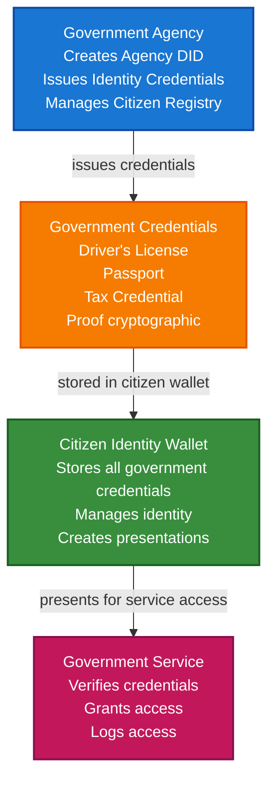

# Government & Digital Identity Scenario

This guide demonstrates how to build a government digital identity system using TrustWeave that enables citizen identity wallets, government-issued credentials, document verification, and cross-border identity verification.

## What You'll Build

By the end of this tutorial, you'll have:

- ✅ Created DIDs for government agencies and citizens
- ✅ Issued government credentials (driver's license, passport, tax credentials)
- ✅ Built citizen identity wallet
- ✅ Implemented document verification system
- ✅ Created service access control
- ✅ Enabled cross-border identity verification
- ✅ Anchored critical identity documents to blockchain

## Big Picture & Significance

### The Digital Government Transformation

Governments worldwide are digitizing citizen services, but face challenges with identity verification, document authenticity, and cross-border recognition. Digital identity systems built on DIDs and VCs provide a foundation for secure, privacy-preserving government services.

**Industry Context**:
- **Market Size**: Global digital identity solutions market projected to reach $49.5 billion by 2026
- **Government Initiatives**: Over 100 countries implementing national digital identity programs
- **Regulatory Drivers**: eIDAS in EU, NIST guidelines in US, Aadhaar in India
- **Citizen Demand**: 73% of citizens want digital government services
- **Cost Savings**: Digital identity can reduce government service costs by 30-50%

**Why This Matters**:
1. **Citizen Convenience**: Access government services from anywhere
2. **Fraud Prevention**: Cryptographic proof prevents document forgery
3. **Privacy**: Citizens control what identity information is shared
4. **Interoperability**: Works across different government agencies
5. **Cross-Border**: Enables international identity verification
6. **Cost Reduction**: Reduces administrative costs significantly

### The Government Identity Challenge

Traditional government identity systems face critical issues:
- **Document Forgery**: Paper documents can be easily forged
- **Siloed Systems**: Different agencies can't verify each other's documents
- **Privacy Concerns**: Centralized databases create privacy risks
- **Cross-Border Issues**: International verification is complex
- **Citizen Burden**: Multiple identity documents for different services
- **Cost**: High costs for document issuance and verification

## Value Proposition

### Problems Solved

1. **Document Authenticity**: Cryptographic proof prevents forgery
2. **Citizen Control**: Citizens own and control their identity credentials
3. **Interoperability**: Standard format works across all government agencies
4. **Privacy**: Selective disclosure protects citizen privacy
5. **Cross-Border**: Enables international identity verification
6. **Efficiency**: Instant verification without manual checks
7. **Cost Reduction**: Reduces document issuance and verification costs
8. **Fraud Prevention**: Tamper-proof credentials prevent identity theft

### Business Benefits

**For Government Agencies**:
- **Cost Savings**: 40-60% reduction in document issuance costs
- **Fraud Reduction**: 80% reduction in document forgery
- **Efficiency**: 10x faster identity verification
- **Interoperability**: Seamless data sharing across agencies
- **Compliance**: Meets eIDAS and other regulatory requirements

**For Citizens**:
- **Convenience**: Access services from any device
- **Privacy**: Control what information is shared
- **Portability**: Identity credentials work across agencies
- **Security**: Reduced risk of identity theft
- **Speed**: Faster service access

**For Service Providers**:
- **Trust**: Verifiable government-issued credentials
- **Efficiency**: Instant identity verification
- **Compliance**: Meets KYC/AML requirements
- **Cost**: Reduced verification costs

### ROI Considerations

- **Document Issuance**: 50% cost reduction
- **Verification**: 90% faster verification process
- **Fraud Prevention**: Saves millions in prevented fraud
- **Citizen Satisfaction**: Improved service delivery
- **Innovation**: Enables new digital services

## Understanding the Problem

Government identity management faces several critical challenges:

1. **Document Security**: Paper documents can be forged or tampered with
2. **Siloed Systems**: Different agencies maintain separate identity systems
3. **Privacy**: Centralized databases create privacy and security risks
4. **Cross-Border**: International identity verification is complex
5. **Citizen Burden**: Multiple documents for different services
6. **Cost**: High costs for document issuance and verification
7. **Fraud**: Identity theft and document forgery

### Real-World Pain Points

**Example 1: Driver's License Verification**
- Current: Manual verification, paper documents, easy to forge
- Problem: Fraud, slow verification, no digital access
- Solution: Verifiable digital driver's license with instant verification

**Example 2: Passport Verification**
- Current: Physical passport, manual border checks
- Problem: Slow border processing, document forgery
- Solution: Digital passport credential with instant verification

**Example 3: Tax Credentials**
- Current: Multiple documents for tax filing
- Problem: Complex, time-consuming, privacy concerns
- Solution: Verifiable tax credentials with selective disclosure

## How It Works: Government Identity Flow



## Key Concepts

### Government Credential Types

1. **Driver's License Credential**: Driving privileges, vehicle classes, expiration
2. **Passport Credential**: Citizenship, travel authorization, biometric data
3. **Tax Credential**: Tax identification, filing status, authorization
4. **Voting Credential**: Eligibility to vote, registration status
5. **Social Benefits Credential**: Eligibility for government benefits
6. **Professional License Credential**: Professional certifications and licenses

### Citizen Identity Wallet

- **Self-Sovereign**: Citizen owns and controls identity
- **Multi-Credential**: Stores credentials from multiple agencies
- **Selective Disclosure**: Share only necessary information
- **Privacy**: Control what information is shared
- **Portability**: Works across all government services

### Trust Anchors

- **Government DIDs**: Trusted government agency identities
- **Verification**: Cryptographic proof of government issuance
- **Revocation**: Government can revoke credentials
- **Audit Trail**: Immutable records of credential issuance

## Prerequisites

- Java 21+
- Kotlin 2.2.21+
- Gradle 8.5+
- Basic understanding of Kotlin and coroutines
- Familiarity with government identity concepts (helpful but not required)

## Step 1: Add Dependencies

Add TrustWeave dependencies to your `build.gradle.kts`. These modules provide DID creation, credential issuance, wallet management, and the in-memory services used in this government scenario.

```kotlin
dependencies {
    // Core TrustWeave modules
    // TrustWeave distribution (includes all modules)
    implementation("com.trustweave:distribution-all:1.0.0-SNAPSHOT")

    // Test kit for in-memory implementations
    testImplementation("com.trustweave:testkit:1.0.0-SNAPSHOT")

    // Kotlinx Serialization
    implementation("org.jetbrains.kotlinx:kotlinx-serialization-json:1.6.0")

    // Coroutines
    implementation("org.jetbrains.kotlinx:kotlinx-coroutines-core:1.7.3")
}
```

**Result:** After syncing, you can run the walkthrough without wiring additional adapters.

## Step 2: Complete Example

Here’s the full government digital identity workflow. Run it once to see every step—from agency issuance to citizen presentation—before diving into the detailed breakdowns.

```kotlin
import com.trustweave.credential.models.VerifiableCredential
import com.trustweave.credential.models.VerifiablePresentation
import com.trustweave.credential.CredentialIssuanceOptions
import com.trustweave.credential.CredentialVerificationOptions
import com.trustweave.credential.PresentationOptions
import com.trustweave.credential.issuer.CredentialIssuer
import com.trustweave.credential.verifier.CredentialVerifier
import com.trustweave.credential.proof.Ed25519ProofGenerator
import com.trustweave.credential.proof.ProofGeneratorRegistry
import com.trustweave.testkit.credential.InMemoryWallet
import com.trustweave.testkit.anchor.InMemoryBlockchainAnchorClient
import com.trustweave.anchor.BlockchainAnchorRegistry
import com.trustweave.testkit.did.DidKeyMockMethod
import com.trustweave.testkit.kms.InMemoryKeyManagementService
import com.trustweave.testkit.anchor.InMemoryBlockchainAnchorClient
import com.trustweave.anchor.BlockchainAnchorRegistry
import com.trustweave.anchor.anchorTyped
import com.trustweave.did.DidMethodRegistry
import kotlinx.coroutines.runBlocking
import kotlinx.serialization.Serializable
import kotlinx.serialization.json.buildJsonObject
import kotlinx.serialization.json.put
import kotlinx.serialization.json.Json
import java.time.Instant
import java.time.temporal.ChronoUnit

@Serializable
data class IdentityDocument(
    val documentType: String,
    val documentNumber: String,
    val citizenDid: String,
    val issuerDid: String,
    val credentialDigest: String
)

fun main() = runBlocking {
    println("=== Government & Digital Identity Scenario ===\n")

    // Step 1: Setup TrustWeave
    println("Step 1: Setting up TrustWeave...")
    val trustWeave = TrustWeave.build {
        factories(
            kmsFactory = TestkitKmsFactory(),
            didMethodFactory = TestkitDidMethodFactory()
        )
        keys { provider(IN_MEMORY); algorithm(ED25519) }
        did { method(KEY) { algorithm(ED25519) } }
        credentials { defaultProofSuite(ProofSuiteId.VC_LD) }
    }

    // Step 2: Create government agency DIDs
    println("\nStep 2: Creating government agency DIDs...")
    import com.trustweave.trust.types.DidCreationResult
    
    val dmvDidResult = trustWeave.createDid { method(KEY) }
    val dmvDid = when (dmvDidResult) {
        is DidCreationResult.Success -> {
            println("DMV DID: ${dmvDidResult.did.value}")
            dmvDidResult.did
        }
        else -> {
            println("Failed to create DMV DID: ${dmvDidResult.reason}")
            return@runBlocking
        }
    }

    val passportOfficeDidResult = trustWeave.createDid { method(KEY) }
    val passportOfficeDid = when (passportOfficeDidResult) {
        is DidCreationResult.Success -> {
            println("Passport Office DID: ${passportOfficeDidResult.did.value}")
            passportOfficeDidResult.did
        }
        else -> {
            println("Failed to create Passport Office DID: ${passportOfficeDidResult.reason}")
            return@runBlocking
        }
    }

    val taxAuthorityDidResult = trustWeave.createDid { method(KEY) }
    val taxAuthorityDid = when (taxAuthorityDidResult) {
        is DidCreationResult.Success -> {
            println("Tax Authority DID: ${taxAuthorityDidResult.did.value}")
            taxAuthorityDidResult.did
        }
        else -> {
            println("Failed to create Tax Authority DID: ${taxAuthorityDidResult.reason}")
            return@runBlocking
        }
    }

    // Step 3: Create citizen DID
    println("\nStep 3: Creating citizen DID...")
    val citizenDidResult = trustWeave.createDid { method(KEY) }
    val citizenDid = when (citizenDidResult) {
        is DidCreationResult.Success -> {
            println("Citizen DID: ${citizenDidResult.did.value}")
            citizenDidResult.did
        }
        else -> {
            println("Failed to create citizen DID: ${citizenDidResult.reason}")
            return@runBlocking
        }
    }

    // Step 4: Create citizen identity wallet
    println("\nStep 4: Creating citizen identity wallet...")
    val walletResult = trustWeave.wallet {
        holderDid(citizenDid.value)
    }
    val citizenWallet = when (walletResult) {
        is com.trustweave.trust.types.WalletCreationResult.Success -> {
            println("Citizen wallet created: ${walletResult.wallet.walletId}")
            walletResult.wallet
        }
        else -> {
            println("Failed to create citizen wallet: ${walletResult.reason}")
            return@runBlocking
        }
    }

    // Step 5: Get key IDs for signing
    val dmvDoc = trustWeave.resolveDid(dmvDid).getOrNull()?.document
        ?: throw IllegalStateException("Failed to resolve DMV DID")
    val dmvKeyId = dmvDoc.verificationMethod.firstOrNull()?.id?.substringAfter("#")
        ?: throw IllegalStateException("No verification method found for DMV")
    
    val passportOfficeDoc = trustWeave.resolveDid(passportOfficeDid).getOrNull()?.document
        ?: throw IllegalStateException("Failed to resolve Passport Office DID")
    val passportOfficeKeyId = passportOfficeDoc.verificationMethod.firstOrNull()?.id?.substringAfter("#")
        ?: throw IllegalStateException("No verification method found for Passport Office")
    
    val taxAuthorityDoc = trustWeave.resolveDid(taxAuthorityDid).getOrNull()?.document
        ?: throw IllegalStateException("Failed to resolve Tax Authority DID")
    val taxAuthorityKeyId = taxAuthorityDoc.verificationMethod.firstOrNull()?.id?.substringAfter("#")
        ?: throw IllegalStateException("No verification method found for Tax Authority")

    // Step 6: Issue driver's license credential
    println("\nStep 6: Issuing driver's license credential...")
    val driversLicenseCredential = createDriversLicenseCredential(
        trustWeave = trustWeave,
        citizenDid = citizenDid.value,
        issuerDid = dmvDid.value,
        issuerKeyId = dmvKeyId,
        licenseNumber = "DL123456789",
        fullName = "John Doe",
        dateOfBirth = "1985-06-15",
        address = "123 Main St, City, State 12345",
        vehicleClasses = listOf("Class C", "Class M"),
        expirationDate = "2028-06-15"
    )

    println("Driver's license credential issued:")
    println("  - License Number: DL123456789")
    println("  - Name: John Doe")
    println("  - Expiration: 2028-06-15")

    // Step 7: Issue passport credential
    println("\nStep 7: Issuing passport credential...")
    val passportCredential = createPassportCredential(
        trustWeave = trustWeave,
        citizenDid = citizenDid.value,
        issuerDid = passportOfficeDid.value,
        issuerKeyId = passportOfficeKeyId,
        passportNumber = "P987654321",
        fullName = "John Doe",
        dateOfBirth = "1985-06-15",
        nationality = "US",
        placeOfBirth = "New York, USA",
        issueDate = "2023-01-01T00:00:00Z",
        expirationDate = "2033-01-01T00:00:00Z"
    )

    println("Passport credential issued")

    // Step 8: Issue tax credential
    println("\nStep 8: Issuing tax credential...")
    val taxCredential = createTaxCredential(
        trustWeave = trustWeave,
        citizenDid = citizenDid.value,
        issuerDid = taxAuthorityDid.value,
        issuerKeyId = taxAuthorityKeyId,
        taxId = "123-45-6789",
        fullName = "John Doe",
        filingStatus = "Single",
        authorizationLevel = "Full"
    )

    println("Tax credential issued")

    // Step 9: Store credentials in citizen wallet
    println("\nStep 9: Storing credentials in citizen wallet...")
    val driversLicenseId = citizenWallet.store(driversLicenseCredential)
    val passportId = citizenWallet.store(passportCredential)
    val taxCredentialId = citizenWallet.store(taxCredential)

    println("Stored ${citizenWallet.list().size} government credentials")

    // Step 10: Organize credentials
    println("\nStep 10: Organizing credentials...")
    val identityCollection = citizenWallet.createCollection(
        name = "Government Identity",
        description = "Government-issued identity credentials"
    )

    citizenWallet.addToCollection(driversLicenseId, identityCollection)
    citizenWallet.addToCollection(passportId, identityCollection)
    citizenWallet.addToCollection(taxCredentialId, identityCollection)

    citizenWallet.tagCredential(driversLicenseId, setOf("driving", "license", "dmv"))
    citizenWallet.tagCredential(passportId, setOf("travel", "passport", "citizenship"))
    citizenWallet.tagCredential(taxCredentialId, setOf("tax", "irs", "financial"))

    println("Created identity collection")

    // Step 11: Verify credentials
    println("\nStep 11: Verifying government credentials...")
    val licenseVerification = trustWeave.verify {
        credential(driversLicenseCredential)
    }

    when (licenseVerification) {
        is com.trustweave.credential.results.VerificationResult.Valid -> {
            println("✅ Driver's license credential is valid!")
            println("  - Proof valid: true")
            println("  - Issuer valid: true")
            println("  - Not expired: true")
        }
        is com.trustweave.credential.results.VerificationResult.Invalid -> {
            println("❌ Driver's license credential is invalid!")
            println("  - Errors: ${licenseVerification.allErrors.joinToString()}")
        }
    }

    // Step 12: Create service access presentation
    println("\nStep 12: Creating service access presentation...")
    // Citizen needs to access government service, presents driver's license
    val servicePresentation = citizenWallet.createPresentation(
        credentialIds = listOf(driversLicenseId),
        holderDid = citizenDid.value,
        options = PresentationOptions(
            holderDid = citizenDid.value,
            proofType = "Ed25519Signature2020",
            challenge = "government-service-${Instant.now().toEpochMilli()}"
        )
    )

    println("Service access presentation created")

    // Step 12: Anchor identity documents to blockchain
    println("\nStep 12: Anchoring identity documents to blockchain...")
    val licenseDigest = com.trustweave.json.DigestUtils.sha256DigestMultibase(
        Json.encodeToJsonElement(
            com.trustweave.credential.models.VerifiableCredential.serializer(),
            driversLicenseCredential
        )
    )

    val identityDoc = IdentityDocument(
        documentType = "drivers-license",
        documentNumber = "DL123456789",
        citizenDid = citizenDid.value,
        issuerDid = dmvDid.value,
        credentialDigest = licenseDigest
    )

    val anchorResult = blockchainRegistry.anchorTyped(
        value = identityDoc,
        serializer = IdentityDocument.serializer(),
        targetChainId = "eip155:1"
    )

    println("Identity document anchored:")
    println("  - Transaction hash: ${anchorResult.ref.txHash}")
    println("  - Provides immutable record")

    // Step 13: Cross-border verification
    println("\nStep 13: Cross-border identity verification...")
    val canVerifyCrossBorder = verifyCrossBorderIdentity(
        trustWeave = trustWeave,
        passportCredential = passportCredential,
        verifyingCountryDid = "did:example:border-control"
    )

    println("Cross-border verification: ${if (canVerifyCrossBorder) "Possible" else "Not possible"}")

    println("\n=== Scenario Complete ===")
}

suspend fun createDriversLicenseCredential(
    trustWeave: TrustWeave,
    citizenDid: String,
    issuerDid: String,
    issuerKeyId: String,
    licenseNumber: String,
    fullName: String,
    dateOfBirth: String,
    address: String,
    vehicleClasses: List<String>,
    expirationDate: String
): VerifiableCredential {
    val result = trustWeave.issue {
        credential {
            id("https://dmv.example.com/licenses/$licenseNumber")
            type("VerifiableCredential", "DriversLicenseCredential", "GovernmentCredential")
            issuer(issuerDid)
            subject {
                id(citizenDid)
                "driversLicense" {
                    "licenseNumber" to licenseNumber
                    "fullName" to fullName
                    "dateOfBirth" to dateOfBirth
                    "address" to address
                    "vehicleClasses" to vehicleClasses
                    "issueDate" to Instant.now().toString()
                    "expirationDate" to expirationDate
                }
            }
            issued(Instant.now())
            expires(Instant.parse(expirationDate))
            schema("https://example.com/schemas/drivers-license.json")
        }
        signedBy(issuerDid = issuerDid, keyId = issuerKeyId)
    }
    
    return when (result) {
        is IssuanceResult.Success -> result.credential
        else -> throw IllegalStateException("Failed to create drivers license credential: ${result.allErrors.joinToString()}")
    }
}

suspend fun createPassportCredential(
    trustWeave: TrustWeave,
    citizenDid: String,
    issuerDid: String,
    issuerKeyId: String,
    passportNumber: String,
    fullName: String,
    dateOfBirth: String,
    nationality: String,
    placeOfBirth: String,
    issueDate: String,
    expirationDate: String
): VerifiableCredential {
    val result = trustWeave.issue {
        credential {
            id("https://passport.example.com/passports/$passportNumber")
            type("VerifiableCredential", "PassportCredential", "GovernmentCredential")
            issuer(issuerDid)
            subject {
                id(citizenDid)
                "passport" {
                    "passportNumber" to passportNumber
                    "fullName" to fullName
                    "dateOfBirth" to dateOfBirth
                    "nationality" to nationality
                    "placeOfBirth" to placeOfBirth
                    "issueDate" to issueDate
                    "expirationDate" to expirationDate
                }
            }
            issued(Instant.parse(issueDate))
            expires(Instant.parse(expirationDate))
            schema("https://example.com/schemas/passport.json")
        }
        signedBy(issuerDid = issuerDid, keyId = issuerKeyId)
    }
    
    return when (result) {
        is IssuanceResult.Success -> result.credential
        else -> throw IllegalStateException("Failed to create passport credential: ${result.allErrors.joinToString()}")
    }
}

suspend fun createTaxCredential(
    trustWeave: TrustWeave,
    citizenDid: String,
    issuerDid: String,
    issuerKeyId: String,
    taxId: String,
    fullName: String,
    filingStatus: String,
    authorizationLevel: String
): VerifiableCredential {
    val result = trustWeave.issue {
        credential {
            id("https://tax.example.com/credentials/$taxId")
            type("VerifiableCredential", "TaxCredential", "GovernmentCredential")
            issuer(issuerDid)
            subject {
                id(citizenDid)
                "taxCredential" {
                    "taxId" to taxId
                    "fullName" to fullName
                    "filingStatus" to filingStatus
                    "authorizationLevel" to authorizationLevel
                    "issueDate" to Instant.now().toString()
                }
            }
            issued(Instant.now())
            // Tax credentials typically don't expire - no expires() call
            schema("https://example.com/schemas/tax-credential.json")
        }
        signedBy(issuerDid = issuerDid, keyId = issuerKeyId)
    }
    
    return when (result) {
        is IssuanceResult.Success -> result.credential
        else -> throw IllegalStateException("Failed to create tax credential: ${result.allErrors.joinToString()}")
    }
}

suspend fun verifyCrossBorderIdentity(
    trustWeave: TrustWeave,
    passportCredential: VerifiableCredential,
    verifyingCountryDid: String
): Boolean {
    // Verify passport credential is valid
    val verification = trustWeave.verify {
        credential(passportCredential)
    }

    if (verification !is com.trustweave.credential.results.VerificationResult.Valid) return false

    // Check if passport is from recognized issuing country
    val issuerDid = passportCredential.issuer
    // In production, check against list of trusted country DIDs
    return true // Simplified for example
}
```

## Extensive Step-by-Step Breakdown

### Step 1: Setup and Initialization

**Purpose**: Initialize government identity system with proper key management for multiple agencies.

**Detailed Explanation**:
1. **Multiple Agency KMS**: Separate key management for DMV, passport office, tax authority ensures proper separation
2. **Citizen KMS**: Separate key management for citizen ensures citizen control
3. **DID Method Registration**: Register DID method for creating identities
4. **Blockchain Setup**: Initialize blockchain for anchoring critical identity documents

**Why This Matters**: Government identity requires the highest security standards. Multiple KMS instances ensure proper key isolation and security.

### Step 2: Create Government Agency DIDs

**Purpose**: Establish verifiable identities for government agencies.

**Detailed Explanation**:
- **DMV DID**: Department of Motor Vehicles identity for issuing driver's licenses
- **Passport Office DID**: Passport office identity for issuing passports
- **Tax Authority DID**: Tax authority identity for tax credentials

**Key Considerations**:
- Government DIDs serve as trust anchors
- Must be well-known and resolvable
- Cryptographic proof of government authority
- Can be verified by citizens and other agencies

### Step 3: Create Citizen DID

**Purpose**: Establish citizen's self-sovereign identity.

**Detailed Explanation**:
- Citizen DID provides persistent identity
- Not tied to any specific government system
- Works across all government services
- Citizen controls the DID

**Benefits**:
- Single identity across all services
- Not dependent on any single agency
- Portable across jurisdictions
- Privacy-preserving

### Step 4: Create Citizen Identity Wallet

**Purpose**: Provide secure storage for citizen's government credentials.

**Detailed Explanation**:
- Stores all government-issued credentials
- Provides organization capabilities
- Enables selective disclosure
- Citizen controls access

**Privacy Benefits**:
- Citizen owns their identity data
- Can control what information is shared
- Selective disclosure minimizes data exposure
- Audit trail of credential usage

### Step 5: Issue Driver's License Credential

**Purpose**: Create verifiable driver's license credential.

**Detailed Explanation**:
1. **License Data**: License number, name, DOB, address, vehicle classes
2. **Credential Structure**: Follows W3C VC standard
3. **Proof Generation**: Cryptographic signature from DMV
4. **Expiration**: License expires on specified date

**Security Features**:
- Tamper-proof cryptographic proof
- Verifiable issuer (DMV)
- Expiration prevents misuse
- Can be revoked if license is suspended

### Step 6: Issue Passport Credential

**Purpose**: Create verifiable passport credential.

**Detailed Explanation**:
1. **Passport Data**: Passport number, name, DOB, nationality, place of birth
2. **Travel Authorization**: Proves citizenship and travel eligibility
3. **Expiration**: Passport expires on specified date
4. **Cross-Border**: Can be verified internationally

**Use Cases**:
- Border control verification
- International travel
- Identity verification abroad
- Citizenship proof

### Step 7: Issue Tax Credential

**Purpose**: Create verifiable tax credential.

**Detailed Explanation**:
1. **Tax Information**: Tax ID, name, filing status
2. **Authorization Level**: Level of tax authority access
3. **No Expiration**: Tax credentials typically don't expire
4. **Service Access**: Enables tax service access

**Use Cases**:
- Tax filing
- Tax service access
- Financial service KYC
- Government benefit applications

### Step 8: Store Credentials in Citizen Wallet

**Purpose**: Enable citizen to manage their identity credentials.

**Detailed Explanation**:
- Store all government credentials in one place
- Citizen has full control
- Can organize and query credentials
- Enables selective sharing

**Citizen Benefits**:
- Single source of truth for identity
- Easy access from any device
- Can share with any service provider
- Complete identity history

### Step 9: Organize Credentials

**Purpose**: Enable efficient credential management.

**Detailed Explanation**:
1. **Collections**: Group related credentials
2. **Tags**: Add metadata for easy searching
3. **Organization Benefits**: Quick access to specific credential types

**Real-World Value**:
- Quick access to driver's license
- Find passport for travel
- Organize by service type
- Track credential expiration

### Step 10: Verify Government Credentials

**Purpose**: Ensure government credentials are valid before use.

**Detailed Explanation**:
1. **Proof Verification**: Verify cryptographic signature
2. **Issuer Verification**: Verify government agency DID
3. **Expiration Check**: Ensure credential hasn't expired
4. **Revocation Check**: Verify credential hasn't been revoked
5. **Schema Validation**: Validate credential structure

**Security Importance**:
- Prevents use of tampered credentials
- Ensures credentials from trusted agencies
- Prevents use of expired credentials
- Maintains data integrity

### Step 11: Create Service Access Presentation

**Purpose**: Enable citizen to access government services.

**Detailed Explanation**:
1. **Credential Selection**: Select appropriate credential for service
2. **Presentation Creation**: Create verifiable presentation
3. **Service Access**: Present to government service
4. **Verification**: Service verifies credential

**Use Cases**:
- Access government portal
- Apply for benefits
- File taxes
- Renew licenses

### Step 12: Anchor Identity Documents to Blockchain

**Purpose**: Create immutable record of identity document issuance.

**Detailed Explanation**:
1. **Document Record**: Create structured record of identity document
2. **Blockchain Anchoring**: Anchor to blockchain for immutability
3. **Audit Trail**: Provides permanent record
4. **Non-Repudiation**: Government cannot deny issuance

**Benefits**:
- Immutable record
- Timestamped issuance
- Cannot be tampered with
- Meets regulatory requirements

### Step 13: Cross-Border Verification

**Purpose**: Enable international identity verification.

**Detailed Explanation**:
1. **Passport Verification**: Verify passport credential
2. **Issuer Recognition**: Check if issuing country is recognized
3. **Credential Validity**: Verify credential is valid
4. **Cross-Border Access**: Grant access based on verification

**Use Cases**:
- Border control
- International travel
- Cross-border services
- International identity verification

## Advanced Features

### Multi-Agency Credential Aggregation

Aggregate credentials from multiple agencies:

```kotlin
fun aggregateGovernmentCredentials(
    citizenWallet: Wallet
): VerifiablePresentation {
    val allCredentials = citizenWallet.list()
    val governmentCredentials = allCredentials.filter {
        it.type.contains("GovernmentCredential")
    }

    return citizenWallet.createPresentation(
        credentialIds = governmentCredentials.mapNotNull { it.id },
        holderDid = citizenWallet.holderDid!!,
        options = PresentationOptions(
            holderDid = citizenWallet.holderDid!!,
            proofType = "Ed25519Signature2020"
        )
    )
}
```

### Selective Identity Disclosure

Share only necessary identity information:

```kotlin
fun createSelectiveIdentityPresentation(
    citizenWallet: Wallet,
    serviceType: String
): VerifiablePresentation {
    return when (serviceType) {
        "age-verification" -> {
            // Share only age, not full identity
            citizenWallet.createSelectiveDisclosure(
                credentialIds = listOf("drivers-license-id"),
                disclosedFields = listOf("driversLicense.dateOfBirth"),
                holderDid = citizenWallet.holderDid!!,
                options = PresentationOptions(...)
            )
        }
        "address-verification" -> {
            // Share only address
            citizenWallet.createSelectiveDisclosure(
                credentialIds = listOf("drivers-license-id"),
                disclosedFields = listOf("driversLicense.address"),
                holderDid = citizenWallet.holderDid!!,
                options = PresentationOptions(...)
            )
        }
        else -> {
            // Full identity presentation
            citizenWallet.createPresentation(...)
        }
    }
}
```

### Credential Renewal

Renew expired credentials:

```kotlin
fun renewDriversLicense(
    oldCredential: VerifiableCredential,
    newExpirationDate: String,
    issuerDid: String,
    issuer: CredentialIssuer
): VerifiableCredential {
    // Create new credential based on old one
    val renewalCredential = oldCredential.copy(
        expirationDate = newExpirationDate,
        issuanceDate = Instant.now().toString()
    )

    // Issue new credential
    return issuer.issue(
        credential = renewalCredential,
        issuerDid = issuerDid,
        keyId = "issuer-key",
        options = CredentialIssuanceOptions(proofType = "Ed25519Signature2020")
    )
}
```

## Real-World Use Cases

### 1. Digital Driver's License

**Scenario**: Citizen uses digital driver's license for age verification at store.

**Implementation**:

```kotlin
fun verifyAgeWithDriversLicense(
    citizenWallet: Wallet,
    minimumAge: Int
): Boolean {
    val license = citizenWallet.query {
        byType("DriversLicenseCredential")
        valid()
    }.firstOrNull() ?: return false

    val dateOfBirth = license.credentialSubject.jsonObject["driversLicense"]?.jsonObject
        ?.get("dateOfBirth")?.jsonPrimitive?.content
        ?: return false

    val age = java.time.Period.between(
        java.time.LocalDate.parse(dateOfBirth),
        java.time.LocalDate.now()
    ).years

    return age >= minimumAge
}
```

### 2. Passport Verification at Border

**Scenario**: Border control verifies passport credential.

**Implementation**:

```kotlin
fun verifyPassportAtBorder(
    passportCredential: VerifiableCredential,
    borderControlDid: String
): BorderVerificationResult {
    val verifier = CredentialVerifier(
        didResolver = CredentialDidResolver { did ->
            didRegistry.resolve(did).toCredentialDidResolution()
        }
    )

    val verification = verifier.verify(
        credential = passportCredential,
        options = CredentialVerificationOptions(
            checkRevocation = true,
            checkExpiration = true,
            validateSchema = true
        )
    )

    if (!verification.valid) {
        return BorderVerificationResult(
            authorized = false,
            reason = verification.errors.joinToString()
        )
    }

    // Check if passport is from recognized country
    val nationality = passportCredential.credentialSubject.jsonObject["passport"]?.jsonObject
        ?.get("nationality")?.jsonPrimitive?.content

    return BorderVerificationResult(
        authorized = true,
        nationality = nationality,
        expirationDate = passportCredential.expirationDate
    )
}

data class BorderVerificationResult(
    val authorized: Boolean,
    val reason: String? = null,
    val nationality: String? = null,
    val expirationDate: String? = null
)
```

### 3. Tax Filing

**Scenario**: Citizen files taxes using tax credential.

**Implementation**:

```kotlin
fun fileTaxesWithCredential(
    citizenWallet: Wallet,
    taxAuthorityDid: String,
    taxData: TaxFilingData
): VerifiablePresentation {
    val taxCredential = citizenWallet.query {
        byType("TaxCredential")
        valid()
    }.firstOrNull() ?: throw IllegalArgumentException("No valid tax credential")

    // Create presentation with tax credential
    return citizenWallet.createPresentation(
        credentialIds = listOfNotNull(taxCredential.id),
        holderDid = citizenWallet.holderDid!!,
        options = PresentationOptions(
            holderDid = citizenWallet.holderDid!!,
            proofType = "Ed25519Signature2020",
            challenge = "tax-filing-${Instant.now().toEpochMilli()}"
        )
    )
}

data class TaxFilingData(
    val income: Double,
    val deductions: Double,
    val taxYear: String
)
```

## Benefits

1. **Document Authenticity**: Cryptographic proof prevents forgery
2. **Citizen Control**: Citizens own and control their identity
3. **Interoperability**: Standard format works across all agencies
4. **Privacy**: Selective disclosure protects citizen privacy
5. **Cross-Border**: Enables international verification
6. **Efficiency**: Instant verification without manual checks
7. **Cost Reduction**: Reduces document issuance costs
8. **Fraud Prevention**: Tamper-proof credentials prevent identity theft
9. **Convenience**: Access services from any device
10. **Security**: Reduced risk of identity theft

## Best Practices

1. **Trust Anchors**: Use well-known government DIDs as trust anchors
2. **Expiration Management**: Set appropriate expiration dates
3. **Revocation**: Enable credential revocation
4. **Selective Disclosure**: Always use selective disclosure when possible
5. **Audit Logging**: Log all credential usage
6. **Schema Validation**: Validate credential structure
7. **Key Management**: Use secure key storage
8. **Error Handling**: Handle verification failures gracefully
9. **Citizen Education**: Educate citizens on credential management
10. **Interoperability**: Follow standard credential formats

## Next Steps

- Learn about [Wallet API Tutorial](../tutorials/wallet-api-tutorial.md)
- Explore [Healthcare & Medical Records Scenario](healthcare-medical-records-scenario.md) for related privacy-preserving credentials
- Check out [Financial Services & KYC Scenario](financial-services-kyc-scenario.md) for identity verification
- Review [Core Concepts: DIDs](../core-concepts/dids.md) for identity management
- Study [Core Concepts: Verifiable Credentials](../core-concepts/verifiable-credentials.md) for credential details


