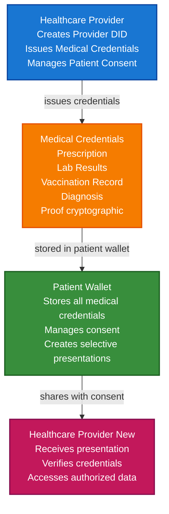

# Healthcare & Medical Records Scenario

This guide demonstrates how to build a healthcare credential system using TrustWeave that enables patient privacy, secure medical record sharing, HIPAA compliance, and cross-provider interoperability.

## What You'll Build

By the end of this tutorial, you'll have:

- ✅ Created DIDs for patients, healthcare providers, and medical institutions
- ✅ Issued medical credentials (prescriptions, lab results, vaccination records)
- ✅ Implemented selective disclosure for privacy-preserving data sharing
- ✅ Built consent management system
- ✅ Created cross-provider credential sharing workflow
- ✅ Anchored critical medical records to blockchain
- ✅ Verified medical credentials cryptographically

## Big Picture & Significance

### The Healthcare Data Challenge

Healthcare data is among the most sensitive personal information, yet current systems struggle with interoperability, privacy, and patient control. The healthcare industry faces a critical need for secure, patient-controlled medical data sharing.

**Industry Context**:
- **Market Size**: Global healthcare data analytics market projected to reach $84.2 billion by 2028
- **Regulatory Pressure**: HIPAA, GDPR, and other regulations require strict data protection
- **Interoperability Crisis**: Healthcare systems can't easily share patient data across providers
- **Patient Rights**: Growing demand for patient-controlled health data
- **Cost Impact**: Poor interoperability costs $30+ billion annually in the US alone

**Why This Matters**:
1. **Patient Safety**: Immediate access to medical history prevents medical errors
2. **Privacy**: Patients need granular control over who sees what medical data
3. **Interoperability**: Seamless data sharing across healthcare providers
4. **Compliance**: Meet HIPAA and GDPR requirements with cryptographic guarantees
5. **Research**: Enable privacy-preserving medical research with patient consent

### The Current Healthcare Data Problem

Traditional healthcare systems face critical issues:
- **Siloed Data**: Medical records locked in proprietary systems
- **Privacy Breaches**: Centralized databases are attractive targets
- **No Patient Control**: Patients can't easily access or share their own data
- **Interoperability Failures**: Different systems can't communicate
- **Compliance Burden**: Complex HIPAA compliance requirements

## Value Proposition

### Problems Solved

1. **Patient Privacy**: Selective disclosure allows sharing only necessary information
2. **Interoperability**: Standard DID/VC format works across all healthcare systems
3. **Patient Control**: Patients own and control their medical credentials
4. **Compliance**: Cryptographic proof meets HIPAA audit requirements
5. **Security**: Decentralized storage reduces breach risk
6. **Efficiency**: Instant verification without API calls to source systems
7. **Portability**: Medical records follow patients across providers

### Business Benefits

**For Healthcare Providers**:
- **Reduced Costs**: Eliminate expensive interoperability infrastructure
- **Faster Care**: Instant access to patient history
- **Compliance**: Automated HIPAA audit trails
- **Better Outcomes**: Complete medical history improves care quality

**For Patients**:
- **Privacy**: Control what medical information is shared
- **Convenience**: Access medical records from any device
- **Portability**: Records work across all healthcare providers
- **Transparency**: See who accessed their data and when

**For Healthcare Systems**:
- **Interoperability**: Standard format works across all systems
- **Security**: Reduced breach risk with decentralized storage
- **Innovation**: Enable new patient-centric applications
- **Compliance**: Automated regulatory compliance

### ROI Considerations

- **Interoperability Savings**: 40-60% reduction in integration costs
- **Compliance**: 50% reduction in HIPAA compliance costs
- **Patient Safety**: Reduced medical errors save lives and costs
- **Efficiency**: 10x faster medical record access
- **Innovation**: Enable new revenue streams from patient data applications

## Understanding the Problem

Healthcare data management faces several critical challenges:

1. **Data Silos**: Medical records are trapped in proprietary systems
2. **Privacy Concerns**: Patients have little control over their data
3. **Interoperability**: Different systems can't share data easily
4. **Security**: Centralized databases are vulnerable to breaches
5. **Compliance**: Complex HIPAA requirements are difficult to meet
6. **Patient Access**: Patients struggle to access their own records
7. **Consent Management**: No granular consent for data sharing

### Real-World Pain Points

**Example 1: Emergency Care**
- Current: Medical history unavailable, leading to delayed or incorrect treatment
- Problem: Life-threatening delays, medical errors
- Solution: Instant access to critical medical credentials (allergies, medications, conditions)

**Example 2: Specialist Referrals**
- Current: Paper records or incomplete digital transfers
- Problem: Specialists lack complete medical history
- Solution: Patient-controlled sharing of relevant medical credentials

**Example 3: Insurance Claims**
- Current: Manual submission of medical records
- Problem: Slow processing, privacy concerns
- Solution: Verifiable credentials with selective disclosure

## How It Works: Healthcare Credential Flow



## Key Concepts

### Medical Credential Types

1. **Prescription Credential**: Medication prescriptions with dosage, frequency, duration
2. **Lab Result Credential**: Laboratory test results with reference ranges
3. **Vaccination Credential**: Vaccination records with dates, types, lot numbers
4. **Diagnosis Credential**: Medical diagnoses with ICD codes
5. **Treatment Credential**: Treatment plans and procedures
6. **Consent Credential**: Patient consent for data sharing

### Patient Privacy

- **Selective Disclosure**: Share only specific fields (e.g., vaccination status without dates)
- **Consent Management**: Granular consent for different data types
- **Access Logging**: Track who accessed what data and when
- **Revocation**: Revoke consent at any time

### HIPAA Compliance

- **Audit Trails**: Immutable records of data access
- **Minimum Necessary**: Share only required information
- **Patient Rights**: Patients control their data
- **Security**: Cryptographic protection of sensitive data

## Prerequisites

- Java 21+
- Kotlin 2.2.0+
- Gradle 8.5+
- Basic understanding of Kotlin and coroutines
- Familiarity with healthcare data concepts (HL7, FHIR helpful but not required)
- Understanding of HIPAA basics (helpful but not required)

## Step 1: Add Dependencies

Add TrustWeave dependencies to your `build.gradle.kts`. These cover DID management, credential issuance, wallet storage, and the in-memory services used in the healthcare walkthrough.

```kotlin
dependencies {
    // Core TrustWeave modules
    implementation("com.trustweave:trustweave-core:1.0.0-SNAPSHOT")
    implementation("com.trustweave:trustweave-json:1.0.0-SNAPSHOT")
    implementation("com.trustweave:trustweave-kms:1.0.0-SNAPSHOT")
    implementation("com.trustweave:trustweave-did:1.0.0-SNAPSHOT")
    implementation("com.trustweave:trustweave-anchor:1.0.0-SNAPSHOT")
    
    // Test kit for in-memory implementations
    implementation("com.trustweave:trustweave-testkit:1.0.0-SNAPSHOT")
    
    // Kotlinx Serialization
    implementation("org.jetbrains.kotlinx:kotlinx-serialization-json:1.6.0")
    
    // Coroutines
    implementation("org.jetbrains.kotlinx:kotlinx-coroutines-core:1.7.3")
}
```

**Result:** Once the dependencies sync you can run every snippet in this guide without additional setup.

## Step 2: Complete Example

Here’s the full healthcare credential management flow. Execute it first to see the big picture, then read on for step-by-step explanations.

```kotlin
import com.trustweave.credential.models.VerifiableCredential
import com.trustweave.credential.models.VerifiablePresentation
import com.trustweave.credential.CredentialIssuanceOptions
import com.trustweave.credential.CredentialVerificationOptions
import com.trustweave.credential.PresentationOptions
import com.trustweave.credential.issuer.CredentialIssuer
import com.trustweave.credential.verifier.CredentialVerifier
import com.trustweave.credential.proof.Ed25519ProofGenerator
import com.trustweave.credential.proof.ProofGeneratorRegistry
import com.trustweave.testkit.credential.InMemoryWallet
import com.trustweave.testkit.did.DidKeyMockMethod
import com.trustweave.testkit.kms.InMemoryKeyManagementService
import com.trustweave.testkit.anchor.InMemoryBlockchainAnchorClient
import com.trustweave.anchor.BlockchainAnchorRegistry
import com.trustweave.anchor.anchorTyped
import com.trustweave.did.DidMethodRegistry
import kotlinx.coroutines.runBlocking
import kotlinx.serialization.Serializable
import kotlinx.serialization.json.buildJsonObject
import kotlinx.serialization.json.put
import kotlinx.serialization.json.Json
import java.time.Instant
import java.time.temporal.ChronoUnit

@Serializable
data class ConsentRecord(
    val patientDid: String,
    val providerDid: String,
    val dataTypes: List<String>,
    val purpose: String,
    val expirationDate: String,
    val credentialDigest: String
)

fun main() = runBlocking {
    println("=== Healthcare & Medical Records Scenario ===\n")
    
    // Step 1: Setup services
    println("Step 1: Setting up services...")
    val hospitalKms = InMemoryKeyManagementService()
    val patientKms = InMemoryKeyManagementService()
    val specialistKms = InMemoryKeyManagementService()
    
    val didMethod = DidKeyMockMethod(hospitalKms)
    val didRegistry = DidMethodRegistry().apply { register(didMethod) }
    
    // Setup blockchain for anchoring critical records
    val anchorClient = InMemoryBlockchainAnchorClient("eip155:1", emptyMap())
    val blockchainRegistry = BlockchainAnchorRegistry().apply {
        register("eip155:1", anchorClient)
    }
    
    // Step 2: Create DIDs
    println("\nStep 2: Creating DIDs...")
    val hospitalDid = didMethod.createDid()
    println("Hospital DID: ${hospitalDid.id}")
    
    val patientDid = didMethod.createDid()
    println("Patient DID: ${patientDid.id}")
    
    val specialistDid = didMethod.createDid()
    println("Specialist DID: ${specialistDid.id}")
    
    // Step 3: Create patient wallet
    println("\nStep 3: Creating patient wallet...")
    val patientWallet = InMemoryWallet(
        walletDid = patientDid.id,
        holderDid = patientDid.id
    )
    println("Patient wallet created: ${patientWallet.walletId}")
    
    // Step 4: Issue prescription credential
    println("\nStep 4: Issuing prescription credential...")
    val prescriptionCredential = createPrescriptionCredential(
        patientDid = patientDid.id,
        providerDid = hospitalDid.id,
        medication = "Lisinopril",
        dosage = "10mg",
        frequency = "Once daily",
        duration = "30 days",
        prescribingDoctor = "Dr. Smith"
    )
    
    val hospitalKey = hospitalKms.generateKey("Ed25519")
    val proofGenerator = Ed25519ProofGenerator(
        signer = { data, keyId -> hospitalKms.sign(keyId, data) },
        getPublicKeyId = { keyId -> hospitalKey.id }
    )
    val proofRegistry = ProofGeneratorRegistry().apply { register(proofGenerator) }
    
    val credentialIssuer = CredentialIssuer(
        proofGenerator = proofGenerator,
        resolveDid = { did -> didRegistry.resolve(did) != null },
        proofRegistry = proofRegistry
    )
    
    val issuedPrescription = credentialIssuer.issue(
        credential = prescriptionCredential,
        issuerDid = hospitalDid.id,
        keyId = hospitalKey.id,
        options = CredentialIssuanceOptions(proofType = "Ed25519Signature2020")
    )
    
    println("Prescription credential issued:")
    println("  - Medication: Lisinopril 10mg")
    println("  - Has proof: ${issuedPrescription.proof != null}")
    
    // Step 5: Issue lab results credential
    println("\nStep 5: Issuing lab results credential...")
    val labResultsCredential = createLabResultsCredential(
        patientDid = patientDid.id,
        providerDid = hospitalDid.id,
        testName = "Complete Blood Count",
        results = mapOf(
            "WBC" to "7.2",
            "RBC" to "4.8",
            "Hemoglobin" to "14.5",
            "Platelets" to "250"
        ),
        referenceRanges = mapOf(
            "WBC" to "4.0-11.0",
            "RBC" to "4.5-5.5",
            "Hemoglobin" to "12.0-16.0",
            "Platelets" to "150-450"
        ),
        labDate = Instant.now().toString()
    )
    
    val issuedLabResults = credentialIssuer.issue(
        credential = labResultsCredential,
        issuerDid = hospitalDid.id,
        keyId = hospitalKey.id,
        options = CredentialIssuanceOptions(proofType = "Ed25519Signature2020")
    )
    
    println("Lab results credential issued")
    
    // Step 6: Issue vaccination credential
    println("\nStep 6: Issuing vaccination credential...")
    val vaccinationCredential = createVaccinationCredential(
        patientDid = patientDid.id,
        providerDid = hospitalDid.id,
        vaccineType = "COVID-19",
        manufacturer = "Pfizer-BioNTech",
        lotNumber = "EW0167",
        administrationDate = "2023-03-15",
        administeringProvider = "Dr. Johnson"
    )
    
    val issuedVaccination = credentialIssuer.issue(
        credential = vaccinationCredential,
        issuerDid = hospitalDid.id,
        keyId = hospitalKey.id,
        options = CredentialIssuanceOptions(proofType = "Ed25519Signature2020")
    )
    
    println("Vaccination credential issued")
    
    // Step 7: Store credentials in patient wallet
    println("\nStep 7: Storing credentials in patient wallet...")
    val prescriptionId = patientWallet.store(issuedPrescription)
    val labResultsId = patientWallet.store(issuedLabResults)
    val vaccinationId = patientWallet.store(issuedVaccination)
    
    println("Stored ${patientWallet.list().size} medical credentials")
    
    // Step 8: Organize credentials
    println("\nStep 8: Organizing credentials...")
    val prescriptionsCollection = patientWallet.createCollection(
        name = "Prescriptions",
        description = "Medication prescriptions"
    )
    val labResultsCollection = patientWallet.createCollection(
        name = "Lab Results",
        description = "Laboratory test results"
    )
    val vaccinationsCollection = patientWallet.createCollection(
        name = "Vaccinations",
        description = "Vaccination records"
    )
    
    patientWallet.addToCollection(prescriptionId, prescriptionsCollection)
    patientWallet.addToCollection(labResultsId, labResultsCollection)
    patientWallet.addToCollection(vaccinationId, vaccinationsCollection)
    
    // Tag credentials
    patientWallet.tagCredential(prescriptionId, setOf("medication", "prescription", "active"))
    patientWallet.tagCredential(labResultsId, setOf("lab", "test-results", "blood-work"))
    patientWallet.tagCredential(vaccinationId, setOf("vaccination", "immunization", "covid-19"))
    
    println("Created ${patientWallet.listCollections().size} collections")
    
    // Step 9: Create consent for data sharing
    println("\nStep 9: Creating consent credential...")
    val consentCredential = createConsentCredential(
        patientDid = patientDid.id,
        providerDid = specialistDid.id,
        authorizedDataTypes = listOf("lab-results", "diagnosis"),
        purpose = "Specialist consultation",
        expirationDate = Instant.now().plus(90, ChronoUnit.DAYS).toString()
    )
    
    val issuedConsent = credentialIssuer.issue(
        credential = consentCredential,
        issuerDid = patientDid.id, // Patient issues their own consent
        keyId = patientKms.generateKey("Ed25519").id,
        options = CredentialIssuanceOptions(proofType = "Ed25519Signature2020")
    )
    
    val consentId = patientWallet.store(issuedConsent)
    println("Consent credential created and stored")
    
    // Step 10: Create selective disclosure presentation
    println("\nStep 10: Creating selective disclosure presentation...")
    // Patient shares only lab results with specialist (not prescriptions or full vaccination details)
    val selectivePresentation = patientWallet.createSelectiveDisclosure(
        credentialIds = listOf(labResultsId),
        disclosedFields = listOf(
            "testName",
            "results.WBC",
            "results.RBC",
            "results.Hemoglobin"
            // Platelets and reference ranges NOT disclosed
        ),
        holderDid = patientDid.id,
        options = PresentationOptions(
            holderDid = patientDid.id,
            proofType = "Ed25519Signature2020",
            challenge = "specialist-consultation-${Instant.now().toEpochMilli()}"
        )
    )
    
    println("Selective disclosure presentation created:")
    println("  - Shared: Lab results (partial)")
    println("  - Not shared: Prescriptions, full vaccination details")
    
    // Step 11: Verify credentials
    println("\nStep 11: Verifying medical credentials...")
    val verifier = CredentialVerifier(
        didResolver = CredentialDidResolver { did ->
            didRegistry.resolve(did).toCredentialDidResolution()
        }
    )
    
    val prescriptionVerification = verifier.verify(
        credential = issuedPrescription,
        options = CredentialVerificationOptions(
            checkRevocation = true,
            checkExpiration = true,
            validateSchema = true
        )
    )
    
    if (prescriptionVerification.valid) {
        println("✅ Prescription credential is valid!")
    } else {
        println("❌ Prescription verification failed:")
        prescriptionVerification.errors.forEach { println("  - $it") }
    }
    
    // Step 12: Anchor critical records to blockchain
    println("\nStep 12: Anchoring critical records to blockchain...")
    val prescriptionDigest = com.trustweave.json.DigestUtils.sha256DigestMultibase(
        Json.encodeToJsonElement(
            com.trustweave.credential.models.VerifiableCredential.serializer(),
            issuedPrescription
        )
    )
    
    val consentRecord = ConsentRecord(
        patientDid = patientDid.id,
        providerDid = specialistDid.id,
        dataTypes = listOf("lab-results", "diagnosis"),
        purpose = "Specialist consultation",
        expirationDate = Instant.now().plus(90, ChronoUnit.DAYS).toString(),
        credentialDigest = prescriptionDigest
    )
    
    val anchorResult = blockchainRegistry.anchorTyped(
        value = consentRecord,
        serializer = ConsentRecord.serializer(),
        targetChainId = "eip155:1"
    )
    
    println("Consent record anchored:")
    println("  - Transaction hash: ${anchorResult.ref.txHash}")
    println("  - Provides HIPAA audit trail")
    
    // Step 13: Query medical credentials
    println("\nStep 13: Querying medical credentials...")
    val activePrescriptions = patientWallet.query {
        byType("PrescriptionCredential")
        valid()
    }
    println("Active prescriptions: ${activePrescriptions.size}")
    
    val recentLabResults = patientWallet.query {
        byType("LabResultsCredential")
        valid()
    }
    println("Recent lab results: ${recentLabResults.size}")
    
    // Step 14: Wallet statistics
    println("\nStep 14: Patient wallet statistics...")
    val stats = patientWallet.getStatistics()
    println("""
        Total medical credentials: ${stats.totalCredentials}
        Valid credentials: ${stats.validCredentials}
        Collections: ${stats.collectionsCount}
        Tags: ${stats.tagsCount}
    """.trimIndent())
    
    println("\n=== Scenario Complete ===")
}

**Result:** The program prints each milestone—DID creation, issuance, wallet storage, verification, anchoring—ending with a success message. Use that console output as your baseline when customising the scenario.

fun createPrescriptionCredential(
    patientDid: String,
    providerDid: String,
    medication: String,
    dosage: String,
    frequency: String,
    duration: String,
    prescribingDoctor: String
): VerifiableCredential {
    return VerifiableCredential(
        id = "https://hospital.example.com/prescriptions/${patientDid.substringAfterLast(":")}-${Instant.now().toEpochMilli()}",
        type = listOf("VerifiableCredential", "PrescriptionCredential", "MedicalCredential"),
        issuer = providerDid,
        credentialSubject = buildJsonObject {
            put("id", patientDid)
            put("prescription", buildJsonObject {
                put("medication", medication)
                put("dosage", dosage)
                put("frequency", frequency)
                put("duration", duration)
                put("prescribingDoctor", prescribingDoctor)
                put("prescriptionDate", Instant.now().toString())
            })
        },
        issuanceDate = Instant.now().toString(),
        expirationDate = Instant.now().plus(30, ChronoUnit.DAYS).toString(),
        credentialSchema = com.trustweave.credential.models.CredentialSchema(
            id = "https://example.com/schemas/prescription.json",
            type = "JsonSchemaValidator2018",
            schemaFormat = com.trustweave.spi.SchemaFormat.JSON_SCHEMA
        )
    )
}

fun createLabResultsCredential(
    patientDid: String,
    providerDid: String,
    testName: String,
    results: Map<String, String>,
    referenceRanges: Map<String, String>,
    labDate: String
): VerifiableCredential {
    return VerifiableCredential(
        id = "https://hospital.example.com/lab-results/${patientDid.substringAfterLast(":")}-${Instant.now().toEpochMilli()}",
        type = listOf("VerifiableCredential", "LabResultsCredential", "MedicalCredential"),
        issuer = providerDid,
        credentialSubject = buildJsonObject {
            put("id", patientDid)
            put("labResults", buildJsonObject {
                put("testName", testName)
                put("labDate", labDate)
                put("results", buildJsonObject {
                    results.forEach { (key, value) ->
                        put(key, value)
                    }
                })
                put("referenceRanges", buildJsonObject {
                    referenceRanges.forEach { (key, value) ->
                        put(key, value)
                    }
                })
            })
        },
        issuanceDate = Instant.now().toString(),
        expirationDate = null, // Lab results don't expire
        credentialSchema = com.trustweave.credential.models.CredentialSchema(
            id = "https://example.com/schemas/lab-results.json",
            type = "JsonSchemaValidator2018",
            schemaFormat = com.trustweave.spi.SchemaFormat.JSON_SCHEMA
        )
    )
}

fun createVaccinationCredential(
    patientDid: String,
    providerDid: String,
    vaccineType: String,
    manufacturer: String,
    lotNumber: String,
    administrationDate: String,
    administeringProvider: String
): VerifiableCredential {
    return VerifiableCredential(
        id = "https://hospital.example.com/vaccinations/${patientDid.substringAfterLast(":")}-${Instant.now().toEpochMilli()}",
        type = listOf("VerifiableCredential", "VaccinationCredential", "MedicalCredential"),
        issuer = providerDid,
        credentialSubject = buildJsonObject {
            put("id", patientDid)
            put("vaccination", buildJsonObject {
                put("vaccineType", vaccineType)
                put("manufacturer", manufacturer)
                put("lotNumber", lotNumber)
                put("administrationDate", administrationDate)
                put("administeringProvider", administeringProvider)
            })
        },
        issuanceDate = Instant.now().toString(),
        expirationDate = null, // Vaccination records don't expire
        credentialSchema = com.trustweave.credential.models.CredentialSchema(
            id = "https://example.com/schemas/vaccination.json",
            type = "JsonSchemaValidator2018",
            schemaFormat = com.trustweave.spi.SchemaFormat.JSON_SCHEMA
        )
    )
}

fun createConsentCredential(
    patientDid: String,
    providerDid: String,
    authorizedDataTypes: List<String>,
    purpose: String,
    expirationDate: String
): VerifiableCredential {
    return VerifiableCredential(
        id = "https://patient.example.com/consents/${patientDid.substringAfterLast(":")}-${Instant.now().toEpochMilli()}",
        type = listOf("VerifiableCredential", "ConsentCredential", "MedicalCredential"),
        issuer = patientDid, // Patient issues their own consent
        credentialSubject = buildJsonObject {
            put("id", patientDid)
            put("consent", buildJsonObject {
                put("providerDid", providerDid)
                put("authorizedDataTypes", authorizedDataTypes)
                put("purpose", purpose)
                put("consentDate", Instant.now().toString())
                put("expirationDate", expirationDate)
            })
        },
        issuanceDate = Instant.now().toString(),
        expirationDate = expirationDate,
        credentialSchema = com.trustweave.credential.models.CredentialSchema(
            id = "https://example.com/schemas/consent.json",
            type = "JsonSchemaValidator2018",
            schemaFormat = com.trustweave.spi.SchemaFormat.JSON_SCHEMA
        )
    )
}
```

## Extensive Step-by-Step Breakdown

### Step 1: Setup and Initialization

**Purpose**: Initialize healthcare credential system with proper key management.

**Detailed Explanation**:
1. **Multiple KMS Instances**: Separate key management for hospital, patient, and specialist ensures proper key isolation
2. **DID Method Registration**: Register DID method for creating identities
3. **Blockchain Setup**: Initialize blockchain client for anchoring critical records (HIPAA audit trail)

**Why This Matters**: Healthcare data requires the highest security standards. Proper initialization ensures cryptographic security and auditability.

### Step 2: Create Healthcare Entity DIDs

**Purpose**: Establish verifiable identities for all healthcare participants.

**Detailed Explanation**:
- **Hospital DID**: Represents healthcare institution, used to issue medical credentials
- **Patient DID**: Represents patient, owns medical credentials
- **Specialist DID**: Represents specialist provider who may need access to patient data

**Key Considerations**:
- DIDs provide persistent, verifiable identities
- No central registry required
- Works across different healthcare systems
- Cryptographic proof of identity

### Step 3: Create Patient Wallet

**Purpose**: Provide secure storage for patient's medical credentials.

**Detailed Explanation**:
- Patient wallet stores all medical credentials
- Provides organization capabilities (collections, tags)
- Enables selective disclosure
- Patient controls access

**Privacy Benefits**:
- Patient owns their data
- Can revoke access at any time
- Selective disclosure minimizes data exposure
- Audit trail of data access

### Step 4: Issue Prescription Credential

**Purpose**: Create verifiable prescription credential.

**Detailed Explanation**:
1. **Prescription Data**: Medication, dosage, frequency, duration, prescribing doctor
2. **Credential Structure**: Follows W3C VC standard
3. **Proof Generation**: Cryptographic signature from hospital
4. **Expiration**: Prescriptions expire after duration period

**Security Features**:
- Tamper-proof cryptographic proof
- Verifiable issuer (hospital)
- Expiration prevents misuse
- Can be revoked if needed

### Step 5: Issue Lab Results Credential

**Purpose**: Create verifiable laboratory test results.

**Detailed Explanation**:
1. **Test Information**: Test name, date, results
2. **Reference Ranges**: Normal ranges for comparison
3. **No Expiration**: Lab results are permanent records
4. **Structured Data**: Results in structured format for easy querying

**Use Cases**:
- Share with specialists
- Insurance claims
- Research (with consent)
- Personal health tracking

### Step 6: Issue Vaccination Credential

**Purpose**: Create verifiable vaccination record.

**Detailed Explanation**:
1. **Vaccine Information**: Type, manufacturer, lot number
2. **Administration Details**: Date, provider
3. **Permanent Record**: Vaccination records don't expire
4. **Verification**: Can verify vaccination status without revealing other medical data

**Privacy-Preserving Use Cases**:
- Travel requirements (show vaccination status only)
- Workplace requirements
- School enrollment
- Public health tracking (anonymized)

### Step 7: Store Credentials in Patient Wallet

**Purpose**: Enable patient to manage their medical records.

**Detailed Explanation**:
- Store all medical credentials in one place
- Patient has full control
- Can organize and query credentials
- Enables selective sharing

**Patient Benefits**:
- Single source of truth for medical records
- Easy access from any device
- Can share with any provider
- Complete medical history

### Step 8: Organize Credentials

**Purpose**: Enable efficient credential management.

**Detailed Explanation**:
1. **Collections**: Group related credentials (prescriptions, lab results, vaccinations)
2. **Tags**: Add metadata for easy searching
3. **Organization Benefits**: Quick access to specific credential types

**Real-World Value**:
- Quick access to active prescriptions
- Find lab results by date or type
- Organize by medical condition
- Track vaccination history

### Step 9: Create Consent Credential

**Purpose**: Enable granular consent management for data sharing.

**Detailed Explanation**:
1. **Patient-Issued**: Patient creates their own consent credentials
2. **Granular Control**: Specify which data types can be shared
3. **Purpose Limitation**: Specify purpose for data use
4. **Expiration**: Consent expires after specified period

**HIPAA Compliance**:
- Patient controls access (HIPAA requirement)
- Purpose limitation (minimum necessary)
- Expiration ensures consent doesn't last forever
- Audit trail via blockchain anchoring

### Step 10: Create Selective Disclosure Presentation

**Purpose**: Share only necessary medical information.

**Detailed Explanation**:
1. **Selective Fields**: Share only specific fields (e.g., WBC count, not full lab results)
2. **Privacy Preservation**: Don't share sensitive information unnecessarily
3. **Purpose-Driven**: Share only what's needed for specific purpose

**Example**: Share lab results with specialist but not prescriptions or full vaccination details.

**Privacy Benefits**:
- Minimum necessary disclosure (HIPAA principle)
- Patient controls what's shared
- Reduces privacy risk
- Enables targeted data sharing

### Step 11: Verify Medical Credentials

**Purpose**: Ensure medical credentials are valid before use.

**Detailed Explanation**:
1. **Proof Verification**: Verify cryptographic signature
2. **Issuer Verification**: Verify healthcare provider DID
3. **Expiration Check**: Ensure credential hasn't expired
4. **Revocation Check**: Verify credential hasn't been revoked
5. **Schema Validation**: Validate credential structure

**Security Importance**:
- Prevents use of tampered credentials
- Ensures credentials from trusted providers
- Prevents use of expired prescriptions
- Maintains data integrity

### Step 12: Anchor Critical Records to Blockchain

**Purpose**: Create immutable audit trail for HIPAA compliance.

**Detailed Explanation**:
1. **Consent Records**: Anchor consent decisions to blockchain
2. **Audit Trail**: Provides permanent record of data access
3. **Non-Repudiation**: Cannot deny consent was given
4. **Compliance**: Meets HIPAA audit requirements

**HIPAA Benefits**:
- Immutable audit trail
- Timestamped records
- Cannot be tampered with
- Meets regulatory requirements

### Step 13: Query Medical Credentials

**Purpose**: Enable efficient credential retrieval.

**Detailed Explanation**:
- Query by type (prescriptions, lab results, etc.)
- Filter by validity
- Search by tags
- Find credentials by date range

**Use Cases**:
- Find active prescriptions
- Get recent lab results
- Check vaccination status
- Retrieve medical history

### Step 14: Wallet Statistics

**Purpose**: Provide overview of patient's medical credentials.

**Detailed Explanation**:
- Total credentials count
- Valid credentials count
- Collections count
- Tags count

**Patient Benefits**:
- Overview of medical records
- Track credential status
- Monitor data organization
- Health data insights

## Advanced Features

### Cross-Provider Data Sharing

Share medical credentials across different healthcare providers:

```kotlin
fun shareMedicalDataWithProvider(
    patientWallet: Wallet,
    targetProviderDid: String,
    credentialIds: List<String>,
    purpose: String
): VerifiablePresentation {
    // Create consent first
    val consent = createConsentCredential(
        patientDid = patientWallet.holderDid!!,
        providerDid = targetProviderDid,
        authorizedDataTypes = credentialIds.map { "medical-credential" },
        purpose = purpose,
        expirationDate = Instant.now().plus(30, ChronoUnit.DAYS).toString()
    )
    
    // Create presentation with consent
    return patientWallet.createPresentation(
        credentialIds = credentialIds,
        holderDid = patientWallet.holderDid!!,
        options = PresentationOptions(
            holderDid = patientWallet.holderDid!!,
            proofType = "Ed25519Signature2020",
            challenge = "provider-sharing-${Instant.now().toEpochMilli()}"
        )
    )
}
```

### Emergency Access

Enable emergency access to critical medical information:

```kotlin
fun createEmergencyAccessCredential(
    patientDid: String,
    emergencyProviderDid: String
): VerifiableCredential {
    return VerifiableCredential(
        type = listOf("VerifiableCredential", "EmergencyAccessCredential"),
        issuer = patientDid,
        credentialSubject = buildJsonObject {
            put("id", patientDid)
            put("emergencyAccess", buildJsonObject {
                put("providerDid", emergencyProviderDid)
                put("allowedDataTypes", listOf("allergies", "medications", "conditions"))
                put("purpose", "emergency-care")
                put("expirationDate", Instant.now().plus(24, ChronoUnit.HOURS).toString())
            })
        },
        issuanceDate = Instant.now().toString(),
        expirationDate = Instant.now().plus(24, ChronoUnit.HOURS).toString()
    )
}
```

### Medication Adherence Tracking

Track medication adherence:

```kotlin
fun createAdherenceCredential(
    patientDid: String,
    prescriptionId: String,
    adherenceData: Map<String, Boolean>
): VerifiableCredential {
    return VerifiableCredential(
        type = listOf("VerifiableCredential", "MedicationAdherenceCredential"),
        issuer = patientDid,
        credentialSubject = buildJsonObject {
            put("id", patientDid)
            put("prescriptionId", prescriptionId)
            put("adherence", buildJsonObject {
                adherenceData.forEach { (date, taken) ->
                    put(date, taken)
                }
            })
        },
        issuanceDate = Instant.now().toString()
    )
}
```

## Real-World Use Cases

### 1. Emergency Care

**Scenario**: Patient arrives at emergency room unconscious. Medical staff needs critical information.

**Implementation**:

```kotlin
fun createEmergencyMedicalPresentation(
    patientWallet: Wallet,
    emergencyProviderDid: String
): VerifiablePresentation {
    // Find critical credentials
    val allergies = patientWallet.query {
        byType("AllergyCredential")
        valid()
    }
    
    val medications = patientWallet.query {
        byType("PrescriptionCredential")
        valid()
    }
    
    val conditions = patientWallet.query {
        byType("DiagnosisCredential")
        valid()
    }
    
    // Create emergency access presentation
    val credentialIds = (allergies + medications + conditions).mapNotNull { it.id }
    
    return patientWallet.createPresentation(
        credentialIds = credentialIds,
        holderDid = patientWallet.holderDid!!,
        options = PresentationOptions(
            holderDid = patientWallet.holderDid!!,
            proofType = "Ed25519Signature2020",
            challenge = "emergency-care-${Instant.now().toEpochMilli()}"
        )
    )
}
```

### 2. Specialist Referral

**Scenario**: Primary care doctor refers patient to specialist. Patient shares relevant medical history.

**Implementation**:

```kotlin
fun shareRelevantMedicalHistory(
    patientWallet: Wallet,
    specialistDid: String,
    condition: String
): VerifiablePresentation {
    // Find relevant credentials
    val relevantCredentials = patientWallet.query {
        byType("DiagnosisCredential")
        valid()
    }.filter { credential ->
        val diagnosis = credential.credentialSubject.jsonObject["diagnosis"]?.jsonObject
            ?.get("condition")?.jsonPrimitive?.content
        diagnosis?.contains(condition, ignoreCase = true) == true
    }
    
    // Create selective disclosure presentation
    return patientWallet.createSelectiveDisclosure(
        credentialIds = relevantCredentials.mapNotNull { it.id },
        disclosedFields = listOf(
            "diagnosis.condition",
            "diagnosis.date",
            "diagnosis.severity"
            // Treatment details NOT disclosed
        ),
        holderDid = patientWallet.holderDid!!,
        options = PresentationOptions(
            holderDid = patientWallet.holderDid!!,
            challenge = "specialist-referral-${Instant.now().toEpochMilli()}"
        )
    )
}
```

### 3. Insurance Claims

**Scenario**: Patient submits medical claim to insurance company.

**Implementation**:

```kotlin
fun createInsuranceClaimPresentation(
    patientWallet: Wallet,
    insuranceCompanyDid: String,
    claimDetails: ClaimDetails
): VerifiablePresentation {
    // Find relevant medical credentials
    val treatmentCredentials = patientWallet.query {
        byType("TreatmentCredential")
        valid()
    }.filter { credential ->
        val treatmentDate = credential.credentialSubject.jsonObject["treatment"]?.jsonObject
            ?.get("date")?.jsonPrimitive?.content
        treatmentDate?.let { 
            Instant.parse(it).isAfter(Instant.parse(claimDetails.startDate)) &&
            Instant.parse(it).isBefore(Instant.parse(claimDetails.endDate))
        } ?: false
    }
    
    // Create presentation with minimal necessary information
    return patientWallet.createSelectiveDisclosure(
        credentialIds = treatmentCredentials.mapNotNull { it.id },
        disclosedFields = listOf(
            "treatment.procedure",
            "treatment.date",
            "treatment.provider"
            // Detailed medical information NOT disclosed
        ),
        holderDid = patientWallet.holderDid!!,
        options = PresentationOptions(
            holderDid = patientWallet.holderDid!!,
            challenge = "insurance-claim-${claimDetails.claimId}"
        )
    )
}

data class ClaimDetails(
    val claimId: String,
    val startDate: String,
    val endDate: String
)
```

### 4. Telemedicine Authentication

**Scenario**: Patient authenticates for telemedicine appointment.

**Implementation**:

```kotlin
fun authenticateForTelemedicine(
    patientWallet: Wallet,
    telemedicineProviderDid: String
): VerifiablePresentation {
    // Create identity presentation
    val identityCredential = patientWallet.query {
        byType("IdentityCredential")
        valid()
    }.firstOrNull()
    
    // Create appointment-specific presentation
    return patientWallet.createPresentation(
        credentialIds = listOfNotNull(identityCredential?.id),
        holderDid = patientWallet.holderDid!!,
        options = PresentationOptions(
            holderDid = patientWallet.holderDid!!,
            proofType = "Ed25519Signature2020",
            challenge = "telemedicine-auth-${Instant.now().toEpochMilli()}"
        )
    )
}
```

## Benefits

1. **Patient Privacy**: Granular control over medical data sharing
2. **Interoperability**: Standard format works across all healthcare systems
3. **Patient Control**: Patients own and control their medical records
4. **HIPAA Compliance**: Cryptographic proof meets regulatory requirements
5. **Security**: Decentralized storage reduces breach risk
6. **Efficiency**: Instant verification without API calls
7. **Portability**: Medical records follow patients across providers
8. **Selective Disclosure**: Share only necessary information
9. **Audit Trail**: Immutable records of data access
10. **Consent Management**: Granular consent for different data types

## Best Practices

1. **Privacy First**: Always use selective disclosure
2. **Consent Management**: Get explicit consent before sharing data
3. **Minimum Necessary**: Share only required information
4. **Expiration**: Set appropriate expiration dates
5. **Revocation**: Enable credential revocation
6. **Audit Logging**: Log all data access
7. **Schema Validation**: Validate credential structure
8. **Key Management**: Use secure key storage
9. **Error Handling**: Handle verification failures gracefully
10. **Patient Education**: Educate patients on credential management

## Next Steps

- Learn about [Wallet API Tutorial](../tutorials/wallet-api-tutorial.md)
- Explore [Professional Identity Scenario](professional-identity-scenario.md) for related credential management
- Check out [Government & Digital Identity Scenario](government-digital-identity-scenario.md) for identity verification
- Review [Core Concepts: Verifiable Credentials](../core-concepts/verifiable-credentials.md) for credential details
- Study [Core Concepts: Wallets](../core-concepts/wallets.md) for wallet management


