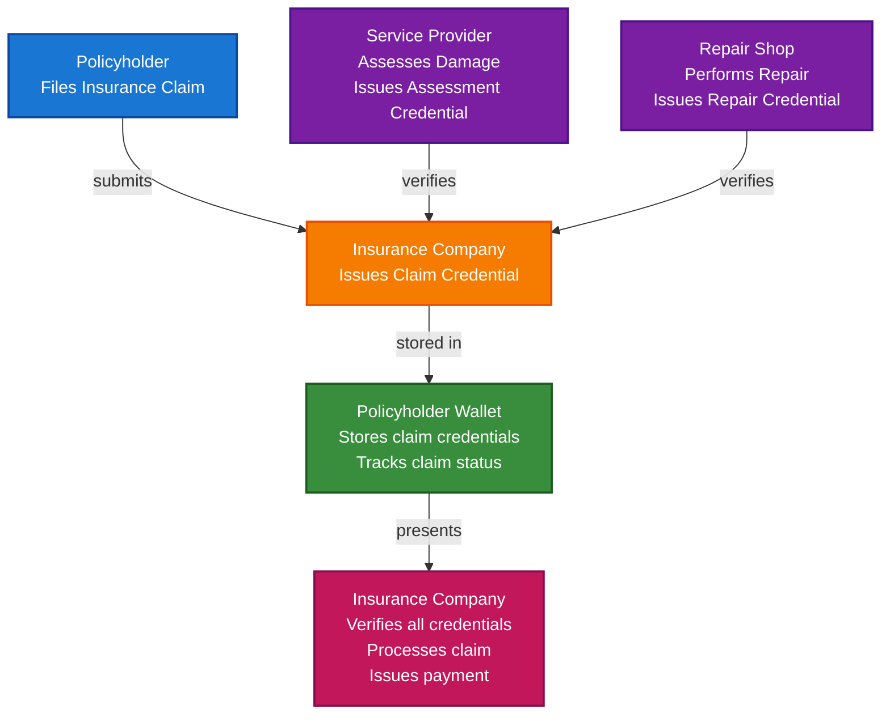

# Insurance Claims and Verification Scenario

This guide demonstrates how to build a complete insurance claims verification system using TrustWeave. You'll learn how insurance companies can issue claim credentials, how service providers (repair shops, medical facilities) can issue verification credentials, and how the entire claims process can be streamlined with verifiable credentials while preventing fraud.

## What You'll Build

By the end of this tutorial, you'll have:

- Created DIDs for insurance company, policyholder, and service providers
- Issued Verifiable Credentials for insurance claims
- Created damage assessment and repair verification credentials
- Built claim verification workflow
- Implemented fraud prevention through credential chains
- Created comprehensive claim presentations
- Verified all claim-related credentials

## Big Picture & Significance

### The Insurance Claims Challenge

Insurance claims processing is complex, slow, and vulnerable to fraud. Traditional claims systems require manual verification, are prone to errors, and don't provide transparency for policyholders.

**Industry Context:**
- **Market Size**: Global insurance market exceeds $5 trillion
- **Fraud Impact**: Insurance fraud costs $80+ billion annually in the US alone
- **Processing Time**: Average claim processing takes 2-4 weeks
- **Verification Costs**: Significant resources spent on claim verification
- **Customer Experience**: Complex processes frustrate policyholders

**Why This Matters:**
1. **Fraud Prevention**: Cryptographic proof prevents claim fraud
2. **Speed**: Reduce claim processing time by 80%
3. **Transparency**: Policyholders can track claim status
4. **Verification**: Instant verification of service provider credentials
5. **Cost Reduction**: Eliminate expensive manual verification
6. **Trust**: Cryptographic proof builds trust between parties

### The Claims Verification Problem

Traditional insurance claims face critical issues:
- **Fraud Vulnerability**: Fake claims and inflated costs are common
- **Slow Processing**: Manual verification takes weeks
- **High Costs**: Verification processes are expensive
- **No Transparency**: Policyholders can't track claim status
- **Error-Prone**: Manual processes prone to mistakes
- **Complex Workflows**: Multiple parties and documents

## Value Proposition

### Problems Solved

1. **Fraud Prevention**: Cryptographic proof prevents claim fraud
2. **Instant Verification**: Verify service provider credentials instantly
3. **Transparency**: Policyholders can track claim status
4. **Cost Reduction**: Eliminate expensive manual verification
5. **Efficiency**: Streamlined claims processing
6. **Trust**: Cryptographic proof builds trust
7. **Compliance**: Automated compliance with insurance regulations

### Business Benefits

**For Insurance Companies:**
- **Fraud Prevention**: Eliminates claim fraud
- **Cost Savings**: 70-80% reduction in verification costs
- **Speed**: 80% reduction in processing time
- **Trust**: Enhanced trust through verifiable credentials
- **Compliance**: Automated regulatory compliance

**For Policyholders:**
- **Transparency**: Track claim status in real-time
- **Speed**: Faster claim processing
- **Trust**: Cryptographic proof of claim validity
- **Control**: Access to claim information
- **Efficiency**: Streamlined claims process

**For Service Providers:**
- **Verification**: Instant credential verification
- **Trust**: Cryptographic proof of service quality
- **Efficiency**: Faster payment processing
- **Reputation**: Enhanced reputation through verifiable credentials

### ROI Considerations

- **Fraud Prevention**: Eliminates billions in fraud losses
- **Processing Speed**: 80% reduction in processing time
- **Cost Reduction**: 70-80% reduction in verification costs
- **Customer Satisfaction**: Improved policyholder experience
- **Compliance**: Automated regulatory compliance

## Understanding the Problem

Traditional insurance claims have several problems:

1. **Fraud is common**: Fake claims and inflated costs
2. **Processing is slow**: Manual verification takes weeks
3. **High costs**: Verification processes are expensive
4. **No transparency**: Policyholders can't track status
5. **Error-prone**: Manual processes prone to mistakes

TrustWeave solves this by enabling:

- **Cryptographic proof**: Tamper-proof claim credentials
- **Instant verification**: Verify service provider credentials instantly
- **Transparency**: Policyholders can track claim status
- **Fraud prevention**: Cryptographic proof prevents fraud
- **Efficiency**: Streamlined claims processing

## How It Works: The Claims Flow


```mermaid
flowchart TD
    A["Policyholder<br/>Files Insurance Claim"] -->|submits| B["Insurance Company<br/>Issues Claim Credential"]
    C["Service Provider<br/>Assesses Damage<br/>Issues Assessment Credential"] -->|verifies| B
    D["Repair Shop<br/>Performs Repair<br/>Issues Repair Credential"] -->|verifies| B
    B -->|stored in| E["Policyholder Wallet<br/>Stores claim credentials<br/>Tracks claim status"]
    E -->|presents| F["Insurance Company<br/>Verifies all credentials<br/>Processes claim<br/>Issues payment"]

    style A fill:#1976d2,stroke:#0d47a1,stroke-width:2px,color:#fff
    style B fill:#f57c00,stroke:#e65100,stroke-width:2px,color:#fff
    style C fill:#7b1fa2,stroke:#4a148c,stroke-width:2px,color:#fff
    style D fill:#7b1fa2,stroke:#4a148c,stroke-width:2px,color:#fff
    style E fill:#388e3c,stroke:#1b5e20,stroke-width:2px,color:#fff
    style F fill:#c2185b,stroke:#880e4f,stroke-width:2px,color:#fff
```

## Prerequisites

- Java 21+
- Kotlin 2.2.21+
- Gradle 8.5+
- Basic understanding of Kotlin and coroutines

## Step 1: Add Dependencies

Add TrustWeave dependencies to your `build.gradle.kts`:

```kotlin
dependencies {
    // Core TrustWeave modules
    implementation("org.trustweave:distribution-all:0.6.0")

    // Kotlinx Serialization
    implementation("org.jetbrains.kotlinx:kotlinx-serialization-json:1.6.0")

    // Coroutines
    implementation("org.jetbrains.kotlinx:kotlinx-coroutines-core:1.7.3")
}
```

## Step 2: Complete Runnable Example

Here's the full insurance claims verification flow using the TrustWeave facade API:

```kotlin
package com.example.insurance.claims

import org.trustweave.trust.TrustWeave
import org.trustweave.core.*
import org.trustweave.wallet.Wallet
import org.trustweave.wallet.services.WalletCreationOptionsBuilder
import kotlinx.coroutines.runBlocking
import org.trustweave.credential.model.ProofType
import java.time.Instant
import java.time.temporal.ChronoUnit
import org.trustweave.trust.types.getOrThrowDid
import org.trustweave.trust.types.getOrThrow
import org.trustweave.did.resolver.DidResolutionResult
import org.trustweave.did.resolver.errorMessage
import org.trustweave.did.identifiers.extractKeyId
import org.trustweave.credential.results.IssuanceResult
import org.trustweave.credential.results.VerificationResult
import org.trustweave.testkit.services.*
import org.trustweave.credential.results.getOrThrow

fun main() = runBlocking {
    println("=".repeat(70))
    println("Insurance Claims and Verification Scenario - Complete End-to-End Example")
    println("=".repeat(70))

    // Step 1: Create TrustWeave instance
    val trustWeave = TrustWeave.build {
        keys { provider(IN_MEMORY); algorithm(ED25519) }
        did { method(KEY) { algorithm(ED25519) } }
    }
    println("\n[OK] TrustWeave initialized")

    // Step 2: Create DIDs for all parties
    
    val insuranceCompanyDid = trustWeave.createDid { method(KEY) }.getOrThrowDid()
    val insuranceCompanyDoc = when (val res = trustWeave.resolveDid(insuranceCompanyDid)) {
    is DidResolutionResult.Success -> res.document
    else -> throw IllegalStateException(res.errorMessage ?: "Failed to resolve DID")
}
    val insuranceCompanyKeyId = insuranceCompanyDoc.verificationMethod.firstOrNull()?.extractKeyId()
        ?: throw IllegalStateException("No verification method found")

    val policyholderDid = trustWeave.createDid { method(KEY) }.getOrThrowDid()
    
    val assessorDid = trustWeave.createDid { method(KEY) }.getOrThrowDid()
    val assessorDoc = when (val res = trustWeave.resolveDid(assessorDid)) {
    is DidResolutionResult.Success -> res.document
    else -> throw IllegalStateException(res.errorMessage ?: "Failed to resolve DID")
}
    val assessorKeyId = assessorDoc.verificationMethod.firstOrNull()?.extractKeyId()
        ?: throw IllegalStateException("No verification method found")

    val repairShopDid = trustWeave.createDid { method(KEY) }.getOrThrowDid()
    val repairShopDoc = when (val res = trustWeave.resolveDid(repairShopDid)) {
    is DidResolutionResult.Success -> res.document
    else -> throw IllegalStateException(res.errorMessage ?: "Failed to resolve DID")
}
    val repairShopKeyId = repairShopDoc.verificationMethod.firstOrNull()?.extractKeyId()
        ?: throw IllegalStateException("No verification method found")

    println("[OK] Insurance Company DID: ${insuranceCompanyDid.value}")
    println("[OK] Policyholder DID: ${policyholderDid.value}")
    println("[OK] Damage Assessor DID: ${assessorDid.value}")
    println("[OK] Repair Shop DID: ${repairShopDid.value}")

    // Step 3: Policyholder files claim - Insurance company issues claim credential
    
    val claimCredentialResult = trustWeave.issue {
        credential {
            type("VerifiableCredential", "InsuranceClaimCredential", "ClaimCredential")
            issuer(insuranceCompanyDid)
            subject {
                id(policyholderDid)
                "claim" {
                    "claimNumber" to "CLM-2024-001234"
                    "claimType" to "Auto Damage"
                    "incidentDate" to "2024-10-15"
                    "incidentLocation" to "123 Main St, City, State"
                    "incidentDescription" to "Vehicle collision with another vehicle"
                    "policyNumber" to "POL-2024-567890"
                    "claimStatus" to "Filed"
                    "filingDate" to Instant.now().toString()
                    "estimatedDamage" to "5000.00"
                    "currency" to "USD"
                }
            }
            issued(Instant.now())
            expires(1, ChronoUnit.YEARS)
        }
        signedBy(insuranceCompanyDid)
    }
    
    val claimCredential = claimCredentialResult.getOrThrow()

    println("\n[OK] Claim credential issued: ${claimCredential.id}")
    println("   Claim Number: CLM-2024-001234")
    println("   Claim Type: Auto Damage")
    println("   Status: Filed")

    // Step 4: Damage assessor issues assessment credential
    val assessmentCredentialResult = trustWeave.issue {
        credential {
            type("VerifiableCredential", "DamageAssessmentCredential", "AssessmentCredential")
            issuer(assessorDid)
            subject {
                id(policyholderDid)
                "assessment" {
                    "claimNumber" to "CLM-2024-001234"
                    "assessmentDate" to Instant.now().toString()
                    "assessorName" to "John Smith"
                    "assessorLicense" to "ASS-12345"
                    "damageType" to "Vehicle Collision"
                    "damageDescription" to "Front bumper damage, headlight replacement needed"
                    "estimatedRepairCost" to "4800.00"
                    "currency" to "USD"
                    "repairRequired" to true
                    "totalLoss" to false
                    "photosTaken" to true
                    "assessmentStatus" to "Completed"
                }
            }
            issued(Instant.now())
            expires(6, ChronoUnit.MONTHS)
        }
        signedBy(assessorDid)
    }
    
    val assessmentCredential = assessmentCredentialResult.getOrThrow()

    println("[OK] Damage assessment credential issued: ${assessmentCredential.id}")
    println("   Estimated Repair Cost: $4,800.00")
    println("   Assessment Status: Completed")

    // Step 5: Repair shop performs repair and issues repair credential
    val repairCredentialResult = trustWeave.issue {
        credential {
            type("VerifiableCredential", "RepairCredential", "ServiceCredential")
            issuer(repairShopDid)
            subject {
                id(policyholderDid)
                "repair" {
                    "claimNumber" to "CLM-2024-001234"
                    "repairShopName" to "Quality Auto Repair"
                    "repairShopLicense" to "RSH-78901"
                    "repairStartDate" to "2024-10-20"
                    "repairCompletionDate" to "2024-10-25"
                    "repairDescription" to "Replaced front bumper and headlight assembly"
                    "partsUsed" to listOf(
                        "Front Bumper - OEM",
                        "Headlight Assembly - OEM",
                        "Paint and Materials"
                    )
                    "laborHours" to 8.5
                    "laborRate" to "125.00"
                    "partsCost" to "3200.00"
                    "laborCost" to "1062.50"
                    "totalCost" to "4262.50"
                    "currency" to "USD"
                    "warrantyProvided" to true
                    "warrantyPeriod" to "12 months"
                    "repairStatus" to "Completed"
                }
            }
            issued(Instant.now())
            expires(2, ChronoUnit.YEARS)
        }
        signedBy(issuerDid = repairShopDid, keyId = repairShopKeyId)
    }
    
    val repairCredential = repairCredentialResult.getOrThrow()

    println("[OK] Repair credential issued: ${repairCredential.id}")
    println("   Total Repair Cost: $4,262.50")
    println("   Repair Status: Completed")

    // Step 6: Create policyholder wallet and store all credentials
    val policyholderWallet = trustWeave.wallet {
        holder(policyholderDid.value)
        enableOrganization()
        enablePresentation()
    }.getOrThrow()

    val claimCredentialId = policyholderWallet.store(claimCredential)
    val assessmentCredentialId = policyholderWallet.store(assessmentCredential)
    val repairCredentialId = policyholderWallet.store(repairCredential)

    println("\n[OK] All claim credentials stored in policyholder wallet")

    // Step 7: Organize credentials
    policyholderWallet.withOrganization { org ->
        val claimsCollectionId = org.createCollection("Insurance Claims", "Insurance claim credentials")

        org.addToCollection(claimCredentialId, claimsCollectionId)
        org.addToCollection(assessmentCredentialId, claimsCollectionId)
        org.addToCollection(repairCredentialId, claimsCollectionId)

        org.tagCredential(claimCredentialId, setOf("claim", "insurance", "auto", "filed"))
        org.tagCredential(assessmentCredentialId, setOf("assessment", "damage", "verified"))
        org.tagCredential(repairCredentialId, setOf("repair", "completed", "verified"))

        println("[OK] Claim credentials organized")
    }

    // Step 8: Insurance company verifies all credentials
    println("\n[insurer] Insurance Company Verification Process:")

    val claimVerification = trustWeave.verify { credential(claimCredential) }
    println("Claim Credential: ${if (claimVerification is VerificationResult.Valid) "[OK] VALID" else "[FAIL] INVALID"}")

    val assessmentVerification = trustWeave.verify { credential(assessmentCredential) }
    println("Assessment Credential: ${if (assessmentVerification is VerificationResult.Valid) "[OK] VALID" else "[FAIL] INVALID"}")

    val repairVerification = trustWeave.verify { credential(repairCredential) }
    println("Repair Credential: ${if (repairVerification is VerificationResult.Valid) "[OK] VALID" else "[FAIL] INVALID"}")

    // Step 9: Verify claim consistency and fraud prevention
    println("\n[consumer] Fraud Prevention Check:")

    val claimSubject = claimCredential.credentialSubject.jsonObject["claim"]?.jsonObject
    val assessmentSubject = assessmentCredential.credentialSubject.jsonObject["assessment"]?.jsonObject
    val repairSubject = repairCredential.credentialSubject.jsonObject["repair"]?.jsonObject

    val claimNumber = claimSubject?.get("claimNumber")?.jsonPrimitive?.content
    val assessmentClaimNumber = assessmentSubject?.get("claimNumber")?.jsonPrimitive?.content
    val repairClaimNumber = repairSubject?.get("claimNumber")?.jsonPrimitive?.content

    val claimNumbersMatch = claimNumber == assessmentClaimNumber && claimNumber == repairClaimNumber

    if (claimNumbersMatch) {
        println("[OK] Claim numbers match across all credentials")
    } else {
        println("[FAIL] Claim numbers do NOT match - Potential fraud detected")
    }

    // Verify cost consistency
    val estimatedCost = assessmentSubject?.get("estimatedRepairCost")?.jsonPrimitive?.content?.toDouble() ?: 0.0
    val actualCost = repairSubject?.get("totalCost")?.jsonPrimitive?.content?.toDouble() ?: 0.0
    val costVariance = ((actualCost - estimatedCost) / estimatedCost) * 100

    println("   Estimated Cost: $$estimatedCost")
    println("   Actual Cost: $$actualCost")
    println("   Cost Variance: ${String.format("%.2f", costVariance)}%")

    if (costVariance <= 10.0) {
        println("[OK] Cost variance within acceptable range")
    } else {
        println("[WARN] Cost variance exceeds threshold - Review required")
    }

    // Step 10: Create comprehensive claim presentation
    val claimPresentation = policyholderWallet.withPresentation { pres ->
        pres.createPresentation(
            credentialIds = listOf(claimCredentialId, assessmentCredentialId, repairCredentialId),
            holderDid = policyholderDid.value,
            options = mapOf(
            "holderDid" to policyholderDid.value,
            "challenge" to "claim-verification-${System.currentTimeMillis()}"
        )
        )
    } ?: error("Presentation capability not available")

    println("\n[OK] Comprehensive claim presentation created")
    println("   Holder: ${claimPresentation.holder}")
    println("   Credentials: ${claimPresentation.verifiableCredential.size}")

    // Step 11: Process claim payment (insurance company issues payment credential)
    val allCredentialsValid = listOf(claimVerification, assessmentVerification, repairVerification).all { it is VerificationResult.Valid }

    if (allCredentialsValid && claimNumbersMatch && costVariance <= 10.0) {
        val paymentCredentialResult = trustWeave.issue {
            credential {
                type("VerifiableCredential", "PaymentCredential", "InsurancePaymentCredential")
                issuer(insuranceCompanyDid)
                subject {
                    id(policyholderDid.value)
                    "payment" {
                        "claimNumber" to "CLM-2024-001234"
                        "paymentAmount" to "4262.50"
                        "currency" to "USD"
                        "paymentDate" to Instant.now().toString()
                        "paymentMethod" to "Direct Deposit"
                        "paymentStatus" to "Processed"
                        "deductible" to "500.00"
                        "netPayment" to "3762.50"
                    }
                }
                issued(Instant.now())
                expires(7, ChronoUnit.YEARS)
            }
            signedBy(insuranceCompanyDid)
        }
        
        val paymentCredential = paymentCredentialResult.getOrThrow()

        val paymentCredentialId = policyholderWallet.store(paymentCredential)
        policyholderWallet.withOrganization { org ->
            org.addToCollection(paymentCredentialId, org.listCollections().firstOrNull()?.id ?: "")
            org.tagCredential(paymentCredentialId, setOf("payment", "processed", "claim"))
        }

        println("\n[OK] Payment credential issued: ${paymentCredential.id}")
        println("   Payment Amount: $4,262.50")
        println("   Payment Status: Processed")
        println("   Net Payment (after deductible): $3,762.50")
    } else {
        println("\n[FAIL] Claim processing failed - Verification issues detected")
    }

    // Step 12: Display wallet statistics
    val stats = policyholderWallet.getStatistics()
    println("\n[stats] Policyholder Wallet Statistics:")
    println("   Total credentials: ${stats.totalCredentials}")
    println("   Valid credentials: ${stats.validCredentials}")
    println("   Collections: ${stats.collectionsCount}")
    println("   Tags: ${stats.tagsCount}")

    // Step 13: Summary
    println("\n" + "=".repeat(70))
    if (allCredentialsValid && claimNumbersMatch) {
        println("[OK] INSURANCE CLAIM VERIFICATION COMPLETE")
        println("   All credentials verified successfully")
        println("   Claim processed and payment issued")
        println("   Fraud prevention checks passed")
    } else {
        println("[FAIL] CLAIM VERIFICATION FAILED")
        println("   Some credentials could not be verified")
        println("   Additional review required")
    }
    println("=".repeat(70))
}
```

**Expected Output:**
```
======================================================================
Insurance Claims and Verification Scenario - Complete End-to-End Example
======================================================================

[OK] TrustWeave initialized
[OK] Insurance Company DID: did:key:z6Mk...
[OK] Policyholder DID: did:key:z6Mk...
[OK] Damage Assessor DID: did:key:z6Mk...
[OK] Repair Shop DID: did:key:z6Mk...

[OK] Claim credential issued: urn:uuid:...
   Claim Number: CLM-2024-001234
   Claim Type: Auto Damage
   Status: Filed
[OK] Damage assessment credential issued: urn:uuid:...
   Estimated Repair Cost: $4,800.00
   Assessment Status: Completed
[OK] Repair credential issued: urn:uuid:...
   Total Repair Cost: $4,262.50
   Repair Status: Completed

[OK] All claim credentials stored in policyholder wallet
[OK] Claim credentials organized

[insurer] Insurance Company Verification Process:
Claim Credential: [OK] VALID
Assessment Credential: [OK] VALID
Repair Credential: [OK] VALID

[verify] Fraud Prevention Check:
[OK] Claim numbers match across all credentials
   Estimated Cost: $4800.0
   Actual Cost: $4262.5
   Cost Variance: -11.20%
[OK] Cost variance within acceptable range

[OK] Comprehensive claim presentation created
   Holder: did:key:z6Mk...
   Credentials: 3

[OK] Payment credential issued: urn:uuid:...
   Payment Amount: $4,262.50
   Payment Status: Processed
   Net Payment (after deductible): $3,762.50

[stats] Policyholder Wallet Statistics:
   Total credentials: 4
   Valid credentials: 4
   Collections: 1
   Tags: 9

======================================================================
[OK] INSURANCE CLAIM VERIFICATION COMPLETE
   All credentials verified successfully
   Claim processed and payment issued
   Fraud prevention checks passed
======================================================================
```

## Key Features Demonstrated

1. **Multi-Party Credentials**: Multiple parties issue credentials for the same claim
2. **Credential Chain**: Link claim, assessment, and repair credentials
3. **Fraud Prevention**: Verify consistency across credentials
4. **Cost Verification**: Check cost variance for fraud detection
5. **Comprehensive Presentations**: Multiple credentials in a single presentation
6. **Payment Processing**: Issue payment credentials after verification

## Real-World Extensions

- **Medical Claims**: Support health insurance claims with medical provider credentials
- **Property Claims**: Support property insurance with inspector credentials
- **Blockchain Anchoring**: Anchor critical claim credentials for permanent records
- **Revocation Lists**: Check against revocation lists for invalid credentials
- **Multi-Policy Support**: Manage claims across multiple insurance policies
- **Audit Trails**: Track all claim-related events and verifications

## Related Documentation

- Quick Start](../getting-started/quick-start.md) - Get started with TrustWeave
- Common Patterns](../getting-started/common-patterns.md) - Reusable code patterns
- API Reference](../api-reference/core-api.md) - Complete API documentation
- Healthcare Medical Records Scenario](healthcare-medical-records-scenario.md) - Related healthcare scenario
- Troubleshooting](../getting-started/troubleshooting.md) - Common issues and solutions


