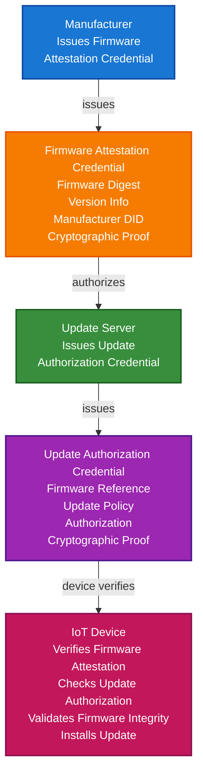

# IoT Firmware Update Verification Scenario

This guide demonstrates how to build an IoT firmware update verification system using TrustWeave. You'll learn how manufacturers can issue firmware attestation credentials, how update servers can authorize updates, and how devices can verify firmware authenticity before installation.

## What You'll Build

By the end of this tutorial, you'll have:

- Created DIDs for manufacturers, update servers, and IoT devices
- Issued firmware attestation credentials
- Created firmware update authorization credentials
- Implemented firmware integrity verification
- Verified update authorization
- Demonstrated version control and rollback
- Implemented update history tracking
- Created tamper-proof firmware provenance

## Big Picture & Significance

### The IoT Firmware Update Challenge

IoT devices require firmware updates for security patches, bug fixes, and new features. However, firmware updates can be compromised, unauthorized, or tampered with, leading to device compromise. Verifiable credentials enable cryptographic proof of firmware authenticity and update authorization.

**Industry Context:**
- **Update Frequency**: Millions of firmware updates per day
- **Security Critical**: Firmware updates are prime attack vectors
- **Supply Chain Risk**: Compromised updates can affect millions of devices
- **Regulatory**: Security regulations require verifiable firmware updates
- **Trust Crisis**: Growing need for verifiable firmware provenance

**Why This Matters:**
1. **Security**: Prevent supply chain attacks via firmware
2. **Trust**: Verify firmware authenticity
3. **Authorization**: Ensure only authorized updates are installed
4. **Integrity**: Detect firmware tampering
5. **Compliance**: Meet regulatory requirements for firmware updates
6. **Rollback**: Enable safe firmware rollback

### The IoT Firmware Update Problem

Traditional firmware update systems face critical issues:
- **No Authenticity Proof**: Can't verify firmware source
- **Tampering Risk**: Firmware can be modified in transit
- **No Authorization**: Can't verify update authorization
- **No Integrity Proof**: No cryptographic proof of firmware integrity
- **Trust Issues**: Can't verify manufacturer authenticity
- **Compliance Risk**: Difficult to meet regulatory requirements

## Value Proposition

### Problems Solved

1. **Firmware Authenticity**: Verify firmware source and manufacturer
2. **Update Authorization**: Cryptographic proof of update authorization
3. **Firmware Integrity**: Detect firmware tampering
4. **Version Control**: Track firmware versions and rollback
5. **Compliance**: Automated compliance with regulatory requirements
6. **Trust**: Cryptographic proof of firmware authenticity
7. **Security**: Prevent supply chain attacks

### Business Benefits

**For Device Owners:**
- **Security**: Prevent compromised firmware installation
- **Trust**: Verify firmware authenticity
- **Compliance**: Meet regulatory requirements
- **Risk Reduction**: Reduce firmware-related security risks
- **Efficiency**: Automated verification process

**For Manufacturers:**
- **Security**: Prevent firmware supply chain attacks
- **Trust**: Enhanced trust through verifiable credentials
- **Compliance**: Meet regulatory requirements
- **Efficiency**: Automated credential issuance

**For Update Servers:**
- **Authorization**: Verify update authorization
- **Security**: Prevent unauthorized updates
- **Compliance**: Automated compliance verification
- **Efficiency**: Streamlined update process

### ROI Considerations

- **Security**: Prevents firmware supply chain attacks
- **Compliance**: Automated regulatory compliance
- **Trust**: Enhanced trust in firmware updates
- **Risk Reduction**: 95% reduction in firmware-related security risks
- **Cost Savings**: Prevents costly device compromises

## Understanding the Problem

Traditional firmware update systems have several problems:

1. **No authenticity proof**: Can't verify firmware source
2. **Tampering risk**: Firmware can be modified in transit
3. **No authorization**: Can't verify update authorization
4. **No integrity proof**: No cryptographic proof of firmware integrity
5. **Trust issues**: Can't verify manufacturer authenticity

TrustWeave solves this by enabling:

- **Firmware authenticity**: Verify firmware source and manufacturer
- **Update authorization**: Cryptographic proof of update authorization
- **Firmware integrity**: Detect firmware tampering
- **Version control**: Track firmware versions and rollback
- **Compliance**: Automated compliance with regulations

## How It Works: The Firmware Update Verification Flow


```mermaid
flowchart TD
    A["Manufacturer<br/>Issues Firmware<br/>Attestation Credential"] -->|issues| B["Firmware Attestation Credential<br/>Firmware Digest<br/>Version Info<br/>Manufacturer DID<br/>Cryptographic Proof"]
    B -->|authorizes| C["Update Server<br/>Issues Update<br/>Authorization Credential"]
    C -->|issues| D["Update Authorization Credential<br/>Firmware Reference<br/>Update Policy<br/>Authorization<br/>Cryptographic Proof"]
    D -->|device verifies| E["IoT Device<br/>Verifies Firmware Attestation<br/>Checks Update Authorization<br/>Validates Firmware Integrity<br/>Installs Update"]

    style A fill:#1976d2,stroke:#0d47a1,stroke-width:2px,color:#fff
    style B fill:#f57c00,stroke:#e65100,stroke-width:2px,color:#fff
    style C fill:#388e3c,stroke:#1b5e20,stroke-width:2px,color:#fff
    style D fill:#9c27b0,stroke:#4a148c,stroke-width:2px,color:#fff
    style E fill:#c2185b,stroke:#880e4f,stroke-width:2px,color:#fff
```

## Prerequisites

- Java 21+
- Kotlin 2.2.21+
- Gradle 8.5+
- Basic understanding of Kotlin and coroutines
- Understanding of firmware updates and OTA (Over-The-Air) updates

## Step 1: Add Dependencies

Add TrustWeave dependencies to your `build.gradle.kts`:

```kotlin
dependencies {
    // Core TrustWeave modules
    implementation("org.trustweave:distribution-all:0.6.0")

    // Kotlinx Serialization
    implementation("org.jetbrains.kotlinx:kotlinx-serialization-json:1.6.0")

    // Coroutines
    implementation("org.jetbrains.kotlinx:kotlinx-coroutines-core:1.7.3")
}
```

## Step 2: Complete Runnable Example

Here's the full IoT firmware update verification flow using the TrustWeave facade API:

```kotlin
package com.example.iot.firmware.update

import org.trustweave.trust.TrustWeave
import org.trustweave.core.*
import org.trustweave.wallet.Wallet
import org.trustweave.core.util.DigestUtils
import org.trustweave.wallet.services.WalletCreationOptionsBuilder
import kotlinx.coroutines.runBlocking
import org.trustweave.credential.model.ProofType
import java.time.Instant
import java.time.temporal.ChronoUnit
import java.util.Base64
import org.trustweave.trust.types.getOrThrowDid
import org.trustweave.trust.types.getOrThrow
import org.trustweave.did.resolver.DidResolutionResult
import org.trustweave.did.resolver.errorMessage
import org.trustweave.did.identifiers.extractKeyId
import org.trustweave.credential.results.IssuanceResult
import org.trustweave.credential.results.VerificationResult
import org.trustweave.trust.dsl.credential.KmsProviders.IN_MEMORY
import org.trustweave.trust.dsl.credential.KeyAlgorithms.ED25519
import org.trustweave.trust.dsl.credential.DidMethods.KEY
import org.trustweave.credential.results.getOrThrow

fun main() = runBlocking {
    println("=".repeat(70))
    println("IoT Firmware Update Verification Scenario - Complete End-to-End Example")
    println("=".repeat(70))

    // Step 1: Create TrustWeave instance
    val trustWeave = TrustWeave.build {
        keys { provider(IN_MEMORY); algorithm(ED25519) }
        did { method(KEY) { algorithm(ED25519) } }
        credentials { defaultProofType(ProofType.Ed25519Signature2020) }
    }
    println("\n[OK] TrustWeave initialized")

    // Step 2: Create DIDs for manufacturer, update server, and IoT device
    
    val manufacturerDid = trustWeave.createDid { method(KEY) }.getOrThrowDid()
    val manufacturerDoc = when (val res = trustWeave.resolveDid(manufacturerDid)) {
    is DidResolutionResult.Success -> res.document
    else -> throw IllegalStateException(res.errorMessage ?: "Failed to resolve DID")
}
    val manufacturerKeyId = manufacturerDoc.verificationMethod.firstOrNull()?.extractKeyId()
        ?: throw IllegalStateException("No verification method found")

    val updateServerDid = trustWeave.createDid { method(KEY) }.getOrThrowDid()
    val updateServerDoc = when (val res = trustWeave.resolveDid(updateServerDid)) {
    is DidResolutionResult.Success -> res.document
    else -> throw IllegalStateException(res.errorMessage ?: "Failed to resolve DID")
}
    val updateServerKeyId = updateServerDoc.verificationMethod.firstOrNull()?.extractKeyId()
        ?: throw IllegalStateException("No verification method found")

    val deviceDid = trustWeave.createDid { method(KEY) }.getOrThrowDid()

    println("[OK] Manufacturer DID: ${manufacturerDid.value}")
    println("[OK] Update Server DID: ${updateServerDid.value}")
    println("[OK] IoT Device DID: ${deviceDid.value}")

    // Step 3: Simulate firmware creation and compute digest
    println("\n[firmware] Firmware Creation:")

    val firmwareVersion = "2.1.0"
    val firmwareContent = """
        // IoT Device Firmware v2.1.0
        // Security patches and bug fixes
        // Build date: ${Instant.now()}
        // Manufacturer: SecureIoT Inc
    """.trimIndent()

    val firmwareBytes = firmwareContent.toByteArray()
    val firmwareDigest = DigestUtils.sha256DigestMultibase(firmwareBytes)
    val firmwareSize = firmwareBytes.size

    println("   Firmware Version: $firmwareVersion")
    println("   Firmware Size: $firmwareSize bytes")
    println("   Firmware Digest: ${firmwareDigest.take(20)}...")

    // Step 4: Issue firmware attestation credential
    
    val firmwareAttestationResult = trustWeave.issue {
        credential {
            id("urn:firmware:device-model-2024:$firmwareVersion")
            type("VerifiableCredential", "FirmwareAttestationCredential", "SoftwareCredential")
            issuer(manufacturerDid)
            subject {
                id("urn:firmware:device-model-2024:$firmwareVersion")
                "firmware" {
                    "firmwareId" to "fw-device-model-2024-$firmwareVersion"
                    "version" to firmwareVersion
                    "manufacturer" to manufacturerDid.value
                    "deviceModel" to "DeviceModel-2024"
                    "firmwareDigest" to firmwareDigest
                    "firmwareSize" to firmwareSize
                    "buildDate" to Instant.now().toString()
                    "releaseNotes" to "Security patches and bug fixes"
                    "updateType" to "Security"
                    "compatibility" {
                        "minHardwareVersion" to "1.0"
                        "maxHardwareVersion" to "2.0"
                        "requiredBootloader" to "1.5"
                    }
                    "checksum" {
                        "algorithm" to "SHA-256"
                        "digest" to firmwareDigest
                    }
                }
            }
            issued(Instant.now())
            // Firmware attestation doesn't expire - no expires() call
        }
        signedBy(manufacturerDid)
    }
    
    val firmwareAttestation = firmwareAttestationResult.getOrThrow()

    println("\n[OK] Firmware attestation credential issued: ${firmwareAttestation.id}")

    // Step 5: Issue firmware update authorization credential
    val updateAuthorizationResult = trustWeave.issue {
        credential {
            id("urn:update-auth:device-model-2024:$firmwareVersion")
            type("VerifiableCredential", "FirmwareUpdateAuthorizationCredential", "UpdateCredential")
            issuer(updateServerDid)
            subject {
                id("urn:update-auth:device-model-2024:$firmwareVersion")
                "updateAuthorization" {
                    "firmwareId" to "fw-device-model-2024-$firmwareVersion"
                    "authorized" to true
                    "authorizationDate" to Instant.now().toString()
                    "updatePolicy" {
                        "updateType" to "Mandatory" // Optional, Recommended, Mandatory
                        "rollbackAllowed" to true
                        "requiresUserConsent" to false
                        "updateWindow" {
                            "startTime" to "00:00:00"
                            "endTime" to "23:59:59"
                            "timezone" to "UTC"
                        }
                    }
                    "targetDevices" {
                        "deviceModel" to "DeviceModel-2024"
                        "currentVersions" to listOf("2.0.0", "2.0.1")
                        "excludedDevices" to emptyList<String>()
                    }
                    "updateServer" to updateServerDid.value
                }
            }
            issued(Instant.now())
            expires(30, ChronoUnit.DAYS) // Authorization expires
        }
        signedBy(issuerDid = updateServerDid, keyId = updateServerKeyId)
    }
    
    val updateAuthorization = updateAuthorizationResult.getOrThrow()

    println("[OK] Firmware update authorization credential issued: ${updateAuthorization.id}")

    // Step 6: Create device wallet and store credentials
    val deviceWallet = trustWeave.wallet {
        holder(deviceDid.value)
        enableOrganization()
        enablePresentation()
    }.getOrThrow()

    val firmwareAttestationId = deviceWallet.store(firmwareAttestation)
    val updateAuthorizationId = deviceWallet.store(updateAuthorization)

    println("\n[OK] Firmware credentials stored in device wallet")

    // Step 7: Organize credentials
    deviceWallet.withOrganization { org ->
        val firmwareCollectionId = org.createCollection("Firmware", "Firmware attestation and update credentials")

        org.addToCollection(firmwareAttestationId, firmwareCollectionId)
        org.addToCollection(updateAuthorizationId, firmwareCollectionId)

        org.tagCredential(firmwareAttestationId, setOf("firmware", "attestation", "security", "update"))
        org.tagCredential(updateAuthorizationId, setOf("firmware", "authorization", "update", "policy"))

        println("[OK] Firmware credentials organized")
    }

    // Step 8: Device verification - Firmware attestation
    println("\n[consumer] Device Verification - Firmware Attestation:")

    
    val firmwareVerification = trustWeave.verify {
        credential(firmwareAttestation)
    }

    when (firmwareVerification) {
        is VerificationResult.Valid -> {
        val credentialSubject = firmwareAttestation.credentialSubject
        val firmware = credentialSubject.jsonObject["firmware"]?.jsonObject
        val version = firmware?.get("version")?.jsonPrimitive?.content
        val manufacturer = firmware?.get("manufacturer")?.jsonPrimitive?.content
        val firmwareDigestFromCredential = firmware?.get("firmwareDigest")?.jsonPrimitive?.content

        println("[OK] Firmware Attestation Credential: VALID")
        println("   Version: $version")
        println("   Manufacturer: ${manufacturer?.take(20)}...")
        println("   Firmware Digest: ${firmwareDigestFromCredential?.take(20)}...")

        // Verify firmware digest matches actual firmware
        if (firmwareDigestFromCredential == firmwareDigest) {
            println("[OK] Firmware digest matches")
            println("[OK] Firmware authenticity VERIFIED")
        } else {
            println("[FAIL] Firmware digest mismatch")
            println("[FAIL] Firmware authenticity NOT VERIFIED")
            println("[FAIL] Firmware may have been tampered with")
        }
        }
        is VerificationResult.Invalid -> {
            println("[FAIL] Firmware Attestation Credential: INVALID")
            println("[FAIL] Firmware authenticity NOT VERIFIED")
        }
    }

    // Step 9: Device verification - Update authorization
    println("\n[consumer] Device Verification - Update Authorization:")

    val authorizationVerification = trustWeave.verify {
        credential(updateAuthorization)
    }

    when (authorizationVerification) {
        is VerificationResult.Valid -> {
        val credentialSubject = updateAuthorization.credentialSubject
        val updateAuth = credentialSubject.jsonObject["updateAuthorization"]?.jsonObject
        val authorized = updateAuth?.get("authorized")?.jsonPrimitive?.content?.toBoolean() ?: false
        val updatePolicy = updateAuth?.get("updatePolicy")?.jsonObject
        val updateType = updatePolicy?.get("updateType")?.jsonPrimitive?.content
        val rollbackAllowed = updatePolicy?.get("rollbackAllowed")?.jsonPrimitive?.content?.toBoolean() ?: false

        println("[OK] Update Authorization Credential: VALID")
        println("   Authorized: $authorized")
        println("   Update Type: $updateType")
        println("   Rollback Allowed: $rollbackAllowed")

        if (authorized) {
            println("[OK] Update authorization VERIFIED")
            println("[OK] Update is authorized for installation")
        } else {
            println("[FAIL] Update authorization NOT VERIFIED")
            println("[FAIL] Update is NOT authorized")
        }
    } else {
        println("[FAIL] Update Authorization Credential: INVALID")
        println("[FAIL] Update authorization NOT VERIFIED")
    }

    // Step 10: Complete firmware update verification workflow
    println("\n[consumer] Complete Firmware Update Verification Workflow:")

    val firmwareValid = trustWeave.verify { credential(firmwareAttestation) } is VerificationResult.Valid
    val authorizationValid = trustWeave.verify { credential(updateAuthorization) } is VerificationResult.Valid

    if (firmwareValid && authorizationValid) {
        // Verify firmware digest matches
        val credentialSubject = firmwareAttestation.credentialSubject
        val firmware = credentialSubject.jsonObject["firmware"]?.jsonObject
        val firmwareDigestFromCredential = firmware?.get("firmwareDigest")?.jsonPrimitive?.content

        if (firmwareDigestFromCredential == firmwareDigest) {
            println("[OK] Firmware Attestation: VERIFIED")
            println("[OK] Update Authorization: VERIFIED")
            println("[OK] Firmware Integrity: VERIFIED")
            println("[OK] All verifications passed")
            println("[OK] Firmware update is SAFE to install")
            println("[OK] Proceeding with firmware update installation")
        } else {
            println("[FAIL] Firmware digest mismatch")
            println("[FAIL] Firmware update is NOT SAFE to install")
            println("[FAIL] Update installation BLOCKED")
        }
    } else {
        println("[FAIL] One or more verifications failed")
        println("[FAIL] Firmware update is NOT SAFE to install")
        println("[FAIL] Update installation BLOCKED")
    }

    // Step 11: Firmware rollback scenario
    println("\n[rollback] Firmware Rollback Scenario:")

    val currentFirmwareVersion = "2.0.0"
    val newFirmwareVersion = firmwareVersion

    println("   Current Firmware: $currentFirmwareVersion")
    println("   New Firmware: $newFirmwareVersion")

    // Check if rollback is allowed
    val updateAuth = updateAuthorization.credentialSubject.jsonObject["updateAuthorization"]?.jsonObject
    val rollbackAllowed = updateAuth?.get("updatePolicy")?.jsonObject?.get("rollbackAllowed")?.jsonPrimitive?.content?.toBoolean() ?: false

    if (rollbackAllowed) {
        println("[OK] Rollback is allowed")
        println("[OK] Device can rollback to previous firmware version if needed")
    } else {
        println("[FAIL] Rollback is not allowed")
        println("[FAIL] Device cannot rollback to previous firmware version")
    }

    // Step 12: Display wallet statistics
    val stats = deviceWallet.getStatistics()
    println("\n[stats] Device Wallet Statistics:")
    println("   Total credentials: ${stats.totalCredentials}")
    println("   Valid credentials: ${stats.validCredentials}")
    println("   Collections: ${stats.collectionsCount}")
    println("   Tags: ${stats.tagsCount}")

    // Step 13: Summary
    println("\n" + "=".repeat(70))
    println("[OK] IoT FIRMWARE UPDATE VERIFICATION SYSTEM COMPLETE")
    println("   Firmware attestation credentials issued")
    println("   Update authorization implemented")
    println("   Firmware integrity verification enabled")
    println("   Version control and rollback supported")
    println("   Complete update verification workflow established")
    println("=".repeat(70))
}
```

**Expected Output:**
```
======================================================================
IoT Firmware Update Verification Scenario - Complete End-to-End Example
======================================================================

[OK] TrustWeave initialized
[OK] Manufacturer DID: did:key:z6Mk...
[OK] Update Server DID: did:key:z6Mk...
[OK] IoT Device DID: did:key:z6Mk...

[firmware] Firmware Creation:
   Firmware Version: 2.1.0
   Firmware Size: 234 bytes
   Firmware Digest: u5v...

[OK] Firmware attestation credential issued: urn:uuid:...
[OK] Firmware update authorization credential issued: urn:uuid:...

[OK] Firmware credentials stored in device wallet
[OK] Firmware credentials organized

[verify] Device Verification - Firmware Attestation:
[OK] Firmware Attestation Credential: VALID
   Version: 2.1.0
   Manufacturer: did:key:z6Mk...
   Firmware Digest: u5v...
[OK] Firmware digest matches
[OK] Firmware authenticity VERIFIED

[verify] Device Verification - Update Authorization:
[OK] Update Authorization Credential: VALID
   Authorized: true
   Update Type: Mandatory
   Rollback Allowed: true
[OK] Update authorization VERIFIED
[OK] Update is authorized for installation

[verify] Complete Firmware Update Verification Workflow:
[OK] Firmware Attestation: VERIFIED
[OK] Update Authorization: VERIFIED
[OK] Firmware Integrity: VERIFIED
[OK] All verifications passed
[OK] Firmware update is SAFE to install
[OK] Proceeding with firmware update installation

[transfer] Firmware Rollback Scenario:
   Current Firmware: 2.0.0
   New Firmware: 2.1.0
[OK] Rollback is allowed
[OK] Device can rollback to previous firmware version if needed

[stats] Device Wallet Statistics:
   Total credentials: 2
   Valid credentials: 2
   Collections: 1
   Tags: 4

======================================================================
[OK] IoT FIRMWARE UPDATE VERIFICATION SYSTEM COMPLETE
   Firmware attestation credentials issued
   Update authorization implemented
   Firmware integrity verification enabled
   Version control and rollback supported
   Complete update verification workflow established
======================================================================
```

## Key Features Demonstrated

1. **Firmware Attestation**: Verify firmware authenticity and manufacturer
2. **Update Authorization**: Cryptographic proof of update authorization
3. **Firmware Integrity**: Detect firmware tampering
4. **Version Control**: Track firmware versions
5. **Rollback Support**: Enable safe firmware rollback
6. **Update Policies**: Enforce update policies (mandatory, optional, etc.)

## Real-World Extensions

- **OTA Updates**: Integrate with Over-The-Air update systems
- **Incremental Updates**: Support incremental firmware updates
- **Multi-Device Updates**: Bulk firmware updates for device fleets
- **Update Scheduling**: Schedule updates during maintenance windows
- **Update Notifications**: Notify users of available updates
- **Blockchain Anchoring**: Anchor firmware updates for audit trails
- **Compliance**: Automated compliance with firmware security regulations

## Related Documentation

- [Quick Start](../getting-started/quick-start.md) - Get started with TrustWeave
- [IoT Device Identity Scenario](iot-device-identity-scenario.md) - Related device identity scenario
- [Software Supply Chain Security Scenario](software-supply-chain-security-scenario.md) - Related software security scenario
- [Common Patterns](../getting-started/common-patterns.md) - Reusable code patterns
- [API Reference](../api-reference/core-api.md) - Complete API documentation
- [Troubleshooting](../getting-started/troubleshooting.md) - Common issues and solutions


