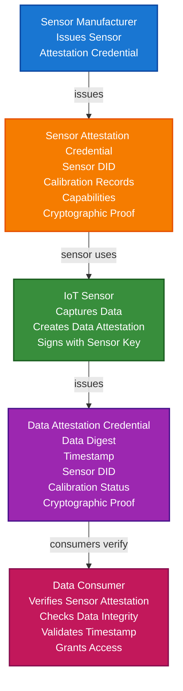

# IoT Sensor Data Provenance & Integrity Scenario

This guide demonstrates how to build an IoT sensor data provenance and integrity system using TrustWeave. You'll learn how sensor manufacturers can issue sensor attestation credentials, how sensors can create data attestation credentials, and how data consumers can verify sensor data authenticity and integrity.

## What You'll Build

By the end of this tutorial, you'll have:

- Created DIDs for sensor manufacturers, sensors, and data consumers
- Issued sensor attestation credentials
- Created sensor data attestation credentials
- Implemented data integrity verification
- Verified sensor calibration records
- Demonstrated timestamp verification
- Implemented data source verification
- Created tamper-proof data provenance chain

## Big Picture & Significance

### The IoT Sensor Data Challenge

IoT sensors generate vast amounts of data used for critical decisions in environmental monitoring, industrial automation, smart cities, and healthcare. However, sensor data can be tampered with, sensors can malfunction, and data provenance is often unclear. Verifiable credentials enable cryptographic proof of sensor data authenticity and integrity.

**Industry Context:**
- **Market Size**: Global IoT sensors market projected to reach $40 billion by 2027
- **Data Volume**: Billions of sensor readings per day
- **Critical Decisions**: Sensor data drives automated decisions
- **Regulatory**: Environmental regulations require verifiable sensor data
- **Trust Crisis**: Growing need for verifiable data provenance

**Why This Matters:**
1. **Trust**: Verify sensor data authenticity
2. **Integrity**: Detect data tampering
3. **Compliance**: Meet regulatory requirements for sensor data
4. **Provenance**: Track data from sensor to consumer
5. **Calibration**: Verify sensor calibration status
6. **Quality**: Ensure data quality and reliability

### The IoT Sensor Data Problem

Traditional sensor data systems face critical issues:
- **No Provenance**: Can't verify where data came from
- **Tampering Risk**: Data can be modified in transit
- **No Calibration Tracking**: Can't verify sensor calibration
- **No Integrity Proof**: No cryptographic proof of data integrity
- **Trust Issues**: Can't verify sensor authenticity
- **Compliance Risk**: Difficult to meet regulatory requirements

## Value Proposition

### Problems Solved

1. **Data Provenance**: Verify sensor data source and lineage
2. **Data Integrity**: Cryptographic proof data hasn't been tampered with
3. **Sensor Attestation**: Verify sensor authenticity and calibration
4. **Timestamp Verification**: Verify data timestamps
5. **Compliance**: Automated compliance with regulatory requirements
6. **Trust**: Cryptographic proof of data authenticity
7. **Quality Assurance**: Verify sensor calibration and health

### Business Benefits

**For Data Consumers:**
- **Trust**: Verify sensor data authenticity
- **Compliance**: Meet regulatory requirements
- **Quality**: Ensure data quality and reliability
- **Risk Reduction**: Reduce reliance on untrusted data
- **Efficiency**: Automated verification process

**For Sensor Manufacturers:**
- **Trust**: Enhanced trust through verifiable credentials
- **Differentiation**: Stand out with verifiable data provenance
- **Compliance**: Meet regulatory requirements
- **Efficiency**: Automated credential issuance

**For System Operators:**
- **Security**: Detect data tampering
- **Compliance**: Automated compliance verification
- **Quality**: Monitor sensor health and calibration
- **Efficiency**: Streamlined data verification

### ROI Considerations

- **Compliance**: Automated regulatory compliance
- **Trust**: Enhanced trust in sensor data
- **Risk Reduction**: 90% reduction in data tampering risk
- **Cost Savings**: Prevents costly decisions based on bad data
- **Quality**: Improved data quality and reliability

## Understanding the Problem

Traditional sensor data systems have several problems:

1. **No provenance**: Can't verify where data came from
2. **Tampering risk**: Data can be modified in transit
3. **No calibration tracking**: Can't verify sensor calibration
4. **No integrity proof**: No cryptographic proof of data integrity
5. **Trust issues**: Can't verify sensor authenticity

TrustWeave solves this by enabling:

- **Data provenance**: Verify sensor data source and lineage
- **Data integrity**: Cryptographic proof data hasn't been tampered with
- **Sensor attestation**: Verify sensor authenticity and calibration
- **Timestamp verification**: Verify data timestamps
- **Compliance**: Automated compliance with regulations

## How It Works: The Sensor Data Provenance Flow


```mermaid
flowchart TD
    A["Sensor Manufacturer<br/>Issues Sensor<br/>Attestation Credential"] -->|issues| B["Sensor Attestation Credential<br/>Sensor DID<br/>Calibration Records<br/>Capabilities<br/>Cryptographic Proof"]
    B -->|sensor uses| C["IoT Sensor<br/>Captures Data<br/>Creates Data Attestation<br/>Signs with Sensor Key"]
    C -->|issues| D["Data Attestation Credential<br/>Data Digest<br/>Timestamp<br/>Sensor DID<br/>Calibration Status<br/>Cryptographic Proof"]
    D -->|consumers verify| E["Data Consumer<br/>Verifies Sensor Attestation<br/>Checks Data Integrity<br/>Validates Timestamp<br/>Grants Access"]

    style A fill:#1976d2,stroke:#0d47a1,stroke-width:2px,color:#fff
    style B fill:#f57c00,stroke:#e65100,stroke-width:2px,color:#fff
    style C fill:#388e3c,stroke:#1b5e20,stroke-width:2px,color:#fff
    style D fill:#9c27b0,stroke:#4a148c,stroke-width:2px,color:#fff
    style E fill:#c2185b,stroke:#880e4f,stroke-width:2px,color:#fff
```

## Prerequisites

- Java 21+
- Kotlin 2.2.21+
- Gradle 8.5+
- Basic understanding of Kotlin and coroutines
- Understanding of sensor data and calibration

## Step 1: Add Dependencies

Add TrustWeave dependencies to your `build.gradle.kts`:

```kotlin
dependencies {
    // Core TrustWeave modules
    implementation("org.trustweave:distribution-all:0.6.0")

    // Kotlinx Serialization
    implementation("org.jetbrains.kotlinx:kotlinx-serialization-json:1.6.0")

    // Coroutines
    implementation("org.jetbrains.kotlinx:kotlinx-coroutines-core:1.7.3")
}
```

## Step 2: Complete Runnable Example

Here's the full IoT sensor data provenance and integrity flow using the TrustWeave facade API:

```kotlin
package com.example.iot.sensor.data

import org.trustweave.trust.TrustWeave
import org.trustweave.core.*
import org.trustweave.wallet.Wallet
import org.trustweave.core.util.DigestUtils
import org.trustweave.core.json.jsonData
import org.trustweave.wallet.services.WalletCreationOptionsBuilder
import kotlinx.coroutines.runBlocking
import org.trustweave.credential.model.ProofType
import java.time.Instant
import java.time.temporal.ChronoUnit
import java.util.Base64
import org.trustweave.trust.types.getOrThrowDid
import org.trustweave.trust.types.getOrThrow
import org.trustweave.did.resolver.DidResolutionResult
import org.trustweave.did.resolver.errorMessage
import org.trustweave.did.identifiers.extractKeyId
import org.trustweave.credential.results.IssuanceResult
import org.trustweave.credential.results.VerificationResult
import org.trustweave.trust.dsl.credential.KmsProviders.IN_MEMORY
import org.trustweave.trust.dsl.credential.KeyAlgorithms.ED25519
import org.trustweave.trust.dsl.credential.DidMethods.KEY
import org.trustweave.credential.results.getOrThrow

fun main() = runBlocking {
    println("=".repeat(70))
    println("IoT Sensor Data Provenance & Integrity Scenario - Complete End-to-End Example")
    println("=".repeat(70))

    // Step 1: Create TrustWeave instance
    val trustWeave = TrustWeave.build {
        keys { provider(IN_MEMORY); algorithm(ED25519) }
        did { method(KEY) { algorithm(ED25519) } }
        credentials { defaultProofType(ProofType.Ed25519Signature2020) }
    }
    println("\n[OK] TrustWeave initialized")

    // Step 2: Create DIDs for sensor manufacturer, sensors, and data consumer
    
    val manufacturerDid = trustWeave.createDid { method(KEY) }.getOrThrowDid()
    val manufacturerDoc = when (val res = trustWeave.resolveDid(manufacturerDid)) {
    is DidResolutionResult.Success -> res.document
    else -> throw IllegalStateException(res.errorMessage ?: "Failed to resolve DID")
}
    val manufacturerKeyId = manufacturerDoc.verificationMethod.firstOrNull()?.extractKeyId()
        ?: throw IllegalStateException("No verification method found")

    val temperatureSensorDid = trustWeave.createDid { method(KEY) }.getOrThrowDid()
    val temperatureSensorDoc = when (val res = trustWeave.resolveDid(temperatureSensorDid)) {
    is DidResolutionResult.Success -> res.document
    else -> throw IllegalStateException(res.errorMessage ?: "Failed to resolve DID")
}
    val temperatureSensorKeyId = temperatureSensorDoc.verificationMethod.firstOrNull()?.extractKeyId()
        ?: throw IllegalStateException("No verification method found")

    val humiditySensorDid = trustWeave.createDid { method(KEY) }.getOrThrowDid()
    val humiditySensorDoc = when (val res = trustWeave.resolveDid(humiditySensorDid)) {
    is DidResolutionResult.Success -> res.document
    else -> throw IllegalStateException(res.errorMessage ?: "Failed to resolve DID")
}
    val humiditySensorKeyId = humiditySensorDoc.verificationMethod.firstOrNull()?.extractKeyId()
        ?: throw IllegalStateException("No verification method found")

    val dataConsumerDid = trustWeave.createDid { method(KEY) }.getOrThrowDid()

    println("[OK] Sensor Manufacturer DID: ${manufacturerDid.value}")
    println("[OK] Temperature Sensor DID: ${temperatureSensorDid.value}")
    println("[OK] Humidity Sensor DID: ${humiditySensorDid.value}")
    println("[OK] Data Consumer DID: ${dataConsumerDid.value}")

    // Step 3: Issue sensor attestation credential for temperature sensor
    
    val temperatureSensorAttestationResult = trustWeave.issue {
        credential {
            type("VerifiableCredential", "SensorAttestationCredential", "IoTDeviceCredential")
            issuer(manufacturerDid)
            subject {
                id(temperatureSensorDid)
                "sensor" {
                    "sensorType" to "Temperature"
                    "model" to "TempSense-Pro-2024"
                    "serialNumber" to "TS-2024-001234"
                    "manufacturer" to manufacturerDid.value
                    "calibration" {
                        "calibrated" to true
                        "calibrationDate" to Instant.now().minus(30, ChronoUnit.DAYS).toString()
                        "calibrationExpiry" to Instant.now().plus(330, ChronoUnit.DAYS).toString()
                        "calibrationStandard" to "NIST"
                        "accuracy" to "±0.1 C"
                        "range" to "-40Â C to +85Â C"
                    }
                    "capabilities" {
                        "measurementInterval" to "1 second"
                        "resolution" to "0.01Â C"
                        "dataFormat" to "JSON"
                    }
                }
            }
            issued(Instant.now())
            // Sensor attestation doesn't expire - no expires() call
        }
        signedBy(manufacturerDid)
    }
    
    val temperatureSensorAttestation = temperatureSensorAttestationResult.getOrThrow()

    println("\n[OK] Temperature sensor attestation credential issued: ${temperatureSensorAttestation.id}")

    // Step 4: Issue sensor attestation credential for humidity sensor
    val humiditySensorAttestationResult = trustWeave.issue {
        credential {
            type("VerifiableCredential", "SensorAttestationCredential", "IoTDeviceCredential")
            issuer(manufacturerDid)
            subject {
                id(humiditySensorDid)
                "sensor" {
                    "sensorType" to "Humidity"
                    "model" to "HumidSense-Pro-2024"
                    "serialNumber" to "HS-2024-005678"
                    "manufacturer" to manufacturerDid.value
                    "calibration" {
                        "calibrated" to true
                        "calibrationDate" to Instant.now().minus(60, ChronoUnit.DAYS).toString()
                        "calibrationExpiry" to Instant.now().plus(300, ChronoUnit.DAYS).toString()
                        "calibrationStandard" to "NIST"
                        "accuracy" to "±2% RH"
                        "range" to "0% to 100% RH"
                    }
                    "capabilities" {
                        "measurementInterval" to "1 second"
                        "resolution" to "0.1% RH"
                        "dataFormat" to "JSON"
                    }
                }
            }
            issued(Instant.now())
            // Sensor attestation doesn't expire - no expires() call
        }
        signedBy(manufacturerDid)
    }
    
    val humiditySensorAttestation = humiditySensorAttestationResult.getOrThrow()

    println("[OK] Humidity sensor attestation credential issued: ${humiditySensorAttestation.id}")

    // Step 5: Simulate sensor data capture and create data attestation
    println("\n[stats] Sensor Data Capture:")

    // Temperature reading
    val temperatureReading = 23.5
    val temperatureData = jsonData {
        "sensorId" to temperatureSensorDid.value
        "sensorType" to "Temperature"
        "value" to temperatureReading
        "unit" to "Celsius"
        "timestamp" to Instant.now().toString()
        "location" {
            "latitude" to 40.7128
            "longitude" to -74.0060
            "altitude" to 10.0
        }
    }

    val temperatureDataBytes = temperatureData.toString().toByteArray()
    val temperatureDataDigest = DigestUtils.sha256DigestMultibase(temperatureDataBytes)

    println("   Temperature: ${temperatureReading}Â C")
    println("   Data digest: ${temperatureDataDigest.take(20)}...")

    // Humidity reading
    val humidityReading = 65.3
    val humidityData = jsonData {
        "sensorId" to humiditySensorDid.value
        "sensorType" to "Humidity"
        "value" to humidityReading
        "unit" to "% RH"
        "timestamp" to Instant.now().toString()
        "location" {
            "latitude" to 40.7128
            "longitude" to -74.0060
            "altitude" to 10.0
        }
    }

    val humidityDataBytes = humidityData.toString().toByteArray()
    val humidityDataDigest = DigestUtils.sha256DigestMultibase(humidityDataBytes)

    println("   Humidity: ${humidityReading}% RH")
    println("   Data digest: ${humidityDataDigest.take(20)}...")

    // Step 6: Create data attestation credentials (signed by sensor)
    // Note: In production, sensors would sign these with their own keys
    // For this example, we'll use the manufacturer's key to simulate sensor signing

    val temperatureDataAttestationResult = trustWeave.issue {
        credential {
            type("VerifiableCredential", "SensorDataAttestationCredential", "DataProvenanceCredential")
            issuer(temperatureSensorDid)
            subject {
                id("data:temperature:${Instant.now().toEpochMilli()}")
                "sensorData" {
                    "sensorId" to temperatureSensorDid.value
                    "dataDigest" to temperatureDataDigest
                    "dataType" to "Temperature"
                    "timestamp" to Instant.now().toString()
                    "calibrationStatus" to "Valid"
                    "sensorHealth" to "Good"
                    "dataQuality" {
                        "signalStrength" to "Strong"
                        "noiseLevel" to "Low"
                        "confidence" to 0.98
                    }
                }
            }
            issued(Instant.now())
            // Data attestation doesn't expire - no expires() call
        }
        signedBy(temperatureSensorDid)
    }
    
    val temperatureDataAttestation = temperatureDataAttestationResult.getOrThrow()

    println("\n[OK] Temperature data attestation credential issued: ${temperatureDataAttestation.id}")

    val humidityDataAttestationResult = trustWeave.issue {
        credential {
            type("VerifiableCredential", "SensorDataAttestationCredential", "DataProvenanceCredential")
            issuer(humiditySensorDid)
            subject {
                id("data:humidity:${Instant.now().toEpochMilli()}")
                "sensorData" {
                    "sensorId" to humiditySensorDid.value
                    "dataDigest" to humidityDataDigest
                    "dataType" to "Humidity"
                    "timestamp" to Instant.now().toString()
                    "calibrationStatus" to "Valid"
                    "sensorHealth" to "Good"
                    "dataQuality" {
                        "signalStrength" to "Strong"
                        "noiseLevel" to "Low"
                        "confidence" to 0.95
                    }
                }
            }
            issued(Instant.now())
            // Data attestation doesn't expire - no expires() call
        }
        signedBy(humiditySensorDid)
    }
    
    val humidityDataAttestation = humidityDataAttestationResult.getOrThrow()

    println("[OK] Humidity data attestation credential issued: ${humidityDataAttestation.id}")

    // Step 7: Create consumer wallet and store credentials
    val consumerWallet = trustWeave.wallet {
        holder(dataConsumerDid)
        enableOrganization()
        enablePresentation()
    }.getOrThrow()

    val tempSensorAttestationId = consumerWallet.store(temperatureSensorAttestation)
    val humiditySensorAttestationId = consumerWallet.store(humiditySensorAttestation)
    val tempDataAttestationId = consumerWallet.store(temperatureDataAttestation)
    val humidityDataAttestationId = consumerWallet.store(humidityDataAttestation)

    println("\n[OK] All credentials stored in consumer wallet")

    // Step 8: Organize credentials
    consumerWallet.withOrganization { org ->
        val sensorCollectionId = org.createCollection("Sensors", "Sensor attestation credentials")
        val dataCollectionId = org.createCollection("Sensor Data", "Sensor data attestation credentials")

        org.addToCollection(tempSensorAttestationId, sensorCollectionId)
        org.addToCollection(humiditySensorAttestationId, sensorCollectionId)
        org.addToCollection(tempDataAttestationId, dataCollectionId)
        org.addToCollection(humidityDataAttestationId, dataCollectionId)

        org.tagCredential(tempSensorAttestationId, setOf("sensor", "temperature", "attestation", "calibration"))
        org.tagCredential(humiditySensorAttestationId, setOf("sensor", "humidity", "attestation", "calibration"))
        org.tagCredential(tempDataAttestationId, setOf("data", "temperature", "provenance", "integrity"))
        org.tagCredential(humidityDataAttestationId, setOf("data", "humidity", "provenance", "integrity"))

        println("[OK] Credentials organized")
    }

    // Step 9: Data consumer verification - Sensor attestation
    println("\n[consumer] Data Consumer Verification - Sensor Attestation:")

    
    val tempSensorVerification = trustWeave.verify {
        credential(temperatureSensorAttestation)
    }

    when (tempSensorVerification) {
        is VerificationResult.Valid -> {
        val credentialSubject = temperatureSensorAttestation.credentialSubject
        val sensor = credentialSubject.jsonObject["sensor"]?.jsonObject
        val sensorType = sensor?.get("sensorType")?.jsonPrimitive?.content
        val calibration = sensor?.get("calibration")?.jsonObject
        val calibrated = calibration?.get("calibrated")?.jsonPrimitive?.content?.toBoolean() ?: false
        val calibrationExpiry = calibration?.get("calibrationExpiry")?.jsonPrimitive?.content

        println("[OK] Sensor Attestation Credential: VALID")
        println("   Sensor Type: $sensorType")
        println("   Calibrated: $calibrated")
        println("   Calibration Expiry: $calibrationExpiry")

        if (calibrated) {
            println("[OK] Sensor calibration verified")
            println("[OK] Sensor attestation VERIFIED")
        } else {
            println("[FAIL] Sensor not calibrated")
            println("[FAIL] Sensor attestation NOT VERIFIED")
        }
    } else {
        println("[FAIL] Sensor Attestation Credential: INVALID")
        println("[FAIL] Sensor attestation NOT VERIFIED")
    }

    // Step 10: Data consumer verification - Data integrity
    println("\n[consumer] Data Consumer Verification - Data Integrity:")

    val tempDataVerification = trustWeave.verify {
        credential(temperatureDataAttestation)
    }

    when (tempDataVerification) {
        is VerificationResult.Valid -> {
        val credentialSubject = temperatureDataAttestation.credentialSubject
        val sensorData = credentialSubject.jsonObject["sensorData"]?.jsonObject
        val dataDigest = sensorData?.get("dataDigest")?.jsonPrimitive?.content
        val calibrationStatus = sensorData?.get("calibrationStatus")?.jsonPrimitive?.content
        val sensorHealth = sensorData?.get("sensorHealth")?.jsonPrimitive?.content
        val dataQuality = sensorData?.get("dataQuality")?.jsonObject
        val confidence = dataQuality?.get("confidence")?.jsonPrimitive?.content?.toDouble() ?: 0.0

        println("[OK] Data Attestation Credential: VALID")
        println("   Data Digest: ${dataDigest?.take(20)}...")
        println("   Calibration Status: $calibrationStatus")
        println("   Sensor Health: $sensorHealth")
        println("   Data Confidence: $confidence")

        // Verify data digest matches actual data
        val computedDigest = DigestUtils.sha256DigestMultibase(temperatureDataBytes)
        if (dataDigest == computedDigest) {
            println("[OK] Data digest matches")
            println("[OK] Data integrity VERIFIED")
            println("[OK] Data has not been tampered with")
        } else {
            println("[FAIL] Data digest mismatch")
            println("[FAIL] Data integrity NOT VERIFIED")
            println("[FAIL] Data may have been tampered with")
        }
    } else {
        println("[FAIL] Data Attestation Credential: INVALID")
        println("[FAIL] Data integrity NOT VERIFIED")
    }

    // Step 11: Complete data provenance verification workflow
    println("\n[consumer] Complete Data Provenance Verification Workflow:")

    val sensorAttestationValid = trustWeave.verify { credential(temperatureSensorAttestation) } is VerificationResult.Valid
    val dataAttestationValid = trustWeave.verify { credential(temperatureDataAttestation) } is VerificationResult.Valid

    if (sensorAttestationValid && dataAttestationValid) {
        println("[OK] Sensor Attestation: VERIFIED")
        println("[OK] Data Attestation: VERIFIED")
        println("[OK] Data Provenance: VERIFIED")
        println("[OK] Data Integrity: VERIFIED")
        println("[OK] All verifications passed")
        println("[OK] Sensor data is TRUSTED")
    } else {
        println("[FAIL] One or more verifications failed")
        println("[FAIL] Sensor data is NOT TRUSTED")
        println("[FAIL] Data should be rejected")
    }

    // Step 12: Display wallet statistics
    val stats = consumerWallet.getStatistics()
    println("\n[stats] Consumer Wallet Statistics:")
    println("   Total credentials: ${stats.totalCredentials}")
    println("   Valid credentials: ${stats.validCredentials}")
    println("   Collections: ${stats.collectionsCount}")
    println("   Tags: ${stats.tagsCount}")

    // Step 13: Summary
    println("\n" + "=".repeat(70))
    println("[OK] IoT SENSOR DATA PROVENANCE & INTEGRITY SYSTEM COMPLETE")
    println("   Sensor attestation credentials issued")
    println("   Data attestation credentials created")
    println("   Data integrity verification implemented")
    println("   Sensor calibration tracking enabled")
    println("   Complete provenance chain established")
    println("=".repeat(70))
}
```

**Expected Output:**
```
======================================================================
IoT Sensor Data Provenance & Integrity Scenario - Complete End-to-End Example
======================================================================

[OK] TrustWeave initialized
[OK] Sensor Manufacturer DID: did:key:z6Mk...
[OK] Temperature Sensor DID: did:key:z6Mk...
[OK] Humidity Sensor DID: did:key:z6Mk...
[OK] Data Consumer DID: did:key:z6Mk...

[OK] Temperature sensor attestation credential issued: urn:uuid:...
[OK] Humidity sensor attestation credential issued: urn:uuid:...

[stats] Sensor Data Capture:
   Temperature: 23.5Â C
   Data digest: u5v...
   Humidity: 65.3% RH
   Data digest: u5v...

[OK] Temperature data attestation credential issued: urn:uuid:...
[OK] Humidity data attestation credential issued: urn:uuid:...

[OK] All credentials stored in consumer wallet
[OK] Credentials organized

[verify] Data Consumer Verification - Sensor Attestation:
[OK] Sensor Attestation Credential: VALID
   Sensor Type: Temperature
   Calibrated: true
   Calibration Expiry: 2025-10-18T...
[OK] Sensor calibration verified
[OK] Sensor attestation VERIFIED

[verify] Data Consumer Verification - Data Integrity:
[OK] Data Attestation Credential: VALID
   Data Digest: u5v...
   Calibration Status: Valid
   Sensor Health: Good
   Data Confidence: 0.98
[OK] Data digest matches
[OK] Data integrity VERIFIED
[OK] Data has not been tampered with

[verify] Complete Data Provenance Verification Workflow:
[OK] Sensor Attestation: VERIFIED
[OK] Data Attestation: VERIFIED
[OK] Data Provenance: VERIFIED
[OK] Data Integrity: VERIFIED
[OK] All verifications passed
[OK] Sensor data is TRUSTED

[stats] Consumer Wallet Statistics:
   Total credentials: 4
   Valid credentials: 4
   Collections: 2
   Tags: 8

======================================================================
[OK] IoT SENSOR DATA PROVENANCE & INTEGRITY SYSTEM COMPLETE
   Sensor attestation credentials issued
   Data attestation credentials created
   Data integrity verification implemented
   Sensor calibration tracking enabled
   Complete provenance chain established
======================================================================
```

## Key Features Demonstrated

1. **Sensor Attestation**: Verify sensor authenticity and calibration
2. **Data Integrity**: Cryptographic proof data hasn't been tampered with
3. **Data Provenance**: Track data from sensor to consumer
4. **Calibration Tracking**: Verify sensor calibration status
5. **Timestamp Verification**: Verify data timestamps
6. **Quality Metrics**: Data quality and confidence scores

## Real-World Extensions

- **Multi-Sensor Networks**: Support sensor networks and data aggregation
- **Real-Time Verification**: Real-time data verification pipelines
- **Data Aggregation**: Verify aggregated sensor data
- **Anomaly Detection**: Detect anomalous sensor readings
- **Calibration Reminders**: Automated calibration expiry alerts
- **Blockchain Anchoring**: Anchor sensor data for permanent records
- **Regulatory Compliance**: Automated compliance with environmental regulations

## Related Documentation

- [Quick Start](../getting-started/quick-start.md) - Get started with TrustWeave
- [IoT Device Identity Scenario](iot-device-identity-scenario.md) - Related device identity scenario
- [Common Patterns](../getting-started/common-patterns.md) - Reusable code patterns
- [API Reference](../api-reference/core-api.md) - Complete API documentation
- [Troubleshooting](../getting-started/troubleshooting.md) - Common issues and solutions


