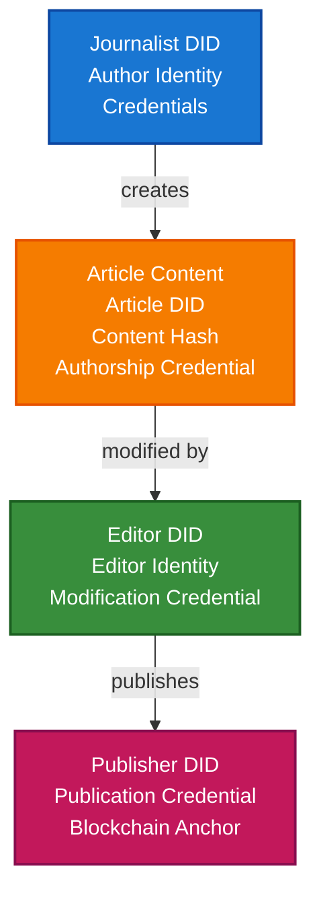

# News Industry & Content Provenance Scenario

This guide demonstrates how to build a news content provenance system using TrustWeave to track and verify the authenticity, authorship, and processing history of news articles, images, and multimedia content.

## What You'll Build

By the end of this tutorial, you'll have:

- ✅ Created DIDs for news organizations, journalists, and content
- ✅ Issued authorship credentials for articles
- ✅ Tracked content modifications and updates
- ✅ Verified content authenticity and integrity
- ✅ Built content attribution chains
- ✅ Anchored content provenance to blockchain
- ✅ Created fact-checking credentials
- ✅ Built complete news provenance system

## Big Picture & Significance

### The News Trust Crisis

The news industry faces a crisis of trust. Misinformation, deepfakes, and content manipulation have eroded public confidence. Verifiable content provenance is critical for rebuilding trust.

**Industry Context**:
- **Trust Crisis**: Only 44% of people trust news media globally
- **Misinformation**: False information spreads faster than truth
- **Deepfakes**: AI-generated content threatens authenticity
- **Regulatory Pressure**: Increasing requirements for content transparency
- **Publisher Accountability**: Need to verify content sources

**Why This Matters**:
1. **Trust**: Rebuild trust in news media
2. **Authenticity**: Verify content hasn't been manipulated
3. **Attribution**: Properly credit journalists and sources
4. **Accountability**: Hold publishers accountable
5. **Transparency**: Show content processing history
6. **Fact-Checking**: Enable verifiable fact-checking

### The Content Provenance Problem

Traditional news systems struggle with provenance because:
- **No Verification**: Can't verify content authenticity
- **No Attribution**: Missing author and source information
- **No History**: Can't track content modifications
- **No Standards**: Each publisher tracks differently
- **No Interoperability**: Can't share provenance across platforms

## Value Proposition

### Problems Solved

1. **Content Authenticity**: Verify content hasn't been manipulated
2. **Author Attribution**: Properly credit journalists
3. **Source Verification**: Verify content sources
4. **Modification Tracking**: Track all content changes
5. **Fact-Checking**: Enable verifiable fact-checking
6. **Publisher Accountability**: Hold publishers accountable
7. **Cross-Platform**: Works across news platforms

### Business Benefits

**For News Organizations**:
- **Trust**: Rebuild reader trust
- **Compliance**: Meet regulatory requirements
- **Differentiation**: Stand out with verifiable content
- **Accountability**: Clear responsibility tracking

**For Journalists**:
- **Attribution**: Proper credit for work
- **Protection**: Protect against content theft
- **Reputation**: Build verifiable reputation

**For Readers**:
- **Trust**: Verify content authenticity
- **Transparency**: See content history
- **Fact-Checking**: Verify claims

## Understanding the Problem

News content provenance faces several critical challenges:

1. **Authenticity**: Verify content hasn't been manipulated
2. **Attribution**: Properly credit authors and sources
3. **Modification Tracking**: Track all content changes
4. **Source Verification**: Verify content sources
5. **Fact-Checking**: Enable verifiable fact-checking
6. **Cross-Platform**: Share provenance across platforms

## How It Works: Content Provenance Flow



## Key Concepts

### Content Credential Types

1. **Authorship Credential**: Proves who created content
2. **Modification Credential**: Tracks content changes
3. **Publication Credential**: Records publication
4. **Fact-Check Credential**: Verifies claims
5. **Source Credential**: Verifies content sources

## Prerequisites

- Java 21+
- Kotlin 2.2.0+
- Gradle 8.5+
- Basic understanding of Kotlin and coroutines

## Step 1: Add Dependencies

Add TrustWeave dependencies to your `build.gradle.kts`. These modules provide DID/credential APIs plus the in-memory services used to model newsroom workflows.

```kotlin
dependencies {
    implementation("com.trustweave:TrustWeave-core:1.0.0-SNAPSHOT")
    implementation("com.trustweave:TrustWeave-json:1.0.0-SNAPSHOT")
    implementation("com.trustweave:TrustWeave-kms:1.0.0-SNAPSHOT")
    implementation("com.trustweave:TrustWeave-did:1.0.0-SNAPSHOT")
    implementation("com.trustweave:TrustWeave-anchor:1.0.0-SNAPSHOT")
    implementation("com.trustweave:TrustWeave-testkit:1.0.0-SNAPSHOT")
    implementation("org.jetbrains.kotlinx:kotlinx-serialization-json:1.6.0")
    implementation("org.jetbrains.kotlinx:kotlinx-coroutines-core:1.7.3")
}
```

**Result:** With dependencies in place you can execute the news provenance walkthrough without additional setup.

## Step 2: Setup and Create Journalist DID

**Purpose**: Initialize the news provenance system and create DIDs for journalists.

**Why This Matters**: Journalists need verifiable identities to claim authorship. Their DIDs provide persistent identifiers that survive across platforms and time.

**Rationale**:
- **Journalist DID**: Represents journalist identity
- **Persistent Identity**: Survives across platforms
- **Verification**: Can verify journalist credentials
- **Attribution**: Enables proper attribution

```kotlin
import com.trustweave.testkit.did.DidKeyMockMethod
import com.trustweave.testkit.kms.InMemoryKeyManagementService
import com.trustweave.did.DidMethodRegistry
import kotlinx.coroutines.runBlocking

fun main() = runBlocking {
    println("=== News Industry & Content Provenance Scenario ===\n")
    
    // Step 1: Setup services
    println("Step 1: Setting up services...")
    
    // Separate KMS for different participants
    // Journalists, editors, publishers each have their own keys
    val journalistKms = InMemoryKeyManagementService()
    val editorKms = InMemoryKeyManagementService()
    val publisherKms = InMemoryKeyManagementService()
    
    val didMethod = DidKeyMockMethod(journalistKms)
    val didRegistry = DidMethodRegistry().apply { register(didMethod) }
    
    println("Services initialized")
}
```

## Step 3: Create Journalist and Organization DIDs

**Purpose**: Create DIDs for journalists and news organizations.

**Why This Matters**: Both journalists and organizations need verifiable identities. Organizations can issue credentials to journalists, and journalists can claim authorship.

**Rationale**:
- **Journalist DID**: Individual journalist identity
- **Organization DID**: News organization identity
- **Relationship**: Organization can verify journalist credentials
- **Attribution**: Enables proper content attribution

```kotlin
    // Step 2: Create journalist and organization DIDs
    println("\nStep 2: Creating journalist and organization DIDs...")
    
    // Journalist DID represents individual journalist
    // This provides persistent identity across platforms
    val journalistDid = didMethod.createDid()
    println("Journalist DID: ${journalistDid.id}")
    
    // Organization DID represents news organization
    // Organizations can issue credentials to journalists
    val organizationDid = didMethod.createDid()
    println("Organization DID: ${organizationDid.id}")
    
    // Create journalist credential issued by organization
    // This proves journalist is affiliated with organization
    val journalistCredential = createJournalistCredential(
        journalistDid = journalistDid.id,
        organizationDid = organizationDid.id,
        name = "Alice Reporter",
        title = "Senior Journalist",
        beat = "Technology"
    )
    
    println("Journalist credential created:")
    println("  - Name: Alice Reporter")
    println("  - Title: Senior Journalist")
    println("  - Beat: Technology")
```

## Step 4: Create Article Content DID

**Purpose**: Create DID for news article content.

**Why This Matters**: Each article needs a unique identifier. The content hash ensures integrity - any modification changes the hash.

**Rationale**:
- **Article DID**: Unique identifier for article
- **Content Hash**: Ensures content integrity
- **Persistent Identity**: Survives across platforms
- **Verification**: Can verify content hasn't changed

```kotlin
import com.trustweave.credential.models.VerifiableCredential
import kotlinx.serialization.json.buildJsonObject
import kotlinx.serialization.json.put
import java.time.Instant

    // Step 3: Create article content DID
    println("\nStep 3: Creating article content DID...")
    
    // Article content
    val articleContent = """
        Breaking: New AI Technology Revolutionizes Healthcare
        
        Scientists have developed a new AI system that can diagnose diseases
        with 95% accuracy. The system uses machine learning to analyze
        medical images and patient data.
        
        "This is a breakthrough," said Dr. Smith, lead researcher.
    """.trimIndent()
    
    // Compute content hash for integrity verification
    // Any modification to content will change this hash
    val contentHash = com.trustweave.json.DigestUtils.sha256DigestMultibase(
        articleContent.encodeToByteArray()
    )
    
    // Create article DID
    val articleDid = didMethod.createDid()
    println("Article DID: ${articleDid.id}")
    println("Content Hash: $contentHash")
```

## Step 5: Create Authorship Credential

**Purpose**: Create credential proving journalist authored the article.

**Why This Matters**: Authorship credentials provide verifiable proof of who created content. This is critical for attribution and accountability.

**Rationale**:
- **Authorship Proof**: Verifiable proof of authorship
- **Attribution**: Enables proper credit
- **Accountability**: Holds authors accountable
- **Protection**: Protects against content theft

```kotlin
    // Step 4: Create authorship credential
    println("\nStep 4: Creating authorship credential...")
    
    // Authorship credential proves journalist created the article
    // This is critical for attribution and accountability
    val authorshipCredential = VerifiableCredential(
        id = "https://news.example.com/articles/${articleDid.id.substringAfterLast(":")}/authorship",
        type = listOf("VerifiableCredential", "AuthorshipCredential", "NewsCredential"),
        issuer = organizationDid.id, // Organization verifies journalist's authorship
        credentialSubject = buildJsonObject {
            put("id", journalistDid.id)
            put("authorship", buildJsonObject {
                put("articleDid", articleDid.id)
                put("contentHash", contentHash)
                put("role", "author")
                put("contribution", "primary-author")
                put("timestamp", Instant.now().toString())
            })
        },
        issuanceDate = Instant.now().toString(),
        expirationDate = null
    )
    
    println("Authorship credential created:")
    println("  - Article: ${articleDid.id}")
    println("  - Author: ${journalistDid.id}")
    println("  - Role: primary-author")
```

## Step 6: Issue Authorship Credential

**Purpose**: Cryptographically sign authorship credential.

**Why This Matters**: Cryptographic proof ensures authorship claims cannot be forged. This is critical for trust and accountability.

**Rationale**:
- **Key Generation**: Generate organization's signing key
- **Proof Generation**: Create cryptographic proof
- **Credential Issuance**: Sign credential
- **Verification**: Anyone can verify authorship

```kotlin
import com.trustweave.credential.issuer.CredentialIssuer
import com.trustweave.credential.proof.Ed25519ProofGenerator
import com.trustweave.credential.CredentialIssuanceOptions

    // Step 5: Issue authorship credential
    println("\nStep 5: Issuing authorship credential...")
    
    // Generate organization's signing key
    val orgKey = publisherKms.generateKey("Ed25519")
    
    // Create proof generator
    val orgProofGenerator = Ed25519ProofGenerator(
        signer = { data, keyId -> publisherKms.sign(keyId, data) },
        getPublicKeyId = { keyId -> orgKey.id }
    )
    val didResolver = CredentialDidResolver { did ->
        didRegistry.resolve(did).toCredentialDidResolution()
    }
    
    // Create credential issuer
    val orgIssuer = CredentialIssuer(
        proofGenerator = orgProofGenerator,
        resolveDid = { did -> didResolver.resolve(did)?.isResolvable == true }
    )
    
    // Issue authorship credential
    val issuedAuthorshipCredential = orgIssuer.issue(
        credential = authorshipCredential,
        issuerDid = organizationDid.id,
        keyId = orgKey.id,
        options = CredentialIssuanceOptions(proofType = "Ed25519Signature2020")
    )
    
    println("Authorship credential issued:")
    println("  - Proof: ${issuedAuthorshipCredential.proof != null}")
```

## Step 7: Track Content Modifications

**Purpose**: Track article edits and modifications.

**Why This Matters**: News articles are often edited. Tracking modifications provides transparency and accountability.

**Rationale**:
- **Modification Tracking**: Record all changes
- **Editor Attribution**: Credit editors
- **Transparency**: Show modification history
- **Accountability**: Hold editors accountable

```kotlin
    // Step 6: Track content modifications
    println("\nStep 6: Tracking content modifications...")
    
    // Editor DID
    val editorDid = didMethod.createDid()
    
    // Modified article content
    val modifiedContent = """
        Breaking: New AI Technology Revolutionizes Healthcare
        
        Scientists have developed a new AI system that can diagnose diseases
        with 98% accuracy. The system uses advanced machine learning to analyze
        medical images and patient data.
        
        "This is a breakthrough that will transform healthcare," said Dr. Smith,
        lead researcher at the Medical Research Institute.
    """.trimIndent()
    
    val modifiedHash = com.trustweave.json.DigestUtils.sha256DigestMultibase(
        modifiedContent.encodeToByteArray()
    )
    
    // Create modification credential
    // This tracks what was changed and by whom
    val modificationCredential = VerifiableCredential(
        type = listOf("VerifiableCredential", "ModificationCredential", "NewsCredential"),
        issuer = organizationDid.id,
        credentialSubject = buildJsonObject {
            put("modification", buildJsonObject {
                put("articleDid", articleDid.id)
                put("previousHash", contentHash)
                put("newHash", modifiedHash)
                put("editorDid", editorDid.id)
                put("changes", buildJsonObject {
                    put("accuracyUpdated", "95% → 98%")
                    put("quoteExtended", "true")
                    put("institutionAdded", "Medical Research Institute")
                })
                put("timestamp", Instant.now().toString())
            })
        },
        issuanceDate = Instant.now().toString()
    )
    
    // Issue modification credential
    val issuedModificationCredential = orgIssuer.issue(
        credential = modificationCredential,
        issuerDid = organizationDid.id,
        keyId = orgKey.id,
        options = CredentialIssuanceOptions(proofType = "Ed25519Signature2020")
    )
    
    println("Modification credential created:")
    println("  - Editor: ${editorDid.id}")
    println("  - Changes: accuracy updated, quote extended")
```

## Step 8: Create Publication Credential

**Purpose**: Record article publication.

**Why This Matters**: Publication credentials record when and where content was published. This is critical for copyright and accountability.

**Rationale**:
- **Publication Record**: Records publication event
- **Timestamp**: When content was published
- **Platform**: Where content was published
- **Accountability**: Holds publisher accountable

```kotlin
    // Step 7: Create publication credential
    println("\nStep 7: Creating publication credential...")
    
    // Publication credential records when article was published
    val publicationCredential = VerifiableCredential(
        type = listOf("VerifiableCredential", "PublicationCredential", "NewsCredential"),
        issuer = organizationDid.id,
        credentialSubject = buildJsonObject {
            put("publication", buildJsonObject {
                put("articleDid", articleDid.id)
                put("contentHash", modifiedHash) // Use latest hash
                put("publisherDid", organizationDid.id)
                put("publicationDate", Instant.now().toString())
                put("platform", "https://news.example.com")
                put("url", "https://news.example.com/articles/ai-healthcare-breakthrough")
            })
        },
        issuanceDate = Instant.now().toString()
    )
    
    // Issue publication credential
    val issuedPublicationCredential = orgIssuer.issue(
        credential = publicationCredential,
        issuerDid = organizationDid.id,
        keyId = orgKey.id,
        options = CredentialIssuanceOptions(proofType = "Ed25519Signature2020")
    )
    
    println("Publication credential created:")
    println("  - Publisher: ${organizationDid.id}")
    println("  - Platform: https://news.example.com")
    println("  - URL: https://news.example.com/articles/ai-healthcare-breakthrough")
```

## Step 9: Create Fact-Check Credential

**Purpose**: Create credential verifying article claims.

**Why This Matters**: Fact-checking credentials provide verifiable proof that claims have been verified. This is critical for trust and combating misinformation.

**Rationale**:
- **Fact Verification**: Verifies article claims
- **Fact-Checker Identity**: Who verified the facts
- **Verification Method**: How facts were verified
- **Trust**: Builds reader trust

```kotlin
    // Step 8: Create fact-check credential
    println("\nStep 8: Creating fact-check credential...")
    
    // Fact-checker DID
    val factCheckerDid = didMethod.createDid()
    
    // Fact-check credential verifies article claims
    val factCheckCredential = VerifiableCredential(
        type = listOf("VerifiableCredential", "FactCheckCredential", "NewsCredential"),
        issuer = factCheckerDid.id, // Independent fact-checker
        credentialSubject = buildJsonObject {
            put("factCheck", buildJsonObject {
                put("articleDid", articleDid.id)
                put("claims", buildJsonObject {
                    put("claim1", buildJsonObject {
                        put("text", "AI system diagnoses with 98% accuracy")
                        put("status", "verified")
                        put("source", "Medical Research Institute Study")
                        put("verificationDate", Instant.now().toString())
                    })
                    put("claim2", buildJsonObject {
                        put("text", "Dr. Smith is lead researcher")
                        put("status", "verified")
                        put("source", "Institution Website")
                    })
                })
                put("overallRating", "verified")
                put("factCheckerDid", factCheckerDid.id)
            })
        },
        issuanceDate = Instant.now().toString()
    )
    
    // Issue fact-check credential
    val factCheckerKey = journalistKms.generateKey("Ed25519")
    val factCheckerProofGenerator = Ed25519ProofGenerator(
        signer = { data, keyId -> journalistKms.sign(keyId, data) },
        getPublicKeyId = { keyId -> factCheckerKey.id }
    )
    val factCheckerProofRegistry = ProofGeneratorRegistry().apply {
        register(factCheckerProofGenerator)
    }
    
    val factCheckerIssuer = CredentialIssuer(
        proofGenerator = factCheckerProofGenerator,
        resolveDid = { did -> didRegistry.resolve(did) != null },
        proofRegistry = factCheckerProofRegistry
    )
    
    val issuedFactCheckCredential = factCheckerIssuer.issue(
        credential = factCheckCredential,
        issuerDid = factCheckerDid.id,
        keyId = factCheckerKey.id,
        options = CredentialIssuanceOptions(proofType = "Ed25519Signature2020")
    )
    
    println("Fact-check credential created:")
    println("  - Fact-checker: ${factCheckerDid.id}")
    println("  - Overall rating: verified")
    println("  - Claims verified: 2")
```

## Step 10: Verify Content Authenticity

**Purpose**: Verify article content hasn't been tampered with.

**Why This Matters**: Content verification ensures readers can trust content hasn't been manipulated. This is critical for combating misinformation.

**Rationale**:
- **Content Verification**: Verify content hash matches
- **Credential Verification**: Verify all credentials
- **Chain Verification**: Verify complete provenance chain
- **Trust**: Builds reader trust

```kotlin
import com.trustweave.credential.verifier.CredentialVerifier
import com.trustweave.credential.CredentialVerificationOptions

    // Step 9: Verify content authenticity
    println("\nStep 9: Verifying content authenticity...")
    
    val verifier = CredentialVerifier(didResolver)
    
    // Verify all credentials
    val credentials = listOf(
        issuedAuthorshipCredential,
        issuedModificationCredential,
        issuedPublicationCredential,
        issuedFactCheckCredential
    )
    
    credentials.forEach { credential ->
        val verification = verifier.verify(
            credential = credential,
            options = CredentialVerificationOptions(
                checkRevocation = false,
                checkExpiration = false,
                didResolver = didResolver
            )
        )
        
        if (verification.valid) {
            println("✅ Credential verified: ${credential.type.firstOrNull()}")
        } else {
            println("❌ Credential verification failed:")
            verification.errors.forEach { println("  - $it") }
        }
    }
    
    // Verify content hash matches
    val currentContentHash = com.trustweave.json.DigestUtils.sha256DigestMultibase(
        modifiedContent.encodeToByteArray()
    )
    
    if (currentContentHash == modifiedHash) {
        println("✅ Content hash verified - content hasn't been tampered with")
    } else {
        println("❌ Content hash mismatch - content may have been modified")
    }
```

## Step 11: Anchor Content to Blockchain

**Purpose**: Create immutable record of content provenance.

**Why This Matters**: Blockchain anchoring provides permanent, tamper-proof record. This enables long-term verification and accountability.

**Rationale**:
- **Immutability**: Cannot be tampered with
- **Audit Trail**: Permanent record
- **Verification**: Anyone can verify
- **Accountability**: Holds publishers accountable

```kotlin
import com.trustweave.testkit.anchor.InMemoryBlockchainAnchorClient
import com.trustweave.anchor.BlockchainAnchorRegistry
import com.trustweave.anchor.anchorTyped
import kotlinx.serialization.Serializable
import kotlinx.serialization.json.Json

@Serializable
data class ContentProvenanceRecord(
    val articleDid: String,
    val authorDid: String,
    val publisherDid: String,
    val contentHash: String,
    val publicationDate: String,
    val provenanceDigest: String
)

    // Step 10: Anchor content to blockchain
    println("\nStep 10: Anchoring content to blockchain...")
    
    val anchorClient = InMemoryBlockchainAnchorClient("eip155:1", emptyMap())
    val blockchainRegistry = BlockchainAnchorRegistry().apply {
        register("eip155:1", anchorClient)
    }
    
    // Create provenance record
    val provenanceDigest = com.trustweave.json.DigestUtils.sha256DigestMultibase(
        Json.encodeToJsonElement(
            VerifiableCredential.serializer(),
            issuedPublicationCredential
        )
    )
    
    val provenanceRecord = ContentProvenanceRecord(
        articleDid = articleDid.id,
        authorDid = journalistDid.id,
        publisherDid = organizationDid.id,
        contentHash = modifiedHash,
        publicationDate = Instant.now().toString(),
        provenanceDigest = provenanceDigest
    )
    
    // Anchor to blockchain
    val anchorResult = blockchainRegistry.anchorTyped(
        value = provenanceRecord,
        serializer = ContentProvenanceRecord.serializer(),
        targetChainId = "eip155:137"
    )
    
    println("Content anchored to blockchain:")
    println("  - Transaction hash: ${anchorResult.ref.txHash}")
    println("  - Provides immutable provenance record")
    println("  - Enables long-term verification")
}

fun createJournalistCredential(
    journalistDid: String,
    organizationDid: String,
    name: String,
    title: String,
    beat: String
): VerifiableCredential {
    return VerifiableCredential(
        type = listOf("VerifiableCredential", "JournalistCredential"),
        issuer = organizationDid,
        credentialSubject = buildJsonObject {
            put("id", journalistDid)
            put("journalist", buildJsonObject {
                put("name", name)
                put("title", title)
                put("beat", beat)
                put("organizationDid", organizationDid)
            })
        },
        issuanceDate = Instant.now().toString(),
        expirationDate = null
    )
}
```

## Advanced Features

### Multi-Author Articles

Track articles with multiple authors:

```kotlin
fun createMultiAuthorCredential(
    articleDid: String,
    authors: List<String>,
    organizationDid: String
): VerifiableCredential {
    return VerifiableCredential(
        type = listOf("VerifiableCredential", "AuthorshipCredential"),
        issuer = organizationDid,
        credentialSubject = buildJsonObject {
            put("authorship", buildJsonObject {
                put("articleDid", articleDid)
                put("authors", authors.mapIndexed { index, authorDid ->
                    buildJsonObject {
                        put("authorDid", authorDid)
                        put("role", if (index == 0) "primary-author" else "co-author")
                        put("contribution", "equal")
                    }
                })
            })
        },
        issuanceDate = Instant.now().toString()
    )
}
```

### Content Versioning

Track multiple versions of content:

```kotlin
fun createVersionCredential(
    articleDid: String,
    version: Int,
    previousVersionHash: String,
    currentVersionHash: String,
    editorDid: String
): VerifiableCredential {
    return VerifiableCredential(
        type = listOf("VerifiableCredential", "VersionCredential"),
        issuer = editorDid,
        credentialSubject = buildJsonObject {
            put("version", buildJsonObject {
                put("articleDid", articleDid)
                put("versionNumber", version)
                put("previousHash", previousVersionHash)
                put("currentHash", currentVersionHash)
                put("editorDid", editorDid)
            })
        },
        issuanceDate = Instant.now().toString()
    )
}
```

## Real-World Use Cases

### 1. Breaking News Verification

**Scenario**: Verify breaking news content authenticity.

**Implementation**: Use authorship and publication credentials to verify content source and publication.

### 2. Investigative Journalism

**Scenario**: Track investigative article through research, writing, editing, and publication.

**Implementation**: Use provenance chain to track article through all stages.

### 3. Photo Journalism

**Scenario**: Verify photo authenticity and attribution.

**Implementation**: Use content hash and authorship credentials for photos.

## Benefits

1. **Content Authenticity**: Verify content hasn't been manipulated
2. **Author Attribution**: Properly credit journalists
3. **Source Verification**: Verify content sources
4. **Modification Tracking**: Track all content changes
5. **Fact-Checking**: Enable verifiable fact-checking
6. **Publisher Accountability**: Hold publishers accountable
7. **Cross-Platform**: Works across news platforms
8. **Trust**: Rebuild reader trust
9. **Compliance**: Meet regulatory requirements
10. **Transparency**: Show content history

## Best Practices

1. **Content Hashing**: Always hash content for integrity
2. **Author Attribution**: Always attribute content to authors
3. **Modification Tracking**: Track all content changes
4. **Fact-Checking**: Verify claims with fact-check credentials
5. **Blockchain Anchoring**: Anchor critical content
6. **Credential Verification**: Verify all credentials
7. **Error Handling**: Handle verification failures
8. **Documentation**: Document content processing
9. **Privacy**: Respect source privacy
10. **Standards**: Follow industry standards

## Next Steps

- Learn about [Digital Workflow & Provenance Scenario](digital-workflow-provenance-scenario.md) for related concepts
- Explore [Earth Observation Scenario](earth-observation-scenario.md) for data integrity
- Check out [Academic Credentials Scenario](academic-credentials-scenario.md) for credential concepts
- Review [Core Concepts: Verifiable Credentials](../core-concepts/verifiable-credentials.md) for credential details


