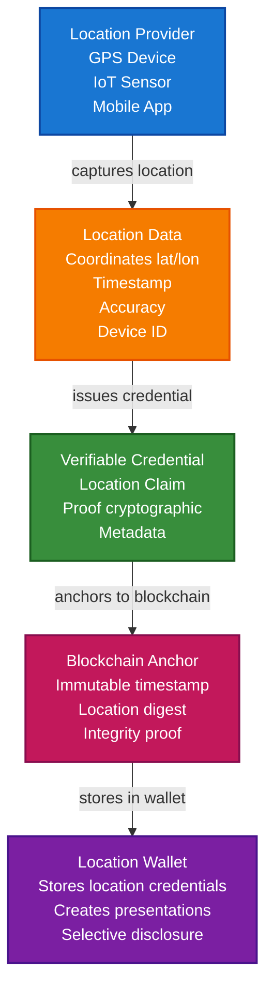

# Proof of Location Scenario

This guide demonstrates how to implement proof of location credentials using TrustWeave, inspired by decentralized geospatial web concepts. You'll learn how to create location-based verifiable credentials, anchor them to blockchains for tamper-proof verification, and build a system for geospatial data integrity.

## What You'll Build

By the end of this tutorial, you'll have:

- ✅ Created DIDs for location providers and verifiers
- ✅ Issued Verifiable Credentials proving location claims
- ✅ Anchored location proofs to blockchain for immutability
- ✅ Built a location verification system
- ✅ Created location-based presentations with selective disclosure
- ✅ Implemented geospatial data integrity verification

## Big Picture & Significance

### The Location Verification Challenge

Location data is critical for many applications, but verifying location claims and protecting privacy are fundamental challenges. Traditional systems rely on central authorities and don't protect user privacy.

**Industry Context**:
- **Market Size**: Location-based services market projected to reach $157 billion by 2026
- **Privacy Concerns**: Location data is highly sensitive
- **Trust Requirements**: Need to verify location claims for critical applications
- **Regulatory Pressure**: GDPR and other regulations require location data protection
- **Decentralization**: Growing demand for decentralized location verification

**Why This Matters**:
1. **Privacy**: Protect sensitive location data
2. **Trust**: Verify location claims cryptographically
3. **Decentralization**: Avoid reliance on central authorities
4. **Integrity**: Ensure location data hasn't been tampered with
5. **Selective Disclosure**: Share location without revealing exact coordinates
6. **Compliance**: Meet regulatory requirements for location data

### The Location Verification Problem

Traditional location systems face critical issues:
- **Centralized Trust**: Reliance on single authorities creates bottlenecks
- **Privacy Violations**: Location data often shared without consent
- **No Verification**: Can't verify location claims
- **No Integrity**: Location data can be tampered with
- **No Interoperability**: Different systems can't verify each other's claims

## Value Proposition

### Problems Solved

1. **Cryptographic Proof**: Location claims are cryptographically signed
2. **Privacy Protection**: Selective disclosure protects sensitive data
3. **Blockchain Anchoring**: Immutable proof of when/where data was created
4. **Verifiable Credentials**: Standard format for location claims
5. **Self-Sovereign**: Users control their location data
6. **Interoperability**: Standard format works across systems
7. **Decentralization**: No reliance on central authorities

### Business Benefits

**For Users**:
- **Privacy**: Control what location information is shared
- **Trust**: Verify location claims cryptographically
- **Control**: Own and control location data
- **Portability**: Location credentials work across platforms

**For Service Providers**:
- **Trust**: Verify location claims without intermediaries
- **Compliance**: Meet regulatory requirements
- **Efficiency**: Automated location verification
- **Innovation**: Enable new location-based services

**For Regulators**:
- **Audit Trails**: Complete location data records
- **Privacy**: Enhanced privacy protection
- **Compliance**: Meet regulatory requirements

### ROI Considerations

- **Privacy**: Enhanced privacy protection reduces liability
- **Trust**: Increased trust enables new use cases
- **Compliance**: Automated compliance reduces costs
- **Innovation**: Enable new location-based services

## Understanding the Problem

Geospatial data and location claims face several challenges:

1. **Trust**: How do you verify someone was actually at a location?
2. **Privacy**: Location data is highly sensitive and needs protection
3. **Integrity**: Geospatial data can be tampered with
4. **Provenance**: Need to track where location data came from
5. **Decentralization**: Avoid reliance on central authorities

TrustWeave solves this by enabling:

- **Cryptographic proof**: Location claims are cryptographically signed
- **Selective disclosure**: Share location without revealing exact coordinates
- **Blockchain anchoring**: Immutable proof of when/where data was created
- **Verifiable credentials**: Standard format for location claims
- **Self-sovereign**: Users control their location data

## How It Works: Location Proof Flow



## Prerequisites

- Java 21+
- Kotlin 2.2.0+
- Gradle 8.5+
- Basic understanding of Kotlin and coroutines
- Basic understanding of geospatial concepts (coordinates, bounding boxes)

## Step 1: Add Dependencies

Add TrustWeave dependencies to your `build.gradle.kts`. These modules provide DID support, credential issuance, wallet storage, and the in-memory services used for location proofs.

```kotlin
dependencies {
    // Core TrustWeave modules
    implementation("com.trustweave:trustweave-core:1.0.0-SNAPSHOT")
    implementation("com.trustweave:trustweave-json:1.0.0-SNAPSHOT")
    implementation("com.trustweave:trustweave-kms:1.0.0-SNAPSHOT")
    implementation("com.trustweave:trustweave-did:1.0.0-SNAPSHOT")
    implementation("com.trustweave:trustweave-anchor:1.0.0-SNAPSHOT")

    // Test kit for in-memory implementations
    implementation("com.trustweave:trustweave-testkit:1.0.0-SNAPSHOT")

    // Kotlinx Serialization
    implementation("org.jetbrains.kotlinx:kotlinx-serialization-json:1.6.0")

    // Coroutines
    implementation("org.jetbrains.kotlinx:kotlinx-coroutines-core:1.7.3")
}
```

**Result:** With these dependencies synced, you can run the location proof samples without adding more modules or adapters.

## Step 2: Complete Example

Here’s the complete proof-of-location workflow. Execute it once to see the happy path (capture → issue → store → present → verify → anchor) before you inspect each step in detail.

```kotlin
import com.trustweave.credential.models.VerifiableCredential
import com.trustweave.credential.models.VerifiablePresentation
import com.trustweave.credential.CredentialIssuanceOptions
import com.trustweave.credential.CredentialVerificationOptions
import com.trustweave.credential.PresentationOptions
import com.trustweave.credential.issuer.CredentialIssuer
import com.trustweave.credential.verifier.CredentialVerifier
import com.trustweave.credential.proof.Ed25519ProofGenerator
import com.trustweave.credential.proof.ProofGeneratorRegistry
import com.trustweave.testkit.credential.InMemoryWallet
import com.trustweave.testkit.did.DidKeyMockMethod
import com.trustweave.testkit.kms.InMemoryKeyManagementService
import com.trustweave.testkit.anchor.InMemoryBlockchainAnchorClient
import com.trustweave.did.DidMethodRegistry
import com.trustweave.anchor.BlockchainAnchorRegistry
import com.trustweave.anchor.anchorTyped
import com.trustweave.anchor.AnchorResult
import kotlinx.serialization.json.Json

@Serializable
data class LocationClaim(
    val latitude: Double,
    val longitude: Double,
    val accuracy: Double, // meters
    val altitude: Double? = null,
    val timestamp: String,
    val deviceId: String,
    val locationMethod: String = "GPS" // GPS, WiFi, Cell Tower, etc.
)

@Serializable
data class LocationProof(
    val locationClaim: LocationClaim,
    val credentialDigest: String,
    val anchorRef: String? = null
)

fun main() = runBlocking {
    println("=== Proof of Location Scenario ===\n")

    // Step 1: Setup services
    println("Step 1: Setting up services...")
    val locationProviderKms = InMemoryKeyManagementService()
    val verifierKms = InMemoryKeyManagementService()

    val didMethod = DidKeyMockMethod(locationProviderKms)
    val didRegistry = DidMethodRegistry().apply { register(didMethod) }

    // Initialize TrustWeave
    val trustWeave = TrustWeave.build {
        keyManagementService(locationProviderKms)
        didMethodRegistry(didRegistry)
        credentialService { CredentialService() }
    }

    // Setup blockchain for anchoring
    val anchorClient = InMemoryBlockchainAnchorClient("eip155:1", emptyMap())
    val blockchainRegistry = BlockchainAnchorRegistry().apply {
        register("eip155:1", anchorClient)
    }

    // Step 2: Create DIDs
    println("\nStep 2: Creating DIDs...")
    val locationProviderDid = didMethod.createDid()
    println("Location Provider DID: ${locationProviderDid.id}")

    val deviceDid = didMethod.createDid()
    println("Device DID: ${deviceDid.id}")

    // Step 3: Create location wallet
    println("\nStep 3: Creating location wallet...")
    val locationWallet = InMemoryWallet(
        walletDid = deviceDid.id,
        holderDid = deviceDid.id
    )
    println("Location wallet created: ${locationWallet.walletId}")

    // Step 4: Capture location data
    println("\nStep 4: Capturing location data...")
    val locationClaim = LocationClaim(
        latitude = 37.7749,
        longitude = -122.4194,
        accuracy = 10.5, // 10.5 meters accuracy
        altitude = 52.0,
        timestamp = Instant.now().toString(),
        deviceId = deviceDid.id,
        locationMethod = "GPS"
    )
    println("Location captured:")
    println("  - Coordinates: (${locationClaim.latitude}, ${locationClaim.longitude})")
    println("  - Accuracy: ${locationClaim.accuracy} meters")
    println("  - Timestamp: ${locationClaim.timestamp}")

    // Step 5: Create location credential
    println("\nStep 5: Creating location credential...")
    val issuerKeyId = locationProviderKms.generateKey("Ed25519").id
    val locationResult = trustWeave.issue {
        credential {
            id("https://example.com/location/${deviceDid.id.substringAfterLast(":")}-${Instant.now().toEpochMilli()}")
            type("VerifiableCredential", "LocationCredential", "ProofOfLocation")
            issuer(locationProviderDid.id)
            subject {
                id(deviceDid.id)
                "location" {
                    "latitude" to locationClaim.latitude
                    "longitude" to locationClaim.longitude
                    "accuracy" to locationClaim.accuracy
                    locationClaim.altitude?.let { "altitude" to it }
                    "timestamp" to locationClaim.timestamp
                    "deviceId" to locationClaim.deviceId
                    "locationMethod" to locationClaim.locationMethod
                }
            }
            issued(Instant.now())
            // Location proofs typically don't expire - no expires() call
            schema("https://example.com/schemas/location.json")
        }
        signedBy(issuerDid = locationProviderDid.id, keyId = issuerKeyId)
    }
    
    val issuedCredential = when (locationResult) {
        is com.trustweave.credential.results.IssuanceResult.Success -> locationResult.credential
        else -> throw IllegalStateException("Failed to create location credential: ${locationResult.allErrors.joinToString()}")
    }

    println("Credential issued:")
    println("  - Type: ${issuedCredential.type}")
    println("  - Has proof: ${issuedCredential.proof != null}")

    // Step 7: Compute digest and anchor to blockchain
    println("\nStep 7: Anchoring location proof to blockchain...")
    val credentialDigest = DigestUtils.sha256DigestMultibase(
        kotlinx.serialization.json.Json.encodeToJsonElement(
            com.trustweave.credential.models.VerifiableCredential.serializer(),
            issuedCredential
        )
    )

    val locationProof = LocationProof(
        locationClaim = locationClaim,
        credentialDigest = credentialDigest
    )

    val anchorResult = blockchainRegistry.anchorTyped(
        value = locationProof,
        serializer = LocationProof.serializer(),
        targetChainId = "eip155:1"
    )

    println("Location proof anchored:")
    println("  - Transaction hash: ${anchorResult.ref.txHash}")
    println("  - Chain ID: ${anchorResult.ref.chainId}")
    println("  - Digest: $credentialDigest")

    // Step 8: Store credential in wallet
    println("\nStep 8: Storing credential in wallet...")
    val credentialId = locationWallet.store(issuedCredential)
    println("Credential stored with ID: $credentialId")

    // Step 9: Organize location credentials
    println("\nStep 9: Organizing location credentials...")
    val locationCollection = locationWallet.createCollection(
        name = "Location History",
        description = "Historical location proofs"
    )
    locationWallet.addToCollection(credentialId, locationCollection)

    // Tag by location type
    val locationTags = when {
        locationClaim.latitude > 37.7 && locationClaim.latitude < 37.8 ->
            setOf("san-francisco", "california", "usa", "gps")
        else -> setOf("location", "gps", "verified")
    }
    locationWallet.tagCredential(credentialId, locationTags)

    // Add metadata
    locationWallet.addMetadata(credentialId, mapOf(
        "city" to "San Francisco",
        "country" to "USA",
        "anchorTxHash" to anchorResult.ref.txHash,
        "accuracy" to locationClaim.accuracy
    ))

    println("Created collection: $locationCollection")
    println("Added tags: ${locationTags.joinToString()}")

    // Step 10: Query location credentials
    println("\nStep 10: Querying location credentials...")
    val recentLocations = locationWallet.query {
        byType("LocationCredential")
        valid()
    }
    println("Found ${recentLocations.size} valid location credentials")

    // Find locations in specific area (using tags)
    val sfLocations = locationWallet.findByTag("san-francisco")
    println("San Francisco locations: ${sfLocations.size}")

    // Step 11: Create location presentation with selective disclosure
    println("\nStep 11: Creating location presentation...")

    // Selective disclosure: reveal approximate location but not exact coordinates
    val approximatePresentation = locationWallet.createSelectiveDisclosure(
        credentialIds = listOf(credentialId),
        disclosedFields = listOf(
            "location.timestamp",
            "location.locationMethod"
            // Exact coordinates NOT disclosed for privacy
        ),
        holderDid = deviceDid.id,
        options = PresentationOptions(
            holderDid = deviceDid.id,
            proofType = "Ed25519Signature2020",
            challenge = "location-verification-${Instant.now().toEpochMilli()}"
        )
    )
    println("Approximate location presentation created (coordinates hidden)")

    // Full location presentation (for trusted verifiers)
    val fullPresentation = locationWallet.createPresentation(
        credentialIds = listOf(credentialId),
        holderDid = deviceDid.id,
        options = PresentationOptions(
            holderDid = deviceDid.id,
            proofType = "Ed25519Signature2020",
            challenge = "full-location-verification"
        )
    )
    println("Full location presentation created")

    // Step 12: Verify location credential
    println("\nStep 12: Verifying location credential...")
    val verifier = CredentialVerifier(didRegistry.resolve(deviceDid.id) ?: throw IllegalArgumentException("Device DID not found"))

    val verificationResult = verifier.verify(
        credential = issuedCredential,
        options = CredentialVerificationOptions(
            checkRevocation = false,
            checkExpiration = false, // Location proofs don't expire
            validateSchema = false,
            didResolver = { did -> didRegistry.resolve(did) != null }
        )
    )

    if (verificationResult.valid) {
        println("✅ Location credential is valid!")
        println("  - Proof valid: ${verificationResult.proofValid}")
        println("  - Issuer valid: ${verificationResult.issuerValid}")
        println("  - Schema valid: ${verificationResult.schemaValid}")
    } else {
        println("❌ Location credential verification failed:")
        verificationResult.errors.forEach { println("  - $it") }
    }

    // Step 13: Verify blockchain anchor
    println("\nStep 13: Verifying blockchain anchor...")
    val retrievedProof = blockchainRegistry.readTyped<LocationProof>(
        ref = anchorResult.ref,
        serializer = LocationProof.serializer()
    )

    val retrievedDigest = retrievedProof.credentialDigest
    if (retrievedDigest == credentialDigest) {
        println("✅ Blockchain anchor verified!")
        println("  - Digest matches: $retrievedDigest")
        println("  - Location proof is immutable")
    } else {
        println("❌ Digest mismatch - location proof may have been tampered with")
    }

    // Step 14: Location-based queries
    println("\nStep 14: Location-based queries...")
    val stats = locationWallet.getStatistics()
    println("""
        Location Wallet Statistics:
        - Total location credentials: ${stats.totalCredentials}
        - Valid credentials: ${stats.validCredentials}
        - Collections: ${stats.collectionsCount}
        - Tags: ${stats.tagsCount}
    """.trimIndent())

    println("\n=== Scenario Complete ===")
}

**Result:** Console output walks through each milestone—location capture, credential issuance, wallet storage, presentation, verification, anchoring. Use it as your regression baseline.

## Step-by-Step Breakdown

### Step 1: Setup Services

Captures a raw location claim and sets up DID registries, wallets, and proof generators for both provider and verifier.
- **Outcome:** The environment mirrors a decentralised location system without external infrastructure.

```kotlin
val locationProviderKms = InMemoryKeyManagementService()
val anchorClient = InMemoryBlockchainAnchorClient("eip155:1", emptyMap())
val blockchainRegistry = BlockchainAnchorRegistry().apply {
    register("eip155:1", anchorClient)
}
```

### Step 2: Create Location Claim

Capture location data from device:

```kotlin
val locationClaim = LocationClaim(
    latitude = 37.7749,
    longitude = -122.4194,
    accuracy = 10.5, // meters
    timestamp = Instant.now().toString(),
    deviceId = deviceDid.id,
    locationMethod = "GPS"
)
```

### Step 3: Create Location Credential

Create a verifiable credential for the location:

```kotlin
// Note: In actual usage, use trustWeave.issue { } DSL:
// val locationResult = trustWeave.issue {
//     credential {
//         type("VerifiableCredential", "LocationCredential")
//         issuer(locationProviderDid.id)
//         subject {
//             "location" {
//                 "latitude" to locationClaim.latitude
//                 "longitude" to locationClaim.longitude
//                 "accuracy" to locationClaim.accuracy
//                 "timestamp" to locationClaim.timestamp
//             }
//         }
//         issued(Instant.now())
//     }
//     signedBy(issuerDid = locationProviderDid.id, keyId = issuerKeyId)
// }
```

### Step 4: Issue and Anchor

Issues a location credential with typed geospatial claims plus metadata (accuracy, method, timestamp).
- **Outcome:** `locationCredential` is ready to store, present, and anchor.

```kotlin
val issuedCredential = credentialIssuer.issue(...)

val credentialDigest = DigestUtils.sha256DigestMultibase(
    Json.encodeToJsonElement(issuedCredential)
)

val locationProof = LocationProof(
    locationClaim = locationClaim,
    credentialDigest = credentialDigest
)

val anchorResult = blockchainRegistry.anchorTyped(
    value = locationProof,
    serializer = LocationProof.serializer(),
    targetChainId = "eip155:1"
)
```

### Step 5: Store and Organize

Stores the credential in the user’s wallet so it can be queried and presented later.
- **Outcome:** The user gains custody of the proof for subsequent sharing.

```kotlin
val credentialId = locationWallet.store(issuedCredential)

val locationCollection = locationWallet.createCollection("Location History")
locationWallet.addToCollection(credentialId, locationCollection)
locationWallet.tagCredential(credentialId, setOf("san-francisco", "gps"))
```

### Step 6: Selective Disclosure

Share location with privacy:

```kotlin
// Approximate location (privacy-preserving)
val approximatePresentation = locationWallet.createSelectiveDisclosure(
    credentialIds = listOf(credentialId),
    disclosedFields = listOf(
        "location.timestamp",
        "location.locationMethod"
        // Coordinates hidden
    ),
    holderDid = deviceDid.id,
    options = PresentationOptions(...)
)
```

## Advanced Geospatial Features

### Geofencing Verification

Verify location within a geographic boundary:

```kotlin
fun verifyLocationInGeofence(
    credential: VerifiableCredential,
    minLat: Double,
    maxLat: Double,
    minLon: Double,
    maxLon: Double
): Boolean {
    val location = credential.credentialSubject.jsonObject["location"]?.jsonObject
        ?: return false

    val lat = location["latitude"]?.jsonPrimitive?.content?.toDouble() ?: return false
    val lon = location["longitude"]?.jsonPrimitive?.content?.toDouble() ?: return false

    return lat in minLat..maxLat && lon in minLon..maxLon
}

// Usage: Verify device is in San Francisco
val inSF = verifyLocationInGeofence(
    credential = issuedCredential,
    minLat = 37.7,
    maxLat = 37.8,
    minLon = -122.5,
    maxLon = -122.3
)
```

### Distance-Based Verification

Verify location within a certain distance:

```kotlin
fun verifyLocationWithinDistance(
    credential: VerifiableCredential,
    targetLat: Double,
    targetLon: Double,
    maxDistance: Double // meters
): Boolean {
    val location = credential.credentialSubject.jsonObject["location"]?.jsonObject
        ?: return false

    val lat = location["latitude"]?.jsonPrimitive?.content?.toDouble() ?: return false
    val lon = location["longitude"]?.jsonPrimitive?.content?.toDouble() ?: return false
    val accuracy = location["accuracy"]?.jsonPrimitive?.content?.toDouble() ?: Double.MAX_VALUE

    val distance = calculateHaversineDistance(lat, lon, targetLat, targetLon)

    // Account for location accuracy
    return distance <= (maxDistance + accuracy)
}

// Haversine formula for great-circle distance
fun calculateHaversineDistance(
    lat1: Double,
    lon1: Double,
    lat2: Double,
    lon2: Double
): Double {
    val earthRadius = 6371000.0 // meters
    val dLat = Math.toRadians(lat2 - lat1)
    val dLon = Math.toRadians(lon2 - lon1)
    val a = Math.sin(dLat / 2) * Math.sin(dLat / 2) +
            Math.cos(Math.toRadians(lat1)) * Math.cos(Math.toRadians(lat2)) *
            Math.sin(dLon / 2) * Math.sin(dLon / 2)
    val c = 2 * Math.atan2(Math.sqrt(a), Math.sqrt(1 - a))
    return earthRadius * c
}

### Privacy-Preserving Location Sharing

Share location without revealing exact coordinates:

```kotlin
fun createPrivacyPreservingLocationPresentation(
    wallet: Wallet,
    credentialId: String,
    privacyLevel: PrivacyLevel
): VerifiablePresentation {
    return when (privacyLevel) {
        PrivacyLevel.EXACT -> {
            // Share exact coordinates
            wallet.createPresentation(
                credentialIds = listOf(credentialId),
                holderDid = wallet.holderDid,
                options = PresentationOptions(...)
            )
        }
        PrivacyLevel.APPROXIMATE -> {
            // Share approximate location (rounded coordinates)
            wallet.createSelectiveDisclosure(
                credentialIds = listOf(credentialId),
                disclosedFields = listOf(
                    "location.timestamp",
                    "location.locationMethod"
                    // Coordinates rounded/obfuscated
                ),
                holderDid = wallet.holderDid,
                options = PresentationOptions(...)
            )
        }
        PrivacyLevel.REGION -> {
            // Share only region/city, not coordinates
            wallet.createSelectiveDisclosure(
                credentialIds = listOf(credentialId),
                disclosedFields = listOf(
                    "location.timestamp"
                    // Only timestamp, no coordinates
                ),
                holderDid = wallet.holderDid,
                options = PresentationOptions(...)
            )
        }
    }
}

enum class PrivacyLevel {
    EXACT,      // Exact coordinates
    APPROXIMATE, // Approximate location
    REGION      // Region only
}
```

data class BoundingBox(
    val minLat: Double,
    val maxLat: Double,
    val minLon: Double,
    val maxLon: Double
)

## Real-World Use Cases

### 1. Emergency Response (NG9-1-1)

Verify caller location for emergency services:

```kotlin
suspend fun createEmergencyLocationCredential(
    trustWeave: TrustWeave,
    callerDid: String,
    emergencyServiceDid: String,
    issuerKeyId: String,
    location: LocationClaim,
    emergencyType: String
): VerifiableCredential {
    val result = trustWeave.issue {
        credential {
            type("VerifiableCredential", "EmergencyLocationCredential")
            issuer(emergencyServiceDid)
            subject {
                id(callerDid)
                "emergencyType" to emergencyType
                "location" {
                    "latitude" to location.latitude
                    "longitude" to location.longitude
                    "accuracy" to location.accuracy
                    "timestamp" to location.timestamp
                }
            }
            issued(Instant.now())
        }
        signedBy(issuerDid = emergencyServiceDid, keyId = issuerKeyId)
    }
    
    return when (result) {
        is com.trustweave.credential.results.IssuanceResult.Success -> result.credential
        else -> throw IllegalStateException("Failed to create emergency location credential: ${result.allErrors.joinToString()}")
    }
}
```

### 2. Vehicular Network Security

Prevent Sybil attacks in VANETs using location proofs:

```kotlin
suspend fun createVehicleLocationProof(
    trustWeave: TrustWeave,
    vehicleDid: String,
    location: LocationClaim,
    roadsideUnitDid: String,
    issuerKeyId: String
): VerifiableCredential {
    val result = trustWeave.issue {
        credential {
            type("VerifiableCredential", "VehicleLocationProof")
            issuer(roadsideUnitDid)
            subject {
                id(vehicleDid)
                "location" {
                    "latitude" to location.latitude
                    "longitude" to location.longitude
                    "timestamp" to location.timestamp
                }
                "roadsideUnit" to roadsideUnitDid
            }
            issued(Instant.parse(location.timestamp))
        }
        signedBy(issuerDid = roadsideUnitDid, keyId = issuerKeyId)
    }
    
    return when (result) {
        is com.trustweave.credential.results.IssuanceResult.Success -> result.credential
        else -> throw IllegalStateException("Failed to create vehicle location proof: ${result.allErrors.joinToString()}")
    }
}

// Verify vehicle trajectory using multiple proofs
fun verifyVehicleTrajectory(
    locationProofs: List<VerifiableCredential>
): Boolean {
    // Check proofs are from different roadside units
    val issuers = locationProofs.map { it.issuer }.toSet()
    if (issuers.size < 2) return false // Need multiple sources

    // Verify temporal sequence
    val timestamps = locationProofs.mapNotNull { credential ->
        credential.credentialSubject.jsonObject["location"]?.jsonObject
            ?.get("timestamp")?.jsonPrimitive?.content
    }.sorted()

    // Check timestamps are sequential
    return timestamps.zipWithNext().all { (t1, t2) ->
        Instant.parse(t1).isBefore(Instant.parse(t2))
    }
}
```

### 3. Cloud Data Location Verification

Verify data is stored in authorized geographic locations:

```kotlin
suspend fun createDataLocationCredential(
    trustWeave: TrustWeave,
    dataHash: String,
    storageLocation: LocationClaim,
    dataCenterDid: String,
    issuerKeyId: String
): VerifiableCredential {
    val result = trustWeave.issue {
        credential {
            type("VerifiableCredential", "DataLocationCredential")
            issuer(dataCenterDid)
            subject {
                "dataHash" to dataHash
                "storageLocation" {
                    "latitude" to storageLocation.latitude
                    "longitude" to storageLocation.longitude
                    "dataCenter" to dataCenterDid
                    "timestamp" to storageLocation.timestamp
                }
            }
            issued(Instant.parse(storageLocation.timestamp))
        }
        signedBy(issuerDid = dataCenterDid, keyId = issuerKeyId)
    }
    
    return when (result) {
        is com.trustweave.credential.results.IssuanceResult.Success -> result.credential
        else -> throw IllegalStateException("Failed to create data location credential: ${result.allErrors.joinToString()}")
    }
}

// Verify data is in authorized region
fun verifyDataLocationCompliance(
    credential: VerifiableCredential,
    allowedRegions: List<BoundingBox>
): Boolean {
    val location = credential.credentialSubject.jsonObject["storageLocation"]?.jsonObject
        ?: return false

    val lat = location["latitude"]?.jsonPrimitive?.content?.toDouble() ?: return false
    val lon = location["longitude"]?.jsonPrimitive?.content?.toDouble() ?: return false

    return allowedRegions.any { region ->
        lat in region.minLat..region.maxLat && lon in region.minLon..region.maxLon
    }
}
```

### 4. Multimedia Content Authentication

Verify location where media was captured (like ProofMode):

```kotlin
suspend fun createMediaLocationCredential(
    trustWeave: TrustWeave,
    mediaHash: String,
    captureLocation: LocationClaim,
    deviceDid: String,
    issuerKeyId: String,
    mediaType: String
): VerifiableCredential {
    val result = trustWeave.issue {
        credential {
            type("VerifiableCredential", "MediaLocationCredential")
            issuer(deviceDid)
            subject {
                "mediaHash" to mediaHash
                "mediaType" to mediaType
                "captureLocation" {
                    "latitude" to captureLocation.latitude
                    "longitude" to captureLocation.longitude
                    "accuracy" to captureLocation.accuracy
                    "timestamp" to captureLocation.timestamp
                }
                "deviceId" to deviceDid
            }
            issued(Instant.parse(captureLocation.timestamp))
        }
        signedBy(issuerDid = deviceDid, keyId = issuerKeyId)
    }
    
    return when (result) {
        is com.trustweave.credential.results.IssuanceResult.Success -> result.credential
        else -> throw IllegalStateException("Failed to create media location credential: ${result.allErrors.joinToString()}")
    }
}

// Verify media authenticity
fun verifyMediaLocation(
    mediaHash: String,
    claimedLocation: Pair<Double, Double>,
    credential: VerifiableCredential
): Boolean {
    val credentialHash = credential.credentialSubject.jsonObject["mediaHash"]?.jsonPrimitive?.content
    if (credentialHash != mediaHash) return false

    val location = credential.credentialSubject.jsonObject["captureLocation"]?.jsonObject
        ?: return false

    val lat = location["latitude"]?.jsonPrimitive?.content?.toDouble() ?: return false
    val lon = location["longitude"]?.jsonPrimitive?.content?.toDouble() ?: return false

    val distance = calculateHaversineDistance(
        lat, lon,
        claimedLocation.first,
        claimedLocation.second
    )

    return distance < 100.0 // Within 100 meters
}
```

### 5. Supply Chain Tracking

Track products through supply chain with location proofs:

```kotlin
suspend fun createSupplyChainLocationProof(
    trustWeave: TrustWeave,
    productId: String,
    location: LocationClaim,
    facility: String,
    facilityDid: String,
    issuerKeyId: String,
    timestamp: String
): VerifiableCredential {
    val result = trustWeave.issue {
        credential {
            type("VerifiableCredential", "SupplyChainLocationCredential")
            issuer(facilityDid)
            subject {
                "productId" to productId
                "location" {
                    "latitude" to location.latitude
                    "longitude" to location.longitude
                    "facility" to facility
                    "timestamp" to timestamp
                }
            }
            issued(Instant.parse(timestamp))
        }
        signedBy(issuerDid = facilityDid, keyId = issuerKeyId)
    }
    
    return when (result) {
        is com.trustweave.credential.results.IssuanceResult.Success -> result.credential
        else -> throw IllegalStateException("Failed to create supply chain location proof: ${result.allErrors.joinToString()}")
    }
}
```

### 6. IoT Device Location

Track IoT device locations:

```kotlin
suspend fun createIoTLocationCredential(
    trustWeave: TrustWeave,
    deviceId: String,
    location: LocationClaim,
    iotGatewayDid: String,
    issuerKeyId: String,
    sensorData: Map<String, Any>
): VerifiableCredential {
    val result = trustWeave.issue {
        credential {
            type("VerifiableCredential", "IoTLocationCredential")
            issuer(iotGatewayDid)
            subject {
                "deviceId" to deviceId
                "location" {
                    "latitude" to location.latitude
                    "longitude" to location.longitude
                    "accuracy" to location.accuracy
                    "timestamp" to location.timestamp
                }
                // Note: sensorData map would need to be converted to JSON structure
                "sensorData" to sensorData.toString() // Simplified - would need proper JSON conversion
            }
            issued(Instant.parse(location.timestamp))
        }
        signedBy(issuerDid = iotGatewayDid, keyId = issuerKeyId)
    }
    
    return when (result) {
        is com.trustweave.credential.results.IssuanceResult.Success -> result.credential
        else -> throw IllegalStateException("Failed to create IoT location credential: ${result.allErrors.joinToString()}")
    }
}
```

### Decentralized Geospatial Data Sharing

Share geospatial datasets with verifiable provenance:

```kotlin
@Serializable
data class GeospatialDataset(
    val datasetId: String,
    val name: String,
    val description: String,
    val boundingBox: BoundingBox,
    val dataHash: String,
    val format: String = "GeoJSON",
    val crs: String = "EPSG:4326",
    val providerDid: String,
    val timestamp: String
)

suspend fun createGeospatialDatasetCredential(
    trustWeave: TrustWeave,
    dataset: GeospatialDataset,
    issuerDid: String,
    issuerKeyId: String
): VerifiableCredential {
    val result = trustWeave.issue {
        credential {
            type("VerifiableCredential", "GeospatialDatasetCredential")
            issuer(issuerDid)
            subject {
                "datasetId" to dataset.datasetId
                "name" to dataset.name
                "description" to dataset.description
                "boundingBox" {
                    "minLat" to dataset.boundingBox.minLat
                    "maxLat" to dataset.boundingBox.maxLat
                    "minLon" to dataset.boundingBox.minLon
                    "maxLon" to dataset.boundingBox.maxLon
                }
                "dataHash" to dataset.dataHash
                "format" to dataset.format
                "crs" to dataset.crs
                "providerDid" to dataset.providerDid
                "timestamp" to dataset.timestamp
            }
            issued(Instant.parse(dataset.timestamp))
        }
        signedBy(issuerDid = issuerDid, keyId = issuerKeyId)
    }
    
    return when (result) {
        is com.trustweave.credential.results.IssuanceResult.Success -> result.credential
        else -> throw IllegalStateException("Failed to create geospatial dataset credential: ${result.allErrors.joinToString()}")
    }
}

// Anchor dataset metadata to blockchain
fun anchorGeospatialDataset(
    dataset: GeospatialDataset,
    blockchainRegistry: BlockchainAnchorRegistry,
    chainId: String
): AnchorResult {
    val credential = createGeospatialDatasetCredential(dataset, dataset.providerDid)
    val digest = DigestUtils.sha256DigestMultibase(
        Json.encodeToJsonElement(VerifiableCredential.serializer(), credential)
    )

    return blockchainRegistry.anchorTyped(
        value = LocationProof(dataset, digest),
        serializer = LocationProof.serializer(),
        targetChainId = chainId
    )
}
```

### Multi-Source Location Verification

Verify location using multiple sources (GPS, WiFi, Cell Tower):

```kotlin
suspend fun createMultiSourceLocationCredential(
    trustWeave: TrustWeave,
    deviceDid: String,
    gpsLocation: LocationClaim?,
    wifiLocation: LocationClaim?,
    cellLocation: LocationClaim?,
    issuerDid: String,
    issuerKeyId: String
): VerifiableCredential {
    // Calculate consensus location
    val consensusLocation = calculateConsensusLocation(
        listOfNotNull(gpsLocation, wifiLocation, cellLocation)
    )

    val result = trustWeave.issue {
        credential {
            type("VerifiableCredential", "MultiSourceLocationCredential")
            issuer(issuerDid)
            subject {
                id(deviceDid)
                "locations" {
                    gpsLocation?.let {
                        "gps" {
                            "latitude" to it.latitude
                            "longitude" to it.longitude
                            "accuracy" to it.accuracy
                            "timestamp" to it.timestamp
                        }
                    }
                    wifiLocation?.let {
                        "wifi" {
                            "latitude" to it.latitude
                            "longitude" to it.longitude
                            "accuracy" to it.accuracy
                            "timestamp" to it.timestamp
                        }
                    }
                    cellLocation?.let {
                        "cell" {
                            "latitude" to it.latitude
                            "longitude" to it.longitude
                            "accuracy" to it.accuracy
                            "timestamp" to it.timestamp
                        }
                    }
                }
                "consensus" {
                    "latitude" to consensusLocation.first
                    "longitude" to consensusLocation.second
                    "confidence" to consensusLocation.third
                }
            }
            issued(Instant.now())
        }
        signedBy(issuerDid = issuerDid, keyId = issuerKeyId)
    }
    
    return when (result) {
        is com.trustweave.credential.results.IssuanceResult.Success -> result.credential
        else -> throw IllegalStateException("Failed to create multi-source location credential: ${result.allErrors.joinToString()}")
    }
}

fun calculateConsensusLocation(
    locations: List<LocationClaim>
): Triple<Double, Double, Double> { // lat, lon, confidence
    if (locations.isEmpty()) {
        throw IllegalArgumentException("At least one location required")
    }

    // Weighted average based on accuracy (lower accuracy = higher weight)
    val weights = locations.map { 1.0 / it.accuracy }
    val totalWeight = weights.sum()

    val avgLat = locations.zip(weights).sumOf { (loc, weight) ->
        loc.latitude * weight
    } / totalWeight

    val avgLon = locations.zip(weights).sumOf { (loc, weight) ->
        loc.longitude * weight
    } / totalWeight

    // Confidence based on number of sources and agreement
    val confidence = when {
        locations.size >= 3 -> 0.95
        locations.size == 2 -> 0.85
        else -> 0.70
    }

    return Triple(avgLat, avgLon, confidence)
}
```

## Benefits

1. **Cryptographic Proof**: Location claims are cryptographically verifiable
2. **Privacy Control**: Selective disclosure protects sensitive location data
3. **Immutability**: Blockchain anchoring provides tamper-proof records
4. **Decentralized**: No reliance on central location services
5. **Standard Format**: W3C VC standard for interoperability
6. **Self-Sovereign**: Users control their location data

## Best Practices

1. **Privacy First**: Use selective disclosure to minimize location exposure
2. **Anchor Important Locations**: Anchor critical location proofs to blockchain
3. **Organize by Context**: Use collections and tags for location types
4. **Verify Before Trust**: Always verify location credentials
5. **Consider Accuracy**: Include accuracy information in claims
6. **Timestamp Everything**: Always include precise timestamps

## Next Steps

- Learn about [Wallet API Tutorial](../tutorials/wallet-api-tutorial.md)
- Explore [Blockchain Anchoring](../core-concepts/blockchain-anchoring.md)
- Check out [Earth Observation Scenario](earth-observation-scenario.md) for related geospatial concepts


