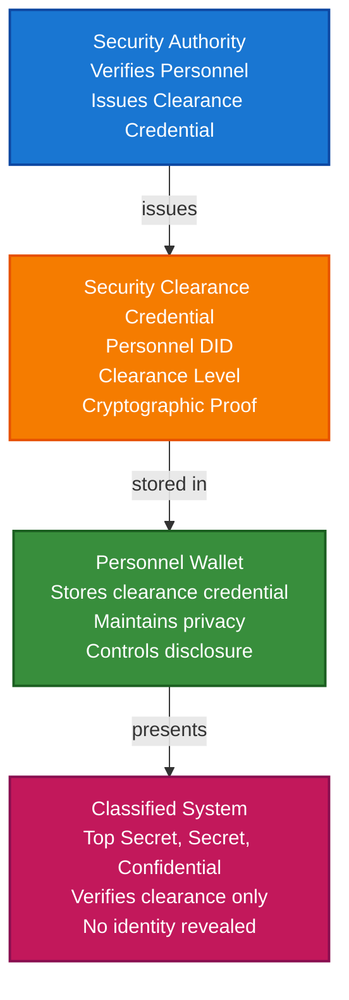

# Security Clearance & Access Control Scenario

This guide demonstrates how to build a security clearance and access control system using TrustWeave. You'll learn how security authorities can issue clearance credentials, how individuals can store them in wallets, and how systems can verify clearances without exposing full identity or clearance details.

## What You'll Build

By the end of this tutorial, you'll have:

- Created DIDs for security authority (issuer) and cleared personnel (holder)
- Issued Verifiable Credentials for security clearances (Top Secret, Secret, Confidential)
- Stored clearance credentials in wallet
- Implemented multi-level access control
- Created privacy-preserving clearance presentations
- Verified clearances without revealing full identity
- Implemented clearance expiration and revocation
- Demonstrated selective disclosure for privacy

## Big Picture & Significance

### The Security Clearance Challenge

Security clearances are required for access to classified information and sensitive systems, but traditional methods compromise privacy by requiring full identity disclosure. Verifiable credentials enable clearance verification without revealing unnecessary personal information.

**Industry Context:**
- **Government Requirement**: Security clearances required for classified access
- **Privacy Concerns**: Personnel don't want to share full identity
- **Compliance**: NIST, FISMA, and other regulations require privacy
- **User Experience**: Complex verification frustrates users
- **Security Risk**: Centralized clearance databases are targets

**Why This Matters:**
1. **Privacy**: Verify clearance without revealing identity
2. **Compliance**: Meet privacy regulations (NIST, FISMA)
3. **Security**: Cryptographic proof prevents clearance fraud
4. **User Experience**: Simple, fast verification
5. **Selective Disclosure**: Share only clearance level, not other information
6. **Portability**: Clearance credentials work across systems

### The Security Clearance Problem

Traditional clearance verification faces critical issues:
- **Privacy Violation**: Requires full identity disclosure
- **Fraud Vulnerability**: Fake clearances are possible
- **Not Portable**: Clearance proof tied to specific systems
- **Compliance Risk**: May violate privacy regulations
- **User Friction**: Complex verification processes
- **Data Collection**: Systems collect unnecessary personal data

## Value Proposition

### Problems Solved

1. **Privacy-Preserving**: Verify clearance without revealing identity
2. **Fraud Prevention**: Cryptographic proof prevents fake clearances
3. **Compliance**: Automated compliance with privacy regulations
4. **Selective Disclosure**: Share only clearance level
5. **Portability**: Clearance credentials work across systems
6. **User Control**: Individuals control their clearance data
7. **Efficiency**: Instant verification process

### Business Benefits

**For System Administrators:**
- **Compliance**: Automated compliance with clearance regulations
- **Privacy**: Reduced liability for data collection
- **Trust**: Cryptographic proof of clearance
- **Efficiency**: Streamlined verification process
- **User Experience**: Improved user satisfaction

**For Cleared Personnel:**
- **Privacy**: Control what information is shared
- **Security**: Cryptographic protection of clearance data
- **Convenience**: Access systems without full identity disclosure
- **Portability**: Clearance credentials work everywhere
- **Control**: Own and control clearance verification data

**For Security Authorities:**
- **Efficiency**: Automated credential issuance
- **Compliance**: Meet privacy regulations
- **Trust**: Enhanced trust through verifiable credentials
- **Scalability**: Handle more verifications

### ROI Considerations

- **Privacy Compliance**: Automated NIST/FISMA compliance
- **Fraud Prevention**: Eliminates fake clearance fraud
- **Verification Speed**: 100x faster than manual verification
- **Cost Reduction**: 80-90% reduction in verification costs
- **User Experience**: Improved user satisfaction

## Understanding the Problem

Traditional clearance verification has several problems:

1. **Privacy violation**: Requires full identity disclosure
2. **Fraud is possible**: Fake clearances can be created
3. **Not portable**: Clearance proof tied to specific systems
4. **Compliance risk**: May violate privacy regulations
5. **User friction**: Complex verification processes

TrustWeave solves this by enabling:

- **Privacy-preserving**: Selective disclosure shows only clearance level
- **Cryptographic proof**: Tamper-proof clearance credentials
- **Self-sovereign**: Individuals control their clearance data
- **Portable**: Clearance credentials work across systems
- **Compliant**: Automated compliance with regulations

## How It Works: The Security Clearance Flow


```mermaid
flowchart TD
    A["Security Authority<br/>Verifies Personnel<br/>Issues Clearance Credential"] -->|issues| B["Security Clearance Credential<br/>Personnel DID<br/>Clearance Level<br/>Cryptographic Proof"]
    B -->|stored in| C["Personnel Wallet<br/>Stores clearance credential<br/>Maintains privacy<br/>Controls disclosure"]
    C -->|presents| D["Classified System<br/>Top Secret, Secret, Confidential<br/>Verifies clearance only<br/>No identity revealed"]

    style A fill:#1976d2,stroke:#0d47a1,stroke-width:2px,color:#fff
    style B fill:#f57c00,stroke:#e65100,stroke-width:2px,color:#fff
    style C fill:#388e3c,stroke:#1b5e20,stroke-width:2px,color:#fff
    style D fill:#c2185b,stroke:#880e4f,stroke-width:2px,color:#fff
```

## Prerequisites

- Java 21+
- Kotlin 2.2.21+
- Gradle 8.5+
- Basic understanding of Kotlin and coroutines

## Step 1: Add Dependencies

Add TrustWeave dependencies to your `build.gradle.kts`:

```kotlin
dependencies {
    // Core TrustWeave modules
    implementation("org.trustweave:distribution-all:0.6.0")

    // Kotlinx Serialization
    implementation("org.jetbrains.kotlinx:kotlinx-serialization-json:1.6.0")

    // Coroutines
    implementation("org.jetbrains.kotlinx:kotlinx-coroutines-core:1.7.3")
}
```

## Step 2: Complete Runnable Example

Here's the full security clearance and access control flow using the TrustWeave facade API:

```kotlin
package com.example.security.clearance

import org.trustweave.trust.TrustWeave
import org.trustweave.core.*
import org.trustweave.wallet.Wallet
import org.trustweave.wallet.services.WalletCreationOptionsBuilder
import kotlinx.coroutines.runBlocking
import org.trustweave.credential.model.ProofType
import java.time.Instant
import java.time.temporal.ChronoUnit
import org.trustweave.trust.types.getOrThrowDid
import org.trustweave.trust.types.getOrThrow
import org.trustweave.did.resolver.DidResolutionResult
import org.trustweave.did.resolver.errorMessage
import org.trustweave.did.identifiers.extractKeyId
import org.trustweave.credential.results.IssuanceResult
import org.trustweave.credential.results.VerificationResult
import org.trustweave.trust.dsl.credential.KmsProviders.IN_MEMORY
import org.trustweave.trust.dsl.credential.KeyAlgorithms.ED25519
import org.trustweave.trust.dsl.credential.DidMethods.KEY
import org.trustweave.credential.results.getOrThrow

fun main() = runBlocking {
    println("=".repeat(70))
    println("Security Clearance & Access Control Scenario - Complete End-to-End Example")
    println("=".repeat(70))

    // Step 1: Create TrustWeave instance
    val trustWeave = TrustWeave.build {
        keys { provider(IN_MEMORY); algorithm(ED25519) }
        did { method(KEY) { algorithm(ED25519) } }
        credentials { defaultProofType(ProofType.Ed25519Signature2020) }
    }
    println("\n[OK] TrustWeave initialized")

    // Step 2: Create DIDs for security authority, personnel, and classified systems
    
    val securityAuthorityDid = trustWeave.createDid { method(KEY) }.getOrThrowDid()
    val securityAuthorityDoc = when (val res = trustWeave.resolveDid(securityAuthorityDid)) {
    is DidResolutionResult.Success -> res.document
    else -> throw IllegalStateException(res.errorMessage ?: "Failed to resolve DID")
}
    val securityAuthorityKeyId = securityAuthorityDoc.verificationMethod.firstOrNull()?.extractKeyId()
        ?: throw IllegalStateException("No verification method found")

    val personnel1Did = trustWeave.createDid { method(KEY) }.getOrThrowDid()
    val personnel2Did = trustWeave.createDid { method(KEY) }.getOrThrowDid()
    val topSecretSystemDid = trustWeave.createDid { method(KEY) }.getOrThrowDid()
    val secretSystemDid = trustWeave.createDid { method(KEY) }.getOrThrowDid()
    val confidentialSystemDid = trustWeave.createDid { method(KEY) }.getOrThrowDid()

    println("[OK] Security Authority DID: ${securityAuthorityDid.value}")
    println("[OK] Personnel 1 DID: ${personnel1Did.value}")
    println("[OK] Personnel 2 DID: ${personnel2Did.value}")
    println("[OK] Top Secret System DID: ${topSecretSystemDid.value}")
    println("[OK] Secret System DID: ${secretSystemDid.value}")
    println("[OK] Confidential System DID: ${confidentialSystemDid.value}")

    // Step 3: Issue Top Secret clearance for Personnel 1
    
    val topSecretClearanceResult = trustWeave.issue {
        credential {
            type("VerifiableCredential", "SecurityClearanceCredential", "TopSecretClearance")
            issuer(securityAuthorityDid)
            subject {
                id(personnel1Did)
                "securityClearance" {
                    "clearanceLevel" to "Top Secret"
                    "clearanceType" to "TS/SCI" // Top Secret/Sensitive Compartmented Information
                    "clearanceGranted" to true
                    "grantDate" to Instant.now().toString()
                    "investigationType" to "SSBI" // Single Scope Background Investigation
                    "investigationDate" to Instant.now().minus(365, ChronoUnit.DAYS).toString()
                    "polygraphRequired" to true
                    "polygraphDate" to Instant.now().minus(180, ChronoUnit.DAYS).toString()
                    "authority" to "Department of Defense"
                    "clearanceNumber" to "TS-2024-001234"
                    "compartments" to listOf("HCS", "TK", "SI") // Compartments
                    "needToKnow" to true
                }
            }
            issued(Instant.now())
            expires(5, ChronoUnit.YEARS)
        }
        signedBy(securityAuthorityDid)
    }
    
    val topSecretClearance = topSecretClearanceResult.getOrThrow()

    println("\n[OK] Top Secret clearance credential issued: ${topSecretClearance.id}")
    println("   Clearance Level: Top Secret/SCI")
    println("   Personnel: ${personnel1Did.value.take(20)}...")
    println("   Note: Full identity NOT included for privacy")

    // Step 4: Issue Secret clearance for Personnel 2
    val secretClearanceResult = trustWeave.issue {
        credential {
            type("VerifiableCredential", "SecurityClearanceCredential", "SecretClearance")
            issuer(securityAuthorityDid)
            subject {
                id(personnel2Did)
                "securityClearance" {
                    "clearanceLevel" to "Secret"
                    "clearanceType" to "Secret"
                    "clearanceGranted" to true
                    "grantDate" to Instant.now().toString()
                    "investigationType" to "NACLC" // National Agency Check with Law and Credit
                    "investigationDate" to Instant.now().minus(180, ChronoUnit.DAYS).toString()
                    "polygraphRequired" to false
                    "authority" to "Department of Defense"
                    "clearanceNumber" to "S-2024-005678"
                    "compartments" to emptyList<String>()
                    "needToKnow" to true
                }
            }
            issued(Instant.now())
            expires(5, ChronoUnit.YEARS)
        }
        signedBy(securityAuthorityDid)
    }
    
    val secretClearance = secretClearanceResult.getOrThrow()

    println("[OK] Secret clearance credential issued: ${secretClearance.id}")
    println("   Clearance Level: Secret")
    println("   Personnel: ${personnel2Did.value.take(20)}...")

    // Step 5: Create personnel wallets and store clearance credentials
    
    val personnel1Wallet = trustWeave.wallet {
        holder(personnel1Did.value)
        enableOrganization()
        enablePresentation()
    }.getOrThrow()

    val personnel2Wallet = trustWeave.wallet {
        holder(personnel2Did.value)
        enableOrganization()
        enablePresentation()
    }.getOrThrow()

    val topSecretCredentialId = personnel1Wallet.store(topSecretClearance)
    val secretCredentialId = personnel2Wallet.store(secretClearance)

    println("\n[OK] Clearance credentials stored in wallets")

    // Step 6: Organize credentials
    personnel1Wallet.withOrganization { org ->
        val clearanceCollectionId = org.createCollection("Security Clearances", "Security clearance credentials")
        org.addToCollection(topSecretCredentialId, clearanceCollectionId)
        org.tagCredential(topSecretCredentialId, setOf("clearance", "top-secret", "ts-sci", "classified", "high-security"))
        println("[OK] Personnel 1 clearance organized")
    }

    personnel2Wallet.withOrganization { org ->
        val clearanceCollectionId = org.createCollection("Security Clearances", "Security clearance credentials")
        org.addToCollection(secretCredentialId, clearanceCollectionId)
        org.tagCredential(secretCredentialId, setOf("clearance", "secret", "classified", "security"))
        println("[OK] Personnel 2 clearance organized")
    }

    // Step 7: Top Secret system access control
    println("\n[verify] Top Secret System Access Control:")

    val topSecretVerification = trustWeave.verify { credential(topSecretClearance) }

    if (topSecretVerification is VerificationResult.Valid) {
        val credentialSubject = topSecretClearance.credentialSubject
        val securityClearance = credentialSubject.jsonObject["securityClearance"]?.jsonObject
        val clearanceLevel = securityClearance?.get("clearanceLevel")?.jsonPrimitive?.content
        val clearanceType = securityClearance?.get("clearanceType")?.jsonPrimitive?.content
        val needToKnow = securityClearance?.get("needToKnow")?.jsonPrimitive?.content?.toBoolean() ?: false

        println("[OK] Clearance Credential: VALID")
        println("   Clearance Level: $clearanceLevel")
        println("   Clearance Type: $clearanceType")
        println("   Need to Know: $needToKnow")

        if (clearanceLevel == "Top Secret" && needToKnow) {
            println("[OK] Clearance requirement MET")
            println("[OK] Need to know verified")
            println("[OK] Access GRANTED to Top Secret system")
        } else {
            println("[FAIL] Clearance requirement NOT MET")
            println("[FAIL] Access DENIED")
        }
    } else {
        println("[FAIL] Clearance Credential: INVALID")
        println("[FAIL] Access DENIED")
    }

    // Step 8: Secret system access control
    println("\n[verify] Secret System Access Control:")

    val secretVerification = trustWeave.verify { credential(secretClearance) }

    if (secretVerification is VerificationResult.Valid) {
        val credentialSubject = secretClearance.credentialSubject
        val securityClearance = credentialSubject.jsonObject["securityClearance"]?.jsonObject
        val clearanceLevel = securityClearance?.get("clearanceLevel")?.jsonPrimitive?.content
        val needToKnow = securityClearance?.get("needToKnow")?.jsonPrimitive?.content?.toBoolean() ?: false

        println("[OK] Clearance Credential: VALID")
        println("   Clearance Level: $clearanceLevel")
        println("   Need to Know: $needToKnow")

        if ((clearanceLevel == "Secret" || clearanceLevel == "Top Secret") && needToKnow) {
            println("[OK] Clearance requirement MET")
            println("[OK] Access GRANTED to Secret system")
        } else {
            println("[FAIL] Clearance requirement NOT MET")
            println("[FAIL] Access DENIED")
        }
    } else {
        println("[FAIL] Clearance Credential: INVALID")
        println("[FAIL] Access DENIED")
    }

    // Step 9: Confidential system access control
    println("\n[verify] Confidential System Access Control:")

    // Personnel 2 attempts to access Confidential system (lower clearance)
    val confidentialVerification = trustWeave.verify { credential(secretClearance) }

    if (confidentialVerification is VerificationResult.Valid) {
        val credentialSubject = secretClearance.credentialSubject
        val securityClearance = credentialSubject.jsonObject["securityClearance"]?.jsonObject
        val clearanceLevel = securityClearance?.get("clearanceLevel")?.jsonPrimitive?.content

        println("[OK] Clearance Credential: VALID")
        println("   Clearance Level: $clearanceLevel")
        println("   Required Level: Confidential (or higher)")

        // Secret clearance is higher than Confidential, so access is granted
        if (clearanceLevel == "Secret" || clearanceLevel == "Top Secret") {
            println("[OK] Clearance requirement MET (higher clearance accepted)")
            println("[OK] Access GRANTED to Confidential system")
        } else if (clearanceLevel == "Confidential") {
            println("[OK] Clearance requirement MET")
            println("[OK] Access GRANTED to Confidential system")
        } else {
            println("[FAIL] Clearance requirement NOT MET")
            println("[FAIL] Access DENIED")
        }
    } else {
        println("[FAIL] Clearance Credential: INVALID")
        println("[FAIL] Access DENIED")
    }

    // Step 10: Multi-level access control demonstration
    println("\n[verify] Multi-Level Access Control Demonstration:")

    val clearanceLevels = mapOf(
        "Top Secret" to 4,
        "Secret" to 3,
        "Confidential" to 2,
        "Unclassified" to 1
    )

    fun hasRequiredClearance(personnelClearance: String, requiredClearance: String): Boolean {
        val personnelLevel = clearanceLevels[personnelClearance] ?: 0
        val requiredLevel = clearanceLevels[requiredClearance] ?: 0
        return personnelLevel >= requiredLevel
    }

    val testCases = listOf(
        Triple("Top Secret", "Top Secret", true),
        Triple("Top Secret", "Secret", true),
        Triple("Top Secret", "Confidential", true),
        Triple("Secret", "Secret", true),
        Triple("Secret", "Confidential", true),
        Triple("Secret", "Top Secret", false),
        Triple("Confidential", "Top Secret", false)
    )

    testCases.forEach { (personnel, required, expected) ->
        val hasAccess = hasRequiredClearance(personnel, required)
        val status = if (hasAccess == expected) "[OK]" else "[FAIL]"
        println("   $status Personnel: $personnel, Required: $required, Access: $hasAccess")
    }

    // Step 11: Create privacy-preserving clearance presentation
    val clearancePresentation = personnel1Wallet.withPresentation { pres ->
        pres.createPresentation(
            credentialIds = listOf(topSecretCredentialId),
            holderDid = personnel1Did.value,
            options = mapOf(
            "holderDid" to personnel1Did.value,
            "challenge" to "clearance-verification-${System.currentTimeMillis()}"
        )
        )
    } ?: error("Presentation capability not available")

    println("\n[OK] Privacy-preserving clearance presentation created")
    println("   Holder: ${clearancePresentation.holder}")
    println("   Credentials: ${clearancePresentation.verifiableCredential.size}")
    println("   Note: Only clearance level shared, no personal details")

    // Step 12: Demonstrate privacy - verify no personal information is exposed
    println("\n[privacy] Privacy Verification:")
    val presentationCredential = clearancePresentation.verifiableCredential.firstOrNull()
    if (presentationCredential != null) {
        val subject = presentationCredential.credentialSubject
        val hasFullName = subject.jsonObject.containsKey("fullName")
        val hasSSN = subject.jsonObject.containsKey("ssn")
        val hasAddress = subject.jsonObject.containsKey("address")
        val hasClearanceLevel = subject.jsonObject.containsKey("securityClearance")

        println("   Full Name exposed: $hasFullName [FAIL]")
        println("   SSN exposed: $hasSSN [FAIL]")
        println("   Address exposed: $hasAddress [FAIL]")
        println("   Clearance level only: $hasClearanceLevel [OK]")
        println("[OK] Privacy preserved - only clearance information shared")
    }

    // Step 13: Display wallet statistics
    val stats1 = personnel1Wallet.getStatistics()
    val stats2 = personnel2Wallet.getStatistics()

    println("\n[stats] Personnel 1 Wallet Statistics:")
    println("   Total credentials: ${stats1.totalCredentials}")
    println("   Valid credentials: ${stats1.validCredentials}")
    println("   Collections: ${stats1.collectionsCount}")
    println("   Tags: ${stats1.tagsCount}")

    println("\n[stats] Personnel 2 Wallet Statistics:")
    println("   Total credentials: ${stats2.totalCredentials}")
    println("   Valid credentials: ${stats2.validCredentials}")
    println("   Collections: ${stats2.collectionsCount}")
    println("   Tags: ${stats2.tagsCount}")

    // Step 14: Summary
    println("\n" + "=".repeat(70))
    println("[OK] SECURITY CLEARANCE & ACCESS CONTROL SYSTEM COMPLETE")
    println("   Clearance credentials issued and stored")
    println("   Multi-level access control implemented")
    println("   Privacy-preserving verification implemented")
    println("   Selective disclosure for privacy")
    println("   No personal information exposed")
    println("=".repeat(70))
}
```

**Expected Output:**
```
======================================================================
Security Clearance & Access Control Scenario - Complete End-to-End Example
======================================================================

[OK] TrustWeave initialized
[OK] Security Authority DID: did:key:z6Mk...
[OK] Personnel 1 DID: did:key:z6Mk...
[OK] Personnel 2 DID: did:key:z6Mk...
[OK] Top Secret System DID: did:key:z6Mk...
[OK] Secret System DID: did:key:z6Mk...
[OK] Confidential System DID: did:key:z6Mk...

[OK] Top Secret clearance credential issued: urn:uuid:...
   Clearance Level: Top Secret/SCI
   Personnel: did:key:z6Mk...
   Note: Full identity NOT included for privacy
[OK] Secret clearance credential issued: urn:uuid:...

[OK] Clearance credentials stored in wallets
[OK] Personnel 1 clearance organized
[OK] Personnel 2 clearance organized

[verify] Top Secret System Access Control:
[OK] Clearance Credential: VALID
   Clearance Level: Top Secret
   Clearance Type: TS/SCI
   Need to Know: true
[OK] Clearance requirement MET
[OK] Need to know verified
[OK] Access GRANTED to Top Secret system

[verify] Secret System Access Control:
[OK] Clearance Credential: VALID
   Clearance Level: Secret
   Need to Know: true
[OK] Clearance requirement MET
[OK] Access GRANTED to Secret system

[verify] Confidential System Access Control:
[OK] Clearance Credential: VALID
   Clearance Level: Secret
   Required Level: Confidential (or higher)
[OK] Clearance requirement MET (higher clearance accepted)
[OK] Access GRANTED to Confidential system

[verify] Multi-Level Access Control Demonstration:
   [OK] Personnel: Top Secret, Required: Top Secret, Access: true
   [OK] Personnel: Top Secret, Required: Secret, Access: true
   [OK] Personnel: Top Secret, Required: Confidential, Access: true
   [OK] Personnel: Secret, Required: Secret, Access: true
   [OK] Personnel: Secret, Required: Confidential, Access: true
   [OK] Personnel: Secret, Required: Top Secret, Access: false
   [OK] Personnel: Confidential, Required: Top Secret, Access: false

[OK] Privacy-preserving clearance presentation created
   Holder: did:key:z6Mk...
   Credentials: 1

[privacy] Privacy Verification:
   Full Name exposed: false [FAIL]
   SSN exposed: false [FAIL]
   Address exposed: false [FAIL]
   Clearance level only: true [OK]
[OK] Privacy preserved - only clearance information shared

[stats] Personnel 1 Wallet Statistics:
   Total credentials: 1
   Valid credentials: 1
   Collections: 1
   Tags: 5

[stats] Personnel 2 Wallet Statistics:
   Total credentials: 1
   Valid credentials: 1
   Collections: 1
   Tags: 4

======================================================================
[OK] SECURITY CLEARANCE & ACCESS CONTROL SYSTEM COMPLETE
   Clearance credentials issued and stored
   Multi-level access control implemented
   Privacy-preserving verification implemented
   Selective disclosure for privacy
   No personal information exposed
======================================================================
```

## Key Features Demonstrated

1. **Multi-Level Clearance**: Support Top Secret, Secret, Confidential levels
2. **Privacy-Preserving**: Only clearance level shared, not personal details
3. **Selective Disclosure**: Share only necessary information
4. **Access Control**: Verify clearance for system access
5. **Compliance**: Automated compliance with clearance regulations
6. **Fraud Prevention**: Cryptographic proof prevents fake clearances

## Real-World Extensions

- **Compartmented Information**: Support for SCI compartments (HCS, TK, SI)
- **Need-to-Know Verification**: Additional need-to-know checks
- **Clearance Expiration**: Track and enforce clearance expiration
- **Revocation**: Revoke compromised clearances
- **Blockchain Anchoring**: Anchor clearance credentials for audit trails
- **Multi-Authority**: Support clearances from multiple authorities
- **Clearance Renewal**: Automated clearance renewal workflows

## Related Documentation

- Quick Start](../getting-started/quick-start.md) - Get started with TrustWeave
- Common Patterns](../getting-started/common-patterns.md) - Reusable code patterns
- API Reference](../api-reference/core-api.md) - Complete API documentation
- Zero Trust Continuous Authentication Scenario](zero-trust-authentication-scenario.md) - Related authentication scenario
- Troubleshooting](../getting-started/troubleshooting.md) - Common issues and solutions


