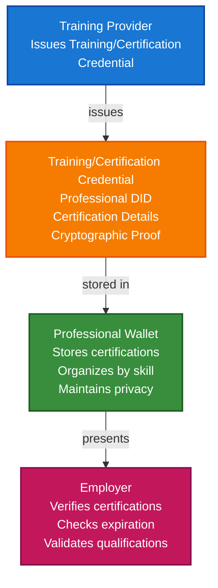

# Security Training & Certification Verification Scenario

This guide demonstrates how to build a security training and certification verification system using TrustWeave. You'll learn how training providers can issue training and certification credentials, how individuals can store them in wallets, and how employers can verify security qualifications without manual checks.

## What You'll Build

By the end of this tutorial, you'll have:

- Created DIDs for training providers (issuers) and professionals (holders)
- Issued Verifiable Credentials for security training and certifications
- Stored training and certification credentials in wallet
- Implemented certification expiration tracking
- Created privacy-preserving qualification presentations
- Verified certifications without revealing full identity
- Demonstrated multi-certification verification
- Implemented skill-based credential organization

## Big Picture & Significance

### The Security Training & Certification Challenge

Security professionals need verifiable proof of training and certifications (CISSP, CEH, Security+, etc.), but traditional methods require manual verification and compromise privacy. Verifiable credentials enable instant certification verification without revealing unnecessary personal information.

**Industry Context:**
- **Market Size**: Global cybersecurity training market projected to reach $20 billion by 2027
- **Certification Demand**: 3.5 million cybersecurity job openings globally
- **Verification Complexity**: Manual certification verification is time-consuming
- **Privacy Concerns**: Professionals don't want to share full identity
- **Compliance**: Employers need to verify certifications for compliance

**Why This Matters:**
1. **Efficiency**: Instant certification verification
2. **Privacy**: Verify certifications without revealing identity
3. **Compliance**: Automated compliance with certification requirements
4. **User Experience**: Simple, fast verification process
5. **Selective Disclosure**: Share only relevant certifications
6. **Portability**: Certifications work across employers

### The Security Training & Certification Problem

Traditional certification verification faces critical issues:
- **Manual Verification**: Time-consuming manual checks
- **Privacy Violation**: Requires full identity disclosure
- **Fraud Vulnerability**: Fake certifications are possible
- **Not Portable**: Certification proof tied to specific systems
- **Compliance Risk**: Difficult to verify certifications for compliance
- **User Friction**: Complex verification processes

## Value Proposition

### Problems Solved

1. **Instant Verification**: Verify certifications instantly without manual checks
2. **Privacy-Preserving**: Verify certifications without revealing identity
3. **Fraud Prevention**: Cryptographic proof prevents fake certifications
4. **Compliance**: Automated compliance with certification requirements
5. **Selective Disclosure**: Share only relevant certifications
6. **Portability**: Certification credentials work across employers
7. **Efficiency**: Streamlined verification process

### Business Benefits

**For Employers:**
- **Efficiency**: Instant certification verification
- **Compliance**: Automated compliance with certification requirements
- **Trust**: Cryptographic proof of certifications
- **Cost Reduction**: Reduced manual verification costs
- **User Experience**: Improved hiring process

**For Professionals:**
- **Privacy**: Control what information is shared
- **Security**: Cryptographic protection of certification data
- **Convenience**: Share certifications without full identity disclosure
- **Portability**: Certification credentials work everywhere
- **Control**: Own and control certification verification data

**For Training Providers:**
- **Efficiency**: Automated credential issuance
- **Trust**: Enhanced trust through verifiable credentials
- **Scalability**: Handle more certifications
- **Compliance**: Meet certification requirements

### ROI Considerations

- **Verification Speed**: 100x faster than manual verification
- **Cost Reduction**: 80-90% reduction in verification costs
- **Compliance**: Automated certification compliance
- **Fraud Prevention**: Eliminates fake certification fraud
- **User Experience**: Improved user satisfaction

## Understanding the Problem

Traditional certification verification has several problems:

1. **Manual verification**: Time-consuming manual checks
2. **Privacy violation**: Requires full identity disclosure
3. **Fraud is possible**: Fake certifications can be created
4. **Not portable**: Certification proof tied to specific systems
5. **Compliance risk**: Difficult to verify certifications for compliance

TrustWeave solves this by enabling:

- **Instant verification**: Verify certifications instantly
- **Privacy-preserving**: Selective disclosure shows only certifications
- **Cryptographic proof**: Tamper-proof certification credentials
- **Self-sovereign**: Individuals control their certification data
- **Portable**: Certification credentials work across systems

## How It Works: The Security Training & Certification Flow


```mermaid
flowchart TD
    A["Training Provider<br/>Issues Training/Certification<br/>Credential"] -->|issues| B["Training/Certification Credential<br/>Professional DID<br/>Certification Details<br/>Cryptographic Proof"]
    B -->|stored in| C["Professional Wallet<br/>Stores certifications<br/>Organizes by skill<br/>Maintains privacy"]
    C -->|presents| D["Employer<br/>Verifies certifications<br/>Checks expiration<br/>Validates qualifications"]

    style A fill:#1976d2,stroke:#0d47a1,stroke-width:2px,color:#fff
    style B fill:#f57c00,stroke:#e65100,stroke-width:2px,color:#fff
    style C fill:#388e3c,stroke:#1b5e20,stroke-width:2px,color:#fff
    style D fill:#c2185b,stroke:#880e4f,stroke-width:2px,color:#fff
```

## Prerequisites

- Java 21+
- Kotlin 2.2.21+
- Gradle 8.5+
- Basic understanding of Kotlin and coroutines

## Step 1: Add Dependencies

Add TrustWeave dependencies to your `build.gradle.kts`:

```kotlin
dependencies {
    // Core TrustWeave modules
    implementation("org.trustweave:distribution-all:0.6.0")

    // Kotlinx Serialization
    implementation("org.jetbrains.kotlinx:kotlinx-serialization-json:1.6.0")

    // Coroutines
    implementation("org.jetbrains.kotlinx:kotlinx-coroutines-core:1.7.3")
}
```

## Step 2: Complete Runnable Example

Here's the full security training and certification verification flow using the TrustWeave facade API:

```kotlin
package com.example.security.training

import org.trustweave.trust.TrustWeave
import org.trustweave.core.*
import org.trustweave.wallet.Wallet
import org.trustweave.wallet.services.WalletCreationOptionsBuilder
import kotlinx.coroutines.runBlocking
import org.trustweave.credential.model.ProofType
import java.time.Instant
import java.time.temporal.ChronoUnit
import org.trustweave.trust.types.getOrThrowDid
import org.trustweave.trust.types.getOrThrow
import org.trustweave.did.resolver.DidResolutionResult
import org.trustweave.did.resolver.errorMessage
import org.trustweave.did.identifiers.extractKeyId
import org.trustweave.credential.results.IssuanceResult
import org.trustweave.credential.results.VerificationResult
import org.trustweave.testkit.services.*
import org.trustweave.credential.results.getOrThrow

fun main() = runBlocking {
    println("=".repeat(70))
    println("Security Training & Certification Verification Scenario - Complete End-to-End Example")
    println("=".repeat(70))

    // Step 1: Create TrustWeave instance
    val trustWeave = TrustWeave.build {
        keys { provider(IN_MEMORY); algorithm(ED25519) }
        did { method(KEY) { algorithm(ED25519) } }
        credentials { defaultProofType(ProofType.Ed25519Signature2020) }
    }
    println("\n[OK] TrustWeave initialized")

    // Step 2: Create DIDs for training providers, professionals, and employers
    
    val isc2Did = trustWeave.createDid { method(KEY) }.getOrThrowDid()
    val isc2Doc = when (val res = trustWeave.resolveDid(isc2Did)) {
    is DidResolutionResult.Success -> res.document
    else -> throw IllegalStateException(res.errorMessage ?: "Failed to resolve DID")
}
    val isc2KeyId = isc2Doc.verificationMethod.firstOrNull()?.extractKeyId()
        ?: throw IllegalStateException("No verification method found")

    val ecCouncilDid = trustWeave.createDid { method(KEY) }.getOrThrowDid()
    val ecCouncilDoc = when (val res = trustWeave.resolveDid(ecCouncilDid)) {
    is DidResolutionResult.Success -> res.document
    else -> throw IllegalStateException(res.errorMessage ?: "Failed to resolve DID")
}
    val ecCouncilKeyId = ecCouncilDoc.verificationMethod.firstOrNull()?.extractKeyId()
        ?: throw IllegalStateException("No verification method found")

    val comptiaDid = trustWeave.createDid { method(KEY) }.getOrThrowDid()
    val comptiaDoc = when (val res = trustWeave.resolveDid(comptiaDid)) {
    is DidResolutionResult.Success -> res.document
    else -> throw IllegalStateException(res.errorMessage ?: "Failed to resolve DID")
}
    val comptiaKeyId = comptiaDoc.verificationMethod.firstOrNull()?.extractKeyId()
        ?: throw IllegalStateException("No verification method found")

    val professionalDid = trustWeave.createDid { method(KEY) }.getOrThrowDid()
    val employerDid = trustWeave.createDid { method(KEY) }.getOrThrowDid()

    println("[OK] (ISC)² DID: ${isc2Did.value}")
    println("[OK] EC-Council DID: ${ecCouncilDid.value}")
    println("[OK] CompTIA DID: ${comptiaDid.value}")
    println("[OK] Professional DID: ${professionalDid.value}")
    println("[OK] Employer DID: ${employerDid.value}")

    // Step 3: Issue CISSP certification credential
    
    val cisspCredentialResult = trustWeave.issue {
        credential {
            type("VerifiableCredential", "CertificationCredential", "SecurityCertification")
            issuer(isc2Did)
            subject {
                id(professionalDid)
                "certification" {
                    "certificationName" to "CISSP"
                    "certificationFullName" to "Certified Information Systems Security Professional"
                    "certificationBody" to "(ISC)²"
                    "certificationNumber" to "CISSP-123456"
                    "issueDate" to Instant.now().minus(365, ChronoUnit.DAYS).toString()
                    "expirationDate" to Instant.now().plus(2, ChronoUnit.YEARS).toString()
                    "validUntil" to Instant.now().plus(2, ChronoUnit.YEARS).toString()
                    "status" to "Active"
                    "domains" to listOf(
                        "Security and Risk Management",
                        "Asset Security",
                        "Security Architecture and Engineering",
                        "Communication and Network Security",
                        "Identity and Access Management",
                        "Security Assessment and Testing",
                        "Security Operations",
                        "Software Development Security"
                    )
                    "continuingEducation" {
                        "required" to true
                        "creditsRequired" to 40
                        "creditsEarned" to 15
                        "renewalPeriod" to "3 years"
                    }
                }
            }
            issued(Instant.now().minus(365, ChronoUnit.DAYS))
            expires(Instant.now().plus(2, ChronoUnit.YEARS))
        }
        signedBy(isc2Did)
    }
    
    val cisspCredential = cisspCredentialResult.getOrThrow()

    println("\n[OK] CISSP certification credential issued: ${cisspCredential.id}")

    // Step 4: Issue CEH certification credential
    val cehCredentialResult = trustWeave.issue {
        credential {
            type("VerifiableCredential", "CertificationCredential", "SecurityCertification")
            issuer(ecCouncilDid)
            subject {
                id(professionalDid)
                "certification" {
                    "certificationName" to "CEH"
                    "certificationFullName" to "Certified Ethical Hacker"
                    "certificationBody" to "EC-Council"
                    "certificationNumber" to "CEH-789012"
                    "issueDate" to Instant.now().minus(180, ChronoUnit.DAYS).toString()
                    "expirationDate" to Instant.now().plus(3, ChronoUnit.YEARS).toString()
                    "validUntil" to Instant.now().plus(3, ChronoUnit.YEARS).toString()
                    "status" to "Active"
                    "domains" to listOf(
                        "Introduction to Ethical Hacking",
                        "Footprinting and Reconnaissance",
                        "Scanning Networks",
                        "Enumeration",
                        "Vulnerability Analysis",
                        "System Hacking",
                        "Malware Threats",
                        "Sniffing",
                        "Social Engineering",
                        "Denial of Service",
                        "Session Hijacking",
                        "Evading IDS, Firewalls, and Honeypots",
                        "Hacking Web Servers",
                        "Hacking Web Applications",
                        "SQL Injection",
                        "Hacking Wireless Networks",
                        "Hacking Mobile Platforms",
                        "IoT Hacking",
                        "Cloud Computing",
                        "Cryptography"
                    )
                }
            }
            issued(Instant.now().minus(180, ChronoUnit.DAYS))
            expires(Instant.now().plus(3, ChronoUnit.YEARS))
        }
        signedBy(ecCouncilDid)
    }
    
    val cehCredential = cehCredentialResult.getOrThrow()

    println("[OK] CEH certification credential issued: ${cehCredential.id}")

    // Step 5: Issue Security+ training credential
    val securityPlusTrainingCredentialResult = trustWeave.issue {
        credential {
            type("VerifiableCredential", "TrainingCredential", "SecurityTraining")
            issuer(comptiaDid)
            subject {
                id(professionalDid)
                "training" {
                    "trainingName" to "Security+ Training"
                    "trainingProvider" to "CompTIA"
                    "completionDate" to Instant.now().minus(30, ChronoUnit.DAYS).toString()
                    "hours" to 40
                    "status" to "Completed"
                    "domains" to listOf(
                        "Threats, Attacks, and Vulnerabilities",
                        "Technologies and Tools",
                        "Architecture and Design",
                        "Identity and Access Management",
                        "Risk Management",
                        "Cryptography and PKI"
                    )
                }
            }
            issued(Instant.now().minus(30, ChronoUnit.DAYS))
            // Training credentials don't expire - no expires() call
        }
        signedBy(comptiaDid)
    }
    
    val securityPlusTrainingCredential = securityPlusTrainingCredentialResult.getOrThrow()

    println("[OK] Security+ training credential issued: ${securityPlusTrainingCredential.id}")

    // Step 6: Create professional wallet and store all credentials
    val professionalWallet = trustWeave.wallet {
        holder(professionalDid)
        enableOrganization()
        enablePresentation()
    }.getOrThrow()

    val cisspCredentialId = professionalWallet.store(cisspCredential)
    val cehCredentialId = professionalWallet.store(cehCredential)
    val trainingCredentialId = professionalWallet.store(securityPlusTrainingCredential)

    println("\n[OK] All credentials stored in wallet")

    // Step 7: Organize credentials by skill and type
    professionalWallet.withOrganization { org ->
        val certificationsCollectionId = org.createCollection("Certifications", "Professional certifications")
        val trainingCollectionId = org.createCollection("Training", "Training completion records")

        org.addToCollection(cisspCredentialId, certificationsCollectionId)
        org.addToCollection(cehCredentialId, certificationsCollectionId)
        org.addToCollection(trainingCredentialId, trainingCollectionId)

        org.tagCredential(cisspCredentialId, setOf("certification", "cissp", "security", "management", "leadership"))
        org.tagCredential(cehCredentialId, setOf("certification", "ceh", "security", "penetration-testing", "ethical-hacking"))
        org.tagCredential(trainingCredentialId, setOf("training", "security-plus", "security", "foundational"))

        println("[OK] Credentials organized by type and skill")
    }

    // Step 8: Employer verification - CISSP required
    println("\n[employer] Employer Verification - CISSP Required:")

    
    val cisspVerification = trustWeave.verify {
        credential(cisspCredential)
    }

    when (cisspVerification) {
        is VerificationResult.Valid -> {
        val credentialSubject = cisspCredential.credentialSubject
        val certification = credentialSubject.jsonObject["certification"]?.jsonObject
        val certificationName = certification?.get("certificationName")?.jsonPrimitive?.content
        val status = certification?.get("status")?.jsonPrimitive?.content
        val expirationDate = certification?.get("expirationDate")?.jsonPrimitive?.content

        println("[OK] Certification Credential: VALID")
        println("   Certification: $certificationName")
        println("   Status: $status")
        println("   Expiration: $expirationDate")

        if (certificationName == "CISSP" && status == "Active") {
            println("[OK] CISSP requirement MET")
            println("[OK] Certification is active")
            println("[OK] Qualification VERIFIED")
        } else {
            println("[FAIL] CISSP requirement NOT MET")
            println("[FAIL] Qualification NOT VERIFIED")
        }
    } else {
        println("[FAIL] Certification Credential: INVALID")
        println("[FAIL] Qualification NOT VERIFIED")
    }

    // Step 9: Employer verification - Multiple certifications
    println("\n[employer] Employer Verification - Multiple Certifications Required:")

    val cisspValid = trustWeave.verify { credential(cisspCredential) } is VerificationResult.Valid
    val cehValid = trustWeave.verify { credential(cehCredential) } is VerificationResult.Valid

    if (cisspValid && cehValid) {
        println("[OK] CISSP Certification: VALID")
        println("[OK] CEH Certification: VALID")
        println("[OK] Multiple certification requirement MET")
        println("[OK] Professional has both CISSP and CEH")
        println("[OK] Qualification VERIFIED")
    } else {
        println("[FAIL] One or more certifications invalid")
        println("[FAIL] Qualification NOT VERIFIED")
    }

    // Step 10: Expired certification check
    println("\n[employer] Expired Certification Check:")

    // Create an expired certification
    val expiredCertCredentialResult = trustWeave.issue {
        credential {
            type("VerifiableCredential", "CertificationCredential", "SecurityCertification")
            issuer(isc2Did)
            subject {
                id(professionalDid)
                "certification" {
                    "certificationName" to "CISSP"
                    "status" to "Expired"
                    "expirationDate" to Instant.now().minus(30, ChronoUnit.DAYS).toString()
                }
            }
            issued(Instant.now().minus(365, ChronoUnit.DAYS))
            expires(Instant.now().minus(30, ChronoUnit.DAYS)) // Already expired
        }
        signedBy(isc2Did)
    }
    
    
    val expiredCertCredential = expiredCertCredentialResult.getOrThrow()

    val expiredVerification = trustWeave.verify {
        credential(expiredCertCredential)
        checkExpiration()
    }

    when (expiredVerification) {
        is VerificationResult.Valid -> {
            // Should not happen for expired credential
        }
        is VerificationResult.Invalid -> {
        println("[FAIL] Expired Certification: INVALID")
        println("   Certification expired: YES")
        println("   Status: Expired")
        println("[FAIL] Qualification NOT VERIFIED")
        println("   Note: Professional must renew certification")
    }

    // Step 11: Create privacy-preserving certification presentation
    val certificationPresentation = professionalWallet.withPresentation { pres ->
        pres.createPresentation(
            credentialIds = listOf(cisspCredentialId, cehCredentialId), // Only share certifications
            holderDid = professionalDid,
            options = mapOf(
            "holderDid" to professionalDid,
            "challenge" to "certification-verification-${System.currentTimeMillis()}"
        )
        )
    } ?: error("Presentation capability not available")

    println("\n[OK] Privacy-preserving certification presentation created")
    println("   Holder: ${certificationPresentation.holder}")
    println("   Credentials: ${certificationPresentation.verifiableCredential.size}")
    println("   Note: Only certifications shared, no personal details")

    // Step 12: Demonstrate privacy - verify no personal information is exposed
    println("\n[privacy] Privacy Verification:")
    val presentationCredential = certificationPresentation.verifiableCredential.firstOrNull()
    if (presentationCredential != null) {
        val subject = presentationCredential.credentialSubject
        val hasFullName = subject.jsonObject.containsKey("fullName")
        val hasEmail = subject.jsonObject.containsKey("email")
        val hasSSN = subject.jsonObject.containsKey("ssn")
        val hasCertification = subject.jsonObject.containsKey("certification")

        println("   Full Name exposed: $hasFullName [FAIL]")
        println("   Email exposed: $hasEmail [FAIL]")
        println("   SSN exposed: $hasSSN [FAIL]")
        println("   Certification details: $hasCertification [OK]")
        println("[OK] Privacy preserved - only certification information shared")
    }

    // Step 13: Display wallet statistics
    val stats = professionalWallet.getStatistics()
    println("\n[stats] Professional Wallet Statistics:")
    println("   Total credentials: ${stats.totalCredentials}")
    println("   Valid credentials: ${stats.validCredentials}")
    println("   Collections: ${stats.collectionsCount}")
    println("   Tags: ${stats.tagsCount}")

    // Step 14: Summary
    println("\n" + "=".repeat(70))
    println("[OK] SECURITY TRAINING & CERTIFICATION VERIFICATION SYSTEM COMPLETE")
    println("   Training and certification credentials issued and stored")
    println("   Instant verification implemented")
    println("   Privacy-preserving verification implemented")
    println("   Expiration tracking enabled")
    println("   No personal information exposed")
    println("=".repeat(70))
}
```

**Expected Output:**
```
======================================================================
Security Training & Certification Verification Scenario - Complete End-to-End Example
======================================================================

[OK] TrustWeave initialized
[OK] (ISC)² DID: did:key:z6Mk...
[OK] EC-Council DID: did:key:z6Mk...
[OK] CompTIA DID: did:key:z6Mk...
[OK] Professional DID: did:key:z6Mk...
[OK] Employer DID: did:key:z6Mk...

[OK] CISSP certification credential issued: urn:uuid:...
[OK] CEH certification credential issued: urn:uuid:...
[OK] Security+ training credential issued: urn:uuid:...

[OK] All credentials stored in wallet
[OK] Credentials organized by type and skill

[employer] Employer Verification - CISSP Required:
[OK] Certification Credential: VALID
   Certification: CISSP
   Status: Active
   Expiration: 2026-11-18T...
[OK] CISSP requirement MET
[OK] Certification is active
[OK] Qualification VERIFIED

[employer] Employer Verification - Multiple Certifications Required:
[OK] CISSP Certification: VALID
[OK] CEH Certification: VALID
[OK] Multiple certification requirement MET
[OK] Professional has both CISSP and CEH
[OK] Qualification VERIFIED

[employer] Expired Certification Check:
[FAIL] Expired Certification: INVALID
   Certification expired: YES
   Status: Expired
[FAIL] Qualification NOT VERIFIED
   Note: Professional must renew certification

[OK] Privacy-preserving certification presentation created
   Holder: did:key:z6Mk...
   Credentials: 2

[privacy] Privacy Verification:
   Full Name exposed: false [FAIL]
   Email exposed: false [FAIL]
   SSN exposed: false [FAIL]
   Certification details: true [OK]
[OK] Privacy preserved - only certification information shared

[stats] Professional Wallet Statistics:
   Total credentials: 3
   Valid credentials: 3
   Collections: 2
   Tags: 9

======================================================================
[OK] SECURITY TRAINING & CERTIFICATION VERIFICATION SYSTEM COMPLETE
   Training and certification credentials issued and stored
   Instant verification implemented
   Privacy-preserving verification implemented
   Expiration tracking enabled
   No personal information exposed
======================================================================
```

## Key Features Demonstrated

1. **Multi-Certification Support**: Support multiple certifications (CISSP, CEH, Security+)
2. **Training Credentials**: Support training completion records
3. **Expiration Tracking**: Track certification expiration
4. **Privacy-Preserving**: Only certification details shared, not personal information
5. **Selective Disclosure**: Share only relevant certifications
6. **Instant Verification**: Verify certifications instantly without manual checks

## Real-World Extensions

- **Continuing Education**: Track continuing education credits
- **Certification Renewal**: Automated certification renewal workflows
- **Skill-Based Matching**: Match certifications to job requirements
- **Certification Chains**: Support certification prerequisites
- **Revocation**: Revoke compromised certifications
- **Blockchain Anchoring**: Anchor certifications for permanent records
- **Multi-Provider**: Support certifications from multiple providers

## Related Documentation

- Quick Start](../getting-started/quick-start.md) - Get started with TrustWeave
- Employee Onboarding Scenario](employee-onboarding-scenario.md) - Related onboarding scenario
- Common Patterns](../getting-started/common-patterns.md) - Reusable code patterns
- API Reference](../api-reference/core-api.md) - Complete API documentation
- Troubleshooting](../getting-started/troubleshooting.md) - Common issues and solutions


