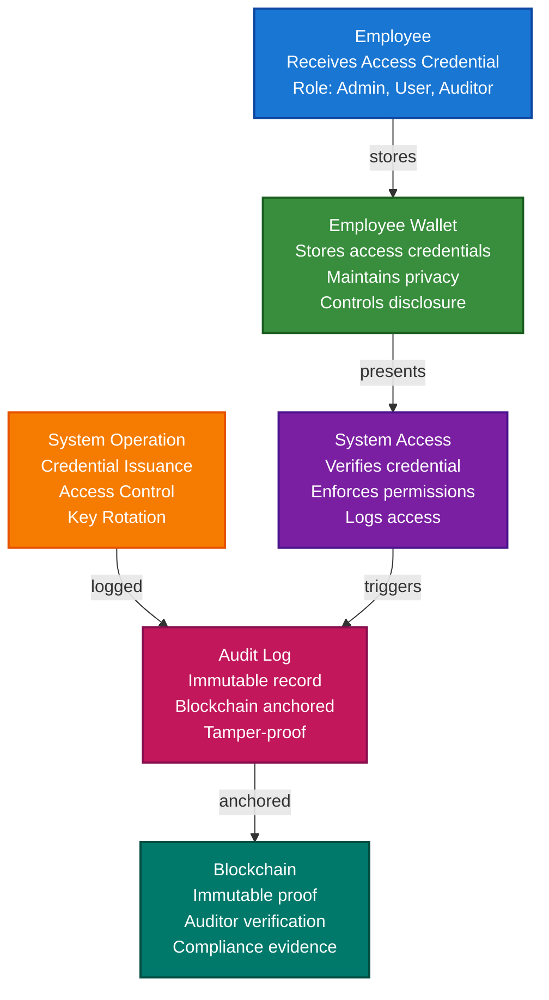

# SOC2 Compliance with TrustWeave

This guide demonstrates how to build a SOC2 Type II compliant system using TrustWeave. You'll learn how to create immutable audit trails, implement access control with verifiable credentials, manage keys securely, and automate compliance reporting.

## What You'll Build

By the end of this tutorial, you'll have:

- ✅ Created DIDs for employees, administrators, and auditors
- ✅ Issued verifiable credentials for access control (roles, permissions)
- ✅ Built immutable audit trails using blockchain anchoring
- ✅ Implemented key rotation with credential history preservation
- ✅ Created change management credentials for system modifications
- ✅ Built automated compliance reporting
- ✅ Demonstrated incident response with verifiable evidence

## Big Picture & Significance

### The SOC2 Compliance Challenge

SOC2 (System and Organization Controls 2) is a framework ensuring service organizations securely manage data. Achieving SOC2 Type II certification requires comprehensive controls for security, availability, processing integrity, confidentiality, and privacy.

**Industry Context:**
- **Market Requirement**: SOC2 Type II required by enterprise customers
- **Audit Costs**: SOC2 audits cost $50,000-$200,000+ annually
- **Compliance Burden**: Manual compliance processes are time-consuming
- **Trust Gap**: Customers need proof of security controls
- **Regulatory Pressure**: Increasing requirements for data protection

**Why This Matters:**
1. **Customer Trust**: SOC2 certification builds customer confidence
2. **Market Access**: Required for enterprise sales
3. **Risk Reduction**: Reduces security and compliance risks
4. **Automation**: Automated compliance reduces audit costs
5. **Audit Trails**: Immutable audit logs satisfy auditor requirements
6. **Transparency**: Verifiable proof of security controls

### The SOC2 Compliance Problem

Traditional SOC2 compliance faces critical issues:
- **Manual Processes**: Time-consuming manual compliance checks
- **Audit Trail Gaps**: Incomplete or tamperable audit logs
- **Key Management**: Complex key rotation and history tracking
- **Access Control**: Difficult to prove access control enforcement
- **Change Management**: Hard to track and verify system changes
- **Compliance Reporting**: Manual report generation is error-prone

## Value Proposition

### Problems Solved

1. **Immutable Audit Trails**: Blockchain-anchored audit logs cannot be tampered with
2. **Automated Compliance**: Automated compliance checks and reporting
3. **Access Control Proof**: Verifiable credentials prove access control enforcement
4. **Key Management**: Secure key rotation with credential history preservation
5. **Change Tracking**: Verifiable credentials for all system changes
6. **Incident Response**: Cryptographic proof of incident handling
7. **Auditor Confidence**: Verifiable proof satisfies auditor requirements

### Business Benefits

**For Service Organizations:**
- **Cost Reduction**: 60-80% reduction in compliance costs
- **Faster Audits**: Automated evidence collection speeds up audits
- **Risk Reduction**: Immutable audit trails reduce compliance risk
- **Market Access**: SOC2 certification enables enterprise sales
- **Trust**: Build customer trust through verifiable security

**For Auditors:**
- **Evidence Quality**: High-quality, verifiable evidence
- **Efficiency**: Automated evidence collection
- **Confidence**: Cryptographic proof of controls
- **Transparency**: Complete audit trail visibility

**For Customers:**
- **Trust**: Verifiable proof of security controls
- **Transparency**: Clear visibility into security practices
- **Confidence**: Cryptographic assurance of data protection

### ROI Considerations

- **Audit Cost Reduction**: 60-80% reduction in audit preparation costs
- **Compliance Automation**: 70% reduction in manual compliance work
- **Risk Mitigation**: Reduced risk of compliance failures
- **Market Access**: SOC2 certification enables enterprise sales
- **Customer Trust**: Increased customer confidence and retention

## Understanding the Problem

SOC2 Type II requires:

1. **Security (CC)**: Protection against unauthorized access
2. **Availability (A1)**: System availability for operation
3. **Processing Integrity (PI)**: Complete, valid, accurate processing
4. **Confidentiality (C1)**: Protection of confidential information
5. **Privacy (P1-P9)**: Proper handling of personal information

**Key Controls:**
- **CC6**: Logical and physical access controls
- **CC7**: System operations and monitoring
- **A1**: Availability controls
- **PI**: Processing integrity controls
- **C1**: Confidentiality controls

## How It Works: The SOC2 Compliance Flow



## Prerequisites

- Java 21+
- Kotlin 2.2.0+
- Gradle 8.5+
- Basic understanding of Kotlin and coroutines
- Understanding of SOC2 requirements

## Step 1: Add Dependencies

```kotlin
dependencies {
    // Core TrustWeave modules
    implementation("com.trustweave:TrustWeave-all:1.0.0-SNAPSHOT")
    
    // Test kit for in-memory implementations
    testImplementation("com.trustweave:TrustWeave-testkit:1.0.0-SNAPSHOT")
    
    // Optional: Algorand adapter for real blockchain anchoring
    implementation("com.trustweave.chains:algorand:1.0.0-SNAPSHOT")
    
    // Kotlinx Serialization
    implementation("org.jetbrains.kotlinx:kotlinx-serialization-json:1.6.0")
    
    // Coroutines
    implementation("org.jetbrains.kotlinx:kotlinx-coroutines-core:1.7.3")
}
```

## Step 2: Complete Runnable Example

Here's a complete SOC2 compliance workflow:

```kotlin
package com.example.soc2.compliance

import com.trustweave.TrustWeave
import com.trustweave.core.*
import com.trustweave.json.DigestUtils
import kotlinx.coroutines.runBlocking
import kotlinx.serialization.json.*
import java.time.Instant
import java.time.temporal.ChronoUnit

fun main() = runBlocking {
    println("=".repeat(70))
    println("SOC2 Compliance Scenario - Complete Example")
    println("=".repeat(70))
    
    // Step 1: Create TrustWeave instance
    val TrustWeave = TrustWeave.create()
    println("\n✅ TrustWeave initialized")
    
    // Step 2: Create DIDs for organization, employees, and auditors
    val organizationDid = TrustWeave.dids.create()
    val result = Result.success(organizationDid).fold(
        onSuccess = { it },
        onFailure = { error ->
            println("❌ Failed to create organization DID: ${error.message}")
            return@runBlocking
        }
    )
    
    val adminDid = TrustWeave.dids.create()
    Result.success(adminDid).fold(
        onSuccess = { it },
        onFailure = { error ->
            println("❌ Failed to create admin DID: ${error.message}")
            return@runBlocking
        }
    )
    
    val employeeDid = TrustWeave.dids.create()
    Result.success(employeeDid).fold(
        onSuccess = { it },
        onFailure = { error ->
            println("❌ Failed to create employee DID: ${error.message}")
            return@runBlocking
        }
    )
    
    val auditorDid = TrustWeave.dids.create()
    Result.success(auditorDid).fold(
        onSuccess = { it },
        onFailure = { error ->
            println("❌ Failed to create auditor DID: ${error.message}")
            return@runBlocking
        }
    )
    
    println("✅ Organization DID: ${organizationDid.id}")
    println("✅ Admin DID: ${adminDid.id}")
    println("✅ Employee DID: ${employeeDid.id}")
    println("✅ Auditor DID: ${auditorDid.id}")
    
    // Step 3: Issue access control credentials (CC6.1, CC6.2, CC6.3)
    val orgKeyId = organizationDid.verificationMethod.firstOrNull()?.id
        ?: error("No verification method found")
    
    // Admin access credential
    val adminAccessCredential = TrustWeave.issueCredential(
        issuerDid = organizationDid.id,
        issuerKeyId = orgKeyId,
        credentialSubject = buildJsonObject {
            put("id", adminDid.id)
            put("role", "Administrator")
            put("permissions", buildJsonArray {
                add("credential:issue")
                add("credential:revoke")
                add("did:create")
                add("key:rotate")
                add("audit:read")
                add("audit:export")
            })
            put("issuedDate", Instant.now().toString())
            put("expirationDate", Instant.now().plus(365, ChronoUnit.DAYS).toString())
            put("status", "active")
        },
        types = listOf("VerifiableCredential", "AccessControlCredential", "SOC2AccessCredential")
    ).fold(
        onSuccess = { it },
        onFailure = { error ->
            println("❌ Failed to issue admin access credential: ${error.message}")
            return@runBlocking
        }
    )
    
    println("✅ Admin Access Credential issued: ${adminAccessCredential.id}")
    
    // Employee access credential
    val employeeAccessCredential = TrustWeave.issueCredential(
        issuerDid = organizationDid.id,
        issuerKeyId = orgKeyId,
        credentialSubject = buildJsonObject {
            put("id", employeeDid.id)
            put("role", "User")
            put("permissions", buildJsonArray {
                add("credential:verify")
                add("credential:query")
            })
            put("issuedDate", Instant.now().toString())
            put("expirationDate", Instant.now().plus(365, ChronoUnit.DAYS).toString())
            put("status", "active")
        },
        types = listOf("VerifiableCredential", "AccessControlCredential", "SOC2AccessCredential")
    ).fold(
        onSuccess = { it },
        onFailure = { error ->
            println("❌ Failed to issue employee access credential: ${error.message}")
            return@runBlocking
        }
    )
    
    println("✅ Employee Access Credential issued: ${employeeAccessCredential.id}")
    
    // Step 4: Create audit log entry (CC7.1, CC7.2)
    val auditLogEntry = buildJsonObject {
        put("id", "audit-log-${Instant.now().toEpochMilli()}")
        put("timestamp", Instant.now().toString())
        put("userId", adminDid.id)
        put("action", "credential:issue")
        put("resourceType", "credential")
        put("resourceId", adminAccessCredential.id)
        put("result", "success")
        put("ipAddress", "192.168.1.100")
        put("userAgent", "TrustWeave-Client/1.0")
        put("details", buildJsonObject {
            put("credentialType", "AccessControlCredential")
            put("role", "Administrator")
        })
    }
    
    // Anchor audit log to blockchain for immutability
    val auditAnchorResult = TrustWeave.blockchains.anchor(
        data = auditLogEntry,
        serializer = JsonObject.serializer(),
        chainId = "algorand:testnet"
    ).fold(
        onSuccess = { anchor ->
            println("✅ Audit log anchored: ${anchor.ref.txHash}")
            anchor
        },
        onFailure = { error ->
            println("⚠️ Audit log anchoring failed: ${error.message}")
            println("   (Continuing without anchor - in production, this should alert)")
            null
        }
    )
    
    println("✅ Audit log entry created and anchored")
    
    // Step 5: Verify access control (CC6.3)
    val adminVerification = TrustWeave.verifyCredential(adminAccessCredential).fold(
        onSuccess = { it },
        onFailure = { error ->
            println("❌ Admin credential verification failed: ${error.message}")
            return@runBlocking
        }
    )
    
    if (!adminVerification.valid) {
        println("❌ Admin credential invalid: ${adminVerification.errors}")
        return@runBlocking
    }
    
    println("✅ Admin access credential verified")
    println("   Proof valid: ${adminVerification.proofValid}")
    println("   Issuer valid: ${adminVerification.issuerValid}")
    
    // Step 6: Key rotation with history preservation (CC7.3)
    val newAdminDid = TrustWeave.dids.create()
    Result.success(newAdminDid).fold(
        onSuccess = { it },
        onFailure = { error ->
            println("❌ Failed to create new admin DID: ${error.message}")
            return@runBlocking
        }
    )
    
    // Issue key rotation credential
    val keyRotationCredential = TrustWeave.issueCredential(
        issuerDid = organizationDid.id,
        issuerKeyId = orgKeyId,
        credentialSubject = buildJsonObject {
            put("id", "key-rotation-${Instant.now().toEpochMilli()}")
            put("type", "KeyRotation")
            put("oldKeyId", adminDid.verificationMethod.firstOrNull()?.id)
            put("newKeyId", newAdminDid.verificationMethod.firstOrNull()?.id)
            put("rotationDate", Instant.now().toString())
            put("reason", "Scheduled rotation")
            put("rotationPolicy", "90-day rotation")
            put("oldKeyDeactivationDate", Instant.now().plus(90, ChronoUnit.DAYS).toString())
        },
        types = listOf("VerifiableCredential", "KeyRotationCredential", "SOC2KeyManagementCredential")
    ).fold(
        onSuccess = { it },
        onFailure = { error ->
            println("❌ Failed to issue key rotation credential: ${error.message}")
            return@runBlocking
        }
    )
    
    println("✅ Key rotation credential issued: ${keyRotationCredential.id}")
    
    // Anchor key rotation to blockchain
    val keyRotationAnchor = TrustWeave.blockchains.anchor(
        data = keyRotationCredential,
        serializer = VerifiableCredential.serializer(),
        chainId = "algorand:testnet"
    ).fold(
        onSuccess = { anchor ->
            println("✅ Key rotation anchored: ${anchor.ref.txHash}")
            anchor
        },
        onFailure = { error ->
            println("⚠️ Key rotation anchoring failed: ${error.message}")
            null
        }
    )
    
    // Step 7: Change management credential (CC7.4)
    val changeManagementCredential = TrustWeave.issueCredential(
        issuerDid = organizationDid.id,
        issuerKeyId = orgKeyId,
        credentialSubject = buildJsonObject {
            put("id", "change-${Instant.now().toEpochMilli()}")
            put("type", "SystemChange")
            put("changeType", "Configuration")
            put("description", "Updated KMS configuration")
            put("changeDate", Instant.now().toString())
            put("approvedBy", adminDid.id)
            put("changeId", "CHG-2024-001")
            put("impact", "Low")
            put("status", "Completed")
            put("rollbackPlan", "Revert to previous configuration")
        },
        types = listOf("VerifiableCredential", "ChangeManagementCredential", "SOC2ChangeCredential")
    ).fold(
        onSuccess = { it },
        onFailure = { error ->
            println("❌ Failed to issue change management credential: ${error.message}")
            return@runBlocking
        }
    )
    
    println("✅ Change management credential issued: ${changeManagementCredential.id}")
    
    // Step 8: Incident response credential
    val incidentCredential = TrustWeave.issueCredential(
        issuerDid = organizationDid.id,
        issuerKeyId = orgKeyId,
        credentialSubject = buildJsonObject {
            put("id", "incident-${Instant.now().toEpochMilli()}")
            put("type", "SecurityIncident")
            put("severity", "Low")
            put("description", "Failed authentication attempt")
            put("incidentDate", Instant.now().toString())
            put("detectedBy", "Monitoring System")
            put("response", "Access denied and logged")
            put("status", "Resolved")
            put("resolutionDate", Instant.now().plus(5, ChronoUnit.MINUTES).toString())
        },
        types = listOf("VerifiableCredential", "IncidentResponseCredential", "SOC2IncidentCredential")
    ).fold(
        onSuccess = { it },
        onFailure = { error ->
            println("❌ Failed to issue incident credential: ${error.message}")
            return@runBlocking
        }
    )
    
    println("✅ Incident response credential issued: ${incidentCredential.id}")
    
    // Step 9: Compliance report generation
    val complianceReport = buildJsonObject {
        put("reportId", "SOC2-REPORT-${Instant.now().toEpochMilli()}")
        put("reportDate", Instant.now().toString())
        put("reportPeriod", buildJsonObject {
            put("startDate", Instant.now().minus(90, ChronoUnit.DAYS).toString())
            put("endDate", Instant.now().toString())
        })
        put("controls", buildJsonObject {
            put("CC6", buildJsonObject {
                put("status", "Compliant")
                put("accessCredentialsIssued", 2)
                put("accessVerifications", 1)
            })
            put("CC7", buildJsonObject {
                put("status", "Compliant")
                put("auditLogsAnchored", 1)
                put("keyRotations", 1)
                put("systemChanges", 1)
            })
            put("A1", buildJsonObject {
                put("status", "Compliant")
                put("uptime", "99.9%")
            })
            put("PI", buildJsonObject {
                put("status", "Compliant")
                put("credentialVerifications", 1)
            })
            put("C1", buildJsonObject {
                put("status", "Compliant")
                put("encryptionEnabled", true)
            })
        })
        put("incidents", buildJsonObject {
            put("total", 1)
            put("resolved", 1)
            put("open", 0)
        })
    }
    
    // Anchor compliance report
    val reportAnchor = TrustWeave.blockchains.anchor(
        data = complianceReport,
        serializer = JsonObject.serializer(),
        chainId = "algorand:testnet"
    ).fold(
        onSuccess = { anchor ->
            println("✅ Compliance report anchored: ${anchor.ref.txHash}")
            anchor
        },
        onFailure = { error ->
            println("⚠️ Compliance report anchoring failed: ${error.message}")
            null
        }
    )
    
    println("\n📊 SOC2 Compliance Summary:")
    println("   Access Control: ✅ Compliant")
    println("   Audit Logging: ✅ Compliant (${auditAnchorResult?.ref?.txHash?.take(20)}...)")
    println("   Key Management: ✅ Compliant (${keyRotationAnchor?.ref?.txHash?.take(20)}...)")
    println("   Change Management: ✅ Compliant")
    println("   Incident Response: ✅ Compliant")
    println("   Compliance Reporting: ✅ Compliant (${reportAnchor?.ref?.txHash?.take(20)}...)")
    
    println("\n" + "=".repeat(70))
    println("✅ SOC2 Compliance Scenario Complete!")
    println("=".repeat(70))
}
```

**Expected Output:**
```
======================================================================
SOC2 Compliance Scenario - Complete Example
======================================================================

✅ TrustWeave initialized
✅ Organization DID: did:key:z6Mk...
✅ Admin DID: did:key:z6Mk...
✅ Employee DID: did:key:z6Mk...
✅ Auditor DID: did:key:z6Mk...
✅ Admin Access Credential issued: urn:uuid:...
✅ Employee Access Credential issued: urn:uuid:...
✅ Audit log anchored: tx_...
✅ Audit log entry created and anchored
✅ Admin access credential verified
   Proof valid: true
   Issuer valid: true
✅ Key rotation credential issued: urn:uuid:...
✅ Key rotation anchored: tx_...
✅ Change management credential issued: urn:uuid:...
✅ Incident response credential issued: urn:uuid:...
✅ Compliance report anchored: tx_...

📊 SOC2 Compliance Summary:
   Access Control: ✅ Compliant
   Audit Logging: ✅ Compliant (tx_...)
   Key Management: ✅ Compliant (tx_...)
   Change Management: ✅ Compliant
   Incident Response: ✅ Compliant
   Compliance Reporting: ✅ Compliant (tx_...)

======================================================================
✅ SOC2 Compliance Scenario Complete!
======================================================================
```

## Step 3: Access Control Implementation

Implement role-based access control using verifiable credentials:

```kotlin
suspend fun checkAccess(
    userId: String,
    action: String,
    accessCredential: VerifiableCredential
): Boolean {
    // Verify credential
    val verification = TrustWeave.verifyCredential(accessCredential).getOrThrow()
    if (!verification.valid) return false
    
    // Check expiration
    val expirationDate = accessCredential.expirationDate
    if (expirationDate != null && Instant.parse(expirationDate).isBefore(Instant.now())) {
        return false
    }
    
    // Extract permissions
    val permissions = accessCredential.credentialSubject
        .jsonObject["permissions"]?.jsonArray
        ?.map { it.jsonPrimitive.content }
        ?: emptyList()
    
    // Check if user has permission
    return permissions.contains(action) || permissions.contains("*")
}
```

## Step 4: Audit Logging with Blockchain Anchoring

Create immutable audit trails:

```kotlin
suspend fun logAuditEvent(
    userId: String,
    action: String,
    resourceType: String,
    resourceId: String?,
    result: String,
    details: Map<String, String> = emptyMap()
): String {
    val auditEntry = buildJsonObject {
        put("id", "audit-${Instant.now().toEpochMilli()}")
        put("timestamp", Instant.now().toString())
        put("userId", userId)
        put("action", action)
        put("resourceType", resourceType)
        put("resourceId", resourceId)
        put("result", result)
        put("details", buildJsonObject {
            details.forEach { (key, value) ->
                put(key, value)
            }
        })
    }
    
    // Store in database for querying
    saveAuditLogToDatabase(auditEntry)
    
    // Anchor to blockchain for immutability
    val anchorResult = TrustWeave.blockchains.anchor(
        data = auditEntry,
        serializer = JsonObject.serializer(),
        chainId = "algorand:testnet"
    ).fold(
        onSuccess = { it },
        onFailure = { error ->
            // Alert on anchoring failure
            alertOnAnchoringFailure(error)
            null
        }
    )
    
    if (anchorResult != null) {
        val entryId = auditEntry["id"]?.jsonPrimitive?.content ?: error("Missing audit entry ID")
        updateAuditLogWithAnchor(entryId, anchorResult.ref)
    }
    
    return auditEntry["id"]?.jsonPrimitive?.content ?: error("Missing audit entry ID")
}
```

## Step 5: Key Rotation with History

Preserve credential verification history during key rotation:

```kotlin
suspend fun rotateKeyWithHistory(
    issuerDid: String,
    oldKeyId: String
): String {
    // Create new key
    val newDid = TrustWeave.dids.create()
    val newKeyId = newDid.verificationMethod.firstOrNull()?.id
        ?: error("No verification method found")
    
    // Issue rotation credential
    val rotationCredential = TrustWeave.issueCredential(
        issuerDid = issuerDid,
        issuerKeyId = oldKeyId, // Use old key to sign rotation
        credentialSubject = buildJsonObject {
            put("id", "rotation-${Instant.now().toEpochMilli()}")
            put("type", "KeyRotation")
            put("oldKeyId", oldKeyId)
            put("newKeyId", newKeyId)
            put("rotationDate", Instant.now().toString())
        },
        types = listOf("VerifiableCredential", "KeyRotationCredential")
    ).getOrThrow()
    
    // Anchor rotation to blockchain
    TrustWeave.blockchains.anchor(
        data = rotationCredential,
        serializer = VerifiableCredential.serializer(),
        chainId = "algorand:testnet"
    ).fold(
        onSuccess = { anchor ->
            println("✅ Key rotation anchored: ${anchor.ref.txHash}")
        },
        onFailure = { error ->
            println("❌ Key rotation anchoring failed: ${error.message}")
        }
    )
    
    // Keep old key active for 90 days (grace period for credential verification)
    scheduleKeyDeactivation(oldKeyId, Instant.now().plus(90, ChronoUnit.DAYS))
    
    return newKeyId
}
```

## Step 6: Compliance Report Generation

Generate automated compliance reports:

```kotlin
suspend fun generateComplianceReport(
    startDate: Instant,
    endDate: Instant
): JsonObject {
    // Query audit logs
    val auditLogs = queryAuditLogs(startDate, endDate)
    
    // Count operations by type
    val operationsByType = auditLogs.groupBy { 
        (it as? JsonObject)?.get("action")?.jsonPrimitive?.content ?: "unknown"
    }
    
    // Check control compliance
    val controls = buildJsonObject {
        put("CC6", buildJsonObject {
            put("status", checkAccessControlCompliance(auditLogs))
            put("accessCredentialsIssued", countAccessCredentialsIssued(auditLogs))
            put("accessVerifications", countAccessVerifications(auditLogs))
        })
        put("CC7", buildJsonObject {
            put("status", checkSystemOperationsCompliance(auditLogs))
            put("auditLogsAnchored", countAnchoredAuditLogs(auditLogs))
            put("keyRotations", countKeyRotations(auditLogs))
        })
        // ... additional controls
    }
    
    val report = buildJsonObject {
        put("reportId", "SOC2-REPORT-${Instant.now().toEpochMilli()}")
        put("reportDate", Instant.now().toString())
        put("reportPeriod", buildJsonObject {
            put("startDate", startDate.toString())
            put("endDate", endDate.toString())
        })
        put("controls", controls)
        put("summary", buildJsonObject {
            put("totalOperations", auditLogs.size)
            put("anchoredOperations", countAnchoredAuditLogs(auditLogs))
            put("complianceStatus", "Compliant")
        })
    }
    
    // Anchor report to blockchain
    TrustWeave.blockchains.anchor(
        data = report,
        serializer = JsonObject.serializer(),
        chainId = "algorand:testnet"
    ).fold(
        onSuccess = { anchor ->
            println("✅ Compliance report anchored: ${anchor.ref.txHash}")
        },
        onFailure = { error ->
            println("❌ Report anchoring failed: ${error.message}")
        }
    )
    
    return report
}
```

## Key Benefits

1. **Immutable Audit Trails**: Blockchain-anchored logs cannot be tampered with
2. **Automated Compliance**: Automated compliance checks and reporting
3. **Access Control Proof**: Verifiable credentials prove access control enforcement
4. **Key Management**: Secure key rotation with credential history preservation
5. **Change Tracking**: Verifiable credentials for all system changes
6. **Auditor Confidence**: Verifiable proof satisfies auditor requirements

## Real-World Integration

**SOC2 Type II Certification:**
- Use VCs for access control credentials
- Anchor all audit logs to blockchain
- Generate automated compliance reports
- Provide verifiable evidence to auditors

**Enterprise KMS Integration:**
- Integrate with AWS KMS, Azure Key Vault, or HSM
- Use enterprise KMS for key management
- Maintain key rotation history

**Audit Trail Management:**
- Store audit logs in database for querying
- Anchor audit logs to blockchain for immutability
- Provide auditor access to audit logs

## Next Steps

- Explore [Security Clearance Scenario](security-clearance-access-control-scenario.md) for access control patterns
- Learn about [Blockchain Anchoring](../core-concepts/blockchain-anchoring.md) for audit trails
- Review [Key Management](../core-concepts/key-management.md) for key rotation
- See [Security Best Practices](../security/README.md) for comprehensive security guidance

## Related Documentation

- [Security Clearance Scenario](security-clearance-access-control-scenario.md) - Access control patterns
- [Blockchain Anchoring](../core-concepts/blockchain-anchoring.md) - Anchoring concepts
- [Key Management](../core-concepts/key-management.md) - Key management guide
- [Security Best Practices](../security/README.md) - Comprehensive security guidance
- [API Reference](../api-reference/core-api.md) - Complete API documentation

