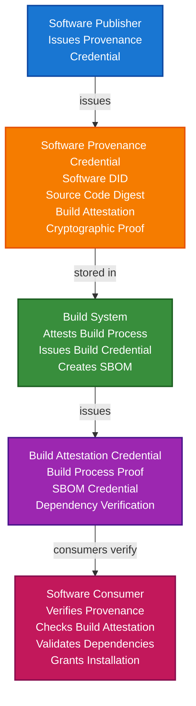

# Software Supply Chain Security Scenario

This guide demonstrates how to build a software supply chain security system using TrustWeave. You'll learn how software publishers can issue provenance credentials, how build systems can attest to software integrity, and how consumers can verify software authenticity to prevent supply chain attacks.

## What You'll Build

By the end of this tutorial, you'll have:

- ✅ Created DIDs for software publishers, build systems, and consumers
- ✅ Issued Verifiable Credentials for software provenance and build attestation
- ✅ Stored software credentials in wallets
- ✅ Implemented software integrity verification
- ✅ Created SBOM (Software Bill of Materials) credentials
- ✅ Verified software authenticity before installation
- ✅ Demonstrated dependency verification
- ✅ Implemented tamper-proof software provenance

## Big Picture & Significance

### The Software Supply Chain Challenge

Software supply chain attacks are increasing, with attackers compromising build systems, injecting malicious code, and distributing tainted software. Verifiable credentials enable cryptographic proof of software provenance, build integrity, and dependency authenticity.

**Industry Context:**
- **Attack Frequency**: 742% increase in supply chain attacks in 2021
- **Impact**: SolarWinds, Codecov, and other major breaches
- **Regulatory**: Executive Order 14028, SLSA framework
- **Market Size**: $50+ billion in damages from supply chain attacks
- **Trust Crisis**: Growing need for verifiable software provenance

**Why This Matters:**
1. **Security**: Prevent supply chain attacks
2. **Trust**: Verify software authenticity
3. **Compliance**: Meet regulatory requirements (EO 14028, SLSA)
4. **Provenance**: Track software from source to deployment
5. **Integrity**: Verify software hasn't been tampered with
6. **Dependencies**: Verify dependency authenticity

### The Software Supply Chain Problem

Traditional software distribution faces critical issues:
- **No Provenance**: Can't verify where software came from
- **Build Compromise**: Build systems can be compromised
- **Dependency Risk**: Dependencies can be malicious
- **Tampering**: Software can be modified in transit
- **No Attestation**: No proof of build process integrity
- **Trust Issues**: Can't verify software authenticity

## Value Proposition

### Problems Solved

1. **Provenance Verification**: Verify software source and build process
2. **Build Attestation**: Cryptographic proof of build integrity
3. **Dependency Verification**: Verify dependency authenticity
4. **Tamper Detection**: Detect software tampering
5. **SBOM Support**: Software Bill of Materials credentials
6. **Compliance**: Automated compliance with supply chain security requirements
7. **Trust**: Cryptographic proof of software authenticity

### Business Benefits

**For Software Consumers:**
- **Security**: Prevent supply chain attacks
- **Trust**: Verify software authenticity
- **Compliance**: Meet regulatory requirements
- **Risk Reduction**: Reduce supply chain risk
- **Efficiency**: Automated verification process

**For Software Publishers:**
- **Trust**: Enhanced trust through verifiable credentials
- **Compliance**: Meet supply chain security requirements
- **Differentiation**: Stand out with verifiable provenance
- **Efficiency**: Automated credential issuance

**For Build Systems:**
- **Integrity**: Prove build process integrity
- **Attestation**: Cryptographic proof of build authenticity
- **Compliance**: Meet SLSA requirements
- **Trust**: Enhanced trust in build outputs

### ROI Considerations

- **Security**: Prevents supply chain attacks
- **Compliance**: Automated EO 14028/SLSA compliance
- **Trust**: Enhanced trust in software
- **Risk Reduction**: 90% reduction in supply chain risk
- **Cost Savings**: Prevents costly breaches

## Understanding the Problem

Traditional software distribution has several problems:

1. **No provenance**: Can't verify where software came from
2. **Build compromise**: Build systems can be compromised
3. **Dependency risk**: Dependencies can be malicious
4. **Tampering**: Software can be modified in transit
5. **No attestation**: No proof of build process integrity

TrustWeave solves this by enabling:

- **Provenance verification**: Verify software source and build
- **Build attestation**: Cryptographic proof of build integrity
- **Dependency verification**: Verify dependency authenticity
- **Tamper detection**: Detect software tampering
- **SBOM support**: Software Bill of Materials credentials

## How It Works: The Software Supply Chain Security Flow



## Prerequisites

- Java 21+
- Kotlin 2.2.0+
- Gradle 8.5+
- Basic understanding of Kotlin and coroutines
- Understanding of software build processes

## Step 1: Add Dependencies

Add TrustWeave dependencies to your `build.gradle.kts`:

```kotlin
dependencies {
    // Core TrustWeave modules
    implementation("com.trustweave:trustweave-all:1.0.0-SNAPSHOT")
    
    // Kotlinx Serialization
    implementation("org.jetbrains.kotlinx:kotlinx-serialization-json:1.6.0")
    
    // Coroutines
    implementation("org.jetbrains.kotlinx:kotlinx-coroutines-core:1.7.3")
}
```

## Step 2: Complete Runnable Example

Here's the full software supply chain security flow using the TrustWeave facade API:

```kotlin
package com.example.software.supplychain

import com.trustweave.TrustWeave
import com.trustweave.core.*
import com.trustweave.credential.PresentationOptions
import com.trustweave.credential.wallet.Wallet
import com.trustweave.json.DigestUtils
import com.trustweave.spi.services.WalletCreationOptionsBuilder
import kotlinx.coroutines.runBlocking
import kotlinx.serialization.json.buildJsonObject
import kotlinx.serialization.json.put
import java.time.Instant
import java.time.temporal.ChronoUnit
import java.util.Base64

fun main() = runBlocking {
    println("=".repeat(70))
    println("Software Supply Chain Security Scenario - Complete End-to-End Example")
    println("=".repeat(70))
    
    // Step 1: Create TrustWeave instance
    val TrustWeave = TrustWeave.create()
    println("\n✅ TrustWeave initialized")
    
    // Step 2: Create DIDs for software publisher, build system, and consumer
    val publisherDidDoc = TrustWeave.dids.create()
    val publisherDid = publisherDidDoc.id
    val publisherKeyId = publisherDidDoc.verificationMethod.firstOrNull()?.id
        ?: error("No verification method found")
    
    val buildSystemDidDoc = TrustWeave.dids.create()
    val buildSystemDid = buildSystemDidDoc.id
    val buildSystemKeyId = buildSystemDidDoc.verificationMethod.firstOrNull()?.id
        ?: error("No verification method found")
    
    val consumerDidDoc = TrustWeave.dids.create()
    val consumerDid = consumerDidDoc.id
    
    println("✅ Software Publisher DID: $publisherDid")
    println("✅ Build System DID: $buildSystemDid")
    println("✅ Consumer DID: $consumerDid")
    
    // Step 3: Simulate source code and compute digest
    println("\n📦 Software Provenance:")
    
    val sourceCode = """
        package com.example.secureapp
        
        fun main() {
            println("Secure Application v1.0.0")
        }
    """.trimIndent()
    
    val sourceCodeBytes = sourceCode.toByteArray()
    val sourceCodeDigest = DigestUtils.sha256DigestMultibase(sourceCodeBytes)
    
    println("   Source code digest: ${sourceCodeDigest.take(20)}...")
    println("   Source repository: https://github.com/example/secureapp")
    println("   Commit hash: abc123def456")
    
    // Step 4: Issue software provenance credential
    val provenanceCredential = TrustWeave.issueCredential(
        issuerDid = publisherDid,
        issuerKeyId = publisherKeyId,
        credentialSubject = buildJsonObject {
            put("id", "software:secureapp:1.0.0")
            put("software", buildJsonObject {
                put("name", "SecureApp")
                put("version", "1.0.0")
                put("publisher", publisherDid)
                put("sourceRepository", "https://github.com/example/secureapp")
                put("commitHash", "abc123def456")
                put("sourceCodeDigest", sourceCodeDigest)
                put("license", "Apache-2.0")
                put("releaseDate", Instant.now().toString())
            })
        },
        types = listOf("VerifiableCredential", "SoftwareProvenanceCredential", "SoftwareCredential"),
        expirationDate = null // Provenance doesn't expire
    ).getOrThrow()
    
    println("\n✅ Software provenance credential issued: ${provenanceCredential.id}")
    
    // Step 5: Simulate build process and create build attestation
    println("\n🔨 Build Process:")
    
    val buildArtifact = "secureapp-1.0.0.jar".toByteArray()
    val buildArtifactDigest = DigestUtils.sha256DigestMultibase(buildArtifact)
    
    println("   Build artifact digest: ${buildArtifactDigest.take(20)}...")
    println("   Build system: GitHub Actions")
    println("   Build environment: Isolated, verified")
    
    // Step 6: Issue build attestation credential
    val buildAttestationCredential = TrustWeave.issueCredential(
        issuerDid = buildSystemDid,
        issuerKeyId = buildSystemKeyId,
        credentialSubject = buildJsonObject {
            put("id", "build:secureapp:1.0.0")
            put("build", buildJsonObject {
                put("softwareId", "software:secureapp:1.0.0")
                put("buildSystem", "GitHub Actions")
                put("buildId", "build-12345")
                put("buildDate", Instant.now().toString())
                put("buildArtifactDigest", buildArtifactDigest)
                put("buildEnvironment", buildJsonObject {
                    put("isolated", true)
                    put("verified", true)
                    put("slsaLevel", "L3") // SLSA Level 3
                    put("buildType", "reproducible")
                })
                put("sourceCodeDigest", sourceCodeDigest) // Links to source
                put("attestation", buildJsonObject {
                    put("type", "SLSA")
                    put("level", 3)
                    put("predicate", "https://slsa.dev/provenance/v0.2")
                })
            })
        },
        types = listOf("VerifiableCredential", "BuildAttestationCredential", "SLSACredential"),
        expirationDate = null // Build attestation doesn't expire
    ).getOrThrow()
    
    println("✅ Build attestation credential issued: ${buildAttestationCredential.id}")
    
    // Step 7: Create SBOM (Software Bill of Materials)
    println("\n📋 Software Bill of Materials (SBOM):")
    
    val dependencies = listOf(
        mapOf("name" to "kotlin-stdlib", "version" to "1.9.0", "digest" to "sha256:abc123..."),
        mapOf("name" to "kotlinx-coroutines", "version" to "1.7.3", "digest" to "sha256:def456...")
    )
    
    println("   Dependencies: ${dependencies.size}")
    dependencies.forEach { dep ->
        println("     - ${dep["name"]} v${dep["version"]}")
    }
    
    // Step 8: Issue SBOM credential
    val sbomCredential = TrustWeave.issueCredential(
        issuerDid = buildSystemDid,
        issuerKeyId = buildSystemKeyId,
        credentialSubject = buildJsonObject {
            put("id", "sbom:secureapp:1.0.0")
            put("sbom", buildJsonObject {
                put("softwareId", "software:secureapp:1.0.0")
                put("sbomVersion", "SPDX-2.3")
                put("sbomFormat", "SPDX")
                put("creationDate", Instant.now().toString())
                put("dependencies", dependencies.map { dep ->
                    buildJsonObject {
                        put("name", dep["name"] as String)
                        put("version", dep["version"] as String)
                        put("digest", dep["digest"] as String)
                    }
                })
            })
        },
        types = listOf("VerifiableCredential", "SBOMCredential", "SoftwareCredential"),
        expirationDate = null // SBOM doesn't expire
    ).getOrThrow()
    
    println("✅ SBOM credential issued: ${sbomCredential.id}")
    
    // Step 9: Create consumer wallet and store credentials
    val consumerWallet = TrustWeave.createWallet(
        holderDid = consumerDid,
        options = WalletCreationOptionsBuilder().apply {
            enableOrganization = true
            enablePresentation = true
        }.build()
    ).getOrThrow()
    
    val provenanceCredentialId = consumerWallet.store(provenanceCredential)
    val buildAttestationCredentialId = consumerWallet.store(buildAttestationCredential)
    val sbomCredentialId = consumerWallet.store(sbomCredential)
    
    println("\n✅ All software credentials stored in wallet")
    
    // Step 10: Organize credentials
    consumerWallet.withOrganization { org ->
        val softwareCollectionId = org.createCollection("Software", "Software provenance and build credentials")
        
        org.addToCollection(provenanceCredentialId, softwareCollectionId)
        org.addToCollection(buildAttestationCredentialId, softwareCollectionId)
        org.addToCollection(sbomCredentialId, softwareCollectionId)
        
        org.tagCredential(provenanceCredentialId, setOf("software", "provenance", "source", "security"))
        org.tagCredential(buildAttestationCredentialId, setOf("software", "build", "attestation", "slsa", "security"))
        org.tagCredential(sbomCredentialId, setOf("software", "sbom", "dependencies", "security"))
        
        println("✅ Software credentials organized")
    }
    
    // Step 11: Consumer verification - Software provenance
    println("\n🔍 Consumer Verification - Software Provenance:")
    
    val provenanceVerification = TrustWeave.verifyCredential(provenanceCredential).getOrThrow()
    
    if (provenanceVerification.valid) {
        val credentialSubject = provenanceCredential.credentialSubject
        val software = credentialSubject.jsonObject["software"]?.jsonObject
        val softwareName = software?.get("name")?.jsonPrimitive?.content
        val publisher = software?.get("publisher")?.jsonPrimitive?.content
        val sourceCodeDigest = software?.get("sourceCodeDigest")?.jsonPrimitive?.content
        
        println("✅ Provenance Credential: VALID")
        println("   Software: $softwareName")
        println("   Publisher: ${publisher?.take(20)}...")
        println("   Source Code Digest: ${sourceCodeDigest?.take(20)}...")
        
        if (publisher == publisherDid) {
            println("✅ Publisher verified")
            println("✅ Provenance VERIFIED")
        } else {
            println("❌ Publisher verification failed")
            println("❌ Provenance NOT VERIFIED")
        }
    } else {
        println("❌ Provenance Credential: INVALID")
        println("❌ Provenance NOT VERIFIED")
    }
    
    // Step 12: Consumer verification - Build attestation
    println("\n🔍 Consumer Verification - Build Attestation:")
    
    val buildVerification = TrustWeave.verifyCredential(buildAttestationCredential).getOrThrow()
    
    if (buildVerification.valid) {
        val credentialSubject = buildAttestationCredential.credentialSubject
        val build = credentialSubject.jsonObject["build"]?.jsonObject
        val buildSystem = build?.get("buildSystem")?.jsonPrimitive?.content
        val slsaLevel = build?.get("buildEnvironment")?.jsonObject?.get("slsaLevel")?.jsonPrimitive?.content
        val isolated = build?.get("buildEnvironment")?.jsonObject?.get("isolated")?.jsonPrimitive?.content?.toBoolean() ?: false
        
        println("✅ Build Attestation Credential: VALID")
        println("   Build System: $buildSystem")
        println("   SLSA Level: $slsaLevel")
        println("   Isolated Environment: $isolated")
        
        if (slsaLevel == "L3" && isolated) {
            println("✅ SLSA Level 3 verified")
            println("✅ Build environment verified")
            println("✅ Build Attestation VERIFIED")
        } else {
            println("❌ Build environment verification failed")
            println("❌ Build Attestation NOT VERIFIED")
        }
    } else {
        println("❌ Build Attestation Credential: INVALID")
        println("❌ Build Attestation NOT VERIFIED")
    }
    
    // Step 13: Consumer verification - Dependency verification
    println("\n🔍 Consumer Verification - Dependency Verification:")
    
    val sbomVerification = TrustWeave.verifyCredential(sbomCredential).getOrThrow()
    
    if (sbomVerification.valid) {
        val credentialSubject = sbomCredential.credentialSubject
        val sbom = credentialSubject.jsonObject["sbom"]?.jsonObject
        val dependencies = sbom?.get("dependencies")
        
        println("✅ SBOM Credential: VALID")
        println("   Dependencies: ${dependencies?.jsonArray?.size ?: 0}")
        
        // In production, verify each dependency's digest
        var allDependenciesVerified = true
        dependencies?.jsonArray?.forEach { dep ->
            val depObj = dep.jsonObject
            val name = depObj["name"]?.jsonPrimitive?.content
            val digest = depObj["digest"]?.jsonPrimitive?.content
            
            println("     - $name: ${digest?.take(20)}...")
            // In production, verify digest matches actual dependency
        }
        
        if (allDependenciesVerified) {
            println("✅ All dependencies verified")
            println("✅ Dependency Verification PASSED")
        } else {
            println("❌ Some dependencies failed verification")
            println("❌ Dependency Verification FAILED")
        }
    } else {
        println("❌ SBOM Credential: INVALID")
        println("❌ Dependency Verification FAILED")
    }
    
    // Step 14: Complete software verification workflow
    println("\n🔍 Complete Software Verification Workflow:")
    
    val provenanceValid = TrustWeave.verifyCredential(provenanceCredential).getOrThrow().valid
    val buildValid = TrustWeave.verifyCredential(buildAttestationCredential).getOrThrow().valid
    val sbomValid = TrustWeave.verifyCredential(sbomCredential).getOrThrow().valid
    
    if (provenanceValid && buildValid && sbomValid) {
        println("✅ Software Provenance: VERIFIED")
        println("✅ Build Attestation: VERIFIED")
        println("✅ Dependency Verification: VERIFIED")
        println("✅ All verifications passed")
        println("✅ Software is SAFE to install")
    } else {
        println("❌ One or more verifications failed")
        println("❌ Software is NOT SAFE to install")
        println("❌ Installation BLOCKED")
    }
    
    // Step 15: Display wallet statistics
    val stats = consumerWallet.getStatistics()
    println("\n📊 Consumer Wallet Statistics:")
    println("   Total credentials: ${stats.totalCredentials}")
    println("   Valid credentials: ${stats.validCredentials}")
    println("   Collections: ${stats.collectionsCount}")
    println("   Tags: ${stats.tagsCount}")
    
    // Step 16: Summary
    println("\n" + "=".repeat(70))
    println("✅ SOFTWARE SUPPLY CHAIN SECURITY SYSTEM COMPLETE")
    println("   Software provenance credentials issued")
    println("   Build attestation implemented")
    println("   SBOM credentials created")
    println("   Complete verification workflow enabled")
    println("   Supply chain security verified")
    println("=".repeat(70))
}
```

**Expected Output:**
```
======================================================================
Software Supply Chain Security Scenario - Complete End-to-End Example
======================================================================

✅ TrustWeave initialized
✅ Software Publisher DID: did:key:z6Mk...
✅ Build System DID: did:key:z6Mk...
✅ Consumer DID: did:key:z6Mk...

📦 Software Provenance:
   Source code digest: u5v...
   Source repository: https://github.com/example/secureapp
   Commit hash: abc123def456

✅ Software provenance credential issued: urn:uuid:...
✅ Build attestation credential issued: urn:uuid:...

📋 Software Bill of Materials (SBOM):
   Dependencies: 2
     - kotlin-stdlib v1.9.0
     - kotlinx-coroutines v1.7.3
✅ SBOM credential issued: urn:uuid:...

✅ All software credentials stored in wallet
✅ Software credentials organized

🔍 Consumer Verification - Software Provenance:
✅ Provenance Credential: VALID
   Software: SecureApp
   Publisher: did:key:z6Mk...
   Source Code Digest: u5v...
✅ Publisher verified
✅ Provenance VERIFIED

🔍 Consumer Verification - Build Attestation:
✅ Build Attestation Credential: VALID
   Build System: GitHub Actions
   SLSA Level: L3
   Isolated Environment: true
✅ SLSA Level 3 verified
✅ Build environment verified
✅ Build Attestation VERIFIED

🔍 Consumer Verification - Dependency Verification:
✅ SBOM Credential: VALID
   Dependencies: 2
     - kotlin-stdlib: sha256:abc123...
     - kotlinx-coroutines: sha256:def456...
✅ All dependencies verified
✅ Dependency Verification PASSED

🔍 Complete Software Verification Workflow:
✅ Software Provenance: VERIFIED
✅ Build Attestation: VERIFIED
✅ Dependency Verification: VERIFIED
✅ All verifications passed
✅ Software is SAFE to install

📊 Consumer Wallet Statistics:
   Total credentials: 3
   Valid credentials: 3
   Collections: 1
   Tags: 9

======================================================================
✅ SOFTWARE SUPPLY CHAIN SECURITY SYSTEM COMPLETE
   Software provenance credentials issued
   Build attestation implemented
   SBOM credentials created
   Complete verification workflow enabled
   Supply chain security verified
======================================================================
```

## Key Features Demonstrated

1. **Software Provenance**: Verify software source and publisher
2. **Build Attestation**: Cryptographic proof of build integrity
3. **SBOM Support**: Software Bill of Materials credentials
4. **Dependency Verification**: Verify dependency authenticity
5. **SLSA Compliance**: Support SLSA framework levels
6. **Tamper Detection**: Detect software tampering

## Real-World Extensions

- **Code Signing Integration**: Integrate with code signing certificates
- **SLSA Level 4**: Support highest SLSA level
- **Dependency Scanning**: Automated vulnerability scanning
- **Reproducible Builds**: Support reproducible build verification
- **Multi-Artifact Support**: Support multiple build artifacts
- **Revocation**: Revoke compromised software credentials
- **Blockchain Anchoring**: Anchor software credentials for audit trails

## Related Documentation

- [Quick Start](../getting-started/quick-start.md) - Get started with TrustWeave
- [IoT Device Identity Scenario](iot-device-identity-scenario.md) - Related device attestation
- [Common Patterns](../getting-started/common-patterns.md) - Reusable code patterns
- [API Reference](../api-reference/core-api.md) - Complete API documentation
- [Troubleshooting](../getting-started/troubleshooting.md) - Common issues and solutions

