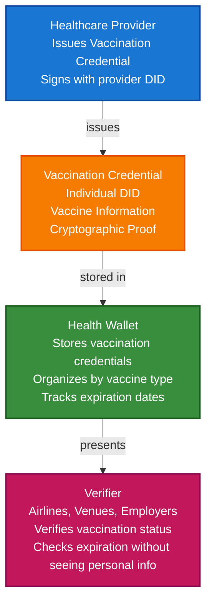

# Vaccination and Health Passport Scenario

This guide demonstrates how to build a complete vaccination and health passport system using VeriCore. You'll learn how healthcare providers can issue vaccination credentials, how individuals can store them in wallets, and how verifiers (airlines, venues, employers) can verify vaccination status while preserving privacy.

## What You'll Build

By the end of this tutorial, you'll have:

- ✅ Created DIDs for healthcare provider (issuer) and individual (holder)
- ✅ Issued Verifiable Credentials for vaccinations
- ✅ Stored vaccination credentials in a health wallet
- ✅ Organized multiple vaccination credentials
- ✅ Created privacy-preserving health presentations
- ✅ Verified vaccination status without revealing personal information
- ✅ Implemented credential expiration and renewal

## Big Picture & Significance

### The Health Passport Challenge

Health passports have become essential for travel, event access, and workplace safety. However, traditional health records are fragmented, not portable, and don't respect privacy. Verifiable credentials solve these problems.

**Industry Context:**
- **Market Size**: Global digital health market projected to reach $659 billion by 2025
- **Travel Impact**: Health credentials required for international travel
- **Event Access**: Many venues require proof of vaccination
- **Privacy Concerns**: Health data is highly sensitive
- **Interoperability**: Need to work across countries and systems

**Why This Matters:**
1. **Privacy**: Share vaccination status without revealing other health information
2. **Portability**: Health credentials work across borders and systems
3. **Verification**: Instant verification without contacting healthcare providers
4. **Security**: Cryptographic proof prevents forgery
5. **Control**: Individuals own and control their health data
6. **Interoperability**: Standard format works globally

### The Health Credential Problem

Traditional health records face critical issues:
- **Fragmentation**: Records scattered across providers
- **No Privacy**: Sharing records reveals all health information
- **Not Portable**: Records tied to specific healthcare systems
- **Verification Slow**: Manual verification takes time
- **Fraud Risk**: Paper records can be forged
- **No Interoperability**: Different systems don't communicate

## Value Proposition

### Problems Solved

1. **Privacy-Preserving**: Share only vaccination status, not full health records
2. **Instant Verification**: Cryptographic proof without contacting providers
3. **Fraud Prevention**: Tamper-proof credentials cannot be forged
4. **Portability**: Credentials work across countries and systems
5. **Self-Sovereign**: Individuals control their health data
6. **Interoperability**: Standard format works globally
7. **Efficiency**: Streamlined verification process

### Business Benefits

**For Healthcare Providers:**
- **Efficiency**: Automated credential issuance
- **Compliance**: Meet health data regulations
- **Trust**: Enhanced trust through verifiable credentials
- **Cost Savings**: Reduced verification workload

**For Individuals:**
- **Privacy**: Control what health information is shared
- **Convenience**: Access credentials from any device
- **Portability**: Credentials work everywhere
- **Security**: Cryptographic protection of health data

**For Verifiers (Airlines, Venues, Employers):**
- **Speed**: Instant verification
- **Trust**: Cryptographic proof of authenticity
- **Compliance**: Meet health and safety requirements
- **Efficiency**: Streamlined access control

### ROI Considerations

- **Verification Speed**: 100x faster than manual verification
- **Fraud Prevention**: Eliminates fake vaccination records
- **Privacy Compliance**: Automated GDPR/HIPAA compliance
- **Cost Reduction**: 80-90% reduction in verification costs
- **User Experience**: Improved user satisfaction

## Understanding the Problem

Traditional health records have several problems:

1. **Fragmentation**: Records scattered across providers
2. **No privacy**: Sharing records reveals all information
3. **Not portable**: Records tied to specific systems
4. **Verification slow**: Manual verification takes time
5. **Fraud risk**: Paper records can be forged

VeriCore solves this by enabling:

- **Privacy-preserving**: Selective disclosure shows only vaccination status
- **Instant verification**: Cryptographic proof without contacting providers
- **Tamper-proof**: Credentials are cryptographically signed
- **Self-sovereign**: Individuals control their health data
- **Interoperable**: Standard format works globally

## How It Works: The Health Passport Flow



## Prerequisites

- Java 21+
- Kotlin 2.2.0+
- Gradle 8.5+
- Basic understanding of Kotlin and coroutines

## Step 1: Add Dependencies

Add VeriCore dependencies to your `build.gradle.kts`:

```kotlin
dependencies {
    // Core VeriCore modules
    implementation("com.geoknoesis.vericore:vericore-all:1.0.0-SNAPSHOT")
    
    // Kotlinx Serialization
    implementation("org.jetbrains.kotlinx:kotlinx-serialization-json:1.6.0")
    
    // Coroutines
    implementation("org.jetbrains.kotlinx:kotlinx-coroutines-core:1.7.3")
}
```

## Step 2: Complete Runnable Example

Here's the full vaccination and health passport flow using the VeriCore facade API:

```kotlin
package com.example.vaccination.healthpassport

import com.geoknoesis.vericore.VeriCore
import com.geoknoesis.vericore.core.*
import com.geoknoesis.vericore.credential.PresentationOptions
import com.geoknoesis.vericore.credential.wallet.Wallet
import com.geoknoesis.vericore.spi.services.WalletCreationOptionsBuilder
import kotlinx.coroutines.runBlocking
import kotlinx.serialization.json.buildJsonObject
import kotlinx.serialization.json.put
import java.time.Instant
import java.time.temporal.ChronoUnit

fun main() = runBlocking {
    println("=".repeat(70))
    println("Vaccination and Health Passport Scenario - Complete End-to-End Example")
    println("=".repeat(70))
    
    // Step 1: Create VeriCore instance
    val vericore = VeriCore.create()
    println("\n✅ VeriCore initialized")
    
    // Step 2: Create DIDs for healthcare provider and individual
    val healthcareProviderDidDoc = vericore.createDid().getOrThrow()
    val healthcareProviderDid = healthcareProviderDidDoc.id
    val healthcareProviderKeyId = healthcareProviderDidDoc.verificationMethod.firstOrNull()?.id
        ?: error("No verification method found")
    
    val individualDidDoc = vericore.createDid().getOrThrow()
    val individualDid = individualDidDoc.id
    
    val airlineDidDoc = vericore.createDid().getOrThrow()
    val airlineDid = airlineDidDoc.id
    
    println("✅ Healthcare Provider DID: $healthcareProviderDid")
    println("✅ Individual DID: $individualDid")
    println("✅ Airline Verifier DID: $airlineDid")
    
    // Step 3: Issue first vaccination credential (COVID-19, Dose 1)
    val vaccination1Credential = vericore.issueCredential(
        issuerDid = healthcareProviderDid,
        issuerKeyId = healthcareProviderKeyId,
        credentialSubject = buildJsonObject {
            put("id", individualDid)
            put("vaccination", buildJsonObject {
                put("vaccineType", "COVID-19")
                put("vaccineName", "Pfizer-BioNTech")
                put("manufacturer", "Pfizer Inc")
                put("lotNumber", "EW0167")
                put("doseNumber", 1)
                put("totalDoses", 2)
                put("vaccinationDate", "2021-03-15")
                put("vaccinationSite", "City Health Clinic")
                put("healthcareProvider", "City Health Services")
                put("batchNumber", "BATCH-2021-001")
            })
        },
        types = listOf("VerifiableCredential", "VaccinationCredential", "HealthCredential"),
        expirationDate = Instant.now().plus(2, ChronoUnit.YEARS).toString()
    ).getOrThrow()
    
    println("\n✅ First vaccination credential issued: ${vaccination1Credential.id}")
    
    // Step 4: Issue second vaccination credential (COVID-19, Dose 2)
    val vaccination2Credential = vericore.issueCredential(
        issuerDid = healthcareProviderDid,
        issuerKeyId = healthcareProviderKeyId,
        credentialSubject = buildJsonObject {
            put("id", individualDid)
            put("vaccination", buildJsonObject {
                put("vaccineType", "COVID-19")
                put("vaccineName", "Pfizer-BioNTech")
                put("manufacturer", "Pfizer Inc")
                put("lotNumber", "EW0189")
                put("doseNumber", 2)
                put("totalDoses", 2)
                put("vaccinationDate", "2021-04-05")
                put("vaccinationSite", "City Health Clinic")
                put("healthcareProvider", "City Health Services")
                put("batchNumber", "BATCH-2021-002")
                put("fullyVaccinated", true)
            })
        },
        types = listOf("VerifiableCredential", "VaccinationCredential", "HealthCredential"),
        expirationDate = Instant.now().plus(2, ChronoUnit.YEARS).toString()
    ).getOrThrow()
    
    println("✅ Second vaccination credential issued: ${vaccination2Credential.id}")
    
    // Step 5: Issue booster vaccination credential
    val boosterCredential = vericore.issueCredential(
        issuerDid = healthcareProviderDid,
        issuerKeyId = healthcareProviderKeyId,
        credentialSubject = buildJsonObject {
            put("id", individualDid)
            put("vaccination", buildJsonObject {
                put("vaccineType", "COVID-19")
                put("vaccineName", "Pfizer-BioNTech Booster")
                put("manufacturer", "Pfizer Inc")
                put("lotNumber", "EW0256")
                put("doseNumber", 3)
                put("totalDoses", 3)
                put("vaccinationDate", "2022-11-20")
                put("vaccinationSite", "City Health Clinic")
                put("healthcareProvider", "City Health Services")
                put("batchNumber", "BATCH-2022-045")
                put("fullyVaccinated", true)
                put("booster", true)
            })
        },
        types = listOf("VerifiableCredential", "VaccinationCredential", "HealthCredential", "BoosterCredential"),
        expirationDate = Instant.now().plus(1, ChronoUnit.YEARS).toString()
    ).getOrThrow()
    
    println("✅ Booster vaccination credential issued: ${boosterCredential.id}")
    
    // Step 6: Create health wallet and store all vaccination credentials
    val healthWallet = vericore.createWallet(
        holderDid = individualDid,
        options = WalletCreationOptionsBuilder().apply {
            enableOrganization = true
            enablePresentation = true
        }.build()
    ).getOrThrow()
    
    val vaccination1Id = healthWallet.store(vaccination1Credential)
    val vaccination2Id = healthWallet.store(vaccination2Credential)
    val boosterId = healthWallet.store(boosterCredential)
    
    println("\n✅ All vaccination credentials stored in health wallet")
    
    // Step 7: Organize credentials by vaccine type
    healthWallet.withOrganization { org ->
        val covid19CollectionId = org.createCollection("COVID-19 Vaccinations", "COVID-19 vaccination records")
        
        org.addToCollection(vaccination1Id, covid19CollectionId)
        org.addToCollection(vaccination2Id, covid19CollectionId)
        org.addToCollection(boosterId, covid19CollectionId)
        
        org.tagCredential(vaccination1Id, setOf("covid19", "dose1", "pfizer", "vaccination"))
        org.tagCredential(vaccination2Id, setOf("covid19", "dose2", "pfizer", "fully-vaccinated", "vaccination"))
        org.tagCredential(boosterId, setOf("covid19", "booster", "pfizer", "fully-vaccinated", "vaccination"))
        
        println("✅ Vaccination credentials organized")
    }
    
    // Step 8: Create privacy-preserving presentation for airline
    // Only shares vaccination status, not personal health information
    val travelPresentation = healthWallet.withPresentation { pres ->
        pres.createPresentation(
            credentialIds = listOf(boosterId), // Only share most recent/valid credential
            holderDid = individualDid,
            options = PresentationOptions(
                holderDid = individualDid,
                challenge = "airline-check-${System.currentTimeMillis()}"
            )
        )
    } ?: error("Presentation capability not available")
    
    println("\n✅ Travel presentation created")
    println("   Holder: ${travelPresentation.holder}")
    println("   Credentials: ${travelPresentation.verifiableCredential.size}")
    
    // Step 9: Airline verifies vaccination status
    println("\n✈️ Airline Verification Process:")
    
    val boosterVerification = vericore.verifyCredential(boosterCredential).getOrThrow()
    
    if (boosterVerification.valid) {
        println("✅ Vaccination Credential: VALID")
        println("   Proof valid: ${boosterVerification.proofValid}")
        println("   Issuer valid: ${boosterVerification.issuerValid}")
        println("   Not expired: ${boosterCredential.expirationDate?.let { 
            Instant.parse(it).isAfter(Instant.now()) 
        } ?: true}")
        
        // Check if fully vaccinated
        val credentialSubject = boosterCredential.credentialSubject
        val vaccination = credentialSubject.jsonObject["vaccination"]?.jsonObject
        val fullyVaccinated = vaccination?.get("fullyVaccinated")?.jsonPrimitive?.content?.toBoolean() ?: false
        
        if (fullyVaccinated) {
            println("✅ Individual is fully vaccinated")
            println("✅ Boarding approved")
        } else {
            println("❌ Individual is not fully vaccinated")
            println("❌ Boarding denied")
        }
    } else {
        println("❌ Vaccination Credential: INVALID")
        println("   Errors: ${boosterVerification.errors}")
        println("❌ Boarding denied")
    }
    
    // Step 10: Check credential expiration and renewal
    println("\n📅 Credential Expiration Check:")
    
    listOf(vaccination1Credential, vaccination2Credential, boosterCredential).forEach { cred ->
        val expirationDate = cred.expirationDate?.let { Instant.parse(it) }
        if (expirationDate != null) {
            val daysUntilExpiration = ChronoUnit.DAYS.between(Instant.now(), expirationDate)
            if (daysUntilExpiration > 0) {
                println("   ${cred.id}: Expires in $daysUntilExpiration days")
            } else {
                println("   ${cred.id}: ⚠️ EXPIRED - Renewal needed")
            }
        }
    }
    
    // Step 11: Display wallet statistics
    val stats = healthWallet.getStatistics()
    println("\n📊 Health Wallet Statistics:")
    println("   Total credentials: ${stats.totalCredentials}")
    println("   Valid credentials: ${stats.validCredentials}")
    println("   Collections: ${stats.collectionsCount}")
    println("   Tags: ${stats.tagsCount}")
    
    // Step 12: Summary
    println("\n" + "=".repeat(70))
    println("✅ VACCINATION HEALTH PASSPORT SYSTEM COMPLETE")
    println("   All vaccination credentials issued and stored")
    println("   Privacy-preserving verification implemented")
    println("   Credential expiration tracking enabled")
    println("=".repeat(70))
}
```

**Expected Output:**
```
======================================================================
Vaccination and Health Passport Scenario - Complete End-to-End Example
======================================================================

✅ VeriCore initialized
✅ Healthcare Provider DID: did:key:z6Mk...
✅ Individual DID: did:key:z6Mk...
✅ Airline Verifier DID: did:key:z6Mk...

✅ First vaccination credential issued: urn:uuid:...
✅ Second vaccination credential issued: urn:uuid:...
✅ Booster vaccination credential issued: urn:uuid:...

✅ All vaccination credentials stored in health wallet
✅ Vaccination credentials organized

✅ Travel presentation created
   Holder: did:key:z6Mk...
   Credentials: 1

✈️ Airline Verification Process:
✅ Vaccination Credential: VALID
   Proof valid: true
   Issuer valid: true
   Not expired: true
✅ Individual is fully vaccinated
✅ Boarding approved

📅 Credential Expiration Check:
   urn:uuid:...: Expires in 730 days
   urn:uuid:...: Expires in 730 days
   urn:uuid:...: Expires in 365 days

📊 Health Wallet Statistics:
   Total credentials: 3
   Valid credentials: 3
   Collections: 1
   Tags: 9

======================================================================
✅ VACCINATION HEALTH PASSPORT SYSTEM COMPLETE
   All vaccination credentials issued and stored
   Privacy-preserving verification implemented
   Credential expiration tracking enabled
======================================================================
```

## Key Features Demonstrated

1. **Multiple Vaccination Credentials**: Track multiple doses and boosters
2. **Privacy-Preserving**: Share only vaccination status, not full health records
3. **Credential Organization**: Organize by vaccine type and dose number
4. **Expiration Tracking**: Monitor credential expiration dates
5. **Selective Disclosure**: Share only necessary credentials
6. **Instant Verification**: Cryptographic verification without contacting providers

## Real-World Extensions

- **International Standards**: Support WHO/ICAO health passport standards
- **Multi-Vaccine Support**: Track multiple vaccine types (COVID-19, flu, etc.)
- **Revocation Lists**: Check against revocation lists for invalid credentials
- **Blockchain Anchoring**: Anchor critical health credentials for permanent records
- **QR Code Generation**: Generate QR codes for easy verification
- **Offline Verification**: Support offline verification scenarios

## Related Documentation

- [Quick Start](../getting-started/quick-start.md) - Get started with VeriCore
- [Common Patterns](../getting-started/common-patterns.md) - Reusable code patterns
- [API Reference](../api-reference/core-api.md) - Complete API documentation
- [Healthcare Medical Records Scenario](healthcare-medical-records-scenario.md) - Related healthcare scenario
- [Troubleshooting](../getting-started/troubleshooting.md) - Common issues and solutions

